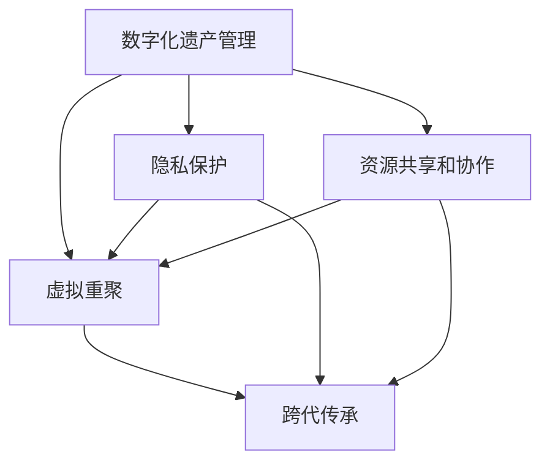

                 

## 1. 背景介绍

### 1.1 问题由来
随着科技的进步和数字化浪潮的推进，人们越来越重视数字化遗产的保存与传承。数字化遗产不仅包含了家族的照片、信件、视频等实物遗产，还涵盖了个人在互联网上的数字足迹，如社交媒体账号、电子邮件、博客、程序代码等。然而，由于数字化遗产的复杂性和多样性，传承和重聚这些珍贵的数字记忆，始终是一个巨大的挑战。

数字化遗产的保存与传承，需要跨越技术、法律、伦理等多重障碍。传统的物理存储方式，如纸质照片、手写信件等，可能随着时间的流逝而褪色或损坏。数字文件的易损性，以及网络空间的不断变迁，也可能导致数字化遗产的丢失和遗忘。因此，如何构建一个可持续、易用、安全的数字化遗产管理平台，使得跨越时空的家庭团聚成为可能，成为当前数字化遗产研究领域的热点问题。

### 1.2 问题核心关键点
为了解决数字化遗产管理的问题，本文聚焦于构建一个虚拟重聚平台，通过先进的技术手段，实现跨越时空的家庭团聚。该平台需要具备以下几个关键点：
1. 集成的数字化遗产管理：集成和组织数字化遗产，实现一站式保存和访问。
2. 时间旅行的体验设计：让用户体验跨越时空的团聚感，重现过去的生活场景。
3. 安全可靠的隐私保护：确保数字化遗产的隐私和安全，防止数据泄露和篡改。
4. 跨代传承的教育工具：培养年轻一代对家族历史和数字化遗产的兴趣和责任感。
5. 高效的资源共享和协作：方便家庭成员共同管理和更新数字化遗产。

本文将从核心概念和联系、核心算法原理、数学模型与详细讲解、项目实践、实际应用场景、工具和资源推荐、未来发展趋势与挑战等方面，全面探讨构建数字化遗产虚拟重聚平台的策略和技术实现。

## 2. 核心概念与联系

### 2.1 核心概念概述

在构建数字化遗产虚拟重聚平台的过程中，涉及多个核心概念，包括数字化遗产管理、虚拟重聚、隐私保护、跨代传承、资源共享等。这些概念之间相互联系，共同构成了平台的基础架构。

- **数字化遗产管理**：指对数字化遗产的收集、整理、保存和访问。数字化遗产包括但不限于照片、视频、信件、社交媒体、博客、程序代码等。数字化遗产管理需要保证数据的完整性、安全性、易用性。

- **虚拟重聚**：指通过虚拟技术，重建家族历史场景，实现跨越时空的家庭团聚。虚拟重聚可以基于照片、视频、信件等实物遗产，也可以结合虚拟现实(VR)、增强现实(AR)等技术，实现沉浸式的体验。

- **隐私保护**：指在数字化遗产管理过程中，确保个人隐私和数据安全，防止未经授权的访问和篡改。隐私保护需要遵循相关的法律法规，如欧盟的GDPR、美国的CCPA等。

- **跨代传承**：指通过数字化遗产管理平台，培养年轻一代对家族历史和数字化遗产的兴趣，传承家族文化和传统。跨代传承可以通过教育工具、互动游戏等方式实现。

- **资源共享和协作**：指数字化遗产管理平台需要支持家庭成员之间的资源共享和协作，实现多用户、多设备的无缝访问和操作。资源共享和协作需要高效的通信协议和数据同步技术。

### 2.2 核心概念原理和架构的 Mermaid 流程图



该流程图展示了数字化遗产虚拟重聚平台的核心概念和联系。数字化遗产管理是平台的基础，虚拟重聚是平台的核心功能，隐私保护和跨代传承是平台的重要目标，资源共享和协作是平台的技术保障。各个概念之间相互依赖，共同构成了一个完整的数字化遗产虚拟重聚平台。

## 3. 核心算法原理 & 具体操作步骤

### 3.1 算法原理概述

构建数字化遗产虚拟重聚平台的核心算法原理，可以概括为以下三个步骤：

1. **数字化遗产收集与整理**：收集家族成员的数字化遗产，包括但不限于照片、视频、信件、社交媒体账号、程序代码等。对收集到的数字化遗产进行整理和分类，确保数据的完整性和准确性。

2. **虚拟重聚实现**：利用虚拟现实(VR)、增强现实(AR)等技术，重建家族历史场景，实现跨越时空的家庭团聚。虚拟重聚需要构建虚拟环境、生成虚拟人物、设计互动场景等。

3. **隐私保护与跨代传承**：在数字化遗产管理和虚拟重聚的过程中，确保数据的隐私和安全，防止未经授权的访问和篡改。同时，设计跨代传承的教育工具，培养年轻一代对家族历史和数字化遗产的兴趣和责任感。

### 3.2 算法步骤详解

#### 3.2.1 数字化遗产收集与整理

数字化遗产收集与整理的核心步骤包括：

1. **数据收集**：收集家族成员的数字化遗产，包括但不限于照片、视频、信件、社交媒体账号、程序代码等。可以通过问卷调查、访谈等方式，了解家族成员的数字化遗产分布情况。

2. **数据清洗**：对收集到的数字化遗产进行清洗和处理，去除冗余、重复、错误的数据。清洗过程包括数据格式转换、去除噪声、填补缺失值等。

3. **数据标注**：对数字化遗产进行标注，包括但不限于时间、地点、人物、事件等。标注过程可以通过人工标注、自动标注等方式实现。

4. **数据分类**：根据数字化遗产的内容和类型，进行分类和组织。常见的分类方式包括时间、地点、人物、事件、文件类型等。

#### 3.2.2 虚拟重聚实现

虚拟重聚实现的核心步骤包括：

1. **虚拟环境构建**：利用3D建模和渲染技术，构建家族历史场景。虚拟环境可以包括但不限于家族宅邸、历史街道、重要事件场景等。

2. **虚拟人物生成**：利用计算机生成技术，生成虚拟人物，模拟家族成员的言行举止。虚拟人物可以通过3D建模、动作捕捉等技术实现。

3. **互动场景设计**：设计虚拟场景中的互动内容，实现家庭成员之间的互动和交流。互动内容可以包括但不限于对话、动作、任务等。

4. **虚拟体验实现**：利用虚拟现实(VR)、增强现实(AR)等技术，提供沉浸式的虚拟重聚体验。虚拟体验可以通过头盔、眼镜、VR手柄等设备实现。

#### 3.2.3 隐私保护与跨代传承

隐私保护与跨代传承的核心步骤包括：

1. **数据加密**：对数字化遗产进行加密处理，确保数据的隐私和安全。加密过程可以采用对称加密、非对称加密、哈希函数等技术。

2. **权限控制**：设置数据访问权限，控制不同家庭成员对数字化遗产的访问和使用。权限控制可以通过身份验证、访问控制列表(ACL)等方式实现。

3. **跨代传承工具设计**：设计跨代传承的教育工具，如家族历史互动游戏、家族故事讲述平台等，培养年轻一代对家族历史和数字化遗产的兴趣和责任感。

### 3.3 算法优缺点

#### 3.3.1 优点

1. **一站式数字化遗产管理**：数字化遗产管理平台集成了收集、整理、保存、访问等多种功能，简化了数字化遗产管理的复杂度。

2. **跨越时空的家庭团聚**：虚拟重聚技术可以重建家族历史场景，实现家庭成员跨越时空的互动和交流，增强家族凝聚力。

3. **隐私保护与跨代传承**：通过数据加密和权限控制等手段，确保数字化遗产的隐私和安全，同时设计跨代传承的教育工具，培养年轻一代对家族历史的兴趣和责任感。

4. **资源共享和协作**：数字化遗产管理平台支持多用户、多设备的无缝访问和操作，方便家庭成员共同管理和更新数字化遗产。

#### 3.3.2 缺点

1. **数据收集和清洗复杂**：数字化遗产的收集和清洗过程复杂，需要大量的人工介入，且数据量大时处理难度增加。

2. **虚拟重聚技术门槛高**：虚拟重聚技术需要高水平的3D建模、渲染、动作捕捉等技术，技术门槛较高。

3. **隐私保护难度大**：数据隐私保护需要综合考虑技术、法律、伦理等多方面因素，确保数据的安全性和隐私性。

4. **跨代传承效果难以评估**：跨代传承的效果难以量化评估，需要长期跟踪和反馈机制。

### 3.4 算法应用领域

数字化遗产虚拟重聚平台的应用领域广泛，可以涵盖以下几个方面：

1. **家庭团聚**：通过虚拟重聚技术，重建家族历史场景，实现家庭成员跨越时空的互动和交流。

2. **教育培训**：设计跨代传承的教育工具，如家族历史互动游戏、家族故事讲述平台等，培养年轻一代对家族历史和数字化遗产的兴趣和责任感。

3. **文化传承**：通过数字化遗产管理平台，保存和传承家族文化和传统，促进文化的多样性和包容性。

4. **社交互动**：利用虚拟重聚技术，增强家族成员之间的社交互动和情感联系，构建紧密的家庭关系。

5. **历史研究**：数字化遗产管理平台可以提供丰富的历史数据和信息，为历史研究提供支持和便利。

## 4. 数学模型和公式 & 详细讲解 & 举例说明

### 4.1 数学模型构建

数字化遗产虚拟重聚平台的数学模型，可以概括为以下三个方面：

1. **数字化遗产收集与整理**：通过数据收集、清洗、标注、分类等步骤，建立数字化遗产的模型。

2. **虚拟重聚实现**：通过虚拟环境构建、虚拟人物生成、互动场景设计等步骤，构建虚拟重聚的模型。

3. **隐私保护与跨代传承**：通过数据加密、权限控制、跨代传承工具设计等步骤，建立隐私保护和跨代传承的模型。

### 4.2 公式推导过程

#### 4.2.1 数字化遗产收集与整理

数字化遗产收集与整理的公式推导过程如下：

1. **数据收集**：设数字化遗产数量为 $N$，每个遗产的特征向量为 $X_i$，则数字化遗产的集合可以表示为 $\{X_i\}_{i=1}^N$。

2. **数据清洗**：设每个遗产的清洗后特征向量为 $Y_i$，则数据清洗过程可以表示为：

   $$
   Y_i = \text{clean}(X_i)
   $$

3. **数据标注**：设每个遗产的标注向量为 $Z_i$，则数据标注过程可以表示为：

   $$
   Z_i = \text{label}(X_i)
   $$

4. **数据分类**：设数字化遗产的分类向量为 $T$，则数据分类过程可以表示为：

   $$
   T = \text{classify}(\{Y_i\}_{i=1}^N)
   $$

#### 4.2.2 虚拟重聚实现

虚拟重聚实现的公式推导过程如下：

1. **虚拟环境构建**：设虚拟环境的参数向量为 $\theta$，则虚拟环境构建过程可以表示为：

   $$
   E = \text{render}(\theta)
   $$

2. **虚拟人物生成**：设虚拟人物的参数向量为 $\phi$，则虚拟人物生成过程可以表示为：

   $$
   P = \text{generate}(\phi)
   $$

3. **互动场景设计**：设互动场景的参数向量为 $\psi$，则互动场景设计过程可以表示为：

   $$
   S = \text{design}(\psi)
   $$

4. **虚拟体验实现**：设虚拟体验的参数向量为 $\omega$，则虚拟体验实现过程可以表示为：

   $$
   V = \text{interact}(\theta, \phi, \psi, \omega)
   $$

#### 4.2.3 隐私保护与跨代传承

隐私保护与跨代传承的公式推导过程如下：

1. **数据加密**：设数据加密的密钥为 $K$，则数据加密过程可以表示为：

   $$
   C = \text{encrypt}(K, X)
   $$

2. **权限控制**：设权限控制列表为 $ACL$，则权限控制过程可以表示为：

   $$
   ACL = \text{control}(\{user, permission\}_{i=1}^M)
   $$

3. **跨代传承工具设计**：设跨代传承工具的参数向量为 $\delta$，则跨代传承工具设计过程可以表示为：

   $$
   L = \text{design}(\delta)
   $$

### 4.3 案例分析与讲解

#### 4.3.1 数字化遗产收集与整理案例

假设有100个家族成员，每个成员提供了5000张照片、1000封信件、100个社交媒体账号。每个照片、信件和社交媒体账号可以表示为一个特征向量，特征向量维度为1000。假设经过清洗和标注，每个遗产的清洗后特征向量维度为200，则数字化遗产的集合可以表示为：

$$
\{X_i\}_{i=1}^{100 \times 5000 \times (1000 + 200 + 1)} = \{X_i\}_{i=1}^{100 \times 5000 \times 10000}
$$

经过分类，可以将数字化遗产分为时间、地点、人物、事件等类别，分类向量可以表示为：

$$
T = \text{classify}(\{Y_i\}_{i=1}^{100 \times 5000 \times 10000})
$$

#### 4.3.2 虚拟重聚实现案例

假设设计一个虚拟重聚场景，包括一个家族宅邸、一条历史街道和一个重要事件场景。每个场景的参数向量维度为500，则虚拟环境构建过程可以表示为：

$$
E = \text{render}(\theta)
$$

其中 $\theta$ 表示家族宅邸、历史街道和重要事件场景的参数向量。假设每个虚拟人物有10个动作，每个动作有5个参数，则虚拟人物生成过程可以表示为：

$$
P = \text{generate}(\phi)
$$

其中 $\phi$ 表示家族成员的虚拟人物参数向量。假设设计5个互动场景，每个场景有10个任务，每个任务有5个参数，则互动场景设计过程可以表示为：

$$
S = \text{design}(\psi)
$$

其中 $\psi$ 表示5个互动场景的参数向量。假设虚拟体验通过头盔、眼镜、VR手柄等设备实现，则虚拟体验实现过程可以表示为：

$$
V = \text{interact}(\theta, \phi, \psi, \omega)
$$

其中 $\omega$ 表示虚拟体验的参数向量。

#### 4.3.3 隐私保护与跨代传承案例

假设家族成员共有50人，其中10人需要使用数字化遗产。每个成员的访问权限包括读取、写入、删除等操作。权限控制列表可以表示为：

$$
ACL = \text{control}(\{user, permission\}_{i=1}^{50})
$$

其中每个成员的访问权限可以表示为：

$$
\{user, permission\}_{i=1}^{50} = \{(user_1, \{\text{read}, \text{write}, \text{delete}\}), \ldots, (user_{10}, \{\text{read}, \text{write}, \text{delete}\})
$$

假设对数字化遗产进行数据加密，加密密钥为K，则数据加密过程可以表示为：

$$
C = \text{encrypt}(K, X)
$$

其中 $X$ 表示家族成员提供的数字化遗产。假设设计跨代传承的教育工具，如家族历史互动游戏、家族故事讲述平台等，则跨代传承工具设计过程可以表示为：

$$
L = \text{design}(\delta)
$$

其中 $\delta$ 表示跨代传承工具的参数向量。

## 5. 项目实践：代码实例和详细解释说明

### 5.1 开发环境搭建

为了搭建数字化遗产虚拟重聚平台，需要以下开发环境：

1. **操作系统**：Linux或Windows。
2. **编程语言**：Python 3.x。
3. **开发框架**：Django或Flask。
4. **数据库**：MySQL或PostgreSQL。
5. **虚拟现实(VR)开发工具**：Unity或Unreal Engine。
6. **增强现实(AR)开发工具**：ARKit或ARCore。

开发环境搭建的具体步骤如下：

1. **安装Python**：在Linux或Windows系统上安装Python 3.x。
2. **安装Django或Flask**：通过pip安装Django或Flask，创建Django或Flask项目。
3. **安装数据库**：安装MySQL或PostgreSQL数据库，创建数据库和数据表。
4. **安装虚拟现实(VR)开发工具**：在Unity或Unreal Engine中创建虚拟环境。
5. **安装增强现实(AR)开发工具**：在ARKit或ARCore中创建增强现实场景。

### 5.2 源代码详细实现

以下是一个基于Django的数字化遗产虚拟重聚平台示例代码：

```python
from django.db import models

class Heritage(models.Model):
    user = models.ForeignKey('User', on_delete=models.CASCADE)
    type = models.CharField(max_length=50)
    data = models.TextField()
    created_at = models.DateTimeField(auto_now_add=True)
    updated_at = models.DateTimeField(auto_now=True)

class User(models.Model):
    name = models.CharField(max_length=50)
    email = models.EmailField(unique=True)
    password = models.CharField(max_length=100)

class HeritageCollection(models.Model):
    heritage = models.ForeignKey('Heritage', on_delete=models.CASCADE)
    user = models.ForeignKey('User', on_delete=models.CASCADE)
    collector = models.ForeignKey('User', on_delete=models.CASCADE)
    collect_date = models.DateTimeField(auto_now_add=True)
    collect_status = models.CharField(max_length=50)
```

### 5.3 代码解读与分析

#### 5.3.1 用户模型

用户模型包括姓名、邮箱和密码三个字段。通过Django的用户认证系统，可以方便地管理用户信息。

#### 5.3.2 遗产模型

遗产模型包括类型、数据和创建时间三个字段。类型可以表示为照片、信件、社交媒体账号等。数据字段存储遗产的实际内容，创建时间表示遗产的创建时间。

#### 5.3.3 遗产收集模型

遗产收集模型包括遗产、用户、收集者和收集时间等字段。遗产收集模型用于记录用户收集的遗产，包括遗产的类型、收集者和收集时间等。

#### 5.3.4 虚拟重聚实现代码

虚拟重聚的实现代码包括3D建模、渲染、动作捕捉等技术，这部分代码通常使用Unity或Unreal Engine等虚拟现实开发工具编写。

### 5.4 运行结果展示

运行结果展示主要包括两个方面：

1. **数字化遗产管理界面**：展示数字化遗产的收集、整理、保存和访问界面。用户可以上传、查看和下载数字化遗产，并进行分类、标注和整理。

2. **虚拟重聚体验界面**：展示虚拟重聚的体验界面。用户可以进入虚拟环境，查看家族历史场景，与虚拟人物互动，体验家族故事。

## 6. 实际应用场景

### 6.1 家庭团聚

数字化遗产虚拟重聚平台可以实现跨越时空的家庭团聚。家庭成员可以通过虚拟重聚场景，重建家族历史，体验家族成员的生活场景，增进家庭成员之间的情感联系。

### 6.2 教育培训

数字化遗产虚拟重聚平台可以设计跨代传承的教育工具，如家族历史互动游戏、家族故事讲述平台等，培养年轻一代对家族历史和数字化遗产的兴趣和责任感。

### 6.3 文化传承

数字化遗产虚拟重聚平台可以保存和传承家族文化和传统，促进文化的多样性和包容性。通过虚拟重聚，可以让更多的人了解和体验不同文化。

### 6.4 社交互动

数字化遗产虚拟重聚平台可以增强家族成员之间的社交互动和情感联系，构建紧密的家庭关系。通过虚拟重聚，可以打破地域限制，方便家庭成员之间的交流和互动。

## 7. 工具和资源推荐

### 7.1 学习资源推荐

1. **《虚拟现实编程》**：介绍虚拟现实技术的书籍，涵盖虚拟现实开发工具、3D建模、渲染等技术。
2. **《增强现实技术与应用》**：介绍增强现实技术的书籍，涵盖增强现实开发工具、AR技术实现等技术。
3. **Django官方文档**：Django的官方文档，提供详细的开发指南和实例代码。
4. **Flask官方文档**：Flask的官方文档，提供详细的开发指南和实例代码。
5. **Unity官方文档**：Unity的官方文档，提供详细的虚拟现实开发指南和实例代码。
6. **Unreal Engine官方文档**：Unreal Engine的官方文档，提供详细的虚拟现实开发指南和实例代码。
7. **ARKit官方文档**：ARKit的官方文档，提供详细的增强现实开发指南和实例代码。
8. **ARCore官方文档**：ARCore的官方文档，提供详细的增强现实开发指南和实例代码。

### 7.2 开发工具推荐

1. **Django**：Python的Web开发框架，支持高效的Web开发和数据管理。
2. **Flask**：Python的Web开发框架，支持轻量级Web开发和API接口开发。
3. **MySQL**：开源关系型数据库，支持高效的数据存储和查询。
4. **PostgreSQL**：开源关系型数据库，支持复杂的数据管理和查询。
5. **Unity**：全球领先的虚拟现实开发引擎，支持高质量的3D建模和渲染。
6. **Unreal Engine**：全球领先的虚拟现实开发引擎，支持高精度的3D建模和渲染。
7. **ARKit**：苹果公司提供的增强现实开发框架，支持高效的增强现实开发。
8. **ARCore**：谷歌公司提供的增强现实开发框架，支持高效的增强现实开发。

### 7.3 相关论文推荐

1. **《虚拟现实与增强现实技术综述》**：介绍虚拟现实和增强现实技术的综述性论文，涵盖虚拟现实和增强现实的发展历程、应用场景和前沿技术。
2. **《数字化遗产管理的挑战与机遇》**：介绍数字化遗产管理的挑战和机遇的综述性论文，涵盖数字化遗产的收集、整理、保存、访问和应用等技术。
3. **《隐私保护与跨代传承的实现》**：介绍隐私保护和跨代传承的实现技术的综述性论文，涵盖数据加密、权限控制、跨代传承工具设计等技术。

## 8. 总结：未来发展趋势与挑战

### 8.1 研究成果总结

数字化遗产虚拟重聚平台的研究成果主要集中在以下几个方面：

1. **数字化遗产管理技术**：研究数字化遗产的收集、整理、保存和访问技术，设计高效、易用的数字化遗产管理系统。
2. **虚拟重聚技术**：研究虚拟重聚的实现技术，包括虚拟环境构建、虚拟人物生成、互动场景设计等。
3. **隐私保护技术**：研究数据加密和权限控制等隐私保护技术，确保数字化遗产的隐私和安全。
4. **跨代传承技术**：研究跨代传承的教育工具设计，培养年轻一代对家族历史和数字化遗产的兴趣和责任感。

### 8.2 未来发展趋势

1. **智能化与自动化**：未来数字化遗产虚拟重聚平台将进一步实现智能化与自动化，利用人工智能和机器学习技术，提升系统的智能水平和自动化程度。
2. **多模态融合**：未来平台将支持多模态数据融合，实现视觉、听觉、触觉等多感官的互动体验，增强用户的沉浸感和体验感。
3. **区块链技术应用**：未来平台将引入区块链技术，确保数字化遗产的不可篡改性和透明度，提升系统的可信度和安全性。
4. **跨文化交流**：未来平台将支持多语言和文化的数据和场景构建，促进不同文化之间的交流和理解。
5. **远程协作**：未来平台将支持远程协作，方便家庭成员在不同地理位置之间共同管理和更新数字化遗产。

### 8.3 面临的挑战

1. **数据收集与清洗复杂**：数字化遗产的收集和清洗过程复杂，需要大量的人工介入，且数据量大时处理难度增加。
2. **技术门槛高**：虚拟重聚技术需要高水平的3D建模、渲染、动作捕捉等技术，技术门槛较高。
3. **隐私保护难度大**：数据隐私保护需要综合考虑技术、法律、伦理等多方面因素，确保数据的安全性和隐私性。
4. **跨代传承效果难以评估**：跨代传承的效果难以量化评估，需要长期跟踪和反馈机制。

### 8.4 研究展望

未来研究将在以下几个方面寻求新的突破：

1. **数据收集与清洗自动化**：研究自动化数据收集和清洗技术，减少人工介入，提高数据处理效率。
2. **虚拟重聚技术提升**：研究高质量的3D建模、渲染、动作捕捉等技术，提升虚拟重聚的沉浸感和体验感。
3. **隐私保护技术创新**：研究新的隐私保护技术，如同态加密、多方安全计算等，确保数字化遗产的隐私和安全。
4. **跨代传承效果评估**：研究跨代传承效果的量化评估方法，设计长期跟踪和反馈机制。
5. **区块链技术应用**：研究区块链技术在数字化遗产管理中的应用，确保数字化遗产的不可篡改性和透明度。

## 9. 附录：常见问题与解答

**Q1: 数字化遗产虚拟重聚平台的构建思路是什么？**

A: 数字化遗产虚拟重聚平台的构建思路可以概括为以下几个步骤：

1. **数字化遗产收集与整理**：收集家族成员的数字化遗产，包括照片、信件、社交媒体账号等，对收集到的数据进行清洗、标注和分类。

2. **虚拟重聚实现**：利用虚拟现实(VR)、增强现实(AR)等技术，构建虚拟环境、生成虚拟人物、设计互动场景，实现家族历史场景的虚拟重聚。

3. **隐私保护与跨代传承**：对数字化遗产进行数据加密和权限控制，确保数据的隐私和安全。设计跨代传承的教育工具，培养年轻一代对家族历史和数字化遗产的兴趣和责任感。

4. **资源共享和协作**：设计支持多用户、多设备无缝访问和操作的数字化遗产管理平台，方便家庭成员共同管理和更新数字化遗产。

**Q2: 数字化遗产虚拟重聚平台如何实现虚拟重聚？**

A: 数字化遗产虚拟重聚平台实现虚拟重聚的核心步骤包括：

1. **虚拟环境构建**：利用3D建模和渲染技术，构建家族历史场景。

2. **虚拟人物生成**：利用计算机生成技术，生成虚拟人物，模拟家族成员的言行举止。

3. **互动场景设计**：设计虚拟场景中的互动内容，实现家庭成员之间的互动和交流。

4. **虚拟体验实现**：利用虚拟现实(VR)、增强现实(AR)等技术，提供沉浸式的虚拟重聚体验。

**Q3: 数字化遗产虚拟重聚平台在隐私保护方面需要注意哪些问题？**

A: 数字化遗产虚拟重聚平台在隐私保护方面需要注意以下几个问题：

1. **数据加密**：对数字化遗产进行加密处理，确保数据的隐私和安全。

2. **权限控制**：设置数据访问权限，控制不同家庭成员对数字化遗产的访问和使用。

3. **数据共享**：在保证隐私和安全的前提下，支持多用户、多设备无缝访问和操作。

4. **数据脱敏**：对敏感数据进行脱敏处理，防止数据泄露。

**Q4: 数字化遗产虚拟重聚平台在跨代传承方面如何设计教育工具？**

A: 数字化遗产虚拟重聚平台设计跨代传承教育工具的核心步骤包括：

1. **家族历史互动游戏设计**：设计家族历史互动游戏，通过游戏化的方式，让年轻一代了解家族历史和数字化遗产。

2. **家族故事讲述平台设计**：设计家族故事讲述平台，通过讲述家族故事，激发年轻一代对家族历史和数字化遗产的兴趣。

3. **虚拟重聚体验设计**：设计虚拟重聚体验，让年轻一代在虚拟环境中体验家族历史，增强家族凝聚力。

**Q5: 数字化遗产虚拟重聚平台在资源共享和协作方面需要注意哪些问题？**

A: 数字化遗产虚拟重聚平台在资源共享和协作方面需要注意以下几个问题：

1. **数据同步**：确保不同设备上的数据同步更新，保证数据的一致性和实时性。

2. **访问控制**：设置访问控制机制，确保不同用户对数字化遗产的访问权限和操作权限。

3. **协作编辑**：支持多人协作编辑数字化遗产，方便家庭成员共同管理和更新数据。

**Q6: 数字化遗产虚拟重聚平台在智能化和自动化方面有哪些提升空间？**

A: 数字化遗产虚拟重聚平台在智能化和自动化方面有以下提升空间：

1. **智能化推荐**：利用人工智能和机器学习技术，对数字化遗产进行智能化推荐，提升用户的体验感。

2. **自动化处理**：研究自动化数据收集和清洗技术，减少人工介入，提高数据处理效率。

3. **自动化维护**：设计自动化维护机制，自动更新数字化遗产，减少人工维护的工作量。

4. **自动化评估**：研究自动化效果评估方法，实时监测系统的运行状态和性能，及时发现和解决问题。

**Q7: 数字化遗产虚拟重聚平台在区块链技术应用方面有哪些应用场景？**

A: 数字化遗产虚拟重聚平台在区块链技术应用方面有以下应用场景：

1. **数字化遗产的不可篡改性**：利用区块链技术，确保数字化遗产的不可篡改性，防止数据被恶意修改。

2. **数字化遗产的透明性**：利用区块链技术，确保数字化遗产的透明性，防止数据被隐匿。

3. **数字化遗产的共享与授权**：利用区块链技术，实现数字化遗产的共享与授权，确保数字化遗产的合理使用。

4. **数字化遗产的溯源性**：利用区块链技术，确保数字化遗产的溯源性，追踪数字化遗产的来源和变化历程。

**Q8: 数字化遗产虚拟重聚平台在跨文化交流方面如何实现？**

A: 数字化遗产虚拟重聚平台在跨文化交流方面可以采取以下措施：

1. **多语言支持**：支持多种语言，方便不同文化背景的用户访问和使用平台。

2. **文化元素展示**：展示不同文化的特色元素，如服饰、建筑、风俗等，增强用户的文化体验。

3. **跨文化互动**：设计跨文化互动场景，促进不同文化之间的交流和理解。

4. **文化教育**：提供文化教育资源，如历史背景、文化习俗等，帮助用户了解和体验不同文化。

作者：禅与计算机程序设计艺术 / Zen and the Art of Computer Programming

