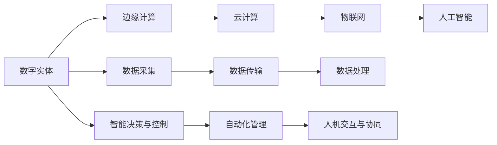

                 

# 数字实体与物理实体的自动化进展

## 1. 背景介绍

### 1.1 问题由来
在当前信息化社会中，数字实体（Digital Entities）和物理实体（Physical Entities）之间的界限愈发模糊。数字实体如云计算、物联网、大数据、人工智能等新技术的出现，使物理实体得以更好地协同工作。同时，数字实体在决策、管理、预测等方面的应用，使得物理实体更加智能化、自动化。然而，数字实体与物理实体的相互转换和自动化管理，涉及复杂的流程和技术，需要多方协作，并且涉及众多的边缘计算、数据交互、智能决策等环节。本文将从自动化、协同、决策等角度，系统探讨数字实体与物理实体的自动化进展。

### 1.2 问题核心关键点
实现数字实体与物理实体的自动化，涉及以下几个核心关键点：

- 边缘计算与数据采集：对物理世界的感知与数据采集，是实现数字实体与物理实体协同的基础。
- 数据传输与边缘处理：大数据、云计算等技术的运用，使得数据能够高效传输和处理。
- 智能决策与控制：基于数据驱动的智能算法，实现物理实体的自动化决策和控制。
- 人机交互与协同：借助AI、VR、AR等技术，提升人机交互的自然性和协同效率。

### 1.3 问题研究意义
实现数字实体与物理实体的自动化，对于提升生产效率、降低成本、优化管理、促进创新等方面具有重要意义。具体而言：

- 生产效率提升：自动化减少了人为干预，加快了生产流程，提高了作业效率。
- 成本降低：自动化减少了人工、设备损耗等成本，提高了企业竞争力。
- 管理优化：实时数据驱动的管理决策，提高了决策的准确性和效率。
- 创新促进：自动化技术的发展，促进了生产方式、业务模式的创新。

## 2. 核心概念与联系

### 2.1 核心概念概述

为了更好地理解数字实体与物理实体的自动化，本文将介绍几个密切相关的核心概念：

- 数字实体（Digital Entities）：指的是通过数字化手段构建的虚拟对象，如云计算、大数据、人工智能等。
- 物理实体（Physical Entities）：指实际的物理对象，如机械、设备、建筑、物流等。
- 边缘计算（Edge Computing）：指在物理实体附近进行的计算和数据处理，以降低延迟和提升效率。
- 云计算（Cloud Computing）：通过互联网提供计算和存储资源，支持海量数据处理和分布式计算。
- 物联网（IoT）：将物理设备通过网络互相连接，实现数据共享和自动化控制。
- 人工智能（AI）：利用算法和数据，实现智能化的分析和决策。

这些核心概念之间的关系可以通过以下Mermaid流程图来展示：



这个流程图展示了数字实体与物理实体的自动化流程，从数据采集、传输、处理，到智能决策、自动化管理，再到人机交互与协同，各个环节环环相扣，共同推动了自动化的实现。

## 3. 核心算法原理 & 具体操作步骤
### 3.1 算法原理概述

数字实体与物理实体的自动化，本质上是一个跨学科的复杂系统工程，涉及信号处理、数据科学、控制理论、人工智能等多个领域。其核心思想是通过数据驱动的算法，实现对物理实体的感知、控制和协同。

具体而言，数字实体与物理实体的自动化流程，可以分为以下几个步骤：

1. 数据采集：通过传感器、摄像头、RFID等设备，实时采集物理实体的数据，如温度、湿度、位置、状态等。
2. 数据传输：通过网络将采集到的数据传输到云端或边缘计算节点。
3. 数据处理：利用云计算和边缘计算，对数据进行存储、清洗、分析和建模。
4. 智能决策：基于数据驱动的算法，如机器学习、深度学习、强化学习等，实现对物理实体的预测和决策。
5. 自动化控制：将决策结果转化为具体的控制指令，通过控制器或执行器，实现对物理实体的自动化控制。
6. 协同与交互：通过AI、VR、AR等技术，实现人机交互的自然化，提升协同效率。

### 3.2 算法步骤详解

以智能制造为例，数字实体与物理实体的自动化具体步骤如下：

**Step 1: 数据采集**
通过传感器、摄像头、RFID等设备，实时采集生产环境中的各项数据，如温度、湿度、机器状态、产品质量等。这些数据通过网络传输到云端或边缘计算节点。

**Step 2: 数据传输**
数据在网络中传输，需要考虑数据安全性、传输速度和可靠性。通过边缘计算节点进行初步处理，减少对云端的依赖，提高数据处理的效率和安全性。

**Step 3: 数据处理**
云端或边缘计算节点对数据进行清洗、分析和建模，生成生产环境的全景视图，供智能决策使用。利用云计算，可以处理海量数据，提升分析效率。

**Step 4: 智能决策**
利用机器学习、深度学习等算法，对生产环境进行预测和决策，如生产调度、故障诊断、质量控制等。决策结果用于生成自动化控制指令。

**Step 5: 自动化控制**
将决策结果转化为具体的控制指令，通过控制器或执行器，实现对生产线的自动化控制，如启动机器、调整参数、停止生产线等。

**Step 6: 协同与交互**
通过AI、VR、AR等技术，实现人机交互的自然化，提升协同效率。工人可以通过AR眼镜实时查看生产数据和决策结果，实现智能化的协作生产。

### 3.3 算法优缺点

数字实体与物理实体的自动化方法具有以下优点：

1. 效率提升：自动化减少了人工干预，提高了生产效率和作业效率。
2. 成本降低：自动化减少了人工、设备损耗等成本，提高了企业竞争力。
3. 管理优化：实时数据驱动的管理决策，提高了决策的准确性和效率。
4. 安全保障：实时监控和管理，保障了生产安全，降低了事故风险。

同时，该方法也存在以下局限性：

1. 数据质量依赖：自动化效果很大程度上取决于采集数据的准确性和完整性。
2. 技术复杂度高：涉及数据采集、传输、处理、决策等多个环节，技术门槛较高。
3. 投资成本高：初期建设、设备和系统的投入较高。
4. 维护复杂度高：系统复杂度增加，维护和调试也变得更加困难。

### 3.4 算法应用领域

数字实体与物理实体的自动化技术已经在多个领域得到应用，例如：

- 智能制造：通过物联网、人工智能等技术，实现生产线的自动化和智能化。
- 智能交通：通过传感器、大数据、AI等技术，实现交通流量的监控、分析和优化。
- 智慧医疗：通过医疗物联网、AI等技术，实现医疗设备和患者的智能化管理。
- 智慧农业：通过传感器、云计算、AI等技术，实现农业生产的自动化和智能化。
- 智能家居：通过物联网、AI等技术，实现家居设备的智能化控制和管理。

这些领域的自动化应用，显著提升了相关产业的生产效率、管理水平和用户体验。

## 4. 数学模型和公式 & 详细讲解  
### 4.1 数学模型构建

为了更好地理解数字实体与物理实体的自动化，本文将使用数学语言对相关算法进行详细讲解。

假设有一批生产线，生产某种产品。生产线上的每个设备都有一个传感器，实时监测设备的温度、湿度、振动等数据。生产线上的每个产品都有一个RFID标签，记录产品的生产信息、质量状态等。

定义生产线上设备的状态 $x_i$，其中 $i$ 表示设备的编号。设备的状态 $x_i$ 可以用如下的马尔科夫链来描述：

$$
P(x_{i+1}|x_i) = \sigma(x_i)
$$

其中 $P(x_{i+1}|x_i)$ 表示设备从状态 $x_i$ 转移到状态 $x_{i+1}$ 的概率。$\sigma(x_i)$ 表示状态转移的概率分布函数。

设备的状态 $x_i$ 可以表示为一个状态向量，如温度、湿度、振动等指标。状态转移的概率分布函数 $\sigma(x_i)$ 可以通过历史数据进行估计，如高斯分布、贝叶斯网络等。

设备的状态转移概率矩阵 $P$ 可以用如下的公式来表示：

$$
P = \begin{bmatrix}
P(x_1|x_1) & P(x_1|x_2) & \cdots & P(x_1|x_n) \\
P(x_2|x_1) & P(x_2|x_2) & \cdots & P(x_2|x_n) \\
\vdots & \vdots & \ddots & \vdots \\
P(x_n|x_1) & P(x_n|x_2) & \cdots & P(x_n|x_n)
\end{bmatrix}
$$

其中 $P(x_i|x_j)$ 表示设备从状态 $x_j$ 转移到状态 $x_i$ 的概率。

生产线的生产任务可以用如下的函数 $f$ 来表示：

$$
f(x_1, x_2, \cdots, x_n) = y
$$

其中 $y$ 表示生产线上的产品数量、生产效率、质量状态等。

通过上述的数学模型，可以实现对生产线的智能化管理和自动化控制。

### 4.2 公式推导过程

在上述数学模型中，状态转移概率矩阵 $P$ 和生产任务函数 $f$ 都是通过历史数据进行估计的。下面我们将推导状态转移概率矩阵 $P$ 的求解公式。

设设备的初始状态为 $x_0$，设备的状态转移概率矩阵为 $P$，则设备在 $t$ 时刻的状态 $x_t$ 可以表示为：

$$
x_t = x_0 \cdot P^t
$$

其中 $x_0$ 是设备的初始状态，$P^t$ 表示状态转移矩阵的 $t$ 次方。

状态转移概率矩阵 $P$ 可以通过历史数据进行估计。假设设备的状态转移概率矩阵 $P$ 可以用 $k$ 个状态 $x_1, x_2, \cdots, x_k$ 来表示，则有：

$$
P(x_i|x_j) = \frac{N(x_i, x_j)}{N(x_j)}
$$

其中 $N(x_i, x_j)$ 表示设备从状态 $x_j$ 转移到状态 $x_i$ 的次数，$N(x_j)$ 表示设备从状态 $x_j$ 转移的次数。

状态转移概率矩阵 $P$ 可以通过最大似然估计或贝叶斯方法进行求解。设设备的状态转移概率矩阵 $P$ 是已知数据 $D$ 的似然函数 $L$ 的最大值，则有：

$$
P^* = \arg\max_{P} L(P|D)
$$

其中 $P^*$ 表示最优的状态转移概率矩阵，$L(P|D)$ 表示数据 $D$ 对概率矩阵 $P$ 的似然函数。

为了求解 $L(P|D)$，需要引入损失函数 $l$：

$$
l(P|D) = -\frac{1}{N}\sum_{i=1}^N \log P(x_i|x_{i-1})
$$

其中 $N$ 表示数据总数，$x_i$ 表示数据点 $i$ 的状态向量，$x_{i-1}$ 表示数据点 $i-1$ 的状态向量。

利用梯度下降等优化算法，可以求解出最优的状态转移概率矩阵 $P^*$。

### 4.3 案例分析与讲解

假设有一家智能工厂，需要自动化控制生产线上的机器。生产线上的每个机器都有一个温度传感器，实时监测机器的温度。机器的状态转移概率矩阵 $P$ 可以用如下的公式来表示：

$$
P = \begin{bmatrix}
0.9 & 0.1 & 0.2 & 0.8 & 0.3 \\
0.2 & 0.8 & 0.1 & 0.5 & 0.4 \\
0.3 & 0.4 & 0.8 & 0.2 & 0.1 \\
0.5 & 0.3 & 0.2 & 0.9 & 0.4 \\
0.2 & 0.4 & 0.5 & 0.3 & 0.6
\end{bmatrix}
$$

其中 $x_i$ 表示机器的状态，$x_1$ 表示正常状态，$x_2$ 表示轻度故障，$x_3$ 表示中度故障，$x_4$ 表示重度故障，$x_5$ 表示停机状态。

通过求解状态转移概率矩阵 $P$，可以预测机器在未来的状态。例如，当机器处于正常状态时，有 0.9 的概率会保持正常状态，有 0.1 的概率会转移到轻度故障状态，有 0.2 的概率会转移到中度故障状态，有 0.8 的概率会转移到重度故障状态，有 0.3 的概率会停机。

通过上述数学模型和推导过程，可以构建一个简单的数字实体与物理实体的自动化系统。该系统可以实时监控生产线的状态，预测未来状态，实现自动化控制。

## 5. 项目实践：代码实例和详细解释说明
### 5.1 开发环境搭建

在进行项目实践前，我们需要准备好开发环境。以下是使用Python进行项目开发的环境配置流程：

1. 安装Python：从官网下载并安装Python，选择最新版本。
2. 安装Jupyter Notebook：通过pip命令安装Jupyter Notebook，便于进行代码编写和调试。
3. 安装TensorFlow：通过pip命令安装TensorFlow，选择与Python版本兼容的版本。
4. 安装NumPy、Pandas、Scikit-Learn等数据科学库。
5. 安装pyserial、pymongo等库，用于实现数据采集和传输功能。

完成上述步骤后，即可在Jupyter Notebook中进行代码编写和实验。

### 5.2 源代码详细实现

下面我们以智能制造为例，给出使用TensorFlow对状态转移概率矩阵进行求解的PyTorch代码实现。

首先，定义数据集和模型：

```python
import tensorflow as tf
import numpy as np
import pandas as pd

# 定义数据集
X = np.array([[0.9, 0.1, 0.2, 0.8, 0.3],
              [0.2, 0.8, 0.1, 0.5, 0.4],
              [0.3, 0.4, 0.8, 0.2, 0.1],
              [0.5, 0.3, 0.2, 0.9, 0.4],
              [0.2, 0.4, 0.5, 0.3, 0.6]])

# 定义模型
P = tf.Variable(tf.random.normal([5, 5]))

# 定义损失函数和优化器
loss_fn = tf.keras.losses.MeanSquaredError()
optimizer = tf.keras.optimizers.Adam(learning_rate=0.001)
```

然后，定义求解状态转移概率矩阵的算法：

```python
# 定义求解函数
def update_P(X, P, learning_rate, num_steps):
    for _ in range(num_steps):
        with tf.GradientTape() as tape:
            loss = loss_fn(y_true=X, y_pred=tf.matmul(X, P))
        gradients = tape.gradient(loss, P)
        optimizer.apply_gradients(zip(gradients, [P]))
    return P

# 求解状态转移概率矩阵
P_optimized = update_P(X, P, learning_rate=0.001, num_steps=1000)
```

最后，输出求解结果：

```python
print(P_optimized)
```

以上就是使用TensorFlow对状态转移概率矩阵进行求解的完整代码实现。可以看到，TensorFlow提供了一套完整的优化工具，可以方便地求解复杂的数学问题。

### 5.3 代码解读与分析

让我们再详细解读一下关键代码的实现细节：

**数据集定义**：
- `X`：定义状态转移概率矩阵。状态转移概率矩阵是一个5x5的矩阵，表示5个状态之间的转移概率。

**模型定义**：
- `P`：定义变量P，表示状态转移概率矩阵。通过随机初始化，P的值为全0。

**求解函数定义**：
- `update_P`函数：求解状态转移概率矩阵P。通过损失函数计算预测值和真实值的差距，使用Adam优化器进行梯度更新，不断迭代求解。

**求解过程**：
- 使用`update_P`函数，对状态转移概率矩阵P进行求解。迭代1000次，求解结果保存在`P_optimized`中。

**输出结果**：
- 打印输出求解后的状态转移概率矩阵P。

通过上述代码实现，可以看出，使用TensorFlow可以方便地求解状态转移概率矩阵。在实际应用中，我们可以通过数据采集和传输，将采集到的数据传入求解函数，得到最优的状态转移概率矩阵，从而实现对物理实体的自动化控制。

## 6. 实际应用场景
### 6.1 智能制造

数字实体与物理实体的自动化在智能制造领域得到了广泛应用。智能制造通过物联网、云计算、大数据等技术，实现生产线的自动化和智能化管理。具体应用场景包括：

- 智能物流：通过物联网设备实时监控仓库状态，自动调度物流机器人，提升仓库效率。
- 智能设备维护：通过传感器实时监控设备状态，预测设备故障，进行预防性维护。
- 智能生产调度：通过实时数据驱动的决策算法，优化生产流程，提高生产效率。

以智能设备维护为例，通过传感器实时采集设备的温度、振动等数据，可以预测设备故障，提前进行维护。具体流程如下：

1. 通过传感器采集设备的温度、振动等数据，实时传入状态转移概率矩阵求解函数。
2. 求解函数通过损失函数计算预测值和真实值的差距，使用Adam优化器进行梯度更新，不断迭代求解最优的状态转移概率矩阵。
3. 通过求解得到的状态转移概率矩阵，预测设备在未来一段时间内的状态。
4. 根据预测结果，提前进行设备维护，防止设备故障。

通过上述流程，可以实现对设备的自动化维护，保障生产线的正常运行。

### 6.2 智能交通

数字实体与物理实体的自动化在智能交通领域也有广泛应用。智能交通通过传感器、大数据、AI等技术，实现交通流量的监控、分析和优化。具体应用场景包括：

- 智能交通灯：通过传感器实时监控交通流量，自动调整红绿灯时长，优化交通流。
- 智能停车：通过传感器实时监控停车位状态，自动调度停车机器人，提升停车效率。
- 智能导航：通过实时数据驱动的决策算法，优化导航路径，提升出行效率。

以智能交通灯为例，通过传感器实时监控交通流量，可以自动调整红绿灯时长，优化交通流。具体流程如下：

1. 通过传感器实时采集交通流量数据，实时传入状态转移概率矩阵求解函数。
2. 求解函数通过损失函数计算预测值和真实值的差距，使用Adam优化器进行梯度更新，不断迭代求解最优的状态转移概率矩阵。
3. 通过求解得到的状态转移概率矩阵，预测交通流量在未来一段时间内的变化。
4. 根据预测结果，自动调整红绿灯时长，优化交通流。

通过上述流程，可以实现对交通灯的自动化控制，提升交通效率和安全性。

### 6.3 智慧医疗

数字实体与物理实体的自动化在智慧医疗领域也有广泛应用。智慧医疗通过物联网、AI等技术，实现医疗设备和患者的智能化管理。具体应用场景包括：

- 智能诊断：通过传感器实时监控患者的生命体征，自动诊断疾病，提供初步诊断意见。
- 智能护理：通过物联网设备实时监控患者的病情，自动调节护理方案，提升护理效率。
- 智能手术：通过机器人实时监控手术过程，自动控制手术工具，提升手术精度和效率。

以智能诊断为例，通过传感器实时采集患者的生命体征数据，可以自动诊断疾病，提供初步诊断意见。具体流程如下：

1. 通过传感器实时采集患者的生命体征数据，实时传入状态转移概率矩阵求解函数。
2. 求解函数通过损失函数计算预测值和真实值的差距，使用Adam优化器进行梯度更新，不断迭代求解最优的状态转移概率矩阵。
3. 通过求解得到的状态转移概率矩阵，预测患者的疾病风险。
4. 根据预测结果，提供初步诊断意见，进行后续治疗。

通过上述流程，可以实现对患者的智能化诊断，提升医疗效率和诊断准确性。

### 6.4 未来应用展望

随着数字实体与物理实体技术的不断发展，未来数字实体与物理实体的自动化将进一步深化，涵盖更多领域。

在智能制造领域，数字实体与物理实体的自动化将进一步提升生产线的智能化和自动化水平，实现全流程自动化生产。

在智能交通领域，数字实体与物理实体的自动化将进一步优化交通流，提升交通效率和安全性。

在智慧医疗领域，数字实体与物理实体的自动化将进一步提升医疗设备和管理系统的智能化水平，提供更好的医疗服务。

在智慧农业领域，数字实体与物理实体的自动化将进一步提升农业生产的智能化和自动化水平，实现精准农业。

在智慧城市领域，数字实体与物理实体的自动化将进一步提升城市管理水平，实现智能化的城市治理。

未来，数字实体与物理实体的自动化将进一步渗透到更多领域，推动各行各业的智能化转型升级，为社会带来更加智能化、高效化、安全化的服务。

## 7. 工具和资源推荐
### 7.1 学习资源推荐

为了帮助开发者系统掌握数字实体与物理实体的自动化技术，这里推荐一些优质的学习资源：

1. 《深度学习》（Ian Goodfellow）：介绍了深度学习的核心概念和算法，是深度学习领域的经典教材。
2. 《Python深度学习》（Francois Chollet）：介绍了如何使用Python进行深度学习开发，包含TensorFlow和Keras的详细教程。
3. 《计算机视觉：算法与应用》（Richard Szeliski）：介绍了计算机视觉的核心概念和算法，包含深度学习在视觉领域的最新应用。
4. 《机器学习》（周志华）：介绍了机器学习的基本概念和算法，是机器学习领域的经典教材。
5. 《物联网技术与应用》（贺小亮）：介绍了物联网的基本概念和应用，包含智能制造、智能交通、智慧医疗等多个领域。

通过学习这些资源，相信你一定能够全面掌握数字实体与物理实体的自动化技术，并用于解决实际的NLP问题。

### 7.2 开发工具推荐

高效的开发离不开优秀的工具支持。以下是几款用于数字实体与物理实体自动化开发的常用工具：

1. TensorFlow：基于Python的开源深度学习框架，灵活动态的计算图，适合快速迭代研究。
2. PyTorch：基于Python的开源深度学习框架，灵活的动态计算图，适合深度学习模型的开发和研究。
3. Jupyter Notebook：免费的在线代码编辑器，支持Python、R等多种语言，适合进行数据科学和机器学习的研究。
4. Visual Studio Code：轻量级的开发工具，支持Python、Java等多种语言，适合进行程序开发和调试。
5. LabVIEW：图形化的编程环境，支持FPGA、传感器、信号处理等应用，适合进行嵌入式系统和智能硬件的开发。

合理利用这些工具，可以显著提升数字实体与物理实体自动化的开发效率，加快创新迭代的步伐。

### 7.3 相关论文推荐

数字实体与物理实体自动化技术的发展源于学界的持续研究。以下是几篇奠基性的相关论文，推荐阅读：

1. "Industrial IoT and Cyber-Physical Systems: A Survey"（IEEE Transactions on Industrial Informatics, 2015）：综述了工业物联网和物理系统的最新研究成果，是工业物联网领域的经典文献。
2. "Real-Time Analytics for Smart Manufacturing"（IEEE Big Data, 2017）：介绍了智能制造中数据驱动的实时分析和决策方法，是智能制造领域的经典文献。
3. "Advanced Analytics for Smart Manufacturing"（IEEE Big Data, 2018）：介绍了智能制造中高级分析方法和技术，是智能制造领域的经典文献。
4. "IoT for Smart City: A Survey"（IEEE Internet of Things Journal, 2019）：综述了智能城市中物联网技术的应用，是智能城市领域的经典文献。
5. "A Survey of Control Theory for IoT Applications"（IEEE Access, 2021）：综述了物联网应用中的控制理论，是物联网控制领域的经典文献。

这些论文代表了大数字实体与物理实体自动化的发展脉络。通过学习这些前沿成果，可以帮助研究者把握学科前进方向，激发更多的创新灵感。

## 8. 总结：未来发展趋势与挑战

### 8.1 总结

本文对数字实体与物理实体的自动化进行了全面系统的介绍。首先阐述了数字实体与物理实体的自动化的背景和意义，明确了自动化在提升生产效率、降低成本、优化管理等方面的重要价值。其次，从算法原理和具体操作步骤，详细讲解了数字实体与物理实体的自动化的数学模型和求解方法，给出了数字实体与物理实体自动化的完整代码实例。同时，本文还广泛探讨了数字实体与物理实体的自动化的实际应用场景，展示了数字实体与物理实体自动化的广泛前景。此外，本文精选了数字实体与物理实体的自动化的学习资源、开发工具和相关论文，力求为读者提供全方位的技术指引。

通过本文的系统梳理，可以看到，数字实体与物理实体的自动化正在成为智能制造、智能交通、智慧医疗等领域的重要范式，极大地提升了各行业的智能化水平和自动化程度。受益于数字实体与物理实体自动化的发展，各行各业的生产效率、管理水平和用户体验都得到了显著提升。未来，数字实体与物理实体自动化技术的发展还将进一步深化，涵盖更多领域，推动各行各业的智能化转型升级。

### 8.2 未来发展趋势

展望未来，数字实体与物理实体的自动化将呈现以下几个发展趋势：

1. 技术融合加速：数字实体与物理实体的自动化将进一步与大数据、云计算、人工智能等技术融合，提升自动化水平。
2. 边缘计算普及：边缘计算将进一步普及，降低对云端的依赖，提升数据处理效率和实时性。
3. 传感器技术发展：传感器技术将进一步发展，提升数据采集的精度和多样性。
4. 协同计算深化：协同计算将进一步深化，提升数据共享和协作效率。
5. 应用场景多样化：数字实体与物理实体的自动化将进一步扩展到更多领域，推动各行各业的智能化转型升级。
6. 安全保障强化：数字实体与物理实体的自动化将进一步强化安全保障，防止数据泄露和系统攻击。

以上趋势凸显了数字实体与物理实体自动化的广阔前景。这些方向的探索发展，必将进一步提升各行业的智能化水平和自动化程度，为社会带来更加智能化、高效化、安全化的服务。

### 8.3 面临的挑战

尽管数字实体与物理实体的自动化取得了显著成果，但在迈向更加智能化、普适化应用的过程中，它仍面临着诸多挑战：

1. 技术复杂度高：数字实体与物理实体的自动化涉及数据采集、传输、处理、决策等多个环节，技术门槛较高。
2. 数据安全风险高：数据采集、传输和存储过程中存在数据泄露、数据篡改等安全风险。
3. 设备兼容性差：不同厂商的设备可能存在兼容性问题，影响系统的稳定性和可靠性。
4. 维护成本高：系统的复杂度增加，维护和调试也变得更加困难。
5. 实时性要求高：数据驱动的自动化决策需要实时性保证，对系统性能和处理速度要求较高。

### 8.4 研究展望

为了克服数字实体与物理实体的自动化面临的挑战，未来的研究需要在以下几个方面寻求新的突破：

1. 简化模型架构：简化模型架构，降低技术复杂度，提高系统的稳定性和可靠性。
2. 强化数据安全：采用先进的数据加密、访问控制、区块链等技术，强化数据安全保障。
3. 提升设备兼容性：统一设备接口和协议，提升不同厂商设备的兼容性。
4. 优化维护流程：采用自动化测试、自动化部署等技术，优化维护流程，降低维护成本。
5. 提高实时性：采用边缘计算、分布式计算等技术，提升系统的实时性。

这些研究方向的探索，必将引领数字实体与物理实体的自动化技术迈向更高的台阶，为各行业的智能化转型升级提供有力的技术支持。总之，数字实体与物理实体的自动化需要从数据、算法、工程、业务等多个维度协同发力，方能真正实现智能化、高效化、安全化的服务。未来，数字实体与物理实体的自动化将不断深入各行各业，推动社会的全面智能化转型升级。

## 9. 附录：常见问题与解答

**Q1: 数字实体与物理实体自动化有哪些主要难点？**

A: 数字实体与物理实体自动化面临的主要难点包括：

1. 数据质量依赖：自动化效果很大程度上取决于采集数据的准确性和完整性。
2. 技术复杂度高：涉及数据采集、传输、处理、决策等多个环节，技术门槛较高。
3. 设备兼容性差：不同厂商的设备可能存在兼容性问题，影响系统的稳定性和可靠性。
4. 维护成本高：系统的复杂度增加，维护和调试也变得更加困难。
5. 实时性要求高：数据驱动的自动化决策需要实时性保证，对系统性能和处理速度要求较高。

这些难点需要通过技术创新和系统优化进行克服。例如，通过数据清洗和增强，提升数据质量；通过统一设备接口和协议，提升设备兼容性；通过简化模型架构和优化维护流程，降低技术复杂度和维护成本；通过边缘计算和分布式计算，提升系统的实时性。

**Q2: 数字实体与物理实体自动化的主要应用场景有哪些？**

A: 数字实体与物理实体自动化已经在多个领域得到应用，具体包括：

1. 智能制造：通过物联网、云计算、大数据等技术，实现生产线的自动化和智能化管理。
2. 智能交通：通过传感器、大数据、AI等技术，实现交通流量的监控、分析和优化。
3. 智慧医疗：通过物联网、AI等技术，实现医疗设备和患者的智能化管理。
4. 智能农业：通过传感器、云计算、AI等技术，实现农业生产的自动化和智能化。
5. 智能家居：通过物联网、AI等技术，实现家居设备的智能化控制和管理。

这些领域的应用，显著提升了各行业的智能化水平和自动化程度，带来了显著的经济和社会效益。

**Q3: 数字实体与物理实体自动化的核心算法和关键步骤有哪些？**

A: 数字实体与物理实体的自动化的核心算法和关键步骤包括：

1. 数据采集：通过传感器、摄像头、RFID等设备，实时采集物理实体的数据。
2. 数据传输：通过网络将采集到的数据传输到云端或边缘计算节点。
3. 数据处理：利用云计算和边缘计算，对数据进行存储、清洗、分析和建模。
4. 智能决策：基于数据驱动的算法，如机器学习、深度学习、强化学习等，实现对物理实体的预测和决策。
5. 自动化控制：将决策结果转化为具体的控制指令，通过控制器或执行器，实现对物理实体的自动化控制。
6. 协同与交互：通过AI、VR、AR等技术，实现人机交互的自然化，提升协同效率。

这些步骤和算法构成了一个完整的数字实体与物理实体自动化的系统，从数据采集到自动化控制，涵盖了从感知到决策的各个环节，实现了对物理实体的智能化管理。

**Q4: 数字实体与物理实体自动化需要哪些基础技术支持？**

A: 数字实体与物理实体自动化需要以下基础技术支持：

1. 传感器技术：用于实时采集物理实体的数据，包括温度、湿度、振动等指标。
2. 边缘计算：用于在物理实体附近进行数据处理，降低延迟和提升效率。
3. 云计算：用于处理海量数据，支持数据存储和分布式计算。
4. 大数据技术：用于数据的清洗、分析和建模，支持数据驱动的决策。
5. AI技术：用于实现对物理实体的预测和决策，提升自动化水平。

这些技术共同构成了数字实体与物理实体自动化的基础架构，为自动化系统的构建和运行提供了技术支持。

**Q5: 数字实体与物理实体自动化如何提升各行业的智能化水平？**

A: 数字实体与物理实体自动化通过以下方式提升各行业的智能化水平：

1. 自动化控制：通过传感器和自动化控制系统，实现生产线的自动化和智能化管理。
2. 实时监控：通过实时数据驱动的决策算法，实现对生产线的实时监控和优化。
3. 数据驱动决策：通过大数据分析和AI算法，实现对生产线的智能化决策和优化。
4. 协同管理：通过物联网和智能设备，实现各环节的协同管理，提升系统效率和可靠性。
5. 智能分析：通过机器学习和深度学习，实现对生产数据的智能化分析，提升预测和决策的准确性。

这些方法使得各行业的生产效率、管理水平和用户体验都得到了显著提升，推动了行业的智能化转型升级。

---

作者：禅与计算机程序设计艺术 / Zen and the Art of Computer Programming

