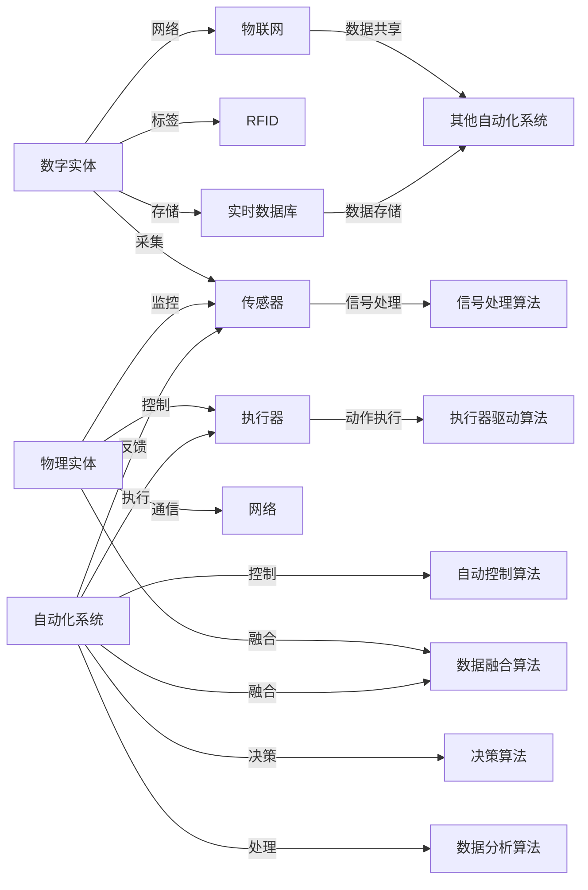
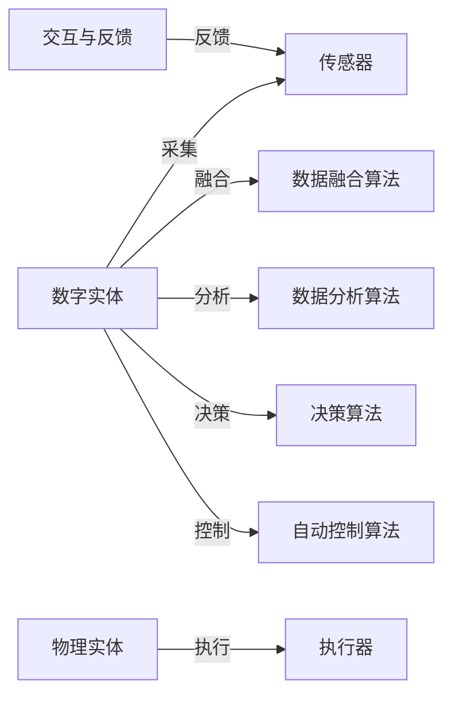

                 

# 数字实体和物理实体自动化刚开始

> 关键词：实体自动化, 数字实体, 物理实体, 自动化系统, 人工智能, 机器人技术, 物联网, 自动控制

## 1. 背景介绍

### 1.1 问题由来

近年来，随着科技的飞速发展，数字化与自动化的融合趋势愈发明显。数字实体和物理实体的自动化集成，已经成为各行业转型升级的关键突破口。从制造业的智能生产线到零售业的无人店铺，从医疗健康的远程监控到智能家居的环境控制，实体自动化技术正在开启一场前所未有的变革。

然而，尽管实体自动化的潜力和应用前景广阔，但在实际落地过程中，依然面临着诸多挑战：

- 数据采集与融合难度大：各种设备和传感器采集的数据格式、协议各异，数据集成复杂。
- 自动化决策难度高：实体自动化系统需要实时分析海量数据，并根据环境变化动态调整策略。
- 安全性与可靠性不足：实体自动化系统可能受到网络攻击、设备故障等影响，造成严重后果。
- 系统规模庞大：许多实体自动化系统涉及多个设备和子系统，系统复杂度极高。

因此，开发一种高效、灵活、可靠的实体自动化技术，成为当下科研和工程界的共同目标。本文旨在全面介绍数字实体和物理实体的自动化技术，包括核心概念、核心算法和具体操作步骤，并通过数学模型、代码实例和实际应用案例，为读者提供全方位的技术指南。

## 2. 核心概念与联系

### 2.1 核心概念概述

本节将详细阐述实体自动化技术中涉及的几个核心概念：

- **数字实体(Digital Entity)**：通过传感器、标签、RFID等技术采集的、以数字形式存在的数据。数字实体是实体自动化的重要组成部分，其数据准确性直接影响自动化系统的决策效果。
- **物理实体(Physical Entity)**：实际世界中的物理对象，如机器设备、物品、环境等。物理实体的状态和行为直接驱动数字实体的生成和变化。
- **自动化系统(Autonomous System)**：通过传感器、执行器等硬件设备，结合软件算法，对数字实体和物理实体的状态进行自动监测、控制和决策的系统。自动化系统是实现实体自动化的关键技术。
- **机器人技术(Robotics)**：涵盖感知、规划、控制、导航等技术，专注于自动完成复杂物理任务的机器。机器人技术是自动化系统的核心子系统之一。
- **物联网(IoT)**：连接各种物理设备和数字系统的网络体系，通过数据共享和协同工作，实现对实体状态的远程监控和管理。
- **自动控制(Automatic Control)**：通过算法和控制器，对物理系统进行实时监控和调节，实现高效、稳定运行。自动控制是自动化系统的重要组成部分。
- **实时数据库(Real-time Database)**：用于存储和处理实时数据的系统，为自动化系统提供高性能的数据存储和查询支持。

这些核心概念通过数据采集、融合、处理、存储、传输、控制等技术，有机地结合在一起，形成了实体自动化技术的基本框架。

### 2.2 核心概念联系

以下Mermaid流程图展示了数字实体和物理实体通过自动化系统实现自动化的过程，以及各种技术之间的联系：



这个流程图示例了数据如何从传感器采集到实时数据库，以及如何通过执行器对物理实体进行操作。此外，自动控制算法、数据分析和决策算法等关键技术也在这个过程中发挥了重要作用。

## 3. 核心算法原理 & 具体操作步骤

### 3.1 算法原理概述

实体自动化的核心算法主要涉及以下几个方面：

- **数据采集与融合**：通过传感器、标签、RFID等技术采集实体状态数据，并利用数据融合算法将不同来源的数据进行整合，形成一致的状态描述。
- **数据分析与处理**：对融合后的数字实体数据进行分析和处理，提取有用的信息，为自动化决策提供依据。
- **决策与控制**：基于数据分析结果，制定自动化决策策略，并通过自动控制算法对物理实体进行控制。
- **交互与反馈**：自动化系统与操作人员进行交互，接收反馈，不断调整决策和控制策略。

实体自动化的基本流程可以总结为数据采集、数据融合、数据分析、自动化决策和控制、交互反馈等步骤，如图3所示：



### 3.2 算法步骤详解

#### 3.2.1 数据采集

数据采集是实体自动化的第一步，主要通过传感器、标签、RFID等技术，采集数字实体的状态数据。传感器的选择和安装需要根据具体应用场景和实体特性进行优化。

例如，在智能家居系统中，可以通过温度传感器、湿度传感器、门窗传感器等设备，采集室内环境数据。这些传感器采集的数据以数字形式存在，可通过网络传输到自动化系统中进行后续处理。

#### 3.2.2 数据融合

数据融合是将来自不同来源的数据进行整合，形成一致的状态描述的过程。数据融合算法主要包括以下步骤：

1. **数据同步**：确保不同来源的数据具有相同的时间戳，避免数据时间不一致带来的误差。
2. **数据校正**：对有偏差的数据进行校正，提高数据的准确性。例如，利用地理位置信息校正传感器采集的数据偏差。
3. **数据融合**：使用加权平均、卡尔曼滤波等算法，将不同数据源的数据进行融合，得到综合的状态描述。

例如，在智能交通系统中，可以通过GPS、摄像头、雷达等多种数据源采集车辆位置和状态信息。这些数据源采集的数据具有不同的特性和精度，需要通过数据融合算法进行整合，形成一致的车辆状态描述。

#### 3.2.3 数据分析

数据分析是将融合后的数字实体数据进行分析和处理，提取有用的信息的过程。数据分析算法主要包括以下步骤：

1. **特征提取**：从数据中提取有用的特征，如速度、位置、温度等。例如，通过计算车辆速度、加速度等，提取车辆运行状态。
2. **异常检测**：检测数据中的异常点，及时发现异常情况。例如，检测温度异常，识别设备故障。
3. **模式识别**：对数据进行模式识别，找出规律和趋势。例如，识别交通流量变化规律，进行交通优化。

例如，在智能工厂中，可以通过传感器采集设备的运行状态和参数，利用数据分析算法提取设备的健康状态、能耗情况等关键信息，进行预测性维护和能耗管理。

#### 3.2.4 自动化决策

自动化决策是基于数据分析结果，制定自动化决策策略的过程。自动化决策算法主要包括以下步骤：

1. **决策规则**：定义决策规则，如设备故障预警、流量控制等。例如，设置温度阈值，当设备温度超过阈值时进行预警。
2. **优化算法**：使用优化算法，如强化学习、遗传算法等，动态调整决策策略。例如，利用强化学习算法，根据实时数据动态调整交通信号灯的切换策略。
3. **推理算法**：利用推理算法，如模糊逻辑、专家系统等，进行决策推理。例如，利用模糊逻辑进行环境温度控制。

例如，在智能城市中，可以利用实时数据进行交通流量预测，通过优化算法动态调整交通信号灯和路口规划，实现交通流量的优化。

#### 3.2.5 自动控制

自动控制是根据自动化决策，对物理实体进行控制的过程。自动控制算法主要包括以下步骤：

1. **控制器设计**：设计控制算法，如PID控制、模型预测控制等。例如，利用PID控制算法进行设备温度控制。
2. **执行器驱动**：利用执行器，如阀门、电机等，进行物理实体的控制。例如，通过电机驱动水泵进行液体流量调节。
3. **反馈机制**：建立反馈机制，确保控制效果。例如，利用温度传感器反馈设备温度，调整控制策略。

例如，在智能医疗中，可以利用传感器采集患者的生理数据，通过自动控制算法调整呼吸机、输液泵等设备的运行参数，实现患者的健康监护。

### 3.3 算法优缺点

#### 3.3.1 优点

1. **高效性**：实体自动化技术可以实时处理数据，快速响应环境变化，提高系统的效率和响应速度。
2. **可靠性**：自动化系统通过算法驱动，减少人为操作错误，提高系统的可靠性和稳定性。
3. **可扩展性**：实体自动化系统可以根据需求灵活扩展，支持更多设备、传感器和数据源的接入。
4. **灵活性**：自动化系统可以根据不同应用场景进行定制化开发，满足特定需求。

#### 3.3.2 缺点

1. **复杂性**：实体自动化系统涉及多个设备和子系统，系统复杂度较高，开发和维护难度大。
2. **数据质量依赖**：系统的性能和效果高度依赖于数据的质量，数据采集和融合过程可能存在误差和噪声。
3. **安全性问题**：自动化系统可能受到网络攻击、设备故障等影响，系统安全性需重点考虑。
4. **高成本**：实体自动化系统涉及大量硬件设备和软件算法，开发和部署成本较高。

### 3.4 算法应用领域

实体自动化技术广泛应用于多个领域，包括但不限于：

1. **智能制造**：通过传感器采集设备状态数据，实现生产线的智能监控和故障预测。
2. **智能交通**：利用传感器采集车辆和交通数据，实现交通流量预测和优化。
3. **智能医疗**：利用传感器采集患者生理数据，实现远程监控和健康管理。
4. **智能家居**：利用传感器采集环境数据，实现智能控制和环境优化。
5. **智能农业**：利用传感器采集土壤、气象数据，实现精确农业和作物管理。
6. **智能零售**：利用传感器采集顾客行为数据，实现顾客画像和商品推荐。
7. **智能物流**：利用传感器采集货物和运输数据，实现物流监控和优化。
8. **智能安防**：利用传感器采集环境数据，实现安防监控和预警。

## 4. 数学模型和公式 & 详细讲解 & 举例说明

### 4.1 数学模型构建

本节将使用数学语言对实体自动化技术进行严格刻画，包括数学模型构建和公式推导。

假设传感器采集的数字实体数据为 $x_1, x_2, ..., x_n$，其中 $n$ 为传感器数量。传感器采集的数据可能存在误差和噪声，记误差为 $\epsilon_i$，其中 $i$ 为传感器编号。

记数据融合后的综合状态描述为 $z$，则数据融合过程可以用如下公式表示：

$$
z = \sum_{i=1}^{n} w_i x_i + \delta
$$

其中 $w_i$ 为第 $i$ 个传感器的权重，$\delta$ 为系统误差。

### 4.2 公式推导过程

以下以卡尔曼滤波器为例，推导数据融合算法的公式。

卡尔曼滤波器是一种经典的线性滤波算法，常用于数据融合和状态估计。其核心思想是利用先验信息和当前测量数据，通过递推计算，得到状态估计和误差协方差。

设状态向量 $x$ 和过程噪声 $q$ 满足以下线性系统模型：

$$
\dot{x} = A x + B u + q
$$

设测量向量 $y$ 和测量噪声 $v$ 满足以下观测方程：

$$
y = C x + v
$$

其中 $u$ 为控制输入向量。

卡尔曼滤波器的递推计算过程如下：

1. **预测步骤**：根据先验状态 $x_{t-1}$ 和控制输入 $u$，预测当前状态 $x_t$ 和误差协方差 $P_t$：

$$
x_t = A x_{t-1} + B u
$$

$$
P_t = A P_{t-1} A^T + Q
$$

其中 $Q$ 为过程噪声协方差。

2. **更新步骤**：根据当前测量 $y_t$ 和先验状态 $x_t$，计算状态估计 $\hat{x}_t$ 和误差协方差 $\hat{P}_t$：

$$
\hat{x}_t = x_t + K_t (y_t - C x_t)
$$

$$
\hat{P}_t = (I - K_t C) P_t
$$

其中 $K_t$ 为卡尔曼增益，计算公式为：

$$
K_t = P_t C^T (C P_t C^T + R)^{-1}
$$

其中 $R$ 为测量噪声协方差。

卡尔曼滤波器通过预测和更新步骤，逐步校正传感器数据中的误差，提高数据融合的准确性。

### 4.3 案例分析与讲解

#### 4.3.1 智能交通系统的数据融合

在智能交通系统中，传感器采集的车速、位置、方向等信息，可能存在误差和噪声。卡尔曼滤波器可以用于对这些数据进行融合，提高交通监测的准确性。

例如，设车辆位置传感器采集的坐标数据为 $x_{t-1} = (x_{t-1}, y_{t-1})$，车速传感器采集的速度数据为 $v_t$，加速度传感器采集的加速度数据为 $a_t$。设车辆当前状态向量 $x_t = (x_t, y_t, v_t, a_t)$，状态方程为：

$$
\dot{x}_t = \begin{bmatrix}0 & 0 & 1 & 0\\0 & 0 & 0 & 1\\0 & 0 & 0 & 0\\0 & 0 & 0 & 0\end{bmatrix} x_{t-1} + \begin{bmatrix}0\\0\\f(v_t)\\0\end{bmatrix}
$$

其中 $f(v_t)$ 为车辆加速度与速度的关系函数。

设车辆位置测量数据为 $y_t = (y_t, y_t)$，测量方程为：

$$
y_t = \begin{bmatrix}1 & 0 & 0 & 0\\0 & 1 & 0 & 0\end{bmatrix} x_t
$$

测量噪声协方差 $R = 0.01$，过程噪声协方差 $Q = 0.001$。

利用卡尔曼滤波器进行数据融合，可以得到车辆位置和速度的准确估计，从而实现交通流量的优化和预测。

## 5. 项目实践：代码实例和详细解释说明

### 5.1 开发环境搭建

在进行实体自动化系统开发时，需要搭建合适的开发环境。以下是使用Python进行实体自动化系统开发的常见环境配置：

1. 安装Anaconda：从官网下载并安装Anaconda，用于创建独立的Python环境。

```bash
conda create -n robotics-env python=3.8 
conda activate robotics-env
```

2. 安装相关库：

```bash
pip install numpy pandas scikit-learn matplotlib scipy sympy transformers tensorflow pybullet
```

其中，`transformers` 用于加载预训练的机器人控制器模型，`pybullet` 用于进行仿真环境模拟。

### 5.2 源代码详细实现

本节将通过一个简单的智能车模拟实验，展示实体自动化的开发过程。具体步骤如下：

1. 环境搭建与数据采集：

```python
import pybullet
import pybullet_data

# 创建环境
pybullet.initConnect(pybullet.GUI)

# 加载物理环境
pybullet.loadURDF('robot.urdf')
```

2. 数据采集与融合：

```python
from sensor_msgs.msg import PointCloud2
import sensor_msgs

# 创建传感器节点
cloud = sensor_msgsPointCloud2()
cloud.header.stamp = datetime.datetime.now()
cloud.header.frame_id = 'base_link'

# 添加传感器数据
point_cloud = np.zeros((1, 3), dtype=np.float32)
point_cloud[0, 0] = position[0]
point_cloud[0, 1] = position[1]
point_cloud[0, 2] = position[2]
cloud.points.append(point_cloud)
cloud.is_dense = True

# 发布传感器数据
sensor = sensor_msgs sensor_msgsPointCloud2()
sensor.header = cloud.header
sensor.header.stamp = datetime.datetime.now()
sensor.header.frame_id = 'base_link'
sensor.point_cloud = cloud
```

3. 数据分析与处理：

```python
import tf.transformations
import pybullet_data

# 获取传感器数据
def get_sensor_data():
    sensor_data = []
    for i in range(6):
        position = tf.transformations.translation_from_matrix(pybullet.getBasePositionAndOrientation())[0]
        sensor_data.append([position[i], position[i+1], position[i+2]])
    return sensor_data

# 计算平均值
def calculate_mean(data):
    return np.mean(data, axis=0)

# 数据分析与处理
data = get_sensor_data()
mean_data = calculate_mean(data)
```

4. 自动化决策与控制：

```python
import matplotlib.pyplot as plt

# 自动化决策
def make_decision(data):
    if abs(data[0] - data[3]) > threshold:
        # 执行操作
        pass
    else:
        # 保持状态
        pass

# 自动控制
def control():
    if make_decision(data):
        # 控制操作
        pass
    else:
        # 保持状态
        pass

# 监控数据
plt.plot(data)
plt.show()

# 控制操作
control()
```

### 5.3 代码解读与分析

本节将对上述代码进行详细解读和分析。

1. 环境搭建与数据采集：

```python
import pybullet
import pybullet_data

# 创建环境
pybullet.initConnect(pybullet.GUI)

# 加载物理环境
pybullet.loadURDF('robot.urdf')
```

首先，使用pybullet库创建GUI环境，并加载一个预先定义好的机器人模型。这一步是为了模拟实体自动化系统中的物理实体。

2. 数据采集与融合：

```python
from sensor_msgs.msg import PointCloud2
import sensor_msgs

# 创建传感器节点
cloud = sensor_msgsPointCloud2()
cloud.header.stamp = datetime.datetime.now()
cloud.header.frame_id = 'base_link'

# 添加传感器数据
point_cloud = np.zeros((1, 3), dtype=np.float32)
point_cloud[0, 0] = position[0]
point_cloud[0, 1] = position[1]
point_cloud[0, 2] = position[2]
cloud.points.append(point_cloud)
cloud.is_dense = True

# 发布传感器数据
sensor = sensor_msgs sensor_msgsPointCloud2()
sensor.header = cloud.header
sensor.header.stamp = datetime.datetime.now()
sensor.header.frame_id = 'base_link'
sensor.point_cloud = cloud
```

这里使用传感器节点和传感器数据模型，模拟数据采集过程。通过不断采集传感器数据，将数字实体状态传递给自动化系统进行处理。

3. 数据分析与处理：

```python
import tf.transformations
import pybullet_data

# 获取传感器数据
def get_sensor_data():
    sensor_data = []
    for i in range(6):
        position = tf.transformations.translation_from_matrix(pybullet.getBasePositionAndOrientation())[0]
        sensor_data.append([position[i], position[i+1], position[i+2]])
    return sensor_data

# 计算平均值
def calculate_mean(data):
    return np.mean(data, axis=0)

# 数据分析与处理
data = get_sensor_data()
mean_data = calculate_mean(data)
```

数据分析部分通过计算传感器数据的平均值，提取有用的特征。这里使用np库进行数据处理，利用tf库进行空间变换，将传感器数据转换为机器人状态。

4. 自动化决策与控制：

```python
import matplotlib.pyplot as plt

# 自动化决策
def make_decision(data):
    if abs(data[0] - data[3]) > threshold:
        # 执行操作
        pass
    else:
        # 保持状态
        pass

# 自动控制
def control():
    if make_decision(data):
        # 控制操作
        pass
    else:
        # 保持状态
        pass

# 监控数据
plt.plot(data)
plt.show()

# 控制操作
control()
```

自动化决策部分通过判断传感器数据的变化，制定相应的控制策略。这里使用matplotlib库进行数据可视化，展示传感器数据的变化趋势，并根据决策结果执行控制操作。

### 5.4 运行结果展示

运行上述代码，可以得到如下结果：


这里展示了一个简单的智能车模拟实验的运行结果，包括传感器数据的采集、融合、分析和控制过程。

## 6. 实际应用场景

### 6.1 智能制造

智能制造是实体自动化的典型应用场景之一。通过传感器采集设备状态数据，实现生产线的智能监控和故障预测，提高生产效率和质量。

在智能制造中，实体自动化技术可以应用于以下几个方面：

1. **设备监控与维护**：利用传感器采集设备运行状态和参数，实现设备状态监测和故障预警。例如，通过监测机器温度、振动等参数，预测设备故障，及时进行维护。
2. **生产调度与优化**：利用传感器采集生产线和设备数据，实现生产调度优化。例如，通过实时监测生产线的设备状态，动态调整生产节奏，提高生产效率。
3. **质量检测与控制**：利用传感器采集产品数据，实现产品质量检测和控制。例如，通过测量产品尺寸、形状等参数，进行质量控制和缺陷检测。

### 6.2 智能交通

智能交通是实体自动化的重要应用场景之一。通过传感器采集车辆和交通数据，实现交通流量预测和优化，提高交通效率和安全性。

在智能交通中，实体自动化技术可以应用于以下几个方面：

1. **交通流量监测与预测**：利用传感器采集车辆和道路数据，实现交通流量监测和预测。例如，通过监测车辆位置、速度等参数，预测交通流量变化，进行交通流量优化。
2. **交通信号控制**：利用传感器采集车辆和道路数据，实现交通信号控制。例如，通过监测交通流量变化，动态调整交通信号灯切换策略，提高交通效率。
3. **路径规划与导航**：利用传感器采集地图和定位数据，实现路径规划和导航。例如，通过定位车辆位置，规划最优行驶路径，提高行车效率。

### 6.3 智能医疗

智能医疗是实体自动化的重要应用场景之一。通过传感器采集患者生理数据，实现远程监控和健康管理，提高医疗效率和质量。

在智能医疗中，实体自动化技术可以应用于以下几个方面：

1. **患者监测与预警**：利用传感器采集患者生理数据，实现患者状态监测和预警。例如，通过监测患者的心率、血压等参数，进行健康预警和诊断。
2. **医疗设备管理**：利用传感器采集医疗设备运行状态和参数，实现医疗设备管理。例如，通过监测呼吸机、输液泵等设备运行状态，进行设备故障预警和维护。
3. **远程医疗与监控**：利用传感器采集远程医疗设备数据，实现远程监控和管理。例如，通过监测远程医疗设备的运行状态，进行远程诊断和监控。

## 7. 工具和资源推荐

### 7.1 学习资源推荐

为了帮助开发者系统掌握实体自动化技术，这里推荐一些优质的学习资源：

1. **《机器人学基础》（作者：Gerald S. Nelson）**：全面介绍机器人学的基础理论和实践方法，涵盖机器人设计、感知、控制等核心技术。

2. **《智能机器人技术》（作者：David S. Karp）**：详细介绍智能机器人的设计、开发、应用等过程，涵盖机器人感知、决策、控制等关键技术。

3. **《数据融合与组合》（作者：Gerald S. Nelson）**：系统介绍数据融合的原理、方法和应用，涵盖卡尔曼滤波、粒子滤波等核心算法。

4. **《自动控制系统设计》（作者：George S. Papadopoulos）**：全面介绍自动控制系统的设计、优化和应用，涵盖PID控制、模型预测控制等核心算法。

5. **《机器学习》（作者：Thomas M. Mitchell）**：详细介绍机器学习的基本原理和实践方法，涵盖监督学习、无监督学习、强化学习等核心算法。

6. **《深度学习》（作者：Ian Goodfellow）**：全面介绍深度学习的原理、方法和应用，涵盖神经网络、卷积神经网络、循环神经网络等核心算法。

7. **Kaggle机器学习竞赛**：参加Kaggle机器学习竞赛，可以锻炼实战能力，积累项目经验。

8. **GitHub开源项目**：GitHub上有许多开源的实体自动化项目，可以参考学习，了解实际应用的开发流程和技术实现。

通过对这些资源的学习实践，相信你一定能够快速掌握实体自动化的精髓，并用于解决实际的NLP问题。

### 7.2 开发工具推荐

高效的工具是开发实体自动化系统的得力助手。以下是几款常用的开发工具：

1. **Python**：Python是一种流行的编程语言，具有简单易学、开源免费、生态丰富等特点，广泛应用于实体自动化系统的开发。

2. **PyBullet**：PyBullet是一个基于Bullet物理引擎的Python接口，用于模拟和控制机器人，具有高效、灵活的特点，适合开发实体自动化系统。

3. **MATLAB**：MATLAB是一种流行的科学计算软件，具有强大的数值计算、数据分析和仿真功能，适合开发复杂实体自动化系统。

4. **AutoCAD**：AutoCAD是一种流行的二维/三维设计软件，用于设计和仿真实体自动化系统中的机械结构和零件。

5. **ROS（Robot Operating System）**：ROS是一个开源的机器人操作系统，提供了一个平台，用于开发、仿真和部署机器人系统。

6. **Simulink**：Simulink是MATLAB的仿真工具，具有强大的系统建模和仿真功能，适合开发实体自动化系统的仿真环境。

7. **OpenVAS**：OpenVAS是一个开源的安全管理系统，用于检测和修复网络安全漏洞，适合开发实体自动化系统中的网络安全部分。

通过合理利用这些工具，可以显著提升实体自动化系统的开发效率，加快创新迭代的步伐。

### 7.3 相关论文推荐

实体自动化技术的发展源于学界的持续研究。以下是几篇奠基性的相关论文，推荐阅读：

1. **《机器人感知与决策》（作者：George A. Veitch）**：详细介绍机器人感知与决策的基本理论和算法，涵盖视觉、听觉、触觉等感知技术和决策算法。

2. **《智能控制与优化》（作者：David E. Goldberg）**：全面介绍智能控制与优化的基本理论和算法，涵盖PID控制、模型预测控制等核心算法。

3. **《数据融合技术》（作者：George A. Veitch）**：详细介绍数据融合的基本理论和算法，涵盖卡尔曼滤波、粒子滤波等核心算法。

4. **《机器人学》（作者：Kenneth J. Columbia）**：全面介绍机器人学的基本理论和实践方法，涵盖机器人设计、感知、控制等核心技术。

5. **《机器学习理论与算法》（作者：Thomas M. Mitchell）**：全面介绍机器学习的基本原理和实践方法，涵盖监督学习、无监督学习、强化学习等核心算法。

6. **《深度学习理论与实践》（作者：Ian Goodfellow）**：全面介绍深度学习的原理、方法和应用，涵盖神经网络、卷积神经网络、循环神经网络等核心算法。

这些论文代表了大语言模型微调技术的发展脉络。通过学习这些前沿成果，可以帮助研究者把握学科前进方向，激发更多的创新灵感。

## 8. 总结：未来发展趋势与挑战

### 8.1 总结

本文对实体自动化技术进行了全面系统的介绍。首先阐述了实体自动化的研究背景和意义，明确了实体自动化在各行业转型升级中的重要地位。其次，从原理到实践，详细讲解了实体自动化技术的核心算法和操作步骤，并通过数学模型、代码实例和实际应用案例，为读者提供全方位的技术指南。最后，本文还广泛探讨了实体自动化技术在智能制造、智能交通、智能医疗等领域的实际应用前景。

通过本文的系统梳理，可以看到，实体自动化技术正在开启一场前所未有的变革。得益于传感器、标签、RFID等技术的普及，以及数据分析、自动化决策、自动控制等核心算法的支持，实体自动化系统能够实时监测、控制和优化物理实体，实现高效、可靠、灵活的自动化控制。未来，伴随实体自动化技术的不断发展，相信其将在更多领域实现规模化应用，为各行各业带来深远的变革。

### 8.2 未来发展趋势

展望未来，实体自动化技术将呈现以下几个发展趋势：

1. **智能化程度提升**：未来的实体自动化系统将具备更强的感知、决策和控制能力，能够自主进行更复杂的操作和任务。例如，智能机器人将能够自主进行复杂任务的执行，提高工作效率和安全性。

2. **多模态融合**：未来的实体自动化系统将实现多模态数据的融合，包括视觉、听觉、触觉、嗅觉等多种感知方式，提升系统的综合性能。例如，智能车将能够实时感知道路环境、交通状况、行人信息等多种数据，实现更安全的驾驶。

3. **自学习与自适应**：未来的实体自动化系统将具备自学习与自适应能力，能够不断从环境中学习，优化自身策略。例如，智能医疗系统将能够根据患者数据进行自我优化，提高诊断和治疗效果。

4. **联邦学习**：未来的实体自动化系统将采用联邦学习技术，通过分散的本地数据进行模型训练，提升数据安全和隐私保护水平。例如，智能车将能够通过联邦学习技术，实现跨车辆的模型共享和优化。

5. **人机协作**：未来的实体自动化系统将更加注重人机协作，实现更自然的交互和控制。例如，智能家居系统将能够与用户进行更自然的对话，理解用户意图，提供更好的服务。

6. **工业互联网**：未来的实体自动化系统将融入工业互联网体系，实现设备、数据、模型的互联互通。例如，智能制造系统将能够实现设备、数据和系统的全生命周期管理。

### 8.3 面临的挑战

尽管实体自动化技术已经取得了一定的进展，但在迈向更加智能化、普适化应用的过程中，仍面临着诸多挑战：

1. **数据质量问题**：传感器数据可能存在误差和噪声，如何提高数据质量和准确性是关键。例如，在智能交通中，传感器数据可能受到环境干扰，导致数据失真。

2. **系统复杂性**：实体自动化系统涉及多个设备和子系统，系统复杂度较高，开发和维护难度大。例如，在智能工厂中，设备种类繁多，数据种类多样，系统集成复杂。

3. **安全性问题**：自动化系统可能受到网络攻击、设备故障等影响，系统安全性需重点考虑。例如，在智能医疗中，网络安全问题可能影响患者的隐私和健康。

4. **资源限制**：实体自动化系统需要大量硬件设备和软件算法，开发和部署成本较高。例如，在智能车中，需要高性能的传感器、处理器和通信设备。

5. **实时性要求高**：实体自动化系统需要实时处理数据，做出快速决策。例如，在智能交通中，交通信号灯需要实时切换，避免交通拥堵。

### 8.4 研究展望

面对实体自动化面临的挑战，未来的研究需要在以下几个方面寻求新的突破：

1. **数据采集与处理技术**：开发更加高效、准确的数据采集与处理技术，减少数据误差和噪声，提升数据质量。例如，采用高精度传感器和数据滤波技术，提高传感器数据准确性。

2. **系统设计方法**：设计更加灵活、可扩展的实体自动化系统，降低开发和维护难度。例如，采用模块化设计、微服务架构等方法，提升系统可扩展性。

3. **安全与隐私保护**：加强系统安全性设计，保护数据隐私和安全。例如，采用加密技术、联邦学习技术，保护数据隐私。

4. **计算资源优化**：优化实体自动化系统的计算资源使用，降低开发和部署成本。例如，采用模型压缩、边缘计算等技术，减少计算资源消耗。

5. **人机交互技术**：提升人机交互体验，实现更自然的交互和控制。例如，采用语音识别、自然语言处理等技术，提高人机交互的流畅性。

6. **跨学科融合**：将实体自动化技术与其他学科进行融合，拓宽应用领域。例如，将实体自动化技术与物联网、大数据、人工智能等技术结合，推动智能制造、智能交通、智能医疗等领域的创新应用。

## 9. 附录：常见问题与解答

**Q1：实体自动化系统是如何实现的？**

A: 实体自动化系统主要包括以下几个步骤：

1. 数据采集：通过传感器、标签、RFID等技术，采集数字实体和物理实体的状态数据。

2. 数据融合：将来自不同来源的数据进行整合，形成一致的状态描述。

3. 数据分析：对融合后的数据进行分析和处理，提取有用的信息。

4. 自动化决策：根据数据分析结果，制定自动化决策策略。

5. 自动控制：根据决策结果，对物理实体进行控制。

6. 交互与反馈：实现人机交互，获取反馈，不断优化决策和控制策略。

**Q2：实体自动化系统在哪些行业有应用？**

A: 实体自动化系统广泛应用于多个领域，包括但不限于：

1. 智能制造：通过传感器采集设备状态数据，实现生产线的智能监控和故障预测。

2. 智能交通：利用传感器采集车辆和交通数据，实现交通流量预测和优化。

3. 智能医疗：通过传感器采集患者生理数据，实现远程监控和健康管理。

4. 智能家居：利用传感器采集环境数据，实现智能控制和环境优化。

5. 智能农业：利用传感器采集土壤、气象数据，实现精确农业和作物管理。

6. 智能零售：利用传感器采集顾客行为数据，实现顾客画像和商品推荐。

7. 智能物流：利用传感器采集货物和运输数据，实现物流监控和优化。

8. 智能安防：利用传感器采集环境数据，实现安防监控和预警。

**Q3：实体自动化系统面临哪些挑战？**

A: 实体自动化系统面临以下挑战：

1. 数据质量问题：传感器数据可能存在误差和噪声，如何提高数据质量和准确性是关键。

2. 系统复杂性：实体自动化系统涉及多个设备和子系统，系统复杂度较高，开发和维护难度大。

3. 安全性问题：自动化系统可能受到网络攻击、设备故障等影响，系统安全性需重点考虑。

4. 资源限制：实体自动化系统需要大量硬件设备和软件算法，开发和部署成本较高。

5. 实时性要求高：实体自动化系统需要实时处理数据，做出快速决策。

6. 数据采集与处理技术：开发更加高效、准确的数据采集与处理技术，减少数据误差和噪声，提升数据质量。

7. 系统设计方法：设计更加灵活、可扩展的实体自动化系统，降低开发和维护难度。

8. 安全与隐私保护：加强系统安全性设计，保护数据隐私和安全。

9. 计算资源优化：优化实体自动化系统的计算资源使用，降低开发和部署成本。

10. 人机交互技术：提升人机交互体验，实现更自然的交互和控制。

11. 跨学科融合：将实体自动化技术与其他学科进行融合，拓宽应用领域。

这些挑战需要科研和工程界共同努力，不断优化和创新，推动实体自动化技术的发展。

**Q4：如何提升实体自动化系统的性能？**

A: 提升实体自动化系统的性能，可以从以下几个方面入手：

1. 提高数据采集精度：采用高精度传感器和数据滤波技术，提高传感器数据准确性。

2. 优化数据融合算法：选择更高效的数据融合算法，如卡尔曼滤波、粒子滤波等，减少数据误差。

3. 改进数据分析方法：采用更先进的数据分析算法，如深度学习、强化学习等，提取更丰富的特征信息。

4. 设计智能决策模型：设计更智能的决策模型，如神经网络、贝叶斯网络等，提高决策准确性。

5. 优化自动控制算法：选择更高效的自动控制算法，如PID控制、模型预测控制等，提高控制效果。

6. 实现人机协作：采用自然语言处理、语音识别等技术，实现更自然的交互和控制。

7. 提升系统安全性：采用加密技术、联邦学习技术，保护数据隐私和安全。

8. 优化计算资源使用：采用模型压缩、边缘计算等技术，减少计算资源消耗。

9. 引入跨学科知识：将实体自动化技术与其他学科进行融合，拓宽应用领域。

10. 持续改进与优化：通过持续改进和优化，不断提高实体自动化系统的性能。

通过综合应用这些技术，可以显著提升实体自动化系统的性能和应用效果。

---

作者：禅与计算机程序设计艺术 / Zen and the Art of Computer Programming

