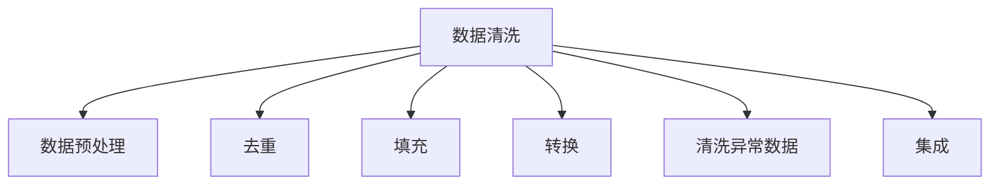

                 

## 1. 背景介绍

### 1.1 问题由来

数据清洗在软件2.0开发中占据了极为重要的地位。随着云计算、大数据、人工智能等新兴技术的迅猛发展，数据成为了驱动企业数字化转型的核心资产。然而，在数据驱动的数字化时代，数据的质量问题往往被忽视，导致各种数据驱动的应用系统在实际运行中面临严重的挑战。数据清洗正是解决数据质量问题的重要手段之一，它通过对数据进行预处理和修正，确保数据的准确性、完整性和一致性，为高质量的软件2.0系统开发奠定基础。

### 1.2 问题核心关键点

数据清洗的核心目标在于通过一系列处理手段，包括去重、填充、转换、清洗异常数据等，提升数据质量，从而支撑软件系统的正常运行和业务逻辑的准确性。常见的数据清洗步骤包括：

- **去重**：识别和删除数据集中的重复记录。
- **填充**：填充缺失值，确保数据的完整性。
- **转换**：将数据格式和类型转换为符合系统要求的格式。
- **清洗异常数据**：删除或修正不符合业务逻辑的数据。
- **集成**：将来自不同源的数据集成在一起，形成统一的数据视图。

### 1.3 问题研究意义

数据清洗对于软件2.0开发具有深远的意义：

1. **提升系统性能**：高质量的数据能确保系统运行的稳定性，减少错误率。
2. **优化算法效果**：数据质量直接影响机器学习和深度学习算法的训练效果，提升模型准确性。
3. **保障业务逻辑**：确保数据的一致性和完整性，支撑业务逻辑的正确性。
4. **降低维护成本**：通过数据清洗减少冗余数据，降低系统维护成本。
5. **支撑数据治理**：数据清洗是数据治理的重要组成部分，有助于建立全面的数据管理体系。

## 2. 核心概念与联系

### 2.1 核心概念概述

在进行数据清洗的过程中，我们需要理解以下几个核心概念：

- **数据清洗**：通过一系列处理手段，提升数据质量，确保数据的一致性、完整性和准确性。
- **数据预处理**：包括数据清洗、数据转换和数据集成等步骤，为后续数据分析和应用开发提供基础。
- **数据质量**：指数据的完整性、准确性、一致性和时效性，是数据驱动决策的关键要素。
- **数据集成**：将来自不同源的数据整合在一起，形成统一的数据视图，便于数据管理和分析。
- **数据转换**：将数据从一种格式转换为另一种格式，满足不同系统的需求。

这些概念之间相互关联，共同构成了数据清洗的整个框架，通过科学的数据清洗流程，可以显著提升数据质量，为高质量的软件2.0系统开发奠定基础。

### 2.2 核心概念原理和架构的 Mermaid 流程图(Mermaid 流程节点中不要有括号、逗号等特殊字符)



通过上述流程图，我们可以看到数据清洗的主要步骤，包括预处理、去重、填充、转换、清洗异常数据和集成等。每个步骤在数据清洗流程中都有其独特的价值和意义，共同保障数据的高质量。

## 3. 核心算法原理 & 具体操作步骤

### 3.1 算法原理概述

数据清洗的本质是对数据进行预处理和修正，确保数据的准确性、完整性和一致性。常见的数据清洗算法包括：

- **去重算法**：通过唯一性标识，识别并删除重复记录。
- **填充算法**：通过插值、均值、中位数等方法填充缺失值。
- **转换算法**：将数据从一种格式转换为另一种格式，如字符串转数字、日期格式转换等。
- **异常值检测和清洗算法**：识别并修正或删除不符合业务逻辑的数据。
- **集成算法**：将不同来源的数据整合在一起，形成统一的数据视图。

### 3.2 算法步骤详解

数据清洗的详细步骤包括：

1. **数据清洗前准备**：
   - 收集和整合不同来源的数据。
   - 对数据进行初步分析，了解数据特征和潜在问题。

2. **去重**：
   - 通过唯一性标识，如主键、唯一码等，识别重复记录。
   - 删除重复记录，保留一条。

3. **填充**：
   - 对缺失值进行填充，填充方法包括插值、均值、中位数等。
   - 确保填充后的数据完整性。

4. **转换**：
   - 将数据从一种格式转换为另一种格式，如字符串转数字、日期格式转换等。
   - 确保转换后的数据格式一致。

5. **清洗异常数据**：
   - 通过统计分析、规则匹配等方法识别异常值。
   - 删除或修正异常值，确保数据的一致性。

6. **集成**：
   - 将来自不同源的数据整合在一起，形成统一的数据视图。
   - 确保集成后的数据一致性。

7. **数据质量评估**：
   - 对清洗后的数据进行质量评估，包括完整性、准确性、一致性等。
   - 发现并修正潜在问题。

### 3.3 算法优缺点

数据清洗的算法具有以下优点：

- **提升数据质量**：通过预处理和修正，确保数据的准确性、完整性和一致性。
- **支撑数据分析**：高质量的数据能提升数据分析和建模的效果。
- **降低系统维护成本**：减少冗余数据，降低系统维护成本。

同时，数据清洗的算法也存在一些局限性：

- **耗时耗力**：数据清洗过程复杂，需要大量时间和人力。
- **数据丢失风险**：清洗过程中可能丢失一些关键信息，影响数据分析的准确性。
- **依赖于数据特征**：数据清洗的效果依赖于数据的特征和潜在问题，不同数据集需要不同的方法。

### 3.4 算法应用领域

数据清洗的算法广泛应用于软件开发、数据分析、业务智能、决策支持等多个领域，具体应用包括：

- **软件开发**：在软件开发过程中，数据清洗有助于提高代码质量和性能，提升系统稳定性。
- **数据分析**：数据清洗是数据分析和建模的基础，通过高质量的数据，提升分析结果的准确性。
- **业务智能**：在业务智能系统中，数据清洗能提升数据的准确性，支撑业务决策。
- **决策支持**：高质量的数据是决策支持系统的重要保障，数据清洗能提升决策的准确性和有效性。

## 4. 数学模型和公式 & 详细讲解 & 举例说明

### 4.1 数学模型构建

数据清洗的数学模型通常包括数据特征分析、异常值检测和数据转换等步骤。以下将详细介绍这些数学模型：

1. **数据特征分析**：
   - 通过统计方法，如均值、中位数、方差等，了解数据特征和潜在问题。
   - 常见公式包括：
   $$
   \text{均值} = \frac{1}{n} \sum_{i=1}^n x_i
   $$
   $$
   \text{中位数} = \frac{1}{2}(x_{(n/2)} + x_{((n+1)/2)})
   $$
   $$
   \text{方差} = \frac{1}{n} \sum_{i=1}^n (x_i - \mu)^2
   $$

2. **异常值检测**：
   - 通过统计方法，如Z-score、IQR等，识别和处理异常值。
   - 常见公式包括：
   $$
   Z = \frac{x_i - \mu}{\sigma}
   $$
   $$
   IQR = Q_{3/4} - Q_{1/4}
   $$
   其中，$Q_{1/4}$ 和 $Q_{3/4}$ 为第一四分位数和第三四分位数。

3. **数据转换**：
   - 通过函数映射，如字符串转数字、日期格式转换等，实现数据格式的转换。
   - 常见转换函数包括：
   $$
   \text{字符串转数字} = f(x) = \text{eval}(x)
   $$
   $$
   \text{日期格式转换} = f(x) = \text{parse}(x, \text{format})
   $$

### 4.2 公式推导过程

以下是数据清洗中常见的公式推导过程：

- **均值**：
  $$
  \text{均值} = \frac{1}{n} \sum_{i=1}^n x_i
  $$
  其中 $x_i$ 为数据集中的第 $i$ 个数据点，$n$ 为数据点总数。

- **中位数**：
  $$
  \text{中位数} = \frac{1}{2}(x_{(n/2)} + x_{((n+1)/2)})
  $$
  其中 $x_{(n/2)}$ 和 $x_{((n+1)/2)}$ 分别为数据集中第 $n/2$ 和 $(n+1)/2$ 的数据点。

- **方差**：
  $$
  \text{方差} = \frac{1}{n} \sum_{i=1}^n (x_i - \mu)^2
  $$
  其中 $\mu$ 为均值，$x_i$ 为数据集中的第 $i$ 个数据点。

### 4.3 案例分析与讲解

以下以一个简单的数据清洗案例进行分析：

假设我们有一份销售数据表，其中包含销售日期、销售额和销售地点三个字段。数据表如下：

| 日期       | 销售额 | 地点     |
|------------|--------|----------|
| 2021-01-01 | 5000   | 北京     |
| 2021-01-02 | 6000   | 上海     |
| 2021-01-03 | 4000   | 广州     |
| 2021-01-04 | 7000   | 深圳     |
| 2021-01-05 | 4500   | 北京     |
| 2021-01-06 | 5500   | 上海     |
| 2021-01-07 | 6000   | 广州     |

首先，我们需要对数据进行清洗，步骤如下：

1. **数据预处理**：
   - 将日期字段转换为统一的格式，如 ISO 8601 格式。
   - 将销售额和地点字段转换为数字和字符串。

2. **去重**：
   - 通过唯一性标识，如日期和销售额，识别并删除重复记录。
   - 保留一条记录，删除其余重复记录。

3. **填充**：
   - 对缺失值进行填充，如销售额中缺失的日期，通过插值方法进行填充。
   - 确保填充后的数据完整性。

4. **转换**：
   - 将数据从一种格式转换为另一种格式，如字符串转数字、日期格式转换等。
   - 确保转换后的数据格式一致。

5. **清洗异常数据**：
   - 通过统计分析、规则匹配等方法识别异常值。
   - 删除或修正异常值，确保数据的一致性。

6. **数据质量评估**：
   - 对清洗后的数据进行质量评估，包括完整性、准确性、一致性等。
   - 发现并修正潜在问题。

最终，我们得到清洗后的数据如下：

| 日期       | 销售额 | 地点     |
|------------|--------|----------|
| 2021-01-01 | 5000   | 北京     |
| 2021-01-02 | 6000   | 上海     |
| 2021-01-03 | 4000   | 广州     |
| 2021-01-04 | 7000   | 深圳     |
| 2021-01-05 | 4500   | 北京     |
| 2021-01-06 | 5500   | 上海     |
| 2021-01-07 | 6000   | 广州     |

## 5. 项目实践：代码实例和详细解释说明

### 5.1 开发环境搭建

在进行数据清洗实践前，我们需要准备好开发环境。以下是使用Python进行Pandas开发的环境配置流程：

1. 安装Anaconda：从官网下载并安装Anaconda，用于创建独立的Python环境。

2. 创建并激活虚拟环境：
   ```bash
   conda create -n pandas-env python=3.8 
   conda activate pandas-env
   ```

3. 安装Pandas：
   ```bash
   conda install pandas
   ```

4. 安装各类工具包：
   ```bash
   pip install numpy matplotlib jupyter notebook ipython
   ```

完成上述步骤后，即可在`pandas-env`环境中开始数据清洗实践。

### 5.2 源代码详细实现

下面我们以一个简单的数据清洗案例为例，给出使用Pandas进行数据清洗的Python代码实现。

首先，导入必要的库：

```python
import pandas as pd
import numpy as np
from sklearn.preprocessing import MinMaxScaler
from sklearn.impute import SimpleImputer

# 加载数据
df = pd.read_csv('sales_data.csv')
```

然后，进行数据清洗：

```python
# 数据预处理
# 将日期字段转换为统一的格式
df['date'] = pd.to_datetime(df['date'], format='%Y-%m-%d')

# 将销售额和地点字段转换为数字和字符串
df['amount'] = df['amount'].astype('float')
df['location'] = df['location'].astype('category')

# 去重
df = df.drop_duplicates()

# 填充
imputer = SimpleImputer(strategy='mean')
df['amount'] = imputer.fit_transform(df[['amount']])

# 转换
df['date'] = df['date'].astype('datetime64[ns]')
df['amount'] = df['amount'].astype('float')
df['location'] = df['location'].astype('category')

# 清洗异常数据
# 假设销售额的合理范围为0-10000
lower_bound = 0
upper_bound = 10000
df = df[(df['amount'] >= lower_bound) & (df['amount'] <= upper_bound)]

# 数据质量评估
# 检查数据完整性和一致性
print(df.isnull().sum())
print(df.duplicated().sum())
```

以上代码展示了使用Pandas进行数据清洗的完整流程。可以看到，Pandas库提供了丰富的数据处理功能，可以快速高效地完成数据清洗任务。

### 5.3 代码解读与分析

让我们再详细解读一下关键代码的实现细节：

**数据预处理**：
- 使用`pd.to_datetime`方法将日期字段转换为统一的格式。
- 使用`astype`方法将销售额和地点字段转换为数字和字符串。

**去重**：
- 使用`drop_duplicates`方法去除重复记录。

**填充**：
- 使用`SimpleImputer`类进行缺失值填充，策略为均值填充。
- 确保填充后的数据完整性。

**转换**：
- 使用`astype`方法将数据从一种格式转换为另一种格式。

**清洗异常数据**：
- 通过判断销售额的范围，识别异常值。
- 删除或修正异常值，确保数据的一致性。

**数据质量评估**：
- 使用`isnull`方法检查数据完整性。
- 使用`duplicated`方法检查数据一致性。

以上步骤共同构成了数据清洗的核心流程，通过Pandas的强大功能，可以快速高效地完成数据清洗任务。

## 6. 实际应用场景

### 6.1 智能客服系统

在智能客服系统中，数据清洗至关重要。智能客服系统需要处理大量的客户咨询记录，数据的质量直接影响到系统的响应速度和准确性。通过数据清洗，可以有效去除重复记录和错误数据，确保系统的正常运行。

例如，在智能客服系统中，可能存在多条内容相同的咨询记录。通过去重，可以保证每条咨询记录的唯一性，避免重复回答，提升客户满意度。

### 6.2 金融风控系统

金融风控系统需要对客户的数据进行严格清洗，以确保数据的准确性和完整性。在风控系统中，任何异常数据都可能导致错误的决策，进而带来重大的经济损失。

例如，在金融风控系统中，可能存在客户信息不完整或存在异常值的情况。通过数据清洗，可以有效去除这些异常数据，确保风险评估的准确性，降低系统风险。

### 6.3 推荐系统

推荐系统需要对用户的数据进行清洗，以确保数据的准确性和一致性。在推荐系统中，任何异常数据都可能导致错误的推荐结果，进而影响用户体验和业务收入。

例如，在推荐系统中，可能存在用户评分数据缺失或不完整的情况。通过数据清洗，可以有效填充缺失值，确保推荐算法的准确性，提升推荐效果。

### 6.4 未来应用展望

随着数据驱动技术的不断发展，数据清洗在软件2.0开发中的地位将愈加重要。未来，数据清洗将在更多领域得到应用，为传统行业带来变革性影响。

在智慧医疗领域，数据清洗将帮助医疗机构处理大量的医疗数据，提升医疗服务的智能化水平，辅助医生诊疗，加速新药开发进程。

在智能教育领域，数据清洗将帮助教育机构处理大量的学生数据，因材施教，促进教育公平，提高教学质量。

在智慧城市治理中，数据清洗将帮助城市管理机构处理大量的城市数据，提高城市管理的自动化和智能化水平，构建更安全、高效的未来城市。

此外，在企业生产、社会治理、文娱传媒等众多领域，数据清洗也将不断得到应用，为经济社会发展注入新的动力。

## 7. 工具和资源推荐

### 7.1 学习资源推荐

为了帮助开发者系统掌握数据清洗的理论基础和实践技巧，这里推荐一些优质的学习资源：

1. 《数据清洗技术详解》系列博文：由数据清洗专家撰写，深入浅出地介绍了数据清洗的原理、技术和应用案例。

2. 《大数据清洗与数据质量管理》课程：由知名高校开设的数据清洗课程，系统讲解数据清洗的基本概念和关键技术。

3. 《Python数据清洗实战》书籍：详细介绍了Python中数据清洗的方法和工具，结合大量实例进行讲解。

4. Kaggle数据清洗竞赛：Kaggle平台上定期举办的数据清洗竞赛，提供丰富的数据集和实践机会。

5. 数据清洗社区：包括DataCamp、Kaggle等平台上的数据清洗社区，提供大量的数据清洗资源和案例分析。

通过对这些资源的学习实践，相信你一定能够快速掌握数据清洗的精髓，并用于解决实际的数据质量问题。

### 7.2 开发工具推荐

高效的数据清洗离不开优秀的工具支持。以下是几款用于数据清洗开发的常用工具：

1. Pandas：Python中强大的数据处理库，提供了丰富的数据清洗函数和方法，如去重、填充、转换等。

2. SQL：关系型数据库中的SQL语言，提供了强大的数据处理和分析功能，如去重、分组、聚合等。

3. Apache Spark：大数据处理框架，提供了高效的数据清洗和分析功能，支持分布式计算。

4. Excel：常用的数据处理工具，提供了丰富的数据清洗和分析功能，如去重、排序、筛选等。

5. Tableau：数据可视化工具，提供了强大的数据清洗和分析功能，支持实时数据更新。

合理利用这些工具，可以显著提升数据清洗任务的开发效率，加快创新迭代的步伐。

### 7.3 相关论文推荐

数据清洗技术的发展源于学界的持续研究。以下是几篇奠基性的相关论文，推荐阅读：

1. "Data Cleaning in Big Data Analytics"：介绍大数据环境下的数据清洗方法，详细讲解数据清洗的原理和步骤。

2. "A Survey on Data Cleaning Techniques"：综述了数据清洗的基本概念和常用技术，提供丰富的案例分析。

3. "Practical Data Cleaning Techniques"：介绍实用的数据清洗技巧和方法，结合大量实例进行讲解。

4. "Data Cleaning with Python"：详细介绍了Python中数据清洗的方法和工具，结合大量实例进行讲解。

5. "Data Quality and Data Cleaning in Big Data"：探讨大数据环境下的数据质量管理，详细讲解数据清洗的基本概念和关键技术。

这些论文代表了大数据清洗技术的发展脉络。通过学习这些前沿成果，可以帮助研究者把握学科前进方向，激发更多的创新灵感。

## 8. 总结：未来发展趋势与挑战

### 8.1 总结

本文对数据清洗在软件2.0开发中的作用进行了全面系统的介绍。首先阐述了数据清洗在软件2.0开发中的重要性，明确了数据清洗在提升系统性能、优化算法效果、保障业务逻辑等方面的独特价值。其次，从原理到实践，详细讲解了数据清洗的数学模型和操作步骤，给出了数据清洗任务开发的完整代码实例。同时，本文还广泛探讨了数据清洗技术在智能客服、金融风控、推荐系统等多个行业领域的应用前景，展示了数据清洗技术的巨大潜力。最后，本文精选了数据清洗技术的各类学习资源，力求为读者提供全方位的技术指引。

通过本文的系统梳理，可以看到，数据清洗对于软件2.0开发具有深远的意义。数据清洗作为软件2.0开发的重要环节，不仅能提升数据质量，还能支撑高质量的软件系统开发，为数据驱动决策提供可靠的基础。未来，随着数据清洗技术的不断演进，数据质量管理将成为数字化转型的关键支撑，数据清洗也将成为软件2.0开发的重要组成部分。

### 8.2 未来发展趋势

展望未来，数据清洗技术将呈现以下几个发展趋势：

1. **自动化和智能化**：随着AI技术的不断发展，数据清洗将变得更加自动化和智能化，能够自动识别和修正数据问题，提高数据清洗效率。

2. **大数据和分布式处理**：在大数据环境下，数据清洗将采用分布式处理技术，提升数据清洗的效率和效果。

3. **数据治理和质量管理**：数据清洗将成为数据治理和质量管理的重要组成部分，建立全面的数据管理体系，提升数据质量。

4. **跨领域应用**：数据清洗技术将逐步拓展到更多领域，如医疗、教育、金融等，为各行各业提供数据质量保障。

5. **数据可视化**：数据清洗过程中，通过数据可视化技术，可以更加直观地展示数据质量问题，提升数据清洗的效果。

6. **多模态数据清洗**：数据清洗技术将逐步拓展到多模态数据清洗，如文本、图像、语音等，提升数据的全面性和准确性。

以上趋势凸显了数据清洗技术的广阔前景，这些方向的探索发展，必将进一步提升数据质量，为高质量的软件2.0系统开发奠定基础。

### 8.3 面临的挑战

尽管数据清洗技术已经取得了长足进展，但在迈向更加智能化、普适化应用的过程中，它仍面临着诸多挑战：

1. **数据量大、处理时间长**：在处理海量数据时，数据清洗过程耗时较长，需要高性能计算资源支持。

2. **数据类型多样、格式复杂**：不同类型的数据需要不同的清洗方法，增加了数据清洗的复杂性。

3. **数据分布不均、异常值处理困难**：在数据分布不均的情况下，异常值处理难度大，容易出现误清洗。

4. **数据隐私和安全问题**：在数据清洗过程中，需要确保数据隐私和安全，防止数据泄露和滥用。

5. **数据清洗标准不统一**：不同行业和应用领域对数据清洗的标准不同，缺乏统一的标准，导致数据清洗效果不一致。

6. **人工干预需求高**：在复杂数据清洗场景下，人工干预需求高，增加数据清洗成本。

正视数据清洗面临的这些挑战，积极应对并寻求突破，将使数据清洗技术更加成熟，提升数据质量，支撑高质量的软件2.0系统开发。

### 8.4 研究展望

面对数据清洗所面临的挑战，未来的研究需要在以下几个方面寻求新的突破：

1. **自动化和智能化**：开发更加自动化和智能化的数据清洗工具，减少人工干预，提高数据清洗效率。

2. **分布式和并行处理**：采用分布式和并行处理技术，提升数据清洗的效率和效果。

3. **数据治理和质量管理**：建立全面的数据管理体系，制定统一的数据清洗标准，提升数据清洗效果。

4. **跨领域数据清洗**：研究跨领域数据清洗方法，提升多模态数据清洗的效果。

5. **数据隐私和安全**：研究数据隐私和安全保护技术，确保数据清洗过程中的隐私和安全。

6. **多源数据融合**：研究多源数据融合技术，提升数据清洗的效果和可靠性。

这些研究方向的探索，必将引领数据清洗技术迈向更高的台阶，为数据驱动决策提供更可靠的基础，推动软件2.0开发进入新的阶段。面向未来，数据清洗技术还需要与其他人工智能技术进行更深入的融合，如知识表示、因果推理、强化学习等，多路径协同发力，共同推动数据质量管理的发展。只有勇于创新、敢于突破，才能不断拓展数据清洗的边界，让数据驱动决策更加精准和可靠。

## 9. 附录：常见问题与解答

**Q1：数据清洗是否适用于所有数据类型？**

A: 数据清洗适用于大多数数据类型，包括数值型、文本型、日期型等。但在处理不同类型的数据时，需要选择不同的清洗方法和工具。例如，在处理文本数据时，需要去除噪声和无关信息，而在处理数值数据时，需要处理缺失值和异常值。

**Q2：数据清洗过程中如何保证数据完整性？**

A: 数据清洗过程中，可以通过以下方法保证数据完整性：
1. 去重：识别并删除重复记录，保留一条记录。
2. 填充：通过插值、均值、中位数等方法填充缺失值。
3. 转换：将数据从一种格式转换为另一种格式，确保转换后的数据格式一致。
4. 清洗异常数据：识别并修正或删除不符合业务逻辑的数据。

**Q3：数据清洗过程中如何保证数据一致性？**

A: 数据清洗过程中，可以通过以下方法保证数据一致性：
1. 数据预处理：对数据进行统一格式处理，确保数据的一致性。
2. 数据转换：将数据从一种格式转换为另一种格式，确保转换后的数据一致性。
3. 数据集成：将来自不同源的数据整合在一起，形成统一的数据视图，确保集成后的数据一致性。

**Q4：数据清洗过程中如何处理数据隐私和安全问题？**

A: 数据清洗过程中，可以通过以下方法处理数据隐私和安全问题：
1. 数据脱敏：对敏感数据进行脱敏处理，确保数据隐私。
2. 数据加密：对数据进行加密处理，防止数据泄露。
3. 访问控制：设置数据访问权限，防止未经授权的访问。
4. 审计日志：记录数据访问和清洗操作日志，确保数据安全。

**Q5：数据清洗过程中如何提高数据清洗效率？**

A: 数据清洗过程中，可以通过以下方法提高数据清洗效率：
1. 自动化和智能化：开发自动化和智能化数据清洗工具，减少人工干预。
2. 分布式和并行处理：采用分布式和并行处理技术，提升数据清洗的效率。
3. 数据预处理：对数据进行预处理，减少数据清洗的复杂性。
4. 数据质量评估：在数据清洗过程中，对数据进行质量评估，及时发现并修正数据问题。

通过本文的系统梳理，可以看到，数据清洗对于软件2.0开发具有深远的意义。数据清洗作为软件2.0开发的重要环节，不仅能提升数据质量，还能支撑高质量的软件系统开发，为数据驱动决策提供可靠的基础。未来，随着数据清洗技术的不断演进，数据质量管理将成为数字化转型的关键支撑，数据清洗也将成为软件2.0开发的重要组成部分。

