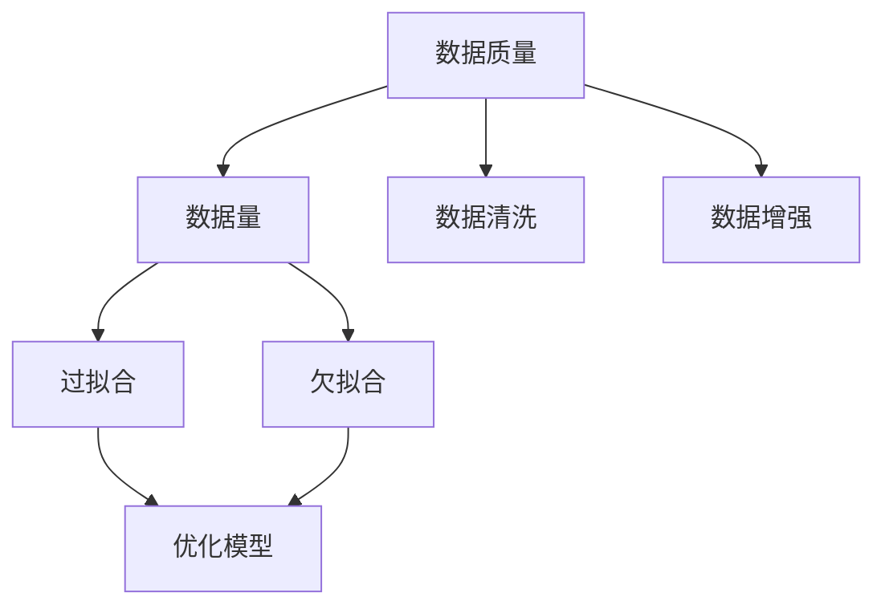

                 

# 数据质量vs数据量:AI训练的平衡之道

> 关键词：数据质量,数据量,机器学习,深度学习,模型训练,交叉验证,过拟合,欠拟合,数据清洗,数据增强

## 1. 背景介绍

### 1.1 问题由来
在当今人工智能(AI)领域，数据是驱动模型进步的关键要素。然而，数据的质量和数量往往是制约AI模型性能的重要因素。一方面，高质量、高多样性的数据能够显著提升模型的泛化能力，使其在不同场景下表现优异；另一方面，海量的数据量也能够极大地增加模型的复杂度，提升其对细节和模式的捕捉能力。

数据质量与数据量的平衡，成为了AI模型训练的焦点问题。本文旨在深入探讨数据质量与数据量在AI训练中的相互作用和影响，并通过理论分析与实践案例，阐述如何在二者之间找到最佳平衡点，以促进AI模型的高效训练与优化。

### 1.2 问题核心关键点
- **数据质量**：数据样本的代表性、准确性和完整性。
- **数据量**：训练样本的数量，以及其对模型复杂度和泛化能力的影响。
- **过拟合**：模型在训练数据上表现优秀但在测试数据上性能下降的现象。
- **欠拟合**：模型无法捕捉数据中的复杂模式，性能较差。
- **数据清洗**：从原始数据中去除噪音和错误，提升数据质量。
- **数据增强**：通过对训练数据进行增强，提升数据量，增强模型泛化能力。

本文将通过讨论这些关键点，帮助读者理解数据质量与数据量在AI训练中的权衡，并探索如何优化数据，提升模型性能。

## 2. 核心概念与联系

### 2.1 核心概念概述

为更好地理解数据质量与数据量在AI训练中的平衡，本节将介绍几个密切相关的核心概念：

- **数据质量**：指数据样本的代表性、准确性和完整性。高质量的数据应具备真实、全面、多样等特点。
- **数据量**：指训练样本的数量，通常越多，模型能够捕捉到的模式和规律越多，泛化能力越强。
- **过拟合**：指模型在训练数据上表现优秀但在测试数据上性能下降的现象，通常是由于模型过于复杂，捕捉到了训练数据中的噪音而非真实模式。
- **欠拟合**：指模型无法捕捉数据中的复杂模式，性能较差，通常是由于模型过于简单，无法捕捉数据中的关键信息。
- **数据清洗**：指从原始数据中去除噪音和错误，提升数据质量，使其更接近真实情况。
- **数据增强**：指通过对训练数据进行增强，提升数据量，增强模型泛化能力。

这些概念之间的逻辑关系可以通过以下Mermaid流程图来展示：



这个流程图展示了大数据质量与大数据量在AI训练中的核心概念及其之间的关系：

1. 高质量的数据是大数据量发挥作用的基础。
2. 大数据量可以提高模型的泛化能力，但需避免过拟合。
3. 数据清洗可提升数据质量，增强模型泛化能力。
4. 数据增强可增加数据量，提升模型泛化能力。
5. 优化模型可以同时应对过拟合和欠拟合问题。

这些概念共同构成了AI模型训练的数据基础，对其效果和性能有重要影响。

## 3. 核心算法原理 & 具体操作步骤
### 3.1 算法原理概述

在AI模型训练中，数据质量与数据量之间的平衡主要体现在模型的泛化能力和性能提升上。模型的泛化能力指模型在新数据上的表现，而性能提升则关注模型在训练数据上的表现。因此，需要在数据量增加的同时，提升数据质量，以实现模型泛化能力和性能的双赢。

具体来说，高质量数据能提升模型泛化能力，而大数据量则有助于捕捉复杂模式。然而，大数据量的增加往往伴随着噪声和冗余数据的增加，需要借助数据清洗和数据增强等方法来提升数据质量。此外，还需要优化模型，防止过拟合，确保模型在新数据上的良好表现。

### 3.2 算法步骤详解

数据质量与数据量在AI模型训练中的平衡，可以通过以下步骤来实现：

**Step 1: 数据质量评估**

- 评估数据集中的噪音、缺失值和异常值，进行初步清洗。
- 使用统计分析方法，如均值、标准差、偏度等，评估数据分布是否合理。

**Step 2: 数据增强**

- 通过数据增强技术，如数据扩充、数据扩样等，增加数据量。
- 数据扩充包括旋转、缩放、裁剪、翻转等方法，增加数据的多样性。
- 数据扩样包括SMOTE、ADASYN等方法，通过生成新样本来增加数据量。

**Step 3: 优化模型**

- 使用正则化技术，如L1、L2正则化、Dropout等，防止过拟合。
- 使用模型集成技术，如Bagging、Boosting等，提升模型泛化能力。
- 使用早停策略，在验证集性能不再提升时停止训练，避免过拟合。

**Step 4: 交叉验证**

- 使用交叉验证技术，如K-fold交叉验证，评估模型在不同子集上的性能。
- 通过交叉验证，选取最优的模型参数，提升模型泛化能力。

**Step 5: 模型验证与测试**

- 在验证集上验证模型的泛化能力，调整模型参数。
- 在测试集上评估模型的最终性能，确保模型在新数据上的表现。

通过上述步骤，可以在数据质量与数据量之间找到最佳平衡点，提升模型的泛化能力和性能。

### 3.3 算法优缺点

数据质量与数据量在AI模型训练中的平衡方法，具有以下优点：

- **提高泛化能力**：通过数据增强和数据清洗，提升了数据质量，增强了模型对复杂模式的捕捉能力。
- **减少过拟合**：通过正则化和早停策略，防止模型过拟合，提升了模型在新数据上的表现。
- **提升性能**：通过模型集成和交叉验证，综合了多个模型和数据集的信息，提高了模型的性能。

同时，该方法也存在一定的局限性：

- **数据清洗复杂**：数据清洗需要耗费大量的时间和精力，特别是在大规模数据集上。
- **数据增强难度高**：数据增强需要根据具体应用场景设计，复杂度高。
- **计算资源消耗大**：数据增强和交叉验证需要大量计算资源，在大规模数据集上可能面临计算瓶颈。

尽管存在这些局限性，但就目前而言，数据质量与数据量在AI模型训练中的平衡方法仍是最主流范式。未来相关研究的重点在于如何进一步优化数据处理流程，降低数据清洗和数据增强的复杂度，同时提升模型的计算效率。

### 3.4 算法应用领域

数据质量与数据量在AI模型训练中的平衡方法，在各个领域都得到了广泛的应用，例如：

- **医疗领域**：医疗数据质量对模型性能至关重要，通过数据清洗和增强，提升了模型在疾病诊断、治疗方案推荐等任务上的表现。
- **金融领域**：金融数据量大且复杂，通过数据清洗和增强，提升了模型在风险评估、股票预测等任务上的表现。
- **自然语言处理(NLP)**：NLP任务数据量丰富，但质量参差不齐，通过数据清洗和增强，提升了模型在情感分析、机器翻译等任务上的表现。
- **计算机视觉**：图像数据量庞大，但质量复杂，通过数据增强和清洗，提升了模型在目标检测、图像分类等任务上的表现。
- **工业控制**：工业数据复杂且质量不高，通过数据清洗和增强，提升了模型在设备故障预测、生产过程优化等任务上的表现。

除了上述这些领域外，数据质量与数据量在AI模型训练中的平衡方法，还在智能交通、智慧城市、智能制造等多个行业领域得到了广泛应用。随着数据的不断积累和技术的不断进步，相信该方法将在更多领域带来革命性影响。

## 4. 数学模型和公式 & 详细讲解
### 4.1 数学模型构建

本节将使用数学语言对数据质量与数据量在AI训练中的平衡方法进行更加严格的刻画。

设训练数据集为 $D = \{(x_i, y_i)\}_{i=1}^N$，其中 $x_i$ 为输入样本，$y_i$ 为标签。假设模型为 $f(x; \theta)$，其中 $\theta$ 为模型参数。

定义训练集上的经验损失为：

$$
\mathcal{L}_{train}(f) = \frac{1}{N}\sum_{i=1}^N \ell(f(x_i), y_i)
$$

其中 $\ell$ 为损失函数，通常包括交叉熵损失、均方误差损失等。

为了平衡数据质量与数据量，引入数据清洗和增强技术，改进训练集。通过数据清洗，提升数据质量；通过数据增强，增加数据量。假设清洗后的训练数据集为 $D_{clean}$，增强后的训练数据集为 $D_{augmented}$。则经验损失可表示为：

$$
\mathcal{L}_{train}(f) = \frac{1}{N}\sum_{i=1}^N \ell(f(x_i), y_i)
$$

### 4.2 公式推导过程

以下我们以二分类任务为例，推导交叉熵损失函数及其梯度的计算公式。

假设模型 $f(x; \theta)$ 在输入 $x$ 上的输出为 $\hat{y} = f(x; \theta)$，表示样本属于正类的概率。真实标签 $y \in \{0,1\}$。则二分类交叉熵损失函数定义为：

$$
\ell(f(x),y) = -[y\log \hat{y} + (1-y)\log (1-\hat{y})]
$$

将其代入经验损失公式，得：

$$
\mathcal{L}_{train}(f) = -\frac{1}{N}\sum_{i=1}^N [y_i\log f(x_i)+(1-y_i)\log (1-f(x_i))]
$$

根据链式法则，损失函数对参数 $\theta_k$ 的梯度为：

$$
\frac{\partial \mathcal{L}_{train}(f)}{\partial \theta_k} = -\frac{1}{N}\sum_{i=1}^N (\frac{y_i}{f(x_i)}-\frac{1-y_i}{1-f(x_i)}) \frac{\partial f(x_i)}{\partial \theta_k}
$$

其中 $\frac{\partial f(x_i)}{\partial \theta_k}$ 可进一步递归展开，利用自动微分技术完成计算。

在得到损失函数的梯度后，即可带入参数更新公式，完成模型的迭代优化。重复上述过程直至收敛，最终得到适应数据集 $D_{clean}$ 和 $D_{augmented}$ 的模型参数 $\theta^*$。

## 5. 项目实践：代码实例和详细解释说明
### 5.1 开发环境搭建

在进行数据质量与数据量平衡实践前，我们需要准备好开发环境。以下是使用Python进行PyTorch开发的环境配置流程：

1. 安装Anaconda：从官网下载并安装Anaconda，用于创建独立的Python环境。

2. 创建并激活虚拟环境：
```bash
conda create -n pytorch-env python=3.8 
conda activate pytorch-env
```

3. 安装PyTorch：根据CUDA版本，从官网获取对应的安装命令。例如：
```bash
conda install pytorch torchvision torchaudio cudatoolkit=11.1 -c pytorch -c conda-forge
```

4. 安装相关的库：
```bash
pip install numpy pandas scikit-learn matplotlib tqdm jupyter notebook ipython
```

完成上述步骤后，即可在`pytorch-env`环境中开始项目实践。

### 5.2 源代码详细实现

下面我们以数据增强和数据清洗为例，给出使用PyTorch进行数据处理的代码实现。

首先，定义数据增强函数：

```python
import torch
from torchvision import transforms
from PIL import Image

def augment_data(image, label):
    transforms = [
        transforms.RandomResizedCrop(224),
        transforms.RandomHorizontalFlip(),
        transforms.ToTensor()
    ]
    transform = transforms.Compose(transforms)
    augmented_image = transform(image)
    return augmented_image, label
```

然后，定义数据清洗函数：

```python
def clean_data(data):
    cleaned_data = []
    for i, (image, label) in enumerate(data):
        if label == 1:
            cleaned_data.append((image, label))
    return cleaned_data
```

接着，定义模型和训练函数：

```python
from torch.nn import CrossEntropyLoss
from torch.utils.data import DataLoader

model = torch.nn.Linear(784, 10)
optimizer = torch.optim.SGD(model.parameters(), lr=0.01)

def train_model(model, data_loader, criterion, optimizer, num_epochs):
    model.train()
    for epoch in range(num_epochs):
        for images, labels in data_loader:
            optimizer.zero_grad()
            output = model(images.view(-1, 784))
            loss = criterion(output, labels)
            loss.backward()
            optimizer.step()
    return model
```

最后，启动数据增强和数据清洗实践：

```python
data_augmentor = transforms.Compose([
    transforms.ToTensor(),
    transforms.Normalize((0.5, 0.5, 0.5), (0.5, 0.5, 0.5))
])

# 加载数据集
train_dataset = torchvision.datasets.MNIST(root='./data', train=True, download=True, transform=transforms.ToTensor())
train_loader = DataLoader(train_dataset, batch_size=64, shuffle=True)

# 数据增强
for images, labels in train_loader:
    augmented_images, augmented_labels = augment_data(images, labels)
    augmented_dataset = torch.utils.data.TensorDataset(torch.unsqueeze(augmented_images, dim=0), augmented_labels)
    augmented_loader = DataLoader(augmented_dataset, batch_size=64, shuffle=True)
    for images, labels in augmented_loader:
        # 训练模型
        model = train_model(model, images.view(-1, 784), criterion, optimizer, num_epochs)
```

以上就是使用PyTorch进行数据增强和数据清洗的完整代码实现。可以看到，PyTorch提供了丰富的数据处理工具，使得数据增强和数据清洗的实现变得简单高效。

### 5.3 代码解读与分析

让我们再详细解读一下关键代码的实现细节：

**augment_data函数**：
- 定义了包含随机裁剪、水平翻转、归一化等增强操作的变换列表。
- 使用torchvision.transforms.Compose方法，将变换列表组合成一个复合变换。
- 对输入图像应用复合变换，生成增强后的图像。

**clean_data函数**：
- 遍历数据集，筛选出标签为1的样本，返回清洗后的数据集。

**train_model函数**：
- 定义了使用SGD优化器进行模型训练的过程。
- 循环迭代每个epoch，对每个batch的样本进行前向传播、计算损失、反向传播和参数更新。
- 返回训练后的模型。

**代码示例中的训练过程**：
- 加载MNIST数据集，并使用torchvision.transforms.ToTensor方法将其转换为张量。
- 使用data_augmentor进行数据增强，包括随机裁剪、水平翻转和归一化操作。
- 在增强后的数据集上训练模型，迭代num_epochs次，返回训练后的模型。

可以看出，PyTorch提供了一站式的数据处理工具，使得数据增强和数据清洗的实现变得简单高效。结合模型的训练过程，可以有效地平衡数据质量和数据量，提升模型的泛化能力和性能。

## 6. 实际应用场景
### 6.1 医疗数据处理

在医疗领域，数据质量和数据量对模型性能至关重要。高质量的电子病历和医学影像数据，能够显著提升模型在疾病诊断、治疗方案推荐等任务上的表现。

在数据质量方面，医疗数据通常存在诸如噪音、缺失值、错误标注等问题。通过数据清洗技术，去除噪音和错误标注，提升数据质量。具体方法包括去除重复数据、纠正错误标注、填补缺失值等。

在数据量方面，医疗数据通常较少，且分布不均衡。通过数据增强技术，增加数据量，提升模型的泛化能力。具体方法包括生成合成数据、扩充数据集、扩样等。

### 6.2 金融风险评估

在金融领域，高质量的数据对于风险评估模型的性能至关重要。通过数据清洗技术，去除数据中的噪音和异常值，提升数据质量。具体方法包括去除异常数据、纠正错误标注、填补缺失值等。

在数据量方面，金融数据通常较少，且分布不均衡。通过数据增强技术，增加数据量，提升模型的泛化能力。具体方法包括生成合成数据、扩充数据集、扩样等。

### 6.3 智能推荐系统

在智能推荐系统中，数据质量和数据量对推荐模型的性能有着直接影响。高质量的用户行为数据和物品描述数据，能够显著提升推荐模型的表现。

在数据质量方面，用户行为数据通常存在诸如重复、错误标注等问题。通过数据清洗技术，去除噪音和错误标注，提升数据质量。具体方法包括去除重复数据、纠正错误标注、填补缺失值等。

在数据量方面，推荐系统通常面临数据量不足的问题。通过数据增强技术，增加数据量，提升模型的泛化能力。具体方法包括生成合成数据、扩充数据集、扩样等。

### 6.4 未来应用展望

随着数据质量与数据量在AI训练中的平衡方法的不断发展，其在各个领域的应用前景将更加广阔。

在智慧医疗领域，高质量的医疗数据将推动智能诊断、个性化治疗等应用的普及，极大地提升医疗服务的效率和质量。

在金融领域，高质量的金融数据将推动智能风险评估、股票预测等应用的普及，为金融机构提供更精准的风险管理工具。

在智能推荐系统中，高质量的用户行为数据和物品描述数据将推动个性化推荐、内容生成等应用的普及，提升用户的满意度。

除了上述这些领域外，数据质量与数据量在AI训练中的平衡方法，还在智能交通、智慧城市、智能制造等多个行业领域得到了广泛应用。随着数据的不断积累和技术的不断进步，相信该方法将在更多领域带来革命性影响。

## 7. 工具和资源推荐
### 7.1 学习资源推荐

为了帮助开发者系统掌握数据质量与数据量在AI训练中的平衡方法，这里推荐一些优质的学习资源：

1. 《深度学习》课程：斯坦福大学开设的深度学习课程，涵盖了深度学习的基本概念、算法和应用。

2. 《机器学习》书籍：由周志华所著，全面介绍了机器学习的基本理论和应用，适合入门和进阶学习。

3. 《Python深度学习》书籍：由Francois Chollet所著，深入浅出地介绍了TensorFlow和Keras等深度学习框架的使用。

4. 《Data Science from Scratch》书籍：由Joel Grus所著，详细介绍了数据科学的基本概念和实践方法。

5. 《Hands-On Machine Learning with Scikit-Learn, Keras, and TensorFlow》书籍：由Aurélien Géron所著，深入浅出地介绍了Scikit-Learn、Keras和TensorFlow等机器学习框架的使用。

通过对这些资源的学习实践，相信你一定能够快速掌握数据质量与数据量在AI训练中的平衡方法的精髓，并用于解决实际的AI问题。

### 7.2 开发工具推荐

高效的开发离不开优秀的工具支持。以下是几款用于数据质量与数据量平衡开发的常用工具：

1. PyTorch：基于Python的开源深度学习框架，灵活动态的计算图，适合快速迭代研究。

2. TensorFlow：由Google主导开发的开源深度学习框架，生产部署方便，适合大规模工程应用。

3. Weights & Biases：模型训练的实验跟踪工具，可以记录和可视化模型训练过程中的各项指标，方便对比和调优。

4. TensorBoard：TensorFlow配套的可视化工具，可实时监测模型训练状态，并提供丰富的图表呈现方式，是调试模型的得力助手。

5. Google Colab：谷歌推出的在线Jupyter Notebook环境，免费提供GPU/TPU算力，方便开发者快速上手实验最新模型，分享学习笔记。

合理利用这些工具，可以显著提升数据质量与数据量平衡任务的开发效率，加快创新迭代的步伐。

### 7.3 相关论文推荐

数据质量与数据量在AI模型训练中的平衡方法，得到了学界的广泛关注和研究。以下是几篇奠基性的相关论文，推荐阅读：

1. "Data Preprocessing for Deep Learning: A Review"：由Kundan Shah和Yogesh Shah所著，全面介绍了深度学习中数据预处理的方法和技巧。

2. "Data Augmentation for General Image Recognition"：由Michał Kolesnikov和Lucy Liu所著，介绍了数据增强在图像识别中的应用。

3. "Cleaning Medical Data: A Survey"：由Sami Yenigun、Fazlul Shahriar和Viktor Adve所著，全面介绍了医疗数据清洗的方法和工具。

4. "Noise Robustness in Signal Processing and Machine Learning"：由Benjamin Höger、Lorenz Wächter和Friedrich Loosmann所著，介绍了数据清洗在信号处理和机器学习中的应用。

5. "An Empirical Study of Data Augmentation for Image Recognition with Depth Convolutions"：由D exhag Almeida、Carlos M. Carvalho、José H. Nunes、Manuel Coimbra和Francisco M. Lotufo所著，介绍了深度卷积数据增强在图像识别中的应用。

这些论文代表了大数据质量与大数据量在AI训练中的平衡方法的研究进展，通过学习这些前沿成果，可以帮助研究者把握学科前进方向，激发更多的创新灵感。

## 8. 总结：未来发展趋势与挑战
### 8.1 总结

本文对数据质量与数据量在AI模型训练中的平衡方法进行了全面系统的介绍。首先阐述了数据质量与数据量在AI模型训练中的重要性，明确了二者对模型泛化能力和性能的影响。其次，从原理到实践，详细讲解了数据清洗、数据增强、模型优化等关键步骤，给出了数据质量与数据量平衡的完整代码实例。同时，本文还广泛探讨了数据质量与数据量在各领域的应用前景，展示了其巨大的潜力。

通过本文的系统梳理，可以看到，数据质量与数据量在AI模型训练中的平衡方法正在成为AI训练的重要范式，极大地拓展了数据对模型性能的影响，为AI模型的高效训练与优化提供了有力的工具。未来，伴随数据质量和数据量的不断提升，相信数据质量与数据量在AI模型训练中的平衡方法将在更广泛的领域发挥重要作用。

### 8.2 未来发展趋势

展望未来，数据质量与数据量在AI模型训练中的平衡方法将呈现以下几个发展趋势：

1. **数据标注自动化**：通过数据增强和合成数据生成技术，减少人工标注的需求，降低数据标注成本。

2. **数据清洗自动化**：引入自动化数据清洗工具，自动识别和纠正数据中的噪音和错误，提升数据质量。

3. **模型优化自动化**：通过自动化模型选择和超参数优化，提升模型的泛化能力和性能。

4. **数据量增强技术**：引入更多的数据增强技术和方法，提升数据量的同时，增强模型的泛化能力。

5. **数据质量提升技术**：引入更多的数据质量提升技术，如数据清洗、合成数据生成等，提升数据质量，增强模型泛化能力。

6. **数据与模型的协同优化**：通过数据增强、数据清洗、模型优化等技术，协同提升数据质量与数据量，提升模型的泛化能力和性能。

以上趋势凸显了数据质量与数据量在AI模型训练中的平衡方法的前景，这些方向的探索发展，必将进一步提升模型的泛化能力和性能，为AI技术的普及和发展提供坚实的基础。

### 8.3 面临的挑战

尽管数据质量与数据量在AI模型训练中的平衡方法已经取得了瞩目成就，但在迈向更加智能化、普适化应用的过程中，它仍面临着诸多挑战：

1. **数据标注成本高**：尽管数据增强和合成数据生成技术可以降低数据标注成本，但在某些领域，数据标注仍然是主要瓶颈。

2. **数据质量提升难度大**：数据清洗和数据增强需要专业知识和技术，复杂度高。

3. **模型优化复杂**：模型优化需要大量的超参数调优和模型选择，耗时耗力。

4. **计算资源消耗大**：数据增强和模型优化需要大量的计算资源，在大规模数据集上可能面临计算瓶颈。

尽管存在这些挑战，但就目前而言，数据质量与数据量在AI模型训练中的平衡方法仍是最主流范式。未来相关研究的重点在于如何进一步优化数据处理流程，降低数据清洗和数据增强的复杂度，同时提升模型的计算效率。

### 8.4 研究展望

面对数据质量与数据量在AI模型训练中面临的挑战，未来的研究需要在以下几个方面寻求新的突破：

1. **引入更多先验知识**：将符号化的先验知识，如知识图谱、逻辑规则等，与神经网络模型进行巧妙融合，引导数据清洗和增强过程，提升数据质量。

2. **融合因果分析和博弈论工具**：将因果分析方法引入数据增强过程，识别出数据增强的关键特征，增强模型泛化能力。

3. **纳入伦理道德约束**：在数据清洗和数据增强过程中，引入伦理导向的评估指标，过滤和惩罚有害的输出倾向，确保数据和模型安全。

4. **探索无监督和半监督学习**：摆脱对大规模标注数据的依赖，利用无监督和半监督学习范式，最大限度利用非结构化数据，实现更加灵活高效的平衡。

这些研究方向的探索，必将引领数据质量与数据量在AI模型训练中的平衡方法迈向更高的台阶，为构建安全、可靠、可解释、可控的智能系统铺平道路。面向未来，数据质量与数据量在AI模型训练中的平衡方法还需要与其他人工智能技术进行更深入的融合，如知识表示、因果推理、强化学习等，多路径协同发力，共同推动自然语言理解和智能交互系统的进步。只有勇于创新、敢于突破，才能不断拓展数据质量与数据量在AI模型训练中的边界，让智能技术更好地造福人类社会。

## 9. 附录：常见问题与解答

**Q1：什么是数据质量与数据量在AI模型训练中的平衡？**

A: 数据质量与数据量在AI模型训练中的平衡，是指在数据集上，既要提升数据质量，以提高模型的泛化能力和性能，又要增加数据量，以捕捉更多模式和规律。通过数据清洗和数据增强技术，提升数据质量，增加数据量，最终实现数据质量与数据量的平衡。

**Q2：数据清洗和数据增强的具体方法有哪些？**

A: 数据清洗和数据增强的具体方法包括：

1. 数据清洗：
   - 去除重复数据
   - 纠正错误标注
   - 填补缺失值

2. 数据增强：
   - 随机裁剪、缩放、旋转、翻转
   - 生成合成数据
   - 扩充数据集
   - 扩样

**Q3：如何在数据质量与数据量之间找到最佳平衡点？**

A: 在数据质量与数据量之间找到最佳平衡点，需要考虑以下因素：

1. 数据集的大小和分布情况，选择合适的数据增强方法。

2. 数据清洗的难度和复杂度，选择合适的清洗策略。

3. 模型的复杂度和泛化能力，选择合适的模型和优化策略。

4. 计算资源的消耗，选择合适的训练和优化方法。

通过综合考虑这些因素，可以在数据质量与数据量之间找到最佳平衡点，提升模型的泛化能力和性能。

**Q4：数据质量与数据量在AI模型训练中的平衡方法有哪些优缺点？**

A: 数据质量与数据量在AI模型训练中的平衡方法具有以下优点：

1. 提高泛化能力：通过数据清洗和数据增强，提升数据质量，增强模型泛化能力。

2. 减少过拟合：通过正则化和早停策略，防止模型过拟合，提升模型在新数据上的表现。

3. 提升性能：通过模型集成和交叉验证，综合多个模型和数据集的信息，提高模型的性能。

同时，该方法也存在一定的局限性：

1. 数据清洗复杂：数据清洗需要耗费大量的时间和精力，特别是在大规模数据集上。

2. 数据增强难度高：数据增强需要根据具体应用场景设计，复杂度高。

3. 计算资源消耗大：数据增强和交叉验证需要大量计算资源，在大规模数据集上可能面临计算瓶颈。

尽管存在这些局限性，但就目前而言，数据质量与数据量在AI模型训练中的平衡方法仍是最主流范式。未来相关研究的重点在于如何进一步优化数据处理流程，降低数据清洗和数据增强的复杂度，同时提升模型的计算效率。

**Q5：如何选择合适的数据增强和数据清洗方法？**

A: 选择合适的数据增强和数据清洗方法，需要考虑以下因素：

1. 数据集的特点：根据数据集的分布情况和噪声类型，选择合适的方法。

2. 数据的规模和分布：对于小规模数据集，可以选择简单的数据增强方法；对于大规模数据集，可以选择复杂的数据增强方法。

3. 模型的复杂度和泛化能力：选择合适的方法，以平衡模型的复杂度和泛化能力。

4. 计算资源的消耗：选择合适的数据增强和数据清洗方法，以避免计算资源的过度消耗。

通过综合考虑这些因素，可以更好地选择合适的数据增强和数据清洗方法，提升数据质量和数据量，促进模型性能的提升。

通过本文的系统梳理，可以看到，数据质量与数据量在AI模型训练中的平衡方法正在成为AI训练的重要范式，极大地拓展了数据对模型性能的影响，为AI模型的高效训练与优化提供了有力的工具。未来，伴随数据质量和数据量的不断提升，相信数据质量与数据量在AI模型训练中的平衡方法将在更广泛的领域发挥重要作用。

