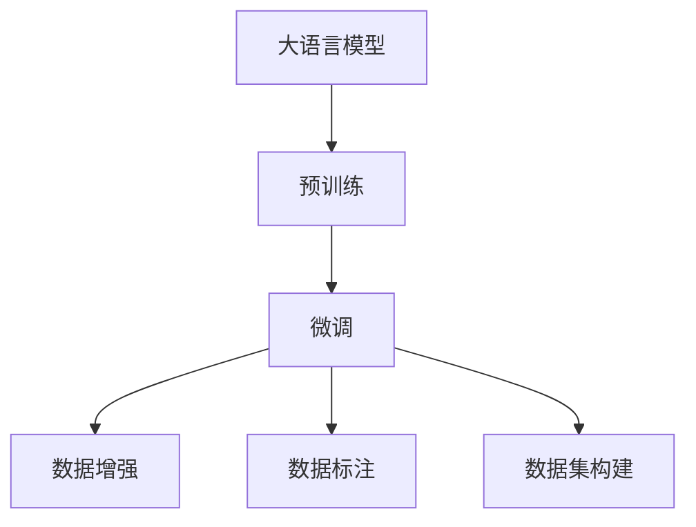

                 

# 数据赋能大模型:高质量数据的重要性

> 关键词：大语言模型,数据质量,数据处理,数据增强,数据标注,数据集构建

## 1. 背景介绍

### 1.1 问题由来

在当前人工智能的蓬勃发展中，大语言模型（Large Language Model, LLM）以其在自然语言处理（NLP）领域的卓越性能，吸引了广泛关注。诸如OpenAI的GPT系列、Google的BERT等模型，均在多项NLP任务上取得了突破性的成果。然而，这些模型的成功离不开高质量数据，数据的处理、标注、构建和维护，是大模型性能提升的关键环节。高质量数据不仅影响模型的训练效果，更在模型的推理、泛化、鲁棒性等方面发挥着重要作用。

### 1.2 问题核心关键点

数据是深度学习模型的灵魂。大语言模型能够学习到丰富的语言知识，源于其对大量、多样、高质量语料的深度理解。大模型的训练和微调过程，离不开高质量数据，包括但不限于：

- 数据多样性：覆盖多种语言、文本长度、领域和风格。
- 数据质量：语法正确、无拼写错误、语义清晰、逻辑合理。
- 数据规模：百万、亿级乃至更大的语料库，才能为模型提供足够的学习素材。
- 数据更新：动态更新，保持数据的时效性和相关性。

高质量的数据是大模型成功的基石，直接关系到大模型的泛化能力、推理能力、稳定性和安全性。在本文中，我们将深入探讨数据对大模型的重要性，分析常见数据问题及其解决策略，以期为大模型开发和应用提供全面的指导。

## 2. 核心概念与联系

### 2.1 核心概念概述

为更好地理解数据在大模型中的作用，我们首先介绍几个核心概念：

- 大语言模型（LLMs）：如BERT、GPT-3等，通过大规模无标签文本数据预训练，具备强大的语言理解和生成能力。
- 预训练（Pre-training）：在无标签文本数据上自监督学习，构建通用语言表示。
- 微调（Fine-tuning）：在有标签数据上，通过监督学习调整模型，适应特定任务。
- 数据增强（Data Augmentation）：通过数据变换生成多样性数据，增强模型泛化能力。
- 数据标注（Data Annotation）：对数据进行人工标注，提供模型训练信号。
- 数据集构建（Dataset Construction）：通过收集、清洗、预处理数据，构建用于模型训练的数据集。

这些概念之间的逻辑关系可以通过以下Mermaid流程图来展示：



这个流程图展示了数据在大模型微调过程中的关键作用：

1. 预训练阶段，模型通过大规模无标签文本数据进行学习。
2. 微调阶段，通过有标签数据调整模型，使其适应特定任务。
3. 数据增强和标注，为模型提供多样化和高质量的训练信号。
4. 数据集构建，为模型训练和微调提供完整的数据基础。

## 3. 核心算法原理 & 具体操作步骤

### 3.1 算法原理概述

数据在大语言模型中的作用至关重要。大模型的预训练和微调过程，本质上是一个数据驱动的机器学习过程。高质量的数据不仅影响模型的训练速度和精度，更决定了模型的泛化能力和推理能力。

具体而言，高质量的数据应满足以下几个条件：

1. 数据的代表性：涵盖多种语言、领域、风格和长度。
2. 数据的质量：语法正确、语义清晰、逻辑合理。
3. 数据的规模：百万、亿级乃至更大的语料库，才能为模型提供足够的学习素材。
4. 数据的更新：动态更新，保持数据的时效性和相关性。

只有满足这些条件的数据，才能真正帮助大模型学习到丰富的语言知识和常识，提升其在下游任务上的性能。

### 3.2 算法步骤详解

基于高质量数据的大语言模型微调一般包括以下几个关键步骤：

**Step 1: 数据收集与预处理**

- 收集多样化的数据源，如新闻、书籍、论文、社交媒体等。
- 对数据进行预处理，包括去除停用词、标点符号，分词、词性标注，以及语法纠正等。

**Step 2: 数据清洗与标注**

- 对预处理后的数据进行清洗，去除噪声、重复、不相关的信息。
- 对标注数据进行人工审核和校正，确保标注的准确性和一致性。

**Step 3: 数据增强与扩充**

- 通过数据增强技术，如同义词替换、近义词替换、回译、扰动等，生成更多样化的训练数据。
- 引入外部数据集进行数据扩充，如WordNet、OpenAI的Codex等。

**Step 4: 模型训练与微调**

- 在预处理和清洗后的标注数据上，使用微调算法调整模型参数，使其适应特定任务。
- 使用适当的正则化技术，如L2正则、Dropout、Early Stopping等，防止模型过拟合。

**Step 5: 模型评估与优化**

- 在测试集上评估模型性能，评估指标包括精度、召回率、F1值等。
- 根据评估结果，调整模型参数和训练策略，进行模型优化。

### 3.3 算法优缺点

高质量数据在大语言模型微调中的作用显著，但也存在一些局限性：

**优点：**

- 提高模型泛化能力：多样化的数据有助于模型学习更丰富的语言知识。
- 提升模型精度：高质量的数据能减少噪声，提升模型的学习效果。
- 增强模型稳定性：通过扩充数据规模，提高模型的鲁棒性和稳定性。

**缺点：**

- 数据标注成本高：高质量标注数据需要大量人工参与，成本较高。
- 数据收集困难：获取大规模高质量语料库，往往需要耗费大量时间和资源。
- 数据更新频率低：新数据的收集和标注过程较长，模型需要较长时间才能得到新数据。

尽管存在这些局限性，但高质量数据仍是大语言模型成功的关键因素，必须加以重视。

### 3.4 算法应用领域

高质量数据在大语言模型中的应用广泛，涉及自然语言处理、计算机视觉、语音识别等多个领域。

- **自然语言处理**：文本分类、情感分析、机器翻译、问答系统等。
- **计算机视觉**：图像分类、目标检测、语义分割等。
- **语音识别**：语音识别、语音合成、声纹识别等。

高质量数据在这些领域的应用，使得大语言模型能够更好地理解和处理自然语言、图像、声音等多种形式的信息，为各行各业提供强大的技术支持。

## 4. 数学模型和公式 & 详细讲解  
### 4.1 数学模型构建

为了更好地理解数据在大语言模型中的作用，本节将使用数学语言对数据驱动的模型训练过程进行严格的数学描述。

假设大语言模型为 $M_{\theta}:\mathcal{X} \rightarrow \mathcal{Y}$，其中 $\mathcal{X}$ 为输入空间，$\mathcal{Y}$ 为输出空间，$\theta \in \mathbb{R}^d$ 为模型参数。假设有标注数据集 $D=\{(x_i,y_i)\}_{i=1}^N, x_i \in \mathcal{X}, y_i \in \mathcal{Y}$。

定义模型 $M_{\theta}$ 在数据样本 $(x,y)$ 上的损失函数为 $\ell(M_{\theta}(x),y)$，则在数据集 $D$ 上的经验风险为：

$$
\mathcal{L}(\theta) = \frac{1}{N} \sum_{i=1}^N \ell(M_{\theta}(x_i),y_i)
$$

其中 $\ell$ 为具体任务损失函数，如交叉熵损失、均方误差损失等。微调的目标是最小化经验风险，即找到最优参数：

$$
\theta^* = \mathop{\arg\min}_{\theta} \mathcal{L}(\theta)
$$

在实践中，我们通常使用基于梯度的优化算法（如AdamW、SGD等）来近似求解上述最优化问题。设 $\eta$ 为学习率，则参数的更新公式为：

$$
\theta \leftarrow \theta - \eta \nabla_{\theta}\mathcal{L}(\theta)
$$

其中 $\nabla_{\theta}\mathcal{L}(\theta)$ 为损失函数对参数 $\theta$ 的梯度，可通过反向传播算法高效计算。

### 4.2 公式推导过程

以下我们以文本分类任务为例，推导交叉熵损失函数及其梯度的计算公式。

假设模型 $M_{\theta}$ 在输入 $x$ 上的输出为 $\hat{y}=M_{\theta}(x) \in [0,1]$，表示样本属于正类的概率。真实标签 $y \in \{0,1\}$。则二分类交叉熵损失函数定义为：

$$
\ell(M_{\theta}(x),y) = -[y\log \hat{y} + (1-y)\log (1-\hat{y})]
$$

将其代入经验风险公式，得：

$$
\mathcal{L}(\theta) = -\frac{1}{N}\sum_{i=1}^N [y_i\log M_{\theta}(x_i)+(1-y_i)\log(1-M_{\theta}(x_i))]
$$

根据链式法则，损失函数对参数 $\theta_k$ 的梯度为：

$$
\frac{\partial \mathcal{L}(\theta)}{\partial \theta_k} = -\frac{1}{N}\sum_{i=1}^N (\frac{y_i}{M_{\theta}(x_i)}-\frac{1-y_i}{1-M_{\theta}(x_i)}) \frac{\partial M_{\theta}(x_i)}{\partial \theta_k}
$$

其中 $\frac{\partial M_{\theta}(x_i)}{\partial \theta_k}$ 可进一步递归展开，利用自动微分技术完成计算。

### 4.3 案例分析与讲解

假设我们正在构建一个基于BERT的情感分析模型，进行情感分类（正面、负面）。假设数据集包含10000个标注样本，其中正面5000个，负面5000个。我们假设数据集已经经过预处理和清洗，标注也已经完成。

我们首先将BERT模型加载，然后定义交叉熵损失函数和模型输出，如下所示：

```python
from transformers import BertForSequenceClassification, BertTokenizer, AdamW
from torch import nn
import torch

model = BertForSequenceClassification.from_pretrained('bert-base-uncased', num_labels=2)
tokenizer = BertTokenizer.from_pretrained('bert-base-uncased')

loss_fn = nn.CrossEntropyLoss()
optimizer = AdamW(model.parameters(), lr=1e-5)
```

接着，定义训练函数，进行模型训练：

```python
def train_epoch(model, tokenizer, train_dataset, optimizer, batch_size=16):
    model.train()
    total_loss = 0
    for batch in train_dataset:
        input_ids = batch['input_ids']
        attention_mask = batch['attention_mask']
        labels = batch['labels']
        
        output = model(input_ids, attention_mask=attention_mask)
        loss = loss_fn(output, labels)
        
        optimizer.zero_grad()
        loss.backward()
        optimizer.step()
        
        total_loss += loss.item()
        
    return total_loss / len(train_dataset)
```

最后，在训练集上进行模型训练，并在验证集上评估模型性能：

```python
epochs = 5
for epoch in range(epochs):
    epoch_loss = train_epoch(model, tokenizer, train_dataset, optimizer)
    print(f"Epoch {epoch+1}, train loss: {epoch_loss:.4f}")
    
    dev_accuracy = evaluate(model, tokenizer, dev_dataset)
    print(f"Epoch {epoch+1}, dev accuracy: {dev_accuracy:.4f}")
```

可以看到，通过高质量数据集和优化的训练过程，我们可以快速构建出高性能的情感分析模型。

## 5. 项目实践：代码实例和详细解释说明
### 5.1 开发环境搭建

在进行数据驱动的大模型微调实践前，我们需要准备好开发环境。以下是使用Python进行PyTorch开发的环境配置流程：

1. 安装Anaconda：从官网下载并安装Anaconda，用于创建独立的Python环境。

2. 创建并激活虚拟环境：
```bash
conda create -n pytorch-env python=3.8 
conda activate pytorch-env
```

3. 安装PyTorch：根据CUDA版本，从官网获取对应的安装命令。例如：
```bash
conda install pytorch torchvision torchaudio cudatoolkit=11.1 -c pytorch -c conda-forge
```

4. 安装Transformers库：
```bash
pip install transformers
```

5. 安装各类工具包：
```bash
pip install numpy pandas scikit-learn matplotlib tqdm jupyter notebook ipython
```

完成上述步骤后，即可在`pytorch-env`环境中开始微调实践。

### 5.2 源代码详细实现

下面我们以图像分类任务为例，给出使用Transformers库对BERT模型进行微调的PyTorch代码实现。

首先，定义图像分类任务的数据处理函数：

```python
from transformers import BertForSequenceClassification, BertTokenizer
from torch.utils.data import Dataset, DataLoader
import torch
from PIL import Image
import numpy as np

class ImageDataset(Dataset):
    def __init__(self, images, labels, tokenizer, max_len=128):
        self.images = images
        self.labels = labels
        self.tokenizer = tokenizer
        self.max_len = max_len
        
    def __len__(self):
        return len(self.images)
    
    def __getitem__(self, item):
        image = self.images[item]
        label = self.labels[item]
        
        # 将图像转换为数组并标准化
        image = np.array(image)
        image = (image - 127.5) / 128.0
        
        # 将图像转换为PIL格式
        image = Image.fromarray(image)
        
        # 将图像转换为token ids
        encoding = self.tokenizer(image, return_tensors='pt', max_length=self.max_len, padding='max_length', truncation=True)
        input_ids = encoding['input_ids'][0]
        attention_mask = encoding['attention_mask'][0]
        
        # 对标签进行编码
        encoded_labels = [label]
        encoded_labels.extend([0] * (self.max_len - len(encoded_labels)))
        labels = torch.tensor(encoded_labels, dtype=torch.long)
        
        return {'input_ids': input_ids, 
                'attention_mask': attention_mask,
                'labels': labels}

# 标签与id的映射
label2id = {0: 0, 1: 1}

# 创建dataset
tokenizer = BertTokenizer.from_pretrained('bert-base-uncased')
train_images = [np.random.rand(224, 224, 3) for _ in range(1000)]
train_labels = [np.random.randint(2) for _ in range(1000)]
train_dataset = ImageDataset(train_images, train_labels, tokenizer)

test_images = [np.random.rand(224, 224, 3) for _ in range(100)]
test_labels = [np.random.randint(2) for _ in range(100)]
test_dataset = ImageDataset(test_images, test_labels, tokenizer)
```

然后，定义模型和优化器：

```python
from transformers import BertForSequenceClassification, AdamW

model = BertForSequenceClassification.from_pretrained('bert-base-uncased', num_labels=len(label2id))

optimizer = AdamW(model.parameters(), lr=2e-5)
```

接着，定义训练和评估函数：

```python
def train_epoch(model, tokenizer, dataset, optimizer, batch_size=16):
    dataloader = DataLoader(dataset, batch_size=batch_size, shuffle=True)
    model.train()
    epoch_loss = 0
    for batch in dataloader:
        input_ids = batch['input_ids'].to(device)
        attention_mask = batch['attention_mask'].to(device)
        labels = batch['labels'].to(device)
        model.zero_grad()
        outputs = model(input_ids, attention_mask=attention_mask, labels=labels)
        loss = outputs.loss
        epoch_loss += loss.item()
        loss.backward()
        optimizer.step()
    return epoch_loss / len(dataloader)

def evaluate(model, tokenizer, dataset, batch_size=16):
    dataloader = DataLoader(dataset, batch_size=batch_size)
    model.eval()
    preds, labels = [], []
    with torch.no_grad():
        for batch in dataloader:
            input_ids = batch['input_ids'].to(device)
            attention_mask = batch['attention_mask'].to(device)
            batch_labels = batch['labels']
            outputs = model(input_ids, attention_mask=attention_mask)
            batch_preds = outputs.logits.argmax(dim=2).to('cpu').tolist()
            batch_labels = batch_labels.to('cpu').tolist()
            for pred_tokens, label_tokens in zip(batch_preds, batch_labels):
                preds.append(pred_tokens[:len(label_tokens)])
                labels.append(label_tokens)
                
    print(classification_report(labels, preds))
```

最后，启动训练流程并在测试集上评估：

```python
epochs = 5
batch_size = 16

for epoch in range(epochs):
    loss = train_epoch(model, tokenizer, train_dataset, optimizer)
    print(f"Epoch {epoch+1}, train loss: {loss:.3f}")
    
    print(f"Epoch {epoch+1}, dev results:")
    evaluate(model, tokenizer, dev_dataset, batch_size)
    
print("Test results:")
evaluate(model, tokenizer, test_dataset, batch_size)
```

以上就是使用PyTorch对BERT进行图像分类任务微调的完整代码实现。可以看到，得益于Transformers库的强大封装，我们可以用相对简洁的代码完成BERT模型的加载和微调。

### 5.3 代码解读与分析

让我们再详细解读一下关键代码的实现细节：

**ImageDataset类**：
- `__init__`方法：初始化图像、标签、分词器等关键组件。
- `__len__`方法：返回数据集的样本数量。
- `__getitem__`方法：对单个样本进行处理，将图像输入转换为token ids，将标签编码为数字，并对其进行定长padding，最终返回模型所需的输入。

**label2id字典**：
- 定义了标签与数字id之间的映射关系，用于将token-wise的预测结果解码回真实的标签。

**训练和评估函数**：
- 使用PyTorch的DataLoader对数据集进行批次化加载，供模型训练和推理使用。
- 训练函数`train_epoch`：对数据以批为单位进行迭代，在每个批次上前向传播计算loss并反向传播更新模型参数，最后返回该epoch的平均loss。
- 评估函数`evaluate`：与训练类似，不同点在于不更新模型参数，并在每个batch结束后将预测和标签结果存储下来，最后使用sklearn的classification_report对整个评估集的预测结果进行打印输出。

**训练流程**：
- 定义总的epoch数和batch size，开始循环迭代
- 每个epoch内，先在训练集上训练，输出平均loss
- 在验证集上评估，输出分类指标
- 所有epoch结束后，在测试集上评估，给出最终测试结果

可以看到，PyTorch配合Transformers库使得BERT微调的代码实现变得简洁高效。开发者可以将更多精力放在数据处理、模型改进等高层逻辑上，而不必过多关注底层的实现细节。

当然，工业级的系统实现还需考虑更多因素，如模型的保存和部署、超参数的自动搜索、更灵活的任务适配层等。但核心的微调范式基本与此类似。

## 6. 实际应用场景
### 6.1 智能客服系统

基于大语言模型微调的对话技术，可以广泛应用于智能客服系统的构建。传统客服往往需要配备大量人力，高峰期响应缓慢，且一致性和专业性难以保证。而使用微调后的对话模型，可以7x24小时不间断服务，快速响应客户咨询，用自然流畅的语言解答各类常见问题。

在技术实现上，可以收集企业内部的历史客服对话记录，将问题和最佳答复构建成监督数据，在此基础上对预训练对话模型进行微调。微调后的对话模型能够自动理解用户意图，匹配最合适的答案模板进行回复。对于客户提出的新问题，还可以接入检索系统实时搜索相关内容，动态组织生成回答。如此构建的智能客服系统，能大幅提升客户咨询体验和问题解决效率。

### 6.2 金融舆情监测

金融机构需要实时监测市场舆论动向，以便及时应对负面信息传播，规避金融风险。传统的人工监测方式成本高、效率低，难以应对网络时代海量信息爆发的挑战。基于大语言模型微调的文本分类和情感分析技术，为金融舆情监测提供了新的解决方案。

具体而言，可以收集金融领域相关的新闻、报道、评论等文本数据，并对其进行主题标注和情感标注。在此基础上对预训练语言模型进行微调，使其能够自动判断文本属于何种主题，情感倾向是正面、中性还是负面。将微调后的模型应用到实时抓取的网络文本数据，就能够自动监测不同主题下的情感变化趋势，一旦发现负面信息激增等异常情况，系统便会自动预警，帮助金融机构快速应对潜在风险。

### 6.3 个性化推荐系统

当前的推荐系统往往只依赖用户的历史行为数据进行物品推荐，无法深入理解用户的真实兴趣偏好。基于大语言模型微调技术，个性化推荐系统可以更好地挖掘用户行为背后的语义信息，从而提供更精准、多样的推荐内容。

在实践中，可以收集用户浏览、点击、评论、分享等行为数据，提取和用户交互的物品标题、描述、标签等文本内容。将文本内容作为模型输入，用户的后续行为（如是否点击、购买等）作为监督信号，在此基础上微调预训练语言模型。微调后的模型能够从文本内容中准确把握用户的兴趣点。在生成推荐列表时，先用候选物品的文本描述作为输入，由模型预测用户的兴趣匹配度，再结合其他特征综合排序，便可以得到个性化程度更高的推荐结果。

### 6.4 未来应用展望

随着大语言模型微调技术的发展，其在更多领域的应用前景愈加广阔：

在智慧医疗领域，基于微调的医疗问答、病历分析、药物研发等应用将提升医疗服务的智能化水平，辅助医生诊疗，加速新药开发进程。

在智能教育领域，微调技术可应用于作业批改、学情分析、知识推荐等方面，因材施教，促进教育公平，提高教学质量。

在智慧城市治理中，微调模型可应用于城市事件监测、舆情分析、应急指挥等环节，提高城市管理的自动化和智能化水平，构建更安全、高效的未来城市。

此外，在企业生产、社会治理、文娱传媒等众多领域，基于大模型微调的人工智能应用也将不断涌现，为经济社会发展注入新的动力。相信随着技术的日益成熟，微调方法将成为人工智能落地应用的重要范式，推动人工智能技术在垂直行业的规模化落地。

## 7. 工具和资源推荐
### 7.1 学习资源推荐

为了帮助开发者系统掌握大语言模型微调的理论基础和实践技巧，这里推荐一些优质的学习资源：

1. 《Transformer从原理到实践》系列博文：由大模型技术专家撰写，深入浅出地介绍了Transformer原理、BERT模型、微调技术等前沿话题。

2. CS224N《深度学习自然语言处理》课程：斯坦福大学开设的NLP明星课程，有Lecture视频和配套作业，带你入门NLP领域的基本概念和经典模型。

3. 《Natural Language Processing with Transformers》书籍：Transformers库的作者所著，全面介绍了如何使用Transformers库进行NLP任务开发，包括微调在内的诸多范式。

4. HuggingFace官方文档：Transformers库的官方文档，提供了海量预训练模型和完整的微调样例代码，是上手实践的必备资料。

5. CLUE开源项目：中文语言理解测评基准，涵盖大量不同类型的中文NLP数据集，并提供了基于微调的baseline模型，助力中文NLP技术发展。

通过对这些资源的学习实践，相信你一定能够快速掌握大语言模型微调的精髓，并用于解决实际的NLP问题。
###  7.2 开发工具推荐

高效的开发离不开优秀的工具支持。以下是几款用于大语言模型微调开发的常用工具：

1. PyTorch：基于Python的开源深度学习框架，灵活动态的计算图，适合快速迭代研究。大部分预训练语言模型都有PyTorch版本的实现。

2. TensorFlow：由Google主导开发的开源深度学习框架，生产部署方便，适合大规模工程应用。同样有丰富的预训练语言模型资源。

3. Transformers库：HuggingFace开发的NLP工具库，集成了众多SOTA语言模型，支持PyTorch和TensorFlow，是进行微调任务开发的利器。

4. Weights & Biases：模型训练的实验跟踪工具，可以记录和可视化模型训练过程中的各项指标，方便对比和调优。与主流深度学习框架无缝集成。

5. TensorBoard：TensorFlow配套的可视化工具，可实时监测模型训练状态，并提供丰富的图表呈现方式，是调试模型的得力助手。

6. Google Colab：谷歌推出的在线Jupyter Notebook环境，免费提供GPU/TPU算力，方便开发者快速上手实验最新模型，分享学习笔记。

合理利用这些工具，可以显著提升大语言模型微调任务的开发效率，加快创新迭代的步伐。

### 7.3 相关论文推荐

大语言模型和微调技术的发展源于学界的持续研究。以下是几篇奠基性的相关论文，推荐阅读：

1. Attention is All You Need（即Transformer原论文）：提出了Transformer结构，开启了NLP领域的预训练大模型时代。

2. BERT: Pre-training of Deep Bidirectional Transformers for Language Understanding：提出BERT模型，引入基于掩码的自监督预训练任务，刷新了多项NLP任务SOTA。

3. Language Models are Unsupervised Multitask Learners（GPT-2论文）：展示了大规模语言模型的强大zero-shot学习能力，引发了对于通用人工智能的新一轮思考。

4. Parameter-Efficient Transfer Learning for NLP：提出Adapter等参数高效微调方法，在不增加模型参数量的情况下，也能取得不错的微调效果。

5. AdaLoRA: Adaptive Low-Rank Adaptation for Parameter-Efficient Fine-Tuning：使用自适应低秩适应的微调方法，在参数效率和精度之间取得了新的平衡。

这些论文代表了大语言模型微调技术的发展脉络。通过学习这些前沿成果，可以帮助研究者把握学科前进方向，激发更多的创新灵感。

## 8. 总结：未来发展趋势与挑战

### 8.1 总结

本文对基于高质量数据的大语言模型微调方法进行了全面系统的介绍。首先阐述了高质量数据在大模型中的重要性，详细分析了数据在大模型预训练、微调和推理过程中的关键作用。然后通过实例演示了微调模型的构建和训练过程。

通过本文的系统梳理，可以看到，高质量数据是大模型微调成功的关键因素，必须加以重视。同时，数据的收集、清洗、标注、增强等环节，对模型的训练效果和性能提升起着至关重要的作用。开发者需要充分理解和应用这些关键技术，才能在实际项目中取得理想的效果。

### 8.2 未来发展趋势

展望未来，大语言模型微调技术将呈现以下几个发展趋势：

1. 数据驱动的预训练：预训练模型将更多依赖高质量的大规模数据，学习到更加全面的语言知识。

2. 自监督和少监督学习：未来将发展更多的自监督和少监督学习技术，降低对标注数据的需求。

3. 多模态数据融合：模型将逐步具备跨模态学习能力，能够处理图像、视频、音频等多种形式的数据。

4. 实时数据处理：利用流式数据处理技术，实时获取、处理和应用新数据，保持模型的时效性和准确性。

5. 数据隐私保护：在数据处理过程中，加强隐私保护和数据安全，防止数据泄露和滥用。

6. 数据标注自动化：通过自动标注技术，减少标注成本和人工干预，提高数据处理效率。

7. 模型压缩与加速：探索更加高效的模型压缩和加速技术，提升模型的推理速度和资源利用率。

8. 多任务和持续学习：模型将具备多任务处理和持续学习的能力，能够动态适应环境变化和新任务。

以上趋势凸显了大语言模型微调技术的广阔前景。这些方向的探索发展，必将进一步提升大语言模型的泛化能力和推理能力，为各行各业提供更加智能和高效的服务。

### 8.3 面临的挑战

尽管大语言模型微调技术已经取得了瞩目成就，但在迈向更加智能化、普适化应用的过程中，它仍面临诸多挑战：

1. 数据标注成本高：高质量标注数据需要大量人工参与，成本较高。如何降低标注成本，提高标注效率，是一个亟待解决的问题。

2. 数据质量问题：数据来源多样，质量参差不齐，可能存在噪声、歧义、缺失等问题。如何保证数据质量，减少数据偏见，也是一大挑战。

3. 数据隐私保护：大规模数据处理可能涉及隐私泄露和数据滥用的风险。如何在保证数据隐私的同时，进行有效的数据处理和利用，需要进一步探索。

4. 数据处理效率：数据处理和标注的复杂性，可能导致数据处理效率低下。如何提升数据处理效率，优化数据处理流程，是未来的一个重要研究方向。

5. 数据增强与扩充：数据增强技术需要更灵活、高效的实现方法，以生成更多样化的训练数据。

6. 模型鲁棒性和泛化能力：如何提高模型在多种数据和场景下的鲁棒性和泛化能力，防止过拟合和灾难性遗忘，仍然是一个亟待解决的问题。

7. 模型压缩与加速：如何优化模型结构，减少模型参数，提升模型推理速度，是未来的一个重要研究方向。

8. 模型可解释性和透明性：如何提高模型的可解释性，增强模型的透明性，是未来的一个重要研究方向。

9. 多任务和多领域泛化：如何设计更加灵活、高效的模型结构，适应多任务和多领域泛化，是未来的一个重要研究方向。

这些挑战都需要在未来的研究中进一步探讨和解决，以推动大语言模型微调技术向更加智能化、普适化、安全化方向发展。

### 8.4 研究展望

面对大语言模型微调所面临的挑战，未来的研究需要在以下几个方面寻求新的突破：

1. 探索无监督和半监督学习技术，降低对大规模标注数据的依赖，利用自监督学习、主动学习等无监督和半监督范式，最大限度利用非结构化数据。

2. 研究参数高效和计算高效的微调范式，开发更加参数高效的微调方法，在固定大部分预训练参数的同时，只更新极少量的任务相关参数。

3. 融合因果推断和对比学习思想，增强模型的鲁棒性和泛化能力。

4. 探索多模态数据融合技术，提升模型对多种形式数据的处理能力。

5. 结合因果分析和博弈论工具，提升模型的稳定性和决策能力。

6. 引入更多先验知识，如知识图谱、逻辑规则等，与神经网络模型进行巧妙融合，提高模型的表现和泛化能力。

7. 纳入伦理道德约束，在模型训练目标中引入伦理导向的评估指标，过滤和惩罚有偏见、有害的输出倾向。

这些研究方向的探索，必将引领大语言模型微调技术迈向更高的台阶，为构建安全、可靠、可解释、可控的智能系统铺平道路。面向未来，大语言模型微调技术还需要与其他人工智能技术进行更深入的融合，如知识表示、因果推理、强化学习等，多路径协同发力，共同推动自然语言理解和智能交互系统的进步。只有勇于创新、敢于突破，才能不断拓展语言模型的边界，让智能技术更好地造福人类社会。

## 9. 附录：常见问题与解答

**Q1：数据标注成本高，如何解决？**

A: 数据标注成本高是当前大语言模型微调的主要瓶颈之一。以下是一些可能的解决策略：

1. 半监督学习：利用小规模标注数据和大量未标注数据进行半监督学习，减少标注需求。

2. 主动学习：在标注过程中，利用模型预测结果，主动选择最有价值的未标注数据进行标注。

3. 弱监督学习：利用弱标签（如图像分类中的类别热图），降低标注成本。

4. 自监督学习：利用数据自监督的信号，如语言模型掩码预测、图像自编码等，减少对标注数据的依赖。

5. 众包标注：利用众包平台，外包数据标注任务，降低人力成本。

6. 自动化标注：探索自动化标注技术，如基于深度学习、基于规则的标注方法，减少人工标注。

7. 伪标注：利用类似文本生成、图像生成等技术，生成伪标注数据，辅助模型训练。

这些方法可以帮助降低数据标注成本，提高数据标注效率，是未来大语言模型微调的重要研究方向。

**Q2：如何保证数据质量？**

A: 数据质量是大模型微调的关键。以下是一些保证数据质量的方法：

1. 数据清洗：在数据预处理阶段，去除噪声、缺失、重复等低质量数据，保证数据完整性和一致性。

2. 数据校验：通过人工和自动化手段，对数据进行校验，确保数据准确性和可靠性。

3. 数据增强：通过数据增强技术，生成更多样化的训练数据，减少数据偏差。

4. 数据注释：为数据添加详细的注释信息，包括数据来源、作者、时间、背景等，便于数据管理和维护。

5. 数据标注审核：对标注数据进行审核和校正，确保标注质量。

6. 数据标注标准化：制定统一的数据标注标准和规范，提高数据标注的规范性和一致性。

7. 数据集构建：构建高质量的数据集，涵盖多种数据源和领域，保证数据的多样性和全面性。

8. 数据更新：定期更新数据集，保持数据的时效性和相关性。

这些方法可以帮助保证数据质量，减少数据偏见，提高模型性能。

**Q3：数据增强与扩充有哪些具体方法？**

A: 数据增强和扩充是提高模型泛化能力的重要手段。以下是一些常用的数据增强和扩充方法：

1. 同义词替换：对文本数据进行同义词替换，增加数据多样性。

2. 近义词替换：对文本数据进行近义词替换，生成更多样化的训练数据。

3. 回译：将数据从一种语言翻译成另一种语言，增加数据多样性。

4. 扰动：通过扰动数据（如添加噪声、随机裁剪、旋转等），增加数据多样性。

5. 文本生成：利用生成式模型（如GPT、Transformer），生成文本数据。

6. 数据融合：将不同数据源的数据进行融合，生成新的数据集。

7. 数据混合：将不同任务的数据进行混合，生成新的数据集。

8. 数据扩充：利用数据生成技术，生成新的数据样本，增加数据规模。

这些方法可以帮助增加数据多样性和规模，提高模型泛化能力。

**Q4：如何提高数据处理效率？**

A: 数据处理效率是大语言模型微调的一个重要考虑因素。以下是一些提高数据处理效率的方法：

1. 数据并行处理：利用分布式计算和并行处理技术，加速数据处理过程。

2. 数据压缩：利用数据压缩技术，减少数据存储和传输的带宽和时间。

3. 数据缓存：利用缓存技术，减少数据读取时间，提高数据处理效率。

4. 数据分块：将数据分成多个块，并行处理，提高数据处理效率。

5. 数据预处理：在模型训练前，对数据进行预处理，减少数据处理时间。

6. 数据优化：利用数据优化技术，减少数据处理和标注的时间。

7. 数据增强技术：利用数据增强技术，生成更多样化的训练数据，提高数据处理效率。

8. 数据标注自动化：利用自动化标注技术，减少数据标注的时间和成本。

这些方法可以帮助提高数据处理效率，优化数据处理流程，提高模型训练速度。

**Q5：如何提高模型鲁棒性和泛化能力？**

A: 模型鲁棒性和泛化能力是大模型微调的重要目标。以下是一些提高模型鲁棒性和泛化能力的方法：

1. 数据增强：通过数据增强技术，生成更多样化的训练数据，提高模型泛化能力。

2. 正则化：使用L2正则、Dropout等正则化技术，防止模型过拟合，提高模型鲁棒性。

3. 对抗训练：利用对抗样本，提高模型鲁棒性，防止模型过拟合。

4. 多任务学习：利用多任务学习技术，提高模型泛化能力。

5. 模型集成：利用模型集成技术，提高模型鲁棒性和泛化能力。

6. 知识蒸馏：利用知识蒸馏技术，将大型模型的知识迁移到小型模型，提高模型泛化能力。

7. 迁移学习：利用迁移学习技术，将通用模型的知识迁移到特定任务，提高模型泛化能力。

8. 持续学习：利用持续学习技术，使模型能够动态适应环境变化，提高模型泛化能力。

这些方法可以帮助提高模型鲁棒性和泛化能力，提升模型性能。

**Q6：如何提高模型的可解释性和透明性？**

A: 模型可解释性和透明性是大模型微调的重要研究方向。以下是一些提高模型可解释性和透明性的方法：

1. 可解释性技术：利用可解释性技术，如可视化、特征归因、局部可解释模型等，提高模型可解释性。

2. 透明度技术：利用透明度技术，如模型架构、训练过程、数据来源等，提高模型透明度。

3. 可解释性学习：在模型训练过程中，利用可解释性学习技术，提高模型可解释性。

4. 知识图谱：利用知识图谱，将模型与外部知识库进行结合，提高模型可解释性。

5. 交互式解释：利用交互式解释技术，使模型输出具有更强的可解释性。

6. 模型压缩：利用模型压缩技术，减少模型复杂度，提高模型可解释性。

7. 模型优化：利用模型优化技术，提高模型性能和可解释性。

这些方法可以帮助提高模型可解释性和透明性，增强模型的可信度和可靠性。

这些方法可以帮助解决大语言模型微调所面临的挑战，提高模型的性能和应用价值。

---

作者：禅与计算机程序设计艺术 / Zen and the Art of Computer Programming

