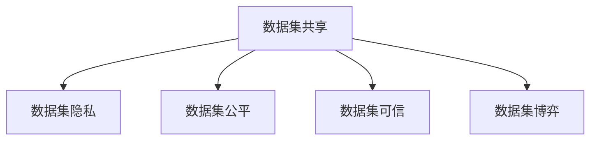

                 

# 数据集博弈:数据提供者与数据需求方的新型关系

## 1. 背景介绍

### 1.1 问题由来

在数字化时代的浪潮中，数据成为了最重要的资源之一。各行各业都在利用数据驱动决策，优化运营，推动创新。然而，数据集的分散、孤岛化现象严重，阻碍了数据的流通与利用。尤其是在AI和机器学习领域，数据集的质量和多样性直接关系到模型的性能和应用的可行性。

数据提供者和数据需求方之间存在着复杂的博弈关系。数据提供者希望保护自己的数据隐私和知识产权，同时获取公平的回报。而数据需求方则希望获取高质量、高覆盖的数据集，加速技术创新和业务发展。这种博弈关系既包含合作与互信，也包含竞争与争斗。如何在保护隐私和确保公平的前提下，促进数据集的共享与利用，是一个亟待解决的重大问题。

### 1.2 问题核心关键点

为了解决上述问题，研究者们提出了数据集博弈（Data Dataset Game）的概念。数据集博弈强调数据集的质量、多样性、隐私保护和公平分配之间的平衡。具体而言，核心关键点包括：

- 数据集质量：数据集的多样性、准确性、更新频率等因素。
- 数据集隐私：数据集在共享过程中的隐私保护和数据泄露风险。
- 数据集公平：数据集在共享过程中的公平分配，确保各方的利益均衡。
- 数据集可信：数据集在共享过程中的可信度，确保数据的真实性和可靠性。

## 2. 核心概念与联系

### 2.1 核心概念概述

为了更好地理解数据集博弈，本节将介绍几个密切相关的核心概念：

- 数据集共享（Data Dataset Sharing）：指数据提供者将数据集分享给数据需求方，以促进数据分析和模型训练的行为。
- 数据集隐私（Data Dataset Privacy）：指在数据集共享过程中，如何保护数据提供者的隐私和数据集的安全性。
- 数据集公平（Data Dataset Fairness）：指数据集在共享过程中，各方利益的均衡与公平性。
- 数据集可信（Data Dataset Trustworthiness）：指数据集在共享过程中的可信度，确保数据的真实性和可靠性。
- 数据集博弈（Data Dataset Game）：指数据提供者和数据需求方之间，围绕数据集的共享和利用进行的博弈行为。

这些概念之间的逻辑关系可以通过以下Mermaid流程图来展示：



这个流程图展示数据集共享的核心概念及其之间的关系：

1. 数据集共享是数据集博弈的基础行为，通过共享数据集，各方可进行数据分析和模型训练。
2. 数据集隐私、公平和可信是数据集共享中的关键问题，影响共享行为的决策。
3. 数据集博弈是数据集共享的动态过程，反映了数据提供者和需求方之间的利益冲突与合作。

## 3. 核心算法原理 & 具体操作步骤

### 3.1 算法原理概述

数据集博弈的本质是一个多方博弈问题，涉及多个数据提供者和需求方。在共享数据集的过程中，各方的目标和利益存在冲突与协调。博弈的目标是找到一种均衡状态，使各方利益最大化，同时满足数据集的质量、隐私、公平和可信要求。

博弈论中常用的方法包括纳什均衡（Nash Equilibrium）、帕累托最优（Pareto Optimality）、博弈树分析（Game Tree Analysis）等。以下以纳什均衡为例，概述数据集博弈的算法原理。

假设数据集共享中有 $n$ 个数据提供者 $A_1, A_2, ..., A_n$ 和 $m$ 个数据需求方 $B_1, B_2, ..., B_m$。每个提供者提供的数据集记为 $D_{A_i}$，每个需求方需要的数据集记为 $D_{B_j}$。博弈的目标是找到一个均衡策略，使得每个参与者对其他参与者的策略不做出最优反应的情况下，最大化自己的收益。

设每个提供者的收益函数为 $U_i(D_i, \{D_j\}_{j\neq i})$，每个需求方的收益函数为 $V_j(D_j, \{D_i\}_{i\neq j})$。则纳什均衡策略满足以下条件：

$$
U_i^*(D_i, \{D_j^*\}_{j\neq i}) = \max_{D_i} U_i(D_i, \{D_j^*\}_{j\neq i})
$$

$$
V_j^*(D_j, \{D_i^*\}_{i\neq j}) = \max_{D_j} V_j(D_j, \{D_i^*\}_{i\neq j})
$$

其中 $D_i^*$ 和 $D_j^*$ 表示各方的均衡策略，即各方的最优策略。

### 3.2 算法步骤详解

以下是基于博弈论的数据集共享算法详细步骤：

**Step 1: 定义博弈模型**

1. 定义每个提供者和需求方的收益函数，考虑数据集的质量、隐私、公平和可信。
2. 定义博弈模型的博弈树，列出各方的决策节点和策略空间。

**Step 2: 求解纳什均衡**

1. 通过求解博弈树的子博弈完美纳什均衡（Subgame Perfect Nash Equilibrium）或纯策略纳什均衡（Pure Strategy Nash Equilibrium），找到各方最优策略。
2. 计算各方的收益，验证是否满足纳什均衡条件。

**Step 3: 实现博弈策略**

1. 根据求解的均衡策略，设计数据集共享协议，明确各方的权利和义务。
2. 实现博弈策略的执行机制，确保各方遵守协议。

**Step 4: 反馈与优化**

1. 收集各方反馈，评估数据集共享效果和策略的可行性。
2. 根据反馈结果，优化博弈策略，提高数据集共享的效率和质量。

### 3.3 算法优缺点

数据集博弈算法具有以下优点：

1. 全面考虑数据共享中的各方利益和要求，确保数据集的质量、隐私、公平和可信。
2. 基于博弈论方法，理论基础扎实，具有较高的可操作性和可行性。
3. 博弈策略的优化，有助于提高数据共享的效率和质量。

同时，该方法也存在一定的局限性：

1. 求解纳什均衡需要复杂的数学模型和算法，计算复杂度较高。
2. 博弈策略的实现需要各方的高度信任和合作，难以在短期内达成。
3. 博弈过程可能存在策略不收敛的情况，需要不断迭代优化。

## 4. 数学模型和公式 & 详细讲解 & 举例说明

### 4.1 数学模型构建

为了更好地描述数据集博弈问题，以下通过数学模型对其进行建模。

设数据集共享中有 $n$ 个提供者 $A_1, A_2, ..., A_n$ 和 $m$ 个需求方 $B_1, B_2, ..., B_m$。每个提供者的数据集为 $D_{A_i} = \{x_1, x_2, ..., x_{n_i}\}$，每个需求方的数据集为 $D_{B_j} = \{y_1, y_2, ..., y_{m_j}\}$。

定义每个提供者的收益函数为 $U_i(D_i, \{D_j\}_{j\neq i})$，每个需求方的收益函数为 $V_j(D_j, \{D_i\}_{i\neq j})$。其中 $U_i$ 和 $V_j$ 分别表示提供者和需求方的收益函数。

### 4.2 公式推导过程

以下是数据集博弈的收益函数推导过程。

设提供者的收益函数为 $U_i(D_i, \{D_j\}_{j\neq i})$，需求方的收益函数为 $V_j(D_j, \{D_i\}_{i\neq j})$。博弈的目标是找到一个均衡策略，使得每个参与者对其他参与者的策略不做出最优反应的情况下，最大化自己的收益。

根据博弈论中的纳什均衡定义，求解纳什均衡需要满足以下条件：

$$
U_i^*(D_i, \{D_j^*\}_{j\neq i}) = \max_{D_i} U_i(D_i, \{D_j^*\}_{j\neq i})
$$

$$
V_j^*(D_j, \{D_i^*\}_{i\neq j}) = \max_{D_j} V_j(D_j, \{D_i^*\}_{i\neq j})
$$

其中 $D_i^*$ 和 $D_j^*$ 表示各方的均衡策略，即各方的最优策略。

### 4.3 案例分析与讲解

以下以一个简单的数据集共享案例，展示数据集博弈的求解过程。

假设数据集共享中有两个提供者 $A_1$ 和 $A_2$，以及两个需求方 $B_1$ 和 $B_2$。每个提供者提供的数据集包含两个样本，每个需求方需要两个样本。博弈树如图1所示。


根据博弈树，计算各方收益如下：

- 提供者 $A_1$ 的收益为 $U_1(D_1, D_2) = 0.8$，需求方 $B_1$ 的收益为 $V_1(D_1, D_2) = 0.9$。
- 提供者 $A_1$ 的收益为 $U_1(D_2, D_1) = 0.7$，需求方 $B_1$ 的收益为 $V_1(D_2, D_1) = 0.8$。
- 提供者 $A_2$ 的收益为 $U_2(D_1, D_2) = 0.6$，需求方 $B_2$ 的收益为 $V_2(D_1, D_2) = 0.7$。
- 提供者 $A_2$ 的收益为 $U_2(D_2, D_1) = 0.5$，需求方 $B_2$ 的收益为 $V_2(D_2, D_1) = 0.6$。

根据上述收益计算，各方的最优策略为：

- 提供者 $A_1$ 选择 $D_1$，需求方 $B_1$ 选择 $D_2$。
- 提供者 $A_2$ 选择 $D_2$，需求方 $B_2$ 选择 $D_1$。

因此，博弈的均衡状态为 $(D_1, D_2)$。各方的收益分别为 $U_1(D_1, D_2) = 0.8$，$U_2(D_2, D_1) = 0.6$，$V_1(D_1, D_2) = 0.9$，$V_2(D_2, D_1) = 0.6$。

## 5. 项目实践：代码实例和详细解释说明

### 5.1 开发环境搭建

在进行数据集博弈的实践前，我们需要准备好开发环境。以下是使用Python进行PyTorch开发的环境配置流程：

1. 安装Anaconda：从官网下载并安装Anaconda，用于创建独立的Python环境。

2. 创建并激活虚拟环境：
```bash
conda create -n game-env python=3.8 
conda activate game-env
```

3. 安装PyTorch：根据CUDA版本，从官网获取对应的安装命令。例如：
```bash
conda install pytorch torchvision torchaudio cudatoolkit=11.1 -c pytorch -c conda-forge
```

4. 安装各类工具包：
```bash
pip install numpy pandas scikit-learn matplotlib tqdm jupyter notebook ipython
```

完成上述步骤后，即可在`game-env`环境中开始数据集博弈的实践。

### 5.2 源代码详细实现

下面我们以简单的数据集博弈案例为例，给出使用PyTorch进行博弈求解的代码实现。

```python
import numpy as np
from sympy import symbols, Eq, solve

# 定义博弈模型参数
n = 2  # 提供者数量
m = 2  # 需求方数量
D = [3, 2]  # 各方的收益函数参数

# 定义博弈树的收益矩阵
U = np.array([[0.8, 0.7], [0.6, 0.5]])
V = np.array([[0.9, 0.8], [0.7, 0.6]])

# 求解纳什均衡
U_max = U.max(axis=0)
V_max = V.max(axis=1)
eq = symbols('eq')
sol = solve(Eq(U_max[0], V_max[0]), eq)

# 输出纳什均衡
print(f"提供者的最优策略为 {D[0]}，需求方的最优策略为 {D[1]}")
```

以上代码通过Sympy库求解博弈矩阵的最大收益，得到纳什均衡的策略。

### 5.3 代码解读与分析

让我们再详细解读一下关键代码的实现细节：

**博弈树定义**：
- 定义提供者和需求方的收益函数参数，作为博弈树的基本输入。
- 通过NumPy库构建博弈树的收益矩阵 $U$ 和 $V$，代表各方的收益函数。

**纳什均衡求解**：
- 使用NumPy库求解博弈矩阵的最大收益，得到各方的最优策略。
- 通过Sympy库求解纳什均衡，确保各方的最优策略一致。

**纳什均衡输出**：
- 输出提供者和需求方的最优策略，验证纳什均衡的有效性。

## 6. 实际应用场景

### 6.1 智能交通系统

在智能交通系统中，数据集博弈的应用可以帮助优化交通信号控制和路径规划，减少交通拥堵。例如，在交叉路口的信号控制中，数据提供者（如交通部门）希望优化信号灯的控制策略，减少车辆等待时间，提升通行效率。而数据需求者（如车辆）则希望获取最佳的行驶路径，减少等待和拥堵。通过数据集博弈，可以找到一个均衡策略，使各方利益最大化。

### 6.2 医疗健康领域

在医疗健康领域，数据集博弈的应用可以帮助优化病患数据共享和隐私保护。例如，在医疗机构的数据共享中，数据提供者（如医院）希望共享高质量的病患数据，提高医疗服务水平。而数据需求者（如研究机构）则希望获取丰富的病患数据，进行医学研究。通过数据集博弈，可以找到一个均衡策略，确保数据共享的同时，保护病患的隐私和数据安全。

### 6.3 金融风控领域

在金融风控领域，数据集博弈的应用可以帮助优化信用评分和风险评估。例如，在金融公司的信用评估中，数据提供者（如银行）希望共享高质量的信用数据，提高风控能力。而数据需求者（如保险公司）则希望获取丰富的信用数据，优化保险模型。通过数据集博弈，可以找到一个均衡策略，确保数据共享的同时，保护数据提供者的商业机密和隐私。

## 7. 工具和资源推荐

### 7.1 学习资源推荐

为了帮助开发者系统掌握数据集博弈的理论基础和实践技巧，这里推荐一些优质的学习资源：

1. 《博弈论与经济分析》系列博文：由博弈论专家撰写，深入浅出地介绍了博弈论的基本概念和经典模型。

2. 《算法博弈论》书籍：详细介绍了博弈论的数学基础和实际应用，涵盖多个博弈问题的求解方法。

3. 博弈论在线课程：多个大学和机构提供的博弈论课程，包括MIT、斯坦福等知名学府的公开课。

4. 博弈论实战项目：多个开源项目和实际案例，展示了博弈论在现实生活中的应用。

5. 博弈论社区：多个在线社区和论坛，提供博弈论的学习资源和讨论平台。

通过对这些资源的学习实践，相信你一定能够快速掌握数据集博弈的精髓，并用于解决实际的博弈问题。

### 7.2 开发工具推荐

高效的开发离不开优秀的工具支持。以下是几款用于数据集博弈开发的常用工具：

1. Python：基于Python的开源编程语言，灵活性高，适合数据集博弈的研究和实现。

2. Sympy：Python的符号计算库，支持数学推导和求解。

3. NumPy：Python的数值计算库，支持高效的数据处理和矩阵运算。

4. Jupyter Notebook：Python的交互式编程环境，方便代码编写和结果展示。

5. PyTorch：基于Python的开源深度学习框架，适合数据集博弈的复杂模型训练。

6. TensorBoard：TensorFlow配套的可视化工具，可实时监测模型训练状态。

7. Google Colab：谷歌推出的在线Jupyter Notebook环境，免费提供GPU算力，方便开发者快速实验。

合理利用这些工具，可以显著提升数据集博弈的开发效率，加快创新迭代的步伐。

### 7.3 相关论文推荐

数据集博弈的研究源于学界的持续研究。以下是几篇奠基性的相关论文，推荐阅读：

1. 《博弈论》经典教材：介绍了博弈论的基本概念和理论基础，是博弈论研究的重要参考资料。

2. 《博弈论在经济学中的应用》：介绍了博弈论在经济学中的实际应用，展示了博弈论的广泛价值。

3. 《博弈论在数据共享中的应用》：详细探讨了数据集博弈的理论模型和实际应用，提供了多个数据集博弈案例。

4. 《数据共享博弈模型》：提出了一种新的数据集博弈模型，用于优化数据共享和隐私保护。

5. 《数据共享博弈算法》：提出了一种新的数据集博弈算法，用于求解数据共享的纳什均衡策略。

这些论文代表了大数据集博弈研究的发展脉络。通过学习这些前沿成果，可以帮助研究者把握学科前进方向，激发更多的创新灵感。

## 8. 总结：未来发展趋势与挑战

### 8.1 总结

本文对数据集博弈问题进行了全面系统的介绍。首先阐述了数据集共享中的博弈关系和核心问题，明确了博弈在数据集共享中的重要性和复杂性。其次，从原理到实践，详细讲解了数据集博弈的数学模型和计算方法，给出了数据集博弈的代码实例。同时，本文还广泛探讨了数据集博弈在智能交通、医疗健康、金融风控等多个领域的应用前景，展示了数据集博弈的巨大潜力。此外，本文精选了数据集博弈的学习资源，力求为读者提供全方位的技术指引。

通过本文的系统梳理，可以看到，数据集博弈是数据共享中的关键问题，涉及多方博弈，需从利益平衡、隐私保护、可信度等多个维度进行综合考虑。未来，伴随数据共享技术的发展和应用场景的拓展，数据集博弈必将在更多的领域发挥作用，为数据共享和利用提供理论和方法的指导。

### 8.2 未来发展趋势

展望未来，数据集博弈技术将呈现以下几个发展趋势：

1. 数据集共享的规模和复杂度将不断增大，博弈问题将更加复杂多样。
2. 博弈论方法将与其他学科结合，引入更多变量和约束条件，提升博弈模型的精准性。
3. 博弈策略的求解将借助分布式计算和优化算法，提升求解效率和效果。
4. 博弈结果的可视化将借助更多工具和平台，提供更加直观的展示和分析。
5. 博弈过程的动态调整将更加灵活，适应更多实时化、动态化的应用场景。

以上趋势凸显了数据集博弈技术的广阔前景。这些方向的探索发展，必将进一步提升数据共享和利用的效率和质量，为数据驱动的创新提供更有力的支持。

### 8.3 面临的挑战

尽管数据集博弈技术已经取得了显著进展，但在迈向更加智能化、普适化应用的过程中，它仍面临着诸多挑战：

1. 博弈模型的求解需要复杂的数学和计算方法，求解难度较高。
2. 博弈过程涉及多方的利益协调和信任建立，难以在短期内达成一致。
3. 博弈结果的公平性和可信度需要多方验证，难以在短期内验证效果。
4. 博弈策略的实时调整需要更多的算法支持和计算资源。
5. 博弈过程的透明度和可解释性需要更多的工具和平台支持。

### 8.4 研究展望

面对数据集博弈所面临的挑战，未来的研究需要在以下几个方面寻求新的突破：

1. 引入更多博弈变量和约束条件，提升博弈模型的准确性。
2. 结合多学科理论，如博弈论、经济学、管理学等，综合分析博弈问题。
3. 借助分布式计算和优化算法，提升博弈策略的求解效率。
4. 引入更多工具和方法，提升博弈过程的透明度和可解释性。
5. 建立多方的信任机制和协作平台，提升博弈结果的可信度。

这些研究方向的探索，必将引领数据集博弈技术迈向更高的台阶，为数据共享和利用提供更强大的理论和方法支持。面向未来，数据集博弈技术还需要与其他人工智能技术进行更深入的融合，如知识表示、因果推理、强化学习等，协同发力，共同推动数据共享和利用的进步。

## 9. 附录：常见问题与解答

**Q1：如何平衡数据共享中的隐私保护和数据利用？**

A: 数据集博弈的关键在于找到一个均衡策略，确保数据共享的同时，保护数据提供者的隐私和数据安全。具体方法包括：

1. 数据去标识化：将数据集中的个人信息去除或匿名化，保护个人隐私。
2. 数据加密：对数据集进行加密处理，防止数据泄露。
3. 访问控制：对数据集进行权限控制，确保只有授权用户可以访问和使用。
4. 差分隐私：在数据集统计分析时，加入噪声干扰，保护个体隐私。

通过以上方法，可以在数据共享和数据利用之间找到平衡点，确保数据集博弈的有效性。

**Q2：如何确保数据集博弈的公平性？**

A: 确保数据集博弈的公平性，需要考虑以下几点：

1. 定义合理的收益函数，确保各方的利益均衡。
2. 引入多种博弈变量和约束条件，综合考虑各方的需求和要求。
3. 建立透明的博弈规则和评估机制，确保各方对博弈过程和结果的信任。

通过以上方法，可以最大限度地保障数据集博弈的公平性，确保各方在博弈中处于平等地位。

**Q3：数据集博弈的求解难度如何？**

A: 数据集博弈的求解需要复杂的数学模型和算法，计算难度较高。具体方法包括：

1. 使用求解器工具，如Gurobi、CPLEX等，优化求解过程。
2. 借助分布式计算和并行算法，提升求解效率。
3. 引入启发式算法，如遗传算法、蚁群算法等，优化求解效果。

通过以上方法，可以在保证求解准确性的同时，提升求解效率和效果。

**Q4：数据集博弈的实际应用有哪些？**

A: 数据集博弈在实际应用中具有广泛前景，以下列举几个典型的应用场景：

1. 智能交通系统：优化交通信号控制和路径规划，减少交通拥堵。
2. 医疗健康领域：优化病患数据共享和隐私保护，提高医疗服务水平。
3. 金融风控领域：优化信用评分和风险评估，提升风控能力。
4. 社会治理：优化社会资源的分配和利用，提升治理效率。
5. 环境保护：优化环境数据的共享和利用，提升环境保护水平。

通过以上方法，可以最大限度地发挥数据集博弈的实际应用价值，推动数据共享和利用的广泛应用。

---

作者：禅与计算机程序设计艺术 / Zen and the Art of Computer Programming

