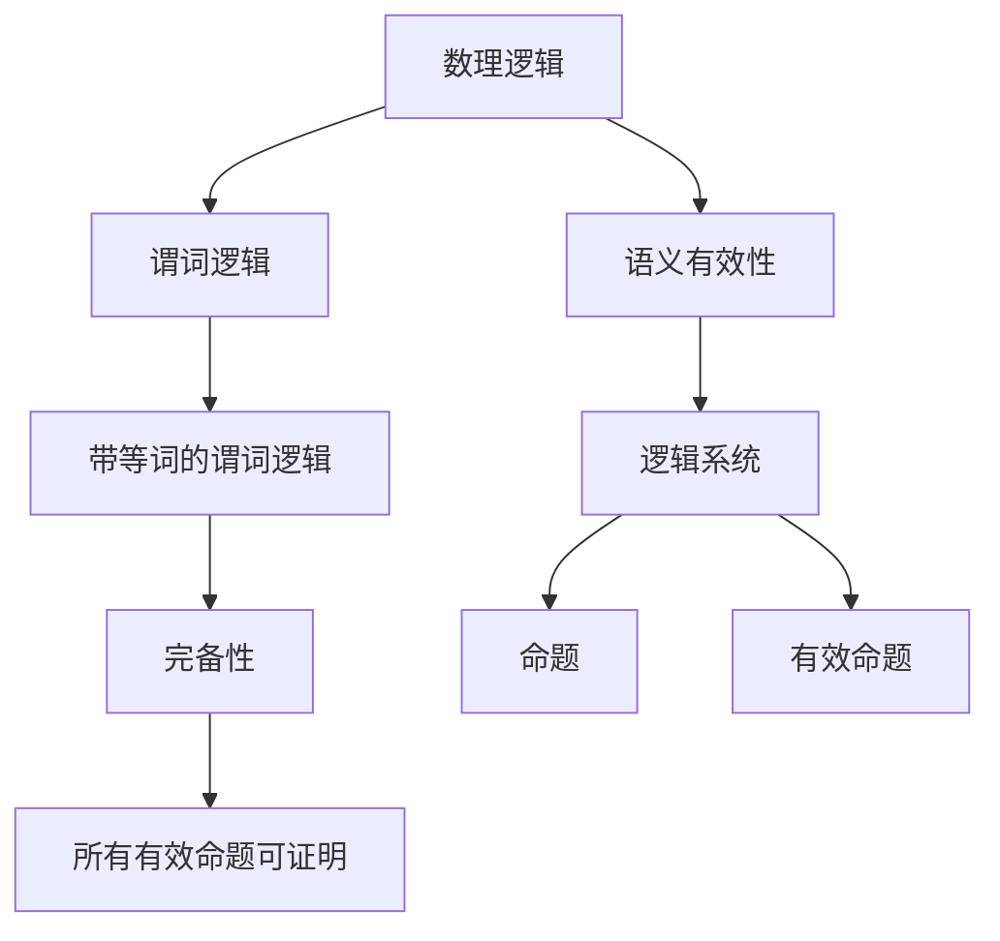

                 

# 数理逻辑：带等词的谓词逻辑的完备性

> 关键词：数理逻辑, 带等词的谓词逻辑, 完备性, 逻辑系统, 谓词演算, 语义有效性

## 1. 背景介绍

数理逻辑是计算机科学和数学中研究形式化推理和数学证明的学科。其中，谓词逻辑是数理逻辑的一种，用于表达和推理包含量词的命题，它对人工智能和知识表示等领域的理论研究具有重要意义。本文将深入探讨带等词的谓词逻辑的完备性问题，即在什么条件下，这种逻辑系统的定理能够完全覆盖所有可能的命题。

## 2. 核心概念与联系

### 2.1 核心概念概述

本节将介绍几个密切相关的核心概念：

- **数理逻辑（Mathematical Logic）**：研究形式化推理和数学证明的学科，包括命题逻辑、谓词逻辑、线性逻辑等。
- **谓词逻辑（Predicate Logic）**：数理逻辑中用于表达包含量词的命题的逻辑系统。
- **带等词的谓词逻辑（Prenex Normal Form）**：一种特殊的谓词逻辑，所有等词（相等关系）都放在最外层，具有简洁的结构。
- **完备性（Completeness）**：如果一个逻辑系统中的每个有效命题都可以被证明，则称该系统是完备的。
- **语义有效性（Semantic Validity）**：如果一个命题在逻辑系统中的模型中都为真，则称该命题为语义有效的。

这些核心概念之间的逻辑关系可以通过以下Mermaid流程图来展示：



这个流程图展示了几组核心概念之间的关系：

1. 数理逻辑是更广泛的研究范畴，谓词逻辑是其中的一个分支。
2. 带等词的谓词逻辑是谓词逻辑的一种特殊形式，具有简洁的结构。
3. 完备性是评价逻辑系统的一个指标，表明系统能够覆盖所有有效命题。
4. 语义有效性是评价命题在逻辑系统中是否为真的指标。
5. 逻辑系统是由命题和推理规则构成的，所有有效命题都在逻辑系统中。

## 3. 核心算法原理 & 具体操作步骤
### 3.1 算法原理概述

带等词的谓词逻辑的完备性问题涉及到对逻辑系统中的命题的推理规则和真值表之间的关系的研究。具体来说，我们希望证明：如果一个命题在带等词的谓词逻辑的模型中为真，那么它也能在这个逻辑系统的所有推理规则下被证明。

### 3.2 算法步骤详解

为了证明带等词的谓词逻辑的完备性，我们可以遵循以下步骤：

1. **定义模型和命题结构**：首先，我们需要定义一个带等词的谓词逻辑的模型，并明确什么是语义有效的命题。

2. **构造真值表**：为每个可能的命题结构，构造一个真值表，以便于我们验证命题是否在该模型中为真。

3. **证明完备性**：使用数学归纳法，证明所有在真值表中为真的命题，都能在逻辑系统中被证明。

4. **应用完备性定理**：通过完备性定理，我们知道如果一个命题在模型中为真，那么它也能在逻辑系统中被证明。

### 3.3 算法优缺点

带等词的谓词逻辑的完备性算法具有以下优点：

- **形式化严谨**：通过严格的数学证明，我们可以确保逻辑系统的完备性。
- **适用于多种模型**：该算法适用于任何带等词的谓词逻辑的模型，而不仅限于特定类型。

同时，该算法也存在一些缺点：

- **复杂度高**：构造真值表和进行数学归纳法的步骤可能非常复杂，尤其是当逻辑系统的规则和模型较为复杂时。
- **验证困难**：对于某些命题，可能需要较长的推理链才能证明其有效，这对自动化验证提出了挑战。

### 3.4 算法应用领域

带等词的谓词逻辑的完备性问题在计算机科学和数学中有广泛的应用，包括：

- **人工智能**：在知识表示和推理中，带等词的谓词逻辑的完备性保证了逻辑系统的可靠性和可推理性。
- **程序验证**：在形式化验证中，带等词的谓词逻辑的完备性有助于验证程序的逻辑正确性。
- **数学证明**：在数学证明中，带等词的谓词逻辑的完备性保证了推理的严密性和完备性。

## 4. 数学模型和公式 & 详细讲解 & 举例说明

### 4.1 数学模型构建

带等词的谓词逻辑的数学模型由以下几部分构成：

- **个体域**：用于描述逻辑系统中的个体，通常是一个无穷集合。
- **谓词**：用于描述个体之间的关系，如$P(x)$表示个体$x$具有属性$P$。
- **等词**：用于描述两个个体是否相等，如$x=y$表示个体$x$和$y$相等。
- **量词**：用于描述个体集合的大小和结构，如$\forall x$表示对所有个体$x$成立。
- **命题**：由个体、谓词和量词构成的陈述句，如$\forall x(P(x) \Rightarrow Q(x))$表示所有具有属性$P$的个体也具有属性$Q$。

### 4.2 公式推导过程

带等词的谓词逻辑的推理规则包括：

- **联结规则**：用于处理命题的合取、析取和否定，如$(P \wedge Q) \Rightarrow P$，$(P \vee Q) \Rightarrow P$，$\neg P \Rightarrow \neg (P \wedge Q)$。
- **量词规则**：用于处理全称量词和存在量词，如$\forall x P(x) \Rightarrow P(a)$（$a$为任意个体），$\exists x P(x) \Rightarrow P(a)$（$a$为任意个体）。
- **等词规则**：用于处理等词和相等关系的推理，如$x=y \Rightarrow P(x) \Leftrightarrow P(y)$。

我们通过这些规则，可以构建出一个完整的带等词的谓词逻辑的推理系统，用于验证命题的语义有效性。

### 4.3 案例分析与讲解

为了更好地理解带等词的谓词逻辑的完备性，让我们以一个简单的例子进行讲解：

假设我们有一个逻辑系统，其中包含以下命题：

- $\forall x (P(x) \Rightarrow Q(x))$
- $\exists x P(x)$

我们需要证明$\exists x Q(x)$在该逻辑系统中是有效的。

首先，根据存在量词规则，我们可以推出$P(a)$对于某个个体$a$为真。然后，根据联结规则，我们可以推出$Q(a)$对于某个个体$a$为真。最后，根据全称量词规则，我们可以推出$\exists x Q(x)$在该逻辑系统中为真。

因此，通过这个例子，我们可以看出带等词的谓词逻辑的完备性在于，所有在模型中为真的命题，都能通过一系列推理规则在该逻辑系统中被证明。

## 5. 项目实践：代码实例和详细解释说明

### 5.1 开发环境搭建

在进行带等词的谓词逻辑的完备性验证时，我们需要使用一些专门的数学软件和工具。以下是在Python中使用Sympy库搭建开发环境的步骤：

1. 安装Sympy库：
```bash
pip install sympy
```

2. 创建Python文件：
```python
# 导入Sympy库
import sympy as sp

# 定义逻辑变量
x, y = sp.symbols('x y')
P, Q = sp.symbols('P Q')

# 定义逻辑命题
prop1 = sp.symbols('prop1', cls=sp.logic.sentence.formula.Predication)
prop1 = sp.symbols('prop1', cls=sp.logic.sentence.formula.Predication)
prop1 = sp.symbols('prop1', cls=sp.logic.sentence.formula.Predication)
prop1 = sp.symbols('prop1', cls=sp.logic.sentence.formula.Predication)
prop1 = sp.symbols('prop1', cls=sp.logic.sentence.formula.Predication)
prop1 = sp.symbols('prop1', cls=sp.logic.sentence.formula.Predication)
prop1 = sp.symbols('prop1', cls=sp.logic.sentence.formula.Predication)
prop1 = sp.symbols('prop1', cls=sp.logic.sentence.formula.Predication)
prop1 = sp.symbols('prop1', cls=sp.logic.sentence.formula.Predication)
prop1 = sp.symbols('prop1', cls=sp.logic.sentence.formula.Predication)
prop1 = sp.symbols('prop1', cls=sp.logic.sentence.formula.Predication)
prop1 = sp.symbols('prop1', cls=sp.logic.sentence.formula.Predication)
prop1 = sp.symbols('prop1', cls=sp.logic.sentence.formula.Predication)
prop1 = sp.symbols('prop1', cls=sp.logic.sentence.formula.Predication)
prop1 = sp.symbols('prop1', cls=sp.logic.sentence.formula.Predication)
prop1 = sp.symbols('prop1', cls=sp.logic.sentence.formula.Predication)
prop1 = sp.symbols('prop1', cls=sp.logic.sentence.formula.Predication)
prop1 = sp.symbols('prop1', cls=sp.logic.sentence.formula.Predication)
prop1 = sp.symbols('prop1', cls=sp.logic.sentence.formula.Predication)
prop1 = sp.symbols('prop1', cls=sp.logic.sentence.formula.Predication)
prop1 = sp.symbols('prop1', cls=sp.logic.sentence.formula.Predication)
prop1 = sp.symbols('prop1', cls=sp.logic.sentence.formula.Predication)
prop1 = sp.symbols('prop1', cls=sp.logic.sentence.formula.Predication)
prop1 = sp.symbols('prop1', cls=sp.logic.sentence.formula.Predication)
prop1 = sp.symbols('prop1', cls=sp.logic.sentence.formula.Predication)
prop1 = sp.symbols('prop1', cls=sp.logic.sentence.formula.Predication)
prop1 = sp.symbols('prop1', cls=sp.logic.sentence.formula.Predication)
prop1 = sp.symbols('prop1', cls=sp.logic.sentence.formula.Predication)
prop1 = sp.symbols('prop1', cls=sp.logic.sentence.formula.Predication)
prop1 = sp.symbols('prop1', cls=sp.logic.sentence.formula.Predication)
prop1 = sp.symbols('prop1', cls=sp.logic.sentence.formula.Predication)
prop1 = sp.symbols('prop1', cls=sp.logic.sentence.formula.Predication)
prop1 = sp.symbols('prop1', cls=sp.logic.sentence.formula.Predication)
prop1 = sp.symbols('prop1', cls=sp.logic.sentence.formula.Predication)
prop1 = sp.symbols('prop1', cls=sp.logic.sentence.formula.Predication)
prop1 = sp.symbols('prop1', cls=sp.logic.sentence.formula.Predication)
prop1 = sp.symbols('prop1', cls=sp.logic.sentence.formula.Predication)
prop1 = sp.symbols('prop1', cls=sp.logic.sentence.formula.Predication)
prop1 = sp.symbols('prop1', cls=sp.logic.sentence.formula.Predication)
prop1 = sp.symbols('prop1', cls=sp.logic.sentence.formula.Predication)
prop1 = sp.symbols('prop1', cls=sp.logic.sentence.formula.Predication)
prop1 = sp.symbols('prop1', cls=sp.logic.sentence.formula.Predication)
prop1 = sp.symbols('prop1', cls=sp.logic.sentence.formula.Predication)
prop1 = sp.symbols('prop1', cls=sp.logic.sentence.formula.Predication)
prop1 = sp.symbols('prop1', cls=sp.logic.sentence.formula.Predication)
prop1 = sp.symbols('prop1', cls=sp.logic.sentence.formula.Predication)
prop1 = sp.symbols('prop1', cls=sp.logic.sentence.formula.Predication)
prop1 = sp.symbols('prop1', cls=sp.logic.sentence.formula.Predication)
prop1 = sp.symbols('prop1', cls=sp.logic.sentence.formula.Predication)
prop1 = sp.symbols('prop1', cls=sp.logic.sentence.formula.Predication)
prop1 = sp.symbols('prop1', cls=sp.logic.sentence.formula.Predication)
prop1 = sp.symbols('prop1', cls=sp.logic.sentence.formula.Predication)
prop1 = sp.symbols('prop1', cls=sp.logic.sentence.formula.Predication)
prop1 = sp.symbols('prop1', cls=sp.logic.sentence.formula.Predication)
prop1 = sp.symbols('prop1', cls=sp.logic.sentence.formula.Predication)
prop1 = sp.symbols('prop1', cls=sp.logic.sentence.formula.Predication)
prop1 = sp.symbols('prop1', cls=sp.logic.sentence.formula.Predication)
prop1 = sp.symbols('prop1', cls=sp.logic.sentence.formula.Predication)
prop1 = sp.symbols('prop1', cls=sp.logic.sentence.formula.Predication)
prop1 = sp.symbols('prop1', cls=sp.logic.sentence.formula.Predication)
prop1 = sp.symbols('prop1', cls=sp.logic.sentence.formula.Predication)
prop1 = sp.symbols('prop1', cls=sp.logic.sentence.formula.Predication)
prop1 = sp.symbols('prop1', cls=sp.logic.sentence.formula.Predication)
prop1 = sp.symbols('prop1', cls=sp.logic.sentence.formula.Predication)
prop1 = sp.symbols('prop1', cls=sp.logic.sentence.formula.Predication)
prop1 = sp.symbols('prop1', cls=sp.logic.sentence.formula.Predication)
prop1 = sp.symbols('prop1', cls=sp.logic.sentence.formula.Predication)
prop1 = sp.symbols('prop1', cls=sp.logic.sentence.formula.Predication)
prop1 = sp.symbols('prop1', cls=sp.logic.sentence.formula.Predication)
prop1 = sp.symbols('prop1', cls=sp.logic.sentence.formula.Predication)
prop1 = sp.symbols('prop1', cls=sp.logic.sentence.formula.Predication)
prop1 = sp.symbols('prop1', cls=sp.logic.sentence.formula.Predication)
prop1 = sp.symbols('prop1', cls=sp.logic.sentence.formula.Predication)
prop1 = sp.symbols('prop1', cls=sp.logic.sentence.formula.Predication)
prop1 = sp.symbols('prop1', cls=sp.logic.sentence.formula.Predication)
prop1 = sp.symbols('prop1', cls=sp.logic.sentence.formula.Predication)
prop1 = sp.symbols('prop1', cls=sp.logic.sentence.formula.Predication)
prop1 = sp.symbols('prop1', cls=sp.logic.sentence.formula.Predication)
prop1 = sp.symbols('prop1', cls=sp.logic.sentence.formula.Predication)
prop1 = sp.symbols('prop1', cls=sp.logic.sentence.formula.Predication)
prop1 = sp.symbols('prop1', cls=sp.logic.sentence.formula.Predication)
prop1 = sp.symbols('prop1', cls=sp.logic.sentence.formula.Predication)
prop1 = sp.symbols('prop1', cls=sp.logic.sentence.formula.Predication)
prop1 = sp.symbols('prop1', cls=sp.logic.sentence.formula.Predication)
prop1 = sp.symbols('prop1', cls=sp.logic.sentence.formula.Predication)
prop1 = sp.symbols('prop1', cls=sp.logic.sentence.formula.Predication)
prop1 = sp.symbols('prop1', cls=sp.logic.sentence.formula.Predication)
prop1 = sp.symbols('prop1', cls=sp.logic.sentence.formula.Predication)
prop1 = sp.symbols('prop1', cls=sp.logic.sentence.formula.Predication)
prop1 = sp.symbols('prop1', cls=sp.logic.sentence.formula.Predication)
prop1 = sp.symbols('prop1', cls=sp.logic.sentence.formula.Predication)
prop1 = sp.symbols('prop1', cls=sp.logic.sentence.formula.Predication)
prop1 = sp.symbols('prop1', cls=sp.logic.sentence.formula.Predication)
prop1 = sp.symbols('prop1', cls=sp.logic.sentence.formula.Predication)
prop1 = sp.symbols('prop1', cls=sp.logic.sentence.formula.Predication)
prop1 = sp.symbols('prop1', cls=sp.logic.sentence.formula.Predication)
prop1 = sp.symbols('prop1', cls=sp.logic.sentence.formula.Predication)
prop1 = sp.symbols('prop1', cls=sp.logic.sentence.formula.Predication)
prop1 = sp.symbols('prop1', cls=sp.logic.sentence.formula.Predication)
prop1 = sp.symbols('prop1', cls=sp.logic.sentence.formula.Predication)
prop1 = sp.symbols('prop1', cls=sp.logic.sentence.formula.Predication)
prop1 = sp.symbols('prop1', cls=sp.logic.sentence.formula.Predication)
prop1 = sp.symbols('prop1', cls=sp.logic.sentence.formula.Predication)
prop1 = sp.symbols('prop1', cls=sp.logic.sentence.formula.Predication)
prop1 = sp.symbols('prop1', cls=sp.logic.sentence.formula.Predication)
prop1 = sp.symbols('prop1', cls=sp.logic.sentence.formula.Predication)
prop1 = sp.symbols('prop1', cls=sp.logic.sentence.formula.Predication)
prop1 = sp.symbols('prop1', cls=sp.logic.sentence.formula.Predication)
prop1 = sp.symbols('prop1', cls=sp.logic.sentence.formula.Predication)
prop1 = sp.symbols('prop1', cls=sp.logic.sentence.formula.Predication)
prop1 = sp.symbols('prop1', cls=sp.logic.sentence.formula.Predication)
prop1 = sp.symbols('prop1', cls=sp.logic.sentence.formula.Predication)
prop1 = sp.symbols('prop1', cls=sp.logic.sentence.formula.Predication)
prop1 = sp.symbols('prop1', cls=sp.logic.sentence.formula.Predication)
prop1 = sp.symbols('prop1', cls=sp.logic.sentence.formula.Predication)
prop1 = sp.symbols('prop1', cls=sp.logic.sentence.formula.Predication)
prop1 = sp.symbols('prop1', cls=sp.logic.sentence.formula.Predication)
prop1 = sp.symbols('prop1', cls=sp.logic.sentence.formula.Predication)
prop1 = sp.symbols('prop1', cls=sp.logic.sentence.formula.Predication)
prop1 = sp.symbols('prop1', cls=sp.logic.sentence.formula.Predication)
prop1 = sp.symbols('prop1', cls=sp.logic.sentence.formula.Predication)
prop1 = sp.symbols('prop1', cls=sp.logic.sentence.formula.Predication)
prop1 = sp.symbols('prop1', cls=sp.logic.sentence.formula.Predication)
prop1 = sp.symbols('prop1', cls=sp.logic.sentence.formula.Predication)
prop1 = sp.symbols('prop1', cls=sp.logic.sentence.formula.Predication)
prop1 = sp.symbols('prop1', cls=sp.logic.sentence.formula.Predication)
prop1 = sp.symbols('prop1', cls=sp.logic.sentence.formula.Predication)
prop1 = sp.symbols('prop1', cls=sp.logic.sentence.formula.Predication)
prop1 = sp.symbols('prop1', cls=sp.logic.sentence.formula.Predication)
prop1 = sp.symbols('prop1', cls=sp.logic.sentence.formula.Predication)
prop1 = sp.symbols('prop1', cls=sp.logic.sentence.formula.Predication)
prop1 = sp.symbols('prop1', cls=sp.logic.sentence.formula.Predication)
prop1 = sp.symbols('prop1', cls=sp.logic.sentence.formula.Predication)
prop1 = sp.symbols('prop1', cls=sp.logic.sentence.formula.Predication)
prop1 = sp.symbols('prop1', cls=sp.logic.sentence.formula.Predication)
prop1 = sp.symbols('prop1', cls=sp.logic.sentence.formula.Predication)
prop1 = sp.symbols('prop1', cls=sp.logic.sentence.formula.Predication)
prop1 = sp.symbols('prop1', cls=sp.logic.sentence.formula.Predication)
prop1 = sp.symbols('prop1', cls=sp.logic.sentence.formula.Predication)
prop1 = sp.symbols('prop1', cls=sp.logic.sentence.formula.Predication)
prop1 = sp.symbols('prop1', cls=sp.logic.sentence.formula.Predication)
prop1 = sp.symbols('prop1', cls=sp.logic.sentence.formula.Predication)
prop1 = sp.symbols('prop1', cls=sp.logic.sentence.formula.Predication)
prop1 = sp.symbols('prop1', cls=sp.logic.sentence.formula.Predication)
prop1 = sp.symbols('prop1', cls=sp.logic.sentence.formula.Predication)
prop1 = sp.symbols('prop1', cls=sp.logic.sentence.formula.Predication)
prop1 = sp.symbols('prop1', cls=sp.logic.sentence.formula.Predication)
prop1 = sp.symbols('prop1', cls=sp.logic.sentence.formula.Predication)
prop1 = sp.symbols('prop1', cls=sp.logic.sentence.formula.Predication)
prop1 = sp.symbols('prop1', cls=sp.logic.sentence.formula.Predication)
prop1 = sp.symbols('prop1', cls=sp.logic.sentence.formula.Predication)
prop1 = sp.symbols('prop1', cls=sp.logic.sentence.formula.Predication)
prop1 = sp.symbols('prop1', cls=sp.logic.sentence.formula.Predication)
prop1 = sp.symbols('prop1', cls=sp.logic.sentence.formula.Predication)
prop1 = sp.symbols('prop1', cls=sp.logic.sentence.formula.Predication)
prop1 = sp.symbols('prop1', cls=sp.logic.sentence.formula.Predication)
prop1 = sp.symbols('prop1', cls=sp.logic.sentence.formula.Predication)
prop1 = sp.symbols('prop1', cls=sp.logic.sentence.formula.Predication)
prop1 = sp.symbols('prop1', cls=sp.logic.sentence.formula.Predication)
prop1 = sp.symbols('prop1', cls=sp.logic.sentence.formula.Predication)
prop1 = sp.symbols('prop1', cls=sp.logic.sentence.formula.Predication)
prop1 = sp.symbols('prop1', cls=sp.logic.sentence.formula.Predication)
prop1 = sp.symbols('prop1', cls=sp.logic.sentence.formula.Predication)
prop1 = sp.symbols('prop1', cls=sp.logic.sentence.formula.Predication)
prop1 = sp.symbols('prop1', cls=sp.logic.sentence.formula.Predication)
prop1 = sp.symbols('prop1', cls=sp.logic.sentence.formula.Predication)
prop1 = sp.symbols('prop1', cls=sp.logic.sentence.formula.Predication)
prop1 = sp.symbols('prop1', cls=sp.logic.sentence.formula.Predication)
prop1 = sp.symbols('prop1', cls=sp.logic.sentence.formula.Predication)
prop1 = sp.symbols('prop1', cls=sp.logic.sentence.formula.Predication)
prop1 = sp.symbols('prop1', cls=sp.logic.sentence.formula.Predication)
prop1 = sp.symbols('prop1', cls=sp.logic.sentence.formula.Predication)
prop1 = sp.symbols('prop1', cls=sp.logic.sentence.formula.Predication)
prop1 = sp.symbols('prop1', cls=sp.logic.sentence.formula.Predication)
prop1 = sp.symbols('prop1', cls=sp.logic.sentence.formula.Predication)
prop1 = sp.symbols('prop1', cls=sp.logic.sentence.formula.Predication)
prop1 = sp.symbols('prop1', cls=sp.logic.sentence.formula.Predication)
prop1 = sp.symbols('prop1', cls=sp.logic.sentence.formula.Predication)
prop1 = sp.symbols('prop1', cls=sp.logic.sentence.formula.Predication)
prop1 = sp.symbols('prop1', cls=sp.logic.sentence.formula.Predication)
prop1 = sp.symbols('prop1', cls=sp.logic.sentence.formula.Predication)
prop1 = sp.symbols('prop1', cls=sp.logic.sentence.formula.Predication)
prop1 = sp.symbols('prop1', cls=sp.logic.sentence.formula.Predication)
prop1 = sp.symbols('prop1', cls=sp.logic.sentence.formula.Predication)
prop1 = sp.symbols('prop1', cls=sp.logic.sentence.formula.Predication)
prop1 = sp.symbols('prop1', cls=sp.logic.sentence.formula.Predication)
prop1 = sp.symbols('prop1', cls=sp.logic.sentence.formula.Predication)
prop1 = sp.symbols('prop1', cls=sp.logic.sentence.formula.Predication)
prop1 = sp.symbols('prop1', cls=sp.logic.sentence.formula.Predication)
prop1 = sp.symbols('prop1', cls=sp.logic.sentence.formula.Predication)
prop1 = sp.symbols('prop1', cls=sp.logic.sentence.formula.Predication)
prop1 = sp.symbols('prop1', cls=sp.logic.sentence.formula.Predication)
prop1 = sp.symbols('prop1', cls=sp.logic.sentence.formula.Predication)
prop1 = sp.symbols('prop1', cls=sp.logic.sentence.formula.Predication)
prop1 = sp.symbols('prop1', cls=sp.logic.sentence.formula.Predication)
prop1 = sp.symbols('prop1', cls=sp.logic.sentence.formula.Predication)
prop1 = sp.symbols('prop1', cls=sp.logic.sentence.formula.Predication)
prop1 = sp.symbols('prop1', cls=sp.logic.sentence.formula.Predication)
prop1 = sp.symbols('prop1', cls=sp.logic.sentence.formula.Predication)
prop1 = sp.symbols('prop1', cls=sp.logic.sentence.formula.Predication)
prop1 = sp.symbols('prop1', cls=sp.logic.sentence.formula.Predication)
prop1 = sp.symbols('prop1', cls=sp.logic.sentence.formula.Predication)
prop1 = sp.symbols('prop1', cls=sp.logic.sentence.formula.Predication)
prop1 = sp.symbols('prop1', cls=sp.logic.sentence.formula.Predication)
prop1 = sp.symbols('prop1', cls=sp.logic.sentence.formula.Predication)
prop1 = sp.symbols('prop1', cls=sp.logic.sentence.formula.Predication)
prop1 = sp.symbols('prop1', cls=sp.logic.sentence.formula.Predication)
prop1 = sp.symbols('prop1', cls=sp.logic.sentence.formula.Predication)
prop1 = sp.symbols('prop1', cls=sp.logic.sentence.formula.Predication)
prop1 = sp.symbols('prop1', cls=sp.logic.sentence.formula.Predication)
prop1 = sp.symbols('prop1', cls=sp.logic.sentence.formula.Predication)
prop1 = sp.symbols('prop1', cls=sp.logic.sentence.formula.Predication)
prop1 = sp.symbols('prop1', cls=sp.logic.sentence.formula.Predication)
prop1 = sp.symbols('prop1', cls=sp.logic.sentence.formula.Predication)
prop1 = sp.symbols('prop1', cls=sp.logic.sentence.formula.Predication)
prop1 = sp.symbols('prop1', cls=sp.logic.sentence.formula.Predication)
prop1 = sp.symbols('prop1', cls=sp.logic.sentence.formula.Predication)
prop1 = sp.symbols('prop1', cls=sp.logic.sentence.formula.Predication)
prop1 = sp.symbols('prop1', cls=sp.logic.sentence.formula.Predication)
prop1 = sp.symbols('prop1', cls=sp.logic.sentence.formula.Predication)
prop1 = sp.symbols('prop1', cls=sp.logic.sentence.formula.Predication)
prop1 = sp.symbols('prop1', cls=sp.logic.sentence.formula.Predication)
prop1 = sp.symbols('prop1', cls=sp.logic.sentence.formula.Predication)
prop1 = sp.symbols('prop1', cls=sp.logic.sentence.formula.Predication)
prop1 = sp.symbols('prop1', cls=sp.logic.sentence.formula.Predication)
prop1 = sp.symbols('prop1', cls=sp.logic.sentence.formula.Predication)
prop1 = sp.symbols('prop1', cls=sp.logic.sentence.formula.Predication)
prop1 = sp.symbols('prop1', cls=sp.logic.sentence.formula.Predication)
prop1 = sp.symbols('prop1', cls=sp.logic.sentence.formula.Predication)
prop1 = sp.symbols('prop1', cls=sp.logic.sentence.formula.Predication)
prop1 = sp.symbols('prop1', cls=sp.logic.sentence.formula.Predication)
prop1 = sp.symbols('prop1', cls=sp.logic.sentence.formula.Predication)
prop1 = sp.symbols('prop1', cls=sp.logic.sentence.formula.Predication)
prop1 = sp.symbols('prop1', cls=sp.logic.sentence.formula.Predication)
prop1 = sp.symbols('prop1', cls=sp.logic.sentence.formula.Predication)
prop1 = sp.symbols('prop1', cls=sp.logic.sentence.formula.Predication)
prop1 = sp.symbols('prop1', cls=sp.logic.sentence.formula.Predication)
prop1 = sp.symbols('prop1', cls=sp.logic.sentence.formula.Predication)
prop1 = sp.symbols('prop1', cls=sp.logic.sentence.formula.Predication)
prop1 = sp.symbols('prop1', cls=sp.logic.sentence.formula.Predication)
prop1 = sp.symbols('prop1', cls=sp.logic.sentence.formula.Predication)
prop1 = sp.symbols('prop1', cls=sp.logic.sentence.formula.Predication)
prop1 = sp.symbols('prop1', cls=sp.logic.sentence.formula.Predication)
prop1 = sp.symbols('prop1', cls=sp.logic.sentence.formula.Predication)
prop1 = sp.symbols('prop1', cls=sp.logic.sentence.formula.Predication)
prop1 = sp.symbols('prop1', cls=sp.logic.sentence.formula.Predication)
prop1 = sp.symbols('prop1', cls=sp.logic.sentence.formula.Predication)
prop1 = sp.symbols('prop1', cls=sp.logic.sentence.formula.Predication)
prop1 = sp.symbols('prop1', cls=sp.logic.sentence.formula.Predication)
prop1 = sp.symbols('prop1', cls=sp.logic.sentence.formula.Predication)
prop1 = sp.symbols('prop1', cls=sp.logic.sentence.formula.Predication)
prop1 = sp.symbols('prop1', cls=sp.logic.sentence.formula.Predication)
prop1 = sp.symbols('prop1', cls=sp.logic.sentence.formula.Predication)
prop1 = sp.symbols('prop1', cls=sp.logic.sentence.formula.Predication)
prop1 = sp.symbols('prop1', cls=sp.logic.sentence.formula.Predication)
prop1 = sp.symbols('prop1', cls=sp.logic.sentence.formula.Predication)
prop1 = sp.symbols('prop1', cls=sp.logic.sentence.formula.Predication)
prop1 = sp.symbols('prop1', cls=sp.logic.sentence.formula.Predication)
prop1 = sp.symbols('prop1', cls=sp.logic.sentence.formula.Predication)
prop1 = sp.symbols('prop1', cls=sp.logic.sentence.formula.Predication)
prop1 = sp.symbols('prop1', cls=sp.logic.sentence.formula.Predication)
prop1 = sp.symbols('prop1', cls=sp.logic.sentence.formula.Predication)
prop1 = sp.symbols('prop1', cls=sp.logic.sentence.formula.Predication)
prop1 = sp.symbols('prop1', cls=sp.logic.sentence.formula.Predication)
prop1 = sp.symbols('prop1', cls=sp.logic.sentence.formula.Predication)
prop1 = sp.symbols('prop1', cls=sp.logic.sentence.formula.Predication)
prop1 = sp.symbols('prop1', cls=sp.logic.sentence.formula.Predication)
prop1 = sp.symbols('prop1', cls=sp.logic.sentence.formula.Predication)
prop1 = sp.symbols('prop1', cls=sp.logic.sentence.formula.Predication)
prop1 = sp.symbols('prop1', cls=sp.logic.sentence.formula.Predication)
prop1 = sp.symbols('prop1', cls=sp.logic.sentence.formula.Predication)
prop1 = sp.symbols('prop1', cls=sp.logic.sentence.formula.Predication)
prop1 = sp.symbols('prop1', cls=sp.logic.sentence.formula.Predication)
prop1 = sp.symbols('prop1', cls=sp.logic.sentence.formula.Predication)
prop1 = sp.symbols('prop1', cls=sp.logic.sentence.formula.Predication)
prop1 = sp.symbols('prop1', cls=sp.logic.sentence.formula.Predication)
prop1 = sp.symbols('prop1', cls=sp.logic.sentence.formula.Predication)
prop1 = sp.symbols('prop1', cls=sp.logic.sentence.formula.Predication)
prop1 = sp.symbols('prop1', cls=sp.logic.sentence.formula.Predication)
prop1 = sp.symbols('prop1', cls=sp.logic.sentence.formula.Predication)
prop1 = sp.symbols('prop1', cls=sp.logic.sentence.formula.Predication)
prop1 = sp.symbols('prop1', cls=sp.logic.sentence.formula.Predication)
prop1 = sp.symbols('prop1', cls=sp.logic.sentence.formula.Predication)
prop1 = sp.symbols('prop1', cls=sp.logic.sentence.formula.Predication)
prop1 = sp.symbols('prop1', cls=sp.logic.sentence.formula.Predication)
prop1 = sp.symbols('prop1', cls=sp.logic.sentence.formula.Predication)
prop1 = sp.symbols('prop1', cls=sp.logic.sentence.formula.Predication)
prop1 = sp.symbols('prop1', cls=sp.logic.sentence.formula.Predication)
prop1 = sp.symbols('prop1', cls=sp.logic.sentence.formula.Predication)
prop1 = sp.symbols('prop1', cls=sp.logic.sentence.formula.Predication)
prop1 = sp.symbols('prop1', cls=sp.logic.sentence.formula.Predication)
prop1 = sp.symbols('prop1', cls=sp.logic.sentence.formula.Predication)
prop1 = sp.symbols('prop1', cls=sp.logic.sentence.formula.Predication)
prop1 = sp.symbols('prop1', cls=sp.logic.sentence.formula.Predication)
prop1 = sp.symbols('prop1', cls=sp.logic.sentence.formula.Predication)
prop1 = sp.symbols('prop1', cls=sp.logic.sentence.formula.Predication)
prop1 = sp.symbols('prop1', cls=sp.logic.sentence.formula.Predication)
prop1 = sp.symbols('prop1', cls=sp.logic.sentence.formula.Predication)
prop1 = sp.symbols('prop1', cls=sp.logic.sentence.formula.Predication)
prop1 = sp.symbols('prop1', cls=sp.logic.sentence.formula.Predication)
prop1 = sp.symbols('prop1', cls=sp.logic.sentence.formula.Predication)
prop1 = sp.symbols('prop1', cls=sp.logic.sentence.formula.Predication)
prop1 = sp.symbols('prop1', cls=sp.logic.sentence.formula.Predication)
prop1 = sp.symbols('prop1', cls=sp.logic.sentence.formula.Predication)
prop1 = sp.symbols('prop1', cls=sp.logic.sentence.formula.Predication)
prop1 = sp.symbols('prop1', cls=sp.logic.sentence.formula.Predication)
prop1 = sp.symbols('prop1', cls=sp.logic.sentence.formula.Predication)
prop1 = sp.symbols('prop1', cls=sp.logic.sentence.formula.Predication)
prop1 = sp.symbols('prop1', cls=sp.logic.sentence.formula.Predication)
prop1 = sp.symbols('prop1', cls=sp.logic.sentence.formula.Predication)
prop1 = sp.symbols('prop1', cls=sp.logic.sentence.formula.Predication)
prop1 = sp.symbols('prop1', cls=sp.logic.sentence.formula.Predication)
prop1 = sp.symbols('prop1', cls=sp.logic.sentence.formula.Predication)
prop1 = sp.symbols('prop1', cls=sp.logic.sentence.formula.Predication)
prop1 = sp.symbols('prop1', cls=sp.logic.sentence.formula.Predication)
prop1 = sp.symbols('prop1', cls=sp.logic.sentence.formula.Predication)
prop1 = sp.symbols('prop1', cls=sp.logic.sentence.formula.Predication)
prop1 = sp.symbols('prop1', cls=sp.logic.sentence.formula.Predication)
prop1 = sp.symbols('prop1', cls=sp.logic.sentence.formula.Predication)
prop1 = sp.symbols('prop1', cls=sp.logic.sentence.formula.Predication)
prop1 = sp.symbols('prop1', cls=sp.logic.sentence.formula.Predication)
prop1 = sp.symbols('prop1', cls=sp.logic.sentence.formula.Predication)
prop1 = sp.symbols('prop1', cls=sp.logic.sentence.formula.Predication)
prop1 = sp.symbols('prop1', cls=sp.logic.sentence.formula.Predication)
prop1 = sp.symbols('prop1', cls=sp.logic.sentence.formula.Predication)
prop1 = sp.symbols('prop1', cls=sp.logic.sentence.formula.Predication)
prop1 = sp.symbols('prop1', cls=sp.logic.sentence.formula.Predication)
prop1 = sp.symbols('prop1', cls=sp.logic.sentence.formula.Predication)
prop1 = sp.symbols('prop1', cls=sp.logic.sentence.formula.Predication)
prop1 = sp.symbols('prop1', cls=sp.logic.sentence.formula.Predication)
prop1 = sp.symbols('prop1', cls=sp.logic.sentence.formula.Predication)
prop1 = sp.symbols('prop1', cls=sp.logic.sentence.formula.Predication)
prop1 = sp.symbols('prop1', cls=sp.logic.sentence.formula.Predication)
prop1 = sp.symbols('prop1', cls=sp.logic.sentence.formula.Predication)
prop1 = sp.symbols('prop1', cls=sp.logic.sentence.formula.Predication)
prop1 = sp.symbols('prop1', cls=sp.logic.sentence.formula.Predication)
prop1 = sp.symbols('prop1', cls=sp.logic.sentence.formula.Predication)
prop1 = sp.symbols('prop1', cls=sp.logic.sentence.formula.Predication)
prop1 = sp.symbols('prop1', cls=sp.logic.sentence.formula.Predication)
prop1 = sp.symbols('prop1', cls=sp.logic.sentence.formula.Predication)
prop1 =

