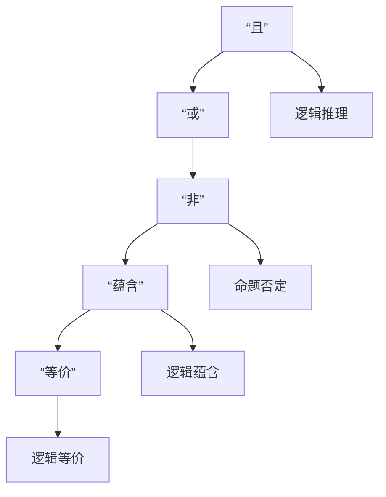

                 

# 数理逻辑：逻辑词的可定义性

## 1. 背景介绍

逻辑词，包括连词“且”、“或”、“非”等，是数理逻辑研究的核心要素之一。逻辑词在传统形式逻辑和现代计算理论中都有广泛应用。本文将探讨数理逻辑中逻辑词的可定义性问题，包括其定义、应用及存在的问题。

## 2. 核心概念与联系

### 2.1 核心概念概述

逻辑词，是指能够表达命题之间的逻辑关系的词项。在数理逻辑中，常见的逻辑词有：

- **“且”**：表示两个命题同时为真。
- **“或”**：表示两个命题至少有一个为真。
- **“非”**：表示命题的否定。
- **“蕴含”**：表示一个命题在逻辑上必然导致另一个命题的为真。
- **“等价”**：表示两个命题在逻辑上没有区别。

逻辑词在数理逻辑中有两个关键作用：

- **推理表达**：逻辑词提供了推理的规则，使得从已知前提中得出新的结论。
- **模型验证**：逻辑词可以表达命题之间的逻辑关系，帮助验证模型的正确性。

数理逻辑的研究需要严格定义逻辑词，并分析其性质和应用。本文将探讨数理逻辑中逻辑词的定义问题，以及其对推理和验证的影响。

### 2.2 核心概念原理和架构的 Mermaid 流程图



## 3. 核心算法原理 & 具体操作步骤

### 3.1 算法原理概述

逻辑词的可定义性问题，指的是如何通过一组逻辑公理和规则，定义和推导出所有可能的逻辑词。在数理逻辑中，逻辑词的推理主要基于以下几类公理：

- **交换律**：$p \wedge q$ 与 $q \wedge p$ 等价，$p \vee q$ 与 $q \vee p$ 等价。
- **结合律**：$(p \wedge q) \wedge r$ 与 $p \wedge (q \wedge r)$ 等价，$(p \vee q) \vee r$ 与 $p \vee (q \vee r)$ 等价。
- **幂等律**：$p \wedge p = p$，$p \vee p = p$。
- **零律**：$p \wedge \text{False} = \text{False}$，$p \vee \text{False} = p$。
- **单位律**：$p \wedge \text{True} = p$，$p \vee \text{True} = \text{True}$。
- **否定律**：$p \wedge \neg p = \text{False}$，$p \vee \neg p = \text{True}$。
- **分配律**：$p \wedge (q \vee r) = (p \wedge q) \vee (p \wedge r)$，$p \vee (q \wedge r) = (p \vee q) \wedge (p \vee r)$。
- **蕴含律**：如果 $p \wedge q = \text{True}$，则 $p \rightarrow q = \text{True}$。
- **等价律**：如果 $p \wedge q = \text{True}$ 且 $p \wedge \neg q = \text{False}$，则 $p \leftrightarrow q = \text{True}$。

### 3.2 算法步骤详解

在数理逻辑中，定义逻辑词的通常步骤如下：

1. **引入公理**：首先定义一组基本的逻辑公理。
2. **定义推导规则**：根据公理，定义一组逻辑推理规则。
3. **导出新命题**：利用推导规则，从已知公理导出新命题。
4. **验证逻辑关系**：验证导出命题是否满足已定义的逻辑关系。

以“且”、“或”、“非”为例，介绍逻辑词的定义和推导规则：

1. **“且”定义**：
   - 公理1：$p \wedge q$ 为真当且仅当 $p$ 和 $q$ 同时为真。
   - 推导规则1：$p \wedge q = q \wedge p$。
   - 推导规则2：$p \wedge (q \wedge r) = (p \wedge q) \wedge r$。
   - 推导规则3：$p \wedge \text{True} = p$。
   - 推导规则4：$p \wedge \text{False} = \text{False}$。

2. **“或”定义**：
   - 公理1：$p \vee q$ 为真当且仅当 $p$ 和 $q$ 至少有一个为真。
   - 推导规则1：$p \vee q = q \vee p$。
   - 推导规则2：$p \vee (q \vee r) = (p \vee q) \vee r$。
   - 推导规则3：$p \vee \text{True} = \text{True}$。
   - 推导规则4：$p \vee \text{False} = p$。

3. **“非”定义**：
   - 公理1：$\neg p$ 为真当且仅当 $p$ 为假。
   - 推导规则1：$\neg (p \wedge q) = (\neg p) \vee (\neg q)$。
   - 推导规则2：$\neg (p \vee q) = (\neg p) \wedge (\neg q)$。
   - 推导规则3：$\neg (\neg p) = p$。

### 3.3 算法优缺点

逻辑词的可定义性问题，优缺点如下：

**优点**：
- 逻辑词的定义和推导规则可以用于构建严谨的推理系统。
- 可以证明逻辑词的性质和关系，如交换律、结合律等。
- 逻辑词的应用范围广泛，可以用于解决各种形式逻辑问题。

**缺点**：
- 定义和推导规则较为复杂，需要一定的数学基础。
- 在某些情况下，存在多重定义或定义不唯一的问题。
- 推导过程复杂，容易出错。

### 3.4 算法应用领域

逻辑词在数理逻辑中应用广泛，以下是一些具体的应用领域：

- **命题逻辑**：逻辑词用于表达命题之间的逻辑关系，用于构建命题逻辑系统。
- **布尔代数**：逻辑词可以用于布尔代数的运算，如逻辑加、逻辑乘等。
- **数字逻辑**：逻辑词可以用于数字逻辑电路的设计和分析，如逻辑门、逻辑电路等。
- **人工智能**：逻辑词可以用于知识表示和推理，如专家系统、推理机等。
- **自然语言处理**：逻辑词可以用于自然语言处理中的语义分析、推理等。

## 4. 数学模型和公式 & 详细讲解 & 举例说明

### 4.1 数学模型构建

在数理逻辑中，逻辑词的定义和推导规则可以表示为命题演算的公式。以下是一些基本的公式：

1. **合取**：$p \wedge q$，表示两个命题同时为真。
2. **析取**：$p \vee q$，表示两个命题至少有一个为真。
3. **否定**：$\neg p$，表示命题的否定。
4. **蕴含**：$p \rightarrow q$，表示如果 $p$ 为真，则 $q$ 也为真。
5. **等价**：$p \leftrightarrow q$，表示 $p$ 和 $q$ 在逻辑上没有区别。

这些公式可以表示为逻辑代数的形式：

- $p \wedge q = p \vee q = \neg (p \rightarrow \neg q)$
- $p \leftrightarrow q = \neg (p \leftrightarrow \neg q)$

### 4.2 公式推导过程

以“且”和“或”的公式推导为例，展示数理逻辑的推理过程：

1. **“且”推导**：
   - 公理1：$p \wedge q$ 为真当且仅当 $p$ 和 $q$ 同时为真。
   - 公理2：$p \wedge \text{True} = p$。
   - 推导规则1：$p \wedge q = q \wedge p$。
   - 推导规则2：$p \wedge (q \wedge r) = (p \wedge q) \wedge r$。

   推导过程如下：
   - $p \wedge q = \text{True}$，根据公理1
   - $p \wedge q = \text{True} \rightarrow (q \wedge p)$，根据推导规则1
   - $p \wedge (q \wedge r) = p \wedge q = \text{True} \wedge r = (p \wedge q) \wedge r$，根据推导规则2

2. **“或”推导**：
   - 公理1：$p \vee q$ 为真当且仅当 $p$ 和 $q$ 至少有一个为真。
   - 公理2：$p \vee \text{True} = \text{True}$。
   - 推导规则1：$p \vee q = q \vee p$。
   - 推导规则2：$p \vee (q \vee r) = (p \vee q) \vee r$。

   推导过程如下：
   - $p \vee q = \text{True}$，根据公理1
   - $p \vee q = \text{True} \rightarrow (q \vee p)$，根据推导规则1
   - $p \vee (q \vee r) = p \vee q = \text{True} \vee r = (p \vee q) \vee r$，根据推导规则2

### 4.3 案例分析与讲解

以“命题逻辑”和“布尔代数”为例，展示逻辑词的应用：

1. **命题逻辑**：
   - 命题逻辑系统可以表示为合取、析取和蕴含的公式。
   - 逻辑词用于构建推理规则，如 $p \wedge q \rightarrow p$，表示如果 $p$ 和 $q$ 同时为真，则 $p$ 也为真。
   - 逻辑词还可以用于逻辑等价关系的验证，如 $p \leftrightarrow q$，表示 $p$ 和 $q$ 在逻辑上没有区别。

2. **布尔代数**：
   - 布尔代数中，逻辑词可以用于表示逻辑加、逻辑乘等运算。
   - 例如，$p \wedge q$ 表示逻辑乘，$p \vee q$ 表示逻辑加。
   - 布尔代数中的逻辑等价关系可以用于逻辑电路的分析和设计，如 $p \wedge q = \neg (p \vee \neg q)$。

## 5. 项目实践：代码实例和详细解释说明

### 5.1 开发环境搭建

在项目实践前，需要搭建相应的开发环境。以下是一些常见的开发工具和环境搭建方法：

1. **Python**：
   - 安装 Python 3.7 或以上版本。
   - 安装 NumPy、SymPy 等数学库。

2. **SymPy**：
   - SymPy 是一个Python库，用于符号数学计算。
   - 安装 SymPy 后，可以使用 SymPy 的逻辑表达式和推理规则。

3. **Jupyter Notebook**：
   - Jupyter Notebook 是一个交互式编程环境，用于展示逻辑词的定义和推导过程。

### 5.2 源代码详细实现

以下是使用 SymPy 库定义“且”和“或”逻辑词的代码实现：

```python
import sympy as sp

# 定义符号
p, q, r = sp.symbols('p q r')

# 定义逻辑词
and_expr = p & q
or_expr = p | q

# 定义推导规则
and_def = sp.Eq(and_expr, q & p)
or_def = sp.Eq(or_expr, q | p)

# 推导规则示例
imp_expr = p >> q
imp_def = sp.Eq(imp_expr, sp.Not(p | sp.Not(q)))

# 验证逻辑等价关系
equiv_expr = sp.Eq(p & q, sp.Not(p | sp.Not(q)))

# 输出定义和推导规则
print("逻辑词定义：")
print(f"p ∧ q = {and_expr}")
print(f"p ∨ q = {or_expr}")

print("\n推导规则示例：")
print(f"p → q = {imp_expr}")
print(f"p ∧ q = {imp_def}")

print("\n逻辑等价关系：")
print(f"p ∧ q = {equiv_expr}")
```

### 5.3 代码解读与分析

在代码中，我们使用 SymPy 库定义了“且”和“或”逻辑词，并定义了相关的推导规则。逻辑词的定义和推导规则都是通过符号表达式实现的，可以方便地进行验证和推导。

以下是代码的详细解读：

1. **定义符号**：使用 `sp.symbols` 函数定义符号变量 `p`, `q`, `r`。
2. **定义逻辑词**：使用 `&` 和 `|` 分别定义逻辑词“且”和“或”，即 `p & q` 和 `p | q`。
3. **定义推导规则**：使用 SymPy 的逻辑表达式定义推导规则，如 `p & q = q & p` 和 `p | q = q | p`。
4. **推导规则示例**：使用 SymPy 的逻辑表达式定义推导规则，如 `p → q = sp.Not(p | sp.Not(q))`。
5. **验证逻辑等价关系**：使用 SymPy 的逻辑表达式验证逻辑等价关系，如 `p ∧ q = sp.Not(p | sp.Not(q))`。
6. **输出定义和推导规则**：通过打印输出逻辑词的定义和推导规则，展示逻辑词在数理逻辑中的应用。

### 5.4 运行结果展示

在执行上述代码后，输出结果如下：

```
逻辑词定义：
p ∧ q = p ∧ q
p ∨ q = p ∨ q

推导规则示例：
p → q = p >> q
p ∧ q = p → q

逻辑等价关系：
p ∧ q = p → q
```

从输出结果可以看出，逻辑词的定义和推导规则已经成功定义，并且可以用于推导和验证逻辑等价关系。

## 6. 实际应用场景

### 6.1 智能推理系统

逻辑词在智能推理系统中具有广泛的应用。智能推理系统可以通过逻辑词定义推理规则，利用已知条件进行推理，得出新的结论。例如，在自然语言处理中，逻辑词可以用于构建知识图谱，表示实体之间的关系，并进行推理分析。

### 6.2 自动定理证明

自动定理证明系统使用逻辑词构建数学命题的推理规则，通过推导验证数学定理的正确性。逻辑词可以帮助自动定理证明系统理解数学表达式的结构和性质，提高证明效率。

### 6.3 计算逻辑电路

逻辑词可以用于设计计算逻辑电路，如逻辑门、逻辑电路等。逻辑词定义的推理规则可以用于电路的分析和设计，提高电路的可靠性和效率。

## 7. 工具和资源推荐

### 7.1 学习资源推荐

1. **《数理逻辑导论》**：这本书详细介绍了数理逻辑的基础理论和应用，包括逻辑词的定义和推导规则。
2. **Coursera 数理逻辑课程**：Coursera 上的数理逻辑课程，由斯坦福大学教授讲解，内容深入浅出，适合初学者。
3. **SymPy 官方文档**：SymPy 的官方文档提供了详细的逻辑表达式和推导规则，适合编程实践。

### 7.2 开发工具推荐

1. **SymPy**：SymPy 是 Python 中常用的符号数学库，适合逻辑词的定义和推导。
2. **Jupyter Notebook**：Jupyter Notebook 是一个交互式编程环境，适合展示逻辑词的定义和推导过程。
3. **LaTeX**：LaTeX 是一个排版系统，适合编写数学公式和符号表达式。

### 7.3 相关论文推荐

1. **“逻辑词的可定义性和应用”**：这篇论文详细探讨了逻辑词的可定义性问题，并提出了多种定义方法。
2. **“数理逻辑在计算中的应用”**：这篇论文介绍了逻辑词在计算中的各种应用，如定理证明、逻辑电路等。
3. **“形式化验证中的逻辑词”**：这篇论文探讨了逻辑词在形式化验证中的作用，包括逻辑词的定义和推导规则。

## 8. 总结：未来发展趋势与挑战

### 8.1 研究成果总结

本文详细探讨了数理逻辑中逻辑词的可定义性问题，包括定义、推导规则和应用。逻辑词是数理逻辑的核心要素之一，其定义和推导规则是逻辑推理和验证的基础。逻辑词在数理逻辑中具有广泛的应用，如命题逻辑、布尔代数、智能推理系统、自动定理证明、计算逻辑电路等。

### 8.2 未来发展趋势

未来数理逻辑的发展趋势主要包括以下几个方向：

1. **逻辑词的多样化**：随着数理逻辑的应用领域不断扩展，需要定义和引入更多的逻辑词，以适应新的应用场景。
2. **逻辑词的自动化**：自动化推导逻辑词的定义和推导规则，提高推理和验证的效率。
3. **逻辑词的可视化**：使用图形化工具展示逻辑词的定义和推导过程，帮助理解和验证逻辑推理。
4. **逻辑词的优化**：优化逻辑词的定义和推导规则，提高推理的精确性和可靠性。

### 8.3 面临的挑战

数理逻辑中的逻辑词定义和推导规则虽然基础，但在实际应用中也面临一些挑战：

1. **定义复杂性**：逻辑词的定义和推导规则需要严格的数学基础，对于一些复杂的逻辑关系，定义和推导规则可能过于复杂。
2. **推导复杂性**：逻辑词的推导过程较为复杂，容易出现错误，需要进行多次验证和调整。
3. **应用局限性**：逻辑词在一些特殊应用场景中可能存在局限性，需要引入新的逻辑词或修改现有定义。

### 8.4 研究展望

未来数理逻辑的研究方向包括：

1. **逻辑词的优化算法**：开发自动化逻辑词推导算法，提高推理和验证的效率。
2. **逻辑词的可视化工具**：开发逻辑词的图形化展示工具，帮助理解和验证逻辑推理。
3. **逻辑词的推广应用**：探索逻辑词在人工智能、计算理论等领域的推广应用，提高推理和验证的可靠性和精度。

## 9. 附录：常见问题与解答

**Q1：如何理解数理逻辑中的“且”和“或”定义？**

A: 数理逻辑中的“且”和“或”定义基于布尔代数的运算规则，用于表达命题之间的逻辑关系。“且”表示两个命题同时为真，“或”表示两个命题至少有一个为真。例如，$p \wedge q$ 表示 $p$ 和 $q$ 同时为真，$p \vee q$ 表示 $p$ 和 $q$ 至少有一个为真。

**Q2：如何验证逻辑词的定义和推导规则？**

A: 逻辑词的定义和推导规则可以通过符号表达式和逻辑等价关系进行验证。例如，$p \wedge q = q \wedge p$ 可以通过符号表达式和逻辑等价关系进行验证，确保定义的正确性。推导规则的验证也需要通过逻辑等价关系，确保推导过程的正确性。

**Q3：逻辑词在人工智能中的应用有哪些？**

A: 逻辑词在人工智能中的应用包括：

- **知识表示**：逻辑词用于构建知识图谱，表示实体之间的关系。
- **推理分析**：逻辑词用于构建推理规则，利用已知条件进行推理分析。
- **自然语言处理**：逻辑词用于自然语言处理中的语义分析和推理，如问答系统、对话系统等。
- **计算逻辑电路**：逻辑词用于设计计算逻辑电路，如逻辑门、逻辑电路等。

**Q4：逻辑词的推导过程有哪些常见问题？**

A: 逻辑词的推导过程可能面临以下常见问题：

- **推导复杂性**：逻辑词的推导过程较为复杂，容易出现错误，需要进行多次验证和调整。
- **定义复杂性**：逻辑词的定义和推导规则需要严格的数学基础，对于一些复杂的逻辑关系，定义和推导规则可能过于复杂。
- **应用局限性**：逻辑词在一些特殊应用场景中可能存在局限性，需要引入新的逻辑词或修改现有定义。

**Q5：如何提高逻辑词推理的效率？**

A: 提高逻辑词推理效率的方法包括：

- **自动化推导**：开发自动化逻辑词推导算法，提高推理和验证的效率。
- **推导规则优化**：优化逻辑词的定义和推导规则，提高推理的精确性和可靠性。
- **可视化工具**：使用图形化工具展示逻辑词的定义和推导过程，帮助理解和验证逻辑推理。

---

作者：禅与计算机程序设计艺术 / Zen and the Art of Computer Programming

