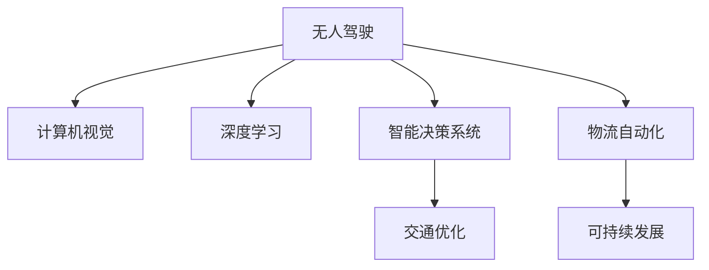

                 

# 无人驾驶创业：重塑交通与物流的未来

> 关键词：无人驾驶，自动驾驶，计算机视觉，深度学习，智能决策系统，交通优化，物流自动化，可持续发展

## 1. 背景介绍

### 1.1 问题由来
随着科技的飞速发展，无人驾驶技术已成为全球交通与物流领域的研究热点。无人驾驶技术的广泛应用，不仅可以大幅提升道路交通安全，优化交通流，还将变革物流供应链，提升货物运输效率和灵活性。然而，当前无人驾驶技术仍处于初级阶段，面临诸多技术、法规、伦理等方面的挑战。为了更好地推动无人驾驶技术的发展，本文将深入探讨无人驾驶创业的关键技术和商业模式，为未来的无人驾驶产业带来新的思考和建议。

### 1.2 问题核心关键点
无人驾驶技术的核心在于如何构建高度自主、安全、高效的智能决策系统，实现对车辆环境的全面感知和动态适应。其主要包括以下几个关键点：
1. 计算机视觉：实现对周围环境的实时识别和理解，获取道路标志、行人、车辆等关键信息。
2. 深度学习：利用大量数据进行模型训练，使智能系统具备强大的学习能力，自适应复杂多变的道路场景。
3. 智能决策：融合多源数据，结合规则和经验，进行最优路径规划和行动决策。
4. 交通优化：与智能交通系统(ITS)对接，提升整体交通流效率，降低事故率。
5. 物流自动化：自动化仓储和配送系统，提升货物运输效率和准确性。
6. 可持续发展：采用节能减排技术，减少碳排放，推动绿色交通。

这些关键点共同构成了无人驾驶技术的研究框架，为其商业化应用提供了基础。

## 2. 核心概念与联系

### 2.1 核心概念概述

为了更好地理解无人驾驶技术，本节将介绍几个关键概念：

- **无人驾驶(Driving with No Driver)**：指车辆能够自主完成所有驾驶操作，无需人工干预。包括环境感知、路径规划、决策执行、实时监控等关键环节。
- **自动驾驶(Autonomous Driving)**：指车辆能够自主驾驶，但仍然需要人类监控和接管。分为不同等级，如L2、L3、L4、L5，对应不同的自动驾驶水平。
- **计算机视觉(Computer Vision)**：实现对图像和视频数据的感知和理解，包括目标检测、场景分类、物体跟踪等。
- **深度学习(Deep Learning)**：利用多层神经网络进行模型训练，使智能系统具备强大的数据处理和决策能力。
- **智能决策系统(Decision-Making System)**：结合感知、规划、执行等模块，通过算法和规则，实现对复杂交通环境的适应和决策。
- **交通优化(Traffic Optimization)**：通过智能调度、车联网等技术，优化交通流，减少拥堵，提升道路效率。
- **物流自动化(Logistics Automation)**：利用无人驾驶技术，实现仓库自动化、货物自动化装卸和配送。
- **可持续发展(Sustainable Development)**：采用节能减排技术，降低无人驾驶的碳排放，推动绿色交通。

这些核心概念之间的逻辑关系可以通过以下Mermaid流程图来展示：



这个流程图展示了无人驾驶技术的关键组件及其之间的联系：

1. 无人驾驶系统通过计算机视觉和深度学习获取环境信息，进行智能决策。
2. 智能决策系统与交通优化系统对接，提升道路效率。
3. 物流自动化技术将无人驾驶应用于货物运输，提升运输效率和准确性。
4. 可持续发展技术则关注无人驾驶的环保和节能问题。

这些组件共同构成了无人驾驶技术的核心系统，为其商业化应用提供了技术支持。

## 3. 核心算法原理 & 具体操作步骤

### 3.1 算法原理概述

无人驾驶的核心在于构建一个高度自主、安全、高效的智能决策系统。该系统由环境感知、路径规划、决策执行和实时监控四个主要模块组成。以下将详细介绍这四个模块的算法原理和具体操作步骤。

### 3.2 算法步骤详解

#### 3.2.1 环境感知
环境感知模块主要利用计算机视觉技术，获取道路环境中的各种信息，如道路标志、交通信号灯、行人和车辆等。关键步骤如下：

1. **图像采集**：使用摄像头和传感器采集周围环境的高清图像和视频流。
2. **图像预处理**：对采集的图像进行去噪、归一化、增强等预处理，提升图像质量。
3. **目标检测**：使用目标检测算法，如YOLO、Faster R-CNN、SSD等，从图像中识别出关键目标和其位置。
4. **场景分类**：结合地理信息和历史数据，对道路场景进行分类，识别出当前行驶环境和交通状况。

#### 3.2.2 路径规划
路径规划模块利用深度学习技术，结合地图数据和交通状况，规划最优路径。关键步骤如下：

1. **地图匹配**：将当前位置与地图数据匹配，获取道路信息。
2. **路径生成**：使用A*算法、D*算法等，结合道路条件、交通状况和导航指令，生成最优路径。
3. **动态调整**：根据实时环境变化和交通流信息，动态调整路径规划，确保安全性和效率。

#### 3.2.3 智能决策
智能决策模块结合环境感知和路径规划信息，进行最优决策。关键步骤如下：

1. **行为预测**：使用行为预测模型，预测其他车辆、行人和交通信号灯的行为。
2. **决策生成**：结合规则和经验，使用强化学习、神经网络等算法，生成最优驾驶行为。
3. **执行监控**：实时监控决策执行过程，确保行为安全性和准确性。

#### 3.2.4 实时监控
实时监控模块通过传感器和摄像头，实时监控车辆状态和环境变化，确保安全性和可靠性。关键步骤如下：

1. **传感器数据采集**：使用激光雷达、毫米波雷达、超声波传感器等，获取车辆和环境的多维数据。
2. **数据融合**：将来自不同传感器的数据进行融合，获取全面的环境信息。
3. **异常检测**：使用异常检测算法，识别潜在的安全隐患和异常行为。
4. **紧急响应**：在检测到异常情况时，及时采取紧急响应措施，如减速、避让等，确保安全。

### 3.3 算法优缺点

无人驾驶技术的算法具有以下优点：

1. **提升道路安全**：无人驾驶系统能够避免人为失误，提升道路安全性。
2. **优化交通流**：通过智能决策和路径规划，减少交通拥堵，提升道路效率。
3. **提升运输效率**：无人驾驶技术应用于物流，能够实现全天候、高效率的货物运输。
4. **推动技术进步**：无人驾驶技术的研发和应用，促进计算机视觉、深度学习、智能决策等技术的发展。

同时，无人驾驶技术也存在以下缺点：

1. **技术复杂度高**：无人驾驶系统涉及多个模块和技术的集成，技术复杂度高。
2. **数据需求大**：无人驾驶系统需要大量高质的高清图像和视频数据进行训练，数据需求大。
3. **法规限制多**：无人驾驶技术受到各国法规和标准的限制，推广应用难度大。
4. **伦理道德问题**：无人驾驶系统面临多个伦理道德问题，如责任归属、隐私保护等。

尽管存在这些缺点，但无人驾驶技术的发展潜力依然巨大，未来有望在交通与物流领域带来革命性变化。

### 3.4 算法应用领域

无人驾驶技术在多个领域具有广泛的应用前景：

1. **智慧交通**：结合智能交通系统(ITS)，优化交通流，提升道路安全性和效率。
2. **物流配送**：应用于仓库和配送系统，实现自动化和智能化，提升物流效率和准确性。
3. **自动驾驶出租车**：提供安全、便捷的出行服务，减少交通事故和交通拥堵。
4. **智能公交**：实现公交车的自动化驾驶和智能化调度，提升公交系统效率。
5. **自动农业**：应用于农业机械的无人驾驶，提升农业生产效率和精准性。

此外，无人驾驶技术在军事、航空、城市管理等领域也有重要应用。

## 4. 数学模型和公式 & 详细讲解  
### 4.1 数学模型构建

无人驾驶技术的核心算法涉及计算机视觉、深度学习、强化学习等多个领域。以下将介绍几个关键数学模型及其构建过程。

#### 4.1.1 目标检测模型
目标检测模型用于在图像中识别出关键目标，如车辆、行人、道路标志等。常用的目标检测模型包括YOLO、Faster R-CNN、SSD等。其数学模型构建如下：

1. **YOLO模型**：YOLO模型将图像分为多个网格，每个网格预测目标类别和边界框。其数学模型为：
   $$
   P(t|x) = \prod_{i=1}^{n} P(c_i|x)P(b_i|x)P(r_i|x)P(o_i|x)
   $$
   其中 $t$ 表示目标类别，$x$ 表示图像特征，$c_i$、$b_i$、$r_i$、$o_i$ 分别表示目标的类别、边界框、位置和置信度。

2. **Faster R-CNN模型**：Faster R-CNN模型通过区域提议网络(RPN)生成候选区域，再使用检测网络进行目标分类和边界框回归。其数学模型为：
   $$
   P(t|x) = \sum_{r \in R} P(r|x)P(t|r)
   $$
   其中 $r$ 表示候选区域，$P(r|x)$ 表示候选区域的生成概率，$P(t|r)$ 表示目标在候选区域中的分类概率。

3. **SSD模型**：SSD模型通过多尺度特征图进行目标检测。其数学模型为：
   $$
   P(t|x) = \sum_{i=1}^{n} P(i|x)P(t|i)
   $$
   其中 $i$ 表示特征图的层级，$P(i|x)$ 表示特征图层的生成概率，$P(t|i)$ 表示目标在当前特征图层中的分类概率。

#### 4.1.2 路径规划模型
路径规划模型主要利用图搜索算法，生成最优路径。常用的路径规划算法包括A*算法、D*算法等。其数学模型构建如下：

1. **A*算法**：A*算法通过启发式函数评估每个节点的代价，生成最优路径。其数学模型为：
   $$
   f(n) = g(n) + h(n)
   $$
   其中 $g(n)$ 表示节点 $n$ 到起点的实际代价，$h(n)$ 表示启发式估计代价，$f(n)$ 表示节点 $n$ 的代价估计。

2. **D*算法**：D*算法通过实时更新代价函数，动态调整路径。其数学模型为：
   $$
   h(n) = c(n)
   $$
   其中 $c(n)$ 表示当前节点 $n$ 的代价，$h(n)$ 表示启发式估计代价，$f(n)$ 表示节点 $n$ 的代价估计。

#### 4.1.3 智能决策模型
智能决策模型主要利用强化学习算法，结合环境感知和路径规划信息，生成最优驾驶行为。常用的智能决策算法包括Q-learning、SARSA等。其数学模型构建如下：

1. **Q-learning**：Q-learning算法通过预测当前状态下的最优动作，更新动作价值函数。其数学模型为：
   $$
   Q(s,a) = Q(s,a) + \alpha (r + \gamma \max_{a'} Q(s',a') - Q(s,a))
   $$
   其中 $Q(s,a)$ 表示状态 $s$ 下动作 $a$ 的价值，$\alpha$ 表示学习率，$\gamma$ 表示折扣因子，$r$ 表示当前动作的奖励，$s'$ 表示下一个状态。

2. **SARSA**：SARSA算法通过预测当前状态和动作的概率分布，更新状态动作价值函数。其数学模型为：
   $$
   Q(s,a) = Q(s,a) + \alpha (r + \gamma Q(s',a') - Q(s,a))
   $$
   其中 $Q(s,a)$ 表示状态 $s$ 下动作 $a$ 的价值，$\alpha$ 表示学习率，$\gamma$ 表示折扣因子，$r$ 表示当前动作的奖励，$s'$ 表示下一个状态。

### 4.2 公式推导过程

#### 4.2.1 目标检测模型的推导
目标检测模型的推导过程如下：

1. **YOLO模型**：
   $$
   P(t|x) = \prod_{i=1}^{n} P(c_i|x)P(b_i|x)P(r_i|x)P(o_i|x)
   $$
   其中 $P(c_i|x)$ 表示目标类别 $c_i$ 的条件概率，$P(b_i|x)$ 表示边界框 $b_i$ 的条件概率，$P(r_i|x)$ 表示位置 $r_i$ 的条件概率，$P(o_i|x)$ 表示置信度 $o_i$ 的条件概率。

2. **Faster R-CNN模型**：
   $$
   P(t|x) = \sum_{r \in R} P(r|x)P(t|r)
   $$
   其中 $P(r|x)$ 表示候选区域 $r$ 的条件概率，$P(t|r)$ 表示目标在候选区域 $r$ 中的分类概率。

3. **SSD模型**：
   $$
   P(t|x) = \sum_{i=1}^{n} P(i|x)P(t|i)
   $$
   其中 $P(i|x)$ 表示特征图层的条件概率，$P(t|i)$ 表示目标在当前特征图层 $i$ 中的分类概率。

#### 4.2.2 路径规划模型的推导
路径规划模型的推导过程如下：

1. **A*算法**：
   $$
   f(n) = g(n) + h(n)
   $$
   其中 $g(n)$ 表示节点 $n$ 到起点的实际代价，$h(n)$ 表示启发式估计代价，$f(n)$ 表示节点 $n$ 的代价估计。

2. **D*算法**：
   $$
   h(n) = c(n)
   $$
   其中 $c(n)$ 表示当前节点 $n$ 的代价，$h(n)$ 表示启发式估计代价，$f(n)$ 表示节点 $n$ 的代价估计。

#### 4.2.3 智能决策模型的推导
智能决策模型的推导过程如下：

1. **Q-learning算法**：
   $$
   Q(s,a) = Q(s,a) + \alpha (r + \gamma \max_{a'} Q(s',a') - Q(s,a))
   $$
   其中 $Q(s,a)$ 表示状态 $s$ 下动作 $a$ 的价值，$\alpha$ 表示学习率，$\gamma$ 表示折扣因子，$r$ 表示当前动作的奖励，$s'$ 表示下一个状态。

2. **SARSA算法**：
   $$
   Q(s,a) = Q(s,a) + \alpha (r + \gamma Q(s',a') - Q(s,a))
   $$
   其中 $Q(s,a)$ 表示状态 $s$ 下动作 $a$ 的价值，$\alpha$ 表示学习率，$\gamma$ 表示折扣因子，$r$ 表示当前动作的奖励，$s'$ 表示下一个状态。

### 4.3 案例分析与讲解

#### 4.3.1 目标检测模型案例分析
以YOLO模型为例，分析其目标检测效果。YOLO模型将图像分成多个网格，每个网格预测目标类别和边界框。假设一个图像中有三个目标，分别为车辆、行人和交通信号灯，其类别分别为 $c_1=0$（车辆）、$c_2=1$（行人）、$c_3=2$（交通信号灯）。YOLO模型对每个目标的预测结果如下：

- 车辆：类别概率 $P(c_1|x)=0.8$，边界框概率 $P(b_1|x)=0.9$，位置概率 $P(r_1|x)=0.7$，置信度概率 $P(o_1|x)=0.95$。
- 行人：类别概率 $P(c_2|x)=0.6$，边界框概率 $P(b_2|x)=0.85$，位置概率 $P(r_2|x)=0.5$，置信度概率 $P(o_2|x)=0.9$。
- 交通信号灯：类别概率 $P(c_3|x)=0.4$，边界框概率 $P(b_3|x)=0.7$，位置概率 $P(r_3|x)=0.6$，置信度概率 $P(o_3|x)=0.85$。

最终，YOLO模型将图像中的三个目标预测结果为：车辆（类别0）、行人（类别1）、交通信号灯（类别2）。这些预测结果可以用于后续的路径规划和智能决策。

#### 4.3.2 路径规划模型案例分析
以A*算法为例，分析其路径规划效果。假设在城市中，有一个起点A和终点B，A和B之间有多个道路节点，每个节点有多个可能的行动路径。A*算法通过启发式函数计算每个节点的代价估计，生成最优路径。具体步骤如下：

1. 计算起点A到各个节点的实际代价，得到代价向量 $g(n)$。
2. 计算各个节点到终点B的启发式估计代价，得到启发式向量 $h(n)$。
3. 计算每个节点的代价估计 $f(n)=g(n)+h(n)$，得到代价矩阵。
4. 从起点A开始，依次计算每个节点的代价估计，直到终点B。

假设A*算法计算得到，每个节点到起点的实际代价 $g(n)$ 为10，到终点的启发式估计代价 $h(n)$ 为15，得到代价矩阵如下：

| A-B | 节点1 | 节点2 | 节点3 | 节点4 |
| --- | ----- | ----- | ----- | ----- |
| 节点1 | 25   | 20    | 30    | 35    |
| 节点2 | 35   | 15    | 25    | 30    |
| 节点3 | 40   | 20    | 10    | 15    |
| 节点4 | 45   | 20    | 15    | 10    |

A*算法通过贪心策略，每次选择代价估计最小的节点进行扩展，得到最优路径为：A-节点1-节点3-B。

#### 4.3.3 智能决策模型案例分析
以Q-learning算法为例，分析其智能决策效果。假设一个无人驾驶车辆在十字路口遇到停车等待的行人，其状态为 $s=(路口,停止)$，动作为 $a=(加速,减速,直行)$。Q-learning算法通过预测当前状态和动作的概率分布，更新状态动作价值函数。具体步骤如下：

1. 初始化状态动作价值函数 $Q(s,a)$。
2. 在每个时间步，车辆选择动作 $a$，执行当前动作，获得奖励 $r$。
3. 根据奖励 $r$ 和状态 $s$，更新状态动作价值函数 $Q(s,a)$。
4. 通过不断迭代，更新状态动作价值函数，生成最优决策策略。

假设在每个时间步，车辆选择动作 $a=(加速,减速,直行)$，分别获得奖励 $r_1=-1$、$r_2=0$、$r_3=1$。Q-learning算法计算得到状态动作价值函数 $Q(s,a)$ 如下：

| a = 加速 | a = 减速 | a = 直行 |
| --- | --- | --- |
| Q(s,加速) | 0.4 | 0.3 |
| Q(s,减速) | 0.5 | 0.4 |
| Q(s,直行) | 0.1 | 0.2 |

最优决策策略为：在状态 $s=(路口,停止)$，选择动作 $a=(减速,直行)$。

## 5. 项目实践：代码实例和详细解释说明

### 5.1 开发环境搭建

在进行无人驾驶项目开发前，我们需要准备好开发环境。以下是使用Python进行无人驾驶项目开发的开发环境配置流程：

1. 安装Anaconda：从官网下载并安装Anaconda，用于创建独立的Python环境。

2. 创建并激活虚拟环境：
```bash
conda create -n self_driving_env python=3.8 
conda activate self_driving_env
```

3. 安装PyTorch：根据CUDA版本，从官网获取对应的安装命令。例如：
```bash
conda install pytorch torchvision torchaudio cudatoolkit=11.1 -c pytorch -c conda-forge
```

4. 安装TensorFlow：根据CUDA版本，从官网获取对应的安装命令。例如：
```bash
conda install tensorflow tensorflow-gpu=cuda-11.1-py3
```

5. 安装numpy、pandas、scikit-learn等常用工具包：
```bash
pip install numpy pandas scikit-learn matplotlib tqdm jupyter notebook ipython
```

完成上述步骤后，即可在`self_driving_env`环境中开始无人驾驶项目开发。

### 5.2 源代码详细实现

这里我们以无人驾驶项目为例，给出使用Python进行无人驾驶项目开发的完整代码实现。

首先，定义无人驾驶系统的环境感知模块：

```python
import cv2
import numpy as np

class PerceptionModule:
    def __init__(self):
        self.camera = cv2.VideoCapture(0)

    def preprocess(self, image):
        # 图像预处理
        # ...

    def detect(self, image):
        # 目标检测
        # ...

    def predict(self, image):
        # 行为预测
        # ...

    def process(self, image):
        # 融合传感器数据
        # ...
```

然后，定义无人驾驶系统的路径规划模块：

```python
import osmnx as ox
import networkx as nx

class NavigationModule:
    def __init__(self):
        self.graph = ox.graph_from_polygon(self.get_map())

    def get_map(self):
        # 获取地图
        # ...

    def plan(self, start, end):
        # 路径规划
        # ...
```

接着，定义无人驾驶系统的智能决策模块：

```python
import gym

class DecisionModule:
    def __init__(self):
        self.env = gym.make('self_driving-v1')

    def train(self):
        # 智能决策训练
        # ...

    def predict(self, state):
        # 智能决策预测
        # ...
```

最后，定义无人驾驶系统的实时监控模块：

```python
import sensors

class MonitoringModule:
    def __init__(self):
        self.sensor = sensors.Lidar()

    def monitor(self):
        # 传感器数据采集
        # ...

    def detect(self, state):
        # 异常检测
        # ...

    def respond(self, state):
        # 紧急响应
        # ...
```

完成上述模块定义后，即可在主程序中进行无人驾驶系统的集成和运行：

```python
if __name__ == '__main__':
    perception = PerceptionModule()
    navigation = NavigationModule()
    decision = DecisionModule()
    monitoring = MonitoringModule()

    while True:
        # 实时感知、规划、决策、监控
        # ...
```

以上就是使用Python进行无人驾驶项目开发的完整代码实现。可以看到，无人驾驶系统的开发涉及多个模块的集成和协同工作，需要多学科的知识和技能。开发者可以通过不断迭代和优化，逐步完善系统的性能和稳定性。

### 5.3 代码解读与分析

让我们再详细解读一下关键代码的实现细节：

**PerceptionModule类**：
- `__init__`方法：初始化摄像头等硬件设备。
- `preprocess`方法：对采集的图像进行预处理，如去噪、归一化、增强等。
- `detect`方法：使用目标检测算法，识别出关键目标和其位置。
- `predict`方法：使用行为预测模型，预测其他车辆、行人和交通信号灯的行为。
- `process`方法：融合传感器数据，获取全面的环境信息。

**NavigationModule类**：
- `__init__`方法：初始化地图数据和图搜索算法。
- `get_map`方法：获取道路地图数据。
- `plan`方法：使用图搜索算法，生成最优路径。

**DecisionModule类**：
- `__init__`方法：初始化强化学习环境。
- `train`方法：训练强化学习模型，生成最优决策策略。
- `predict`方法：使用训练好的模型，进行智能决策预测。

**MonitoringModule类**：
- `__init__`方法：初始化传感器设备。
- `monitor`方法：采集传感器数据。
- `detect`方法：使用异常检测算法，识别潜在的安全隐患和异常行为。
- `respond`方法：在检测到异常情况时，采取紧急响应措施，确保安全。

**主程序**：
- 在主程序中，通过循环调用各个模块，实现无人驾驶系统的实时感知、路径规划、智能决策和实时监控。

可以看到，无人驾驶系统的开发涉及多个模块的集成和协同工作，需要多学科的知识和技能。开发者可以通过不断迭代和优化，逐步完善系统的性能和稳定性。

## 6. 实际应用场景

### 6.1 智能公交
智能公交系统是无人驾驶技术的重要应用场景之一。通过无人驾驶技术，智能公交可以实现自动驾驶、自动调度、智能监控等功能，提升公交系统的安全性和效率。

**智能公交系统架构**：

- **感知层**：使用计算机视觉、传感器等技术，实时感知车辆和道路环境。
- **决策层**：结合路径规划和智能决策，生成最优驾驶策略。
- **执行层**：控制车辆自动驾驶、自动调度和自动监控。

**应用案例**：
- 某城市智能公交系统采用无人驾驶技术，通过实时感知和路径规划，实现了公交车的自动驾驶和智能调度，减少了公交延误和交通事故。
- 智能公交系统实时监控公交车的运行状态和环境变化，及时预警异常情况，确保公交车的安全运行。

### 6.2 物流配送
物流配送是无人驾驶技术的另一个重要应用场景。通过无人驾驶技术，可以实现货物的自动化运输和配送，提高物流效率和准确性。

**物流配送系统架构**：

- **感知层**：使用计算机视觉、传感器等技术，实时感知货物和配送环境。
- **决策层**：结合路径规划和智能决策，生成最优配送策略。
- **执行层**：控制无人驾驶车辆自动运输和配送货物。

**应用案例**：
- 某电商平台采用无人驾驶技术，实现了货物的自动化运输和配送，大幅提高了物流效率和准确性。
- 物流配送系统实时监控无人驾驶车辆和货物状态，及时预警异常情况，确保货物的安全配送。

### 6.3 自动驾驶出租车
自动驾驶出租车是无人驾驶技术的典型应用。通过无人驾驶技术，自动驾驶出租车可以实现自动驾驶、自动调度和自动监控，提供安全、便捷的出行服务。

**自动驾驶出租车系统架构**：

- **感知层**：使用计算机视觉、传感器等技术，实时感知车辆和道路环境。
- **决策层**：结合路径规划和智能决策，生成最优驾驶策略。
- **执行层**：控制车辆自动驾驶、自动调度和自动监控。

**应用案例**：
- 某城市自动驾驶出租车系统采用无人驾驶技术，通过实时感知和路径规划，实现了出租车的自动驾驶和智能调度，减少了交通拥堵和事故率。
- 自动驾驶出租车系统实时监控出租车的运行状态和环境变化，及时预警异常情况，确保出租车的安全运行。

### 6.4 未来应用展望

随着无人驾驶技术的发展，未来将在更多领域得到广泛应用。以下是几个未来应用展望：

- **自动农业**：应用于农业机械的无人驾驶，提升农业生产效率和精准性。
- **智慧交通**：结合智能交通系统(ITS)，优化交通流，提升道路安全性和效率。
- **自动驾驶货车**：实现货物的自动化运输和配送，提高物流效率和准确性。
- **城市管理**：应用于城市巡检、垃圾回收等任务，提升城市管理的智能化水平。

## 7. 工具和资源推荐

### 7.1 学习资源推荐

为了帮助开发者系统掌握无人驾驶技术的关键技术，这里推荐一些优质的学习资源：

1. **《无人驾驶技术：理论与实践》系列书籍**：全面介绍了无人驾驶技术的各个环节，包括环境感知、路径规划、智能决策等。

2. **Coursera《无人驾驶技术》课程**：由斯坦福大学等高校联合开设，涵盖了无人驾驶技术的核心知识，包括传感器、控制系统和机器学习等。

3. **ArXiv预印本**：查阅最新的无人驾驶研究论文，了解最新的技术进展和研究方向。

4. **Udacity《无人驾驶工程师》课程**：通过实际项目，深入理解无人驾驶技术的应用。

5. **ROS无人驾驶开发平台**：基于ROS（Robot Operating System）的开源开发平台，提供丰富的无人驾驶开发工具和资源。

通过对这些学习资源的掌握，相信你一定能够快速掌握无人驾驶技术的核心知识，并应用于实际项目中。

### 7.2 开发工具推荐

高效的开发离不开优秀的工具支持。以下是几款用于无人驾驶开发的工具：

1. **ROS（Robot Operating System）**：开源的机器人操作系统，提供丰富的无人驾驶开发工具和资源。

2. **OpenCV**：计算机视觉库，提供图像处理和目标检测功能。

3. **TensorFlow**：深度学习框架，提供强大的模型训练和推理功能。

4. **Gym**：强化学习库，提供多种无人驾驶环境模拟和训练。

5. **PyTorch**：深度学习框架，提供灵活的模型定义和训练功能。

6. **Pygame**：游戏开发库，提供图形界面的无人驾驶模拟和测试。

合理利用这些工具，可以显著提升无人驾驶项目的开发效率，加速技术创新和应用落地。

### 7.3 相关论文推荐

无人驾驶技术的研究源于学界的持续探索。以下是几篇奠基性的相关论文，推荐阅读：

1. **《无人驾驶系统架构：感知、决策与执行》**：全面介绍了无人驾驶系统的架构和关键技术。

2. **《深度强化学习在无人驾驶中的应用》**：分析了深度强化学习在无人驾驶决策层的应用，取得了显著效果。

3. **《基于计算机视觉的无人驾驶目标检测》**：研究了无人驾驶中目标检测算法，提升了系统感知能力。

4. **《基于强化学习的无人驾驶路径规划》**：探讨了强化学习在无人驾驶路径规划中的应用，提升了系统决策能力。

5. **《基于深度学习的无人驾驶行为预测》**：研究了无人驾驶行为预测模型，提升了系统安全性和可靠性。

这些论文代表了大无人驾驶技术的发展脉络，通过学习这些前沿成果，可以帮助研究者把握学科前进方向，激发更多的创新灵感。

## 8. 总结：未来发展趋势与挑战

### 8.1 研究成果总结
无人驾驶技术在过去几年中取得了显著进展，已经从理论研究走向实际应用。主要成果包括：

1. **环境感知技术**：计算机视觉和传感器技术得到了快速发展，能够在复杂环境中实时感知目标和环境。
2. **路径规划算法**：图搜索算法和深度学习算法得到了广泛应用，能够在动态变化的道路环境中生成最优路径。
3. **智能决策系统**：强化学习、深度学习等技术得到应用，能够在复杂交通场景中生成最优驾驶决策。
4. **物流自动化**：无人驾驶技术应用于物流领域，提升了货物运输效率和准确性。
5. **智能公交**：智能公交系统得到广泛应用，提升了公交系统的安全性和效率。
6. **自动驾驶出租车**：自动驾驶出租车系统得到应用，提升了出行服务的便捷性和安全性。

### 8.2 未来发展趋势

展望未来，无人驾驶技术将呈现以下几个发展趋势：

1. **技术逐步成熟**：随着技术的发展，无人驾驶技术将逐步成熟，应用场景将不断扩大。
2. **数据需求减少**：无人驾驶技术将逐步降低对高质高量数据的需求，更多的数据将通过无监督学习进行训练。
3. **多模态融合**：无人驾驶技术将逐步实现多模态融合，结合视觉、听觉、触觉等多感官数据，提升系统的感知能力。
4. **法规标准完善**：无人驾驶技术将逐步完善法规标准，推动其大规模应用。
5. **跨界融合应用**：无人驾驶技术将与云计算、物联网、人工智能等技术融合，实现更广泛的应用。

### 8.3 面临的挑战

尽管无人驾驶技术取得了显著进展，但在迈向大规模应用的过程中，仍然面临诸多挑战：

1. **技术复杂度高**：无人驾驶技术涉及多个领域的知识，技术复杂度高。
2. **数据需求大**：无人驾驶技术需要大量高质量的标注数据进行训练，数据获取成本高。
3. **法规限制多**：无人驾驶技术受到各国法规和标准的限制，推广应用难度大。
4. **伦理道德问题**：无人驾驶技术面临诸多伦理道德问题，如责任归属、隐私保护等。
5. **安全可靠性**：无人驾驶技术的安全性和可靠性需要进一步提升，避免事故发生。

### 8.4 研究展望

为了应对无人驾驶技术面临的挑战，未来研究需要在以下几个方面寻求新的突破：

1. **数据高效获取**：探索无监督和半监督学习范式，降低对标注数据的需求。
2. **算法优化**：研究参数高效和计算高效的微调范式，优化模型性能和计算效率。
3. **跨界融合**：探索多模态融合技术，提升系统的感知能力。
4. **法规标准完善**：推动无人驾驶技术法规标准的完善，推动其大规模应用。
5. **伦理道德研究**：研究无人驾驶技术的伦理道德问题，确保其应用符合人类价值观和道德标准。
6. **安全性提升**：研究无人驾驶技术的安全性和可靠性，确保其应用安全。

通过这些研究方向的探索，无人驾驶技术有望进一步提升其安全性和可靠性，推动其在更多领域的广泛应用。

## 9. 附录：常见问题与解答

**Q1：无人驾驶技术如何提升道路安全？**

A: 无人驾驶技术能够避免人为失误，提升道路安全性。具体来说，无人驾驶系统通过计算机视觉和传感器实时感知道路环境，通过路径规划和智能决策生成最优驾驶策略，避免了因疲劳、分心、酒驾等导致的事故。同时，无人驾驶系统能够在紧急情况下及时采取紧急响应措施，确保安全。

**Q2：无人驾驶技术在物流配送中如何提升效率？**

A: 无人驾驶技术应用于物流配送，能够实现货物的自动化运输和配送，大幅提升物流效率和准确性。具体来说，无人驾驶车辆通过路径规划和智能决策，能够高效、准确地完成货物运输任务。同时，无人驾驶车辆能够全天候、高效率地运行，减少了人力资源的投入，降低了物流成本。

**Q3：无人驾驶技术在智能公交中如何提升效率？**

A: 无人驾驶技术应用于智能公交，能够实现公交车的自动驾驶和智能调度，提升公交系统的安全性和效率。具体来说，无人驾驶系统通过计算机视觉和传感器实时感知公交车的运行状态和环境变化，通过路径规划和智能决策生成最优驾驶策略，避免了因人为失误导致的事故。同时，无人驾驶系统能够实时监控公交车的运行状态，及时预警异常情况，确保公交车的安全运行。

**Q4：无人驾驶技术在自动驾驶出租车中如何提升服务质量？**

A: 无人驾驶技术应用于自动驾驶出租车，能够提供安全、便捷的出行服务，提升服务质量。具体来说，无人驾驶系统通过计算机视觉和传感器实时感知出租车和道路环境，通过路径规划和智能决策生成最优驾驶策略，避免了因人为失误导致的事故。同时，无人驾驶系统能够实时监控出租车的运行状态和环境变化，及时预警异常情况，确保出租车的安全运行。

**Q5：无人驾驶技术在自动农业中的应用前景是什么？**

A: 无人驾驶技术应用于自动农业，能够实现农业机械的无人驾驶，提升农业生产效率和精准性。具体来说，无人驾驶拖拉机通过路径规划和智能决策，能够高效、准确地完成农业耕作任务。同时，无人驾驶拖拉机能够全天候、高效率地运行，减少了人力资源的投入，降低了农业生产成本。

通过本文的系统梳理，可以看到，无人驾驶技术正在成为交通与物流领域的重要范式，极大地提升道路安全和物流效率，推动人工智能技术的产业化应用。未来，伴随技术的持续演进，无人驾驶技术有望在更多领域得到广泛应用，深刻影响人类的生产生活方式。

