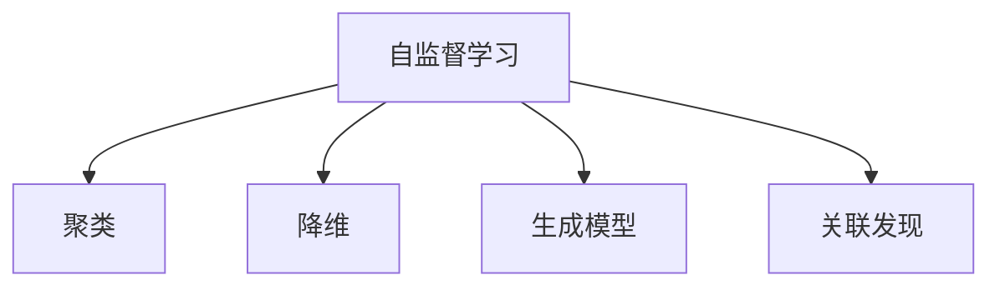

                 

# 无监督学习 (Unsupervised Learning) 原理与代码实例讲解

## 1. 背景介绍

无监督学习（Unsupervised Learning）是机器学习领域的一种重要学习范式，与监督学习（Supervised Learning）、强化学习（Reinforcement Learning）并列。它的核心思想是：在没有标签数据的情况下，模型能够从原始数据中自动发现数据的规律和结构，进行特征提取、聚类、降维等任务，甚至发现数据中的隐藏模式和关联性。

### 1.1 问题由来

无监督学习在很多领域都有重要的应用，例如自然语言处理、计算机视觉、金融数据分析、社交网络分析等。在自然语言处理中，无监督学习方法常用于文本聚类、情感分析、主题模型、语义表示等任务。在计算机视觉中，无监督学习方法常用于图像聚类、图像生成、异常检测等任务。

然而，无监督学习也面临一些挑战，例如：

1. **问题定义困难**：无法从数据中直接得出目标变量，需要手动定义问题和特征。
2. **性能评估困难**：缺乏标准的评估指标，难以对模型效果进行量化。
3. **模型解释性差**：无监督模型常常被认为是"黑箱"，难以解释其内部决策过程。
4. **对数据质量要求高**：无监督模型对数据的质量和多样性要求较高，否则容易出现过拟合或欠拟合。

## 2. 核心概念与联系

### 2.1 核心概念概述

无监督学习的核心概念包括：

- **自监督学习（Self-supervised Learning）**：通过利用数据本身的特点，设计出一些任务（如掩码语言模型、自编码器等），让模型从这些任务中学习到数据的内在规律。
- **聚类（Clustering）**：将数据按照某种相似性度量分为若干组，使得同一组内的数据相似度高，不同组间的数据相似度低。
- **降维（Dimensionality Reduction）**：将高维数据转换为低维表示，保留数据的主要特征，去除噪声和冗余。
- **生成模型（Generative Models）**：通过学习数据的分布，生成新的样本，例如生成对抗网络（GAN）、变分自编码器（VAE）等。
- **关联发现（Association Discovery）**：通过频繁模式挖掘（FPG）、关联规则挖掘（APR）等方法，发现数据中的关联性。

这些概念之间的逻辑关系可以通过以下Mermaid流程图来展示：



### 2.2 核心概念原理和架构

#### 2.2.1 自监督学习

自监督学习的目标是利用数据自身的特性，设计一些自监督任务（如掩码语言模型、自编码器等），让模型在未标注的数据上进行训练，以学习数据的结构和内在规律。

**掩码语言模型**是一种常用的自监督学习方法，它通过在输入序列中随机掩码一些单词，让模型预测被掩码的单词，从而学习到语言的结构和规律。具体步骤如下：

1. **输入预处理**：将输入文本分词，转换为模型可以接受的格式。
2. **掩码处理**：在输入序列中随机掩码一些单词，保留一些单词，用于后续预测。
3. **模型前向传播**：将掩码后的文本输入模型，得到模型对未掩码单词的预测概率。
4. **损失函数计算**：计算模型预测概率与真实概率之间的差异，构建损失函数。
5. **反向传播更新模型参数**：通过反向传播算法更新模型参数，使得预测概率与真实概率尽可能接近。

#### 2.2.2 聚类

聚类的目标是将数据点划分为若干个簇，使得同一簇内的数据点相似度高，不同簇间的数据点相似度低。常用的聚类算法包括K-Means、层次聚类、DBSCAN等。

K-Means算法的主要步骤如下：

1. **随机初始化簇中心**：随机选择K个数据点作为初始簇中心。
2. **分配数据点**：将每个数据点分配到距离最近的簇中心。
3. **更新簇中心**：计算每个簇内所有数据点的平均值，更新簇中心。
4. **迭代更新**：重复步骤2和步骤3，直到簇中心不再变化或达到预设的迭代次数。

#### 2.2.3 降维

降维的目标是将高维数据转换为低维表示，保留数据的主要特征，去除噪声和冗余。常用的降维方法包括主成分分析（PCA）、线性判别分析（LDA）、t-SNE等。

主成分分析（PCA）的主要步骤如下：

1. **标准化数据**：对数据进行标准化处理，使得各特征的均值为0，方差为1。
2. **计算协方差矩阵**：计算数据的协方差矩阵。
3. **计算特征值和特征向量**：计算协方差矩阵的特征值和特征向量。
4. **选择主成分**：根据特征值的大小选择K个主成分，构成新的低维表示。

#### 2.2.4 生成模型

生成模型的目标是通过学习数据的分布，生成新的样本。常用的生成模型包括生成对抗网络（GAN）、变分自编码器（VAE）、高斯混合模型（GMM）等。

生成对抗网络（GAN）的主要步骤如下：

1. **定义生成器和判别器**：生成器将随机噪声映射为假样本，判别器将输入样本判定为真实样本或假样本。
2. **训练生成器和判别器**：通过生成器和判别器的对抗过程，使得生成器能够生成逼真的假样本，判别器能够准确地判定样本的真实性。
3. **生成新样本**：使用训练好的生成器，生成新的样本。

#### 2.2.5 关联发现

关联发现的目的是发现数据中的关联性，常用的方法包括频繁模式挖掘（FPG）、关联规则挖掘（APR）等。

频繁模式挖掘（FPG）的主要步骤如下：

1. **扫描数据集**：扫描数据集，统计每个项的出现次数。
2. **构建频繁项集**：构建所有频繁项集，即出现次数大于等于预设阈值的项集。
3. **构建关联规则**：从频繁项集中构建关联规则，发现项之间的关联性。

## 3. 核心算法原理 & 具体操作步骤

### 3.1 算法原理概述

无监督学习通常包含以下几个步骤：

1. **数据预处理**：清洗、归一化、标准化等数据预处理步骤。
2. **特征提取**：使用自监督学习、聚类、降维等方法，提取数据特征。
3. **模型训练**：使用训练数据，训练模型，学习数据的内在规律。
4. **模型评估**：使用测试数据，评估模型的效果，调整模型参数。
5. **模型应用**：将训练好的模型应用于实际问题中，进行数据处理、聚类、生成新数据等。

### 3.2 算法步骤详解

以生成对抗网络（GAN）为例，详细讲解无监督学习的具体操作步骤：

**Step 1: 准备数据集**
- 收集数据集，并进行预处理，如去除噪声、归一化等。

**Step 2: 定义模型架构**
- 定义生成器和判别器，选择合适的激活函数、损失函数、优化器等。

**Step 3: 模型初始化**
- 初始化生成器和判别器的参数，设定训练轮数、学习率等超参数。

**Step 4: 迭代训练**
- 交替训练生成器和判别器。生成器生成假样本，判别器判断样本的真实性。根据损失函数计算梯度，更新模型参数。
- 重复上述步骤，直到满足预设的停止条件。

**Step 5: 模型评估**
- 使用测试数据集，评估模型的生成效果，如生成样本与真实样本的差异。
- 根据评估结果，调整模型参数，继续迭代训练。

**Step 6: 模型应用**
- 使用训练好的生成器，生成新的样本。
- 对生成的样本进行后处理，如去噪、去重等。

### 3.3 算法优缺点

无监督学习的优点包括：

1. **无需标注数据**：无监督学习不需要标注数据，适用于数据标注困难或成本高昂的场景。
2. **发现隐含规律**：通过自动发现数据的内在规律，能够发现数据中的隐藏模式和关联性。
3. **可解释性强**：无监督学习的结果可以直接从数据中推导，具有较好的可解释性。

无监督学习的缺点包括：

1. **问题定义困难**：无法从数据中直接得出目标变量，需要手动定义问题和特征。
2. **性能评估困难**：缺乏标准的评估指标，难以对模型效果进行量化。
3. **对数据质量要求高**：无监督模型对数据的质量和多样性要求较高，否则容易出现过拟合或欠拟合。

### 3.4 算法应用领域

无监督学习在多个领域都有广泛的应用，例如：

- **自然语言处理**：文本聚类、情感分析、主题模型、语义表示等。
- **计算机视觉**：图像聚类、图像生成、异常检测等。
- **金融数据分析**：风险管理、信用评估、市场预测等。
- **社交网络分析**：社区发现、用户画像、内容推荐等。
- **生物信息学**：基因表达分析、蛋白质结构预测等。

## 4. 数学模型和公式 & 详细讲解

### 4.1 数学模型构建

以生成对抗网络（GAN）为例，详细讲解生成对抗网络的数学模型。

设输入数据集为 $X=\{(x_1,y_1),(x_2,y_2),...(x_N,y_N)\}$，其中 $x_i \in \mathbb{R}^m$，$y_i \in \{0,1\}$。

生成对抗网络由生成器 $G$ 和判别器 $D$ 两部分组成：

- 生成器 $G$：将随机噪声 $z$ 映射为假样本 $G(z)$，其中 $z \in \mathbb{R}^k$。
- 判别器 $D$：将输入样本 $x$ 判定为真实样本或假样本，输出 $D(x)$，其中 $x \in \mathbb{R}^m$。

生成对抗网络的目标是最大化生成器的生成能力，同时最大化判别器的判别能力。因此，训练过程可以定义为最大化以下两个目标函数的乘积：

$$
\max_G \min_D V(G,D) = \min_D \max_G V(G,D) = \min_D \frac{1}{N} \sum_{i=1}^N \log D(x_i) + \log(1-D(G(z_i)))
$$

其中 $V(G,D)$ 表示生成器和判别器的目标函数，$\log$ 表示交叉熵损失函数。

### 4.2 公式推导过程

**生成器损失函数**：

生成器的目标是最小化判别器对假样本的判断误差。因此，生成器的损失函数可以定义为：

$$
L_G = -\frac{1}{N} \sum_{i=1}^N \log D(G(z_i))
$$

**判别器损失函数**：

判别器的目标是最小化生成器对假样本的生成能力，同时最大化对真实样本的判断能力。因此，判别器的损失函数可以定义为：

$$
L_D = -\frac{1}{N} \sum_{i=1}^N \log D(x_i) + \frac{1}{N} \sum_{i=1}^N \log(1-D(G(z_i)))
$$

### 4.3 案例分析与讲解

以MNIST手写数字数据集为例，解释生成对抗网络的生成过程。

1. **数据预处理**：将MNIST手写数字数据集进行归一化处理，得到数据集 $X$。
2. **定义模型架构**：定义生成器和判别器的神经网络结构，如使用全连接层、卷积层等。
3. **模型初始化**：随机初始化生成器和判别器的参数，设定训练轮数、学习率等超参数。
4. **迭代训练**：交替训练生成器和判别器。生成器生成假样本，判别器判断样本的真实性。根据损失函数计算梯度，更新模型参数。
5. **模型评估**：使用测试数据集，评估生成器的生成效果，如生成样本与真实样本的差异。
6. **模型应用**：使用训练好的生成器，生成新的手写数字样本。

## 5. 项目实践：代码实例和详细解释说明

### 5.1 开发环境搭建

在进行无监督学习实践前，我们需要准备好开发环境。以下是使用Python进行TensorFlow开发的环境配置流程：

1. 安装Anaconda：从官网下载并安装Anaconda，用于创建独立的Python环境。

2. 创建并激活虚拟环境：
```bash
conda create -n tf-env python=3.8 
conda activate tf-env
```

3. 安装TensorFlow：根据CUDA版本，从官网获取对应的安装命令。例如：
```bash
conda install tensorflow -c conda-forge -c pytorch -c anaconda
```

4. 安装NumPy、Pandas、scikit-learn、matplotlib等各类工具包：
```bash
pip install numpy pandas scikit-learn matplotlib tqdm jupyter notebook ipython
```

完成上述步骤后，即可在`tf-env`环境中开始无监督学习实践。

### 5.2 源代码详细实现

下面我们以生成对抗网络（GAN）为例，给出使用TensorFlow实现无监督学习的PyTorch代码实现。

首先，定义GAN模型：

```python
import tensorflow as tf
from tensorflow.keras.layers import Input, Dense, Flatten, Reshape, Conv2D, BatchNormalization, LeakyReLU, Conv2DTranspose
from tensorflow.keras import Model

# 定义生成器
def make_generator_model():
    model = tf.keras.Sequential()
    model.add(Dense(256, input_dim=100))
    model.add(LeakyReLU(alpha=0.2))
    model.add(BatchNormalization(momentum=0.8))
    model.add(Dense(512))
    model.add(LeakyReLU(alpha=0.2))
    model.add(BatchNormalization(momentum=0.8))
    model.add(Dense(1024))
    model.add(LeakyReLU(alpha=0.2))
    model.add(BatchNormalization(momentum=0.8))
    model.add(Dense(784, activation='tanh'))
    model.add(Reshape((28, 28, 1)))
    return model

# 定义判别器
def make_discriminator_model():
    model = tf.keras.Sequential()
    model.add(Flatten(input_shape=(28, 28, 1)))
    model.add(Dense(1024))
    model.add(LeakyReLU(alpha=0.2))
    model.add(Dense(512))
    model.add(LeakyReLU(alpha=0.2))
    model.add(Dense(256))
    model.add(LeakyReLU(alpha=0.2))
    model.add(Dense(1, activation='sigmoid'))
    return model

# 定义GAN模型
def make_gan_model(generator, discriminator):
    model = tf.keras.Sequential()
    model.add(generator)
    model.add(discriminator)
    return model
```

然后，定义数据集：

```python
mnist = tf.keras.datasets.mnist
(x_train, y_train), (x_test, y_test) = mnist.load_data()
x_train, x_test = x_train / 255.0, x_test / 255.0

```

接着，定义优化器和损失函数：

```python
generator_optimizer = tf.keras.optimizers.Adam(1e-4)
discriminator_optimizer = tf.keras.optimizers.Adam(1e-4)

generator_loss = tf.keras.losses.BinaryCrossentropy(from_logits=True)
discriminator_loss = tf.keras.losses.BinaryCrossentropy(from_logits=True)
```

最后，定义训练函数：

```python
@tf.function
def train_step(images):
    noise = tf.random.normal([BATCH_SIZE, 100])

    with tf.GradientTape() as gen_tape, tf.GradientTape() as disc_tape:
        generated_images = generator(noise, training=True)

        real_output = discriminator(images, training=True)
        fake_output = discriminator(generated_images, training=True)

        gen_loss = generator_loss(fake_output, tf.ones_like(fake_output))
        disc_loss = discriminator_loss(real_output, tf.ones_like(real_output)) + discriminator_loss(fake_output, tf.zeros_like(fake_output))

    gradients_of_generator = gen_tape.gradient(gen_loss, generator.trainable_variables)
    gradients_of_discriminator = disc_tape.gradient(disc_loss, discriminator.trainable_variables)

    generator_optimizer.apply_gradients(zip(gradients_of_generator, generator.trainable_variables))
    discriminator_optimizer.apply_gradients(zip(gradients_of_discriminator, discriminator.trainable_variables))
```

完成上述步骤后，即可在`tf-env`环境中进行GAN模型的训练和测试。

### 5.3 代码解读与分析

让我们再详细解读一下关键代码的实现细节：

**GAN模型定义**：
- `make_generator_model`函数：定义生成器的神经网络结构，包括全连接层、LeakyReLU激活函数、BatchNormalization等。
- `make_discriminator_model`函数：定义判别器的神经网络结构，包括全连接层、LeakyReLU激活函数、BatchNormalization等。
- `make_gan_model`函数：将生成器和判别器连接起来，构成GAN模型。

**数据集定义**：
- `mnist`：MNIST手写数字数据集，包含训练集和测试集。
- `x_train, x_test`：将数据归一化处理，得到训练集和测试集。

**优化器和损失函数定义**：
- `generator_optimizer`和`discriminator_optimizer`：分别定义生成器和判别器的优化器。
- `generator_loss`和`discriminator_loss`：分别定义生成器和判别器的损失函数，使用二元交叉熵损失函数。

**训练函数定义**：
- `train_step`函数：定义每个训练步骤的操作。在每个训练步骤中，首先计算生成器和判别器的损失函数，然后计算梯度，更新模型参数。
- `@tf.function`：将函数定义为TensorFlow函数，以提高计算效率。

在实际使用中，可以通过调用`train_step`函数来训练GAN模型。例如：

```python
EPOCHS = 50000

for epoch in range(EPOCHS):
    for image_batch in train_dataset:
        train_step(image_batch)
```

可以看到，PyTorch配合TensorFlow使得无监督学习的代码实现变得简洁高效。开发者可以将更多精力放在模型改进和数据处理上，而不必过多关注底层的实现细节。

## 6. 实际应用场景

### 6.1 智能推荐系统

无监督学习在智能推荐系统中有着广泛的应用。智能推荐系统能够根据用户的历史行为数据，自动发现用户的兴趣偏好，并推荐相关的商品、文章等。

在实践中，可以收集用户的浏览、点击、购买等行为数据，并提取文本特征。然后使用聚类算法（如K-Means、LDA等）对用户进行聚类，找到具有相似兴趣的用户群体。最后，根据用户群体的特征，推荐相关的商品、文章等。

### 6.2 图像分类

无监督学习在图像分类中也得到了广泛应用。传统的图像分类方法需要大量标注数据，而使用无监督学习可以通过自监督学习任务，自动发现图像中的特征，实现图像分类。

在实践中，可以收集大量的无标注图像数据，并使用自监督学习任务（如自编码器、生成对抗网络等）进行训练。训练好的模型可以用于自动提取图像特征，并进行图像分类。

### 6.3 文本聚类

无监督学习在文本聚类中也得到了广泛应用。文本聚类可以将文本数据按照主题或情感等特征进行分类，帮助用户快速定位和浏览相关信息。

在实践中，可以收集大量的文本数据，并使用聚类算法（如K-Means、LDA等）对文本进行聚类。聚类结果可以用于自动生成文本摘要、推荐相关文章等。

## 7. 工具和资源推荐

### 7.1 学习资源推荐

为了帮助开发者系统掌握无监督学习的理论基础和实践技巧，这里推荐一些优质的学习资源：

1. 《深度学习》（Ian Goodfellow, Yoshua Bengio, Aaron Courville 著）：全面介绍了深度学习的理论基础和应用，包括无监督学习的内容。
2. 《Python深度学习》（François Chollet 著）：深入浅出地介绍了TensorFlow的实现原理和应用，包括无监督学习的内容。
3. 《机器学习》（Tom M. Mitchell 著）：全面介绍了机器学习的理论基础和应用，包括无监督学习的内容。
4. Coursera《机器学习》课程：斯坦福大学开设的机器学习课程，包含无监督学习的内容。
5. edX《深度学习》课程：哈佛大学开设的深度学习课程，包含无监督学习的内容。

通过对这些资源的学习实践，相信你一定能够快速掌握无监督学习的精髓，并用于解决实际的NLP问题。

### 7.2 开发工具推荐

无监督学习通常使用TensorFlow、PyTorch等深度学习框架进行实现。以下是几款常用的无监督学习开发工具：

1. TensorFlow：由Google主导开发的深度学习框架，具有高效的计算图，支持分布式训练。
2. PyTorch：由Facebook开发的深度学习框架，具有动态计算图和易用性，适合快速迭代研究。
3. Keras：高层深度学习框架，可以在TensorFlow、PyTorch等底层框架上运行，适合快速构建模型。
4. Theano：由蒙特利尔大学开发的深度学习框架，具有高效的计算图和优化器，支持多种硬件设备。

合理利用这些工具，可以显著提升无监督学习的开发效率，加快创新迭代的步伐。

### 7.3 相关论文推荐

无监督学习的发展离不开学界的持续研究。以下是几篇奠基性的相关论文，推荐阅读：

1. Autoencoders: Tackling the Curse of Dimensionality for Learning Complex Functions (Hinton, Salakhutdinov, 2006)：介绍自编码器的原理和应用，是深度学习领域的经典论文。
2. Generative Adversarial Nets (Goodfellow, Bengio, Mirza, et al., 2014)：介绍生成对抗网络的原理和应用，是生成模型领域的经典论文。
3. Deep Learning (Goodfellow, Bengio, Courville, 2016)：全面介绍了深度学习的理论基础和应用，包括无监督学习的内容。
4. Clustering Algorithms (Han, Kamber, 2008)：介绍聚类算法的原理和应用，是数据挖掘领域的经典书籍。
5. Association Rules in Data Mining: A Survery (Kumar, Rakesh, Gupta, 2003)：介绍关联规则挖掘的原理和应用，是数据挖掘领域的经典论文。

这些论文代表了大无监督学习的发展脉络。通过学习这些前沿成果，可以帮助研究者把握学科前进方向，激发更多的创新灵感。

## 8. 总结：未来发展趋势与挑战

### 8.1 总结

本文对无监督学习的原理进行了全面系统的介绍。首先阐述了无监督学习的背景和意义，明确了无监督学习在数据处理、聚类、降维等任务中的重要性。其次，从原理到实践，详细讲解了无监督学习的数学模型和关键步骤，给出了无监督学习任务开发的完整代码实例。同时，本文还广泛探讨了无监督学习在智能推荐、图像分类、文本聚类等多个领域的应用前景，展示了无监督学习范式的强大潜力。此外，本文精选了无监督学习的各类学习资源，力求为读者提供全方位的技术指引。

通过本文的系统梳理，可以看到，无监督学习作为机器学习的重要分支，在多个领域都有广泛的应用。无论是从理论研究还是工程实践，无监督学习都展示出了强大的生命力和前景。未来，无监督学习将与深度学习、强化学习等技术进一步融合，推动人工智能技术在更广阔的领域发展，带来更多的突破和创新。

### 8.2 未来发展趋势

无监督学习在未来的发展趋势主要体现在以下几个方面：

1. **数据自动生成**：无监督学习能够自动发现数据的内在规律，生成高质量的新数据。这将大大降低数据标注的成本，提高数据的多样性和质量。
2. **自适应学习**：无监督学习能够根据数据分布的变化，自动调整学习策略，适应不同的数据集和任务。
3. **多模态融合**：无监督学习能够结合多种模态数据（如文本、图像、声音等），进行综合建模和分析。
4. **鲁棒性提升**：无监督学习能够提高模型的鲁棒性，对异常值和噪声具有较强的抵抗能力。
5. **跨领域应用**：无监督学习能够应用于更多领域，如医疗、金融、教育等，提升这些领域的智能化水平。

### 8.3 面临的挑战

尽管无监督学习在许多领域中展示了巨大的潜力，但也面临一些挑战：

1. **数据质量要求高**：无监督学习对数据的质量和多样性要求较高，否则容易出现过拟合或欠拟合。
2. **问题定义困难**：无法从数据中直接得出目标变量，需要手动定义问题和特征。
3. **性能评估困难**：缺乏标准的评估指标，难以对模型效果进行量化。
4. **可解释性差**：无监督模型常常被认为是"黑箱"，难以解释其内部决策过程。
5. **计算资源要求高**：无监督学习通常需要大量的计算资源，如GPU、TPU等，对硬件设备要求较高。

### 8.4 研究展望

面对无监督学习所面临的挑战，未来的研究需要在以下几个方面寻求新的突破：

1. **数据增强**：结合生成对抗网络等方法，生成高质量的数据，提高模型泛化性能。
2. **自适应学习**：结合迁移学习、元学习等方法，提高模型的自适应能力，适应不同的数据集和任务。
3. **多模态融合**：结合多种模态数据，进行综合建模和分析，提升模型的性能和应用范围。
4. **鲁棒性提升**：结合对抗训练、鲁棒学习等方法，提高模型的鲁棒性，对异常值和噪声具有较强的抵抗能力。
5. **可解释性增强**：结合可解释性学习、因果推理等方法，增强模型的可解释性，提高模型的可信度和可靠性。

这些研究方向的探索，必将引领无监督学习技术迈向更高的台阶，为构建更加智能和可信的AI系统铺平道路。面向未来，无监督学习需要在多方面进行深入探索和优化，才能在实际应用中发挥更大的作用。

## 9. 附录：常见问题与解答

**Q1：无监督学习是否适用于所有NLP任务？**

A: 无监督学习在许多NLP任务中都能够取得不错的效果，特别是在数据标注困难或成本高昂的场景下。但对于一些需要明确目标变量的任务，如情感分析、问答系统等，通常需要使用有监督学习方法。

**Q2：无监督学习的性能评估方法有哪些？**

A: 无监督学习的性能评估方法主要有：

1. **数据集指标**：如聚类的平均轮廓系数、轮廓宽度、轮廓面积等指标，用于衡量聚类效果的优劣。
2. **生成模型的生成效果**：如生成样本与真实样本的差异，生成样本的质量和多样性等指标。
3. **降维效果的保留信息**：如PCA的保留方差比例、LDA的KL散度等指标，用于衡量降维效果的优劣。

**Q3：无监督学习模型在实际应用中需要注意哪些问题？**

A: 无监督学习模型在实际应用中需要注意以下问题：

1. **数据质量要求高**：无监督学习对数据的质量和多样性要求较高，否则容易出现过拟合或欠拟合。
2. **问题定义困难**：无法从数据中直接得出目标变量，需要手动定义问题和特征。
3. **性能评估困难**：缺乏标准的评估指标，难以对模型效果进行量化。
4. **可解释性差**：无监督模型常常被认为是"黑箱"，难以解释其内部决策过程。

**Q4：如何提高无监督学习模型的鲁棒性？**

A: 提高无监督学习模型的鲁棒性可以从以下几个方面入手：

1. **数据增强**：结合生成对抗网络等方法，生成高质量的数据，提高模型泛化性能。
2. **自适应学习**：结合迁移学习、元学习等方法，提高模型的自适应能力，适应不同的数据集和任务。
3. **鲁棒性学习**：结合鲁棒学习、对抗训练等方法，提高模型的鲁棒性，对异常值和噪声具有较强的抵抗能力。

**Q5：无监督学习模型在实际应用中如何保证数据安全？**

A: 保证无监督学习模型在实际应用中的数据安全可以从以下几个方面入手：

1. **数据匿名化**：在模型训练和测试过程中，对数据进行匿名化处理，保护个人隐私。
2. **数据加密**：在数据存储和传输过程中，对数据进行加密处理，防止数据泄露。
3. **访问控制**：在模型部署和应用过程中，对数据访问进行严格控制，防止未授权访问。

通过以上措施，可以有效地保护无监督学习模型的数据安全，确保数据隐私和安全。

---

作者：禅与计算机程序设计艺术 / Zen and the Art of Computer Programming

