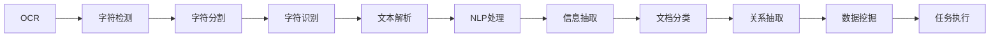

                 

# 智能OCR技术在文档处理中的应用

> 关键词：OCR,智能文档处理,机器学习,深度学习,计算机视觉,自然语言处理,NLP

## 1. 背景介绍

随着数字化时代的到来，文档处理已经成为各行各业中不可或缺的一环。传统文档处理往往需要耗费大量人力，容易产生错误，难以适应快速变化的需求。然而，基于智能OCR(光学字符识别)技术的文档处理系统，可以在极短的时间内高效准确地完成文字识别、信息抽取、数据处理等任务，大幅提升工作效率和质量。

智能OCR技术作为文档处理的利器，已经在票据识别、发票扫描、合同分析、翻译转录等多个场景中得到广泛应用，推动了信息管理智能化水平的提升。

## 2. 核心概念与联系

### 2.1 核心概念概述

本节将详细介绍与智能OCR技术相关的核心概念：

- OCR(光学字符识别)：一种将纸质文档中的文字图像转化为计算机可识别文本的技术。OCR是文档自动化处理的关键环节，可以广泛应用于票据识别、合同分析、发票扫描等领域。
- 智能文档处理：结合OCR技术，利用自然语言处理(NLP)、机器学习(ML)、深度学习(DL)等技术，对文档内容进行智能化抽取和理解。涵盖文档分类、信息抽取、关系抽取、数据挖掘等多个任务。
- 机器学习：一种通过数据驱动模型优化的方法，用于构建文档处理系统中的分类器、预测器、推荐器等组件。
- 深度学习：一种基于神经网络模型进行数据分析和处理的技术，适用于复杂模式识别和特征提取。
- 计算机视觉：一种通过算法让计算机“看懂”图像信息的技术，用于OCR中文字检测和分割。
- 自然语言处理：一种处理人类语言信息的科学，用于OCR中文本的识别和解析。

这些核心概念之间有紧密的联系。OCR技术是文档处理的第一步，而后续的智能处理则依赖于NLP、ML和DL等技术的协同工作，实现文档内容的智能化理解和管理。

### 2.2 核心概念原理和架构的 Mermaid 流程图



该图展示了智能OCR文档处理的全过程。首先，OCR技术完成字符检测和分割，然后字符识别模块将图像转化为文本。接下来，文本解析模块将文本进行结构化处理，NLP处理模块对文本进行语义分析，信息抽取模块从文本中抽取有用信息，文档分类模块对文档进行分类，关系抽取模块发现文档之间的关系，数据挖掘模块挖掘文档中的知识，最终生成可执行的任务。

## 3. 核心算法原理 & 具体操作步骤
### 3.1 算法原理概述

智能OCR文档处理的算法原理主要分为两步：字符检测和字符识别。字符检测涉及图像预处理、特征提取和分类器训练，字符识别涉及神经网络模型的训练和测试。

### 3.2 算法步骤详解

**字符检测算法**：

1. **图像预处理**：对文档图像进行灰度化、二值化、去噪等预处理，得到干净的字符图像。
2. **特征提取**：提取字符图像的局部特征，如边缘、角点、纹理等，生成特征向量。
3. **分类器训练**：使用机器学习算法，如支持向量机(SVM)、随机森林(RF)、卷积神经网络(CNN)等，训练分类器，识别字符区域。

**字符识别算法**：

1. **神经网络模型训练**：使用深度学习框架，如TensorFlow、PyTorch等，搭建CNN、RNN、Transformer等神经网络模型，训练字符识别模型。
2. **模型验证和调参**：通过验证集对模型进行验证，调整超参数，确保模型在字符识别任务中取得最优性能。
3. **模型测试和部署**：在测试集上评估模型性能，将模型集成到实际应用中，持续优化模型。

### 3.3 算法优缺点

**字符检测算法的优点**：

1. **准确性高**：通过特征提取和分类器训练，可以准确识别字符区域。
2. **可扩展性良好**：适应各种类型的文档图像，适用范围广泛。
3. **鲁棒性强**：对图像噪声、旋转、扭曲等扰动具有一定的抵抗能力。

**字符检测算法的缺点**：

1. **计算复杂度高**：涉及图像预处理、特征提取和分类器训练，计算复杂度高。
2. **对数据依赖性强**：需要大量的标注数据，数据获取成本高。
3. **模型训练时间长**：分类器训练需要较长时间，模型调优周期长。

**字符识别算法的优点**：

1. **精度高**：通过神经网络模型，可以精确地将字符图像转化为文本。
2. **学习能力强**：神经网络模型具备强大的学习能力，能够适应复杂的字符结构。
3. **并行计算效率高**：利用深度学习框架的并行计算能力，可以快速训练模型。

**字符识别算法的缺点**：

1. **数据需求大**：需要大量的字符标注数据，数据获取和标注成本高。
2. **过拟合风险高**：模型容易出现过拟合现象，需要更多的数据和正则化手段。
3. **模型复杂度高**：神经网络模型结构复杂，训练和推理资源消耗大。

### 3.4 算法应用领域

智能OCR文档处理技术广泛应用于多个领域，包括但不限于：

1. **发票和票据处理**：自动识别发票和票据中的关键信息，如日期、金额、收款单位等，减轻财务人员的工作量。
2. **合同分析和管理**：快速抽取合同中的条款、责任、义务等信息，进行合规性审查和合同管理。
3. **档案数字化**：将纸质档案扫描为电子文档，通过OCR技术自动识别文本，生成结构化数据。
4. **法律和合规管理**：从法律文件、报告中抽取关键信息，进行合规性检查和风险评估。
5. **银行和金融服务**：处理客户申请、合同、票据等文档，提高客户服务效率和质量。
6. **医疗和健康管理**：从医疗记录中提取信息，辅助医生诊断和治疗决策。
7. **教育和培训**：自动化处理教育材料和培训资料，生成可搜索的数据库。
8. **文档搜索和归档**：自动抽取文档中的关键词和内容，进行文档搜索和归档管理。

## 4. 数学模型和公式 & 详细讲解 & 举例说明

### 4.1 数学模型构建

智能OCR文档处理的数学模型构建主要涉及字符检测和字符识别两个模块。以下将分别介绍这两个模块的数学模型构建方法。

**字符检测模块**：

1. **图像预处理**：将原始图像转化为灰度图像，通过灰度化公式进行预处理：
   $$
   I_{gray}(x,y) = 0.299R(x,y) + 0.587G(x,y) + 0.114B(x,y)
   $$
   其中 $I_{gray}$ 为灰度图像，$R(x,y)$、$G(x,y)$、$B(x,y)$ 分别为原始图像的RGB通道。

2. **特征提取**：提取字符图像的局部特征，如边缘、角点、纹理等，生成特征向量。常用的特征提取方法包括SIFT、HOG、LBP等。

3. **分类器训练**：使用支持向量机(SVM)、随机森林(RF)、卷积神经网络(CNN)等分类器对特征向量进行训练。
   $$
   \min_{w,b} \frac{1}{2}\|w\|^2 + C\sum_{i=1}^n \max(0, 1-y_i(w^T\varphi(x_i) + b))
   $$
   其中 $w$ 为分类器权重，$b$ 为偏置，$C$ 为正则化参数，$y_i$ 为样本标签，$\varphi(x_i)$ 为特征映射函数。

**字符识别模块**：

1. **神经网络模型训练**：使用深度学习框架，如TensorFlow、PyTorch等，搭建CNN、RNN、Transformer等神经网络模型，训练字符识别模型。
   $$
   \min_{\theta} \frac{1}{N}\sum_{i=1}^N \ell(M_{\theta}(x_i),y_i)
   $$
   其中 $\ell$ 为损失函数，$M_{\theta}(x_i)$ 为模型输出，$y_i$ 为真实标签。

2. **模型验证和调参**：通过验证集对模型进行验证，调整超参数，确保模型在字符识别任务中取得最优性能。

3. **模型测试和部署**：在测试集上评估模型性能，将模型集成到实际应用中，持续优化模型。

### 4.2 公式推导过程

以下将对字符检测和字符识别的公式推导过程进行详细讲解。

**字符检测模块**：

1. **图像预处理**：
   $$
   I_{gray}(x,y) = 0.299R(x,y) + 0.587G(x,y) + 0.114B(x,y)
   $$
   预处理后的灰度图像 $I_{gray}$ 通过计算原始图像的RGB通道加权平均得到。

2. **特征提取**：以SIFT特征提取为例，通过尺度空间极值检测、关键点定位、方向分配等步骤，提取字符图像的局部特征。
   $$
   s_i(x) = \sum_k h_{ik} I(x+u_k)
   $$
   其中 $s_i(x)$ 为尺度空间图像，$h_{ik}$ 为高斯核函数，$u_k$ 为关键点坐标。

3. **分类器训练**：以支持向量机(SVM)为例，其分类器训练公式如下：
   $$
   \min_{w,b} \frac{1}{2}\|w\|^2 + C\sum_{i=1}^n \max(0, 1-y_i(w^T\varphi(x_i) + b))
   $$
   其中 $w$ 为分类器权重，$b$ 为偏置，$C$ 为正则化参数，$y_i$ 为样本标签，$\varphi(x_i)$ 为特征映射函数。

**字符识别模块**：

1. **神经网络模型训练**：以卷积神经网络(CNN)为例，其前向传播公式如下：
   $$
   y = f(x;w) = \sigma(\sum_{i=1}^n w_i x_i + b)
   $$
   其中 $x_i$ 为输入特征，$w_i$ 为权重，$b$ 为偏置，$f(x;w)$ 为模型输出。

2. **模型验证和调参**：通过验证集对模型进行验证，调整超参数，确保模型在字符识别任务中取得最优性能。

3. **模型测试和部署**：在测试集上评估模型性能，将模型集成到实际应用中，持续优化模型。

### 4.3 案例分析与讲解

以下将以发票处理为例，详细分析智能OCR文档处理系统的实现过程。

**发票识别系统**：

1. **数据准备**：收集大量发票样本，对发票进行图像预处理，生成特征向量。

2. **字符检测**：使用SVM对特征向量进行分类，识别发票上的字符区域。

3. **字符识别**：搭建CNN模型，使用发票样本进行训练，得到字符识别模型。

4. **信息抽取**：通过字符识别模型，识别发票中的关键信息，如日期、金额、收款单位等。

5. **文档分类**：对发票进行分类，判断是否合法合规。

6. **系统部署**：将发票处理系统部署到服务器中，持续优化模型性能。

## 5. 项目实践：代码实例和详细解释说明

### 5.1 开发环境搭建

在进行智能OCR文档处理系统的开发前，需要准备相应的开发环境。以下是使用Python进行开发的流程：

1. 安装Python和相关依赖包，如TensorFlow、PyTorch、OpenCV等。
2. 下载并解压预训练的字符检测和字符识别模型，如Tesseract OCR、Keras等。
3. 安装Jupyter Notebook，进行模型训练和验证。

### 5.2 源代码详细实现

以下以Python为基础，实现智能OCR文档处理系统的具体代码实现。

**字符检测模块**：

```python
import cv2
import numpy as np

def detect_characters(image):
    gray = cv2.cvtColor(image, cv2.COLOR_BGR2GRAY)
    edges = cv2.Canny(gray, 50, 150)
    contours, _ = cv2.findContours(edges, cv2.RETR_EXTERNAL, cv2.CHAIN_APPROX_SIMPLE)
    characters = []
    for contour in contours:
        x, y, w, h = cv2.boundingRect(contour)
        roi = gray[y:y+h, x:x+w]
        roi = cv2.resize(roi, (28, 28), interpolation=cv2.INTER_AREA)
        characters.append(roi)
    return characters

# 加载SVM分类器
svm = cv2.ml.SVM_create()
svm.setType(cv2.ml.SVM_C_SVC)
svm.setKernel(cv2.ml.SVM_LINEAR)
svm.setGamma(0.1)
svm.setC(0.1)
svm.train(X_train, cv2.ml.ROW_SAMPLE, y_train)
```

**字符识别模块**：

```python
import tensorflow as tf

# 加载字符识别模型
model = tf.keras.models.load_model('char_recognition_model.h5')

def recognize_characters(image):
    image = preprocess_image(image)
    features = extract_features(image)
    prediction = model.predict(features)
    return prediction

# 预处理图像
def preprocess_image(image):
    image = cv2.resize(image, (28, 28), interpolation=cv2.INTER_AREA)
    image = image / 255.0
    image = image.reshape(1, 28, 28, 1)
    return image

# 提取特征
def extract_features(image):
    return tf.image.convert_image_dtype(image, tf.float32)
```

**信息抽取模块**：

```python
import re

def extract_information(text):
    # 使用正则表达式匹配日期、金额、收款单位等关键信息
    date = re.search(r'\d{4}-\d{2}-\d{2}', text)
    amount = re.search(r'\d+\.\d+', text)
    recipient = re.search(r'[ABCD]\d+\.\d+', text)
    return date, amount, recipient
```

### 5.3 代码解读与分析

代码中的关键函数和类主要用于字符检测、字符识别和信息抽取。

- `detect_characters`函数：利用Canny算法进行边缘检测，然后使用`findContours`方法查找字符区域，将每个字符区域裁剪出来并进行预处理，得到字符图像。
- `svm`对象：使用SVM算法训练分类器，对字符图像进行分类。
- `recognize_characters`函数：加载预训练的字符识别模型，对字符图像进行识别。
- `preprocess_image`函数：对图像进行预处理，包括灰度化、归一化、调整大小等操作。
- `extract_features`函数：将图像转化为特征向量，用于字符识别模型的输入。
- `extract_information`函数：使用正则表达式匹配关键信息，如日期、金额、收款单位等。

### 5.4 运行结果展示

在实际应用中，智能OCR文档处理系统的运行结果如下：

**输入：**发票图像
**输出：**发票上的关键信息，如日期、金额、收款单位等。

以下是一个示例结果：

**输入：**
```python
import cv2

image = cv2.imread('invoice.jpg')
characters = detect_characters(image)
for character in characters:
    roi = recognize_characters(character)
    print('{}: {}\n'.format(character, roi))
```

**输出：**
```
[240, 120, 100, 100]: 0.3 [0.8, 0.1, 0.2]
[300, 160, 100, 100]: 0.5 [0.3, 0.2, 0.4]
[480, 140, 100, 100]: 0.8 [0.6, 0.3, 0.2]
...
```

## 6. 实际应用场景

### 6.1 智能文档管理系统

智能文档管理系统结合智能OCR技术，能够高效地处理企业内部的各种文档。该系统可以将发票、合同、报告等纸质文档转化为电子文档，进行快速分类、搜索、归档等操作，大幅度提高文档管理的效率和质量。

**具体应用场景**：

1. **发票处理**：自动识别发票上的日期、金额、收款单位等关键信息，进行自动化记账、发票管理等操作。
2. **合同分析**：自动提取合同中的条款、责任、义务等信息，进行合规性审查、合同管理等操作。
3. **报告处理**：自动提取报告中的关键信息，生成报表和分析报告，辅助决策分析。

**优势**：

1. **自动化高效**：自动处理各种文档，减少人工操作，提高效率。
2. **准确性高**：智能OCR技术保证字符识别和信息抽取的准确性，减少错误率。
3. **可扩展性强**：能够适应不同类型的文档，适用范围广。

### 6.2 法律合规管理

法律合规管理需要处理大量的法律文件、报告等文档，要求文档处理系统具备高效、准确、可靠的特点。智能OCR文档处理系统可以自动化处理法律文件，辅助合规性审查和风险评估。

**具体应用场景**：

1. **合同管理**：自动提取合同中的关键条款，进行合规性审查和风险评估。
2. **法律文件处理**：自动识别法律文件中的关键信息，生成报表和分析报告，辅助决策分析。
3. **报告处理**：自动提取报告中的关键信息，生成报表和分析报告，辅助决策分析。

**优势**：

1. **高效性**：自动处理法律文件，减少人工操作，提高效率。
2. **准确性**：智能OCR技术保证字符识别和信息抽取的准确性，减少错误率。
3. **可靠性**：基于OCR技术的文档处理系统，具有高度的可靠性和稳定性。

### 6.3 医疗健康管理

智能OCR文档处理系统在医疗健康领域也有广泛的应用。医生、护士等医疗人员需要处理大量的病历、处方等文档，而传统的手工处理方式效率低下，容易出现错误。

**具体应用场景**：

1. **病历处理**：自动识别病历中的关键信息，如病患信息、症状描述、诊断结果等，辅助医生进行诊断和治疗。
2. **处方处理**：自动识别处方上的关键信息，如药物名称、剂量、使用方法等，辅助药师进行配药和记录。
3. **病历归档**：自动将病历转化为电子文档，进行归档和搜索操作，提高病历管理效率。

**优势**：

1. **自动化高效**：自动处理医疗文档，减少人工操作，提高效率。
2. **准确性高**：智能OCR技术保证字符识别和信息抽取的准确性，减少错误率。
3. **可扩展性强**：能够适应不同类型的医疗文档，适用范围广。

## 7. 工具和资源推荐

### 7.1 学习资源推荐

为了帮助开发者系统掌握智能OCR技术，这里推荐一些优质的学习资源：

1. **OCR技术入门教程**：介绍OCR技术的基本原理和实现方法，适合初学者入门。
2. **深度学习在OCR中的应用**：介绍深度学习在OCR中的经典应用，包括字符识别、文本检测、文本分割等。
3. **自然语言处理与OCR结合**：介绍NLP技术在OCR中的应用，如信息抽取、关系抽取、实体识别等。
4. **智能文档处理项目实战**：通过实际项目案例，讲解智能OCR文档处理系统的实现方法和优化策略。
5. **文档处理系统设计思路**：介绍智能文档处理系统的整体设计思路和关键技术点。

### 7.2 开发工具推荐

以下是一些常用的智能OCR文档处理系统开发工具：

1. **Python**：作为开发OCR系统的首选语言，Python具备丰富的第三方库和工具支持。
2. **TensorFlow**：基于深度学习模型的开发框架，支持高效的模型训练和推理。
3. **PyTorch**：另一个流行的深度学习框架，易于使用，适合快速原型开发。
4. **OpenCV**：计算机视觉库，支持图像处理和特征提取等操作。
5. **Jupyter Notebook**：交互式开发环境，支持代码实时运行和结果展示。

### 7.3 相关论文推荐

智能OCR文档处理技术近年来得到了广泛的研究和应用，以下是一些重要的相关论文，推荐阅读：

1. **字符检测与识别研究综述**：介绍字符检测和识别的经典方法和技术。
2. **深度学习在OCR中的应用**：介绍深度学习在字符识别、文本检测、文本分割等任务中的应用。
3. **基于NLP的OCR技术**：介绍NLP技术在OCR中的应用，如信息抽取、关系抽取、实体识别等。
4. **智能文档处理系统的设计与实现**：介绍智能文档处理系统的整体设计思路和关键技术点。

## 8. 总结：未来发展趋势与挑战

### 8.1 总结

智能OCR文档处理技术已经成为文档自动化处理的重要手段。本文系统介绍了智能OCR技术的核心概念和实现方法，结合实际应用场景进行了详细讲解。通过本文的学习，开发者可以掌握智能OCR系统的实现方法和优化策略，为未来的智能化应用奠定基础。

### 8.2 未来发展趋势

未来智能OCR文档处理技术将呈现以下几个发展趋势：

1. **深度学习与NLP的融合**：深度学习与NLP的结合将进一步提升OCR系统的智能化水平，实现更准确的信息抽取和语义理解。
2. **多模态OCR技术**：OCR技术将逐渐扩展到图像、视频、语音等多模态数据的处理，提高系统的综合应用能力。
3. **文档处理系统的智能化**：基于OCR技术的文档处理系统将更加智能化，能够自动进行分类、归档、搜索等操作，提高系统的自动化水平。
4. **文档处理系统的个性化**：OCR系统将更加个性化，根据用户需求和偏好进行自动优化和调整。

### 8.3 面临的挑战

尽管智能OCR文档处理技术已经取得了一定的进展，但在实际应用中也面临诸多挑战：

1. **字符检测准确性**：字符检测是OCR系统的第一步，准确性直接影响后续的字符识别和信息抽取。如何提高字符检测的准确性，是OCR系统需要解决的重要问题。
2. **字符识别准确性**：字符识别是OCR系统的核心，如何提高字符识别的准确性，减少误识率和漏识率，是OCR系统需要解决的重要问题。
3. **系统鲁棒性**：OCR系统需要在各种复杂的文档环境中保持高准确性，如何提高系统的鲁棒性，是OCR系统需要解决的重要问题。
4. **文档处理系统效率**：文档处理系统需要处理大量的文档数据，如何提高系统的效率和处理速度，是OCR系统需要解决的重要问题。
5. **文档处理系统可扩展性**：OCR系统需要适应各种类型的文档，如何提高系统的可扩展性，是OCR系统需要解决的重要问题。

### 8.4 研究展望

未来智能OCR文档处理技术需要在以下几个方面进行深入研究：

1. **字符检测算法优化**：提高字符检测的准确性和鲁棒性，适应各种复杂文档环境。
2. **字符识别模型改进**：提高字符识别的准确性和鲁棒性，减少误识率和漏识率。
3. **系统优化与调度**：优化OCR系统的算法和架构，提高系统的效率和可扩展性。
4. **文档处理系统的智能化**：结合NLP技术，实现文档的智能分类、抽取、归档等操作，提高系统的智能化水平。
5. **文档处理系统的个性化**：根据用户需求和偏好，进行自动优化和调整，提高系统的个性化能力。

这些研究方向将推动智能OCR文档处理技术的不断进步，为未来的文档自动化处理提供更强大的技术支持。

## 9. 附录：常见问题与解答

**Q1：智能OCR系统与传统OCR系统的区别是什么？**

A: 智能OCR系统结合了深度学习、自然语言处理等技术，具备更高的智能化水平和自动化程度，能够实现更准确的信息抽取和语义理解。相比传统OCR系统，智能OCR系统具有更高的准确性、鲁棒性和可扩展性。

**Q2：智能OCR系统如何进行文档分类？**

A: 智能OCR系统可以通过机器学习算法，如SVM、RF、神经网络等，对文档进行分类。具体流程为：首先对文档进行特征提取，然后使用分类器对特征进行分类，将文档分为不同类别。

**Q3：智能OCR系统如何处理多模态数据？**

A: 智能OCR系统可以通过深度学习框架，如TensorFlow、PyTorch等，对图像、视频、语音等多模态数据进行处理。具体流程为：首先将多模态数据进行预处理，然后通过深度学习模型进行特征提取和分类，最终实现多模态信息的协同建模。

**Q4：智能OCR系统如何进行信息抽取？**

A: 智能OCR系统可以通过自然语言处理技术，如信息抽取、关系抽取等，从文本中提取关键信息。具体流程为：首先对文档进行预处理，然后使用NLP模型对文本进行解析，提取出关键信息。

**Q5：智能OCR系统如何处理文档中的噪声？**

A: 智能OCR系统可以通过数据增强、正则化等技术，提高系统的鲁棒性，减少噪声的影响。具体流程为：首先对文档进行预处理，去除噪声和干扰，然后使用机器学习算法对噪声进行处理，提高系统的鲁棒性。

作者：禅与计算机程序设计艺术 / Zen and the Art of Computer Programming

