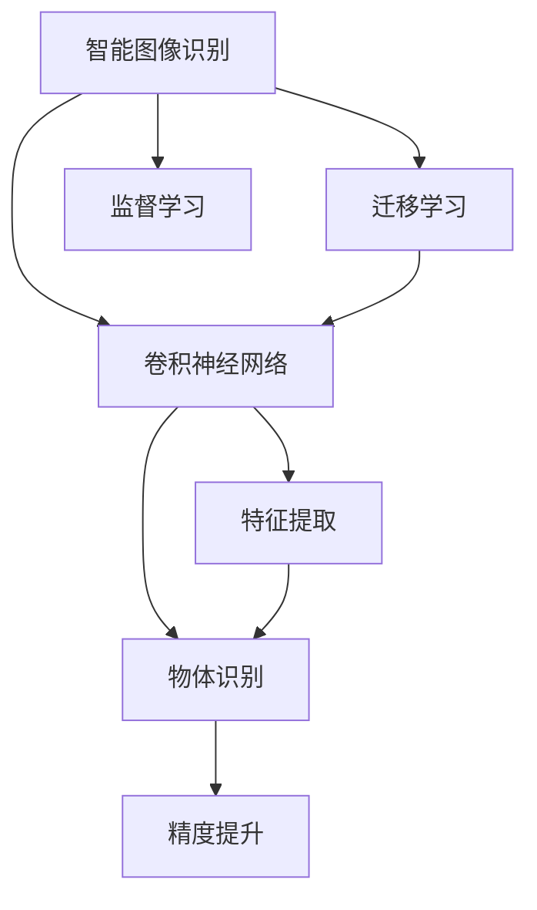

                 

# 智能图像识别在产品分类中的应用

> 关键词：智能图像识别,产品分类,机器学习,深度学习,卷积神经网络,迁移学习,监督学习,特征提取,物体识别,精度提升

## 1. 背景介绍

### 1.1 问题由来
在现代商业中，企业常常需要对其生产或销售的产品进行分类管理。传统的分类方法包括手动标注、基于规则的系统等，这些方法成本高、效率低，且存在一定的误差。随着计算机视觉和深度学习技术的快速发展，智能图像识别技术逐渐成为产品分类的重要工具。

智能图像识别技术通过深度学习模型对图像进行特征提取和分类，能够自动化、高精度地识别产品种类，大大提高了产品分类的效率和准确性。例如，零售企业可以通过图像识别技术对商品进行快速分类，从而优化库存管理、提高销售效率；工业企业可以利用图像识别技术对生产线上的产品进行分类，提升生产效率和质量控制。

### 1.2 问题核心关键点
智能图像识别在产品分类中的应用核心关键点在于：

- 如何设计有效的深度学习模型进行图像特征提取和分类。
- 如何通过迁移学习和大规模数据提升分类精度。
- 如何在实际应用中平衡模型的精度和效率，优化资源配置。
- 如何处理数据中的噪声和不一致性，提升模型鲁棒性。

### 1.3 问题研究意义
智能图像识别在产品分类中的应用，对企业的运营效率和产品质量有着重要影响。其研究意义主要体现在以下几个方面：

- 提升分类精度：通过深度学习模型的优化，能够显著提升产品分类的准确率，减少人工标注误差。
- 降低成本：自动化、高精度的图像识别系统能够减少人工操作，降低人力成本和时间成本。
- 优化库存管理：通过对商品进行自动化分类，帮助企业优化库存结构，提高运营效率。
- 提高生产质量：通过图像识别技术对生产线上的产品进行分类，提升产品质量控制能力。
- 推动商业智能化转型：智能图像识别技术是企业数字化转型的重要工具，能够提升企业的智能化水平。

## 2. 核心概念与联系

### 2.1 核心概念概述

为更好地理解智能图像识别在产品分类中的应用，本节将介绍几个密切相关的核心概念：

- 智能图像识别（Image Recognition）：使用深度学习模型对图像进行自动分类或识别，是计算机视觉领域的核心技术之一。
- 卷积神经网络（Convolutional Neural Network, CNN）：一种特殊的神经网络，擅长处理具有网格结构的数据，广泛应用于图像识别、语音识别等领域。
- 迁移学习（Transfer Learning）：将在一个领域预训练好的模型，应用于另一个领域，以更少的样本和更少的计算资源提升新任务性能。
- 监督学习（Supervised Learning）：利用标注好的数据进行模型训练，使模型能够准确预测未见过的数据。
- 特征提取（Feature Extraction）：从原始数据中提取有用的特征，供分类器进行分类。
- 物体识别（Object Recognition）：识别图像中的物体类别，是图像识别中最为典型的应用场景。
- 精度提升（Precision Enhancement）：通过优化模型架构、数据预处理等方法，提升模型识别精度。

这些核心概念之间的逻辑关系可以通过以下Mermaid流程图来展示：



这个流程图展示智能图像识别技术的工作原理和优化方法：

1. 智能图像识别利用卷积神经网络对图像进行特征提取。
2. 迁移学习可以将预训练好的模型应用到新任务，提升模型性能。
3. 监督学习使用标注数据进行模型训练，使模型能够准确分类。
4. 特征提取对原始数据进行处理，提取有用的特征。
5. 物体识别是图像识别的核心任务，识别图像中的物体类别。
6. 精度提升通过优化模型和数据处理，进一步提高识别精度。

## 3. 核心算法原理 & 具体操作步骤
### 3.1 算法原理概述

智能图像识别在产品分类中的应用，本质上是使用深度学习模型对图像进行自动分类或识别。其核心思想是：通过卷积神经网络对图像进行特征提取，然后使用监督学习模型对这些特征进行分类，最终得到产品分类的结果。

具体而言，智能图像识别在产品分类中的应用可分为以下几个步骤：

1. 数据预处理：将图像数据进行归一化、缩放等处理，使之适合输入深度学习模型。
2. 特征提取：使用卷积神经网络对图像数据进行特征提取，生成一组低维特征向量。
3. 分类器训练：将提取的特征向量作为输入，使用监督学习模型对产品进行分类。
4. 模型评估：在测试数据集上评估分类器的性能，调整模型参数，优化分类效果。
5. 实际应用：将训练好的分类器应用于实际产品图像的分类。

### 3.2 算法步骤详解

以下是智能图像识别在产品分类中的详细步骤：

**Step 1: 数据准备**
- 收集训练数据集：包含各类产品的图像及其对应的类别标签。
- 划分训练集、验证集和测试集：通常使用70%的数据作为训练集，15%作为验证集，15%作为测试集。

**Step 2: 模型搭建**
- 选择卷积神经网络模型：如ResNet、Inception等。
- 添加池化层、卷积层、全连接层等网络组件。
- 设置网络损失函数和优化器：如交叉熵损失、Adam优化器等。

**Step 3: 特征提取**
- 对训练集图像进行预处理和归一化。
- 使用卷积神经网络对图像进行特征提取，生成特征向量。

**Step 4: 分类器训练**
- 将特征向量作为输入，使用监督学习模型进行训练，如SVM、KNN等。
- 在验证集上评估模型性能，调整模型参数。
- 在测试集上再次评估模型性能，确定最终的分类器。

**Step 5: 模型应用**
- 将训练好的分类器应用于实际产品图像的分类。
- 根据分类结果进行产品管理、库存优化等操作。

### 3.3 算法优缺点

智能图像识别在产品分类中的应用具有以下优点：

1. 高精度：通过深度学习模型，能够实现高精度的产品分类。
2. 自动化：不需要人工参与，自动化程度高。
3. 可扩展性：通过迁移学习，可以方便地将模型应用于新的产品分类任务。

同时，该方法也存在一些缺点：

1. 数据依赖：依赖高质量的标注数据，标注成本较高。
2. 计算资源需求高：深度学习模型通常需要大量的计算资源。
3. 模型复杂性：深度学习模型较为复杂，训练和维护成本较高。

### 3.4 算法应用领域

智能图像识别在产品分类中的应用广泛，涉及多个领域：

- 零售业：用于商品分类、库存管理等。
- 制造业：用于产品检测、质量控制等。
- 农业：用于作物识别、病虫害检测等。
- 医疗：用于病理图像分类、疾病诊断等。
- 安防：用于监控图像中的人脸识别、车辆识别等。

## 4. 数学模型和公式 & 详细讲解 & 举例说明
### 4.1 数学模型构建

在智能图像识别中，数学模型通常包括卷积神经网络（CNN）和分类器两部分。以下以CNN为例，介绍其数学模型的构建过程。

记卷积神经网络为 $M_{\theta}$，其中 $\theta$ 为模型参数。假设输入图像为 $x$，其大小为 $H \times W \times C$。经过卷积层、池化层等处理后，生成一组特征图 $F$。使用线性分类器进行分类，分类器输出为 $p(y|x)$，表示输入 $x$ 属于类别 $y$ 的概率。

分类器通常使用交叉熵损失函数 $L$ 进行训练，公式如下：

$$
L(y,p) = -\frac{1}{N}\sum_{i=1}^N y_i\log p_i + (1-y_i)\log (1-p_i)
$$

其中 $y_i$ 为输入 $x_i$ 的真实类别标签，$p_i$ 为分类器输出的概率。

### 4.2 公式推导过程

在实际训练过程中，CNN模型的损失函数为：

$$
\mathcal{L}(\theta) = \frac{1}{N}\sum_{i=1}^N L(y_i,p_i)
$$

通过反向传播算法，求得参数 $\theta$ 的梯度：

$$
\frac{\partial \mathcal{L}(\theta)}{\partial \theta_k} = -\frac{\partial L(y_i,p_i)}{\partial \theta_k} = -\frac{\partial p_i}{\partial \theta_k} \frac{\partial L}{\partial p_i}
$$

其中 $\frac{\partial p_i}{\partial \theta_k}$ 为分类器输出的导数，可以通过链式法则递归计算得到。

### 4.3 案例分析与讲解

以零售业的商品分类任务为例，分析智能图像识别在实际应用中的实现。

**案例背景：**
一家零售企业希望通过图像识别技术对货架上的商品进行自动分类，以优化库存管理和销售效率。

**数据准备：**
收集包含各类商品的图像及其类别标签，划分为训练集、验证集和测试集。

**模型搭建：**
选择ResNet作为卷积神经网络的基础模型，添加池化层、卷积层、全连接层等网络组件。使用交叉熵损失函数和Adam优化器进行训练。

**特征提取：**
对训练集图像进行预处理和归一化，使用ResNet对图像进行特征提取，生成特征向量。

**分类器训练：**
将特征向量作为输入，使用线性分类器进行训练，如SVM、KNN等。在验证集上评估模型性能，调整模型参数。

**模型应用：**
将训练好的分类器应用于实际货架上的商品图像，自动分类并记录结果。

## 5. 项目实践：代码实例和详细解释说明
### 5.1 开发环境搭建

在进行智能图像识别项目开发前，我们需要准备好开发环境。以下是使用Python进行Keras开发的环境配置流程：

1. 安装Anaconda：从官网下载并安装Anaconda，用于创建独立的Python环境。

2. 创建并激活虚拟环境：
```bash
conda create -n image_recognition python=3.8 
conda activate image_recognition
```

3. 安装Keras：
```bash
pip install keras
```

4. 安装各类工具包：
```bash
pip install numpy scipy matplotlib scikit-learn tensorflow
```

5. 安装TensorFlow：
```bash
pip install tensorflow
```

6. 安装TensorBoard：
```bash
pip install tensorboard
```

完成上述步骤后，即可在`image_recognition`环境中开始项目开发。

### 5.2 源代码详细实现

下面我们以商品分类任务为例，给出使用Keras进行智能图像识别的PyTorch代码实现。

首先，定义数据处理函数：

```python
from keras.preprocessing.image import ImageDataGenerator
from keras.applications.resnet50 import ResNet50
from keras.layers import Dense, Flatten
from keras.models import Model
from keras.optimizers import Adam

def preprocess_data(x_train, x_test, y_train, y_test):
    datagen = ImageDataGenerator(rescale=1./255)
    train_generator = datagen.flow(x_train, y_train, batch_size=32)
    test_generator = datagen.flow(x_test, y_test, batch_size=32)
    return train_generator, test_generator

# 加载预训练ResNet50模型
resnet = ResNet50(weights='imagenet', include_top=False, input_shape=(224, 224, 3))

# 添加全连接层和输出层
x = resnet.output
x = Flatten()(x)
x = Dense(512, activation='relu')(x)
predictions = Dense(num_classes, activation='softmax')(x)
model = Model(inputs=resnet.input, outputs=predictions)

# 编译模型
model.compile(optimizer=Adam(lr=1e-4), loss='categorical_crossentropy', metrics=['accuracy'])
```

然后，定义训练和评估函数：

```python
from keras.callbacks import EarlyStopping

def train_model(model, train_generator, test_generator, num_epochs=10, patience=10):
    early_stopping = EarlyStopping(monitor='val_loss', patience=patience)
    model.fit_generator(train_generator, steps_per_epoch=len(x_train) // 32, epochs=num_epochs, validation_data=test_generator, validation_steps=len(x_test) // 32, callbacks=[early_stopping])
    
    test_loss, test_acc = model.evaluate_generator(test_generator, steps=len(x_test) // 32)
    print(f'Test Loss: {test_loss:.4f}, Test Accuracy: {test_acc:.4f}')
    
    # 保存模型
    model.save_weights('image_recognition.h5')

def evaluate_model(model, test_generator):
    test_loss, test_acc = model.evaluate_generator(test_generator, steps=len(x_test) // 32)
    print(f'Test Loss: {test_loss:.4f}, Test Accuracy: {test_acc:.4f}')
```

最后，启动训练流程并在测试集上评估：

```python
# 加载训练集和测试集
x_train, y_train = ...
x_test, y_test = ...

# 数据预处理
train_generator, test_generator = preprocess_data(x_train, x_test, y_train, y_test)

# 模型训练
train_model(model, train_generator, test_generator)

# 模型评估
evaluate_model(model, test_generator)
```

以上就是使用Keras进行商品分类任务的完整代码实现。可以看到，Keras提供的高层API使得图像识别的实现变得简洁高效。

### 5.3 代码解读与分析

让我们再详细解读一下关键代码的实现细节：

**preprocess_data函数**：
- 使用ImageDataGenerator对图像进行归一化、缩放等预处理。
- 将处理后的图像数据生成训练集和测试集的生成器，方便模型训练和推理。

**ResNet50模型**：
- 加载预训练ResNet50模型，去除顶部的全连接层和softmax输出。
- 添加全连接层和输出层，用于对商品图像进行分类。

**模型编译**：
- 编译模型，使用Adam优化器进行参数更新，交叉熵损失函数进行分类。

**训练函数**：
- 使用EarlyStopping回调函数，防止模型过拟合。
- 在训练集上训练模型，在验证集上评估模型性能。

**评估函数**：
- 在测试集上评估模型性能，输出测试损失和精度。

**训练流程**：
- 加载训练集和测试集。
- 进行数据预处理，生成训练集和测试集的生成器。
- 训练模型，并在测试集上评估性能。

## 6. 实际应用场景
### 6.1 智能仓储管理

智能图像识别技术在智能仓储管理中的应用，可以大幅提升仓储效率和准确性。通过对仓库内的货物进行自动分类，系统可以快速定位货物位置，减少查找和搬动货物的时间，提高仓库的存储容量和货物周转率。

在技术实现上，可以构建智能仓储管理系统，使用图像识别技术对仓库内的货物进行实时监控和分类。系统自动将货物分类信息上传至管理系统，系统根据分类信息进行货物存储和调用。对于不熟悉的货物，系统可以自动识别并提示管理人员进行分类，避免分类错误，提升仓储管理水平。

### 6.2 电商平台商品推荐

电商平台可以利用智能图像识别技术，对商品进行自动分类和标签生成，实现商品推荐系统的精准推荐。通过对用户浏览和购买行为进行分析，系统可以为用户推荐相似的商品，提升用户体验和转化率。

在具体实现上，电商平台可以使用图像识别技术对商品图像进行分类，生成商品标签。系统根据用户的浏览和购买行为，推荐相似的商品，并动态更新商品标签和分类信息。对于新上架的商品，系统可以自动识别并生成分类标签，快速适应商品结构的调整。

### 6.3 自动驾驶汽车

自动驾驶汽车中，智能图像识别技术是实现目标检测和行人识别的重要手段。通过对路面的图像进行实时分析，系统可以检测出道路上的车辆、行人等障碍物，并进行避障处理，确保行车安全。

在技术实现上，自动驾驶汽车可以部署多台摄像头，采集路面图像。系统使用智能图像识别技术对图像进行目标检测和分类，生成障碍物位置和类型信息。系统根据这些信息进行路径规划和避障处理，确保行车安全。对于复杂多变的道路环境，系统可以实时调整识别算法，提高识别精度和鲁棒性。

### 6.4 未来应用展望

随着智能图像识别技术的不断发展，其在实际应用中具有广阔前景。未来，智能图像识别技术将在更多领域得到应用，为各行各业带来变革性影响：

- 医疗诊断：用于病理图像分类、病灶检测等，提升医疗诊断的准确性和效率。
- 安防监控：用于人脸识别、车辆识别等，提升公共安全水平。
- 农业生产：用于作物识别、病虫害检测等，提高农业生产效率和质量。
- 工业制造：用于产品质量检测、设备维护等，提升工业生产自动化水平。
- 金融风控：用于身份证识别、交易风险检测等，提升金融风控能力。

总之，智能图像识别技术将为各行各业带来智能化、高效化的变革，提升社会生产力和生活质量。未来，随着技术的不断进步和应用的深入，智能图像识别技术将在更多领域得到广泛应用，为人类的生活和工作带来更美好的前景。

## 7. 工具和资源推荐
### 7.1 学习资源推荐

为了帮助开发者系统掌握智能图像识别技术，这里推荐一些优质的学习资源：

1. Deep Learning Specialization：由Coursera与斯坦福大学合作推出的深度学习专项课程，系统介绍了深度学习的基本概念和实现方法。
2. CS231n：斯坦福大学的计算机视觉课程，详细讲解了图像分类、目标检测等计算机视觉技术。
3. Hands-On Machine Learning with Scikit-Learn, Keras, and TensorFlow：深入浅出地介绍了机器学习、深度学习的基本方法和实践技巧。
4. Keras官方文档：提供了Keras的高层API，方便开发者进行图像识别等深度学习任务。
5. TensorFlow官方文档：提供了TensorFlow的低层API，方便开发者进行自定义模型和优化算法的设计。

通过对这些资源的学习实践，相信你一定能够快速掌握智能图像识别的精髓，并用于解决实际的NLP问题。

### 7.2 开发工具推荐

高效的开发离不开优秀的工具支持。以下是几款用于智能图像识别开发的常用工具：

1. Keras：基于Python的高层深度学习框架，易于上手，适合快速迭代研究。
2. TensorFlow：由Google主导开发的开源深度学习框架，生产部署方便，适合大规模工程应用。
3. PyTorch：基于Python的开源深度学习框架，动态计算图，适合研究和原型开发。
4. OpenCV：开源计算机视觉库，提供了丰富的图像处理和特征提取工具。
5. Dlib：用于人脸识别、目标检测等计算机视觉任务的开源库，具有较高的识别精度。
6. Scikit-learn：开源机器学习库，提供了丰富的分类器和评估指标。

合理利用这些工具，可以显著提升智能图像识别任务的开发效率，加快创新迭代的步伐。

### 7.3 相关论文推荐

智能图像识别技术的发展源于学界的持续研究。以下是几篇奠基性的相关论文，推荐阅读：

1. ImageNet Classification with Deep Convolutional Neural Networks：提出卷积神经网络(CNN)模型，并用于大规模图像分类任务。
2. AlexNet: One Million Training Examples for Large Scale Image Recognition：首次使用CNN模型在ImageNet数据集上获得优异性能。
3. VGGNet：提出深层次卷积神经网络，显著提升图像分类精度。
4. GoogLeNet: Inception Architecture for Computer Vision：提出Inception模块，提高深度神经网络的训练效率。
5. ResNet: Deep Residual Learning for Image Recognition：提出残差网络，解决深度神经网络中的梯度消失问题。

这些论文代表了大规模图像分类任务的发展脉络。通过学习这些前沿成果，可以帮助研究者把握学科前进方向，激发更多的创新灵感。

## 8. 总结：未来发展趋势与挑战
### 8.1 总结

本文对智能图像识别在产品分类中的应用进行了全面系统的介绍。首先阐述了智能图像识别的研究背景和意义，明确了其在产品分类中的重要价值。其次，从原理到实践，详细讲解了卷积神经网络和分类器的构建过程，给出了智能图像识别的完整代码实例。同时，本文还广泛探讨了智能图像识别技术在实际应用中的多个场景，展示了其广泛的应用前景。

通过本文的系统梳理，可以看到，智能图像识别在产品分类中的应用，已经成为一个成熟、可靠的技术。其高精度、自动化和可扩展性，使得其在零售、制造、农业、医疗等多个领域得到广泛应用。未来，随着技术的不断进步和应用的深入，智能图像识别技术将在更多领域得到推广，为人类的生活和工作带来更美好的前景。

### 8.2 未来发展趋势

展望未来，智能图像识别在产品分类中的应用将呈现以下几个发展趋势：

1. 更高精度：随着深度学习模型的不断发展，智能图像识别的分类精度将进一步提升，实现更准确的产品分类。
2. 更广应用：智能图像识别技术将在更多领域得到应用，提升各行各业的智能化水平。
3. 更低成本：通过迁移学习和自监督学习，智能图像识别技术将降低对标注数据的依赖，降低应用成本。
4. 更高效性：通过优化模型架构和算法，智能图像识别技术将提升处理速度和效率，适应实时化应用需求。
5. 更强大鲁棒性：通过数据增强和对抗训练等方法，智能图像识别技术将提升鲁棒性，应对复杂多变的实际环境。

以上趋势凸显了智能图像识别技术的广阔前景。这些方向的探索发展，必将进一步提升产品分类的精度和效率，为各行各业带来智能化、高效化的变革。

### 8.3 面临的挑战

尽管智能图像识别技术已经取得了显著成就，但在向更广泛、更深层次的应用推进过程中，它仍面临着诸多挑战：

1. 数据质量问题：标注数据的质量直接影响到分类精度，需要大量的高质量标注数据。如何获取和维护这些数据，是智能图像识别应用中的一大挑战。
2. 计算资源需求高：深度学习模型通常需要大量的计算资源，如何优化模型架构和算法，减少计算资源消耗，是智能图像识别技术应用中的一大瓶颈。
3. 模型泛化能力不足：模型在训练数据上表现优异，但在实际应用中可能出现泛化能力不足的问题，需要更多的应用实践和数据验证。
4. 模型鲁棒性问题：模型面对噪声、变形等干扰时可能表现不稳定，如何提高模型鲁棒性，是智能图像识别技术应用中的一大挑战。
5. 系统复杂性问题：智能图像识别系统的复杂度较高，如何简化系统结构，提升系统稳定性和可靠性，是智能图像识别技术应用中的一大挑战。

正视这些挑战，积极应对并寻求突破，将使智能图像识别技术更好地应用于实际场景，实现智能化、高效化的变革。

### 8.4 研究展望

面对智能图像识别技术所面临的挑战，未来的研究需要在以下几个方面寻求新的突破：

1. 探索无监督和半监督学习：摆脱对大规模标注数据的依赖，利用自监督学习、主动学习等无监督和半监督范式，最大限度利用非结构化数据，实现更灵活高效的智能图像识别。
2. 研究参数高效和计算高效模型：开发更加参数高效和计算高效的模型架构，提升模型的处理速度和鲁棒性。
3. 融合因果和对比学习范式：引入因果推断和对比学习思想，增强模型建立稳定因果关系的能力，学习更加普适、鲁棒的语言表征。
4. 引入更多先验知识：将符号化的先验知识，如知识图谱、逻辑规则等，与神经网络模型进行巧妙融合，引导智能图像识别过程学习更准确、合理的特征。
5. 结合因果分析和博弈论工具：将因果分析方法引入智能图像识别模型，识别出模型决策的关键特征，增强输出解释的因果性和逻辑性。
6. 纳入伦理道德约束：在模型训练目标中引入伦理导向的评估指标，过滤和惩罚有偏见、有害的输出倾向，确保输出的安全性。

这些研究方向的探索，必将引领智能图像识别技术迈向更高的台阶，为构建安全、可靠、可解释、可控的智能系统铺平道路。面向未来，智能图像识别技术还需要与其他人工智能技术进行更深入的融合，如知识表示、因果推理、强化学习等，多路径协同发力，共同推动计算机视觉和智能图像识别技术的进步。只有勇于创新、敢于突破，才能不断拓展图像识别的边界，让智能技术更好地造福人类社会。

## 9. 附录：常见问题与解答

**Q1：智能图像识别如何处理数据中的噪声和不一致性？**

A: 智能图像识别技术在处理数据中的噪声和不一致性时，通常采用以下方法：

1. 数据增强：通过对图像进行随机变换（如旋转、裁剪、翻转等），增加数据的多样性，提高模型的泛化能力。

2. 异常值检测：使用统计方法和深度学习模型（如孤立森林、GAN等）检测和过滤数据中的异常值，减少噪声对模型训练的影响。

3. 数据清洗：对数据进行预处理，去除无效、重复、格式不正确的数据，保证数据的一致性和准确性。

4. 多模态融合：结合多种数据源（如图像、文本、标签等），综合分析和判断，提高识别精度。

5. 鲁棒性增强：通过对抗训练等方法，使模型能够鲁棒地应对噪声、变形等干扰，提高模型的鲁棒性。

通过这些方法，智能图像识别技术能够更好地处理数据中的噪声和不一致性，提高模型的稳定性和鲁棒性。

**Q2：智能图像识别在实际应用中如何平衡模型的精度和效率？**

A: 在实际应用中，智能图像识别模型需要平衡精度和效率，通常采用以下方法：

1. 模型裁剪：去除不必要的层和参数，减小模型尺寸，加快推理速度。

2. 量化加速：将浮点模型转为定点模型，压缩存储空间，提高计算效率。

3. 模型并行：使用GPU、TPU等高性能设备，并行计算模型，提升处理速度。

4. 特征压缩：使用稀疏化、降维等方法，减少特征向量的维度，提高计算效率。

5. 算法优化：优化模型架构和算法，减少计算量，提升处理速度。

6. 分布式计算：使用分布式计算框架，并行处理大规模数据，提高计算效率。

通过这些方法，智能图像识别模型可以在保持高精度的同时，提升处理速度和效率，适应实际应用需求。

**Q3：智能图像识别在实际应用中如何处理多模态数据？**

A: 智能图像识别技术在处理多模态数据时，通常采用以下方法：

1. 数据融合：将多种数据源（如图像、文本、语音等）进行融合，综合分析和判断，提高识别精度。

2. 特征映射：将不同模态的数据映射到同一特征空间，进行统一处理和分析。

3. 联合训练：将不同模态的数据联合训练，提升模型的泛化能力和鲁棒性。

4. 多任务学习：将多种任务联合训练，提高模型的适应性和鲁棒性。

5. 跨模态对齐：将不同模态的数据对齐，进行统一处理和分析。

6. 多模态注意力机制：引入多模态注意力机制，提升模型对多模态数据的理解能力和表现能力。

通过这些方法，智能图像识别技术能够更好地处理多模态数据，提升模型的泛化能力和鲁棒性。

---

作者：禅与计算机程序设计艺术 / Zen and the Art of Computer Programming

