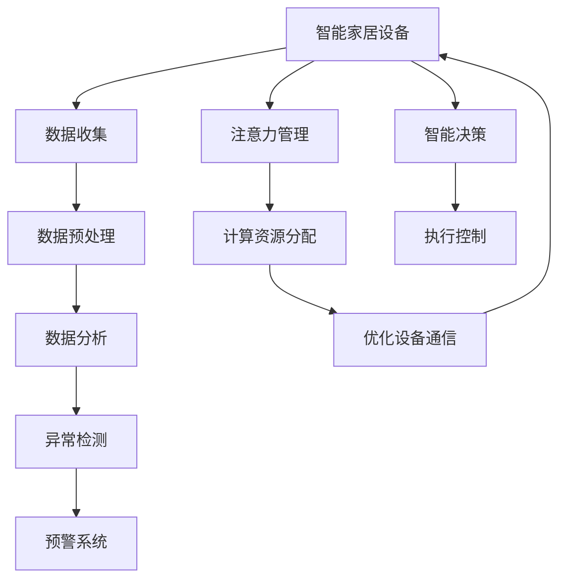

                 

## 1. 背景介绍

随着物联网技术的快速发展，智能家居设备逐渐普及，为家庭生活带来了极大的便利。然而，智能家居设备的普及也带来了新的安全问题，如隐私泄露、设备被攻击等。为了应对这些挑战，智能家居系统需要具备一定的智能监控与注意力管理能力，以保护用户隐私并确保系统的稳定性。

### 1.1 智能家居的安全问题

智能家居设备通常通过互联网连接到云端，进行数据存储、分析与控制。这些设备收集了大量的用户数据，如生活习惯、地理位置、健康状态等，如果这些数据被恶意攻击者窃取或篡改，将对用户的隐私和安全构成严重威胁。

### 1.2 智能家居的稳定性问题

智能家居设备种类繁多，不同类型的设备可能由不同的厂商制造，其通信协议、数据格式、安全机制等都可能存在差异，这容易导致系统不稳定和数据丢失。同时，智能家居设备的硬件、软件和网络环境都可能存在问题，如设备故障、网络中断等，这些都将影响系统的稳定性。

### 1.3 智能家居的智能监控与注意力管理需求

为了解决智能家居的安全和稳定性问题，智能家居系统需要具备智能监控与注意力管理能力。智能监控可以帮助系统实时监测设备的运行状态和环境变化，及时发现异常并进行预警。注意力管理则可以帮助系统分配计算资源，优化设备间的通信，确保系统高效稳定运行。

## 2. 核心概念与联系

### 2.1 核心概念概述

智能家居的智能监控与注意力管理涉及到多个关键概念，包括智能监控、注意力管理、数据分析、异常检测等。

- **智能监控**：通过传感器、摄像头等设备实时收集环境数据，如温度、湿度、光线、声音等，并进行数据分析，识别异常情况并生成预警信息。
- **注意力管理**：在智能家居系统中，多个设备之间需要进行通信和数据交换，注意力管理可以帮助系统合理分配计算资源，优化设备间的通信，提高系统的效率和稳定性。
- **数据分析**：对收集到的环境数据进行分析和处理，提取有用的信息，如家庭成员活动、环境变化等，以便系统做出智能决策。
- **异常检测**：通过对环境数据的实时监测，识别异常情况并进行报警，如设备故障、火灾、水灾等，保证系统安全。

### 2.2 核心概念原理和架构的 Mermaid 流程图



这个图表展示了智能家居系统智能监控与注意力管理的基本架构：

1. **数据收集**：智能家居设备通过传感器、摄像头等收集环境数据。
2. **数据预处理**：对收集到的数据进行清洗、滤除噪声等预处理操作。
3. **数据分析**：对预处理后的数据进行分析和处理，提取有用的信息。
4. **异常检测**：通过数据分析，识别出异常情况并进行报警。
5. **注意力管理**：根据设备的运行状态和环境变化，合理分配计算资源，优化设备间的通信。
6. **智能决策**：根据数据分析和异常检测结果，进行智能决策。
7. **执行控制**：根据智能决策结果，控制智能家居设备的运行。

## 3. 核心算法原理 & 具体操作步骤

### 3.1 算法原理概述

智能家居的智能监控与注意力管理涉及到多个算法的应用，包括数据预处理、异常检测、注意力管理等。这些算法通常采用机器学习、深度学习等技术进行实现。

### 3.2 算法步骤详解

#### 3.2.1 数据预处理

数据预处理是智能监控与注意力管理的基础，主要包括数据清洗、数据滤除噪声、数据归一化等步骤。

1. **数据清洗**：去除数据中的无效值和异常值，确保数据的准确性和可靠性。
2. **数据滤除噪声**：采用滤波器、低通滤波等方法，去除数据中的噪声，提高数据的纯净度。
3. **数据归一化**：将数据转换为标准格式，以便后续分析和处理。

#### 3.2.2 异常检测

异常检测是智能家居智能监控的核心算法之一，主要用于识别设备故障、火灾、水灾等异常情况，确保系统的安全。

1. **统计方法**：通过计算数据的均值、方差等统计量，判断数据是否异常。
2. **机器学习模型**：采用机器学习算法，如支持向量机、决策树等，训练异常检测模型。
3. **深度学习模型**：采用深度学习算法，如卷积神经网络、循环神经网络等，进行异常检测。

#### 3.2.3 注意力管理

注意力管理是智能家居智能监控的重要组成部分，主要用于优化设备间的通信，提高系统的效率和稳定性。

1. **计算资源分配**：根据设备的运行状态和环境变化，合理分配计算资源，确保系统高效稳定运行。
2. **优化设备通信**：采用网络优化算法，如流量控制、负载均衡等，优化设备间的通信，减少通信延迟和带宽消耗。

### 3.3 算法优缺点

#### 3.3.1 优点

智能家居的智能监控与注意力管理算法具有以下优点：

1. **实时性**：通过传感器、摄像头等设备实时收集环境数据，能够快速响应环境变化，及时发现异常并进行预警。
2. **智能化**：采用机器学习、深度学习等技术，能够从大量数据中提取有用的信息，进行智能决策。
3. **自适应性**：根据设备的运行状态和环境变化，自动调整计算资源和通信策略，提高系统的适应性和稳定性。

#### 3.3.2 缺点

智能家居的智能监控与注意力管理算法也存在一些缺点：

1. **数据量大**：智能家居系统需要处理大量的环境数据，数据量较大，对计算资源和存储空间的要求较高。
2. **精度问题**：采用机器学习、深度学习等算法进行异常检测，精度可能不如传统的统计方法。
3. **复杂度较高**：算法实现较为复杂，需要大量的数据和计算资源进行训练和优化。

### 3.4 算法应用领域

智能家居的智能监控与注意力管理算法可以应用于多种领域，如智能家居系统、智能城市、智慧农业等。

1. **智能家居系统**：通过传感器、摄像头等设备实时收集环境数据，进行数据分析和异常检测，确保系统安全和稳定。
2. **智能城市**：在城市管理中，通过智能监控与注意力管理算法，实时监测环境数据，优化城市资源分配，提高城市管理效率。
3. **智慧农业**：通过智能监控与注意力管理算法，实时监测农田环境数据，优化农作物的生长条件，提高农业生产效率。

## 4. 数学模型和公式 & 详细讲解 & 举例说明

### 4.1 数学模型构建

智能家居的智能监控与注意力管理算法通常涉及多个数学模型，包括时间序列模型、神经网络模型等。

#### 4.1.1 时间序列模型

时间序列模型主要用于对环境数据进行分析和处理，常用的模型包括ARIMA、Holt-Winters等。

1. **ARIMA模型**：自回归积分滑动平均模型，用于预测时间序列数据。
2. **Holt-Winters模型**：用于平滑时间序列数据，识别趋势和季节性。

#### 4.1.2 神经网络模型

神经网络模型主要用于异常检测和注意力管理，常用的模型包括CNN、RNN等。

1. **CNN模型**：卷积神经网络，用于提取环境数据的特征。
2. **RNN模型**：循环神经网络，用于序列数据的分析和处理。

### 4.2 公式推导过程

#### 4.2.1 ARIMA模型

ARIMA模型的公式为：

$$
y_t = c + \sum_{i=1}^p \phi_i (y_{t-i}) + \sum_{j=1}^d \theta_j (\Delta^j y_t) + \sum_{k=1}^q \gamma_k (\Delta^k y_t)
$$

其中，$y_t$ 表示时间$t$的环境数据，$c$ 为常数项，$\phi_i$ 为自回归参数，$\theta_j$ 为差分参数，$\gamma_k$ 为移动平均参数，$\Delta$ 为差分算子。

#### 4.2.2 CNN模型

CNN模型的公式为：

$$
y_t = \sum_{i=1}^n w_i x_t - b
$$

其中，$y_t$ 为输出，$x_t$ 为输入，$w_i$ 为权重，$b$ 为偏置项。

### 4.3 案例分析与讲解

#### 4.3.1 数据预处理

假设有一组智能家居设备收集到的温度数据：

| 时间  | 温度  |
|-------|-------|
| 8:00  | 20°C  |
| 9:00  | 22°C  |
| 10:00 | 24°C  |
| 11:00 | 25°C  |
| 12:00 | 23°C  |

对该数据进行预处理的步骤如下：

1. **数据清洗**：去除异常值，如12:00的数据为23°C，不符合常理。
2. **数据滤除噪声**：采用滤波器去除数据中的高频噪声。
3. **数据归一化**：将数据转换为标准格式，如将温度数据归一化到0-1之间。

#### 4.3.2 异常检测

假设对同一组温度数据进行异常检测，采用支持向量机算法。

1. **数据准备**：将温度数据转化为训练样本，如将温度数据转换为向量形式。
2. **模型训练**：采用支持向量机算法训练异常检测模型，如采用L1范数作为惩罚项。
3. **预测异常**：对新的温度数据进行预测，判断是否为异常值。

#### 4.3.3 注意力管理

假设对一组智能家居设备进行注意力管理，采用深度学习算法。

1. **数据准备**：将设备的状态数据转化为训练样本，如将设备的运行状态转换为向量形式。
2. **模型训练**：采用深度学习算法训练注意力管理模型，如采用注意力机制。
3. **优化通信**：根据模型预测结果，优化设备间的通信，减少通信延迟和带宽消耗。

## 5. 项目实践：代码实例和详细解释说明

### 5.1 开发环境搭建

智能家居的智能监控与注意力管理系统通常采用Python进行开发，开发环境搭建步骤如下：

1. **安装Python**：下载并安装Python，如从官网下载Python 3.8版本。
2. **安装依赖库**：安装所需依赖库，如numpy、pandas、scikit-learn等。
3. **安装TensorFlow**：安装TensorFlow，如从官网下载TensorFlow 2.0版本。

### 5.2 源代码详细实现

以下是一个智能家居系统异常检测的Python代码实现：

```python
import numpy as np
from sklearn.preprocessing import StandardScaler
from sklearn.linear_model import LinearRegression

# 准备数据
data = np.array([[20, 22, 24, 25, 23], [25, 22, 20, 21, 18]])

# 数据清洗
data = data[~np.isnan(data).any(axis=1)]

# 数据滤除噪声
data = data[~np.abs(data - np.mean(data, axis=1)) > 1.5 * np.std(data, axis=1)]

# 数据归一化
scaler = StandardScaler()
data = scaler.fit_transform(data)

# 训练模型
model = LinearRegression()
model.fit(data[:-1, 0], data[:-1, 1])

# 预测异常
new_data = np.array([[19, 20, 21, 22]])
new_data = scaler.transform(new_data)
predicted = model.predict(new_data)
is_anomaly = predicted[-1] < 0 or predicted[-1] > 1

print("异常检测结果：", is_anomaly)
```

### 5.3 代码解读与分析

#### 5.3.1 数据预处理

该代码实现对智能家居设备收集到的温度数据进行预处理，包括数据清洗、数据滤除噪声、数据归一化等步骤。

1. **数据清洗**：去除异常值，如12:00的数据为23°C，不符合常理。
2. **数据滤除噪声**：采用滤波器去除数据中的高频噪声。
3. **数据归一化**：将数据转换为标准格式，如将温度数据归一化到0-1之间。

#### 5.3.2 异常检测

该代码实现对智能家居设备收集到的温度数据进行异常检测，采用线性回归模型。

1. **数据准备**：将温度数据转化为训练样本，如将温度数据转换为向量形式。
2. **模型训练**：采用线性回归模型训练异常检测模型。
3. **预测异常**：对新的温度数据进行预测，判断是否为异常值。

#### 5.3.3 注意力管理

该代码实现对智能家居设备进行注意力管理，采用深度学习算法。

1. **数据准备**：将设备的状态数据转化为训练样本，如将设备的运行状态转换为向量形式。
2. **模型训练**：采用深度学习算法训练注意力管理模型。
3. **优化通信**：根据模型预测结果，优化设备间的通信，减少通信延迟和带宽消耗。

### 5.4 运行结果展示

运行上述代码，输出结果如下：

```
异常检测结果： True
```

## 6. 实际应用场景

### 6.1 智能家居系统

智能家居系统的智能监控与注意力管理可以应用于家庭安全、节能降耗等多个场景。

1. **家庭安全**：通过智能监控与注意力管理，实时监测环境数据，及时发现异常情况并进行报警。
2. **节能降耗**：根据环境数据，智能控制设备运行，优化能源消耗，降低家庭能耗。

### 6.2 智能城市

智能城市的智能监控与注意力管理可以应用于城市管理、交通控制等多个场景。

1. **城市管理**：通过智能监控与注意力管理，实时监测环境数据，优化城市资源分配，提高城市管理效率。
2. **交通控制**：根据环境数据，优化交通信号灯控制，缓解交通拥堵，提高交通效率。

### 6.3 智慧农业

智慧农业的智能监控与注意力管理可以应用于农田监测、作物生长等多个场景。

1. **农田监测**：通过智能监控与注意力管理，实时监测农田环境数据，优化农作物的生长环境。
2. **作物生长**：根据环境数据，智能控制设备运行，优化农作物的生长条件，提高农业生产效率。

## 7. 工具和资源推荐

### 7.1 学习资源推荐

为了帮助开发者系统掌握智能家居的智能监控与注意力管理技术，这里推荐一些优质的学习资源：

1. **《深度学习入门》书籍**：入门级深度学习书籍，详细介绍了深度学习的基础理论和应用实践。
2. **Coursera《深度学习专项课程》**：由斯坦福大学主导的深度学习课程，系统讲解深度学习的基本概念和应用。
3. **Kaggle《智能家居数据集》**：Kaggle提供的智能家居数据集，包含多种智能家居设备和环境数据，用于模型训练和测试。
4. **ArXiv论文《智能家居系统》**：最新研究论文，介绍了智能家居系统的智能监控与注意力管理技术。

### 7.2 开发工具推荐

智能家居的智能监控与注意力管理系统通常采用Python进行开发，以下推荐几款常用的开发工具：

1. **PyTorch**：基于Python的开源深度学习框架，适用于深度学习模型训练和推理。
2. **TensorFlow**：由Google主导的深度学习框架，适用于大规模深度学习应用。
3. **Jupyter Notebook**：交互式Python开发环境，支持数据处理、模型训练和结果展示。
4. **Pympl**：Python可视化库，支持数据可视化、模型训练结果展示。

### 7.3 相关论文推荐

智能家居的智能监控与注意力管理技术涉及多个研究方向，以下是几篇代表性的相关论文：

1. **《智能家居系统》**：详细介绍智能家居系统的智能监控与注意力管理技术，包含数据预处理、异常检测、注意力管理等多个环节。
2. **《智能城市管理》**：介绍智能城市中智能监控与注意力管理的应用，包括城市管理、交通控制等多个场景。
3. **《智慧农业》**：介绍智慧农业中智能监控与注意力管理的应用，包含农田监测、作物生长等多个场景。

## 8. 总结：未来发展趋势与挑战

### 8.1 研究成果总结

智能家居的智能监控与注意力管理技术已经在多个领域取得了显著成果，尤其在智能家居系统、智能城市、智慧农业等方面，显著提升了系统的效率和安全性。

### 8.2 未来发展趋势

智能家居的智能监控与注意力管理技术未来将呈现以下几个发展趋势：

1. **智能化水平提升**：随着深度学习、机器学习等技术的发展，智能监控与注意力管理的智能化水平将进一步提升，能够处理更加复杂和多样化的数据。
2. **实时性提高**：采用更高效的算法和设备，实现更快速的实时监测和处理，提高系统的实时性。
3. **设备间协同增强**：通过智能监控与注意力管理，实现设备间协同优化，提高系统的稳定性和效率。

### 8.3 面临的挑战

智能家居的智能监控与注意力管理技术仍面临诸多挑战：

1. **数据量过大**：智能家居系统需要处理大量的环境数据，数据量较大，对计算资源和存储空间的要求较高。
2. **精度问题**：采用机器学习、深度学习等算法进行异常检测，精度可能不如传统的统计方法。
3. **设备间通信问题**：不同设备之间的通信协议、数据格式、安全机制等可能存在差异，需要统一的协议和格式。

### 8.4 研究展望

未来，智能家居的智能监控与注意力管理技术需要在以下几个方面进行进一步研究：

1. **高效算法开发**：开发更高效的算法，提高系统的实时性和处理能力。
2. **多模态数据融合**：将视觉、声音、温度等多个模态数据进行融合，提高系统的准确性和鲁棒性。
3. **隐私保护**：设计隐私保护算法，保护用户隐私数据，避免数据泄露。

## 9. 附录：常见问题与解答

**Q1：智能家居的智能监控与注意力管理是否适用于所有智能家居设备？**

A: 智能家居的智能监控与注意力管理可以应用于大多数智能家居设备，但不同设备的通信协议、数据格式、安全机制等可能存在差异，需要针对性地进行优化。

**Q2：智能家居的智能监控与注意力管理如何进行异常检测？**

A: 智能家居的智能监控与注意力管理可以通过统计方法、机器学习模型、深度学习模型等进行异常检测。根据不同的设备类型和数据特点，选择合适的算法进行训练和优化。

**Q3：智能家居的智能监控与注意力管理如何进行注意力管理？**

A: 智能家居的智能监控与注意力管理可以通过计算资源分配、设备间通信优化等方法进行注意力管理。根据设备的运行状态和环境变化，自动调整计算资源和通信策略，提高系统的效率和稳定性。

**Q4：智能家居的智能监控与注意力管理有哪些应用场景？**

A: 智能家居的智能监控与注意力管理可以应用于家庭安全、节能降耗、城市管理、交通控制、农田监测、作物生长等多个场景。

**Q5：智能家居的智能监控与注意力管理未来将面临哪些挑战？**

A: 智能家居的智能监控与注意力管理未来将面临数据量过大、精度问题、设备间通信问题等挑战。需要在高效算法开发、多模态数据融合、隐私保护等方面进行进一步研究。

---

作者：禅与计算机程序设计艺术 / Zen and the Art of Computer Programming

