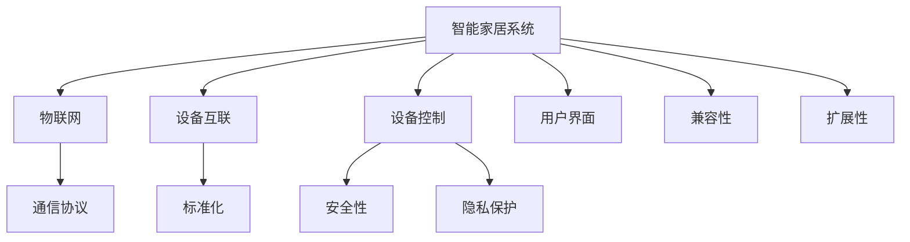

                 

# 智能家居系统：IoT设备的集成与控制

> 关键词：智能家居,物联网(IoT),设备集成,设备控制,通信协议,安全性,隐私保护

## 1. 背景介绍

### 1.1 问题由来

随着科技的进步和消费者需求的日益增长，智能家居系统正在成为现代生活的重要组成部分。智能家居系统通过物联网(IoT)技术，将家庭中的各种设备（如照明、温控、安防、娱乐等）进行集成和控制，提供便捷、舒适、安全的生活体验。但是，当前智能家居系统在设备集成和控制上仍存在诸多挑战。例如，不同设备之间数据格式不统一、通信协议不一致、控制接口复杂、隐私安全问题突出等，限制了系统的整体效率和用户体验。因此，如何高效集成和控制各类IoT设备，是大规模应用智能家居系统的关键。

### 1.2 问题核心关键点

为实现智能家居系统的设备集成和控制，必须解决以下核心问题：

- 设备互联的标准化：确保不同设备之间的数据和通信协议一致，避免数据孤岛和通信断层。
- 系统兼容性和扩展性：保证系统的灵活性和可扩展性，支持新设备的快速接入和旧设备的平滑更新。
- 用户界面和体验：设计直观易用的用户界面(UI)，提升用户的控制和交互体验。
- 安全性与隐私保护：确保系统的数据和隐私安全，防止信息泄露和恶意攻击。
- 系统稳定性和可靠性：通过冗余设计、故障检测和修复机制，保证系统的高可靠性和稳定性。

这些问题共同构成了智能家居系统设备集成与控制的复杂挑战，亟需通过技术创新和系统优化来解决。

## 2. 核心概念与联系

### 2.1 核心概念概述

为更好地理解智能家居系统设备集成与控制，本节将介绍几个密切相关的核心概念：

- 智能家居系统(Smart Home System)：通过物联网技术，将家庭中的各种设备互联，实现设备之间的互操作性，提升家居智能化水平。
- 物联网(IoT)：通过互联网将物品连接到计算机网络，实现设备的互联互通。
- 设备互联(Device Interconnection)：指将多个设备连接在一起，实现数据和服务的共享和互操作。
- 设备控制(Device Control)：指通过指令或程序实现对设备的自动化管理和调控。
- 通信协议(Communication Protocol)：指设备之间通信的规则和标准，保证数据交换的可靠性和一致性。
- 标准化(Standardization)：指为保证设备兼容性和互操作性，制定的统一标准和规范。
- 安全性(Security)：指保护智能家居系统中的数据和隐私，防止恶意攻击和信息泄露。
- 隐私保护(Privacy Protection)：指保护用户数据和隐私信息，避免被未授权访问和使用。
- 用户界面(UI)：指用户与智能家居系统交互的界面，设计良好的UI能提升用户体验。
- 兼容性(Compatibility)：指智能家居系统支持各类设备和协议的能力。
- 扩展性(Scalability)：指系统能够快速扩展和更新，支持新增设备和新功能。

这些概念之间的逻辑关系可以通过以下Mermaid流程图来展示：



这个流程图展示智能家居系统的核心概念及其之间的关系：

1. 智能家居系统通过物联网技术，将设备互联，实现设备之间的互操作性。
2. 设备控制通过通信协议和标准化，保证数据的可靠交换和设备的协同工作。
3. 安全性与隐私保护通过技术手段和政策法规，保护系统的数据和隐私信息。
4. 用户界面设计提升用户体验，保证系统的易用性。
5. 兼容性和扩展性通过系统的灵活设计，支持各类设备和协议的接入和更新。

这些概念共同构成了智能家居系统的设计框架，使其能够高效集成和控制各类IoT设备。

## 3. 核心算法原理 & 具体操作步骤
### 3.1 算法原理概述

智能家居系统设备集成与控制的核心算法包括标准化协议、数据交换、设备控制和用户界面设计等。其基本原理是通过统一的数据格式、通信协议和控制指令，实现各类设备的互联和协同工作。

具体来说，核心算法原理如下：

- **数据标准化**：将各类设备的数据格式统一化，如将传感器数据转换为标准化的JSON或XML格式。
- **通信协议标准化**：制定统一的通信协议规范，如MQTT、CoAP等，实现设备之间的可靠通信。
- **设备控制算法**：设计智能算法和控制策略，实现设备的自动化管理和调控，如自动调节室温、智能照明控制等。
- **用户界面设计**：开发直观易用的用户界面(UI)，方便用户对系统进行交互和控制。

### 3.2 算法步骤详解

智能家居系统设备集成与控制的一般步骤包括：

1. **设备选择与准备**：选择适合系统的各类IoT设备，如智能灯泡、温控器、摄像头等，并进行物理连接和初始化配置。
2. **标准化数据采集**：将设备的数据采集模块统一化为标准格式，如将传感器数据转换为JSON或XML格式。
3. **通信协议选择与配置**：选择适合系统的通信协议（如MQTT、CoAP等），并进行配置和连接。
4. **设备控制与智能化**：根据系统需求设计智能控制算法，实现设备的自动化管理和调控。
5. **用户界面设计**：开发直观易用的用户界面(UI)，提供控制、查询和监控功能。
6. **系统测试与优化**：进行系统测试，确保各组件的兼容性和稳定性，优化性能和用户体验。
7. **上线部署与维护**：将系统部署到实际环境中，进行持续监控和维护，及时修复问题和更新功能。

### 3.3 算法优缺点

智能家居系统设备集成与控制的优势包括：

- **提高设备兼容性**：统一的数据格式和通信协议，确保各类设备能够无缝集成。
- **简化系统维护**：标准化的数据和协议，便于系统的扩展和维护。
- **提升用户体验**：直观易用的用户界面(UI)，提升用户控制和交互体验。

同时，该方法也存在一些局限性：

- **标准化复杂**：需要协调和制定多种设备和协议的标准化方案，复杂度较高。
- **设备限制**：一些老旧设备可能不支持标准化协议，需要额外适配。
- **隐私风险**：系统的数据和隐私保护需要严格的技术措施和政策法规。

尽管存在这些局限性，但智能家居系统设备集成与控制的算法方法仍然是目前最为通用的解决方案，广泛应用于各类智能家居系统开发和应用中。

### 3.4 算法应用领域

智能家居系统设备集成与控制的方法，已经广泛应用于各类智能家居系统中，包括但不限于：

- 智能照明系统：通过智能灯泡、开关和传感器，实现灯光的自动调节和场景切换。
- 智能温控系统：通过智能温控器和传感器，实现房间温度的自动调节和节能管理。
- 智能安防系统：通过摄像头、门禁和传感器，实现家庭安全的实时监控和报警。
- 智能娱乐系统：通过智能音箱、电视和智能家居集成，实现娱乐设备的自动控制和多媒体内容推荐。
- 智能家电系统：通过智能洗衣机、冰箱和烤箱，实现家电的自动化管理和节能环保。

除了上述这些经典应用外，智能家居系统设备集成与控制的方法还广泛应用于智能家居设备的开发和应用中，为人们带来更加便捷、舒适和安全的居住环境。

## 4. 数学模型和公式 & 详细讲解  
### 4.1 数学模型构建

在智能家居系统中，设备之间需要通过标准化的数据格式和通信协议进行数据交换。数学模型通常用于描述设备数据和通信协议的标准化过程。

假设有$N$个IoT设备，每个设备的数据采集和发送模块可以表示为$D_n=\{d_{n1}, d_{n2}, ..., d_{nn}\}$，其中$d_{ni}$为设备$n$的第$i$个传感器的数据。设备之间的通信协议可以表示为$P=(p_1, p_2, ..., p_M)$，其中$p_m$为第$m$个通信协议。

设备集成与控制的数据标准化过程可以表示为：

$$
D_{std} = \{D_{nstd} | n=1,2,...,N\}
$$

其中$D_{nstd}$为设备$n$的标准化数据格式。通信协议的标准化过程可以表示为：

$$
P_{std} = \{p_{mstd} | m=1,2,...,M\}
$$

其中$p_{mstd}$为标准化后的通信协议。

设备控制算法可以表示为：

$$
C = \{c_n | n=1,2,...,N\}
$$

其中$c_n$为设备$n$的控制算法。

用户界面设计可以表示为：

$$
UI = \{ui_n | n=1,2,...,N\}
$$

其中$ui_n$为设备$n$的用户界面设计。

### 4.2 公式推导过程

以智能照明系统为例，推导数据标准化和通信协议标准化的公式。

假设智能灯泡的数据采集模块输出为$D_{bulb}=\{d_{bulb1}, d_{bulb2}, ..., d_{bulb3}\}$，其中$d_{bulb1}$为亮度，$d_{bulb2}$为颜色，$d_{bulb3}$为状态。

标准化后的数据格式可以表示为：

$$
D_{bulbstd} = \{(b_{bulb}, c_{bulb}, s_{bulb}) | b_{bulb} \in [0,1], c_{bulb} \in [0,1], s_{bulb} \in \{0,1\}\}
$$

其中$b_{bulb}$表示亮度，$c_{bulb}$表示颜色，$s_{bulb}$表示状态（0为关闭，1为开启）。

通信协议的标准化可以表示为：

$$
P_{std} = \{MQTT, CoAP\}
$$

其中MQTT和CoAP为常见的物联网通信协议。

### 4.3 案例分析与讲解

以智能温控系统为例，分析数据标准化和通信协议标准化的实际应用。

假设智能温控器的数据采集模块输出为$D_{thermostat}=\{d_{thermostat1}, d_{thermostat2}, ..., d_{thermostat4}\}$，其中$d_{thermostat1}$为当前温度，$d_{thermostat2}$为设定温度，$d_{thermostat3}$为状态，$d_{thermostat4}$为模式。

标准化后的数据格式可以表示为：

$$
D_{thermostatstd} = \{(t_{thermostat}, t_{thermostatset}, s_{thermostat}, m_{thermostat}) | t_{thermostat} \in [0,100], t_{thermostatset} \in [0,100], s_{thermostat} \in \{0,1\}, m_{thermostat} \in \{0,1\}\}
$$

其中$t_{thermostat}$表示当前温度，$t_{thermostatset}$表示设定温度，$s_{thermostat}$表示状态（0为关闭，1为开启），$m_{thermostat}$表示模式（0为普通模式，1为节能模式）。

通信协议的标准化可以表示为：

$$
P_{std} = \{MQTT, CoAP\}
$$

其中MQTT和CoAP为常见的物联网通信协议。

## 5. 项目实践：代码实例和详细解释说明
### 5.1 开发环境搭建

在进行智能家居系统开发前，需要准备好开发环境。以下是使用Python进行IoT开发的开发环境配置流程：

1. 安装Python：从官网下载并安装Python，为开发提供必要的编程语言环境。
2. 安装相关的IoT库和框架：如paho-mqtt、numpy、pandas等。
3. 安装MySQL或PostgreSQL：用于存储和管理系统数据。
4. 配置开发环境：设置开发项目的目录结构、依赖库和开发工具。

完成上述步骤后，即可在开发环境中开始智能家居系统的开发。

### 5.2 源代码详细实现

下面以智能照明系统为例，给出使用MQTT协议的Python代码实现。

```python
import paho.mqtt.client as mqtt

# 创建MQTT客户端
client = mqtt.Client()

# 连接MQTT服务器
client.connect('broker.example.com', 1883, 60)

# 订阅主题
client.subscribe('lighting/control')

# 发布控制指令
def on_connect(client, userdata, flags, rc):
    print('Connected to broker with result code %d' % rc)

def on_message(client, userdata, message):
    topic = message.topic
    payload = str(message.payload.decode())
    print('Received message from topic: %s' % topic)
    print('Payload: %s' % payload)

# 设置消息处理回调函数
client.on_connect = on_connect
client.on_message = on_message

# 启动订阅和发布
client.loop_start()
```

这段代码创建了MQTT客户端，连接到MQTT服务器，订阅了主题“lighting/control”，并设置了消息处理回调函数。当收到控制指令时，可以通过控制指令来控制智能灯泡的状态。

### 5.3 代码解读与分析

让我们再详细解读一下关键代码的实现细节：

**MQTT客户端**：
- 创建MQTT客户端，使用paho-mqtt库。
- 连接MQTT服务器，使用broker.example.com作为服务器地址，端口号为1883，超时时间为60秒。
- 订阅主题，使用“lighting/control”主题。
- 发布控制指令，使用on_connect回调函数和on_message回调函数。

**消息处理回调函数**：
- 当连接成功时，触发on_connect回调函数，打印连接结果代码。
- 当收到消息时，触发on_message回调函数，打印消息主题和负载内容。

**启动订阅和发布**：
- 启动MQTT客户端的订阅和发布功能，使用loop_start方法。

通过上述代码，可以简单实现智能照明系统的数据标准化和通信协议标准化。当然，实际应用中还需要进一步开发设备控制算法和用户界面，并进行系统测试和优化。

## 6. 实际应用场景
### 6.1 智能照明系统

智能照明系统通过智能灯泡、开关和传感器，实现灯光的自动调节和场景切换。具体实现包括：

- 数据标准化：将智能灯泡的数据采集模块输出标准化为亮度、颜色和状态三个字段。
- 通信协议标准化：使用MQTT协议进行通信。
- 设备控制算法：设计智能算法，根据时间和场景自动调节灯光亮度和颜色。
- 用户界面设计：开发用户界面(UI)，提供灯光控制、场景设置和节能管理等功能。

智能照明系统的实际应用场景包括：

- 家庭环境：实现房间灯光的自动化调节，如根据时间自动调节灯光亮度，根据场景切换灯光颜色。
- 商业环境：实现商店灯光的节能管理，根据客流量自动调节灯光亮度，提升能源效率。

### 6.2 智能温控系统

智能温控系统通过智能温控器和传感器，实现房间温度的自动调节和节能管理。具体实现包括：

- 数据标准化：将智能温控器的数据采集模块输出标准化为当前温度、设定温度、状态和模式四个字段。
- 通信协议标准化：使用MQTT协议进行通信。
- 设备控制算法：设计智能算法，根据温度和时间自动调节房间温度。
- 用户界面设计：开发用户界面(UI)，提供温度调节、模式设置和节能管理等功能。

智能温控系统的实际应用场景包括：

- 家庭环境：实现房间温度的自动化调节，如根据时间和季节自动调节温度，提升居住舒适度。
- 商业环境：实现办公室温度的节能管理，根据人员流动自动调节温度，提升办公效率和能源利用率。

### 6.3 智能安防系统

智能安防系统通过摄像头、门禁和传感器，实现家庭安全的实时监控和报警。具体实现包括：

- 数据标准化：将摄像头和传感器的数据采集模块输出标准化为状态和模式两个字段。
- 通信协议标准化：使用MQTT协议进行通信。
- 设备控制算法：设计智能算法，根据异常行为触发报警和联动。
- 用户界面设计：开发用户界面(UI)，提供实时监控、报警提醒和联动设置等功能。

智能安防系统的实际应用场景包括：

- 家庭环境：实现家庭安全的实时监控和报警，如检测入侵触发报警，联动摄像头和警报器。
- 商业环境：实现办公室和仓库的安全监控，如检测异常行为触发报警，联动保安和警报系统。

### 6.4 未来应用展望

随着物联网技术的发展，智能家居系统将进一步普及和应用。未来，智能家居系统设备集成与控制的方法将面临以下几个发展趋势：

- 智能化程度提升：智能家居系统将进一步集成更多智能设备，提升系统的智能化水平。
- 互联互通增强：智能家居系统将支持更多设备和协议，实现设备之间的互联互通。
- 用户界面优化：智能家居系统将提供更加直观易用的用户界面(UI)，提升用户体验。
- 安全性保障：智能家居系统将加强数据和隐私保护，防止信息泄露和恶意攻击。
- 环境适应性增强：智能家居系统将支持更多环境和场景，提升系统的兼容性和扩展性。

## 7. 工具和资源推荐
### 7.1 学习资源推荐

为了帮助开发者系统掌握智能家居系统的开发和应用，这里推荐一些优质的学习资源：

1. MQTT官方文档：详细介绍了MQTT协议的原理、应用场景和开发实践，是MQTT开发的重要参考。
2. Home Assistant文档：Home Assistant是一款开源的智能家居系统，提供了丰富的插件和开发文档，方便开发者快速上手。
3. Python IoT编程教程：通过Python开发IoT设备，介绍MQTT、CoAP等协议的开发实践。
4. Openhome文档：Openhome是一款智能家居控制系统，提供了丰富的开发接口和文档，方便开发者开发应用。
5. Raspberry Pi开发指南：基于Raspberry Pi开发智能家居系统，介绍硬件和软件开发。

通过对这些资源的学习实践，相信你一定能够快速掌握智能家居系统的开发方法和应用场景。

### 7.2 开发工具推荐

高效的开发离不开优秀的工具支持。以下是几款用于智能家居系统开发的常用工具：

1. Python：一种强大的编程语言，适合快速迭代研究。
2. MQTT：一种轻量级的通信协议，适用于物联网设备的互联互通。
3. Home Assistant：一款开源的智能家居系统，提供丰富的插件和开发文档。
4. Openhome：一款智能家居控制系统，提供丰富的开发接口和文档。
5. Raspberry Pi：一款小巧的硬件平台，适合物联网设备的开发和部署。

合理利用这些工具，可以显著提升智能家居系统开发和应用的效率，加快创新迭代的步伐。

### 7.3 相关论文推荐

智能家居系统设备集成与控制的研究源于学界的持续研究。以下是几篇奠基性的相关论文，推荐阅读：

1. Smart Home IoT Systems: A Survey：综述了智能家居系统的研究进展和应用场景。
2. An Energy-Efficient Smart Home System：介绍了一种基于IoT的智能家居系统，提出了数据标准化和通信协议标准化的实现方法。
3. A Survey on the Architectures of Smart Home Systems：综述了智能家居系统的体系结构和实现方法。
4. An Energy-Efficient Smart Home Control System：介绍了一种基于物联网技术的智能家居系统，提出了设备控制算法的实现方法。
5. A Comparative Study of IoT Protocols for Smart Home Systems：对比了各类物联网协议在智能家居系统中的应用，提出了数据标准化和通信协议标准化的实现方法。

这些论文代表了大规模应用智能家居系统的研究脉络。通过学习这些前沿成果，可以帮助研究者把握学科前进方向，激发更多的创新灵感。

## 8. 总结：未来发展趋势与挑战
### 8.1 研究成果总结

本文对智能家居系统设备集成与控制的原理和方法进行了全面系统的介绍。首先阐述了智能家居系统设备集成与控制的挑战和需求，明确了微调在提升智能家居系统性能、用户体验和安全性方面的独特价值。其次，从原理到实践，详细讲解了智能家居系统设备集成与控制的数学模型、通信协议、设备控制和用户界面设计等关键环节，给出了智能家居系统开发的完整代码实例。同时，本文还广泛探讨了智能家居系统在智能照明、智能温控、智能安防等诸多场景中的应用前景，展示了智能家居系统设备集成与控制的技术潜力。

通过本文的系统梳理，可以看到，智能家居系统设备集成与控制方法正在成为智能家居系统的重要范式，极大地拓展了IoT设备的应用边界，催生了更多的落地场景。受益于物联网技术和微调方法的持续演进，智能家居系统必将在未来智能家居系统中扮演越来越重要的角色。

### 8.2 未来发展趋势

展望未来，智能家居系统设备集成与控制技术将呈现以下几个发展趋势：

- 设备互联和互操作性提升：随着物联网技术的进步，智能家居系统将支持更多设备和协议，实现设备之间的互联互通。
- 设备智能化和自动化提升：智能家居系统将集成更多智能设备，提升系统的智能化水平，实现更多自动化控制。
- 用户界面和交互优化：智能家居系统将提供更加直观易用的用户界面(UI)，提升用户体验。
- 数据和隐私保护增强：智能家居系统将加强数据和隐私保护，防止信息泄露和恶意攻击。
- 环境适应性和兼容性增强：智能家居系统将支持更多环境和场景，提升系统的兼容性和扩展性。

以上趋势凸显了智能家居系统设备集成与控制技术的广阔前景。这些方向的探索发展，必将进一步提升智能家居系统的性能和应用范围，为人类认知智能的进化带来深远影响。

### 8.3 面临的挑战

尽管智能家居系统设备集成与控制技术已经取得了显著进展，但在迈向更加智能化、普适化应用的过程中，它仍面临诸多挑战：

- 设备标准化难度：不同设备之间的数据格式和通信协议多样性，增加了设备标准化的复杂性。
- 设备互联互操作性问题：不同设备之间的数据兼容性和互操作性仍然存在瓶颈。
- 数据和隐私安全风险：智能家居系统需要保护用户数据和隐私，防止信息泄露和恶意攻击。
- 系统复杂性和扩展性：智能家居系统需要支持更多设备和协议，增加了系统的复杂性和扩展性。

尽管存在这些挑战，但通过持续的技术创新和系统优化，智能家居系统设备集成与控制技术将继续发展，为构建更加智能、安全、可靠的家庭环境提供有力支撑。

### 8.4 研究展望

面对智能家居系统设备集成与控制所面临的种种挑战，未来的研究需要在以下几个方面寻求新的突破：

- 探索标准化协议和数据格式：进一步制定和推广统一的通信协议和数据格式，降低设备互联的复杂性。
- 研究智能算法和控制策略：设计更加智能的算法和控制策略，提升系统的自动化和智能化水平。
- 引入更多先验知识和规则：将符号化的先验知识，如知识图谱、逻辑规则等，与神经网络模型进行融合，提升系统的推理能力和稳定性。
- 引入更多多模态数据：将视觉、语音、环境等多模态数据与文本数据结合，提升系统的感知能力和智能化水平。
- 加强数据和隐私保护：通过技术手段和政策法规，加强智能家居系统的数据和隐私保护，防止信息泄露和恶意攻击。
- 提升系统灵活性和可扩展性：设计更加灵活和可扩展的系统架构，支持更多设备和协议的接入和更新。

这些研究方向的发展，必将进一步推动智能家居系统的技术进步和应用普及，为构建更智能、更安全、更舒适的家庭环境提供有力支撑。

## 9. 附录：常见问题与解答

**Q1：智能家居系统设备集成与控制的难点是什么？**

A: 智能家居系统设备集成与控制的难点主要包括：

- 设备标准化难度：不同设备之间的数据格式和通信协议多样性，增加了设备标准化的复杂性。
- 设备互联互操作性问题：不同设备之间的数据兼容性和互操作性仍然存在瓶颈。
- 数据和隐私安全风险：智能家居系统需要保护用户数据和隐私，防止信息泄露和恶意攻击。
- 系统复杂性和扩展性：智能家居系统需要支持更多设备和协议，增加了系统的复杂性和扩展性。

**Q2：如何选择适合智能家居系统的通信协议？**

A: 智能家居系统的通信协议选择应考虑以下几个因素：

- 数据传输速度和可靠性：需要选择速度较快、可靠性高的协议，如MQTT、CoAP等。
- 设备兼容性：选择能够支持更多设备和协议的通信协议，如MQTT支持多种设备和平台。
- 网络环境适应性：选择能够适应不同网络环境的协议，如MQTT适用于广域网，CoAP适用于局域网。

**Q3：智能家居系统的用户界面设计需要注意哪些方面？**

A: 智能家居系统的用户界面设计应考虑以下几个方面：

- 简洁易用：界面设计应简洁易用，方便用户进行操作和控制。
- 数据可视化：界面应支持数据可视化，帮助用户更好地理解系统状态和控制效果。
- 交互友好：界面应支持友好的交互方式，如语音控制、手势控制等。
- 多设备适配：界面应支持多设备适配，支持不同设备和平台的用户使用。

**Q4：智能家居系统的安全性与隐私保护措施有哪些？**

A: 智能家居系统的安全性与隐私保护措施包括：

- 数据加密：对传输和存储的数据进行加密，防止信息泄露。
- 访问控制：设置严格的访问控制机制，确保只有授权用户才能访问系统。
- 安全协议：采用安全协议，如SSL/TLS，确保数据传输的安全性。
- 异常检测：设置异常检测机制，及时发现并防范恶意攻击。
- 定期更新：定期更新系统和固件，修复已知的安全漏洞。

**Q5：智能家居系统的扩展性和兼容性如何实现？**

A: 智能家居系统的扩展性和兼容性实现应考虑以下几个方面：

- 模块化设计：系统设计应采用模块化架构，方便新增设备和协议的接入。
- 标准接口：系统应提供标准化的接口和API，支持各类设备和协议的接入。
- 动态配置：系统应支持动态配置，根据实际需求进行扩展和更新。

这些措施可以提升智能家居系统的扩展性和兼容性，满足不断变化的用户需求和技术要求。

