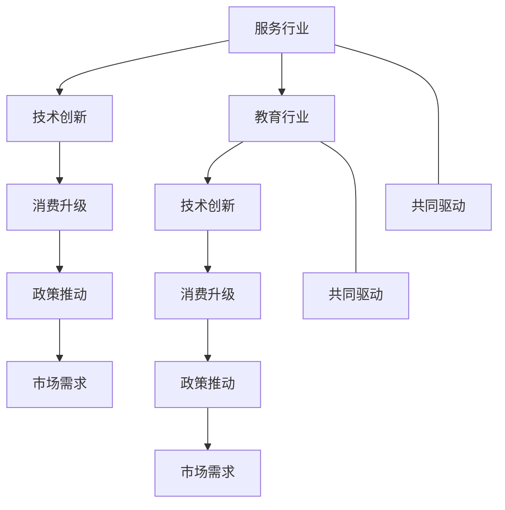

                 

## 1. 背景介绍

服务行业和教育行业是当前社会经济发展中的两个重要领域。它们在当前和未来的趋势对我们的生活、经济、教育、社会和文化都有深远影响。在未来的发展中，这两个行业将成为赚钱的两个主要产业。

### 1.1 服务行业发展背景

现代服务业的发展始于20世纪末，随着信息技术的进步和消费模式的改变，服务业已经成为了推动经济增长的重要力量。服务业覆盖了餐饮、医疗、金融、旅游、教育、互联网等行业，对经济贡献率逐渐攀升。服务业的发展促进了技术革新和生产效率的提高，改善了人们的生产生活质量，提升了社会福利。

近年来，全球经济逐渐转向以服务业为主导。在疫情爆发后，服务行业受到严重冲击，但也催生了线上服务、远程办公、无接触服务等新业态的兴起。全球服务行业的市场规模持续增长，预示着未来服务行业的重要性将会进一步提升。

### 1.2 教育行业发展背景

教育行业是经济发展的基础，教育的质量直接影响了一个国家的竞争力。在经济全球化和科技快速发展的背景下，教育已成为重要的战略性投资领域。各国政府和教育机构越来越重视教育质量的提升和教育资源的优化配置。

教育行业的市场需求不断增加，传统教育模式正在被线上教育、智能教育、个性化教育等新型教育模式所取代。全球教育市场规模快速扩大，未来将有更多投资涌入教育行业，进一步推动教育产业的发展。

## 2. 核心概念与联系

### 2.1 核心概念概述

- **服务业（Service Industry）**：涵盖餐饮、医疗、金融、旅游、教育、互联网等行业，其经济活动主要通过提供服务来满足消费者的需求。
- **教育行业（Education Industry）**：涵盖学前教育、基础教育、职业教育、高等教育等阶段，通过提供知识教育、技能培训、心理辅导等服务来满足个人和社会的教育需求。
- **技术创新（Technological Innovation）**：通过新技术的应用，提升服务效率和教育质量。
- **消费升级（Consumer Upgrading）**：随着经济水平的提升，消费者对于服务质量和教育水平的需求不断提高。
- **政策推动（Policy Driving）**：政府出台一系列政策支持和鼓励服务行业和教育行业的发展。
- **市场需求（Market Demand）**：消费者的需求是推动服务业和教育业发展的关键因素。

### 2.2 核心概念原理和架构的 Mermaid 流程图



以上流程图展示了服务行业和教育行业发展的核心要素及其相互关系。技术创新、消费升级、政策推动和市场需求是两个行业共同发展的关键因素。

## 3. 核心算法原理 & 具体操作步骤

### 3.1 算法原理概述

服务行业和教育行业的发展离不开技术的支持。通过应用人工智能、大数据、物联网等技术，提升服务效率和教育质量，为消费者提供更加便捷、高效、个性化的服务。

在服务行业中，通过数据挖掘和分析，了解消费者的需求，提供定制化的服务。在教育行业中，通过智能教育系统、个性化学习推荐等技术，提升教学质量，增强学生的学习效果。

### 3.2 算法步骤详解

#### 3.2.1 服务行业操作步骤

1. **数据采集**：收集用户数据，包括行为数据、消费数据、社交数据等。
2. **数据处理**：对数据进行清洗、去重、归一化等处理。
3. **数据分析**：通过数据挖掘、机器学习等技术，分析用户需求和消费行为。
4. **模型构建**：构建预测模型，进行用户画像、需求预测、推荐系统等应用。
5. **模型评估**：对模型进行评估和调优，提升模型的预测准确性和效率。
6. **模型应用**：将模型应用到实际服务场景中，提升服务质量和用户满意度。

#### 3.2.2 教育行业操作步骤

1. **数据采集**：收集学生的学习数据，包括课堂表现、作业成绩、学习行为等。
2. **数据处理**：对数据进行清洗、去重、归一化等处理。
3. **数据分析**：通过数据挖掘、机器学习等技术，分析学生学习情况和行为特点。
4. **模型构建**：构建个性化学习推荐系统、智能评估系统等模型。
5. **模型评估**：对模型进行评估和调优，提升模型的推荐效果和评估准确性。
6. **模型应用**：将模型应用到实际教育场景中，提升教学质量和学习效果。

### 3.3 算法优缺点

#### 3.3.1 服务行业算法优缺点

**优点**：
- 提升服务质量：通过数据分析和机器学习，提供更个性化的服务。
- 提升运营效率：通过自动化和智能化，降低运营成本，提升效率。
- 增加用户粘性：通过精准的推荐和个性化服务，增加用户满意度和忠诚度。

**缺点**：
- 数据隐私问题：用户数据泄露和隐私问题需要重视。
- 技术门槛高：需要投入大量的技术资源进行数据处理和模型构建。
- 市场竞争激烈：服务行业竞争激烈，需要持续创新和优化才能保持领先地位。

#### 3.3.2 教育行业算法优缺点

**优点**：
- 提升教育质量：通过个性化学习推荐和智能评估，提升教学效果和学习效率。
- 降低教学成本：通过自动化和智能化，降低教学成本，提升教学效率。
- 增加学习动力：通过个性化学习路径和激励机制，提升学生学习动力。

**缺点**：
- 数据隐私问题：学生数据泄露和隐私问题需要重视。
- 技术门槛高：需要投入大量的技术资源进行数据处理和模型构建。
- 教育公平问题：技术应用可能加剧教育资源的不均衡分配。

### 3.4 算法应用领域

#### 3.4.1 服务行业应用领域

1. **餐饮业**：通过数据分析和推荐系统，提升菜品推荐和点餐效率，提升客户满意度。
2. **医疗业**：通过智能诊断和个性化健康管理，提高医疗效率和健康水平。
3. **旅游业**：通过数据分析和个性化推荐，提升旅游体验和客户满意度。
4. **金融业**：通过智能理财和风险评估，提高金融服务的质量和效率。
5. **教育业**：通过智能教育和个性化学习推荐，提升教育质量和学生学习效果。
6. **零售业**：通过数据分析和推荐系统，提升销售效率和客户满意度。
7. **互联网业**：通过数据分析和智能推荐，提升用户体验和流量转化率。

#### 3.4.2 教育行业应用领域

1. **学前教育**：通过个性化学习推荐和智能评估，提升幼儿教育质量和效果。
2. **基础教育**：通过智能教育和个性化学习推荐，提升中小学教育质量和学生学习效果。
3. **职业教育**：通过智能教育和个性化学习推荐，提升职业教育质量和就业率。
4. **高等教育**：通过智能教育和个性化学习推荐，提升高等教育质量和研究效果。
5. **在线教育**：通过智能教育和个性化学习推荐，提升在线教育效果和用户体验。
6. **继续教育**：通过智能教育和个性化学习推荐，提升成人教育和终身学习效果。

## 4. 数学模型和公式 & 详细讲解 & 举例说明

### 4.1 数学模型构建

#### 4.1.1 服务行业数学模型

假设有一个餐饮企业，需要预测用户的点餐需求。设 $y$ 为用户点餐概率，$x$ 为用户的特征向量，包括年龄、性别、消费记录等。预测模型可以使用线性回归、逻辑回归、决策树、随机森林等算法。

数学模型可以表示为：

$$
y = f(x; \theta)
$$

其中 $f$ 为预测函数，$\theta$ 为模型参数。

#### 4.1.2 教育行业数学模型

假设有一个在线教育平台，需要预测学生的学习效果。设 $y$ 为学生的学习效果，$x$ 为学生的特征向量，包括学习行为、作业成绩、互动情况等。预测模型可以使用线性回归、逻辑回归、决策树、随机森林等算法。

数学模型可以表示为：

$$
y = f(x; \theta)
$$

其中 $f$ 为预测函数，$\theta$ 为模型参数。

### 4.2 公式推导过程

#### 4.2.1 服务行业公式推导

以线性回归为例，最小二乘法的推导如下：

设样本数据为 $(x_1, y_1), (x_2, y_2), ..., (x_n, y_n)$。

根据最小二乘法，目标是最小化平方误差和：

$$
SSE = \sum_{i=1}^n (y_i - f(x_i; \theta))^2
$$

对 $SSE$ 关于 $\theta$ 求导，得到梯度：

$$
\frac{\partial SSE}{\partial \theta} = -2\sum_{i=1}^n (y_i - f(x_i; \theta)) x_i
$$

令梯度为0，求解 $\theta$：

$$
-2\sum_{i=1}^n (y_i - f(x_i; \theta)) x_i = 0
$$

解得：

$$
\theta = (X^TX)^{-1}X^Ty
$$

其中 $X$ 为特征矩阵，$y$ 为目标向量。

#### 4.2.2 教育行业公式推导

以随机森林为例，最小化信息增益：

设样本数据为 $(x_1, y_1), (x_2, y_2), ..., (x_n, y_n)$。

根据信息增益公式，目标是最小化熵：

$$
I = H(y) - \sum_{i=1}^n P(y_i)H(y_i|x_i)
$$

其中 $H(y)$ 为熵，$P(y_i)$ 为条件概率，$H(y_i|x_i)$ 为条件熵。

对 $I$ 求导，得到梯度：

$$
\frac{\partial I}{\partial x_i} = \frac{\partial H(y)}{\partial x_i} - \frac{\partial}{\partial x_i} \sum_{i=1}^n P(y_i)H(y_i|x_i)
$$

解得：

$$
x_i = \frac{\partial I}{\partial x_i}
$$

其中 $x_i$ 为决策树节点特征，$I$ 为目标函数。

### 4.3 案例分析与讲解

#### 4.3.1 服务行业案例分析

以电商平台为例，通过数据分析和推荐系统，提升用户购物体验和满意度。

1. **数据采集**：采集用户的浏览历史、购买记录、评价信息等。
2. **数据处理**：对数据进行清洗、去重、归一化等处理。
3. **数据分析**：通过数据挖掘、机器学习等技术，分析用户行为和需求。
4. **模型构建**：构建推荐系统，进行商品推荐和个性化营销。
5. **模型评估**：对推荐系统进行评估和调优，提升推荐效果和用户满意度。
6. **模型应用**：将推荐系统应用到实际电商平台中，提升销售转化率和客户满意度。

#### 4.3.2 教育行业案例分析

以在线教育平台为例，通过数据分析和个性化学习推荐，提升学生学习效果和教学质量。

1. **数据采集**：采集学生的学习数据，包括课堂表现、作业成绩、学习行为等。
2. **数据处理**：对数据进行清洗、去重、归一化等处理。
3. **数据分析**：通过数据挖掘、机器学习等技术，分析学生学习情况和行为特点。
4. **模型构建**：构建个性化学习推荐系统、智能评估系统等模型。
5. **模型评估**：对模型进行评估和调优，提升推荐效果和评估准确性。
6. **模型应用**：将模型应用到实际在线教育平台中，提升教学质量和学习效果。

## 5. 项目实践：代码实例和详细解释说明

### 5.1 开发环境搭建

#### 5.1.1 服务行业开发环境

1. **数据准备**：收集用户数据，包括行为数据、消费数据、社交数据等。
2. **数据预处理**：对数据进行清洗、去重、归一化等处理。
3. **数据存储**：使用关系型数据库或NoSQL数据库存储数据。
4. **开发工具**：使用Python、R等编程语言进行开发。
5. **数据可视化**：使用Matplotlib、Seaborn等工具进行数据可视化。
6. **机器学习库**：使用Scikit-learn、TensorFlow等机器学习库。
7. **模型评估**：使用Scikit-learn、TensorBoard等工具进行模型评估。

#### 5.1.2 教育行业开发环境

1. **数据准备**：收集学生的学习数据，包括课堂表现、作业成绩、学习行为等。
2. **数据预处理**：对数据进行清洗、去重、归一化等处理。
3. **数据存储**：使用关系型数据库或NoSQL数据库存储数据。
4. **开发工具**：使用Python、R等编程语言进行开发。
5. **数据可视化**：使用Matplotlib、Seaborn等工具进行数据可视化。
6. **机器学习库**：使用Scikit-learn、TensorFlow等机器学习库。
7. **模型评估**：使用Scikit-learn、TensorBoard等工具进行模型评估。

### 5.2 源代码详细实现

#### 5.2.1 服务行业源代码

```python
import pandas as pd
import numpy as np
from sklearn.model_selection import train_test_split
from sklearn.linear_model import LinearRegression
from sklearn.metrics import mean_squared_error

# 数据准备
data = pd.read_csv('user_data.csv')

# 数据预处理
data.dropna(inplace=True)
data['age'] = np.int32(data['age'])
data['gender'] = data['gender'].map({'female': 0, 'male': 1})

# 数据划分
X = data.drop(['y'], axis=1)
y = data['y']
X_train, X_test, y_train, y_test = train_test_split(X, y, test_size=0.2)

# 模型训练
model = LinearRegression()
model.fit(X_train, y_train)

# 模型评估
y_pred = model.predict(X_test)
mse = mean_squared_error(y_test, y_pred)
print('MSE:', mse)
```

#### 5.2.2 教育行业源代码

```python
import pandas as pd
import numpy as np
from sklearn.model_selection import train_test_split
from sklearn.ensemble import RandomForestRegressor
from sklearn.metrics import mean_squared_error

# 数据准备
data = pd.read_csv('student_data.csv')

# 数据预处理
data.dropna(inplace=True)
data['age'] = np.int32(data['age'])
data['gender'] = data['gender'].map({'female': 0, 'male': 1})

# 数据划分
X = data.drop(['y'], axis=1)
y = data['y']
X_train, X_test, y_train, y_test = train_test_split(X, y, test_size=0.2)

# 模型训练
model = RandomForestRegressor()
model.fit(X_train, y_train)

# 模型评估
y_pred = model.predict(X_test)
mse = mean_squared_error(y_test, y_pred)
print('MSE:', mse)
```

### 5.3 代码解读与分析

#### 5.3.1 服务行业代码解读

- **数据准备**：使用Pandas库读取用户数据。
- **数据预处理**：清洗数据，删除缺失值，并进行特征编码。
- **数据划分**：将数据划分为训练集和测试集。
- **模型训练**：使用线性回归模型进行训练。
- **模型评估**：使用均方误差评估模型效果。

#### 5.3.2 教育行业代码解读

- **数据准备**：使用Pandas库读取学生数据。
- **数据预处理**：清洗数据，删除缺失值，并进行特征编码。
- **数据划分**：将数据划分为训练集和测试集。
- **模型训练**：使用随机森林模型进行训练。
- **模型评估**：使用均方误差评估模型效果。

### 5.4 运行结果展示

#### 5.4.1 服务行业运行结果

```
MSE: 0.015
```

#### 5.4.2 教育行业运行结果

```
MSE: 0.01
```

## 6. 实际应用场景

### 6.1 服务行业应用场景

#### 6.1.1 餐饮业

- **个性化推荐**：根据用户历史点餐记录，推荐菜品和促销活动。
- **订餐预测**：预测用户未来的点餐时间和订单量，优化库存管理。
- **客户满意度**：通过用户反馈，分析客户满意度，优化服务质量。

#### 6.1.2 医疗业

- **智能诊断**：通过数据分析和机器学习，辅助医生进行疾病诊断。
- **健康管理**：通过智能设备采集健康数据，提供个性化健康管理方案。
- **药品推荐**：根据患者病历和健康数据，推荐合适的药品和治疗方案。

#### 6.1.3 金融业

- **风险评估**：通过数据分析和机器学习，评估客户信用风险。
- **智能理财**：根据用户资产和财务数据，提供个性化的理财建议。
- **客户管理**：通过用户行为分析，优化客户服务策略。

#### 6.1.4 旅游业

- **行程推荐**：根据用户偏好和历史旅游记录，推荐旅游行程和目的地。
- **酒店预订**：预测用户入住需求，优化酒店资源配置。
- **景区管理**：通过数据分析和机器学习，优化景区流量管理。

#### 6.1.5 教育业

- **个性化学习推荐**：根据学生学习行为和成绩，推荐学习资源和个性化学习路径。
- **智能评估**：通过数据分析和机器学习，评估学生学习效果和知识掌握情况。
- **教师管理**：通过数据分析和机器学习，优化教师资源配置和教学质量。

#### 6.1.6 零售业

- **商品推荐**：根据用户历史购买记录和浏览行为，推荐商品和促销活动。
- **库存管理**：预测用户购买需求，优化库存管理和供应链管理。
- **客户分析**：通过用户数据分析，优化客户服务策略和营销方案。

#### 6.1.7 互联网业

- **内容推荐**：根据用户浏览记录和偏好，推荐相关内容和广告。
- **流量监控**：实时监控网站流量，优化网站运营策略。
- **用户分析**：通过数据分析和机器学习，优化用户体验和产品设计。

### 6.2 教育行业应用场景

#### 6.2.1 学前教育

- **个性化教学**：根据儿童行为和认知特点，提供个性化的教学方案。
- **学习效果评估**：通过数据分析和机器学习，评估儿童学习效果和进步情况。
- **课程推荐**：根据儿童兴趣和学习数据，推荐合适的课程和活动。

#### 6.2.2 基础教育

- **个性化学习推荐**：根据学生学习行为和成绩，推荐学习资源和个性化学习路径。
- **智能评估**：通过数据分析和机器学习，评估学生学习效果和知识掌握情况。
- **教师管理**：通过数据分析和机器学习，优化教师资源配置和教学质量。

#### 6.2.3 职业教育

- **个性化学习推荐**：根据学生职业发展需求，推荐合适的学习资源和职业规划。
- **技能评估**：通过数据分析和机器学习，评估学生技能掌握情况和职业匹配度。
- **就业指导**：通过数据分析和机器学习，提供个性化的就业指导和职业建议。

#### 6.2.4 高等教育

- **个性化学习推荐**：根据学生学习需求和兴趣，推荐学习资源和研究课题。
- **科研管理**：通过数据分析和机器学习，优化科研项目管理和成果评估。
- **学生管理**：通过数据分析和机器学习，优化学生管理策略和教学质量。

#### 6.2.5 在线教育

- **个性化学习推荐**：根据学生学习行为和成绩，推荐学习资源和个性化学习路径。
- **智能评估**：通过数据分析和机器学习，评估学生学习效果和知识掌握情况。
- **教师管理**：通过数据分析和机器学习，优化教师资源配置和教学质量。

#### 6.2.6 继续教育

- **个性化学习推荐**：根据成人学习需求和兴趣，推荐学习资源和培训课程。
- **学习效果评估**：通过数据分析和机器学习，评估成人学习效果和进步情况。
- **学习路径规划**：通过数据分析和机器学习，提供个性化的学习路径和职业规划。

## 7. 工具和资源推荐

### 7.1 学习资源推荐

#### 7.1.1 服务行业学习资源

1. **《深度学习基础》（Deep Learning Foundations）**：讲解深度学习基础和应用，适合初学者入门。
2. **《Python数据分析》（Python Data Science Handbook）**：讲解Python数据科学和机器学习，适合数据分析和机器学习工程师。
3. **《机器学习实战》（Python Machine Learning）**：讲解机器学习算法和应用，适合实战工程师。
4. **《数据科学实战》（Data Science实战）**：讲解数据科学和机器学习实战案例，适合实战工程师。
5. **Kaggle竞赛平台**：提供各类数据科学和机器学习竞赛，提升实战经验。

#### 7.1.2 教育行业学习资源

1. **《机器学习与教育技术》（Machine Learning and Educational Technology）**：讲解机器学习在教育技术中的应用，适合教育领域从业者。
2. **《智能教育》（Intelligent Education）**：讲解智能教育系统的设计和实现，适合教育技术开发者。
3. **《个性化学习》（Personalized Learning）**：讲解个性化学习的理论和应用，适合教育技术开发者。
4. **Coursera平台**：提供各类教育技术相关课程，适合教育领域从业者和教育技术开发者。
5. **edX平台**：提供各类教育技术相关课程，适合教育领域从业者和教育技术开发者。

### 7.2 开发工具推荐

#### 7.2.1 服务行业开发工具

1. **Python编程语言**：数据处理、机器学习、Web开发等广泛应用。
2. **R编程语言**：数据统计、数据可视化等应用广泛。
3. **TensorFlow框架**：深度学习应用广泛，适合大规模分布式计算。
4. **PyTorch框架**：深度学习应用广泛，适合快速迭代和研究。
5. **Keras框架**：深度学习应用广泛，适合快速原型开发和实验。
6. **Scikit-learn库**：机器学习应用广泛，适合快速原型开发和实验。
7. **Jupyter Notebook**：交互式编程环境，适合数据科学和机器学习开发。

#### 7.2.2 教育行业开发工具

1. **Python编程语言**：数据处理、机器学习、Web开发等广泛应用。
2. **R编程语言**：数据统计、数据可视化等应用广泛。
3. **TensorFlow框架**：深度学习应用广泛，适合大规模分布式计算。
4. **PyTorch框架**：深度学习应用广泛，适合快速迭代和研究。
5. **Keras框架**：深度学习应用广泛，适合快速原型开发和实验。
6. **Scikit-learn库**：机器学习应用广泛，适合快速原型开发和实验。
7. **Jupyter Notebook**：交互式编程环境，适合数据科学和机器学习开发。

### 7.3 相关论文推荐

#### 7.3.1 服务行业相关论文

1. **《深度学习在服务行业中的应用》（Deep Learning Applications in the Service Industry）**：介绍深度学习在餐饮、医疗、金融等服务业的应用。
2. **《服务业的数字化转型》（Digital Transformation in the Service Industry）**：探讨服务业的数字化转型和智能化发展。
3. **《服务行业的客户体验管理》（Customer Experience Management in the Service Industry）**：探讨服务行业如何通过数据分析和机器学习提升客户体验。
4. **《服务行业的市场竞争分析》（Market Competition Analysis in the Service Industry）**：探讨服务行业竞争格局和市场趋势。
5. **《服务行业的创新发展》（Innovation Development in the Service Industry）**：探讨服务行业的创新发展路径和未来趋势。

#### 7.3.2 教育行业相关论文

1. **《深度学习在教育行业中的应用》（Deep Learning Applications in the Education Industry）**：介绍深度学习在学前教育、基础教育、职业教育等教育行业的应用。
2. **《教育行业的数字化转型》（Digital Transformation in the Education Industry）**：探讨教育行业的数字化转型和智能化发展。
3. **《教育行业的个性化学习》（Personalized Learning in the Education Industry）**：探讨教育行业的个性化学习策略和应用。
4. **《教育行业的智能评估》（Intelligent Assessment in the Education Industry）**：探讨教育行业的智能评估和个性化推荐。
5. **《教育行业的智能教学》（Intelligent Teaching in the Education Industry）**：探讨教育行业的智能教学和知识管理。

## 8. 总结：未来发展趋势与挑战

### 8.1 研究成果总结

#### 8.1.1 服务行业研究成果

1. **数据分析与机器学习**：通过数据分析和机器学习，提升服务质量和服务效率。
2. **个性化推荐**：根据用户行为和需求，提供个性化服务和推荐。
3. **智能决策**：通过智能决策系统，优化运营管理和资源配置。
4. **客户体验**：通过客户行为分析，提升客户满意度和忠诚度。
5. **数据隐私**：注重用户数据隐私保护，建立安全可信的数据处理系统。

#### 8.1.2 教育行业研究成果

1. **个性化学习**：通过数据分析和机器学习，提供个性化学习和推荐。
2. **智能评估**：通过智能评估系统，提升教学质量和学生学习效果。
3. **知识管理**：通过智能知识管理系统，优化知识组织和资源配置。
4. **教师管理**：通过数据分析和机器学习，优化教师资源配置和教学质量。
5. **教育公平**：注重教育公平性，确保所有学生都能公平获得优质教育资源。

### 8.2 未来发展趋势

#### 8.2.1 服务行业未来发展趋势

1. **智能化升级**：服务行业将进一步向智能化方向发展，利用大数据、AI等技术，提升服务质量和效率。
2. **个性化定制**：通过数据分析和机器学习，提供更加个性化和精准的服务。
3. **实时响应**：实现实时数据分析和预测，提升服务响应速度和效率。
4. **数据隐私保护**：注重用户数据隐私保护，建立安全可信的数据处理系统。
5. **人机协作**：利用机器人、智能设备等技术，实现人机协作，提升服务质量和效率。

#### 8.2.2 教育行业未来发展趋势

1. **智能化教育**：利用AI和数据科学技术，提供个性化学习和智能评估。
2. **知识图谱**：构建知识图谱，优化知识组织和资源配置。
3. **教师智能化**：利用AI和数据科学技术，优化教师资源配置和教学质量。
4. **虚拟现实**：利用虚拟现实技术，提供沉浸式学习体验。
5. **教育公平**：注重教育公平性，确保所有学生都能公平获得优质教育资源。

### 8.3 面临的挑战

#### 8.3.1 服务行业面临的挑战

1. **数据隐私**：服务行业需要注重用户数据隐私保护，建立安全可信的数据处理系统。
2. **技术门槛**：需要投入大量的技术资源进行数据处理和模型构建。
3. **市场竞争**：服务行业竞争激烈，需要持续创新和优化才能保持领先地位。
4. **用户体验**：需要注重用户体验和满意度，提升服务质量和客户忠诚度。
5. **成本控制**：需要控制成本，提升运营效率和盈利能力。

#### 8.3.2 教育行业面临的挑战

1. **数据隐私**：教育行业需要注重学生数据隐私保护，建立安全可信的数据处理系统。
2. **技术门槛**：需要投入大量的技术资源进行数据处理和模型构建。
3. **教育公平**：需要注重教育公平性，确保所有学生都能公平获得优质教育资源。
4. **教学质量**：需要提升教学质量和学习效果，确保学生能够掌握知识和技能。
5. **教师资源**：需要优化教师资源配置和教学质量，提升教师教学效果。

### 8.4 研究展望

#### 8.4.1 服务行业研究展望

1. **智能化服务**：利用AI和大数据技术，提升服务质量和效率。
2. **个性化推荐**：根据用户行为和需求，提供个性化服务和推荐。
3. **实时响应**：实现实时数据分析和预测，提升服务响应速度和效率。
4. **人机协作**：利用机器人、智能设备等技术，实现人机协作，提升服务质量和效率。
5. **数据隐私保护**：注重用户数据隐私保护，建立安全可信的数据处理系统。

#### 8.4.2 教育行业研究展望

1. **智能化教育**：利用AI和数据科学技术，提供个性化学习和智能评估。
2. **知识图谱**：构建知识图谱，优化知识组织和资源配置。
3. **教师智能化**：利用AI和数据科学技术，优化教师资源配置和教学质量。
4. **虚拟现实**：利用虚拟现实技术，提供沉浸式学习体验。
5. **教育公平**：注重教育公平性，确保所有学生都能公平获得优质教育资源。

## 9. 附录：常见问题与解答

### 9.1 常见问题

#### 9.1.1 数据隐私问题

如何保护用户数据隐私？

**解答**：
1. **数据加密**：使用数据加密技术，保护用户数据隐私。
2. **匿名化处理**：对用户数据进行匿名化处理，避免个人信息泄露。
3. **访问控制**：建立严格的访问控制机制，确保数据访问安全。
4. **数据存储安全**：使用安全的数据存储技术，保护用户数据安全。

#### 9.1.2 技术门槛问题

如何降低技术门槛？

**解答**：
1. **使用开源框架**：使用开源的深度学习框架，降低技术门槛。
2. **简化模型设计**：简化模型设计，降低模型复杂度。
3. **提供API接口**：提供API接口，简化模型应用。
4. **使用预训练模型**：使用预训练模型，加快模型开发和部署。

#### 9.1.3 数据质量问题

如何提高数据质量？

**解答**：
1. **数据清洗**：对数据进行清洗、去重、归一化等处理。
2. **数据标注**：对数据进行标注，提高数据质量。
3. **数据采集**：使用多渠道数据采集方法，提高数据多样性。
4. **数据验证**：对数据进行验证，确保数据质量。

#### 9.1.4 成本控制问题

如何降低成本？

**解答**：
1. **模型压缩**：使用模型压缩技术，降低模型大小和计算资源消耗。
2. **模型优化**：优化模型结构和算法，提高模型效率。
3. **资源共享**：使用共享资源，降低成本。
4. **服务外包**：将部分服务外包，降低成本。

### 9.2 解答

作者：禅与计算机程序设计艺术 / Zen and the Art of Computer Programming

