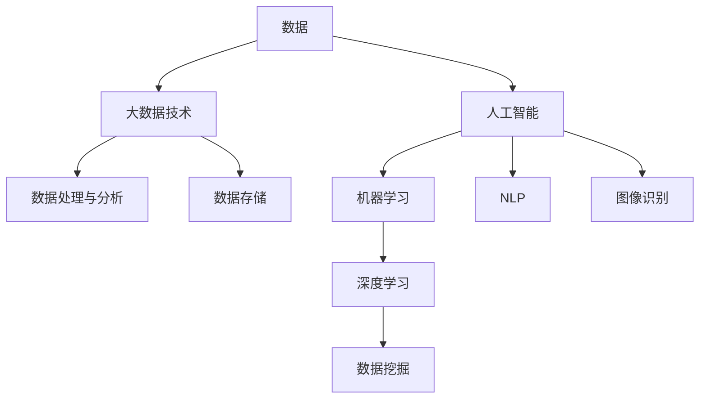
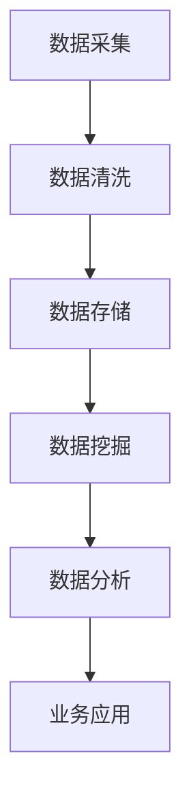
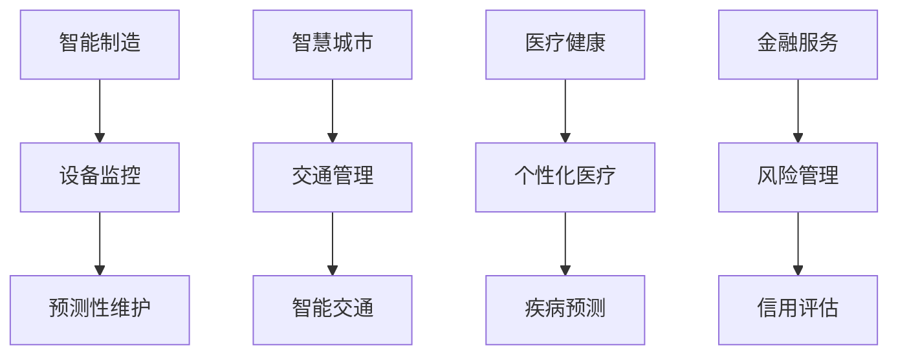

                 

# 未来发展中的大数据与AI技术应用

在科技日新月异的今天，大数据和人工智能（AI）技术的应用正以前所未有的速度扩展到各个行业和领域。从智能制造、智慧城市、医疗健康到金融服务，AI与大数据的深度融合为各行各业注入了新的活力。本文将系统探讨未来大数据与AI技术的应用前景，从核心概念、算法原理、实际应用场景、学习资源、开发工具等多个维度，深入解析大数据与AI技术的未来发展趋势与挑战，旨在为开发者和行业从业者提供全面而深入的技术指引。

## 1. 背景介绍

### 1.1 问题由来

进入21世纪以来，数据的爆炸式增长推动了大数据与AI技术的飞速发展。基于大数据和AI技术的解决方案，正在重塑各行各业的商业模式，提升业务运营效率，创造新的商业价值。然而，数据质量和算力资源仍是制约大数据与AI技术应用的瓶颈。未来，如何有效管理数据、提升算力，是所有从业者面临的重要挑战。

### 1.2 问题核心关键点

大数据与AI技术的应用关键点在于数据驱动的智能决策和预测。核心问题包括：
- 如何高效存储和处理大规模数据？
- 如何提升数据处理与分析的效率？
- 如何在AI模型训练与部署中实现高效的算力管理？
- 如何保证AI模型输出的正确性与公正性？

本文将围绕这些核心问题，系统介绍大数据与AI技术在未来发展中的重要应用。

## 2. 核心概念与联系

### 2.1 核心概念概述

要深刻理解大数据与AI技术的应用，首先必须明晰相关的核心概念。

- **大数据 (Big Data)**：指规模庞大、复杂、高速、多样化的数据集。大数据技术主要涉及数据采集、存储、处理与分析等多个环节。
- **人工智能 (AI)**：指通过算法使计算机系统具备学习、推理和自我改进能力，旨在实现人机协同的智能化应用。
- **机器学习 (ML)**：是AI的一个重要分支，通过让机器从数据中学习规律，从而实现预测和决策。
- **深度学习 (DL)**：是机器学习的一个分支，通过构建多层次神经网络进行复杂模式识别和提取。
- **数据挖掘 (Data Mining)**：指从大量数据中挖掘出有价值的信息和知识，包括聚类、分类、关联规则等方法。
- **自然语言处理 (NLP)**：指让计算机能够理解、处理和生成人类语言的技术。
- **图像识别 (Image Recognition)**：指让计算机能够自动识别和分类图像内容的技术。

这些概念通过数据、算法和应用三个维度构成了大数据与AI技术的核心框架，如图1所示：



### 2.2 核心概念原理和架构的 Mermaid 流程图

以下是一个简单的数据流向图，展示了数据从采集到处理，再到分析和应用的完整流程。



## 3. 核心算法原理 & 具体操作步骤

### 3.1 算法原理概述

大数据与AI技术的应用离不开算法的设计和实现。主要算法原理包括：

- **数据预处理**：通过数据清洗、归一化、特征提取等手段，提高数据质量，为后续分析提供保障。
- **特征工程**：通过数据变换、降维、组合等方法，提取有意义的特征，提升模型性能。
- **模型训练与优化**：通过选择合适的算法、设置合适的参数，训练和优化AI模型，使其能够准确地从数据中学习和预测。
- **模型评估与部署**：通过评估模型性能，选择最优模型，并部署到生产环境中，实现实际应用。

### 3.2 算法步骤详解

一个典型的大数据与AI项目通常包括以下几个步骤：

1. **需求分析**：明确项目目标和业务需求，选择合适的算法和模型。
2. **数据准备**：收集、清洗、标注数据，构建训练集、验证集和测试集。
3. **模型训练**：选择合适的算法和模型，设计模型架构，进行参数优化。
4. **模型评估**：在验证集和测试集上评估模型性能，选择最优模型。
5. **模型部署**：将模型部署到生产环境中，实现实时数据处理与预测。
6. **模型监控与优化**：持续监控模型性能，根据反馈调整模型参数，实现模型迭代优化。

### 3.3 算法优缺点

大数据与AI技术的优点：
- 数据驱动的智能决策，提升业务效率和价值。
- 实时数据处理和预测，满足动态业务需求。
- 算法可解释性，有助于业务理解和信任。

缺点：
- 数据质量和标注成本高。
- 算力需求大，硬件设施成本高。
- 模型复杂度高，难以调试和维护。

### 3.4 算法应用领域

大数据与AI技术在多个领域都有广泛应用，如图2所示：



## 4. 数学模型和公式 & 详细讲解 & 举例说明

### 4.1 数学模型构建

基于大数据与AI技术的应用，通常需要使用数学模型来进行数据处理和分析。以下是一个简单的线性回归模型：

$$
\hat{y} = \theta_0 + \sum_{i=1}^n \theta_i x_i
$$

其中 $\theta_0$ 为截距，$\theta_i$ 为回归系数，$x_i$ 为输入特征，$\hat{y}$ 为预测结果。

### 4.2 公式推导过程

以线性回归为例，我们通过最小化预测误差平方和，得到模型参数的最优解：

$$
\theta = \arg \min_{\theta} \frac{1}{2m} \sum_{i=1}^m (y_i - \hat{y}_i)^2
$$

通过梯度下降法，不断迭代更新 $\theta$，直到收敛：

$$
\theta = \theta - \eta \frac{1}{m} \sum_{i=1}^m (y_i - \hat{y}_i) x_i
$$

### 4.3 案例分析与讲解

以金融风险管理为例，我们通过大数据分析，构建信用评分模型。首先收集客户的各项基本信息和历史交易数据，构建特征向量。然后使用线性回归模型，基于历史数据训练信用评分模型。在模型训练后，通过新客户的各项数据，预测其信用风险，实现贷款审批的智能决策。

## 5. 项目实践：代码实例和详细解释说明

### 5.1 开发环境搭建

在进行大数据与AI项目开发前，需要配置好开发环境。以下是使用Python和PyTorch搭建环境的示例：

```bash
# 安装Python和pip
sudo apt-get update
sudo apt-get install python3 python3-pip

# 安装PyTorch
pip install torch torchvision torchaudio

# 安装TensorBoard
pip install tensorboard

# 安装Flask
pip install flask
```

### 5.2 源代码详细实现

以下是一个使用PyTorch进行线性回归模型的示例代码：

```python
import torch
import torch.nn as nn
import torch.optim as optim

# 定义模型
class LinearRegression(nn.Module):
    def __init__(self, n_features):
        super(LinearRegression, self).__init__()
        self.linear = nn.Linear(n_features, 1)
        
    def forward(self, x):
        return self.linear(x)

# 加载数据
x_train = torch.randn(100, 2)
y_train = x_train[:, 0] + x_train[:, 1] + torch.randn(100, 1)

# 定义模型、损失函数和优化器
model = LinearRegression(2)
criterion = nn.MSELoss()
optimizer = optim.SGD(model.parameters(), lr=0.01)

# 训练模型
for epoch in range(1000):
    optimizer.zero_grad()
    y_pred = model(x_train)
    loss = criterion(y_pred, y_train)
    loss.backward()
    optimizer.step()
    if epoch % 100 == 0:
        print('Epoch: {}, Loss: {:.4f}'.format(epoch, loss.item()))
        
# 预测新数据
x_test = torch.randn(10, 2)
y_pred = model(x_test)
print('Predictions: ', y_pred)
```

### 5.3 代码解读与分析

- `LinearRegression` 类：定义了线性回归模型，包含前向传播函数 `forward`。
- 加载数据：生成随机数据作为训练集，其中 $y$ 是 $x_1$ 和 $x_2$ 之和加上噪声。
- 定义模型、损失函数和优化器：选择 `nn.MSELoss` 作为均方误差损失函数，使用 `SGD` 优化器进行参数更新。
- 训练模型：在每个epoch中，计算预测值和真实值之间的损失，并使用梯度下降法更新模型参数。
- 预测新数据：使用训练好的模型对新数据进行预测。

## 6. 实际应用场景

### 6.1 智能制造

大数据与AI技术在智能制造中的应用广泛，包括设备监控、预测性维护、质量控制等。通过实时数据采集和分析，可以实现设备故障预测和自动诊断，提升生产效率和设备利用率。

### 6.2 智慧城市

智慧城市是未来城市发展的重要方向，通过大数据与AI技术，可以实现交通管理、环境保护、公共安全等多方面的智能化应用。例如，通过交通摄像头和传感器数据，实时分析交通流量，优化交通信号控制，提升城市交通效率。

### 6.3 医疗健康

医疗健康领域的大数据与AI应用包括疾病预测、个性化医疗、智能诊断等。通过分析患者的医疗记录、基因数据和生活习惯，构建疾病预测模型，实现早期诊断和个性化治疗方案。

### 6.4 金融服务

金融服务行业的大数据与AI应用包括信用评分、风险管理、智能投顾等。通过分析客户的历史交易数据、行为数据，构建信用评分模型，实现贷款审批、风险评估和投资建议。

### 6.5 未来应用展望

未来，随着算力资源的持续提升和数据技术的不断进步，大数据与AI技术将在更多领域得到应用。以下是一些未来的应用方向：

- **边缘计算**：在大数据处理过程中，将数据存储和分析任务转移到设备边缘，减少延迟和带宽成本。
- **量子计算**：利用量子计算的高速计算能力，提升AI模型的训练和推理效率。
- **联邦学习**：通过分布式计算，保护数据隐私的同时，实现多源数据的联合学习。
- **元学习**：通过学习算法之间的共享知识和经验，加速模型训练，提高泛化能力。
- **自适应学习**：通过动态调整学习率、优化器等参数，实现更加灵活的模型训练。

## 7. 工具和资源推荐

### 7.1 学习资源推荐

为了帮助开发者系统掌握大数据与AI技术的应用，以下是一些优质的学习资源：

- **Coursera《Machine Learning》课程**：由斯坦福大学教授Andrew Ng主讲，涵盖机器学习和深度学习的基本概念和算法。
- **Kaggle**：提供大量数据集和竞赛，帮助开发者实践和提升数据处理和模型训练技能。
- **DataCamp**：提供交互式课程，涵盖数据科学、机器学习、统计学等多个领域。
- **Google AI Blog**：谷歌AI团队发布的最新研究成果和技术博客，涵盖深度学习、自然语言处理、计算机视觉等多个方向。

### 7.2 开发工具推荐

- **Jupyter Notebook**：支持代码编写、数据可视化、模型训练等多个功能，是数据科学家和AI开发者常用的工具。
- **TensorBoard**：谷歌开源的可视化工具，用于实时监控模型训练状态，分析性能瓶颈。
- **PyTorch Lightning**：基于PyTorch的轻量级框架，支持模型训练、分布式计算等功能。
- **Hugging Face Transformers**：开源的NLP模型库，提供丰富的预训练模型和微调工具。
- **AWS SageMaker**：亚马逊提供的AI服务平台，支持模型训练、部署和监控，提供大规模算力支持。

### 7.3 相关论文推荐

- **《TensorFlow: A System for Large-Scale Machine Learning》**：介绍谷歌开源的深度学习框架TensorFlow，涵盖其架构和应用。
- **《A Survey on Deep Learning in Industry》**：综述深度学习在工业界的最新应用，涵盖金融、医疗、制造等多个领域。
- **《Distributed Deep Learning》**：介绍分布式深度学习技术，涵盖模型并行、数据并行、混合并行等多种方式。
- **《Adversarial Machine Learning》**：介绍对抗机器学习技术，包括对抗训练、对抗样本生成等方法。

## 8. 总结：未来发展趋势与挑战

### 8.1 研究成果总结

大数据与AI技术的应用已经取得了显著的进展，以下是一些代表性的研究成果：

- **AlphaGo**：谷歌DeepMind开发的围棋AI程序，通过深度学习和蒙特卡罗树搜索技术，首次击败人类围棋世界冠军。
- **BERT**：谷歌发布的预训练语言模型，通过大规模语料预训练，在NLP任务上取得了多项SOTA。
- **GANs**：生成对抗网络，通过生成器和判别器之间的对抗训练，实现了高质量图像生成。

### 8.2 未来发展趋势

大数据与AI技术的未来发展趋势包括：

- **智能化决策支持**：通过大数据分析，构建智能决策支持系统，提升决策效率和质量。
- **自动化数据处理**：引入自动化数据处理技术，实现数据采集、清洗、标注的全流程自动化。
- **实时数据处理**：实现数据的实时采集、分析和处理，满足动态业务需求。
- **跨领域应用**：将大数据与AI技术应用于更多领域，实现跨行业的协同创新。

### 8.3 面临的挑战

大数据与AI技术在应用过程中面临的挑战包括：

- **数据质量与隐私保护**：如何保证数据质量，同时保护数据隐私，是一个重要的难题。
- **算力成本**：大规模数据处理和模型训练需要大量算力，成本较高。
- **模型可解释性**：如何解释AI模型的决策过程，提升模型的透明度和信任度。
- **模型泛化能力**：如何提升模型的泛化能力，减少过拟合风险。
- **模型鲁棒性**：如何提高模型的鲁棒性，应对异常输入和攻击。

### 8.4 研究展望

未来的研究将集中在以下几个方向：

- **分布式计算与模型并行**：通过分布式计算技术，提升大数据处理和AI模型的训练效率。
- **模型压缩与优化**：通过模型压缩技术，减少模型参数量，提升推理速度和资源利用率。
- **跨模态融合**：将视觉、语音、文本等多模态数据融合，提升模型的全面感知能力。
- **可解释性与透明性**：引入可解释性技术，提升模型的透明度和信任度。
- **自动化与自适应学习**：引入自动化学习技术，提升模型训练的灵活性和适应性。

## 9. 附录：常见问题与解答

**Q1：如何高效存储和处理大规模数据？**

A: 通过分布式存储系统，如Hadoop、Spark，实现数据的分布式存储和处理。利用大数据处理框架，如Apache Flink、Apache Storm，提升数据处理的效率和可扩展性。

**Q2：如何提升数据处理与分析的效率？**

A: 利用数据流处理技术，如Apache Kafka、Apache Pulsar，实现数据的实时采集和处理。引入自动化数据处理工具，如DataRobot、DataRobotics，提升数据处理的自动化水平。

**Q3：如何提升算力管理效率？**

A: 引入容器化技术，如Docker、Kubernetes，提升算力资源的利用率和编排效率。利用云平台，如AWS、Azure、阿里云，提供弹性的算力资源，支持大规模分布式计算。

**Q4：如何保证AI模型输出的正确性与公正性？**

A: 引入公平性评估指标，如Confusion Matrix、ROC-AUC曲线，评估模型输出的公平性。利用对抗样本生成技术，提高模型的鲁棒性，减少偏见和歧视。

**Q5：如何在AI模型训练与部署中实现高效的算力管理？**

A: 引入模型压缩技术，如剪枝、量化、蒸馏，减少模型参数量，提升推理速度和资源利用率。利用云平台提供的弹性计算资源，支持模型的弹性部署和迭代优化。

**Q6：如何解释AI模型的决策过程？**

A: 引入可解释性技术，如LIME、SHAP，解释模型输出的决策过程。利用模型可视化工具，如TensorBoard、Kibana，可视化模型的特征重要性、梯度分布等。

---

作者：禅与计算机程序设计艺术 / Zen and the Art of Computer Programming

