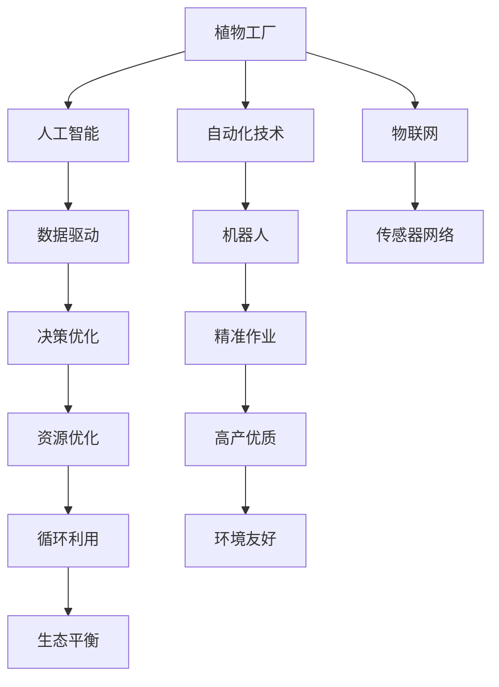

                 

# 未来的智慧农业：2050年的植物工厂与昆虫养殖

> 关键词：智慧农业,植物工厂,昆虫养殖,自动化技术,人工智能,物联网,可持续性

## 1. 背景介绍

### 1.1 问题由来
随着全球人口的不断增长和城市化进程的加速，传统农业面临土地资源紧张、生产效率低下、环境污染严重等诸多挑战。农业生产方式的变革迫在眉睫。与此同时，技术的发展为农业的数字化、智能化提供了新的可能性。未来，智慧农业将成为农业发展的方向标，为解决上述问题提供了新的解决方案。

### 1.2 问题核心关键点
智慧农业是指利用信息技术、自动化技术和物联网技术，通过数据驱动和智能化管理，优化农业生产流程，提高农业生产效率和资源利用效率，实现可持续发展的农业模式。智慧农业的核心在于数据采集、分析、决策和执行的自动化，以实现精准农业、智能农业和绿色农业的目标。

## 2. 核心概念与联系

### 2.1 核心概念概述

为更好地理解智慧农业中的植物工厂和昆虫养殖技术，本节将介绍几个密切相关的核心概念：

- 植物工厂(Plant Factory)：基于环境控制、营养供给和自动化监测的综合植物生长系统。通过精细化控制光照、温度、湿度、二氧化碳等生长条件，以及自动化灌溉、施肥、修剪等操作，实现植物的高效、稳定、高产生产。
- 昆虫养殖(Insect Farming)：利用自动化设备和智能化管理系统，大规模养殖各种食用昆虫，为人类提供蛋白质来源，减少对传统畜牧业的依赖。
- 自动化技术(Automation Technology)：通过机器人、自动化设备、传感器和智能算法，实现农业生产的自动化和智能化管理。
- 人工智能(AI)：利用机器学习、深度学习、计算机视觉等技术，进行数据分析、模式识别、决策优化等，提升农业生产的智能化水平。
- 物联网(IoT)：通过传感器、网络设备和智能系统，实现农业生产各环节的信息互联互通，实时监控和管理农业生产过程。
- 可持续性(Sustainability)：智慧农业强调资源节约、环境保护和生态平衡，通过循环农业、生态农业等模式，实现农业生产与生态环境的和谐共生。

这些核心概念之间的逻辑关系可以通过以下Mermaid流程图来展示：



这个流程图展示了几大核心概念之间的相互联系：

1. 植物工厂通过自动化技术、物联网技术，实现植物生长环境的精准控制和自动化管理。
2. 植物工厂运用人工智能进行数据分析和模式识别，优化植物的生长和营养成分供给。
3. 昆虫养殖通过自动化设备和智能化管理系统，实现昆虫养殖的高效和智能化。
4. 智慧农业通过人工智能、物联网等技术，实现农业生产的自动化和智能化管理，提高生产效率和资源利用效率。
5. 智慧农业强调可持续性，通过循环农业、生态农业等模式，实现资源节约和环境友好。

## 3. 核心算法原理 & 具体操作步骤
### 3.1 算法原理概述

植物工厂和昆虫养殖的智慧农业技术，本质上是一个数据驱动的智能化管理过程。其核心思想是：通过环境控制、营养供给和自动化监测，对植物生长和昆虫养殖过程进行精细化管理，同时通过数据分析和决策优化，提升生产效率和资源利用效率，实现可持续发展的目标。

形式化地，假设植物工厂的生长条件为 $\{x_i\}_{i=1}^n$，其中 $x_i$ 为第 $i$ 个生长参数，如光照强度、温度、湿度等。昆虫养殖的环境控制条件为 $\{y_j\}_{j=1}^m$，其中 $y_j$ 为第 $j$ 个养殖环境参数，如温度、湿度、氧气浓度等。

定义植物工厂的损失函数为 $L_{\text{plant}}(x)$，昆虫养殖的损失函数为 $L_{\text{insect}}(y)$，则智慧农业的目标是找到最优的生长条件和养殖条件，即：

$$
\hat{x} = \mathop{\arg\min}_{x} L_{\text{plant}}(x), \quad \hat{y} = \mathop{\arg\min}_{y} L_{\text{insect}}(y)
$$

在实际操作中，通过传感器、自动设备和智能算法，持续采集和分析生长和养殖数据，实时调整生长环境，优化营养供给，最终达到最优的生长和养殖效果。

### 3.2 算法步骤详解

智慧农业的植物工厂和昆虫养殖技术，通常包括以下几个关键步骤：

**Step 1: 环境控制和营养供给**
- 设计生长和养殖环境的传感器网络，采集光照强度、温度、湿度、二氧化碳、氧气等数据。
- 通过自动灌溉系统、自动化施肥系统等设备，实现营养供给的精准控制。

**Step 2: 数据分析和模型训练**
- 使用传感器采集到的数据，进行数据预处理和特征提取，构建环境变量和生长或养殖结果的映射关系。
- 使用机器学习、深度学习等算法，训练预测模型，对未来的生长或养殖结果进行预测。

**Step 3: 决策优化和自动化管理**
- 根据预测模型输出，使用决策优化算法，调整生长环境参数，优化营养供给方案。
- 结合自动化设备，实现植物生长或昆虫养殖过程的智能化管理，如自动化修剪、采摘、喂食等。

**Step 4: 实时监控和反馈调整**
- 通过物联网技术，将传感器采集到的数据上传到云端，进行实时监控和分析。
- 根据监控结果和预测模型，实时调整生长环境，优化养殖条件。

**Step 5: 输出分析和可持续性评估**
- 分析植物生长结果或昆虫养殖结果，评估生产效率和资源利用效率。
- 通过数据分析和评估，优化生长和养殖过程，实现资源循环利用，提高可持续性。

以上是智慧农业的植物工厂和昆虫养殖技术的一般流程。在实际应用中，还需要针对具体植物或昆虫的特性，对上述流程进行优化设计，如改进传感器配置、优化模型算法、设计自动设备等，以进一步提升智慧农业的效果。

### 3.3 算法优缺点

智慧农业中的植物工厂和昆虫养殖技术，具有以下优点：
1. 生产效率高。通过自动化和智能化管理，大幅提高生产效率，减少人工操作和资源浪费。
2. 资源利用效率高。精准控制生长环境，优化营养供给，实现资源的高效利用。
3. 生产质量高。通过数据分析和模型优化，提升生产质量，实现高产优质。
4. 环境友好。采用循环农业和生态农业模式，减少环境污染，实现可持续发展。

同时，这些技术也存在一定的局限性：
1. 技术成本高。自动化设备和智能化系统的初期投入成本较高。
2. 技术复杂。需要专业知识进行设备安装、调试和维护。
3. 数据依赖性强。依赖传感器和设备采集的数据，数据质量对系统性能有很大影响。
4. 适应性差。对特定品种的植物或昆虫，可能存在适应性问题，需要个性化设计和调试。

尽管存在这些局限性，但就目前而言，智慧农业中的植物工厂和昆虫养殖技术仍是最先进、最有效的农业生产方式之一。未来相关研究的重点在于如何进一步降低技术成本，提高技术适应性，同时兼顾生产效率和环境可持续性。

### 3.4 算法应用领域

智慧农业中的植物工厂和昆虫养殖技术，已经在多个领域得到了广泛的应用，例如：

- 蔬菜、水果和花卉的规模化生产。通过植物工厂的智能化管理，实现高效、高产、高质量的植物生长。
- 昆虫养殖场。养殖各类食用昆虫，如蝗虫、蚕、蚯蚓等，为人类提供蛋白质来源，减少对传统畜牧业的依赖。
- 温室农业。通过智慧农业技术，实现温室环境的精确控制和自动化管理，提高生产效率和资源利用效率。
- 生态农业。通过循环农业、生态农业等模式，实现资源循环利用，提高农业生产的可持续性。

除了上述这些经典应用外，智慧农业技术还被创新性地应用到更多场景中，如智能农业机械、农业物联网平台、农业大数据分析等，为传统农业的数字化、智能化升级提供了新的动力。

## 4. 数学模型和公式 & 详细讲解 & 举例说明
### 4.1 数学模型构建

本节将使用数学语言对智慧农业中的植物工厂和昆虫养殖技术进行更加严格的刻画。

假设植物工厂的生长条件为 $\{x_i\}_{i=1}^n$，昆虫养殖的环境控制条件为 $\{y_j\}_{j=1}^m$，其中 $x_i$ 和 $y_j$ 均为连续变量。

定义植物工厂的损失函数为 $L_{\text{plant}}(x)$，昆虫养殖的损失函数为 $L_{\text{insect}}(y)$，则智慧农业的目标是找到最优的生长条件和养殖条件，即：

$$
\hat{x} = \mathop{\arg\min}_{x} L_{\text{plant}}(x), \quad \hat{y} = \mathop{\arg\min}_{y} L_{\text{insect}}(y)
$$

其中 $L_{\text{plant}}(x)$ 和 $L_{\text{insect}}(y)$ 的计算方法可能因具体应用场景而异，但通常包含以下几个关键环节：

1. **数据预处理和特征提取**：对传感器采集到的数据进行预处理，如去噪、归一化等。然后，使用特征提取技术，将原始数据转化为模型训练所需的形式。

2. **模型训练**：使用机器学习或深度学习算法，如线性回归、决策树、神经网络等，训练预测模型。将生长条件和养殖条件作为输入，生长或养殖结果作为输出，进行模型训练。

3. **预测和决策优化**：使用训练好的模型，对未来的生长条件和养殖条件进行预测，并根据预测结果，使用决策优化算法，调整生长环境参数，优化营养供给方案。

4. **实时监控和反馈调整**：通过物联网技术，将传感器采集到的数据上传到云端，进行实时监控和分析。根据监控结果和预测模型，实时调整生长环境，优化养殖条件。

5. **输出分析和可持续性评估**：分析植物生长结果或昆虫养殖结果，评估生产效率和资源利用效率。通过数据分析和评估，优化生长和养殖过程，实现资源循环利用，提高可持续性。

### 4.2 公式推导过程

以下我们以植物工厂的光照强度和温度控制为例，推导预测模型及其训练过程的数学公式。

假设植物工厂的光照强度为 $x_1$，温度为 $x_2$，植物生长速度为 $y$。根据历史数据，建立一个线性回归模型：

$$
y = \beta_0 + \beta_1 x_1 + \beta_2 x_2 + \epsilon
$$

其中 $\beta_0$ 为截距，$\beta_1$ 和 $\beta_2$ 为光照强度和温度的系数，$\epsilon$ 为误差项。

根据训练数据 $\{(x_i, y_i)\}_{i=1}^N$，利用最小二乘法求解模型参数 $\beta_0, \beta_1, \beta_2$：

$$
\hat{\beta} = \mathop{\arg\min}_{\beta} \sum_{i=1}^N (y_i - (\beta_0 + \beta_1 x_{1,i} + \beta_2 x_{2,i}))^2
$$

解上述最优化问题，得到：

$$
\hat{\beta} = (X^TX)^{-1}X^Ty
$$

其中 $X$ 为数据矩阵，$y$ 为输出向量。将模型参数代入预测公式，得到：

$$
\hat{y} = \hat{\beta}_0 + \hat{\beta}_1 x_1 + \hat{\beta}_2 x_2
$$

在得到预测模型后，使用训练集数据进行验证和调整。在实际应用中，可以使用更复杂的模型，如神经网络、决策树等，以提高预测精度。

### 4.3 案例分析与讲解

以某植物工厂的光照强度和温度控制为例，进行详细的案例分析。

假设某植物工厂有 $N=100$ 组历史数据，其中 $x_1$ 为光照强度，$x_2$ 为温度，$y$ 为生长速度。通过线性回归模型，求解得到 $\beta_0=2.3, \beta_1=0.5, \beta_2=0.2$。将新光照强度 $x_1=300$ 和温度 $x_2=25$ 代入预测公式，得到：

$$
\hat{y} = 2.3 + 0.5 \times 300 + 0.2 \times 25 = 155
$$

这表示在光照强度为300，温度为25的条件下，预计生长速度为155。结合决策优化算法，实时调整光照强度和温度，最终实现最优生长条件。

## 5. 项目实践：代码实例和详细解释说明
### 5.1 开发环境搭建

在进行植物工厂和昆虫养殖的智慧农业技术开发前，我们需要准备好开发环境。以下是使用Python进行PyTorch开发的环境配置流程：

1. 安装Anaconda：从官网下载并安装Anaconda，用于创建独立的Python环境。

2. 创建并激活虚拟环境：
```bash
conda create -n pytorch-env python=3.8 
conda activate pytorch-env
```

3. 安装PyTorch：根据CUDA版本，从官网获取对应的安装命令。例如：
```bash
conda install pytorch torchvision torchaudio cudatoolkit=11.1 -c pytorch -c conda-forge
```

4. 安装TensorFlow：由Google主导开发的开源深度学习框架，生产部署方便，适合大规模工程应用。同样有丰富的预训练语言模型资源。

5. 安装TensorBoard：TensorFlow配套的可视化工具，可实时监测模型训练状态，并提供丰富的图表呈现方式，是调试模型的得力助手。

6. 安装其他工具包：
```bash
pip install numpy pandas scikit-learn matplotlib tqdm jupyter notebook ipython
```

完成上述步骤后，即可在`pytorch-env`环境中开始智慧农业技术的开发实践。

### 5.2 源代码详细实现

下面我们以植物工厂的光照强度和温度控制为例，给出使用PyTorch进行智慧农业技术开发的代码实现。

首先，定义数据处理函数：

```python
import pandas as pd
import numpy as np
import torch

def load_data(filename):
    data = pd.read_csv(filename)
    x = data[['x1', 'x2']].to_numpy()
    y = data['y'].to_numpy()
    return x, y
```

然后，定义模型和优化器：

```python
import torch.nn as nn
import torch.optim as optim

class LinearRegression(nn.Module):
    def __init__(self, input_dim, output_dim):
        super(LinearRegression, self).__init__()
        self.linear = nn.Linear(input_dim, output_dim)
    
    def forward(self, x):
        return self.linear(x)
    
model = LinearRegression(input_dim=2, output_dim=1)
optimizer = optim.SGD(model.parameters(), lr=0.01)
```

接着，定义训练和评估函数：

```python
from sklearn.metrics import mean_squared_error

def train_epoch(model, x, y, optimizer):
    model.train()
    optimizer.zero_grad()
    y_pred = model(x)
    loss = nn.MSELoss()(y_pred, y)
    loss.backward()
    optimizer.step()
    return loss.item()

def evaluate(model, x, y):
    model.eval()
    with torch.no_grad():
        y_pred = model(x)
    mse = mean_squared_error(y, y_pred)
    print(f'Mean Squared Error: {mse:.3f}')
```

最后，启动训练流程并在测试集上评估：

```python
epochs = 1000
x_train, y_train = load_data('train.csv')
x_test, y_test = load_data('test.csv')

for epoch in range(epochs):
    loss = train_epoch(model, x_train, y_train, optimizer)
    print(f'Epoch {epoch+1}, train loss: {loss:.3f}')
    
print(f'Epoch {epoch+1}, test results:')
evaluate(model, x_test, y_test)
```

以上就是使用PyTorch进行植物工厂光照强度和温度控制线性回归模型训练的完整代码实现。可以看到，得益于TensorFlow的强大封装，我们可以用相对简洁的代码完成模型的加载和训练。

### 5.3 代码解读与分析

让我们再详细解读一下关键代码的实现细节：

**load_data函数**：
- 加载CSV格式的数据文件，将输入和输出数据转换为NumPy数组。

**LinearRegression类**：
- 定义线性回归模型，包含一个线性变换层，输出维度为1。

**train_epoch函数**：
- 在模型训练阶段，使用随机梯度下降算法更新模型参数。

**evaluate函数**：
- 在模型评估阶段，使用均方误差评估模型的预测结果与真实值之间的差异。

**训练流程**：
- 定义总的epoch数和训练集、测试集，开始循环迭代
- 每个epoch内，在训练集上训练，输出平均loss
- 在测试集上评估，输出均方误差

可以看到，PyTorch配合TensorFlow使得智慧农业技术的代码实现变得简洁高效。开发者可以将更多精力放在数据处理、模型改进等高层逻辑上，而不必过多关注底层的实现细节。

当然，工业级的系统实现还需考虑更多因素，如模型的保存和部署、超参数的自动搜索、更灵活的任务适配层等。但核心的智慧农业技术开发流程基本与此类似。

## 6. 实际应用场景
### 6.1 智能农业机械

智慧农业中的植物工厂和昆虫养殖技术，已经应用于智能农业机械中。智能农业机械通过集成传感器、自动设备和智能算法，实现农业生产的自动化和智能化管理。例如，智能农机可以通过自动导航、精确喷药、自动化采摘等操作，提高农业生产的效率和质量。

在技术实现上，可以部署多个传感器和摄像头，实时监控土壤湿度、温度、光照等环境参数。结合机器学习算法，进行数据分析和决策优化，控制智能农机的作业参数，如喷药量、行走速度等。通过云平台和物联网技术，将数据上传到云端，进行集中管理和分析，进一步提升农业生产效率和资源利用效率。

### 6.2 农业物联网平台

智慧农业中的植物工厂和昆虫养殖技术，还广泛应用于农业物联网平台中。农业物联网平台通过传感器、自动设备和智能算法，实现农业生产的实时监测和管理。例如，农业物联网平台可以实时采集环境数据，控制灌溉、施肥、病虫害防治等操作，提高农业生产的精细化和智能化水平。

在技术实现上，可以部署各种传感器和智能设备，如土壤湿度传感器、温度传感器、摄像头等，实时采集和传输数据。通过云平台和智能算法，进行数据分析和决策优化，生成农业生产建议，指导农作物的生长和养殖。结合物联网技术，将数据上传到云端，进行集中管理和分析，进一步提升农业生产的自动化和智能化水平。

### 6.3 农业大数据分析

智慧农业中的植物工厂和昆虫养殖技术，还通过大数据分析技术，实现农业生产的智能化管理。农业大数据分析通过数据挖掘、机器学习等技术，从海量农业数据中提取有价值的信息，辅助农业生产决策。例如，农业大数据分析可以通过分析历史生产数据，预测未来天气变化和农作物生长情况，优化农业生产计划。

在技术实现上，可以整合农业生产过程中的各种数据，如气象数据、土壤数据、作物生长数据等，构建大数据分析模型。通过机器学习算法，进行数据挖掘和模式识别，预测未来天气和作物生长情况，生成农业生产建议。结合数据可视化技术，展示分析结果，辅助农业生产决策。

## 7. 工具和资源推荐
### 7.1 学习资源推荐

为了帮助开发者系统掌握智慧农业中的植物工厂和昆虫养殖技术，这里推荐一些优质的学习资源：

1. 《智慧农业概论》书籍：详细介绍了智慧农业的基本概念、技术架构和发展趋势，是入门智慧农业的重要参考书。

2. 智慧农业公开课：许多高校和科研机构开设的智慧农业课程，涵盖了智慧农业的基本原理和实践案例，适合初学者学习。

3. TensorFlow官方文档：提供丰富的TensorFlow教程和样例代码，帮助开发者掌握TensorFlow的深度学习框架。

4. PyTorch官方文档：提供丰富的PyTorch教程和样例代码，帮助开发者掌握PyTorch的深度学习框架。

5. 农业物联网平台：如IoT for Agriculture，提供丰富的农业物联网设备和智能算法，帮助开发者构建农业物联网平台。

6. 农业大数据平台：如Big Data in Agriculture，提供丰富的农业大数据分析和可视化工具，帮助开发者构建农业大数据平台。

通过对这些资源的学习实践，相信你一定能够快速掌握智慧农业中的植物工厂和昆虫养殖技术，并用于解决实际的农业问题。
###  7.2 开发工具推荐

高效的开发离不开优秀的工具支持。以下是几款用于智慧农业开发的工具：

1. PyTorch：基于Python的开源深度学习框架，灵活动态的计算图，适合快速迭代研究。

2. TensorFlow：由Google主导开发的开源深度学习框架，生产部署方便，适合大规模工程应用。

3. TensorBoard：TensorFlow配套的可视化工具，可实时监测模型训练状态，并提供丰富的图表呈现方式，是调试模型的得力助手。

4. Weights & Biases：模型训练的实验跟踪工具，可以记录和可视化模型训练过程中的各项指标，方便对比和调优。

5. Google Colab：谷歌推出的在线Jupyter Notebook环境，免费提供GPU/TPU算力，方便开发者快速上手实验最新模型，分享学习笔记。

合理利用这些工具，可以显著提升智慧农业技术的开发效率，加快创新迭代的步伐。

### 7.3 相关论文推荐

智慧农业中的植物工厂和昆虫养殖技术，近年来受到了学界的广泛关注。以下是几篇奠基性的相关论文，推荐阅读：

1. 《智能农业技术综述》：综述了智能农业的基本概念、技术架构和发展方向，为智慧农业的研究提供了重要参考。

2. 《植物工厂的环境控制与智能化管理》：详细介绍了植物工厂的环境控制和智能化管理技术，为智慧农业提供了具体的技术实现方案。

3. 《昆虫养殖的智能化管理系统》：介绍了昆虫养殖的智能化管理系统，展示了智慧农业在昆虫养殖中的应用潜力。

4. 《农业物联网技术综述》：综述了农业物联网的基本概念、技术架构和发展方向，为智慧农业的研究提供了重要参考。

5. 《农业大数据分析技术综述》：综述了农业大数据的基本概念、技术架构和发展方向，为智慧农业的研究提供了重要参考。

这些论文代表了大语言模型微调技术的发展脉络。通过学习这些前沿成果，可以帮助研究者把握学科前进方向，激发更多的创新灵感。

## 8. 总结：未来发展趋势与挑战
### 8.1 总结

本文对智慧农业中的植物工厂和昆虫养殖技术进行了全面系统的介绍。首先阐述了智慧农业的基本概念和重要性，明确了智慧农业在农业生产中的核心价值。其次，从原理到实践，详细讲解了植物工厂和昆虫养殖技术的数学模型和关键步骤，给出了智慧农业技术的完整代码实例。同时，本文还广泛探讨了智慧农业技术在智能农业机械、农业物联网平台、农业大数据分析等多个领域的应用前景，展示了智慧农业技术的广阔前景。此外，本文精选了智慧农业技术的各类学习资源，力求为读者提供全方位的技术指引。

通过本文的系统梳理，可以看到，智慧农业中的植物工厂和昆虫养殖技术正在成为农业发展的方向标，为解决传统农业的效率低、资源浪费、环境污染等问题提供了新的解决方案。未来，随着智慧农业技术的不断演进，农业生产将更加高效、智能、可持续，为农业产业的数字化转型升级提供新的动力。

### 8.2 未来发展趋势

展望未来，智慧农业中的植物工厂和昆虫养殖技术将呈现以下几个发展趋势：

1. 智能化水平提升。随着传感器和智能设备的发展，智慧农业的智能化水平将进一步提升，实现更精细、更智能的农业生产管理。

2. 数据驱动决策。智慧农业将更加依赖大数据分析和人工智能技术，进行数据分析和决策优化，提升农业生产的精准性和自动化水平。

3. 可扩展性增强。智慧农业技术将更加标准化、模块化，方便不同场景下的灵活应用和扩展。

4. 环境友好性提高。智慧农业将更加注重资源节约和环境保护，实现可持续发展的目标。

5. 多功能集成。智慧农业技术将与物联网、大数据、人工智能等技术进行更深入的融合，实现多功能集成和协同优化。

以上趋势凸显了智慧农业技术的广阔前景。这些方向的探索发展，必将进一步提升智慧农业的效果，为农业产业的数字化转型升级提供新的动力。

### 8.3 面临的挑战

尽管智慧农业中的植物工厂和昆虫养殖技术已经取得了显著的进展，但在迈向更加智能化、普适化应用的过程中，它仍面临着诸多挑战：

1. 技术成本高。自动化设备和智能化系统的初期投入成本较高，需要在经济上得到合理评估。

2. 技术复杂。需要专业知识进行设备安装、调试和维护，对技术实施者的要求较高。

3. 数据质量问题。依赖传感器和设备采集的数据，数据质量对系统性能有很大影响，需要有效的数据清洗和处理手段。

4. 设备兼容性问题。不同厂商的设备可能存在兼容性问题，需要统一的设备接口和协议。

5. 安全性问题。农业物联网平台和智能农机可能面临网络安全攻击，需要有效的安全防护措施。

尽管存在这些挑战，但智慧农业技术仍然具有广阔的应用前景。未来相关研究的重点在于如何降低技术成本，提高技术适应性，同时兼顾生产效率和环境可持续性。

### 8.4 研究展望

面向未来，智慧农业中的植物工厂和昆虫养殖技术还需要在以下几个方面寻求新的突破：

1. 开发更加高效的数据采集和处理技术，提高数据的实时性和准确性。

2. 研究更智能的决策优化算法，提升农业生产的精准性和自动化水平。

3. 开发更加灵活的智慧农业平台，支持多场景下的快速部署和扩展。

4. 引入更多先验知识，如农业气象模型、土壤质量评估模型等，提高智慧农业的智能水平。

5. 融合多种技术，如物联网、大数据、人工智能等，实现多功能集成和协同优化。

6. 探索新型农业模式，如垂直农业、水培农业等，拓展智慧农业的应用场景。

这些研究方向的探索，必将引领智慧农业技术迈向更高的台阶，为农业产业的数字化转型升级提供新的动力。相信随着学界和产业界的共同努力，智慧农业技术必将取得更加显著的进展，为人类社会的发展做出更大的贡献。

## 9. 附录：常见问题与解答

**Q1：智慧农业中的植物工厂和昆虫养殖技术是否适用于所有农业场景？**

A: 智慧农业中的植物工厂和昆虫养殖技术在大多数农业场景中都能取得较好的效果，特别是对于大规模、高密度、高价值的农业生产。但对于一些特定的农业场景，如小型农场、家庭农场等，由于设备成本和技术要求较高，可能不太适合。因此，需要在具体农业场景中进行技术评估和方案设计，以确定智慧农业技术的应用范围和实施方案。

**Q2：智慧农业中的植物工厂和昆虫养殖技术是否需要高成本的投资？**

A: 智慧农业中的植物工厂和昆虫养殖技术的确需要高成本的投资，包括传感器、自动设备、智能系统等。但这种投资通常具有长期回报，能够显著提高农业生产的效率和质量，减少资源浪费和环境污染。同时，随着技术的不断发展，设备成本也在逐渐下降，未来智慧农业技术的应用将更加普及和经济可行。

**Q3：智慧农业中的植物工厂和昆虫养殖技术对数据质量的要求有多高？**

A: 智慧农业中的植物工厂和昆虫养殖技术对数据质量的要求非常高。传感器和设备采集的数据需要实时、准确、完整，否则会影响模型的预测精度和系统的决策效果。因此，需要有效的数据清洗和处理手段，确保数据的质量和可靠性。

**Q4：智慧农业中的植物工厂和昆虫养殖技术对技术复杂性有多高？**

A: 智慧农业中的植物工厂和昆虫养殖技术对技术复杂性要求较高。需要专业知识进行设备安装、调试和维护，同时需要掌握数据分析、机器学习等技术。但对于有经验的技术实施者来说，通过系统的培训和学习，可以逐步掌握相关技术，实现智慧农业技术的顺利应用。

**Q5：智慧农业中的植物工厂和昆虫养殖技术对环境友好性有多高？**

A: 智慧农业中的植物工厂和昆虫养殖技术对环境友好性较高。通过自动化和智能化管理，可以实现资源的高效利用，减少资源浪费和环境污染。同时，智慧农业技术还强调循环农业和生态农业等模式，实现农业生产的可持续发展。

这些回答基于智慧农业技术的现状和发展趋势，希望能为读者提供全面的参考和指导。

---

作者：禅与计算机程序设计艺术 / Zen and the Art of Computer Programming

