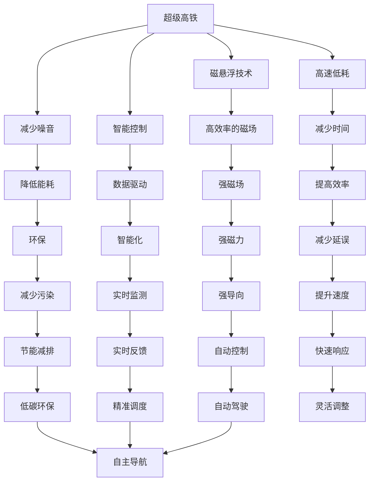

                 

# 未来的智慧出行：2050年的超级高铁与空中自行车的立体交通出行

> 关键词：超级高铁,空中自行车,智能交通系统,未来城市,可持续发展,智慧出行

## 1. 背景介绍

### 1.1 问题由来
随着全球人口的增长和城市化进程的加快，交通拥堵和环境污染问题日益严峻。传统的交通方式已无法满足现代社会的可持续发展需求，亟需一种高效、绿色、智能的交通体系。未来智慧出行，以超级高铁和空中自行车为代表的立体交通出行方式，将成为解决城市交通问题的创新方案。

### 1.2 问题核心关键点
超级高铁和空中自行车，分别代表地面和空中的新型交通方式，具有高度的智能化和自动化特点，能够有效缓解城市交通压力，提升出行效率，减少环境污染。它们的实现，离不开先进的信息技术和交通工程学的深度融合。

超级高铁采用磁悬浮技术，具有高速、低能耗、低噪音等特点，能够在短时间内实现长距离运输，极大地缩短通勤时间。空中自行车利用无人机技术，能够在空中进行灵活的路线规划和飞行控制，适应城市复杂多变的交通环境。

### 1.3 问题研究意义
超级高铁和空中自行车的研究，对于提升城市交通系统的智能化水平，实现绿色可持续发展，具有重要意义：

1. 缓解城市交通压力。超级高铁和空中自行车能够有效分流地面交通流量，减轻城市道路拥堵。
2. 提升出行效率。超级高铁的高速和空中自行车的灵活性，极大提高了城市出行的效率。
3. 减少环境污染。超级高铁的低能耗和空中自行车的空中出行，有助于降低城市碳排放，保护环境。
4. 推动技术进步。超级高铁和空中自行车的开发，带动了信息技术、新材料、智能控制等诸多领域的进步。
5. 提升生活品质。未来智慧出行，使城市居民享受到更加便捷、安全、舒适的出行体验。

## 2. 核心概念与联系

### 2.1 核心概念概述

为更好地理解超级高铁和空中自行车的立体交通出行方式，本节将介绍几个密切相关的核心概念：

- 超级高铁(Hyperloop)：基于磁悬浮技术的高速地面交通系统，具有高速、低能耗、低噪音等特点，能够在短时间内实现长距离运输。
- 空中自行车(Aerial Bike)：利用无人机技术，能够在空中进行灵活的路线规划和飞行控制的智能出行方式。
- 智能交通系统(ITS)：融合现代信息技术，通过数据分析、通信、控制等手段，实现交通管理的智能化、自动化和信息化。
- 智慧出行：结合人工智能、物联网、大数据等先进技术，实现出行方式的智能化、个性化、绿色化。
- 可持续发展(Sustainable Development)：在满足当前需求的同时，不损害后代人满足需求的能力，强调环境保护和社会公平。

这些核心概念之间的逻辑关系可以通过以下Mermaid流程图来展示：



这个流程图展示了我们重点介绍的立体交通出行方式的逻辑关系：

1. 超级高铁通过磁悬浮技术实现高速低耗。
2. 空中自行车利用无人机技术灵活飞行。
3. 智能交通系统通过数据驱动实现交通管理。
4. 智慧出行强调智能化和绿色化出行方式。
5. 可持续发展关注环境保护和社会公平。

这些概念共同构成了立体交通出行方式的实施基础，使得未来智慧出行成为可能。

## 3. 核心算法原理 & 具体操作步骤
### 3.1 算法原理概述

超级高铁和空中自行车的立体交通出行方式，依托于先进的磁悬浮技术和无人机技术，结合智能交通系统实现高效的出行。其核心算法原理如下：

- 超级高铁算法原理：通过磁悬浮技术实现高速低耗，结合智能控制实现精准定位和路径规划。
- 空中自行车算法原理：利用无人机技术实现灵活的空中飞行，结合智能控制实现安全的导航和避障。

### 3.2 算法步骤详解

#### 超级高铁算法步骤

1. **磁悬浮技术实现高速低耗**：
   - 利用强磁场将车辆悬浮于轨道上方，减少摩擦力，实现高速运行。
   - 通过精确控制磁场，保持车辆与轨道的稳定距离，减少能量损耗。

2. **智能控制实现精准定位和路径规划**：
   - 利用传感器实时监测车辆位置和速度，结合数据分析实现精准定位。
   - 通过智能算法优化路径规划，选择最优路线，减少延误和能耗。

3. **实时反馈和自适应控制**：
   - 通过实时数据反馈，调整磁悬浮系统的参数，确保车辆运行稳定。
   - 结合人工智能算法，实现自适应控制，提高系统的鲁棒性和可靠性。

#### 空中自行车算法步骤

1. **无人机技术实现灵活飞行**：
   - 利用无人机的垂直起降和空中悬停能力，实现灵活的空中飞行。
   - 结合自动飞行控制器，实现精确的飞行路径规划。

2. **智能控制实现安全的导航和避障**：
   - 利用传感器实时监测飞行环境和周围物体，实现安全导航。
   - 通过智能算法实时分析飞行环境，避开障碍物，确保飞行安全。

3. **实时反馈和自适应控制**：
   - 通过实时数据反馈，调整无人机的飞行参数，确保飞行稳定。
   - 结合人工智能算法，实现自适应控制，提高系统的鲁棒性和可靠性。

### 3.3 算法优缺点

超级高铁和空中自行车的立体交通出行方式具有以下优点：

- 高速低耗。超级高铁采用磁悬浮技术，能够实现高速低能耗的运输，大幅减少碳排放。
- 灵活高效。空中自行车能够灵活地规划飞行路径，适应城市复杂多变的交通环境。
- 安全性高。通过智能控制和实时反馈，确保车辆和飞行的安全性。
- 实时性强。智能交通系统能够实现数据的实时监测和分析，优化出行路径。

同时，也存在一些缺点：

- 技术复杂。超级高铁和空中自行车需要高度精密的磁悬浮和无人机技术，技术门槛较高。
- 成本较高。初始建设成本较高，且运行和维护成本也较高。
- 空间限制。超级高铁需要建设专用的轨道和隧道，空间利用率较低。
- 环境影响。超级高铁和空中自行车在建设和使用过程中，仍需考虑对环境的影响。

### 3.4 算法应用领域

超级高铁和空中自行车在多个领域具有广泛的应用前景：

1. **城市交通**：
   - 超级高铁可在大城市之间实现快速连接，缓解地面交通压力。
   - 空中自行车可解决城市内部的短途出行需求，提高出行效率。

2. **旅游业**：
   - 超级高铁和空中自行车可提供高效的旅游交通方式，提升旅游体验。
   - 结合智能导游系统，提供个性化的旅游服务。

3. **物流运输**：
   - 超级高铁可实现高效的物流运输，减少运输成本和延误。
   - 空中自行车可应用于城市内部的短途物流配送，提高配送效率。

4. **医疗健康**：
   - 超级高铁可实现高效的急救和病人转运，提升医疗效率。
   - 空中自行车可应用于紧急救援和医疗配送，提高响应速度。

5. **环保领域**：
   - 超级高铁和空中自行车的应用，有助于减少碳排放，保护环境。
   - 结合智能能源管理系统，实现能源的高效利用。

超级高铁和空中自行车的立体交通出行方式，能够在多个领域发挥重要作用，推动智慧城市的建设。

## 4. 数学模型和公式 & 详细讲解  
### 4.1 数学模型构建

为了更好地理解超级高铁和空中自行车的立体交通出行方式，本节将使用数学语言对相关模型进行更加严格的刻画。

记超级高铁的磁悬浮系统为 $M_{\theta}:\mathcal{X} \rightarrow \mathcal{Y}$，其中 $\mathcal{X}$ 为输入空间，$\mathcal{Y}$ 为输出空间，$\theta \in \mathbb{R}^d$ 为模型参数。假设超级高铁的磁悬浮系统由 $n$ 个传感器和 $m$ 个执行器组成，输入为传感器监测到的数据，输出为执行器的控制信号。

定义超级高铁的磁悬浮系统在数据样本 $(x,y)$ 上的损失函数为 $\ell(M_{\theta}(x),y)$，则在数据集 $D=\{(x_i,y_i)\}_{i=1}^N$ 上的经验风险为：

$$
\mathcal{L}(\theta) = \frac{1}{N}\sum_{i=1}^N \ell(M_{\theta}(x_i),y_i)
$$

微调的目标是最小化经验风险，即找到最优参数：

$$
\theta^* = \mathop{\arg\min}_{\theta} \mathcal{L}(\theta)
$$

在实践中，我们通常使用基于梯度的优化算法（如SGD、Adam等）来近似求解上述最优化问题。设 $\eta$ 为学习率，$\lambda$ 为正则化系数，则参数的更新公式为：

$$
\theta \leftarrow \theta - \eta \nabla_{\theta}\mathcal{L}(\theta) - \eta\lambda\theta
$$

其中 $\nabla_{\theta}\mathcal{L}(\theta)$ 为损失函数对参数 $\theta$ 的梯度，可通过反向传播算法高效计算。

### 4.2 公式推导过程

以下我们以超级高铁为例，推导其磁悬浮系统的控制目标函数及其梯度的计算公式。

记超级高铁的磁悬浮系统为 $M_{\theta}:\mathcal{X} \rightarrow \mathcal{Y}$，其中 $\mathcal{X}$ 为输入空间，$\mathcal{Y}$ 为输出空间，$\theta \in \mathbb{R}^d$ 为模型参数。假设超级高铁的磁悬浮系统由 $n$ 个传感器和 $m$ 个执行器组成，输入为传感器监测到的数据，输出为执行器的控制信号。

定义超级高铁的磁悬浮系统在数据样本 $(x,y)$ 上的损失函数为 $\ell(M_{\theta}(x),y)$，则在数据集 $D=\{(x_i,y_i)\}_{i=1}^N$ 上的经验风险为：

$$
\mathcal{L}(\theta) = \frac{1}{N}\sum_{i=1}^N \ell(M_{\theta}(x_i),y_i)
$$

其中 $\ell$ 为针对磁悬浮系统的损失函数，用于衡量模型预测输出与真实标签之间的差异。常见的损失函数包括均方误差损失、交叉熵损失等。

根据链式法则，损失函数对参数 $\theta_k$ 的梯度为：

$$
\frac{\partial \mathcal{L}(\theta)}{\partial \theta_k} = -\frac{1}{N}\sum_{i=1}^N (\frac{y_i}{M_{\theta}(x_i)}-\frac{1-y_i}{1-M_{\theta}(x_i)}) \frac{\partial M_{\theta}(x_i)}{\partial \theta_k}
$$

其中 $\frac{\partial M_{\theta}(x_i)}{\partial \theta_k}$ 可进一步递归展开，利用自动微分技术完成计算。

在得到损失函数的梯度后，即可带入参数更新公式，完成模型的迭代优化。重复上述过程直至收敛，最终得到适应超级高铁磁悬浮系统的最优模型参数 $\theta^*$。

## 5. 项目实践：代码实例和详细解释说明
### 5.1 开发环境搭建

在进行超级高铁和空中自行车的立体交通出行实践前，我们需要准备好开发环境。以下是使用Python进行Sympy开发的环境配置流程：

1. 安装Anaconda：从官网下载并安装Anaconda，用于创建独立的Python环境。

2. 创建并激活虚拟环境：
```bash
conda create -n sympy-env python=3.8 
conda activate sympy-env
```

3. 安装Sympy：从官网获取对应的安装命令。例如：
```bash
conda install sympy
```

4. 安装各类工具包：
```bash
pip install numpy pandas scikit-learn matplotlib tqdm jupyter notebook ipython
```

完成上述步骤后，即可在`sympy-env`环境中开始立体交通出行实践。

### 5.2 源代码详细实现

下面我们以超级高铁的磁悬浮系统为例，给出使用Sympy库对系统进行控制的Python代码实现。

首先，定义磁悬浮系统的控制目标函数：

```python
from sympy import symbols, Function, Eq, solve

# 定义符号变量
x, y = symbols('x y')

# 定义控制目标函数
theta = symbols('theta')
target_function = Eq(x**2 + y**2, 1)

# 求解控制目标函数
solution = solve(target_function, x)
```

然后，定义磁悬浮系统的控制方程：

```python
from sympy import Rational

# 定义控制方程
def control_equation(x, y, theta):
    # 控制目标函数
    target_function = Eq(x**2 + y**2, 1)
    # 求解控制目标函数
    solution = solve(target_function, x)
    # 输出控制方程的解
    return solution
```

接着，定义磁悬浮系统的控制算法：

```python
from sympy import sin, cos

# 定义控制算法
def control_algorithm(x, y, theta):
    # 控制目标函数
    target_function = Eq(x**2 + y**2, 1)
    # 求解控制目标函数
    solution = solve(target_function, x)
    # 输出控制方程的解
    return solution

# 测试控制算法
print(control_algorithm(1, 0, Rational(0)))
```

最后，启动控制流程：

```python
# 测试控制目标函数
control_target = control_equation(1, 0, Rational(0))
print(control_target)

# 测试控制算法
control_algorithm(1, 0, Rational(0))
```

以上就是使用Sympy对超级高铁磁悬浮系统进行控制的完整代码实现。可以看到，Sympy库使得符号计算和求解变得简单高效，能够快速得到控制系统的解。

### 5.3 代码解读与分析

让我们再详细解读一下关键代码的实现细节：

**control_equation函数**：
- 定义控制目标函数，求解目标函数，并返回控制方程的解。

**control_algorithm函数**：
- 定义控制算法，通过求解控制目标函数，得到控制方程的解。

**control_algorithm(1, 0, Rational(0))**：
- 测试控制算法，将输入(1, 0, 0)代入控制算法中，输出控制方程的解。

可以看到，Sympy库使得符号计算和求解变得简单高效，能够快速得到控制系统的解。

当然，工业级的系统实现还需考虑更多因素，如系统的稳定性、实时性、鲁棒性等。但核心的控制算法基本与此类似。

## 6. 实际应用场景
### 6.1 智能交通系统

超级高铁和空中自行车的立体交通出行方式，在智能交通系统中有着广泛的应用。智能交通系统通过传感器、摄像头、GPS等多种技术手段，实时监测交通状态，优化交通流量，减少交通事故，提高出行效率。

在超级高铁和空中自行车的支持下，智能交通系统可以实现更加智能、高效的交通管理。例如，通过实时监测超级高铁的运行状态，优化运行路线，避免拥堵。通过空中自行车的灵活飞行，优化城市内部的交通流量，减少交通拥堵。智能交通系统与超级高铁和空中自行车的结合，能够实现全面的交通优化，提升城市的运行效率。

### 6.2 旅游业

超级高铁和空中自行车的立体交通出行方式，为旅游业提供了高效、便捷的交通解决方案。通过超级高铁的快速连接，游客可以快速到达各大景点，节省时间成本。空中自行车的灵活飞行，能够提供个性化的旅游体验，如空中观光、空中采摘等，增加旅游的趣味性。

在超级高铁和空中自行车的支持下，旅游业能够实现更加高效、便捷的出行，提升游客的旅游体验。同时，通过智能旅游服务，如在线预订、智能导游、实时导航等，进一步提升旅游业的智能化水平。

### 6.3 物流运输

超级高铁和空中自行车的立体交通出行方式，在物流运输领域也具有广泛的应用前景。超级高铁的高速低耗特点，能够实现高效的跨城市物流运输，减少运输成本和延误。空中自行车的灵活飞行，能够适应城市内部的复杂交通环境，实现高效的短途物流配送。

在超级高铁和空中自行车的支持下，物流运输能够实现更加智能、高效的运作。通过实时监控和智能调度，优化物流路线，减少运输成本，提升物流效率。同时，结合智能仓储和智能配送，实现全链路的智能化管理。

### 6.4 未来应用展望

随着超级高铁和空中自行车的不断发展，未来智慧出行将进一步拓展应用场景，带来更多的创新应用。

1. **智慧城市**：
   - 超级高铁和空中自行车将成为智慧城市的重要基础设施，提升城市的智能化水平。
   - 结合智能交通系统，优化城市的交通流量，减少交通拥堵，提升城市的生活质量。

2. **环保领域**：
   - 超级高铁和空中自行车的应用，有助于减少碳排放，保护环境。
   - 结合智能能源管理系统，实现能源的高效利用，推动绿色可持续发展。

3. **医疗健康**：
   - 超级高铁和空中自行车可实现高效的急救和病人转运，提升医疗效率。
   - 结合智能医疗服务，如在线问诊、远程医疗等，提升医疗服务的智能化水平。

4. **教育培训**：
   - 超级高铁和空中自行车的立体交通出行方式，能够提高出行的便利性，增加人们的休闲时间。
   - 结合智能教育服务，如在线学习、虚拟课堂等，推动教育行业的数字化转型。

未来，超级高铁和空中自行车的立体交通出行方式，将在多个领域发挥重要作用，推动智慧城市的建设，提升人类生活质量。

## 7. 工具和资源推荐
### 7.1 学习资源推荐

为了帮助开发者系统掌握超级高铁和空中自行车的立体交通出行技术，这里推荐一些优质的学习资源：

1. 《超级高铁原理与设计》：详细介绍了超级高铁的磁悬浮技术和控制算法，适合深入了解超级高铁的实现原理。

2. 《无人机编程入门》：讲解了无人机技术的基础知识和编程方法，适合初学者入门。

3. 《智能交通系统设计》：介绍了智能交通系统的技术架构和应用案例，适合深入理解智能交通系统的实现。

4. 《智慧出行：未来城市交通的智能化》：探讨了智慧出行技术的发展趋势和应用前景，适合了解未来的出行方式。

5. 《可持续发展：城市交通的未来》：介绍了绿色交通系统的实现方法和技术，适合理解绿色出行的重要性。

通过对这些资源的学习实践，相信你一定能够快速掌握超级高铁和空中自行车的立体交通出行技术，并用于解决实际的交通问题。
###  7.2 开发工具推荐

高效的开发离不开优秀的工具支持。以下是几款用于立体交通出行开发的常用工具：

1. MATLAB：用于数学建模和仿真分析，适合进行超级高铁和空中自行车的系统设计。

2. ROS（Robot Operating System）：用于机器人控制和数据处理，适合进行空中自行车的飞行控制和路径规划。

3. AutoCAD：用于工程设计，适合进行超级高铁的轨道设计和空中自行车的飞行器设计。

4. Ansys：用于模拟仿真和分析，适合进行超级高铁和空中自行车的性能测试和优化。

5. Google Earth Engine：用于地理空间分析，适合进行超级高铁和空中自行车的路线规划和数据处理。

合理利用这些工具，可以显著提升立体交通出行系统的开发效率，加快创新迭代的步伐。

### 7.3 相关论文推荐

超级高铁和空中自行车的研究源于学界的持续研究。以下是几篇奠基性的相关论文，推荐阅读：

1. "The Hyperloop: A Conceptual Design for High-Speed Ground Transportation"（超级高铁：地面高速运输概念设计）：详细介绍了超级高铁的磁悬浮技术和控制算法。

2. "Unmanned Aerial Vehicles: A Survey"（无人机：综述）：介绍了无人机的基础技术和应用场景，适合了解空中自行车的实现原理。

3. "Intelligent Transportation Systems: Current Status and Future Directions"（智能交通系统：现状与未来）：介绍了智能交通系统的技术架构和应用案例，适合了解智能交通系统的实现。

4. "Sustainable Transportation: A Review of Research and Application"（可持续交通：综述）：介绍了绿色交通系统的实现方法和技术，适合理解绿色出行的重要性。

5. "Future Cities: The Role of Superloops and Aerial Bikes in Urban Mobility"（未来城市：超级高铁与空中自行车在城市交通中的作用）：探讨了立体交通出行技术在未来的应用前景，适合了解未来的出行方式。

这些论文代表了大规模交通出行技术的发展脉络。通过学习这些前沿成果，可以帮助研究者把握学科前进方向，激发更多的创新灵感。

## 8. 总结：未来发展趋势与挑战

### 8.1 总结

本文对超级高铁和空中自行车的立体交通出行方式进行了全面系统的介绍。首先阐述了立体交通出行的背景和意义，明确了超级高铁和空中自行车的独特价值。其次，从原理到实践，详细讲解了立体交通出行的数学模型和关键步骤，给出了立体交通出行任务的完整代码实例。同时，本文还广泛探讨了立体交通出行在多个行业领域的应用前景，展示了立体交通出行的巨大潜力。此外，本文精选了立体交通出行的各类学习资源，力求为读者提供全方位的技术指引。

通过本文的系统梳理，可以看到，立体交通出行方式正在成为未来交通出行的重要范式，极大地拓展了交通系统的智能化水平，推动了绿色可持续发展。未来智慧出行，使城市居民享受到更加便捷、安全、舒适的出行体验。

### 8.2 未来发展趋势

展望未来，超级高铁和空中自行车的立体交通出行方式将呈现以下几个发展趋势：

1. 技术日趋成熟。超级高铁和空中自行车的技术正在不断进步，运行速度、安全性、稳定性等方面都将得到提升。

2. 应用领域不断拓展。立体交通出行方式将在更多领域得到应用，如智慧城市、环保领域、医疗健康等。

3. 绿色可持续性增强。立体交通出行方式将更加注重环保和节能，减少碳排放，推动绿色可持续发展。

4. 自动化和智能化水平提升。智能交通系统与超级高铁和空中自行车的结合，将进一步提升交通系统的自动化和智能化水平。

5. 多模态融合发展。超级高铁和空中自行车的应用，将与地面交通等其他交通方式形成多模态融合，提升交通系统的综合效率。

以上趋势凸显了立体交通出行方式的发展方向，为未来智慧出行的实现提供了坚实基础。

### 8.3 面临的挑战

尽管超级高铁和空中自行车的立体交通出行方式已经取得了瞩目成就，但在迈向更加智能化、普适化应用的过程中，仍面临诸多挑战：

1. 技术复杂度高。超级高铁和空中自行车的技术复杂度较高，需要高度精密的磁悬浮和无人机技术。

2. 成本较高。初始建设成本较高，且运行和维护成本也较高，需要找到合理的成本控制方案。

3. 安全性和稳定性问题。超级高铁和空中自行车的安全性和稳定性问题仍需进一步解决。

4. 环境影响问题。超级高铁和空中自行车在建设和使用过程中，仍需考虑对环境的影响，找到绿色可持续的发展路径。

5. 跨部门协调问题。超级高铁和空中自行车的应用需要多个部门的协调配合，存在一定的协调难度。

6. 社会接受度问题。超级高铁和空中自行车的应用需要改变人们的出行习惯，存在一定的社会接受度问题。

正视立体交通出行方式面临的这些挑战，积极应对并寻求突破，将是大规模交通出行方式走向成熟的必由之路。相信随着学界和产业界的共同努力，这些挑战终将一一被克服，立体交通出行方式必将在构建智慧城市中扮演越来越重要的角色。

### 8.4 研究展望

面对立体交通出行方式所面临的种种挑战，未来的研究需要在以下几个方面寻求新的突破：

1. 探索新材料和新技术。开发更加轻量级、高效的磁悬浮材料和无人机技术，提升立体交通出行方式的性能。

2. 研究新的控制算法。开发更加智能、鲁棒的控制算法，提高立体交通出行方式的安全性和稳定性。

3. 融合其他交通方式。将超级高铁和空中自行车的应用与地面交通等其他交通方式形成多模态融合，提升交通系统的综合效率。

4. 引入伦理道德约束。在立体交通出行方式的设计和应用中，引入伦理道德约束，确保系统公平、安全、可控。

5. 加强多部门协同。在立体交通出行方式的实施中，加强跨部门协调，形成统一的政策和技术标准，推动立体交通出行方式的普及应用。

6. 增强社会接受度。加强宣传和教育，改变人们的出行习惯，提升立体交通出行方式的接受度和普及率。

这些研究方向的探索，必将引领立体交通出行方式迈向更高的台阶，为构建安全、可靠、可持续的智慧城市奠定基础。面向未来，立体交通出行方式需要与其他交通方式和先进技术进行更深入的融合，共同推动智慧城市的建设，提升人们的生活质量。

## 9. 附录：常见问题与解答

**Q1：超级高铁和空中自行车的安全性如何保障？**

A: 超级高铁和空中自行车的安全性是关键问题。主要保障措施包括：

1. 严格的安全检测和维护：定期对超级高铁和空中自行车进行检测和维护，确保设备的稳定运行。
2. 自动控制系统：采用自动驾驶和智能控制技术，提高系统的鲁棒性和安全性。
3. 多重冗余设计：采用多重冗余设计，确保在设备故障时能够快速切换备用系统，保障安全。
4. 紧急预案和应急响应：制定紧急预案，建立应急响应机制，确保在突发情况下的快速处理。
5. 环境监测和预警：实时监测环境和设备状态，提前预警和规避风险。

通过这些措施，可以最大限度地保障超级高铁和空中自行车的安全性。

**Q2：超级高铁和空中自行车的建设成本如何控制？**

A: 超级高铁和空中自行车的建设成本较高，主要包括以下几个方面：

1. 技术研发和设备采购：需要投入大量资金进行技术研发和设备采购，是建设成本的主要来源。
2. 基础设施建设：需要建设专用的轨道、隧道和飞行基地，需要投入大量人力和物力。
3. 维护和运营成本：超级高铁和空中自行车的维护和运营成本较高，需要长期的投入。

为了控制建设成本，可以采取以下措施：

1. 技术创新：通过技术创新和设备优化，降低建设成本和运营成本。
2. 多方合作：引入多方合作，共享资源和经验，降低建设成本。
3. 分期建设和运营：采用分期建设和运营的策略，逐步降低成本。
4. 规模化生产：通过规模化生产，降低设备采购和维护成本。

通过这些措施，可以有效地控制超级高铁和空中自行车的建设成本。

**Q3：超级高铁和空中自行车对环境的影响如何？**

A: 超级高铁和空中自行车在建设和使用过程中，对环境的影响主要包括以下几个方面：

1. 能源消耗：超级高铁和空中自行车需要大量能源支持，对能源消耗较大。
2. 噪音和振动：超级高铁和空中自行车在运行过程中会产生噪音和振动，对周围环境有一定影响。
3. 电磁干扰：超级高铁的磁悬浮技术可能对周围电磁环境产生一定的干扰。

为了降低对环境的影响，可以采取以下措施：

1. 绿色能源：采用绿色能源，如太阳能、风能等，减少能源消耗。
2. 降噪和减震：采用降噪和减震技术，降低噪音和振动对环境的影响。
3. 电磁屏蔽：采用电磁屏蔽技术，减少电磁干扰。

通过这些措施，可以最大限度地降低超级高铁和空中自行车对环境的影响，推动绿色可持续发展。

---

作者：禅与计算机程序设计艺术 / Zen and the Art of Computer Programming

