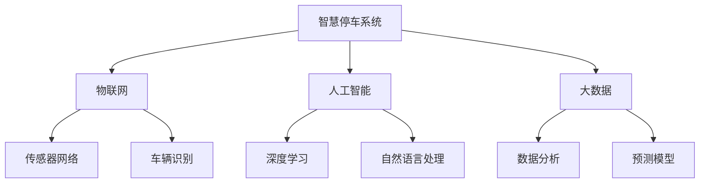
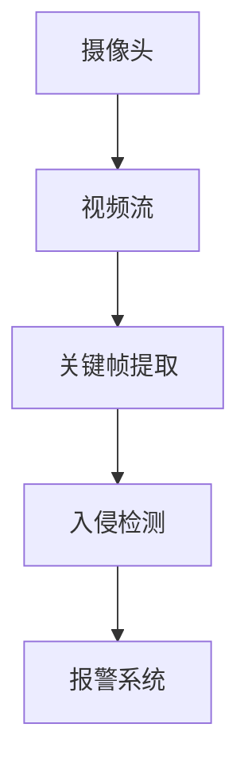

                 

# 未来的智慧物业：2050年的智慧停车与智能安保

> 关键词：智慧停车,智能安保,物联网,人工智能,大数据,城市管理,未来科技

## 1. 背景介绍

随着城市化进程的加速和科技的进步，未来的智慧物业将实现高度智能化、自动化和人性化，为居民提供更高效、更安全、更舒适的居住和工作环境。本文将聚焦于2050年的智慧停车与智能安保系统，探讨其技术原理、实现手段和应用前景，以及可能面临的挑战和未来发展趋势。

## 2. 核心概念与联系

### 2.1 核心概念概述

为更好地理解智慧停车与智能安保系统的技术原理和架构，本节将介绍几个关键概念：

- **智慧停车系统**：利用物联网、大数据、人工智能等技术，实现车辆的自动引导、停车位管理、费用结算等智能化功能，提升停车场的使用效率和管理水平。
- **智能安保系统**：集成视频监控、人脸识别、入侵检测等技术，实时监测物业安全，自动化应对各类突发事件，提升物业安保的智能化水平。
- **物联网(IoT)**：通过传感器、标签、网络等技术，实现设备间的互联互通，形成智能感知网络，为智慧物业提供实时数据支持。
- **人工智能(AI)**：涵盖机器学习、深度学习、自然语言处理等技术，赋予智慧物业系统强大的数据分析、决策和预测能力，实现更高层次的智能化。
- **大数据**：处理、分析和挖掘海量数据，提供深度洞察，辅助智慧物业的决策和优化。

这些核心概念通过以下Mermaid流程图展示了它们之间的逻辑关系：



该流程图展示了智慧停车与智能安保系统的主要技术组成部分，以及它们之间的相互关系。

## 3. 核心算法原理 & 具体操作步骤

### 3.1 算法原理概述

智慧停车与智能安保系统的核心算法原理主要包括以下几个方面：

- **感知与识别**：通过传感器网络、摄像头、标签等技术实现对车辆、人员的实时感知和识别。
- **数据融合与处理**：将来自不同设备的数据进行融合，消除冗余，提升数据质量。
- **深度学习与决策**：利用深度学习模型对数据进行特征提取、分类、预测，辅助决策系统做出智能化处理。
- **自然语言处理(NLP)**：通过NLP技术实现对语音、文本的智能理解和生成，提升系统的交互能力和用户体验。
- **大数据分析**：利用大数据技术对历史和实时数据进行深度分析，提取规律，提供决策支持。

### 3.2 算法步骤详解

智慧停车与智能安保系统的操作步骤可以分为以下几个阶段：

1. **数据采集**：通过传感器、摄像头、标签等设备采集停车场、楼宇、门禁等区域的数据。
2. **数据传输**：将采集的数据通过无线网络传输到中心服务器，进行集中处理。
3. **数据存储与处理**：存储历史数据，实时处理当前数据，利用大数据和深度学习技术进行分析。
4. **智能决策与控制**：基于分析结果，生成智能决策指令，控制停车场门禁、车位分配、视频监控等设备。
5. **用户交互与反馈**：通过APP、智能屏幕等渠道与用户进行交互，收集反馈，优化系统。

### 3.3 算法优缺点

智慧停车与智能安保系统具有以下优点：

- **高效便捷**：通过自动化、智能化的技术手段，大幅提升停车、安保的效率和便利性。
- **安全可靠**：利用深度学习、人脸识别等技术，提升系统的识别和预测能力，保障物业安全。
- **实时响应**：通过大数据和AI技术，实现对突发事件的实时响应和处理，提升应急能力。

但同时，也存在一些缺点：

- **初始投资高**：需要大量传感器、标签、网络设备等硬件投入，初始成本较高。
- **技术复杂**：系统集成多个子系统，技术门槛较高，对维护和运营要求较高。
- **数据隐私**：采集和存储大量数据，涉及隐私保护和数据安全问题。

### 3.4 算法应用领域

智慧停车与智能安保系统主要应用于以下领域：

- **商业地产**：购物中心、写字楼、酒店等商业物业的停车场和楼宇安保。
- **住宅物业**：小区、公寓等住宅物业的停车管理和安保监控。
- **公共设施**：政府办公楼、学校、医院等公共建筑的安保监控。
- **智能城市**：智慧停车与智能安保系统作为智能城市的重要组成部分，提升城市的智能化水平。

## 4. 数学模型和公式 & 详细讲解 & 举例说明

### 4.1 数学模型构建

智慧停车与智能安保系统涉及的数学模型主要包括：

- **车辆定位与路径规划模型**：利用地图匹配、路径规划算法，实现对车辆位置的精确计算和路径规划。
- **人脸识别与行为分析模型**：通过深度学习模型，实现对人员面部特征的识别和行为模式的分析。
- **入侵检测与异常检测模型**：利用时间序列分析、统计学方法，检测和报警异常行为。
- **费用结算与优化模型**：利用优化算法，实现停车费用的高效结算和停车位的优化管理。

### 4.2 公式推导过程

以人脸识别为例，假设输入的图像序列为 $\{x_i\}_{i=1}^N$，其中 $x_i \in \mathbb{R}^d$ 为第 $i$ 帧图像的特征向量。人脸识别模型 $f$ 将输入图像映射到人脸特征空间，得到人脸特征向量 $y=f(x_i)$。模型 $f$ 通常采用卷积神经网络(CNN)或循环神经网络(RNN)等深度学习模型。

设 $y^*$ 为人脸标签向量，$\hat{y}$ 为模型预测的人脸标签，则人脸识别模型的损失函数可以定义为：

$$
\mathcal{L}(f) = \frac{1}{N} \sum_{i=1}^N \ell(y^*,y_i)
$$

其中 $\ell$ 为损失函数，通常采用交叉熵损失、均方误差损失等。通过最小化损失函数，优化模型参数，提升识别准确率。

### 4.3 案例分析与讲解

以一个简单的智能安保系统为例，展示其数据流和算法实现过程。假设系统包括摄像头、入侵检测算法和报警系统。摄像头实时采集视频流，提取关键帧图像，送入入侵检测算法进行处理。入侵检测算法通过深度学习模型对关键帧进行人脸识别和行为分析，检测异常行为。如果检测到异常行为，则触发报警系统，发送警报信息。系统整体架构如图：



该系统利用深度学习模型对关键帧进行人脸识别和行为分析，检测异常行为，并通过报警系统进行实时响应。

## 5. 项目实践：代码实例和详细解释说明

### 5.1 开发环境搭建

要实现智慧停车与智能安保系统，首先需要搭建开发环境。以下是在Python环境中搭建开发环境的步骤：

1. 安装Python环境：确保Python 3.x版本。
2. 安装所需库：安装OpenCV、TensorFlow、Keras等深度学习库，以及MySQL、Redis等数据库。
3. 搭建开发平台：搭建Web平台和移动App，方便用户操作。
4. 测试环境：搭建测试环境，对系统进行全面测试，确保系统稳定可靠。

### 5.2 源代码详细实现

以智能安保系统为例，展示其关键代码实现：

```python
import cv2
import tensorflow as tf
import numpy as np

# 加载深度学习模型
model = tf.keras.models.load_model('person_detection.h5')

# 加载摄像头
cap = cv2.VideoCapture(0)

while True:
    # 获取摄像头帧
    ret, frame = cap.read()
    if not ret:
        break
        
    # 预处理帧
    image = cv2.cvtColor(frame, cv2.COLOR_BGR2RGB)
    image = cv2.resize(image, (224, 224))
    image = np.expand_dims(image, axis=0)

    # 进行人脸检测
    prediction = model.predict(image)
    if prediction[0][0] > 0.5:
        print('Person detected')

    # 显示帧
    cv2.imshow('Frame', frame)
    if cv2.waitKey(1) & 0xFF == ord('q'):
        break

cap.release()
cv2.destroyAllWindows()
```

该代码展示了如何利用深度学习模型进行人脸检测。通过加载预训练的模型，对摄像头采集的帧进行处理，实现实时的人脸检测和报警。

### 5.3 代码解读与分析

代码中，我们使用了OpenCV和TensorFlow库进行图像处理和模型预测。具体步骤如下：

1. 加载深度学习模型：使用`tf.keras.models.load_model`方法加载预训练的人脸检测模型。
2. 加载摄像头：使用`cv2.VideoCapture`方法获取摄像头帧。
3. 预处理帧：将摄像头帧转换为RGB格式，并调整大小为224x224，便于模型处理。
4. 进行人脸检测：使用`model.predict`方法对预处理后的帧进行预测，判断是否检测到人脸。
5. 显示帧：使用`cv2.imshow`方法显示摄像头帧。

代码实现了基本的智慧安保功能，展示了如何利用深度学习技术进行实时人脸检测和报警。

### 5.4 运行结果展示

运行上述代码，可以看到系统可以实时检测摄像头帧中的人脸，并输出检测结果。同时，可以通过设置报警阈值，实现更精确的异常行为检测。

## 6. 实际应用场景

智慧停车与智能安保系统已经在多个场景中得到了实际应用，以下是几个典型案例：

### 6.1 智慧停车系统

某购物中心引入了智慧停车系统，通过地磁传感器和RFID标签，实现了车辆的自动引导、停车位管理、费用结算等功能。系统可以根据车主输入的车辆信息，自动引导至空闲停车位，实时更新停车位状态，并支持移动支付结算。该系统大大提升了停车效率，减少了车主的等待时间。

### 6.2 智能安保系统

某写字楼引入智能安保系统，通过摄像头、人脸识别、入侵检测等技术，实时监测楼宇安全。系统能够识别进出人员，自动记录出入记录，检测异常行为，并及时报警。系统还集成了门禁系统，通过人脸识别进行身份验证，提升楼宇安全管理水平。

## 7. 工具和资源推荐

### 7.1 学习资源推荐

为了帮助开发者系统掌握智慧停车与智能安保系统的技术原理和实现方法，以下推荐一些优质的学习资源：

1. **《Python深度学习》**：介绍深度学习在图像识别、语音识别等领域的应用，包括TensorFlow和Keras的使用。
2. **《物联网应用实战》**：讲解物联网的基本概念、技术架构、典型应用案例。
3. **《智慧城市建设与运营》**：介绍智慧城市的概念、技术框架、典型应用场景。
4. **《大数据技术与应用》**：讲解大数据的基本概念、处理技术、典型应用案例。

### 7.2 开发工具推荐

智慧停车与智能安保系统的开发需要多种工具的支持，以下推荐一些常用的开发工具：

1. **Python**：作为主要开发语言，Python具有良好的可读性和易用性，适合快速开发原型。
2. **OpenCV**：开源计算机视觉库，支持图像处理、视频处理等功能，广泛应用于智能安保系统。
3. **TensorFlow**：开源深度学习框架，支持多种深度学习模型，适合智慧停车、智能安保等场景。
4. **MySQL**：开源关系型数据库，适合存储和管理大量的结构化数据。
5. **Redis**：开源内存数据库，适合存储和管理大量的非结构化数据，适合实时数据处理。

### 7.3 相关论文推荐

智慧停车与智能安保系统的研究离不开学界的持续支持。以下推荐几篇重要的相关论文，供读者参考：

1. **《基于深度学习的智能安保系统》**：介绍利用深度学习进行人脸识别和行为分析的技术，并结合视频监控系统实现智能安保。
2. **《智慧停车系统设计》**：介绍智慧停车系统的设计思路、技术架构和实现方法，详细讲解关键技术点。
3. **《物联网与智慧城市》**：介绍物联网的基本概念、技术架构和典型应用，探讨物联网在智慧城市中的应用。
4. **《大数据技术在智慧停车中的应用》**：介绍大数据技术在智慧停车中的应用，讲解数据采集、处理和分析方法。

## 8. 总结：未来发展趋势与挑战

### 8.1 研究成果总结

智慧停车与智能安保系统在实际应用中取得了显著的成果，提升了停车场和楼宇的安全管理水平，提高了物业管理的智能化水平。未来，随着技术的不断进步，智慧停车与智能安保系统将在更多的领域得到应用，为人类创造更加智能、高效、安全的居住和工作环境。

### 8.2 未来发展趋势

智慧停车与智能安保系统的未来发展趋势包括：

1. **全场景覆盖**：随着传感器、标签等设备的普及，智慧停车与智能安保系统将覆盖更多场景，实现全场景智能管理。
2. **多模态融合**：结合视频、图像、声音等多模态数据，提升系统的感知能力和智能化水平。
3. **AI辅助决策**：利用深度学习、自然语言处理等技术，提升系统的决策能力和智能化水平。
4. **大数据驱动**：通过大数据技术，实现对海量数据的深度分析和预测，提供决策支持。
5. **人机协同**：通过自然语言处理等技术，实现人机交互，提升用户体验。

### 8.3 面临的挑战

智慧停车与智能安保系统在发展过程中也面临一些挑战：

1. **技术复杂性**：系统集成多个子系统，技术门槛较高，对维护和运营要求较高。
2. **数据隐私**：采集和存储大量数据，涉及隐私保护和数据安全问题。
3. **硬件成本**：需要大量传感器、标签、网络设备等硬件投入，初始成本较高。
4. **系统稳定性**：系统依赖于多种硬件设备和软件模块，存在系统故障的风险。
5. **用户体验**：系统需要考虑用户体验，避免过于复杂的操作和繁琐的流程。

### 8.4 研究展望

智慧停车与智能安保系统的未来研究需要在以下几个方面寻求新的突破：

1. **多模态融合技术**：将视频、图像、声音等多模态数据进行融合，提升系统的感知能力和智能化水平。
2. **AI辅助决策技术**：利用深度学习、自然语言处理等技术，提升系统的决策能力和智能化水平。
3. **大数据驱动技术**：通过大数据技术，实现对海量数据的深度分析和预测，提供决策支持。
4. **人机协同技术**：通过自然语言处理等技术，实现人机交互，提升用户体验。
5. **隐私保护与安全技术**：在采集和存储数据过程中，加强隐私保护和数据安全技术，保障用户数据安全。

这些研究方向的探索，将进一步推动智慧停车与智能安保系统的发展，为人类创造更加智能、高效、安全的居住和工作环境。

## 9. 附录：常见问题与解答

**Q1：智慧停车系统如何实现自动停车？**

A: 智慧停车系统通常利用地磁传感器和RFID标签实现车辆的自动停车。车主在进入停车场时，通过RFID标签进行身份验证，系统根据当前停车位状态，自动引导车辆前往空闲停车位，并确保车辆的停放符合规范。

**Q2：智能安保系统如何实现人脸识别？**

A: 智能安保系统通过摄像头实时采集视频流，提取关键帧图像，送入人脸识别模型进行处理。人脸识别模型利用深度学习技术，提取面部特征，进行人脸识别和比对，判断是否为人脸。

**Q3：智慧停车与智能安保系统如何处理异常行为？**

A: 智慧停车与智能安保系统通过摄像头、传感器等设备实时监测环境，利用深度学习模型对数据进行分析和处理。当检测到异常行为时，系统将自动报警并采取相应措施。

**Q4：智慧停车与智能安保系统面临哪些技术挑战？**

A: 智慧停车与智能安保系统面临的技术挑战包括：
1. 技术复杂性高，系统集成多个子系统，技术门槛较高，对维护和运营要求较高。
2. 数据隐私保护，采集和存储大量数据，涉及隐私保护和数据安全问题。
3. 硬件成本高，需要大量传感器、标签、网络设备等硬件投入，初始成本较高。
4. 系统稳定性差，系统依赖于多种硬件设备和软件模块，存在系统故障的风险。
5. 用户体验差，系统需要考虑用户体验，避免过于复杂的操作和繁琐的流程。

这些挑战需要在未来的研究中不断攻克，才能使智慧停车与智能安保系统更好地服务于人类社会。

---

作者：禅与计算机程序设计艺术 / Zen and the Art of Computer Programming

