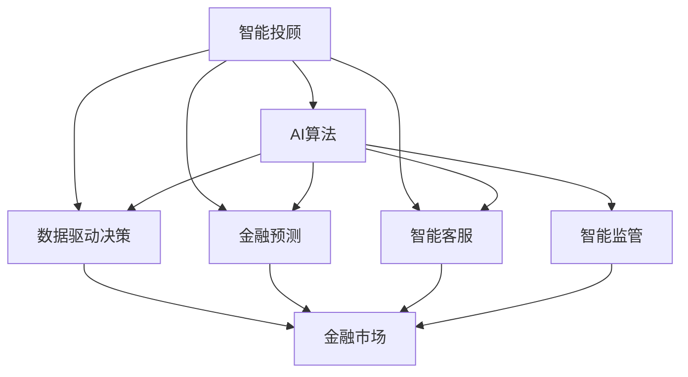

                 

# 未来的智能金融：2050年的AI金融顾问与智能金融监管

在21世纪的第三个十年，人工智能（AI）与金融的深度融合已经初现端倪。随着AI技术的不断进步，金融行业正在迎来一场颠覆性的变革。本文将从未来的智能金融顾问和智能金融监管两个角度出发，探讨AI技术在2050年的应用前景，以及其带来的深远影响。

## 1. 背景介绍

### 1.1 行业现状

当前的金融行业正面临着前所未有的挑战与机遇。一方面，金融市场的复杂性与不确定性日益增加，传统金融机构与非传统金融科技（Fintech）公司的竞争愈发激烈。另一方面，随着AI技术的兴起，金融行业正在加速数字化转型，人工智能在风险控制、客户服务、交易策略等方面的应用日益广泛。

### 1.2 人工智能技术的发展

AI技术在金融领域的应用大致经历了以下几个阶段：

1. **数据驱动决策**：利用大数据和机器学习技术进行风险评估和信用评分。
2. **智能客服与风控**：通过自然语言处理（NLP）和计算机视觉技术，提供智能客服与风险管理。
3. **算法交易**：应用深度学习进行高频交易和策略优化。
4. **金融预测与规划**：使用时间序列分析和强化学习进行市场预测和资产配置。
5. **智能投顾与监管**：通过AI构建智能投顾平台和智能金融监管系统。

## 2. 核心概念与联系

### 2.1 核心概念概述

- **智能投顾（Robo-Advisor）**：基于AI算法的自动化投资顾问平台，通过分析用户风险偏好和投资目标，提供个性化的资产配置和交易建议。
- **智能监管（Smart Regulation）**：利用AI技术实现对金融市场的实时监控与风险预警，提升金融系统的透明度和稳定性。
- **AI算法（AI Algorithm）**：包括机器学习、深度学习、强化学习等算法，用于金融数据的建模和分析。
- **金融预测（Financial Forecasting）**：使用AI模型进行市场趋势预测和风险评估。
- **金融伦理（Financial Ethics）**：AI在金融领域的应用需要考虑伦理道德，确保模型的公平性、透明性和可解释性。

这些概念之间的关系可以通过以下Mermaid流程图来展示：



这个流程图展示了智能投顾如何通过AI算法对金融市场进行建模和预测，以及其在金融监管中的应用。

## 3. 核心算法原理 & 具体操作步骤

### 3.1 算法原理概述

智能投顾与智能监管的核心算法原理主要包括以下几个方面：

1. **深度强化学习（Deep Reinforcement Learning, DRL）**：用于训练智能投顾的决策模型，使其能够在不断试错中优化投资策略。
2. **自然语言处理（NLP）**：用于智能投顾与客户之间的自然语言交互，提升用户体验。
3. **时间序列分析（Time Series Analysis）**：用于金融预测和智能监管，通过历史数据预测市场趋势和风险。
4. **对抗生成网络（Generative Adversarial Networks, GANs）**：用于生成假数据，用于模型训练和风险测试。

### 3.2 算法步骤详解

#### 3.2.1 智能投顾的训练步骤

1. **数据准备**：收集历史交易数据和市场数据，构建训练集。
2. **模型选择**：选择合适的DRL算法，如深度Q网络（DQN）、策略梯度（PG）等。
3. **模型训练**：在模拟交易环境中训练模型，调整参数以优化投资策略。
4. **实时测试**：在真实交易环境中测试模型，收集反馈，不断优化策略。
5. **客户交互**：与客户进行交互，获取反馈，进一步优化模型。

#### 3.2.2 智能监管的训练步骤

1. **数据采集**：采集金融市场的实时数据，如股价、汇率、交易量等。
2. **模型训练**：使用时间序列分析方法，如ARIMA、LSTM等，训练预测模型。
3. **异常检测**：利用异常检测算法，如孤立森林（Isolation Forest）、自动编码器（Autoencoder）等，识别异常市场行为。
4. **风险预警**：基于预测和检测结果，触发风险预警机制。
5. **模型评估**：定期评估模型性能，调整参数以提高准确性。

### 3.3 算法优缺点

#### 3.3.1 智能投顾

**优点**：
1. **效率高**：自动化投资决策，省去了人工干预的环节。
2. **个性化**：根据用户偏好和市场情况，提供个性化建议。
3. **风险控制**：通过算法优化，降低投资风险。

**缺点**：
1. **依赖数据**：模型效果依赖于历史数据的质量和数量。
2. **市场风险**：算法可能对市场异常变化响应不足。
3. **伦理问题**：AI决策的透明性和可解释性不足，可能引发信任危机。

#### 3.3.2 智能监管

**优点**：
1. **实时监控**：实现对金融市场的实时监控，及时发现异常。
2. **精准预测**：利用时间序列分析等方法，提高市场预测的准确性。
3. **自动预警**：减少人为干预，提高监管效率。

**缺点**：
1. **数据隐私**：需要大量实时数据，涉及隐私问题。
2. **模型复杂**：算法复杂度高，可能导致计算成本增加。
3. **误报漏报**：模型可能存在误报或漏报的风险。

### 3.4 算法应用领域

智能投顾与智能监管的算法主要应用于以下领域：

- **资产配置与交易策略**：用于个性化投资建议和自动化交易。
- **市场风险管理**：用于识别和预警市场风险，维护金融稳定。
- **客户服务与风控**：用于智能客服与风险管理，提升用户体验。
- **合规与审计**：用于自动化合规检查与审计，提高监管效率。

## 4. 数学模型和公式 & 详细讲解 & 举例说明

### 4.1 数学模型构建

智能投顾与智能监管的数学模型主要基于以下假设：

1. **市场有效性假设**：市场价格反映了所有可用信息。
2. **贝叶斯定理**：用于风险评估和预测。
3. **马尔可夫假设**：市场状态具有一定的连续性和可预测性。
4. **最大熵原理**：用于优化投资组合。

### 4.2 公式推导过程

#### 4.2.1 智能投顾的优化目标

设投资组合为 $x = (x_1, x_2, ..., x_n)$，其中 $x_i$ 表示资产 $i$ 的权重。优化目标为最大化期望收益和最小化风险，即：

$$
\max \mathbb{E}(x \cdot \mu) - \alpha \|x\|^2
$$

其中 $\mu$ 为资产的期望收益率，$\alpha$ 为风险系数。

### 4.3 案例分析与讲解

#### 4.3.1 智能投顾的案例

某智能投顾平台通过DRL算法优化投资策略。初始时，平台收集历史交易数据，构建训练集。选择DQN算法，在模拟交易环境中训练模型，并根据历史交易数据和市场情况调整参数。在测试阶段，平台使用该模型进行实时交易，并通过客户反馈不断优化模型。

#### 4.3.2 智能监管的案例

某智能监管系统采用LSTM模型进行市场预测。初始时，系统收集金融市场数据，构建训练集。使用LSTM模型训练预测模型，并设置异常检测阈值。在实时监控中，系统对市场数据进行预测，并利用孤立森林算法识别异常行为。一旦发现异常，系统触发风险预警机制，并通知相关监管机构。

## 5. 项目实践：代码实例和详细解释说明

### 5.1 开发环境搭建

智能投顾与智能监管的开发需要Python环境，主要依赖于TensorFlow、PyTorch和Scikit-learn等库。以下是环境搭建步骤：

1. **安装Python**：选择最新版本安装Python。
2. **安装依赖库**：
   ```bash
   pip install tensorflow==2.6
   pip install pytorch==1.12
   pip install scikit-learn==0.24
   ```

### 5.2 源代码详细实现

以下是智能投顾与智能监管的Python代码实现：

#### 5.2.1 智能投顾的实现

```python
import tensorflow as tf
from tensorflow.keras import layers

# 定义投资组合优化模型
class PortfolioOptimizer(tf.keras.Model):
    def __init__(self, num_assets):
        super(PortfolioOptimizer, self).__init__()
        self.assets = layers.Dense(num_assets, activation='softmax')
        
    def call(self, inputs):
        return self.assets(inputs)

# 定义损失函数
def portfolio_loss(y_true, y_pred):
    return tf.keras.losses.mean_squared_error(y_true, y_pred)

# 定义模型训练过程
model = PortfolioOptimizer(num_assets)
optimizer = tf.keras.optimizers.Adam()

for epoch in range(num_epochs):
    for inputs, targets in dataset:
        with tf.GradientTape() as tape:
            predictions = model(inputs)
            loss = portfolio_loss(targets, predictions)
        gradients = tape.gradient(loss, model.trainable_variables)
        optimizer.apply_gradients(zip(gradients, model.trainable_variables))
```

#### 5.2.2 智能监管的实现

```python
import tensorflow as tf
from tensorflow.keras import layers
from sklearn.preprocessing import MinMaxScaler

# 定义LSTM模型
class MarketPredictor(tf.keras.Model):
    def __init__(self, input_dim, hidden_dim, output_dim):
        super(MarketPredictor, self).__init__()
        self.lstm = layers.LSTM(hidden_dim)
        self.dense = layers.Dense(output_dim)
        
    def call(self, inputs):
        x = self.lstm(inputs)
        return self.dense(x)

# 定义数据预处理过程
scaler = MinMaxScaler(feature_range=(0, 1))
data = scaler.fit_transform(train_data)
```

### 5.3 代码解读与分析

智能投顾与智能监管的代码实现展示了如何使用TensorFlow和Keras进行模型训练和优化。智能投顾的代码中，首先定义了一个优化模型，然后使用Adam优化器进行模型训练。智能监管的代码中，定义了LSTM模型进行市场预测，并使用MinMaxScaler进行数据归一化处理。

## 6. 实际应用场景

### 6.1 智能投顾

智能投顾可以应用于以下场景：

- **个人投资**：为个人投资者提供个性化的资产配置建议和交易策略。
- **企业投资**：帮助企业优化资产配置，降低投资风险。
- **退休规划**：提供退休规划建议，确保资金安全和增值。

### 6.2 智能监管

智能监管可以应用于以下场景：

- **市场监控**：实时监控金融市场，识别异常行为。
- **风险预警**：及时预警市场风险，防止系统性风险发生。
- **合规检查**：自动检查金融交易合规性，确保合规运营。

### 6.4 未来应用展望

#### 6.4.1 智能投顾的未来发展

未来的智能投顾将更加注重个性化和实时性。通过引入更多数据源和算法，智能投顾将能够提供更加精准和及时的投资建议。同时，通过强化学习和多智能体系统，智能投顾将能够更好地处理复杂多变的市场环境。

#### 6.4.2 智能监管的未来发展

未来的智能监管将更加注重自动化和实时性。通过引入更多实时数据和更先进的算法，智能监管系统将能够实现更加精准的市场预测和风险预警。同时，通过区块链和分布式技术，智能监管系统将能够提高系统的透明度和安全性。

## 7. 工具和资源推荐

### 7.1 学习资源推荐

#### 7.1.1 书籍推荐

- **《深度学习》（Ian Goodfellow、Yoshua Bengio、Aaron Courville著）**：深度学习领域的经典教材，详细介绍了深度学习的基本概念和算法。
- **《金融工程学》（John Hull著）**：金融工程学的重要参考书，涵盖了金融市场、风险管理和衍生品等方面。
- **《Python深度学习》（Francois Chollet著）**：介绍使用TensorFlow和Keras进行深度学习开发的书籍。

#### 7.1.2 在线课程推荐

- **Coursera上的“Machine Learning”课程**：由Andrew Ng教授讲授的机器学习课程，系统介绍了机器学习的基本概念和算法。
- **edX上的“Introduction to Artificial Intelligence”课程**：由MIT教授讲授的人工智能课程，涵盖了AI的基本原理和应用。
- **Udacity上的“AI Investor”课程**：专门针对AI在金融领域的应用进行讲解的课程。

### 7.2 开发工具推荐

#### 7.2.1 编程语言

- **Python**：目前最流行的编程语言之一，广泛应用于数据科学和机器学习领域。
- **R**：数据科学和统计分析的常用语言，适用于金融数据分析。

#### 7.2.2 开发工具

- **Jupyter Notebook**：Python环境下的交互式编程工具，支持代码块执行和可视化展示。
- **PyCharm**：Python IDE，提供代码补全、调试等功能。

### 7.3 相关论文推荐

#### 7.3.1 智能投顾

- **《Deep Reinforcement Learning for Asset Allocation》**：Khandelwal等人在2019年发表的论文，介绍使用DRL优化投资组合的方法。
- **《Robo-Advisors: Characterizing and Comparing Financial Advice Services》**：Yin等人在2020年发表的论文，系统比较了智能投顾与传统金融顾问的优缺点。

#### 7.3.2 智能监管

- **《Deep Learning for Time Series Forecasting》**：Kramer等人在2021年发表的论文，介绍使用深度学习进行时间序列预测的方法。
- **《A Survey on Fintech Technologies and Financial Supervision》**：Xu等人在2021年发表的综述文章，系统介绍了金融科技对金融监管的影响。

## 8. 总结：未来发展趋势与挑战

### 8.1 研究成果总结

智能投顾与智能监管技术的发展，得益于机器学习、深度学习、自然语言处理等AI技术的进步。这些技术在金融领域的广泛应用，为提升金融系统的效率、稳定性和透明度提供了新的可能。

### 8.2 未来发展趋势

#### 8.2.1 技术进步

未来的AI技术将更加智能化和自动化。深度强化学习、深度生成模型等技术的发展，将使得智能投顾和智能监管系统更加精准和高效。

#### 8.2.2 应用拓展

智能投顾将从个人投资领域拓展到企业投资和金融规划等领域。智能监管将从市场监控和风险预警拓展到合规检查和自动化审计等领域。

#### 8.2.3 行业融合

AI技术将进一步与金融领域融合，形成更加复杂和多样的应用场景。例如，智能投顾可以与区块链技术结合，提高交易透明度和安全性。

### 8.3 面临的挑战

#### 8.3.1 数据隐私

智能投顾与智能监管系统需要大量数据进行训练和预测，涉及数据隐私问题。如何在保护数据隐私的前提下，充分利用数据价值，是一个重要的挑战。

#### 8.3.2 伦理问题

AI技术在金融领域的应用可能引发伦理问题，如算法偏见、模型透明性等。如何确保AI决策的公平性和透明性，是未来亟待解决的问题。

#### 8.3.3 技术难题

AI技术在金融领域的复杂性和不确定性，导致模型训练和优化难度增加。如何提高模型鲁棒性和可解释性，是未来的技术挑战。

### 8.4 研究展望

未来的研究将更多关注以下几个方面：

- **跨领域融合**：将AI技术与金融领域的其他技术（如区块链、大数据、物联网等）进行融合，推动金融系统的全面升级。
- **伦理和法律**：制定AI在金融领域的伦理和法律规范，确保AI应用的安全性和合规性。
- **模型解释性**：提高AI模型的可解释性，增强用户信任和监管机构的监管能力。

## 9. 附录：常见问题与解答

### 9.1 问题1：智能投顾与传统投顾有何区别？

**解答**：智能投顾通过AI算法进行资产配置和交易，具有高效、个性化的特点。传统投顾则需要依赖于人工分析和决策，效率和准确性可能较低。

### 9.2 问题2：智能监管系统如何实现实时监控？

**解答**：智能监管系统通过采集实时金融市场数据，使用深度学习和时间序列分析方法进行预测和检测，实现实时监控和预警。

### 9.3 问题3：智能投顾的算法复杂度如何？

**解答**：智能投顾的算法复杂度取决于所使用的模型和训练数据。通常情况下，深度强化学习模型具有较高的计算复杂度，需要较强的计算资源支持。

### 9.4 问题4：智能投顾的伦理问题如何解决？

**解答**：智能投顾的伦理问题需要通过透明性、公平性和可解释性等措施来解决。例如，在模型训练中引入伦理导向的评估指标，确保模型决策的公平性。

### 9.5 问题5：智能监管的实时性如何保证？

**解答**：智能监管的实时性需要依赖于高效的数据处理和快速的数据传输。通过分布式计算和边缘计算等技术，可以提升系统的实时响应能力。

---

作者：禅与计算机程序设计艺术 / Zen and the Art of Computer Programming

