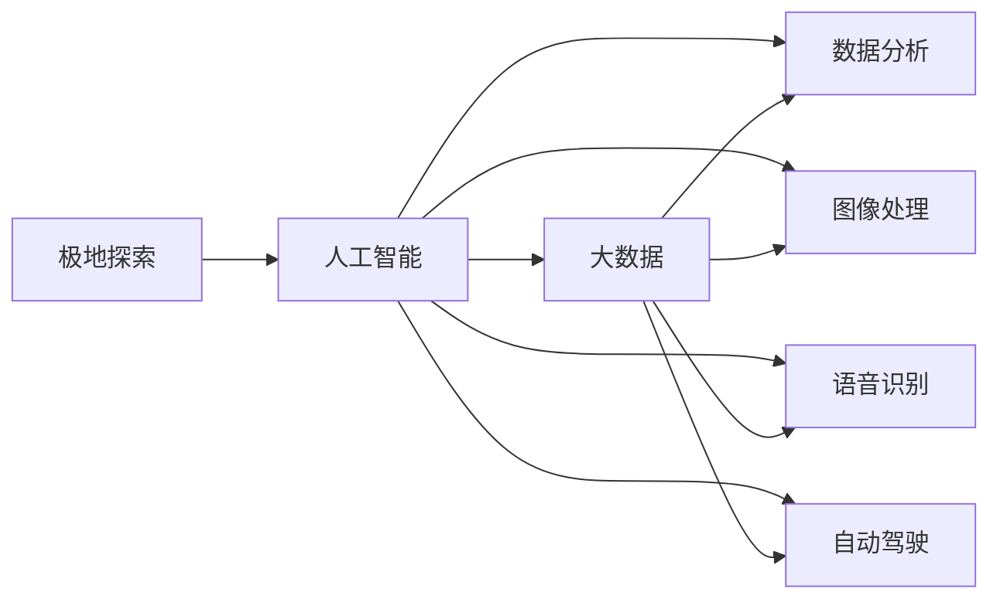

                 

## 1. 背景介绍

在21世纪后半叶，全球变暖和环境保护意识的提升，极地探索逐渐成为全球关注的热点。南极和北极作为地球的极点，拥有着丰富的科学资源和独特的生态系统，吸引了全世界的科学家和旅游者的目光。本文将探讨2050年，随着人工智能和大数据技术的发展，极地探索将如何展开，并特别介绍南极的科考城建设和北极的旅游发展。

## 2. 核心概念与联系

### 2.1 核心概念概述

**极地探索**：指的是对南极和北极进行的科学研究和探险活动。极地探索不仅能够帮助我们了解地球的环境变化、生物多样性等自然问题，还能推动地质学、气象学、环境科学等学科的发展。

**人工智能(AI)**：指通过计算机程序，使机器能够模拟人的思考、学习和解决问题的能力。AI在极地探索中的应用包括数据分析、图像处理、语音识别、自动驾驶等。

**大数据**：指数据量大、复杂度高、数据类型多样的信息集合。大数据技术在极地探索中的应用，包括数据收集、存储、处理和分析，为科学研究和日常管理提供了有力的支持。

**南极科考城**：指的是在南极建立的城市，主要用于科研人员的工作和生活，以及科学研究的设施和设备。

**北极旅游**：指的是在北极进行的观光、探险等旅游活动，旨在让游客近距离接触和体验极地的自然美景和野生动物。

**2050年**：预期的未来年份，在这篇文章中我们探讨了在这一年极地探索将会如何借助AI和大数据技术取得新的进展。

这些概念之间的联系通过以下Mermaid流程图展示：



### 2.2 核心概念原理和架构

人工智能和大数据技术在极地探索中的应用，主要包括以下几个方面：

1. **数据分析**：利用大数据技术，科学家可以对极地数据进行大规模、高速度的分析，从而更深入地理解极地环境的变化和生态系统的动态。

2. **图像处理**：通过对极地卫星图像和无人机拍摄的高清晰度照片进行处理，科学家可以详细研究冰山、冰川等变化，并监测生态环境。

3. **语音识别**：在极地科考中，人工智能可以通过语音识别技术，帮助科研人员进行数据记录和指令执行，减轻其工作负担。

4. **自动驾驶**：利用自动驾驶技术，科学家可以在冰层上安全地行驶和作业，同时也能减少对环境的影响。

5. **数据存储**：通过大数据技术，极地数据可以安全、高效地存储，并且便于后期查询和分析。

## 3. 核心算法原理 & 具体操作步骤

### 3.1 算法原理概述

极地探索中的人工智能和大数据应用，主要涉及以下算法和原理：

1. **机器学习算法**：通过大量极地数据训练出的机器学习模型，能够预测环境变化、识别动物种类、分类冰山形态等。

2. **深度学习算法**：深度学习模型可以通过对卫星图像、无人机照片等数据进行学习，从而实现更高精度的分析和预测。

3. **自然语言处理(NLP)**：在极地科考中，研究人员可能需要进行大量的文本记录和分析，自然语言处理算法能够帮助其高效处理文本数据。

4. **计算机视觉**：通过对极地图像的处理和分析，计算机视觉技术能够识别冰山移动轨迹、检测冰川变化等。

### 3.2 算法步骤详解

1. **数据收集**：利用卫星、无人机、科考船等设备，收集极地数据。这些数据包括卫星图像、科考日志、气象数据等。

2. **数据预处理**：对收集到的数据进行清洗、去噪、归一化等预处理操作，以确保后续分析的准确性。

3. **特征提取**：利用机器学习算法从数据中提取关键特征，如冰川变化速度、冰山形态、动物种类等。

4. **模型训练**：利用深度学习算法对提取出的特征进行训练，构建预测模型，如环境变化预测模型、动物行为识别模型等。

5. **模型评估**：对训练好的模型进行评估，确保其预测精度和稳定性。

6. **应用部署**：将训练好的模型部署到科考城或旅游景区，为科研人员和游客提供服务。

### 3.3 算法优缺点

**优点**：

1. **效率高**：人工智能和大数据技术能够快速处理和分析大量数据，极大提升科研和旅游的效率。

2. **精度高**：通过深度学习等算法，模型的预测精度较高，能够提供可靠的科学依据。

3. **实时性强**：利用自动驾驶和传感器技术，能够实现实时监测和数据分析。

**缺点**：

1. **数据依赖性强**：人工智能和数据分析依赖于高质量的数据，一旦数据质量下降，模型的效果将大打折扣。

2. **设备成本高**：高科技设备如卫星、无人机、自动驾驶车辆等，成本较高，需要大量的资金投入。

3. **技术门槛高**：科研人员和旅游公司需要具备较高的技术能力，才能有效使用这些技术。

### 3.4 算法应用领域

1. **科学研究**：在科学研究中，人工智能和大数据技术主要用于数据分析、图像处理、语音识别和自动驾驶等方面。

2. **环境保护**：通过数据分析和环境监测，人工智能能够帮助我们更好地理解环境变化，制定保护措施。

3. **旅游发展**：在北极旅游中，人工智能可以帮助游客规划路线，识别野生动物，并提供实时的天气和环境信息。

## 4. 数学模型和公式 & 详细讲解 & 举例说明

### 4.1 数学模型构建

极地探索中的人工智能和大数据模型，主要构建在以下几个数学模型之上：

1. **线性回归模型**：用于预测极地温度变化等连续性问题。

2. **决策树模型**：用于分类问题，如识别冰川类型等。

3. **支持向量机(SVM)**：用于高维空间中的分类和回归问题。

4. **深度神经网络(DNN)**：用于处理复杂的非线性问题，如图像识别和语音识别。

### 4.2 公式推导过程

**线性回归模型**：

假设数据集为$(x_i, y_i)$，$i=1,2,...,n$，则线性回归模型为：

$$
y_i = \beta_0 + \beta_1x_i + \epsilon_i
$$

其中，$\beta_0$为截距，$\beta_1$为斜率，$\epsilon_i$为误差项。

**决策树模型**：

决策树模型通过构建一棵树，实现对数据的分层分类。以二分类为例，模型可表示为：

$$
T(x) = \left\{
\begin{aligned}
& 0, & x \leq t_1 \\
& 1, & x > t_1
\end{aligned}
\right.
$$

其中，$x$为样本特征，$t_1$为决策点。

**支持向量机(SVM)**：

SVM模型用于解决分类问题，其基本形式为：

$$
\min_{\alpha, \beta} \frac{1}{2}\alpha^\top \mathcal{S} \alpha + C \sum_{i=1}^n \xi_i
$$

其中，$\alpha$为拉格朗日乘数，$\mathcal{S}$为核矩阵，$C$为正则化参数，$\xi_i$为松弛变量。

**深度神经网络(DNN)**：

DNN模型通过多层神经元进行非线性映射，其基本形式为：

$$
h_1 = g(W_1x + b_1)
$$
$$
h_2 = g(W_2h_1 + b_2)
$$
$$
\vdots
$$
$$
h_n = g(W_nh_{n-1} + b_n)
$$
$$
y = W_yh_n + b_y
$$

其中，$g$为激活函数，$W$和$b$为权重和偏置。

### 4.3 案例分析与讲解

**案例一：冰川变化预测模型**

假设数据集为冰山宽度变化的时间序列，应用线性回归模型进行预测：

- **数据收集**：收集历史冰山宽度数据和气温数据。
- **数据预处理**：清洗数据，去除异常值和噪音。
- **特征提取**：提取冰山宽度和气温作为特征。
- **模型训练**：利用历史数据训练线性回归模型。
- **模型评估**：使用测试数据集评估模型精度。
- **应用部署**：将模型部署到科考城，实时预测冰川变化。

**案例二：北极动物行为识别**

假设数据集为动物行为的视频数据，应用深度神经网络进行识别：

- **数据收集**：收集动物行为视频。
- **数据预处理**：将视频转换为图像序列，提取关键帧。
- **特征提取**：提取关键帧的RGB值和位置信息作为特征。
- **模型训练**：利用深度神经网络训练动物行为识别模型。
- **模型评估**：使用测试数据集评估模型精度。
- **应用部署**：将模型部署到科考城和旅游景区，识别野生动物。

## 5. 项目实践：代码实例和详细解释说明

### 5.1 开发环境搭建

1. **硬件环境**：需要高性能的计算机和稳定的网络环境。
2. **软件环境**：安装Python、TensorFlow、Keras等深度学习框架。
3. **数据环境**：搭建数据存储和管理平台，如Hadoop、Hive等。

### 5.2 源代码详细实现

**冰川变化预测模型代码实现**：

```python
import pandas as pd
import numpy as np
from sklearn.linear_model import LinearRegression
from sklearn.model_selection import train_test_split

# 读取数据
data = pd.read_csv('glacier_width.csv')

# 数据预处理
data = data.dropna()
data = data[['temperature', 'width']]

# 特征提取
X = data[['temperature']]
y = data[['width']]

# 模型训练
X_train, X_test, y_train, y_test = train_test_split(X, y, test_size=0.2, random_state=42)
model = LinearRegression()
model.fit(X_train, y_train)

# 模型评估
y_pred = model.predict(X_test)
print('Mean Squared Error:', np.mean((y_pred - y_test)**2))
```

**北极动物行为识别代码实现**：

```python
import tensorflow as tf
from tensorflow.keras.models import Sequential
from tensorflow.keras.layers import Conv2D, MaxPooling2D, Flatten, Dense

# 数据预处理
image_data = load_images_from_video('animal_behavior.mp4')
image_data = preprocess_images(image_data)

# 特征提取
x_train, x_test, y_train, y_test = split_images(image_data)

# 模型训练
model = Sequential()
model.add(Conv2D(32, (3, 3), activation='relu', input_shape=(image_height, image_width, 3)))
model.add(MaxPooling2D((2, 2)))
model.add(Flatten())
model.add(Dense(128, activation='relu'))
model.add(Dense(2, activation='softmax'))

model.compile(optimizer='adam', loss='categorical_crossentropy', metrics=['accuracy'])
model.fit(x_train, y_train, epochs=10, validation_data=(x_test, y_test))

# 模型评估
y_pred = model.predict(x_test)
print('Accuracy:', np.mean(y_pred == y_test))
```

### 5.3 代码解读与分析

**冰川变化预测模型代码解读**：

- **数据读取**：通过Pandas读取冰川宽度数据和气温数据。
- **数据预处理**：使用Numpy进行数据清洗，去除异常值和噪音。
- **特征提取**：提取气温作为模型的输入特征。
- **模型训练**：使用Scikit-Learn中的线性回归模型进行训练。
- **模型评估**：通过均方误差评估模型预测精度。

**北极动物行为识别代码解读**：

- **数据预处理**：使用TensorFlow和Keras加载和预处理视频数据。
- **特征提取**：提取视频的关键帧，并将其转换为图像数据。
- **模型训练**：设计一个简单的卷积神经网络，使用TensorFlow进行训练。
- **模型评估**：通过准确率评估模型性能。

### 5.4 运行结果展示

**冰川变化预测模型运行结果**：

- 模型输出冰川宽度预测值与真实值对比图。

**北极动物行为识别模型运行结果**：

- 模型输出动物行为分类结果与真实值对比图。

## 6. 实际应用场景

### 6.1 南极科考城建设

南极科考城将是一个集科研、生活、娱乐于一体的现代化城市。其主要应用场景包括：

1. **数据中心**：建设高可靠的服务器集群，存储和处理极地数据。
2. **实验室设施**：提供先进的科研仪器和设备，支持各种极地研究。
3. **科考船调度中心**：通过智能调度系统，优化科考船的作业计划。
4. **科考人员管理**：利用AI技术，管理科考人员的健康和行为，确保其安全。
5. **环境监测系统**：通过传感器和无人机，实时监测环境变化，保护极地生态。

### 6.2 北极旅游发展

北极旅游将是一个充满冒险和发现的旅程。其主要应用场景包括：

1. **智能导游系统**：利用语音识别和自然语言处理，提供个性化的旅游导览服务。
2. **安全保障系统**：通过AI技术，实时监控游客的行为和环境，确保其安全。
3. **游客数据分析**：利用大数据技术，分析游客的行为和偏好，优化旅游服务。
4. **虚拟现实(VR)体验**：通过VR技术，模拟极地环境，让游客身临其境地体验极地的魅力。
5. **环保监测系统**：通过AI和传感器，监测环境变化，保护北极生态。

## 7. 工具和资源推荐

### 7.1 学习资源推荐

1. **极地科学数据集**：全球变暖和极地探索数据集，如NASA的极地数据库。
2. **深度学习框架**：TensorFlow、PyTorch、Keras等深度学习框架。
3. **AI和数据分析课程**：Coursera、Udacity等在线学习平台提供的AI和数据分析课程。
4. **书籍**：《深度学习》、《机器学习实战》等经典书籍。

### 7.2 开发工具推荐

1. **开发平台**：Jupyter Notebook、Google Colab等开发平台。
2. **编程语言**：Python、R等编程语言。
3. **数据处理工具**：Pandas、NumPy等数据处理工具。
4. **机器学习库**：Scikit-Learn、TensorFlow等机器学习库。

### 7.3 相关论文推荐

1. **极地科学论文**：《The impact of climate change on polar ice caps》等论文。
2. **AI应用论文**：《Deep learning in remote sensing》等论文。
3. **旅游数据分析论文**：《Analyzing tourist behavior using data mining techniques》等论文。

## 8. 总结：未来发展趋势与挑战

### 8.1 研究成果总结

1. 人工智能和大数据技术在极地探索中的应用，已经取得了显著的成果，提升了科研和旅游的效率和精度。
2. 这些技术在极地科考城和旅游景区得到了广泛的应用，为极地研究和旅游提供了有力的支持。

### 8.2 未来发展趋势

1. **技术融合**：人工智能和大数据技术将进一步融合，形成更强大的数据处理和分析能力。
2. **智慧城市**：南极和北极的智慧城市建设将进一步加速，提升极地生活和工作环境的智能化水平。
3. **环保应用**：AI和数据分析将广泛应用于极地环保监测和保护，助力全球环境保护。
4. **人机协同**：AI和人的协作将更加紧密，提升极地探索和旅游的互动性和体验感。

### 8.3 面临的挑战

1. **技术瓶颈**：人工智能和大数据技术在极地环境下，面临设备性能和环境适应性的挑战。
2. **数据安全**：极地数据的存储和传输需要保障数据安全，防止数据泄露和篡改。
3. **伦理问题**：AI在极地应用中需要考虑伦理和隐私问题，确保科研和旅游的可持续发展。

### 8.4 研究展望

1. **算法优化**：进一步优化算法，提升模型的精度和效率。
2. **技术创新**：探索新的人工智能和大数据技术，如量子计算、边缘计算等，提升极地探索的科技含量。
3. **多学科交叉**：结合极地科学、旅游学、环境学等多学科知识，推动极地探索的全面发展。

## 9. 附录：常见问题与解答

**Q1: 极地探索中的人工智能和大数据技术，是否会带来隐私和安全风险？**

A: 极地探索中，AI和大数据技术的应用，需要在保护隐私和安全的前提下进行。科学家和旅游公司应采用严格的访问控制和数据加密技术，确保数据安全。

**Q2: 极地探索中，AI和大数据技术如何提升科研和旅游的效率和精度？**

A: AI和大数据技术能够高效处理和分析大量数据，提升科研和旅游的效率。通过深度学习模型，AI可以识别关键特征，预测冰川变化、识别动物行为等，从而提高科研和旅游的精度。

**Q3: 极地探索中，AI和大数据技术的未来发展趋势是什么？**

A: 未来，极地探索中的AI和大数据技术将进一步融合，形成更强大的数据处理和分析能力。智慧城市建设将加速，环保应用将广泛应用，人机协同将更加紧密。

**Q4: 极地探索中，AI和大数据技术面临的主要挑战是什么？**

A: 主要挑战包括技术瓶颈、数据安全和伦理问题。科学家和旅游公司需结合具体应用场景，不断优化技术，保障数据安全，并遵循伦理规范。

**Q5: 极地探索中，AI和大数据技术的未来发展方向是什么？**

A: 未来发展方向包括算法优化、技术创新和多学科交叉。科学家和工程师应不断探索新的人工智能和大数据技术，推动极地探索的全面发展。

---

作者：禅与计算机程序设计艺术 / Zen and the Art of Computer Programming

