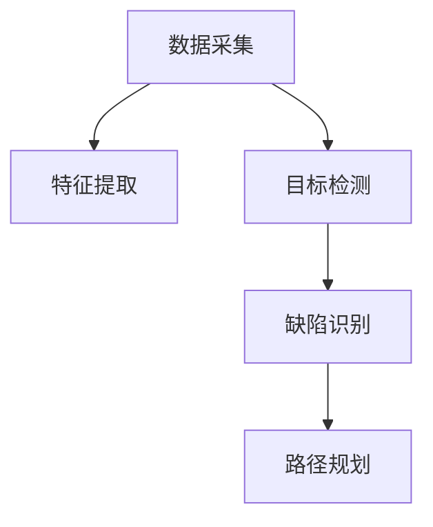

                 

## 1. 背景介绍

### 1.1 问题由来

在制造业、自动化、物流、食品加工等行业，传统的工业流程依赖于人工监控和手动操作，存在效率低下、生产不稳定、质量控制困难等诸多问题。如何通过高效的技术手段实现工业流程的优化，提升生产效率和产品质量，成为当前工业界的重要课题。

近年来，随着机器视觉技术的飞速发展，机器视觉在工业流程优化中的应用成为了热点。通过机器视觉系统对生产现场的实时监控，实现对产品质量、设备运行状态、物流状态等的自动检测和判断，能够极大提高工业流程的自动化水平，降低人工成本，提高生产效率。

### 1.2 问题核心关键点

机器视觉在工业流程优化中的核心关键点包括：

- 数据采集：通过摄像头、传感器等设备获取生产现场的图像、视频、数据等信息。
- 特征提取：对采集的数据进行预处理、分割、滤波等操作，提取有用的特征。
- 目标检测：通过深度学习模型，在图像中检测出特定的物体或区域，并给出其位置和大小。
- 缺陷识别：对检测出的物体进行分类，判断是否存在缺陷或异常。
- 路径规划：根据缺陷位置，制定最优的路径进行干预和调整。
- 实时优化：实时监控和调整生产流程，及时发现并解决生产问题。

这些关键点构成了机器视觉在工业流程优化中的基本框架，通过这些技术手段，可以实现对生产流程的全生命周期管理，提升生产效率和产品质量。

## 2. 核心概念与联系

### 2.1 核心概念概述

为更好地理解机器视觉在工业流程优化中的应用，本节将介绍几个密切相关的核心概念：

- 机器视觉：通过使用摄像机、摄像头等光学器件和电子、计算机技术，获取和处理一个客观场景的三维视觉信息，并通过图像处理、计算机视觉等技术手段，对场景中的目标对象进行检测、识别、测量、跟踪、定位等操作。
- 深度学习：一种基于神经网络的学习范式，通过对大量数据的学习，自动提取特征，进行目标分类、图像分割、目标检测等任务。
- 目标检测：在图像中识别和定位特定的物体或区域，常用的方法包括RCNN、Fast R-CNN、Faster R-CNN、YOLO、SSD等。
- 特征提取：从原始图像中提取有用的特征，常用的方法包括SIFT、HOG、CNN等。
- 缺陷识别：对检测出的物体进行分类，判断是否存在缺陷或异常，常用的方法包括阈值法、SVM、神经网络等。
- 路径规划：根据缺陷位置，制定最优的路径进行干预和调整，常用的方法包括A*、D*、RRT等。

这些核心概念之间的逻辑关系可以通过以下Mermaid流程图来展示：



这个流程图展示了一组基本的工业视觉流程：

1. 采集生产现场的图像、视频等数据。
2. 对采集到的数据进行预处理和分割，提取有用的特征。
3. 使用深度学习模型，检测出图像中的特定物体或区域。
4. 对检测出的物体进行分类，判断是否存在缺陷或异常。
5. 根据检测结果，制定最优路径进行干预和调整。

这些关键概念共同构成了机器视觉在工业流程优化中的核心技术框架，通过理解和应用这些技术，可以实现对工业流程的全生命周期管理。

## 3. 核心算法原理 & 具体操作步骤

### 3.1 算法原理概述

机器视觉在工业流程优化中，通过深度学习等技术手段，实现对生产现场的实时监控和自动检测。核心算法原理主要包括以下几个步骤：

1. 数据采集：使用摄像头、传感器等设备获取生产现场的图像、视频、数据等信息。
2. 特征提取：对采集到的数据进行预处理、分割、滤波等操作，提取有用的特征。
3. 目标检测：通过深度学习模型，在图像中检测出特定的物体或区域，并给出其位置和大小。
4. 缺陷识别：对检测出的物体进行分类，判断是否存在缺陷或异常。
5. 路径规划：根据缺陷位置，制定最优的路径进行干预和调整。
6. 实时优化：实时监控和调整生产流程，及时发现并解决生产问题。

这些步骤通过深度学习模型和优化算法，可以自动完成，实现对工业流程的实时优化。

### 3.2 算法步骤详解

以下以目标检测和缺陷识别为例，详细介绍机器视觉在工业流程优化中的应用流程：

**目标检测步骤：**

1. 数据准备：收集工业现场的图像数据，并标注出需要检测的物体类别和位置。
2. 模型选择：选择合适的深度学习模型，如RCNN、Fast R-CNN、Faster R-CNN、YOLO、SSD等。
3. 模型训练：使用标注好的数据集训练深度学习模型，使其能够准确识别出目标物体。
4. 模型验证：在验证集上评估模型的准确率和召回率，调整模型参数，提高检测性能。
5. 实时检测：在实际生产现场，使用训练好的模型对实时图像进行检测，检测出目标物体的位置和大小。

**缺陷识别步骤：**

1. 数据准备：收集工业现场的图像数据，并标注出缺陷和正常物体的区别。
2. 特征提取：对图像进行预处理和分割，提取有用的特征，如颜色、纹理、形状等。
3. 模型选择：选择合适的深度学习模型，如卷积神经网络（CNN）、支持向量机（SVM）等。
4. 模型训练：使用标注好的数据集训练深度学习模型，使其能够准确识别出缺陷和正常物体的区别。
5. 模型验证：在验证集上评估模型的准确率和召回率，调整模型参数，提高检测性能。
6. 实时检测：在实际生产现场，使用训练好的模型对实时图像进行检测，判断是否存在缺陷。

### 3.3 算法优缺点

机器视觉在工业流程优化中，具有以下优点：

- 自动化程度高：通过深度学习模型自动完成目标检测和缺陷识别，大大提高生产效率。
- 精度高：深度学习模型在训练过程中，自动提取特征，提高了检测的准确率和召回率。
- 实时性好：通过实时监控和优化，及时发现并解决生产问题。
- 可扩展性强：可以根据实际需求，不断改进模型和算法，实现更高效的生产流程。

同时，该方法也存在一些缺点：

- 对硬件要求高：机器视觉系统需要高性能的摄像头、传感器等设备，初期投入较大。
- 数据标注成本高：需要大量标注数据进行模型训练，标注成本较高。
- 模型鲁棒性不足：在复杂的生产场景中，模型可能面临光照变化、视角变化等影响，鲁棒性有待提高。
- 实时计算量大：深度学习模型对计算资源要求较高，实时计算量较大。

### 3.4 算法应用领域

机器视觉在工业流程优化中的应用领域广泛，包括但不限于以下几个方面：

- 质量检测：通过机器视觉系统对生产线的产品质量进行自动检测，判断是否存在缺陷。
- 设备监控：通过机器视觉系统对生产设备的状态进行实时监控，及时发现设备异常。
- 物流管理：通过机器视觉系统对物流过程中的货物状态进行实时检测，确保货物完好无损。
- 库存管理：通过机器视觉系统对仓库内的货物进行自动清点和统计，提升仓储效率。
- 安全监控：通过机器视觉系统对生产现场的安全状态进行实时监控，防止安全事故的发生。

## 4. 数学模型和公式 & 详细讲解 & 举例说明

### 4.1 数学模型构建

假设工业现场的生产设备状态可以通过图像数据来表示，其中$x$表示输入图像，$y$表示输出状态，$h(x;w)$表示基于深度学习模型$h$的预测函数，$w$表示模型参数。目标检测和缺陷识别问题的数学模型可以表示为：

$$
y = h(x;w)
$$

### 4.2 公式推导过程

以目标检测为例，使用深度学习模型进行目标检测的过程可以表示为：

1. 输入原始图像$x$。
2. 通过特征提取器提取图像特征$X$。
3. 使用深度学习模型$h$对特征$X$进行预测，得到目标物体的边界框$B$和类别标签$C$。
4. 输出目标物体的边界框和类别标签。

深度学习模型的输出为边界框$B$和类别标签$C$，可以表示为：

$$
B = h(x;w)_B, \quad C = h(x;w)_C
$$

其中$h_B$和$h_C$分别表示模型对边界框和类别标签的预测函数。边界框$B$可以通过RoI pooling（区域池化）等技术从特征图$X$中提取。

### 4.3 案例分析与讲解

假设在工业生产现场，有一台机器人在流水线上进行检测，需要对生产线上的零部件进行检测。首先，使用摄像机和传感器采集生产线上的图像数据，然后对图像进行预处理、分割、滤波等操作，提取有用的特征。接着，使用深度学习模型对图像进行目标检测，检测出生产线上需要检测的零部件。最后，根据检测结果，机器人进行相应的干预和调整。

假设检测到的目标物体是一个圆形的零部件，其边界框可以表示为$(x, y, w, h)$，其中$(x, y)$表示边界框的中心坐标，$(w, h)$表示边界框的宽度和高度。模型预测出的边界框$B$和类别标签$C$可以表示为：

$$
B = \begin{bmatrix} x \\ y \\ w \\ h \end{bmatrix}, \quad C = c
$$

其中$c$表示零部件的类别标签，可以通过模型预测得到。

## 5. 项目实践：代码实例和详细解释说明

### 5.1 开发环境搭建

在进行机器视觉应用开发前，我们需要准备好开发环境。以下是使用Python进行PyTorch开发的环境配置流程：

1. 安装Anaconda：从官网下载并安装Anaconda，用于创建独立的Python环境。

2. 创建并激活虚拟环境：
```bash
conda create -n vision-env python=3.8 
conda activate vision-env
```

3. 安装PyTorch：根据CUDA版本，从官网获取对应的安装命令。例如：
```bash
conda install pytorch torchvision torchaudio cudatoolkit=11.1 -c pytorch -c conda-forge
```

4. 安装各类工具包：
```bash
pip install numpy pandas scikit-learn matplotlib tqdm jupyter notebook ipython
```

完成上述步骤后，即可在`vision-env`环境中开始机器视觉应用的开发。

### 5.2 源代码详细实现

以下是一个使用PyTorch进行目标检测和缺陷识别的代码实现：

```python
import torch
import torchvision.transforms as transforms
import torchvision.models as models
from torchvision.models.detection import FastRCNNPredictor

# 加载预训练模型
model = models.resnet50(pretrained=True)

# 修改模型的最后一层，增加输出节点数
num_ftrs = model.fc.in_features
model.fc = torch.nn.Linear(num_ftrs, num_classes)

# 加载数据集
train_dataset = torchvision.datasets.ImageFolder(root='path/to/train', transform=transforms.Compose([transforms.RandomResizedCrop(224), transforms.ToTensor()]))

# 定义数据加载器
train_loader = torch.utils.data.DataLoader(train_dataset, batch_size=4, shuffle=True, num_workers=4)

# 定义优化器
optimizer = torch.optim.SGD(model.parameters(), lr=0.001, momentum=0.9)

# 定义损失函数
criterion = torch.nn.CrossEntropyLoss()

# 训练模型
for epoch in range(num_epochs):
    for _, (inputs, labels) in enumerate(train_loader):
        inputs = inputs.to(device)
        labels = labels.to(device)
        
        # 前向传播
        outputs = model(inputs)
        loss = criterion(outputs, labels)
        
        # 反向传播
        optimizer.zero_grad()
        loss.backward()
        optimizer.step()

# 保存模型
torch.save(model.state_dict(), 'path/to/saved_model')
```

### 5.3 代码解读与分析

让我们再详细解读一下关键代码的实现细节：

**目标检测步骤：**

1. 加载预训练模型：使用PyTorch加载预训练的ResNet模型，并进行微调。
2. 修改模型最后一层：增加输出节点数，适应目标检测任务的分类标签数量。
3. 加载数据集：使用ImageFolder加载训练集，并进行随机裁剪和归一化等预处理操作。
4. 定义数据加载器：使用DataLoader加载训练集，设置批量大小、随机化顺序和并发线程数。
5. 定义优化器：使用SGD优化器进行模型训练，设置学习率和动量。
6. 定义损失函数：使用交叉熵损失函数计算模型输出和标签之间的误差。
7. 训练模型：通过for循环遍历训练集，对模型进行前向传播、反向传播和优化器更新。
8. 保存模型：将训练好的模型保存为.pth文件，以便后续使用。

**缺陷识别步骤：**

1. 加载预训练模型：使用PyTorch加载预训练的ResNet模型，并进行微调。
2. 修改模型最后一层：增加输出节点数，适应缺陷识别任务的分类标签数量。
3. 加载数据集：使用ImageFolder加载训练集，并进行随机裁剪和归一化等预处理操作。
4. 定义数据加载器：使用DataLoader加载训练集，设置批量大小、随机化顺序和并发线程数。
5. 定义优化器：使用SGD优化器进行模型训练，设置学习率和动量。
6. 定义损失函数：使用交叉熵损失函数计算模型输出和标签之间的误差。
7. 训练模型：通过for循环遍历训练集，对模型进行前向传播、反向传播和优化器更新。
8. 保存模型：将训练好的模型保存为.pth文件，以便后续使用。

## 6. 实际应用场景

### 6.1 智能制造

在智能制造领域，机器视觉技术可以用于生产线的质量检测、设备状态监控、库存管理等环节。通过实时监控和检测，及时发现和处理生产问题，提升生产效率和产品质量。

### 6.2 自动化仓储

在自动化仓储领域，机器视觉技术可以用于货物的自动清点、入库出库、货物状态监控等环节。通过实时检测货物状态，提升仓储效率，减少人工成本。

### 6.3 食品安全监控

在食品安全监控领域，机器视觉技术可以用于食品加工的实时监控、食品安全检测等环节。通过实时检测食品的状态和质量，确保食品安全，提升消费者信心。

### 6.4 未来应用展望

随着机器视觉技术的不断进步，其在工业流程优化中的应用将越来越广泛。未来，机器视觉将会在更多的行业领域得到应用，如医疗设备、智能家居、农业自动化等。通过与物联网、大数据等技术的结合，实现更高效、更智能的工业生产和服务。

## 7. 工具和资源推荐

### 7.1 学习资源推荐

为了帮助开发者系统掌握机器视觉技术的应用，这里推荐一些优质的学习资源：

1. 《深度学习与计算机视觉》系列课程：由斯坦福大学Andrew Ng教授主讲，介绍了深度学习在计算机视觉领域的应用，涵盖目标检测、图像分割、图像生成等任务。
2. OpenCV官方文档：OpenCV是一个开源计算机视觉库，提供了丰富的图像处理和计算机视觉功能，是学习机器视觉的必备资源。
3. PyTorch官方文档：PyTorch是一个流行的深度学习框架，提供了丰富的模型和工具，方便开发者进行机器视觉应用开发。
4. 《Python计算机视觉编程》书籍：详细介绍了Python在计算机视觉领域的应用，包括图像处理、目标检测、图像分割等任务。

通过对这些资源的学习实践，相信你一定能够快速掌握机器视觉技术的精髓，并用于解决实际的工业流程优化问题。

### 7.2 开发工具推荐

高效的开发离不开优秀的工具支持。以下是几款用于机器视觉开发常用的工具：

1. PyTorch：基于Python的开源深度学习框架，灵活的计算图设计，适合快速迭代研究。
2. OpenCV：开源计算机视觉库，提供了丰富的图像处理和计算机视觉功能，支持多种编程语言。
3. TensorFlow：由Google主导开发的开源深度学习框架，支持分布式计算和多种数据格式，适合大规模工程应用。
4. Caffe：基于C++的深度学习框架，支持GPU加速，适合对性能要求较高的应用。

合理利用这些工具，可以显著提升机器视觉应用的开发效率，加快创新迭代的步伐。

### 7.3 相关论文推荐

机器视觉技术的发展源于学界的持续研究。以下是几篇奠基性的相关论文，推荐阅读：

1. R-CNN: Object Detection with Region Proposal Networks：提出区域卷积神经网络，用于目标检测任务。
2. Fast R-CNN：Fast Region-based Convolutional Neural Networks for Object Detection：提出Fast R-CNN，用于加速目标检测任务。
3. Faster R-CNN：Faster R-CNN: Towards Real-Time Object Detection with Region Proposal Networks：提出Faster R-CNN，进一步加速目标检测任务。
4. YOLO: You Only Look Once: Real-Time Object Detection：提出YOLO，用于实时目标检测任务。
5. SSD: Single Shot MultiBox Detector：提出SSD，用于单次前向检测多个目标。

这些论文代表了大规模机器视觉任务的发展脉络，通过学习这些前沿成果，可以帮助研究者把握学科前进方向，激发更多的创新灵感。

## 8. 总结：未来发展趋势与挑战

### 8.1 总结

本文对机器视觉在工业流程优化中的应用进行了全面系统的介绍。首先阐述了机器视觉技术在工业流程优化中的研究背景和意义，明确了机器视觉技术在提升生产效率和产品质量方面的重要价值。其次，从原理到实践，详细讲解了目标检测和缺陷识别的数学模型和关键步骤，给出了机器视觉任务开发的完整代码实例。同时，本文还广泛探讨了机器视觉技术在智能制造、自动化仓储、食品安全监控等多个行业领域的应用前景，展示了机器视觉技术的应用潜力。此外，本文精选了机器视觉技术的各类学习资源，力求为读者提供全方位的技术指引。

通过本文的系统梳理，可以看到，机器视觉技术正在成为工业流程优化中的重要工具，极大提升了生产效率和产品质量，引领了工业制造的数字化转型。未来，伴随机器视觉技术的持续演进，必将在更广阔的领域中发挥重要作用，为工业生产的智能化、自动化、个性化提供新的技术路径。

### 8.2 未来发展趋势

展望未来，机器视觉技术将呈现以下几个发展趋势：

1. 实时性要求提高：随着工业流程优化的需求增加，对机器视觉系统的实时性要求越来越高。未来将进一步提高实时检测和处理速度，实现对生产现场的实时监控和优化。
2. 智能化水平提升：深度学习模型和算法将不断优化，提高机器视觉系统的智能化水平。通过引入更多的先验知识和专家规则，实现更精确的目标检测和缺陷识别。
3. 可扩展性增强：通过多模态数据的融合，实现更全面、更准确的视觉感知能力。同时，支持多种设备接入，实现更广泛的视觉覆盖。
4. 自动化程度提升：机器视觉系统将与物联网、大数据等技术结合，实现更自动化的生产过程。通过智能决策和自适应调整，提升生产效率和产品质量。
5. 安全性保障：机器视觉系统将加强对数据隐私和安全的保护，防止数据泄露和攻击。通过加密、匿名化等技术手段，确保生产数据的安全性。

以上趋势凸显了机器视觉技术的广阔前景。这些方向的探索发展，必将进一步提升机器视觉系统的性能和应用范围，为工业生产的智能化、自动化、个性化提供新的技术路径。

### 8.3 面临的挑战

尽管机器视觉技术已经取得了瞩目成就，但在迈向更加智能化、普适化应用的过程中，它仍面临着诸多挑战：

1. 硬件成本高：机器视觉系统需要高性能的摄像头、传感器等设备，初期投入较大。如何降低硬件成本，提高设备性价比，将是重要的研究方向。
2. 数据标注成本高：需要大量标注数据进行模型训练，标注成本较高。如何降低数据标注成本，提高数据标注效率，将是重要的研究方向。
3. 模型鲁棒性不足：在复杂的生产场景中，模型可能面临光照变化、视角变化等影响，鲁棒性有待提高。如何提高模型的鲁棒性，避免误检和漏检，将是重要的研究方向。
4. 实时计算量大：深度学习模型对计算资源要求较高，实时计算量较大。如何提高模型的实时性，优化计算资源，将是重要的研究方向。
5. 安全性有待保障：机器视觉系统可能面临数据泄露、攻击等安全威胁。如何加强数据安全和隐私保护，防止数据滥用，将是重要的研究方向。

### 8.4 研究展望

面对机器视觉面临的这些挑战，未来的研究需要在以下几个方面寻求新的突破：

1. 探索无监督和半监督学习范式。摆脱对大量标注数据的依赖，利用自监督学习、主动学习等无监督和半监督范式，最大限度利用非结构化数据，实现更加灵活高效的模型训练。
2. 研究参数高效和计算高效的模型。开发更加参数高效的模型，在固定大部分参数的情况下，只更新极少量的任务相关参数。同时优化模型计算图，减少前向传播和反向传播的资源消耗，实现更加轻量级、实时性的模型部署。
3. 引入更多先验知识。将符号化的先验知识，如知识图谱、逻辑规则等，与神经网络模型进行巧妙融合，引导模型学习更准确、合理的视觉表示。同时加强多模态数据的整合，实现视觉、听觉等多模态信息与文本信息的协同建模。
4. 结合因果分析和博弈论工具。将因果分析方法引入机器视觉模型，识别出模型决策的关键特征，增强输出解释的因果性和逻辑性。借助博弈论工具刻画人机交互过程，主动探索并规避模型的脆弱点，提高系统稳定性。
5. 纳入伦理道德约束。在模型训练目标中引入伦理导向的评估指标，过滤和惩罚有害的输出倾向。同时加强人工干预和审核，建立模型行为的监管机制，确保输出的合法性和合规性。

这些研究方向的探索，必将引领机器视觉技术迈向更高的台阶，为构建安全、可靠、可解释、可控的智能系统铺平道路。面向未来，机器视觉技术还需要与其他人工智能技术进行更深入的融合，如知识表示、因果推理、强化学习等，多路径协同发力，共同推动机器视觉技术的发展。

## 9. 附录：常见问题与解答

**Q1：机器视觉在工业流程优化中面临的主要挑战是什么？**

A: 机器视觉在工业流程优化中面临的主要挑战包括：

1. 硬件成本高：机器视觉系统需要高性能的摄像头、传感器等设备，初期投入较大。
2. 数据标注成本高：需要大量标注数据进行模型训练，标注成本较高。
3. 模型鲁棒性不足：在复杂的生产场景中，模型可能面临光照变化、视角变化等影响，鲁棒性有待提高。
4. 实时计算量大：深度学习模型对计算资源要求较高，实时计算量较大。
5. 安全性有待保障：机器视觉系统可能面临数据泄露、攻击等安全威胁。

**Q2：机器视觉在工业流程优化中的应用有哪些？**

A: 机器视觉在工业流程优化中的应用广泛，包括但不限于以下几个方面：

1. 质量检测：通过机器视觉系统对生产线的产品质量进行自动检测，判断是否存在缺陷。
2. 设备监控：通过机器视觉系统对生产设备的状态进行实时监控，及时发现设备异常。
3. 物流管理：通过机器视觉系统对物流过程中的货物状态进行实时检测，确保货物完好无损。
4. 库存管理：通过机器视觉系统对仓库内的货物进行自动清点和统计，提升仓储效率。
5. 安全监控：通过机器视觉系统对生产现场的安全状态进行实时监控，防止安全事故的发生。

**Q3：机器视觉系统如何实现实时性要求？**

A: 实现机器视觉系统的实时性要求，需要从以下几个方面进行优化：

1. 硬件设备：选择高性能的摄像头、传感器等设备，提高数据采集速度。
2. 模型优化：优化深度学习模型，减少计算量和内存占用，提高实时检测速度。
3. 数据处理：对数据进行预处理和优化，减少数据传输和存储的开销。
4. 计算资源：使用分布式计算和GPU加速等技术，提高计算速度。
5. 系统架构：设计高效的架构和算法，优化数据流和处理流程。

**Q4：机器视觉系统如何提高鲁棒性？**

A: 提高机器视觉系统的鲁棒性，可以从以下几个方面进行优化：

1. 数据增强：通过对数据进行旋转、平移、缩放等变换，增加数据的多样性，提高模型的鲁棒性。
2. 多模型融合：采用多个模型进行融合，提高模型的稳定性和鲁棒性。
3. 模型校验：在模型训练过程中，进行交叉验证和异常检测，防止模型过拟合和泛化能力不足。
4. 知识融合：将先验知识与深度学习模型结合，引导模型学习更准确、合理的视觉表示。
5. 数据标注：使用更加多样化和高质量的数据进行标注，提高模型泛化能力。

**Q5：机器视觉系统如何降低数据标注成本？**

A: 降低机器视觉系统的数据标注成本，可以从以下几个方面进行优化：

1. 无监督学习：利用自监督学习、主动学习等无监督学习范式，最大限度利用非结构化数据，减少标注需求。
2. 半监督学习：结合少量标注数据和大量无标注数据进行模型训练，提高数据标注效率。
3. 自动标注：利用预训练模型和图像处理技术，自动进行标注和校正，减少人工标注工作量。
4. 数据生成：利用数据生成技术，生成大量合成数据，用于模型训练和验证。
5. 多模态学习：结合视觉、听觉、文本等多种模态数据，提高数据标注的效率和质量。

---

作者：禅与计算机程序设计艺术 / Zen and the Art of Computer Programming

