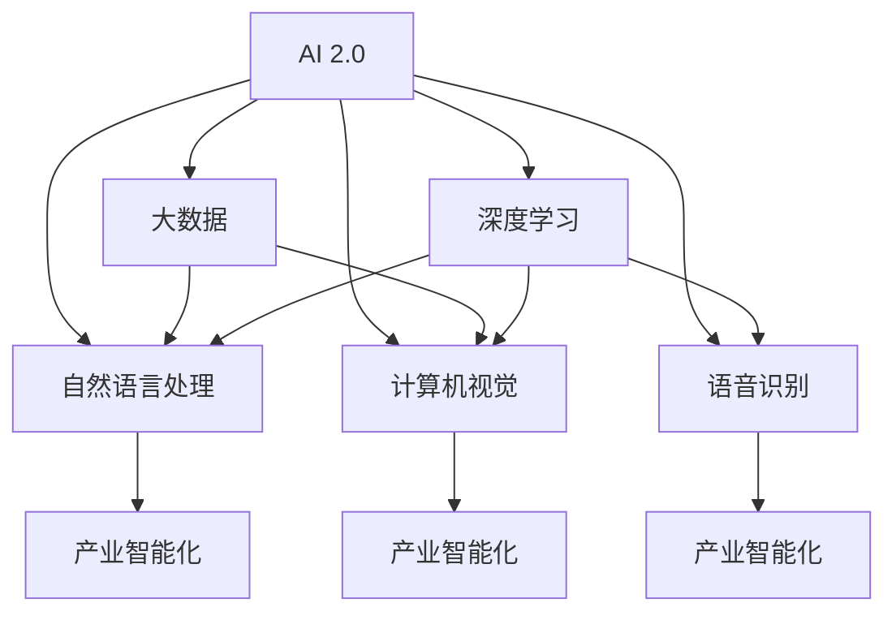

                 

# 李开复：AI 2.0 时代的产业

## 1. 背景介绍

### 1.1 问题由来
在AI 2.0时代，人工智能技术正以前所未有的速度发展，从基础研究到实际应用，从数据科学到机器学习，AI 正在改变着各行各业的运营模式。作为世界顶级的人工智能专家，李开复深度剖析了AI 2.0时代的产业趋势和应用方向，提出了许多前瞻性的观点和建议，为AI 开发者和从业者指明了方向。

### 1.2 问题核心关键点
AI 2.0时代的产业变革涉及多个核心关键点，包括：
1. 数据驱动的智能决策：基于大数据和深度学习技术，AI 能够在短时间内做出比人类更精准的决策。
2. 自动化和智能化：AI 系统能够自动执行复杂的任务，优化业务流程，提升效率。
3. 跨领域融合：AI 技术不仅仅在信息技术领域应用广泛，还在医疗、教育、交通等多个领域展现出巨大潜力。
4. 人机协同：AI 与人类协作，实现更高效、更精准的工作。
5. 伦理和安全性：AI 应用需要遵循伦理规范，确保数据和系统的安全性。

### 1.3 问题研究意义
李开复的AI 2.0产业分析不仅具有重要的学术价值，对于推动AI 技术的产业化应用也具有重要的现实意义。通过对AI 2.0时代的产业趋势和应用方向的深度解读，可以指导AI 开发者和从业者更好地把握技术发展脉搏，推动AI 技术在实际场景中的应用，为社会带来更多积极影响。

## 2. 核心概念与联系

### 2.1 核心概念概述

为了更好地理解AI 2.0时代的产业趋势，李开复引入了以下几个核心概念：

- **AI 2.0**：新一代人工智能，融合了大数据、深度学习、自然语言处理、计算机视觉、语音识别等多种技术，具备更强的感知、推理、学习和适应能力。
- **产业智能化**：AI 技术在各个行业中的应用，提升业务效率和创新能力。
- **数据驱动**：利用大量数据训练AI 模型，提高模型预测的准确性。
- **人机协同**：AI 与人类在执行任务、解决问题上的合作，实现1+1>2的效果。
- **伦理与安全**：确保AI 技术在应用过程中遵循伦理规范，保障数据和系统的安全性。

### 2.2 核心概念原理和架构的 Mermaid 流程图



这个流程图展示了AI 2.0与各个核心技术的关联和产业智能化的实现路径。大数据为AI 提供了丰富的训练材料，深度学习使AI 具备强大的分析和预测能力，自然语言处理、计算机视觉和语音识别等技术进一步扩展了AI 的应用范围，最终通过产业智能化实现AI 在各行业的落地应用。

## 3. 核心算法原理 & 具体操作步骤

### 3.1 算法原理概述

AI 2.0时代，AI 技术在各个领域的应用，都需要依赖于算法原理和具体操作步骤。李开复强调了以下几个关键算法原理：

- **监督学习**：通过有标签的数据训练AI 模型，使模型能够对新数据进行预测和分类。
- **无监督学习**：从大量未标注数据中提取特征，训练AI 模型，提升模型的泛化能力。
- **强化学习**：通过与环境的互动，不断调整模型策略，优化模型性能。
- **迁移学习**：将一个领域学到的知识迁移到另一个领域，提高模型在新领域的适应能力。

### 3.2 算法步骤详解

AI 2.0时代，AI 技术的实现通常包含以下步骤：

1. **数据收集和预处理**：收集相关数据，进行清洗和标准化处理，以便于后续的模型训练。
2. **模型选择和训练**：根据任务需求选择合适的模型，并进行训练，不断调整模型参数，优化模型性能。
3. **模型评估和调优**：通过评估指标（如准确率、召回率、F1分数等）对模型进行评估，根据评估结果进行调优。
4. **模型部署和应用**：将训练好的模型部署到实际应用中，进行实时预测和决策。
5. **持续学习**：随着新数据的积累，不断更新和优化模型，保持模型的准确性和适应性。

### 3.3 算法优缺点

AI 2.0时代的算法具有以下优点：
1. **高效性**：AI 算法能够在短时间内处理大量数据，提升工作效率。
2. **准确性**：通过深度学习和强化学习等技术，AI 模型能够获得高精度的预测和决策。
3. **适应性**：AI 模型能够通过迁移学习等方式，适应不同领域和场景的需求。

同时，AI 算法也存在一些缺点：
1. **依赖数据**：AI 算法的性能高度依赖于数据的质量和数量。
2. **计算资源消耗**：AI 模型的训练和推理需要大量的计算资源，对硬件和网络环境要求较高。
3. **透明性不足**：AI 模型的决策过程往往缺乏可解释性，难以理解和调试。
4. **伦理风险**：AI 应用可能引发隐私、偏见等问题，需要严格遵循伦理规范。

### 3.4 算法应用领域

AI 2.0时代的算法在多个领域都有广泛应用：

- **医疗健康**：AI 模型可用于疾病诊断、药物研发、患者监测等，提升医疗服务质量。
- **金融服务**：AI 技术在风险管理、智能投顾、欺诈检测等方面有重要应用。
- **智能制造**：通过AI 模型优化生产流程，提升制造效率和质量。
- **零售电商**：AI 技术在商品推荐、库存管理、客户服务等方面提升零售效率。
- **教育培训**：AI 可以用于个性化教学、智能辅导、学习效果评估等，提升教育质量。
- **自动驾驶**：AI 模型在交通导航、障碍物检测、自动泊车等方面有重要应用。

## 4. 数学模型和公式 & 详细讲解

### 4.1 数学模型构建

在AI 2.0时代，数学模型是实现AI 技术的基础。以下以监督学习算法为例，构建一个简单的数学模型：

设训练集为 $D=\{(x_i,y_i)\}_{i=1}^N$，其中 $x_i$ 为输入样本，$y_i$ 为标签。假设模型的输出为 $\hat{y}=M(x)$，其中 $M$ 为模型函数。监督学习的目标是最小化损失函数 $L$：

$$
L = \frac{1}{N}\sum_{i=1}^N \ell(M(x_i),y_i)
$$

其中 $\ell$ 为损失函数，如交叉熵损失、均方误差损失等。模型的优化目标是找到最优参数 $\theta$，使得损失函数最小化：

$$
\theta^* = \mathop{\arg\min}_{\theta} L
$$

### 4.2 公式推导过程

以二分类问题为例，假设模型为线性分类器：

$$
\hat{y} = M(x) = w \cdot x + b
$$

其中 $w$ 为权重向量，$b$ 为偏置项。交叉熵损失函数为：

$$
\ell = -y\log\hat{y} - (1-y)\log(1-\hat{y})
$$

因此，监督学习的目标函数可以写为：

$$
L = -\frac{1}{N}\sum_{i=1}^N [y_i\log M(x_i)+(1-y_i)\log(1-M(x_i))]
$$

通过反向传播算法，可以得到参数 $w$ 和 $b$ 的更新公式：

$$
w \leftarrow w - \eta \nabla_{w}L
$$

$$
b \leftarrow b - \eta \nabla_{b}L
$$

其中 $\eta$ 为学习率，$\nabla_{w}L$ 和 $\nabla_{b}L$ 分别为损失函数对 $w$ 和 $b$ 的梯度。

### 4.3 案例分析与讲解

以医疗领域的疾病诊断为例，使用深度学习模型对医学影像进行分类。模型输入为患者医学影像数据，输出为疾病分类标签。训练过程中，模型不断调整权重向量 $w$ 和偏置项 $b$，最小化交叉熵损失函数。训练完成后，模型可以将新的医学影像数据输入，输出疾病分类结果。

## 5. 项目实践：代码实例和详细解释说明

### 5.1 开发环境搭建

AI 2.0时代的项目实践需要搭建专门的开发环境。以下是使用Python进行TensorFlow开发的环境配置流程：

1. 安装Anaconda：从官网下载并安装Anaconda，用于创建独立的Python环境。

2. 创建并激活虚拟环境：
```bash
conda create -n tf-env python=3.8 
conda activate tf-env
```

3. 安装TensorFlow：根据CUDA版本，从官网获取对应的安装命令。例如：
```bash
conda install tensorflow tensorflow-gpu=cuda110 -c tf -c conda-forge
```

4. 安装各类工具包：
```bash
pip install numpy pandas scikit-learn matplotlib tqdm jupyter notebook ipython
```

完成上述步骤后，即可在`tf-env`环境中开始AI 项目实践。

### 5.2 源代码详细实现

以下是一个使用TensorFlow进行二分类问题微调的代码示例：

```python
import tensorflow as tf
from tensorflow.keras import layers, models
from tensorflow.keras.datasets import mnist

# 加载数据
(x_train, y_train), (x_test, y_test) = mnist.load_data()

# 数据预处理
x_train = x_train / 255.0
x_test = x_test / 255.0
y_train = tf.keras.utils.to_categorical(y_train, num_classes=10)
y_test = tf.keras.utils.to_categorical(y_test, num_classes=10)

# 构建模型
model = models.Sequential([
    layers.Flatten(input_shape=(28, 28)),
    layers.Dense(128, activation='relu'),
    layers.Dense(10, activation='softmax')
])

# 编译模型
model.compile(optimizer='adam',
              loss='categorical_crossentropy',
              metrics=['accuracy'])

# 训练模型
model.fit(x_train, y_train, epochs=10, validation_data=(x_test, y_test))

# 评估模型
model.evaluate(x_test, y_test)
```

### 5.3 代码解读与分析

让我们再详细解读一下关键代码的实现细节：

**数据加载和预处理**：
- `mnist.load_data()` 加载MNIST手写数字数据集，返回训练集和测试集。
- `x_train = x_train / 255.0` 将图像像素值归一化到[0, 1]之间。
- `y_train = tf.keras.utils.to_categorical(y_train, num_classes=10)` 将标签转换为one-hot编码。

**模型构建和编译**：
- `Sequential` 类创建序列模型。
- `layers.Flatten` 将二维图像数据展平为一维数组。
- `layers.Dense` 创建两个全连接层，第一个128个神经元，第二个10个神经元，激活函数分别为ReLU和Softmax。
- `model.compile` 编译模型，指定优化器、损失函数和评估指标。

**训练和评估**：
- `model.fit` 对模型进行训练，指定训练集、验证集、训练轮数。
- `model.evaluate` 评估模型在测试集上的性能。

## 6. 实际应用场景

### 6.1 智能客服系统

AI 2.0技术在智能客服系统中的应用，可以显著提升客户服务体验和效率。通过使用深度学习和自然语言处理技术，AI 系统能够自动理解客户咨询，提供个性化的服务。

在技术实现上，可以收集企业内部的历史客服对话记录，训练AI 模型进行问题理解和答复生成。模型可以对新客户咨询进行实时分析，提供快速、准确的回答。同时，通过不断的监督学习和迭代优化，AI 模型能够不断提升服务质量。

### 6.2 金融舆情监测

AI 2.0技术在金融领域的应用，可以帮助金融机构实时监测市场舆情，及时发现和应对风险。通过自然语言处理技术，AI 系统可以自动识别和分类新闻、评论等文本数据，进行舆情分析和情绪判断。

具体而言，可以收集金融领域相关的新闻、报道、评论等文本数据，训练AI 模型进行情感分析和主题分类。模型能够实时抓取网络文本数据，自动监测舆情变化趋势，一旦发现负面信息激增等异常情况，系统便会自动预警，帮助金融机构快速应对潜在风险。

### 6.3 个性化推荐系统

AI 2.0技术在个性化推荐系统中的应用，可以显著提升用户的购物体验和满意度。通过深度学习和数据挖掘技术，AI 系统能够分析用户的浏览和购买行为，推荐符合用户兴趣的商品。

在技术实现上，可以收集用户浏览、点击、评论、分享等行为数据，提取和商品标题、描述、标签等文本内容。训练AI 模型进行特征提取和用户兴趣分析，根据用户行为预测推荐结果。通过不断优化模型和更新推荐算法，AI 系统能够提供更精准、多样化的商品推荐，提升用户的购物体验。

### 6.4 未来应用展望

随着AI 2.0技术的不断进步，其在各行业的应用前景更加广阔：

- **智慧医疗**：AI 模型可用于疾病诊断、医学影像分析、患者监测等，提升医疗服务质量和效率。
- **智能制造**：AI 技术在工业自动化、质量控制、设备维护等方面有重要应用。
- **自动驾驶**：AI 模型在交通导航、障碍物检测、自动泊车等方面有重要应用。
- **智能家居**：AI 技术在智能控制、安防监控、环境监测等方面提升家居智能化水平。
- **智慧城市**：AI 技术在交通管理、环境保护、公共安全等方面提升城市治理水平。

## 7. 工具和资源推荐

### 7.1 学习资源推荐

为了帮助开发者系统掌握AI 2.0技术，这里推荐一些优质的学习资源：

1. 《深度学习》系列书籍：由多位知名AI专家编写，深入浅出地介绍了深度学习的基本原理和应用。
2. CS231n《深度学习计算机视觉》课程：斯坦福大学开设的计算机视觉课程，涵盖深度学习在图像识别、目标检测等任务中的应用。
3. TensorFlow官方文档：TensorFlow官方文档提供了丰富的API文档和案例代码，适合初学者和高级开发者。
4. Coursera《机器学习》课程：由斯坦福大学Andrew Ng教授讲授，适合初学者入门学习。
5. Kaggle竞赛平台：提供大量的数据集和竞赛任务，锻炼数据处理和模型训练能力。

通过对这些资源的学习实践，相信你一定能够快速掌握AI 2.0技术，并用于解决实际的业务问题。

### 7.2 开发工具推荐

高效的开发离不开优秀的工具支持。以下是几款用于AI 2.0技术开发的常用工具：

1. TensorFlow：由Google主导开发的开源深度学习框架，生产部署方便，适合大规模工程应用。
2. PyTorch：基于Python的开源深度学习框架，灵活动态的计算图，适合快速迭代研究。
3. Jupyter Notebook：基于Web的交互式笔记本，支持Python、R等语言，方便快速开发和分享代码。
4. Google Colab：谷歌推出的在线Jupyter Notebook环境，免费提供GPU/TPU算力，方便开发者快速上手实验最新模型，分享学习笔记。
5. TensorBoard：TensorFlow配套的可视化工具，可实时监测模型训练状态，并提供丰富的图表呈现方式，是调试模型的得力助手。

合理利用这些工具，可以显著提升AI 2.0技术开发效率，加快创新迭代的步伐。

### 7.3 相关论文推荐

AI 2.0技术的快速发展得益于学界的持续研究。以下是几篇奠基性的相关论文，推荐阅读：

1. 《Deep Learning》书籍：Ian Goodfellow、Yoshua Bengio和Aaron Courville合著，全面介绍了深度学习的基本概念和前沿技术。
2. 《Natural Language Processing with Transformers》书籍：Tom Rokach等编写，介绍了基于Transformers的NLP任务处理技术。
3. 《ImageNet Classification with Deep Convolutional Neural Networks》论文：Alex Krizhevsky等提出，展示了卷积神经网络在图像分类任务中的卓越表现。
4. 《AlphaGo Zero》论文：DeepMind提出，展示了AlphaGo Zero在围棋游戏中的无监督学习和自我对弈能力。
5. 《A Survey on Deep Learning Architectures for Conversational Agents》论文：Sebastian Riedel等综述，介绍了深度学习在对话系统中的最新进展。

这些论文代表了AI 2.0技术的最新发展，通过学习这些前沿成果，可以帮助研究者把握学科前进方向，激发更多的创新灵感。

## 8. 总结：未来发展趋势与挑战

### 8.1 研究成果总结

AI 2.0技术的快速发展，推动了AI 在各行业的应用，提升了业务效率和创新能力。在数据驱动、自动化和智能化等方面取得了显著进展。未来，AI 技术将在医疗、金融、制造、零售等更多领域发挥更大作用。

### 8.2 未来发展趋势

展望未来，AI 2.0技术的发展趋势如下：

1. **多模态融合**：AI 技术将越来越多地融合视觉、听觉、触觉等多模态信息，实现更全面、更准确的环境感知和理解。
2. **自动化协同**：AI 技术将与人类更好地协同工作，提高任务执行效率和质量。
3. **跨领域应用**：AI 技术将在更多领域实现落地应用，提升业务创新能力。
4. **伦理和安全**：AI 技术的应用需要遵循伦理规范，保障数据和系统的安全性。
5. **可解释性**：AI 模型的决策过程需要具备更好的可解释性，便于理解和使用。

### 8.3 面临的挑战

尽管AI 2.0技术发展迅猛，但仍面临诸多挑战：

1. **计算资源限制**：AI 模型的训练和推理需要大量计算资源，对硬件和网络环境要求较高。
2. **数据质量和标注**：AI 模型的性能高度依赖于数据质量和标注数量，数据不足或标注不准确会导致模型性能下降。
3. **模型复杂性**：AI 模型的复杂性增加，难以解释和调试，需要开发更易用、更高效的AI工具。
4. **隐私和安全**：AI 应用可能引发隐私泄露、数据滥用等问题，需要严格遵循伦理规范。
5. **法律和法规**：AI 技术的应用需要遵循相关法律和法规，确保合法合规。

### 8.4 研究展望

未来，AI 2.0技术需要在以下方面进行深入研究：

1. **计算资源优化**：开发更高效、更易用的计算工具，降低AI 技术应用的硬件和网络成本。
2. **数据质量和标注**：探索更多的数据增强和数据合成方法，提升数据质量和标注效率。
3. **模型复杂性简化**：开发更简单、更易解释的AI 模型，提高模型可解释性和可理解性。
4. **隐私和安全保障**：研究隐私保护技术，确保AI 应用的数据安全性和用户隐私。
5. **法律和法规合规**：研究AI 应用的法律和法规框架，确保AI 技术的合规应用。

## 9. 附录：常见问题与解答

**Q1：AI 2.0技术是否适用于所有行业？**

A: AI 2.0技术适用于大多数行业，但不同的行业可能需要针对性地进行定制化开发和优化。例如，医疗、金融、制造等行业对数据和算法的依赖程度不同，需要采用不同的技术和方法。

**Q2：AI 2.0技术是否能够完全替代人类？**

A: AI 2.0技术在特定任务和场景中能够表现出比人类更好的性能，但在需要复杂推理和情感理解的任务中，人类仍然具有不可替代的优势。AI 技术可以辅助人类，提高工作效率，而不是完全替代人类。

**Q3：AI 2.0技术在应用过程中如何确保数据和系统的安全性？**

A: AI 技术在应用过程中需要遵循伦理规范，保障数据和系统的安全性。需要采用数据加密、访问控制、隐私保护等技术手段，确保数据不被滥用和泄露。同时，需要制定相应的政策和法规，规范AI 技术的应用。

**Q4：AI 2.0技术在落地应用过程中有哪些挑战？**

A: AI 2.0技术在落地应用过程中面临诸多挑战，包括计算资源限制、数据质量和标注、模型复杂性、隐私和安全问题等。需要综合考虑技术、业务、法律等多个维度，寻找解决方案。

**Q5：AI 2.0技术未来的发展方向是什么？**

A: AI 2.0技术未来的发展方向包括多模态融合、自动化协同、跨领域应用、伦理和安全保障、可解释性提升等。需要在保持技术进步的同时，注重伦理和社会责任。

---

作者：禅与计算机程序设计艺术 / Zen and the Art of Computer Programming

