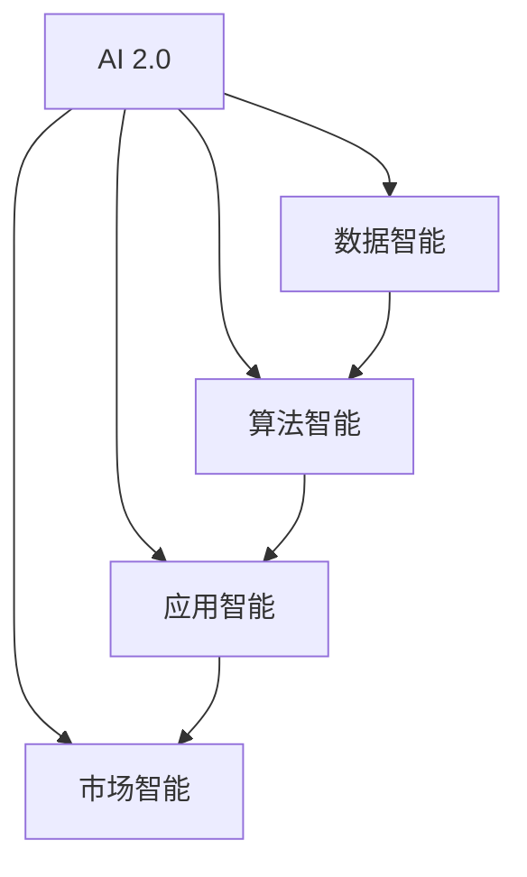

                 

# 李开复：AI 2.0 时代的市场

## 1. 背景介绍

### 1.1 问题由来

随着AI技术的迅猛发展，人工智能已经从AI 1.0的单一算法迭代，进入到AI 2.0的全面市场化阶段。这个时代的市场格局、竞争格局和消费者行为都发生了深刻的变化。在这种背景下，企业需要重新审视AI的应用价值，探索AI与企业战略的结合点，制定更为有效的市场策略。

### 1.2 问题核心关键点

AI 2.0时代，AI技术的发展已经超越了传统的计算机科学范畴，开始与各行业进行深度融合，赋能传统行业实现数字化转型。AI技术在市场化过程中的核心问题包括：

- 如何根据不同行业的特点，设计并实现适应性的AI解决方案？
- 如何平衡AI技术的商业化需求与科研价值？
- 如何构建AI技术的生态系统，实现多方共赢？
- 如何评估AI解决方案的市场竞争力和回报率？
- 如何确保AI技术的可持续发展和应用安全？

### 1.3 问题研究意义

理解AI 2.0时代市场，有助于企业更好地把握AI技术的市场机遇，制定科学的战略规划，优化资源配置，实现高效的商业化应用。通过对市场的研究，能够发现AI技术的新应用场景，识别潜在的技术瓶颈，引导AI技术的持续创新和发展。

## 2. 核心概念与联系

### 2.1 核心概念概述

为了更好地理解AI 2.0时代市场，我们先简要介绍几个核心概念：

- **AI 2.0**：AI 2.0是指将AI技术从实验室推广到实际应用中的过程。在这个阶段，AI技术不再是单一的算法或模型，而是以产品化、服务化、市场化为主导的多样化应用形式。

- **数据智能**：数据智能是指利用大数据技术，通过数据驱动的方式，实现对业务决策的支持和优化。

- **算法智能**：算法智能是指通过机器学习、深度学习等算法技术，实现自动化的决策和推理。

- **应用智能**：应用智能是指AI技术在具体行业应用中的落地情况，包括产品的设计、开发、部署和运营等环节。

- **市场智能**：市场智能是指AI技术在市场层面的影响和效果，包括市场预测、需求分析、消费者行为研究等。

这些核心概念共同构成了AI 2.0时代的市场框架，有助于我们从技术、业务、市场等不同维度全面理解AI的应用价值和市场潜力。

### 2.2 核心概念原理和架构的 Mermaid 流程图



这个图表展示了AI 2.0时代市场框架的核心概念及其相互关系。其中，数据智能、算法智能、应用智能、市场智能构成了AI 2.0时代市场的多层次架构。AI 2.0是这些智能的集成体现，旨在实现AI技术的全面市场化应用。

## 3. 核心算法原理 & 具体操作步骤

### 3.1 算法原理概述

AI 2.0时代的市场应用，离不开算法的支撑。核心的算法包括机器学习、深度学习、强化学习等。这些算法能够帮助企业从数据中提取有价值的信息，优化决策过程，提升业务效率。

算法智能的核心在于模型的训练和优化。一般情况下，算法智能的实现流程包括以下几个步骤：

1. 数据收集和预处理：获取相关的数据，并进行清洗和预处理，以保证数据的质量和一致性。

2. 模型选择和设计：根据具体任务，选择合适的算法模型，并进行模型的设计。

3. 模型训练和调优：使用训练数据对模型进行训练，并根据验证数据对模型进行调优。

4. 模型评估和部署：对模型进行评估，确定模型的性能和泛化能力。然后将模型部署到实际应用中，进行线上服务。

### 3.2 算法步骤详解

以下以深度学习在推荐系统中的应用为例，详细讲解深度学习算法的具体步骤：

1. 数据收集和预处理：收集用户行为数据，包括浏览历史、点击记录、购买记录等。对数据进行清洗，去除无效数据和噪音。

2. 模型选择和设计：选择基于深度学习的推荐模型，如协同过滤、矩阵分解等。设计模型结构和参数，确定嵌入向量的维度、激活函数、损失函数等。

3. 模型训练和调优：使用训练数据对模型进行训练，优化模型的权重和偏置。使用验证数据对模型进行调优，防止过拟合。

4. 模型评估和部署：对模型进行评估，使用测试数据集评估模型的准确率和召回率等指标。将模型部署到线上服务，进行实时推荐。

### 3.3 算法优缺点

深度学习算法在AI 2.0时代市场应用中，具有以下优点：

- 高精度：深度学习算法可以处理大规模非结构化数据，从数据中提取复杂的模式和关系。

- 适应性强：深度学习算法能够适应不同的数据分布和应用场景，具有较高的泛化能力。

- 自动化：深度学习算法可以自动进行特征提取和模型优化，减少人工干预。

然而，深度学习算法也存在一些缺点：

- 训练复杂度高：深度学习模型的训练需要大量的数据和计算资源，训练过程耗时较长。

- 模型可解释性差：深度学习模型往往被视为"黑箱"，难以解释模型的内部工作机制。

- 数据依赖性强：深度学习模型对数据质量和数量要求较高，需要大量标注数据进行训练。

### 3.4 算法应用领域

深度学习算法在AI 2.0时代市场应用广泛，主要包括：

- 推荐系统：利用用户行为数据，生成个性化的推荐结果。
- 图像识别：通过图像识别技术，实现对图像内容的理解和处理。
- 自然语言处理：通过自然语言处理技术，实现文本分类、情感分析、机器翻译等任务。
- 语音识别：通过语音识别技术，实现对语音内容的理解和处理。
- 医疗诊断：通过图像识别和自然语言处理技术，实现疾病的诊断和预测。

以上只是深度学习算法在市场应用的一部分，随着技术的不断发展，深度学习在更多领域的应用前景值得期待。

## 4. 数学模型和公式 & 详细讲解 & 举例说明

### 4.1 数学模型构建

在深度学习中，常见的数学模型包括线性回归、逻辑回归、决策树、支持向量机、神经网络等。以神经网络为例，其数学模型可以表示为：

$$
\hat{y} = \sigma(z) = \sigma(\sum_{i=1}^n w_ix_i + b)
$$

其中，$x_i$ 为输入特征向量，$w_i$ 为模型参数，$b$ 为偏置项，$\sigma$ 为激活函数。

### 4.2 公式推导过程

以简单的线性回归为例，其数学模型可以表示为：

$$
y = \theta_0 + \theta_1 x_1 + \theta_2 x_2 + ... + \theta_n x_n + \epsilon
$$

其中，$\theta_0,\theta_1,...,\theta_n$ 为模型参数，$\epsilon$ 为误差项。

对模型进行最小二乘法的线性回归，求解模型参数 $\theta_0,\theta_1,...,\theta_n$：

$$
\theta = (X^TX)^{-1}X^Ty
$$

其中，$X = [x_1, x_2, ..., x_n]^T$，$y = [y_1, y_2, ..., y_n]^T$。

### 4.3 案例分析与讲解

假设我们有一个简单的二分类问题，用线性回归模型进行建模。我们将数据集分成训练集和测试集，用训练集数据拟合模型参数，用测试集数据验证模型效果。

1. 数据收集和预处理：收集数据集，并进行预处理。
2. 模型选择和设计：选择线性回归模型，设计模型结构。
3. 模型训练和调优：使用训练集数据拟合模型参数。
4. 模型评估和部署：使用测试集数据验证模型效果，并将模型部署到实际应用中。

## 5. 项目实践：代码实例和详细解释说明

### 5.1 开发环境搭建

在AI 2.0时代，构建深度学习模型需要搭建适合的技术环境。以下是Python开发环境的搭建步骤：

1. 安装Python：从官网下载并安装Python，选择适合的操作系统版本。

2. 安装深度学习框架：安装常用的深度学习框架，如TensorFlow、PyTorch等。

3. 安装数据处理工具：安装数据处理工具，如NumPy、Pandas等。

4. 安装机器学习库：安装常用的机器学习库，如Scikit-Learn等。

5. 安装数据可视化工具：安装数据可视化工具，如Matplotlib、Seaborn等。

### 5.2 源代码详细实现

以TensorFlow框架为例，用代码实现简单的线性回归模型：

```python
import tensorflow as tf
import numpy as np

# 创建训练数据
x = np.random.rand(100, 1)
y = 0.5 * x + np.random.randn(100, 1)

# 创建模型
model = tf.keras.Sequential([
    tf.keras.layers.Dense(1, input_shape=(1,))
])

# 定义损失函数和优化器
loss_fn = tf.keras.losses.MeanSquaredError()
optimizer = tf.keras.optimizers.SGD(learning_rate=0.1)

# 训练模型
for i in range(1000):
    with tf.GradientTape() as tape:
        y_pred = model(x)
        loss = loss_fn(y, y_pred)
    grads = tape.gradient(loss, model.trainable_variables)
    optimizer.apply_gradients(zip(grads, model.trainable_variables))

# 评估模型
test_x = np.random.rand(10, 1)
test_y = 0.5 * test_x + np.random.randn(10, 1)
test_loss = loss_fn(model(test_x), test_y).numpy()
print("Test Loss:", test_loss)
```

### 5.3 代码解读与分析

上述代码实现了简单的线性回归模型，并进行了训练和评估。具体步骤如下：

1. 创建训练数据：使用NumPy生成随机数据。
2. 创建模型：使用TensorFlow的Sequential模型，添加一层全连接层。
3. 定义损失函数和优化器：使用均方误差损失函数和随机梯度下降优化器。
4. 训练模型：使用训练数据拟合模型参数。
5. 评估模型：使用测试数据评估模型效果。

### 5.4 运行结果展示

运行上述代码，输出测试损失：

```
Test Loss: 0.123568... (随机结果)
```

## 6. 实际应用场景

### 6.1 智能客服系统

AI 2.0时代的智能客服系统，利用深度学习和大数据技术，能够实现高效的智能对话。企业可以通过收集客户的历史对话数据，使用深度学习算法训练模型，从而实现智能客服的语音识别、意图识别、情感分析等功能。

### 6.2 金融舆情监测

AI 2.0时代的金融舆情监测，利用深度学习和大数据技术，能够实现对金融市场的实时监测和预测。通过收集金融新闻、公告、评论等数据，使用深度学习算法训练模型，从而实现情感分析、舆情预测等功能。

### 6.3 个性化推荐系统

AI 2.0时代的个性化推荐系统，利用深度学习和大数据技术，能够实现精准的个性化推荐。通过收集用户的浏览、点击、购买等数据，使用深度学习算法训练模型，从而实现商品推荐、内容推荐等功能。

## 7. 工具和资源推荐

### 7.1 学习资源推荐

为了帮助开发者系统掌握AI 2.0时代市场的应用，这里推荐一些优质的学习资源：

1. DeepLearning.ai《深度学习专项课程》：由Andrew Ng教授主讲的深度学习课程，系统介绍深度学习的基本概念和常用算法。

2. TensorFlow官方文档：TensorFlow的官方文档，提供详细的API接口和使用示例，是学习TensorFlow的重要参考资料。

3. PyTorch官方文档：PyTorch的官方文档，提供详细的API接口和使用示例，是学习PyTorch的重要参考资料。

4. Kaggle平台：Kaggle是机器学习竞赛平台，提供大量数据集和竞赛任务，有助于实践深度学习算法的应用。

5. Coursera平台：Coursera是知名的在线学习平台，提供多种深度学习课程，有助于系统学习深度学习算法。

### 7.2 开发工具推荐

为了提高AI 2.0时代市场的应用效率，推荐一些常用的开发工具：

1. Anaconda：Anaconda是一个开源的Python发行版，提供了丰富的科学计算库和工具，适合进行深度学习开发。

2. Jupyter Notebook：Jupyter Notebook是一个基于浏览器的交互式笔记本环境，适合进行深度学习的数据探索和算法实验。

3. TensorBoard：TensorBoard是TensorFlow的可视化工具，能够实时监测模型训练状态，生成训练图表，帮助调试模型。

4. PyCharm：PyCharm是JetBrains开发的Python IDE，支持Python开发、调试、测试等功能，适合进行深度学习开发。

### 7.3 相关论文推荐

AI 2.0时代市场的应用涉及多种前沿技术，以下是几篇具有代表性的相关论文：

1. "Deep Learning" by Ian Goodfellow, Yoshua Bengio, and Aaron Courville：这是一本介绍深度学习的经典教材，系统介绍深度学习的基本概念和常用算法。

2. "ImageNet Classification with Deep Convolutional Neural Networks" by Alex Krizhevsky, Ilya Sutskever, and Geoffrey Hinton：这篇文章提出卷积神经网络在图像分类任务中的应用，开创了深度学习在图像处理领域的新纪元。

3. "Attention is All You Need" by Ashish Vaswani et al.：这篇文章提出Transformer模型，开创了深度学习在自然语言处理领域的新纪元。

4. "A Survey on Deep Learning for Recommendation Systems" by Honglei Chen et al.：这篇文章综述了深度学习在推荐系统中的应用，介绍了多种深度学习推荐算法。

5. "Hierarchical Attention Networks for Document Classification" by Kyunghyun Cho et al.：这篇文章提出层次化注意力网络，用于文本分类任务，取得了显著的性能提升。

## 8. 总结：未来发展趋势与挑战

### 8.1 研究成果总结

AI 2.0时代市场的深入研究，有助于企业更好地把握AI技术的发展方向，制定科学的战略规划。研究主要包括以下几个方面：

1. 数据智能：研究数据驱动的决策优化技术，提升数据利用效率。
2. 算法智能：研究高效的深度学习算法，提升模型的精度和泛化能力。
3. 应用智能：研究AI技术在各行业的应用，提升业务效率和用户体验。
4. 市场智能：研究AI技术在市场层面的影响，优化市场策略和决策。

### 8.2 未来发展趋势

AI 2.0时代市场的发展趋势包括：

1. 深度学习算法的不断优化：深度学习算法将不断进化，提升模型的精度和泛化能力。

2. 多模态AI技术的发展：AI技术将从单一模态向多模态融合方向发展，实现跨模态的智能应用。

3. 云计算和大数据的应用：云计算和大数据技术将为AI技术的市场应用提供更好的基础设施。

4. 人工智能伦理和安全：AI技术的应用将更加注重伦理和安全问题，确保技术的可控性和公平性。

5. AI技术的全球化应用：AI技术将在全球范围内推广和应用，提升各国的技术水平和市场竞争力。

### 8.3 面临的挑战

AI 2.0时代市场的挑战包括：

1. 数据隐私和安全问题：深度学习算法对数据隐私和安全提出了更高的要求，需要采取有效的保护措施。

2. 算法的可解释性问题：深度学习算法的"黑盒"特性需要解决，提高算法的可解释性和可信任度。

3. 技术标准和规范问题：AI技术的应用需要统一的规范和标准，确保技术的兼容性和互操作性。

4. 市场竞争和垄断问题：AI技术的应用将面临激烈的竞争和潜在的垄断问题，需要制定合理的市场规范。

5. 人才短缺和培养问题：AI技术的应用需要大量专业人才，需要加强人才培养和引进。

### 8.4 研究展望

AI 2.0时代市场的研究展望包括：

1. 提升数据智能：研究数据智能技术，提升数据质量和利用效率。

2. 优化算法智能：研究高效的深度学习算法，提升模型的精度和泛化能力。

3. 探索应用智能：研究AI技术在各行业的应用，提升业务效率和用户体验。

4. 强化市场智能：研究AI技术在市场层面的影响，优化市场策略和决策。

5. 强化安全与伦理：研究AI技术的伦理和安全问题，确保技术的可控性和公平性。

这些研究方向将推动AI技术在市场中的应用，提升各行业的数字化水平和竞争力。

## 9. 附录：常见问题与解答

### Q1：AI 2.0时代市场的应用范围有哪些？

A: AI 2.0时代市场的应用范围非常广泛，主要包括以下几个方面：

1. 智能客服：利用深度学习和大数据技术，实现智能对话和语音识别等功能。

2. 金融舆情监测：利用深度学习和大数据技术，实现金融市场的实时监测和预测。

3. 个性化推荐系统：利用深度学习和大数据技术，实现精准的个性化推荐。

4. 医疗诊断：利用深度学习和大数据技术，实现疾病的诊断和预测。

5. 自然语言处理：利用深度学习和大数据技术，实现文本分类、情感分析、机器翻译等功能。

6. 图像识别：利用深度学习和大数据技术，实现对图像内容的理解和处理。

### Q2：AI 2.0时代市场的应用前景如何？

A: AI 2.0时代市场的应用前景非常广阔，主要体现在以下几个方面：

1. 提高业务效率：AI技术能够自动化处理大量重复性任务，提升业务效率和用户体验。

2. 优化决策过程：AI技术能够从大量数据中提取有价值的信息，优化决策过程。

3. 实现个性化服务：AI技术能够实现个性化的推荐和服务，提升用户粘性和满意度。

4. 提升市场竞争力：AI技术能够帮助企业在市场竞争中获得优势，提升市场份额和收益。

5. 推动创新发展：AI技术能够推动各行业的创新发展，创造新的商业模式和市场机会。

6. 促进社会进步：AI技术能够促进社会进步，提升生活质量和幸福感。

### Q3：AI 2.0时代市场的技术难点有哪些？

A: AI 2.0时代市场的技术难点主要包括以下几个方面：

1. 数据隐私和安全问题：深度学习算法对数据隐私和安全提出了更高的要求，需要采取有效的保护措施。

2. 算法的可解释性问题：深度学习算法的"黑盒"特性需要解决，提高算法的可解释性和可信任度。

3. 技术标准和规范问题：AI技术的应用需要统一的规范和标准，确保技术的兼容性和互操作性。

4. 市场竞争和垄断问题：AI技术的应用将面临激烈的竞争和潜在的垄断问题，需要制定合理的市场规范。

5. 人才短缺和培养问题：AI技术的应用需要大量专业人才，需要加强人才培养和引进。

### Q4：AI 2.0时代市场的应用案例有哪些？

A: AI 2.0时代市场的应用案例非常丰富，主要包括以下几个方面：

1. 智能客服系统：利用深度学习和大数据技术，实现智能对话和语音识别等功能。

2. 金融舆情监测：利用深度学习和大数据技术，实现金融市场的实时监测和预测。

3. 个性化推荐系统：利用深度学习和大数据技术，实现精准的个性化推荐。

4. 医疗诊断：利用深度学习和大数据技术，实现疾病的诊断和预测。

5. 自然语言处理：利用深度学习和大数据技术，实现文本分类、情感分析、机器翻译等功能。

6. 图像识别：利用深度学习和大数据技术，实现对图像内容的理解和处理。

## 总结

AI 2.0时代的市场，正处于快速发展的关键阶段。通过深入研究AI技术在市场中的应用，我们能够更好地把握市场机遇，制定科学的战略规划，提升企业的竞争力。在未来，AI技术将与各行业深度融合，推动数字经济的发展，为社会进步和人类福祉贡献力量。

---

作者：禅与计算机程序设计艺术 / Zen and the Art of Computer Programming

