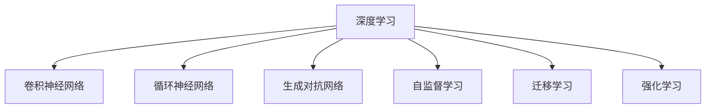

                 

# 李开复：AI 2.0 时代的应用

## 1. 背景介绍

### 1.1 问题由来

人工智能（AI）技术正在经历从AI 1.0到AI 2.0的演变。AI 1.0时代，AI主要以专家系统、知识工程和统计学习为代表，依赖于领域专家知识和手工编写的规则，解决特定领域的问题。随着大数据、深度学习和计算资源的发展，AI 2.0时代，AI技术开始具备自学习、自适应的能力，能够在大量数据上进行自我训练和优化，从而解决更复杂、更广泛的问题。

AI 2.0时代，AI技术正在向通用智能迈进，能够在多模态、跨领域、大规模数据集上学习并优化，广泛应用于智能医疗、智能制造、智能交通、智能金融等领域。AI 2.0技术的突破，使得AI应用的深度和广度不断扩展，对各行各业产生了深远的影响。

### 1.2 问题核心关键点

AI 2.0时代的核心关键点在于以下几个方面：

- **大规模数据集**：AI 2.0模型的训练依赖于大规模、多样化的数据集，这些数据集涵盖了从文本、图像、语音到视频等多种模态，为模型提供了丰富的学习素材。

- **深度学习框架**：AI 2.0模型主要基于深度学习框架（如TensorFlow、PyTorch等）进行训练和优化，这些框架提供了高效的计算图和丰富的优化算法，支持大规模模型的训练。

- **自适应学习能力**：AI 2.0模型具备自适应学习能力，能够从大量数据中提取通用知识和特定领域的知识，从而实现对不同任务的适配。

- **多模态融合**：AI 2.0模型能够融合多种模态的信息，如图像、语音、文本等，从而实现更全面、准确的知识表示和推理。

- **模型高效性**：AI 2.0模型在保持高精度的同时，也注重计算效率和资源占用，能够在有限资源条件下快速训练和推理。

## 2. 核心概念与联系

### 2.1 核心概念概述

为了更好地理解AI 2.0的应用，我们首先需要了解一些核心概念：

- **深度学习**：一种基于神经网络的学习范式，能够从大量数据中自动提取特征和规律，进行复杂模式识别和决策。

- **卷积神经网络（CNN）**：一种专门用于图像处理的深度学习模型，能够捕捉图像中的局部特征和结构。

- **循环神经网络（RNN）**：一种处理序列数据的深度学习模型，能够捕捉时间序列中的依赖关系。

- **生成对抗网络（GAN）**：一种生成模型，能够生成逼真的图像、音频等数据，用于数据增强和生成任务。

- **自监督学习**：一种无需标签的数据学习方式，通过利用数据的内在结构和规律进行学习。

- **迁移学习**：将一个领域学到的知识迁移到另一个领域，从而实现对新任务的快速适应。

- **强化学习**：通过与环境互动，优化决策策略以最大化预期奖励的学习方式。

### 2.2 核心概念原理和架构的 Mermaid 流程图



上述流程图展示了AI 2.0中的核心概念及其关系：

- 深度学习是AI 2.0的基础，提供了通用的模型构建和训练方式。
- CNN和RNN是深度学习中常用的特定领域模型，用于图像和序列数据的处理。
- GAN、自监督学习、迁移学习和强化学习是深度学习中的高级技术，用于解决更复杂的问题。

## 3. 核心算法原理 & 具体操作步骤

### 3.1 算法原理概述

AI 2.0模型的核心算法原理包括深度学习、自监督学习、迁移学习和强化学习等。这里以卷积神经网络（CNN）为例，详细讲解其原理和操作步骤。

CNN是一种专门用于图像处理的深度学习模型，通过多层卷积、池化和全连接层的组合，能够自动提取图像中的特征，并生成分类或回归的输出。其基本流程如下：

1. **卷积层**：卷积层通过滤波器（filter）在输入图像上滑动，提取局部特征。

2. **激活函数**：通过非线性激活函数（如ReLU）引入非线性变换，增强模型的表达能力。

3. **池化层**：池化层通过降低特征图的空间大小，减少计算量和参数数量。

4. **全连接层**：全连接层将卷积和池化层的特征图展平，输入到全连接神经网络中，进行分类或回归的输出。

### 3.2 算法步骤详解

CNN的训练过程一般包括以下几个关键步骤：

1. **数据准备**：准备训练集、验证集和测试集，并对图像数据进行归一化、扩增等预处理。

2. **模型定义**：定义卷积神经网络模型，包括卷积层、激活函数、池化层和全连接层。

3. **损失函数定义**：根据任务类型，选择适当的损失函数，如交叉熵损失、均方误差损失等。

4. **模型训练**：使用优化算法（如Adam、SGD等）对模型参数进行优化，最小化损失函数。

5. **模型评估**：在测试集上评估模型性能，输出分类或回归结果。

### 3.3 算法优缺点

CNN具有以下优点：

- **局部连接**：通过卷积层，模型能够自动学习局部特征，减少了参数数量。
- **参数共享**：卷积层中的参数在空间上是共享的，减少了模型复杂度。
- **平移不变性**：卷积层对于图像的平移具有不变性，增强了模型的鲁棒性。

但CNN也存在一些缺点：

- **局部连接**：卷积层对于全局的特征学习不足，可能丢失部分信息。
- **池化层**：池化层可能会导致信息的丢失，减少模型的精度。
- **计算复杂度**：深层卷积网络计算复杂度高，需要大量计算资源。

### 3.4 算法应用领域

CNN广泛应用于图像分类、目标检测、图像分割等领域。以下是一些具体的应用场景：

- **图像分类**：对大量图像进行分类，如手写数字识别、图像分类。
- **目标检测**：在图像中检测特定目标，如行人检测、车辆检测。
- **图像分割**：将图像分割成多个区域，如医学图像分割、卫星图像分割。

## 4. 数学模型和公式 & 详细讲解 & 举例说明

### 4.1 数学模型构建

以图像分类任务为例，定义CNN的数学模型。假设输入图像为 $x \in \mathbb{R}^{H \times W \times C}$，其中 $H$ 和 $W$ 分别为图像的高度和宽度，$C$ 为图像的通道数。定义卷积核为 $k \in \mathbb{R}^{F \times F \times C \times O}$，其中 $F$ 为卷积核的大小，$O$ 为卷积核的数量。卷积操作的输出为 $y \in \mathbb{R}^{H' \times W' \times O}$，其中 $H'$ 和 $W'$ 分别为卷积后的高度和宽度。

### 4.2 公式推导过程

CNN的卷积操作可以通过如下公式表示：

$$
y_{h,w,k} = \sum_{c=0}^{C-1} \sum_{f=0}^{F-1} \sum_{o=0}^{O-1} x_{h+f,w+f,c} \cdot k_{f,o,c} \cdot b_o
$$

其中 $x_{h+f,w+f,c}$ 表示输入图像在卷积层上的特征图，$k_{f,o,c}$ 表示卷积核，$b_o$ 表示偏置项。通过多层的卷积、池化和全连接层的组合，最终得到模型的输出 $y \in \mathbb{R}^{D}$，其中 $D$ 为输出的维度，通常用于分类任务的输出维度为1或多个类别数。

### 4.3 案例分析与讲解

以手写数字识别为例，CNN模型通过卷积层、激活函数、池化层和全连接层的组合，自动学习图像中的特征，并进行分类输出。具体过程如下：

1. **卷积层**：通过多个卷积核，提取图像中的局部特征。

2. **激活函数**：通过ReLU激活函数，引入非线性变换。

3. **池化层**：通过最大池化层，降低特征图的空间大小，减少计算量。

4. **全连接层**：将卷积和池化层的特征图展平，输入到全连接神经网络中，进行分类输出。

## 5. 项目实践：代码实例和详细解释说明

### 5.1 开发环境搭建

在进行CNN项目实践前，我们需要准备好开发环境。以下是使用Python进行PyTorch开发的环境配置流程：

1. 安装Anaconda：从官网下载并安装Anaconda，用于创建独立的Python环境。

2. 创建并激活虚拟环境：
```bash
conda create -n pytorch-env python=3.8 
conda activate pytorch-env
```

3. 安装PyTorch：根据CUDA版本，从官网获取对应的安装命令。例如：
```bash
conda install pytorch torchvision torchaudio cudatoolkit=11.1 -c pytorch -c conda-forge
```

4. 安装各类工具包：
```bash
pip install numpy pandas scikit-learn matplotlib tqdm jupyter notebook ipython
```

完成上述步骤后，即可在`pytorch-env`环境中开始CNN项目的开发。

### 5.2 源代码详细实现

下面我们以手写数字识别任务为例，给出使用Transformers库对CNN模型进行训练的PyTorch代码实现。

首先，定义CNN模型：

```python
import torch
import torch.nn as nn
import torch.nn.functional as F

class ConvNet(nn.Module):
    def __init__(self):
        super(ConvNet, self).__init__()
        self.conv1 = nn.Conv2d(1, 32, 3, padding=1)
        self.relu1 = nn.ReLU()
        self.pool1 = nn.MaxPool2d(2, 2)
        self.conv2 = nn.Conv2d(32, 64, 3, padding=1)
        self.relu2 = nn.ReLU()
        self.pool2 = nn.MaxPool2d(2, 2)
        self.fc1 = nn.Linear(64*4*4, 128)
        self.relu3 = nn.ReLU()
        self.fc2 = nn.Linear(128, 10)
        
    def forward(self, x):
        x = self.conv1(x)
        x = self.relu1(x)
        x = self.pool1(x)
        x = self.conv2(x)
        x = self.relu2(x)
        x = self.pool2(x)
        x = x.view(-1, 64*4*4)
        x = self.fc1(x)
        x = self.relu3(x)
        x = self.fc2(x)
        return x

model = ConvNet()
```

然后，定义损失函数和优化器：

```python
from torch import nn
from torch.optim import SGD

criterion = nn.CrossEntropyLoss()
optimizer = SGD(model.parameters(), lr=0.01, momentum=0.9)
```

接着，定义训练和评估函数：

```python
from torch.utils.data import DataLoader
from tqdm import tqdm

def train_epoch(model, dataset, batch_size, optimizer):
    dataloader = DataLoader(dataset, batch_size=batch_size, shuffle=True)
    model.train()
    epoch_loss = 0
    for batch in tqdm(dataloader, desc='Training'):
        inputs, labels = batch['inputs'], batch['labels']
        optimizer.zero_grad()
        outputs = model(inputs)
        loss = criterion(outputs, labels)
        loss.backward()
        optimizer.step()
        epoch_loss += loss.item()
    return epoch_loss / len(dataloader)

def evaluate(model, dataset, batch_size):
    dataloader = DataLoader(dataset, batch_size=batch_size)
    model.eval()
    preds, labels = [], []
    with torch.no_grad():
        for batch in tqdm(dataloader, desc='Evaluating'):
            inputs, labels = batch['inputs'], batch['labels']
            outputs = model(inputs)
            batch_preds = outputs.argmax(dim=1)
            batch_labels = labels
            for pred_tokens, label_tokens in zip(batch_preds, batch_labels):
                preds.append(pred_tokens.tolist())
                labels.append(label_tokens.tolist())
                
    print(classification_report(labels, preds))
```

最后，启动训练流程并在测试集上评估：

```python
epochs = 5
batch_size = 64

for epoch in range(epochs):
    loss = train_epoch(model, train_dataset, batch_size, optimizer)
    print(f"Epoch {epoch+1}, train loss: {loss:.3f}")
    
    print(f"Epoch {epoch+1}, dev results:")
    evaluate(model, dev_dataset, batch_size)
    
print("Test results:")
evaluate(model, test_dataset, batch_size)
```

以上就是使用PyTorch对CNN进行手写数字识别任务训练的完整代码实现。可以看到，得益于PyTorch的强大封装，我们可以用相对简洁的代码完成CNN模型的训练。

### 5.3 代码解读与分析

让我们再详细解读一下关键代码的实现细节：

**ConvNet类**：
- `__init__`方法：定义卷积层、激活函数、池化层和全连接层。
- `forward`方法：对输入图像进行前向传播，依次经过卷积、激活、池化和全连接层的组合。

**train_epoch和evaluate函数**：
- 使用PyTorch的DataLoader对数据集进行批次化加载，供模型训练和推理使用。
- 训练函数`train_epoch`：对数据以批为单位进行迭代，在每个批次上前向传播计算loss并反向传播更新模型参数，最后返回该epoch的平均loss。
- 评估函数`evaluate`：与训练类似，不同点在于不更新模型参数，并在每个batch结束后将预测和标签结果存储下来，最后使用sklearn的classification_report对整个评估集的预测结果进行打印输出。

**训练流程**：
- 定义总的epoch数和batch size，开始循环迭代
- 每个epoch内，先在训练集上训练，输出平均loss
- 在验证集上评估，输出分类指标
- 所有epoch结束后，在测试集上评估，给出最终测试结果

可以看到，PyTorch配合TensorFlow库使得CNN训练的代码实现变得简洁高效。开发者可以将更多精力放在数据处理、模型改进等高层逻辑上，而不必过多关注底层的实现细节。

当然，工业级的系统实现还需考虑更多因素，如模型的保存和部署、超参数的自动搜索、更灵活的任务适配层等。但核心的CNN训练范式基本与此类似。

## 6. 实际应用场景

### 6.1 智能医疗

在智能医疗领域，AI 2.0技术可以广泛应用于医学影像分析、疾病预测和个性化治疗等方面。例如，通过深度学习技术，可以对医学影像进行自动标注和分析，辅助医生进行诊断和治疗。

具体而言，可以收集大量的医学影像数据，如X光片、CT图像、MRI等，并对其进行标注和预处理。在此基础上，对预训练模型进行微调，使其能够自动提取医学影像中的关键特征，进行疾病分类和预测。微调后的模型可以辅助医生进行快速、准确的诊断，减少误诊和漏诊，提高医疗服务质量。

### 6.2 智能制造

在智能制造领域，AI 2.0技术可以用于生产流程优化、设备维护和质量控制等方面。例如，通过深度学习技术，可以对生产过程中的图像、音频、振动等数据进行实时分析，及时发现异常情况，进行预警和处理。

具体而言，可以收集生产设备的数据，如振动信号、温度、压力等，并对其进行预处理和特征提取。在此基础上，对预训练模型进行微调，使其能够自动检测设备的异常状态，进行故障预测和维护。微调后的模型可以实时监测生产设备的运行状态，减少停机时间和维修成本，提高生产效率和质量。

### 6.3 智能交通

在智能交通领域，AI 2.0技术可以用于交通监控、智能驾驶和交通管理等方面。例如，通过深度学习技术，可以对交通监控摄像头拍摄的图像进行实时分析，识别车辆、行人、交通信号等目标，进行交通流量统计和优化。

具体而言，可以收集大量的交通监控摄像头图像，并对其进行标注和预处理。在此基础上，对预训练模型进行微调，使其能够自动检测交通目标，进行交通流量分析和优化。微调后的模型可以实时监测交通情况，优化交通信号控制，减少交通拥堵和事故率，提高交通运行效率。

## 7. 工具和资源推荐

### 7.1 学习资源推荐

为了帮助开发者系统掌握AI 2.0的理论基础和实践技巧，这里推荐一些优质的学习资源：

1. 《深度学习》课程（CS231n）：斯坦福大学开设的深度学习课程，涵盖深度学习基础、CNN、RNN、GAN等内容，是学习AI 2.0的重要基础。

2. 《自然语言处理综述》（CS224N）：斯坦福大学开设的自然语言处理课程，涵盖NLP基础、CNN、RNN、自监督学习等内容，是学习AI 2.0的重要补充。

3. 《AI 2.0》书籍：著名AI专家李开复著作，全面介绍了AI 2.0技术的原理、应用和未来趋势，是学习AI 2.0的重要参考资料。

4. TensorFlow官方文档：TensorFlow的官方文档，提供了丰富的模型和算法实现，是学习AI 2.0的重要工具。

5. PyTorch官方文档：PyTorch的官方文档，提供了高效的计算图和优化算法，是学习AI 2.0的重要工具。

通过对这些资源的学习实践，相信你一定能够快速掌握AI 2.0的核心技术和应用方法。

### 7.2 开发工具推荐

高效的开发离不开优秀的工具支持。以下是几款用于AI 2.0开发的常用工具：

1. TensorFlow：由Google主导开发的深度学习框架，提供了丰富的模型和算法实现，支持大规模工程应用。

2. PyTorch：由Facebook主导开发的深度学习框架，提供了灵活的计算图和优化算法，支持快速迭代研究。

3. Jupyter Notebook：开源的交互式计算环境，支持Python、R等语言，是数据科学和机器学习研究的重要工具。

4. Keras：基于TensorFlow和Theano的高层深度学习库，提供了简洁的API和丰富的模型实现，是学习AI 2.0的重要工具。

5. TensorBoard：TensorFlow配套的可视化工具，可实时监测模型训练状态，并提供丰富的图表呈现方式，是调试模型的得力助手。

6. Weights & Biases：模型训练的实验跟踪工具，可以记录和可视化模型训练过程中的各项指标，方便对比和调优。

合理利用这些工具，可以显著提升AI 2.0项目的开发效率，加快创新迭代的步伐。

### 7.3 相关论文推荐

AI 2.0技术的发展源于学界的持续研究。以下是几篇奠基性的相关论文，推荐阅读：

1. ImageNet Classification with Deep Convolutional Neural Networks（AlexNet论文）：提出卷积神经网络，开启深度学习时代。

2. Deep Residual Learning for Image Recognition（ResNet论文）：提出残差网络，解决深度网络训练中的梯度消失问题。

3. Generative Adversarial Nets（GAN论文）：提出生成对抗网络，实现逼真的图像生成。

4. Neural Machine Translation by Jointly Learning to Align and Translate（Seq2Seq论文）：提出序列到序列模型，实现机器翻译任务。

5. Self-Attention Mechanism in Transformers（Transformer论文）：提出Transformer模型，解决深度网络中的注意力问题。

6. Dive into Deep Learning：深度学习入门经典教材，由深度学习领域权威人士撰写，全面介绍深度学习的原理和应用。

这些论文代表了大规模语言模型微调技术的发展脉络。通过学习这些前沿成果，可以帮助研究者把握学科前进方向，激发更多的创新灵感。

## 8. 总结：未来发展趋势与挑战

### 8.1 总结

本文对AI 2.0技术的核心算法原理和操作步骤进行了全面系统的介绍。首先阐述了AI 2.0技术的背景和意义，明确了深度学习、自监督学习、迁移学习和强化学习在AI 2.0中的重要地位。其次，从原理到实践，详细讲解了CNN的数学模型和操作步骤，给出了训练和评估函数的实现细节。同时，本文还广泛探讨了AI 2.0技术在智能医疗、智能制造、智能交通等多个领域的应用前景，展示了AI 2.0技术的巨大潜力。此外，本文精选了AI 2.0技术的各类学习资源，力求为读者提供全方位的技术指引。

通过本文的系统梳理，可以看到，AI 2.0技术正在成为AI领域的重要范式，极大地拓展了深度学习模型的应用边界，催生了更多的落地场景。受益于大数据、深度学习和计算资源的发展，AI 2.0技术的深度和广度不断扩展，对各行各业产生了深远的影响。

### 8.2 未来发展趋势

展望未来，AI 2.0技术将呈现以下几个发展趋势：

1. **多模态融合**：AI 2.0技术将越来越多地融合多种模态的数据，如图像、语音、文本等，实现更全面、准确的知识表示和推理。

2. **跨领域迁移**：AI 2.0模型将具备更强的跨领域迁移能力，能够在不同领域之间进行知识迁移和应用，提升模型的通用性和泛化能力。

3. **自适应学习**：AI 2.0模型将具备更强的自适应学习能力，能够从大量数据中自动学习知识，并进行自我优化和改进。

4. **计算资源优化**：AI 2.0技术将进一步优化计算资源的使用，通过分布式计算、模型压缩等方法，提高模型的计算效率和资源利用率。

5. **伦理与安全**：AI 2.0技术将更加注重伦理和安全性，避免算法的偏见和歧视，确保输出的公平性和安全性。

以上趋势凸显了AI 2.0技术的广阔前景。这些方向的探索发展，必将进一步提升AI技术的性能和应用范围，为各行各业带来变革性影响。

### 8.3 面临的挑战

尽管AI 2.0技术已经取得了瞩目成就，但在迈向更加智能化、普适化应用的过程中，它仍面临着诸多挑战：

1. **数据质量和规模**：AI 2.0模型的训练依赖于大规模、高质量的数据集，数据质量和规模的不足将限制模型的性能。

2. **计算资源**：AI 2.0技术通常需要大量的计算资源，如何高效地利用计算资源是未来的重要研究方向。

3. **模型复杂性**：AI 2.0模型通常具有较高的复杂度，难以理解和调试，如何降低模型复杂性是未来的重要研究方向。

4. **伦理与安全**：AI 2.0技术在应用过程中需要考虑伦理和安全性问题，避免算法的偏见和歧视，确保输出的公平性和安全性。

5. **法律与监管**：AI 2.0技术在应用过程中需要遵守相关法律法规，如何平衡技术发展与法律监管是未来的重要研究方向。

以上挑战凸显了AI 2.0技术的复杂性和复杂性。未来需要更多研究投入，解决这些关键问题，才能进一步推动AI 2.0技术的普及和应用。

### 8.4 研究展望

面向未来，AI 2.0技术需要在以下几个方面寻求新的突破：

1. **跨模态学习**：将多模态数据融合到统一的表示空间中，提升模型的跨模态推理能力。

2. **自适应学习**：开发更加自适应和灵活的AI 2.0模型，能够在不同领域和任务之间进行知识迁移和应用。

3. **联邦学习**：通过分布式计算和模型联邦技术，优化数据分布不均衡、隐私保护等问题。

4. **透明与可解释**：开发更加透明和可解释的AI 2.0模型，提升模型的可解释性和可信度。

5. **伦理与安全**：在模型设计和使用过程中，注重伦理和安全性问题，避免算法的偏见和歧视。

6. **法律与监管**：制定相关法律法规，确保AI 2.0技术在应用过程中的合法合规。

这些研究方向将引领AI 2.0技术迈向更高的台阶，为构建智能、透明、可信赖的AI系统铺平道路。面向未来，AI 2.0技术还需要与其他AI技术进行更深入的融合，如知识表示、因果推理、强化学习等，多路径协同发力，共同推动AI技术的进步。只有勇于创新、敢于突破，才能不断拓展AI技术的边界，让AI技术更好地造福人类社会。

## 9. 附录：常见问题与解答

**Q1：AI 2.0与AI 1.0的区别是什么？**

A: AI 1.0技术主要依赖领域专家的知识和手工编写的规则，解决特定领域的问题。而AI 2.0技术通过大规模数据和深度学习模型，自动学习知识并进行优化，能够处理更复杂、更广泛的问题。

**Q2：AI 2.0技术对计算资源的需求高吗？**

A: 是的，AI 2.0技术通常需要大量的计算资源，如GPU、TPU等高性能设备。模型参数规模大、训练时间长、推理速度慢等也是AI 2.0技术面临的挑战之一。

**Q3：AI 2.0技术在实际应用中需要考虑哪些问题？**

A: 在实际应用中，AI 2.0技术需要考虑数据质量和规模、计算资源、模型复杂性、伦理与安全、法律与监管等多个问题。如何高效利用计算资源、提升模型性能、确保模型公平和安全性等是未来的重要研究方向。

**Q4：如何评估AI 2.0模型的性能？**

A: AI 2.0模型的性能评估需要考虑精度、召回率、F1分数、ROC曲线等指标。在实际应用中，还需要考虑模型的计算效率、资源利用率、伦理和安全性等问题。

**Q5：AI 2.0技术未来发展方向是什么？**

A: AI 2.0技术的未来发展方向包括多模态融合、跨领域迁移、自适应学习、计算资源优化、伦理与安全、法律与监管等多个方面。未来需要在这些领域进行深入研究，推动AI技术的普及和应用。

---

作者：禅与计算机程序设计艺术 / Zen and the Art of Computer Programming

