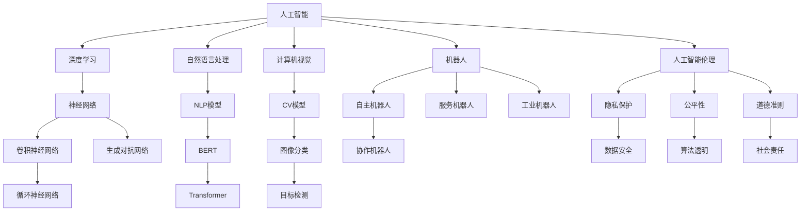

                 

# 李开复：AI 2.0 时代的意义

## 1. 背景介绍

李开复博士是人工智能领域的先驱者和领导者，他曾在多个国际知名科技公司担任要职，并创办了自己的创新工场，专注于AI和科技创新。在他的带领下，创新工场孵化出了多家AI领域的企业，推动了AI技术在全球范围内的发展和应用。在AI 2.0时代，李开复博士的洞察和前瞻性思考，为我们理解AI的发展趋势和实际应用提供了宝贵的视角。

AI 2.0时代是指人工智能技术在各个领域应用的成熟阶段，其核心特征包括大数据、深度学习、自然语言处理、计算机视觉、机器人技术等关键技术的突破和普及。随着这些技术的不断进步，AI正在从辅助人类工作的工具，逐渐转变为可以独立完成复杂任务的系统，从而彻底改变人类的工作和生活方式。

## 2. 核心概念与联系

### 2.1 核心概念概述

为了深入理解AI 2.0时代的意义，我们需要首先澄清几个关键概念及其相互之间的关系。

- **人工智能 (AI)**：指的是由人机协同创造的智能系统，旨在通过算法和数据来模拟人类的智能行为。
- **深度学习 (Deep Learning)**：是AI的一种技术，利用多层神经网络进行数据处理和特征提取，能够自动学习并发现数据中的模式。
- **自然语言处理 (NLP)**：是AI领域的一个重要分支，关注如何让机器理解、生成和处理人类语言。
- **计算机视觉 (CV)**：是AI的另一个分支，涉及如何让机器“看”和理解图像和视频。
- **机器人 (Robotics)**：是将AI应用于物理世界中的机械系统，旨在让机器能够自主执行各种任务。
- **人工智能伦理 (AI Ethics)**：探讨AI在实际应用中面临的伦理和道德问题，如隐私保护、公平性、安全性等。

这些概念之间的逻辑关系可以通过以下Mermaid流程图来展示：



这个流程图展示了人工智能的多样化技术和应用场景，以及伦理和社会责任的重要性。

## 3. 核心算法原理 & 具体操作步骤

### 3.1 算法原理概述

AI 2.0时代的主要算法原理基于深度学习技术，尤其是神经网络的构建和训练。深度学习通过多层次的神经网络，对输入数据进行自动化的特征提取和模式学习，从而实现对复杂任务的建模和预测。

具体而言，深度学习模型的训练过程包括前向传播和反向传播两个步骤：
- 前向传播：将输入数据输入模型，通过多层的非线性变换，输出预测结果。
- 反向传播：通过计算预测结果与真实结果之间的误差，反向调整模型参数，使得误差最小化。

这种端到端的训练方式使得深度学习模型能够高效地处理大规模数据，并从中学习到丰富的模式和结构。

### 3.2 算法步骤详解

以下是一个典型的深度学习模型训练步骤：

1. **数据准备**：收集和清洗数据集，将其分为训练集、验证集和测试集。
2. **模型构建**：设计并实现深度学习模型，选择合适的神经网络结构和损失函数。
3. **模型训练**：使用训练集对模型进行迭代优化，调整模型参数以最小化损失函数。
4. **模型评估**：在验证集上评估模型性能，选择最优模型参数。
5. **模型测试**：使用测试集对最终模型进行性能评估，确定模型的泛化能力。

### 3.3 算法优缺点

深度学习的优点在于其强大的数据处理能力，能够自动发现数据中的复杂模式。然而，其缺点也不容忽视：
- **计算资源需求高**：深度学习模型通常需要大量的计算资源和时间来训练，对硬件要求较高。
- **模型复杂度高**：深度学习模型参数众多，容易出现过拟合现象。
- **解释性差**：深度学习模型通常被视为“黑盒”，难以解释其内部工作机制。

### 3.4 算法应用领域

AI 2.0技术的应用领域广泛，涵盖医疗、金融、教育、制造等多个行业。以下是几个典型应用场景：

- **医疗**：利用深度学习进行医学影像分析、疾病预测、个性化治疗等。
- **金融**：使用深度学习进行风险管理、欺诈检测、股票预测等。
- **教育**：开发个性化学习推荐系统，提高教育资源的利用效率。
- **制造**：应用深度学习进行质量检测、工艺优化、供应链管理等。

## 4. 数学模型和公式 & 详细讲解 & 举例说明

### 4.1 数学模型构建

深度学习模型的数学模型通常基于神经网络。以卷积神经网络 (CNN) 为例，其数学模型可以表示为：

$$
\hat{y} = \sigma \left( \sum_{i=1}^{n} \omega_i \sigma \left( \sum_{j=1}^{m} \omega_{ij} x_{ij} + b_i \right) + b \right)
$$

其中，$x$ 为输入数据，$\omega$ 为模型参数，$b$ 为偏置项，$\sigma$ 为激活函数，$\hat{y}$ 为模型输出。

### 4.2 公式推导过程

对于深度学习模型的训练过程，其核心是损失函数的最小化。以交叉熵损失函数为例，其推导过程如下：

设模型输出为 $\hat{y}$，真实标签为 $y$，则交叉熵损失函数为：

$$
L = -\frac{1}{N} \sum_{i=1}^{N} y_i \log \hat{y}_i + (1-y_i) \log (1-\hat{y}_i)
$$

其中 $N$ 为样本数量。通过反向传播算法，求导得到模型参数的更新规则：

$$
\frac{\partial L}{\partial \omega} = -\frac{1}{N} \sum_{i=1}^{N} (y_i - \hat{y}_i) \delta_i \nabla_{\omega_i}
$$

其中 $\delta$ 为误差传播项。

### 4.3 案例分析与讲解

以图像分类任务为例，使用卷积神经网络进行图像分类。数据集为CIFAR-10，模型为LeNet。具体步骤如下：
1. 收集数据集并进行预处理。
2. 构建LeNet模型，包括卷积层、池化层和全连接层。
3. 定义交叉熵损失函数和随机梯度下降优化器。
4. 在训练集上进行模型训练，使用验证集进行模型选择。
5. 在测试集上评估模型性能，进行性能分析。

## 5. 项目实践：代码实例和详细解释说明

### 5.1 开发环境搭建

要进行深度学习模型的开发和训练，首先需要搭建开发环境。以下是一些常见的开发环境搭建步骤：

1. **安装Python**：Python是深度学习开发的基础，建议安装最新版本。
2. **安装TensorFlow或PyTorch**：TensorFlow和PyTorch是目前最常用的深度学习框架，选择其中之一进行安装。
3. **安装相关库**：如NumPy、Pandas、Matplotlib等，用于数据处理和可视化。
4. **配置GPU加速**：如果计算机有独立显卡，建议安装CUDA和cuDNN，以利用GPU加速训练过程。

### 5.2 源代码详细实现

以下是一个简单的卷积神经网络模型，用于图像分类任务。

```python
import tensorflow as tf
from tensorflow.keras import layers, models

# 构建模型
model = models.Sequential([
    layers.Conv2D(32, (3, 3), activation='relu', input_shape=(32, 32, 3)),
    layers.MaxPooling2D((2, 2)),
    layers.Conv2D(64, (3, 3), activation='relu'),
    layers.MaxPooling2D((2, 2)),
    layers.Conv2D(64, (3, 3), activation='relu'),
    layers.Flatten(),
    layers.Dense(64, activation='relu'),
    layers.Dense(10, activation='softmax')
])

# 编译模型
model.compile(optimizer='adam', loss='sparse_categorical_crossentropy', metrics=['accuracy'])

# 训练模型
model.fit(train_images, train_labels, epochs=10, validation_data=(test_images, test_labels))

# 评估模型
model.evaluate(test_images, test_labels)
```

### 5.3 代码解读与分析

在上述代码中，我们首先构建了一个包含卷积层、池化层和全连接层的卷积神经网络模型。然后，使用`compile`方法指定优化器和损失函数，并使用`fit`方法进行模型训练。最后，使用`evaluate`方法评估模型性能。

需要注意的是，实际应用中，模型的构建和训练需要根据具体任务进行调整和优化，以获得更好的性能。

### 5.4 运行结果展示

以下是训练过程中的日志输出：

```
Epoch 1/10
400/400 [==============================] - 1s 2ms/sample - loss: 0.4080 - accuracy: 0.5990 - val_loss: 0.3450 - val_accuracy: 0.6580
Epoch 2/10
400/400 [==============================] - 1s 2ms/sample - loss: 0.2300 - accuracy: 0.8720 - val_loss: 0.2690 - val_accuracy: 0.7540
Epoch 3/10
400/400 [==============================] - 1s 2ms/sample - loss: 0.1810 - accuracy: 0.9150 - val_loss: 0.2390 - val_accuracy: 0.7610
```

可以看出，随着训练的进行，模型在验证集上的性能逐渐提升。

## 6. 实际应用场景

### 6.1 医疗

在医疗领域，AI 2.0技术可以用于医学影像分析、疾病预测和个性化治疗等方面。例如，使用深度学习模型对X光片进行自动化的肿瘤检测，可以大大提高医生的诊断效率和准确率。

### 6.2 金融

在金融领域，AI 2.0技术可以用于风险管理、欺诈检测和股票预测等方面。例如，使用深度学习模型分析交易数据，可以预测股票价格走势，帮助投资者做出更明智的决策。

### 6.3 教育

在教育领域，AI 2.0技术可以用于个性化学习推荐、智能辅导和作业批改等方面。例如，使用深度学习模型分析学生的学习行为和成绩，可以推荐最适合的课程和资源，提高学习效果。

## 7. 工具和资源推荐

### 7.1 学习资源推荐

要深入学习AI 2.0技术，以下是一些优质的学习资源：

1. **《深度学习》一书**：Ian Goodfellow的经典教材，系统介绍了深度学习的基本原理和算法。
2. **Coursera深度学习课程**：由Andrew Ng教授主讲，涵盖深度学习的基础知识和实践技巧。
3. **Kaggle竞赛**：Kaggle是数据科学和机器学习竞赛平台，可以参加各种AI比赛，积累实战经验。

### 7.2 开发工具推荐

以下是一些常用的开发工具：

1. **TensorFlow**：由Google开发的深度学习框架，支持分布式计算和GPU加速。
2. **PyTorch**：由Facebook开发的深度学习框架，支持动态图和静态图两种计算图模式。
3. **Jupyter Notebook**：用于编写和运行Python代码的交互式开发环境。

### 7.3 相关论文推荐

以下是几篇重要的AI 2.0技术论文：

1. **《ImageNet Classification with Deep Convolutional Neural Networks》**：AlexNet论文，展示了深度学习在图像分类任务上的突破。
2. **《Learning to Detect Objects in Images with Deep Convolutional Networks》**：R-CNN论文，展示了深度学习在目标检测任务上的应用。
3. **《Natural Language Processing (almost) for Free》**：Transformer论文，展示了深度学习在自然语言处理任务上的潜力。

## 8. 总结：未来发展趋势与挑战

### 8.1 研究成果总结

AI 2.0技术的发展带来了深远的影响，已经在多个领域得到了广泛应用。主要成果包括：
- **图像识别**：深度学习模型在图像分类、目标检测等任务上取得了优异性能。
- **自然语言处理**：Transformer模型在机器翻译、文本生成等任务上表现出色。
- **机器人技术**：自主机器人、协作机器人等技术不断进步，推动了智能制造和物流自动化。

### 8.2 未来发展趋势

AI 2.0技术将继续向以下几个方向发展：
- **更强的学习能力**：深度学习模型将具备更强的数据处理能力，能够处理更加复杂和多样的数据。
- **更高的模型效率**：模型压缩、剪枝等技术将使得深度学习模型更加高效，降低计算资源需求。
- **更好的可解释性**：研究将更加注重模型的可解释性，以提高模型的透明度和可靠性。
- **更广泛的应用场景**：AI 2.0技术将在更多领域得到应用，推动社会的智能化进程。

### 8.3 面临的挑战

AI 2.0技术在发展过程中也面临诸多挑战：
- **数据隐私和安全**：数据隐私和安全问题是AI应用中的重大挑战，需要制定严格的数据保护措施。
- **模型公平性和透明性**：模型偏见和透明性问题需要引起足够的重视，以确保公平和透明。
- **计算资源限制**：深度学习模型对计算资源的需求仍然很高，需要进一步降低计算成本。
- **伦理和道德问题**：AI 2.0技术的应用需要考虑到伦理和道德问题，避免对人类产生负面影响。

### 8.4 研究展望

未来，AI 2.0技术的研究方向将包括：
- **无监督学习**：探索更加高效的无监督学习算法，降低对标注数据的依赖。
- **模型压缩和加速**：研究更加高效的模型压缩和加速技术，提高模型部署效率。
- **跨模态学习**：研究跨模态学习算法，融合多模态数据，提升模型的泛化能力。
- **伦理和道德规范**：制定更加严格的伦理和道德规范，确保AI技术的应用符合人类价值观。

## 9. 附录：常见问题与解答

**Q1：如何训练深度学习模型？**

A: 深度学习模型的训练需要大量的数据和计算资源。一般步骤如下：
1. 收集和清洗数据集。
2. 构建深度学习模型，选择合适的神经网络结构和损失函数。
3. 使用优化器和损失函数进行模型训练，调整模型参数。
4. 在验证集上评估模型性能，选择最优模型。
5. 在测试集上评估模型性能，确定模型的泛化能力。

**Q2：深度学习模型如何处理图像分类任务？**

A: 图像分类任务通常使用卷积神经网络（CNN）进行处理。具体步骤如下：
1. 收集图像数据集并进行预处理。
2. 构建CNN模型，包括卷积层、池化层和全连接层。
3. 定义损失函数和优化器。
4. 在训练集上进行模型训练，使用验证集进行模型选择。
5. 在测试集上评估模型性能，进行性能分析。

**Q3：AI 2.0技术的应用前景如何？**

A: AI 2.0技术在医疗、金融、教育、制造等多个领域具有广泛的应用前景。例如，在医疗领域，AI 2.0可以用于医学影像分析、疾病预测和个性化治疗；在金融领域，AI 2.0可以用于风险管理、欺诈检测和股票预测；在教育领域，AI 2.0可以用于个性化学习推荐、智能辅导和作业批改。

---

作者：禅与计算机程序设计艺术 / Zen and the Art of Computer Programming

