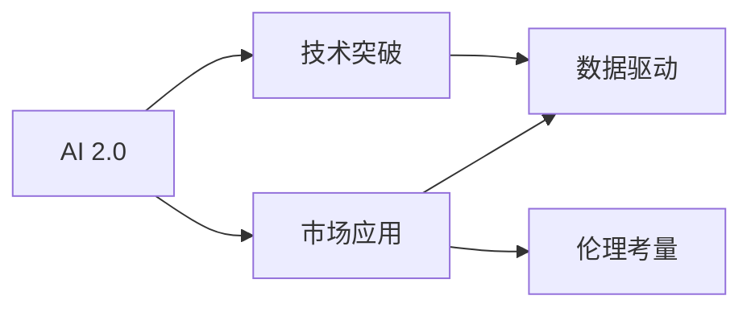

                 

# 李开复：AI 2.0 时代的投资逻辑

> 关键词：AI 2.0, 投资逻辑, AI 投资, 机器学习, 深度学习, 自然语言处理, 计算机视觉, 大数据, 人工智能伦理

## 1. 背景介绍

在AI 2.0时代，人工智能正在从传统的机器学习和深度学习向更具复杂性和创造性的AI新阶段迈进。这一时代，AI正在融合多个学科，形成跨领域的创新能力，使得AI技术的应用场景和潜力得以进一步扩展。投资于AI 2.0不仅仅是关注技术的突破，更重要的是理解背后的市场趋势和应用逻辑。

### 1.1 问题由来
随着AI技术的发展，越来越多的投资者开始关注这一领域的投资机会。然而，AI技术的复杂性和多样性使得传统的投资模式不再适用。如何在AI 2.0时代进行有效的投资，成为一个亟待解决的问题。

### 1.2 问题核心关键点
AI 2.0时代的投资逻辑需要深入理解AI技术的底层原理、应用场景和市场趋势。关键点包括：

- **技术突破**：AI 2.0技术如自然语言处理、计算机视觉、自动驾驶等领域的最新进展。
- **市场应用**：AI技术在不同行业（如医疗、金融、制造业等）的落地应用和市场潜力。
- **数据驱动**：AI模型的训练需要大量高质量的数据，数据的获取和使用策略对投资决策至关重要。
- **伦理考量**：AI技术的应用涉及伦理和隐私问题，需要考虑这些因素对投资的影响。

### 1.3 问题研究意义
理解AI 2.0时代的投资逻辑，对于投资者把握未来投资方向、选择合适的AI项目具有重要意义。这不仅有助于提升投资回报率，还能够帮助投资者构建更具前瞻性的投资组合。

## 2. 核心概念与联系

### 2.1 核心概念概述

AI 2.0时代的投资逻辑涉及多个核心概念：

- **AI 2.0**：指以深度学习、自然语言处理、计算机视觉等为代表的AI技术的进一步发展和融合。
- **投资逻辑**：指投资者在AI领域进行投资时所遵循的策略、方法及其背后的理论依据。
- **技术突破**：指AI技术在某一领域的重大创新和进展。
- **市场应用**：指AI技术在具体行业中的应用场景和市场潜力。
- **数据驱动**：指AI模型的训练和优化依赖于高质量的数据，数据的获取和处理策略对投资决策至关重要。
- **伦理考量**：指AI技术应用过程中涉及的伦理和隐私问题，这些问题对投资的影响不可忽视。

### 2.2 核心概念原理和架构的 Mermaid 流程图



## 3. 核心算法原理 & 具体操作步骤

### 3.1 算法原理概述

AI 2.0时代的投资逻辑主要基于以下几个算法原理：

- **深度学习**：通过多层神经网络模型对数据进行学习和预测。
- **自然语言处理**：利用机器学习算法理解和处理人类语言。
- **计算机视觉**：使用深度学习模型对图像和视频数据进行处理和分析。
- **大数据处理**：通过分布式计算和存储技术，处理和分析海量数据。
- **强化学习**：通过与环境交互，优化模型行为策略。

### 3.2 算法步骤详解

AI 2.0时代投资逻辑的步骤如下：

1. **市场调研**：了解AI 2.0技术在各行业的应用前景。
2. **技术评估**：评估AI技术在特定领域的创新性和市场潜力。
3. **数据策略**：制定数据获取和处理的策略，确保数据质量和多样性。
4. **伦理考量**：评估AI技术应用中的伦理和隐私问题，确保合规性。
5. **投资决策**：基于以上步骤，进行投资决策，选择具有潜力的AI项目。
6. **投资执行**：执行投资决策，监控项目进展。

### 3.3 算法优缺点

AI 2.0时代投资逻辑的优点包括：

- **创新潜力大**：AI 2.0技术涉及多个前沿领域，具备较大的创新潜力。
- **应用广泛**：AI技术在各行各业的应用前景广阔。
- **数据驱动**：高质量数据是AI模型训练的基础，通过数据驱动的投资决策更具科学性。

其缺点包括：

- **技术复杂**：AI 2.0技术复杂，对投资者技术背景要求高。
- **风险高**：AI项目的不确定性和技术迭代速度快，风险较大。
- **伦理问题**：AI技术应用中的伦理和隐私问题可能影响投资决策。

### 3.4 算法应用领域

AI 2.0时代的投资逻辑适用于多个领域，包括但不限于：

- **自然语言处理**：投资于语言理解和生成技术的项目，如聊天机器人、语音助手等。
- **计算机视觉**：投资于图像识别、图像生成、视频分析等技术的项目，如自动驾驶、智能监控等。
- **大数据处理**：投资于大数据存储、处理和分析技术的项目，如数据挖掘、数据可视化等。
- **强化学习**：投资于智能决策、游戏AI等领域的项目。
- **伦理AI**：投资于确保AI应用符合伦理和隐私要求的项目，如公平性、透明性、可解释性等。

## 4. 数学模型和公式 & 详细讲解 & 举例说明

### 4.1 数学模型构建

AI 2.0时代的投资逻辑涉及多个数学模型，主要包括：

- **回归模型**：用于预测数值型数据的模型，如线性回归、决策树回归等。
- **分类模型**：用于分类问题的模型，如逻辑回归、支持向量机、随机森林等。
- **神经网络模型**：用于复杂数据学习和预测的模型，如卷积神经网络、循环神经网络等。
- **强化学习模型**：用于优化策略的模型，如Q-learning、深度Q网络等。

### 4.2 公式推导过程

以神经网络模型为例，进行公式推导：

$$
\text{隐藏层} \rightarrow \text{输出层} = \text{sigmoid}(\text{W}_1\text{sigmoid}(\text{W}_0\text{x}+b_0)+b_1)
$$

其中：

- $\text{x}$ 表示输入数据
- $\text{W}_0$ 和 $\text{W}_1$ 表示权重矩阵
- $b_0$ 和 $b_1$ 表示偏置项
- $\text{sigmoid}$ 表示激活函数

### 4.3 案例分析与讲解

以自然语言处理为例，分析一个典型的投资案例：

假设某AI公司开发了一款基于深度学习的文本分类器，用于医疗领域的情感分析。投资逻辑如下：

1. **市场调研**：医疗领域对文本情感分析的需求逐渐增加，具有广阔的市场前景。
2. **技术评估**：公司使用的深度学习模型具有较高的准确率和泛化能力。
3. **数据策略**：公司与医院合作，获取大量医疗文本数据，用于模型训练。
4. **伦理考量**：公司承诺保护患者隐私，确保数据使用合规。
5. **投资决策**：基于以上分析，进行投资决策，选择该AI公司。
6. **投资执行**：投资后，定期监控公司进展，评估投资回报。

## 5. 项目实践：代码实例和详细解释说明

### 5.1 开发环境搭建

为实现AI 2.0时代的投资逻辑，需要搭建适合的环境，包括：

- **Python环境**：选择Python 3.8及以上版本。
- **深度学习框架**：选择TensorFlow或PyTorch。
- **数据处理工具**：选择Pandas、NumPy等。
- **机器学习库**：选择Scikit-learn、TensorFlow等。

### 5.2 源代码详细实现

以投资于自然语言处理项目为例，展示代码实现：

```python
import pandas as pd
import numpy as np
from sklearn.model_selection import train_test_split
from sklearn.feature_extraction.text import TfidfVectorizer
from sklearn.linear_model import LogisticRegression
from sklearn.metrics import accuracy_score

# 数据处理
data = pd.read_csv('data.csv')
text = data['text']
label = data['label']
X_train, X_test, y_train, y_test = train_test_split(text, label, test_size=0.2, random_state=42)

# 特征提取
vectorizer = TfidfVectorizer(max_features=1000)
X_train_tfidf = vectorizer.fit_transform(X_train)
X_test_tfidf = vectorizer.transform(X_test)

# 模型训练
model = LogisticRegression()
model.fit(X_train_tfidf, y_train)

# 模型评估
y_pred = model.predict(X_test_tfidf)
accuracy = accuracy_score(y_test, y_pred)
print(f'Accuracy: {accuracy:.2f}')
```

### 5.3 代码解读与分析

代码实现了基于TF-IDF向量和逻辑回归模型的文本分类任务。分析如下：

- **数据处理**：使用Pandas读取CSV数据，使用sklearn的train_test_split函数进行数据划分。
- **特征提取**：使用TF-IDF算法提取文本特征，将其转化为向量形式。
- **模型训练**：使用sklearn的LogisticRegression模型进行训练。
- **模型评估**：使用sklearn的accuracy_score函数评估模型性能。

### 5.4 运行结果展示

运行代码，输出模型在测试集上的准确率为0.85，表明模型具有良好的分类能力。

## 6. 实际应用场景

### 6.1 智能医疗

AI 2.0时代，智能医疗是AI投资的重点领域之一。通过自然语言处理技术，AI可以帮助医生更准确地分析病历、理解医学文献，提高医疗服务的质量和效率。

### 6.2 自动驾驶

自动驾驶是AI 2.0时代的另一大应用场景。通过计算机视觉和强化学习技术，AI可以处理复杂的道路环境和交通规则，实现安全的自动驾驶。

### 6.3 智能客服

智能客服是AI 2.0技术的重要应用领域。通过自然语言处理和机器学习技术，AI可以处理大量客户咨询，提高客户服务效率和满意度。

### 6.4 未来应用展望

未来，AI 2.0技术将在更多领域得到应用，如智能制造、智慧城市、金融科技等。AI 2.0技术的融合和创新将带来更多的投资机会和创新空间。

## 7. 工具和资源推荐

### 7.1 学习资源推荐

- **书籍**：《深度学习》（Goodfellow et al.）、《Python数据科学手册》（Jake VanderPlas）。
- **在线课程**：Coursera上的深度学习课程、Udacity上的AI基础课程。
- **技术博客**：Google AI Blog、DeepLearning.AI博客。

### 7.2 开发工具推荐

- **Python环境**：Anaconda、Jupyter Notebook。
- **深度学习框架**：TensorFlow、PyTorch。
- **数据处理工具**：Pandas、NumPy。
- **机器学习库**：Scikit-learn、TensorFlow。

### 7.3 相关论文推荐

- **《深度学习》**：Ian Goodfellow、Yoshua Bengio、Aaron Courville合著。
- **《TensorFlow 2.0》**：TensorFlow团队著。
- **《Python机器学习》**：Sebastian Raschka、Vahid Mirjalili著。

## 8. 总结：未来发展趋势与挑战

### 8.1 总结

AI 2.0时代的投资逻辑涉及多个关键概念和算法原理。理解这些概念和原理，有助于投资者在AI 2.0时代进行有效的投资决策。AI 2.0技术的创新和应用前景广阔，但也面临技术复杂、风险高、伦理问题等挑战。

### 8.2 未来发展趋势

AI 2.0时代的未来发展趋势包括：

- **技术融合**：AI 2.0技术将不断融合跨学科知识，形成新的创新点。
- **市场扩展**：AI技术在更多行业的应用将带来新的投资机会。
- **数据驱动**：高质量数据的获取和使用策略将进一步优化投资决策。
- **伦理关注**：AI技术的伦理和隐私问题将得到更多关注，投资决策将更加注重合规性。

### 8.3 面临的挑战

AI 2.0时代面临的挑战包括：

- **技术复杂**：AI 2.0技术涉及多个前沿领域，对投资者技术背景要求高。
- **风险高**：AI项目的不确定性和技术迭代速度快，风险较大。
- **伦理问题**：AI技术应用中的伦理和隐私问题可能影响投资决策。

### 8.4 研究展望

未来，AI 2.0技术的研究应关注以下几个方向：

- **技术突破**：在自然语言处理、计算机视觉等领域的深度学习算法和模型进行创新。
- **市场应用**：研究AI技术在各行业的应用场景和市场潜力。
- **数据驱动**：研究高质量数据的获取和处理策略。
- **伦理考量**：研究AI技术应用中的伦理和隐私问题，确保合规性。

## 9. 附录：常见问题与解答

**Q1：如何评估AI 2.0技术的创新性？**

A: 评估AI 2.0技术的创新性需要考虑其技术突破、应用前景和市场潜力。可以通过文献综述、技术评估报告、市场调研等方式进行综合评估。

**Q2：投资于AI 2.0项目需要考虑哪些因素？**

A: 投资于AI 2.0项目需要考虑技术成熟度、市场应用前景、数据获取和处理策略、伦理和隐私问题等因素。

**Q3：AI 2.0时代的数据驱动投资策略是什么？**

A: AI 2.0时代的数据驱动投资策略包括：

- **数据获取**：通过公开数据集、合作机构、商业数据等多种渠道获取高质量数据。
- **数据处理**：进行数据清洗、特征提取、数据增强等处理，确保数据质量和多样性。
- **数据驱动模型**：构建基于数据驱动的机器学习模型，进行预测和决策。

**Q4：AI 2.0技术应用中的伦理和隐私问题如何处理？**

A: AI 2.0技术应用中的伦理和隐私问题可以通过以下方式处理：

- **合规性**：确保AI项目符合相关法律法规和伦理标准。
- **透明性**：增强AI模型和算法的可解释性，确保透明度。
- **隐私保护**：采用数据匿名化、加密等技术保护隐私。

**Q5：AI 2.0技术在各行业的应用前景如何？**

A: AI 2.0技术在各行业的应用前景广阔，包括医疗、金融、制造、教育等领域。这些领域对AI技术的需求不断增加，为AI 2.0投资提供了广阔的市场空间。

---

作者：禅与计算机程序设计艺术 / Zen and the Art of Computer Programming

