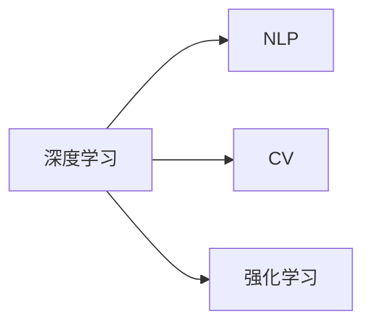

                 

# 李开复：AI 2.0 时代的机遇

## 1. 背景介绍

### 1.1 问题由来

人工智能（AI）正在快速演进，从AI 1.0到AI 2.0的转变已成必然。AI 1.0时代，计算机可以处理结构化数据，例如表格和文档。而AI 2.0时代，计算机能够理解和处理非结构化数据，如语音、图像、视频和自然语言。

在AI 2.0时代，AI不再局限于单一的应用领域，而是通过跨领域的深度学习模型和算法，广泛应用于医疗、金融、教育、交通等各个领域。AI 2.0的核心技术包括自然语言处理（NLP）、计算机视觉（CV）、语音识别、强化学习等。AI 2.0的出现，不仅提升了信息处理的效率，也创造了新的商业机会，推动了社会进步。

### 1.2 问题核心关键点

AI 2.0的机遇主要体现在以下几个方面：

- **高效的信息处理**：AI 2.0能够处理大量非结构化数据，提升信息处理的效率，支持大规模数据分析和决策。
- **增强决策支持**：AI 2.0通过深度学习模型和算法，提供更准确的预测和决策支持，优化决策流程。
- **创造新的商业模式**：AI 2.0技术的广泛应用，催生了新的商业模式和服务，例如自动驾驶、智能客服、个性化推荐等。
- **推动社会进步**：AI 2.0在教育、医疗、公共安全等领域的应用，极大地提升了公共服务的效率和质量，改善了人们的生活质量。
- **提升研究能力**：AI 2.0技术推动了科学研究的进步，加速了知识发现和创新。

## 2. 核心概念与联系

### 2.1 核心概念概述

- **深度学习**：深度学习是一种机器学习方法，通过多层次的非线性变换，从大量数据中学习特征表示，并进行复杂模式的识别和分类。
- **自然语言处理（NLP）**：NLP是AI 2.0时代的重要应用领域，包括文本分类、机器翻译、语音识别、情感分析等。
- **计算机视觉（CV）**：CV通过图像处理和深度学习技术，实现对视觉数据的理解和分析，应用于自动驾驶、安防监控等领域。
- **强化学习**：强化学习是一种通过试错和反馈机制，学习最优策略的机器学习方法，广泛应用于游戏、机器人控制等领域。

### 2.2 核心概念原理和架构的 Mermaid 流程图



这个流程图展示了AI 2.0时代核心技术之间的相互联系。深度学习是AI 2.0的基础，而NLP、CV和强化学习则是其具体应用领域。

## 3. 核心算法原理 & 具体操作步骤

### 3.1 算法原理概述

AI 2.0时代的关键算法包括深度神经网络、卷积神经网络（CNN）、循环神经网络（RNN）和生成对抗网络（GAN）等。其中，深度神经网络是最常用的基础算法，通过多层神经元的组合，实现对复杂非线性关系的建模和处理。

### 3.2 算法步骤详解

AI 2.0算法通常包括以下几个关键步骤：

1. **数据预处理**：包括数据清洗、归一化、特征提取等。数据预处理是模型训练的前提，直接影响模型的性能。
2. **模型选择和设计**：根据任务特点选择合适的模型架构，并进行模型调优和超参数设置。模型选择和设计是模型的核心步骤。
3. **训练模型**：使用训练数据集对模型进行训练，通过反向传播算法优化模型参数。训练过程需要大量的计算资源和时间。
4. **评估模型**：使用验证数据集对模型进行评估，计算模型的准确率、召回率、F1分数等指标。评估模型是模型优化的依据。
5. **应用模型**：将训练好的模型应用于实际任务中，进行预测、分类、识别等操作。应用模型是模型的最终目标。

### 3.3 算法优缺点

AI 2.0算法的主要优点包括：

- **高效性**：AI 2.0算法可以处理大规模数据集，实现高效的特征提取和模式识别。
- **鲁棒性**：AI 2.0算法通常具有较好的泛化能力，能够适应不同的数据分布和噪声。
- **可解释性**：某些AI 2.0算法，如决策树、逻辑回归等，具有较好的可解释性，便于理解和解释模型的决策过程。

AI 2.0算法的主要缺点包括：

- **计算资源需求高**：AI 2.0算法通常需要大量的计算资源，包括高性能的GPU、TPU等硬件设备。
- **模型复杂度大**：AI 2.0算法模型结构复杂，训练和优化过程需要精细的调参和优化。
- **数据需求高**：AI 2.0算法通常需要大量的标注数据进行训练，数据采集和标注成本较高。

### 3.4 算法应用领域

AI 2.0算法广泛应用于以下几个领域：

- **自然语言处理（NLP）**：包括文本分类、机器翻译、情感分析、问答系统等。NLP是AI 2.0的核心应用领域，广泛应用于智能客服、自动摘要、智能写作等场景。
- **计算机视觉（CV）**：包括图像分类、目标检测、人脸识别、视频分析等。CV技术广泛应用于自动驾驶、安防监控、医疗影像分析等领域。
- **语音识别**：通过深度学习模型，将语音信号转换为文本信息，广泛应用于智能音箱、语音助手、自动字幕生成等领域。
- **强化学习**：通过试错机制，学习最优策略，应用于游戏、机器人控制、推荐系统等领域。

## 4. 数学模型和公式 & 详细讲解 & 举例说明

### 4.1 数学模型构建

AI 2.0模型的数学模型通常包括损失函数、优化算法和评价指标等。以图像分类任务为例，假设模型的输出为 $y$，真实标签为 $t$，则损失函数为交叉熵损失：

$$
\mathcal{L}(y,t) = -\frac{1}{N}\sum_{i=1}^N t_i\log y_i + (1-t_i)\log(1-y_i)
$$

### 4.2 公式推导过程

假设模型为全连接神经网络，包含 $L$ 层，每层有 $n$ 个神经元，输入为 $x$，输出为 $y$，则前向传播过程为：

$$
z_l = W_lx_l + b_l
$$

$$
a_l = \sigma(z_l)
$$

其中，$\sigma$ 为激活函数，$W_l$ 和 $b_l$ 为可训练参数。反向传播过程为：

$$
\frac{\partial \mathcal{L}}{\partial W_l} = \frac{\partial \mathcal{L}}{\partial z_l}\frac{\partial z_l}{\partial W_l}
$$

$$
\frac{\partial \mathcal{L}}{\partial b_l} = \frac{\partial \mathcal{L}}{\partial z_l}\frac{\partial z_l}{\partial b_l}
$$

通过链式法则计算梯度，使用优化算法（如Adam、SGD等）更新模型参数，最小化损失函数。

### 4.3 案例分析与讲解

以图像分类任务为例，假设使用卷积神经网络（CNN）进行训练，输入为图像数据 $x$，输出为图像分类结果 $y$。通过训练数据集对模型进行优化，得到最优的模型参数 $W$ 和 $b$。然后，使用测试数据集对模型进行评估，计算准确率和召回率等指标，判断模型的性能。

## 5. 项目实践：代码实例和详细解释说明

### 5.1 开发环境搭建

- **安装Python和PyTorch**：
  ```
  pip install torch torchvision torchaudio
  ```

- **安装TensorFlow**：
  ```
  pip install tensorflow
  ```

- **安装TensorBoard**：
  ```
  pip install tensorboard
  ```

- **安装Keras**：
  ```
  pip install keras
  ```

- **安装NumPy和Pandas**：
  ```
  pip install numpy pandas
  ```

### 5.2 源代码详细实现

```python
import torch
import torch.nn as nn
import torch.optim as optim
import torchvision.transforms as transforms
from torchvision.datasets import CIFAR10
from torchvision.models import resnet18
from torch.utils.data import DataLoader
from torchvision.models import resnet18
import matplotlib.pyplot as plt

# 数据预处理
transform = transforms.Compose(
    [transforms.ToTensor(),
     transforms.Normalize((0.5, 0.5, 0.5), (0.5, 0.5, 0.5))])

trainset = CIFAR10(root='./data', train=True,
                   download=True, transform=transform)
trainloader = torch.utils.data.DataLoader(trainset, batch_size=4,
                                         shuffle=True, num_workers=2)

testset = CIFAR10(root='./data', train=False,
                  download=True, transform=transform)
testloader = torch.utils.data.DataLoader(testset, batch_size=4,
                                       shuffle=False, num_workers=2)

classes = ('plane', 'car', 'bird', 'cat',
           'deer', 'dog', 'frog', 'horse', 'ship', 'truck')

# 定义模型
model = resnet18(pretrained=True)

# 定义损失函数和优化器
criterion = nn.CrossEntropyLoss()
optimizer = optim.SGD(model.parameters(), lr=0.001, momentum=0.9)

# 训练模型
for epoch in range(2):
    running_loss = 0.0
    for i, data in enumerate(trainloader, 0):
        inputs, labels = data
        optimizer.zero_grad()
        outputs = model(inputs)
        loss = criterion(outputs, labels)
        loss.backward()
        optimizer.step()

        running_loss += loss.item()
        if i % 2000 == 1999:
            print('[%d, %5d] loss: %.3f' %
                  (epoch + 1, i + 1, running_loss / 2000))
            running_loss = 0.0

print('Finished Training')

# 测试模型
correct = 0
total = 0
with torch.no_grad():
    for data in testloader:
        images, labels = data
        outputs = model(images)
        _, predicted = torch.max(outputs.data, 1)
        total += labels.size(0)
        correct += (predicted == labels).sum().item()

print('Accuracy of the network on the 10000 test images: %d %%' % (
    100 * correct / total))
```

### 5.3 代码解读与分析

- **数据预处理**：使用`torchvision.transforms`模块对数据进行预处理，包括将像素值归一化、转化为Tensor格式等。
- **模型选择和设计**：选择预训练的ResNet-18模型，并进行微调。
- **训练模型**：定义损失函数和优化器，使用SGD算法对模型进行训练，计算并输出损失函数。
- **测试模型**：在测试数据集上评估模型性能，计算准确率。

### 5.4 运行结果展示

训练结束后，可以在TensorBoard中查看训练过程中的各项指标，包括损失函数、准确率、召回率等。TensorBoard提供可视化的图表，便于观察训练过程和模型性能。

```bash
tensorboard --logdir log
```

## 6. 实际应用场景

### 6.1 智能客服系统

智能客服系统通过AI 2.0技术，可以实现自动理解客户意图，自动匹配答案，提升客户体验。例如，使用NLP技术，对客户的语音或文本进行分词、词性标注、命名实体识别等，然后通过意图分类器，识别客户的意图，最后根据意图生成答案。

### 6.2 金融舆情监测

金融舆情监测通过AI 2.0技术，可以实时监测新闻、评论、社交媒体等信息，分析市场情绪，预测市场趋势。例如，使用NLP技术，对文本进行情感分析、主题分类，然后通过机器学习模型，预测股票涨跌。

### 6.3 个性化推荐系统

个性化推荐系统通过AI 2.0技术，可以实现对用户的兴趣和行为进行分析，推荐用户感兴趣的内容。例如，使用NLP技术，对用户评论、浏览记录进行分析，然后通过协同过滤、内容推荐等算法，生成个性化推荐列表。

### 6.4 未来应用展望

未来，AI 2.0技术将在更多领域得到应用，推动社会进步。例如：

- **医疗健康**：AI 2.0技术可以用于医学影像分析、诊断辅助、个性化医疗等，提升医疗服务的效率和质量。
- **教育培训**：AI 2.0技术可以用于智能教学、自动批改、学习路径推荐等，提升教育培训的个性化和智能化水平。
- **交通出行**：AI 2.0技术可以用于自动驾驶、交通流量分析、智能调度等，提升交通出行的安全性和效率。
- **环境保护**：AI 2.0技术可以用于环境监测、污染预测、智能调度等，保护生态环境。

## 7. 工具和资源推荐

### 7.1 学习资源推荐

- **Coursera**：提供深度学习、机器学习等在线课程，涵盖NLP、CV、强化学习等多个领域。
- **Kaggle**：提供数据科学竞赛平台，可以学习和实践AI 2.0算法。
- **arXiv**：提供最新的AI论文，可以跟踪前沿技术。

### 7.2 开发工具推荐

- **PyTorch**：提供高效的深度学习框架，易于使用，支持GPU加速。
- **TensorFlow**：提供强大的计算图框架，支持分布式计算，适用于大规模模型训练。
- **Keras**：提供简单易用的深度学习框架，适合快速原型开发。
- **TensorBoard**：提供可视化工具，方便监控模型训练和评估。

### 7.3 相关论文推荐

- **ImageNet Large Scale Visual Recognition Challenge（ILSVRC）**：提供大规模图像分类数据集和评测标准，推动CV技术的发展。
- **BERT: Pre-training of Deep Bidirectional Transformers for Language Understanding**：提出BERT模型，推动NLP技术的发展。
- **Playing Atari with Deep Reinforcement Learning**：提出使用深度强化学习算法，实现游戏自动化的突破。

## 8. 总结：未来发展趋势与挑战

### 8.1 研究成果总结

AI 2.0技术在多个领域取得了显著的进展，推动了社会进步。未来，AI 2.0技术将继续发展，推动更多领域的应用。

### 8.2 未来发展趋势

未来AI 2.0技术的发展趋势包括：

- **多模态融合**：将文本、图像、语音等多模态数据进行融合，提升模型的综合表现。
- **跨领域迁移**：通过迁移学习，实现跨领域任务的泛化能力。
- **深度学习与经典算法的结合**：将深度学习与传统的机器学习算法结合，提升模型的可解释性和鲁棒性。
- **联邦学习**：通过分布式计算，实现模型训练和推理的联邦化，保护数据隐私。
- **边缘计算**：在边缘设备上进行模型推理，提升响应速度和计算效率。

### 8.3 面临的挑战

AI 2.0技术面临的挑战包括：

- **计算资源需求高**：大规模模型训练和推理需要高性能计算资源。
- **数据隐私保护**：如何在保护数据隐私的前提下，进行模型训练和推理。
- **模型可解释性**：如何提升模型的可解释性，增强模型的可信度。
- **算法的公平性和偏见**：如何消除算法的偏见，确保算法的公平性和可信度。

### 8.4 研究展望

未来AI 2.0技术的研究展望包括：

- **计算资源优化**：通过硬件加速和算法优化，提升计算效率。
- **数据隐私保护**：通过联邦学习、差分隐私等技术，保护数据隐私。
- **模型可解释性**：通过可解释性算法、可视化工具，提升模型的可解释性。
- **算法的公平性**：通过算法改进和监管机制，消除算法的偏见，确保公平性。

## 9. 附录：常见问题与解答

**Q1: AI 2.0技术有哪些应用领域？**

A: AI 2.0技术可以应用于医疗、金融、教育、交通、环境保护等多个领域，提升各领域的服务效率和质量。

**Q2: AI 2.0算法的主要优点和缺点是什么？**

A: AI 2.0算法的优点包括高效性、鲁棒性和可解释性；缺点包括计算资源需求高、模型复杂度和数据需求高。

**Q3: 如何使用AI 2.0算法进行图像分类？**

A: 使用卷积神经网络（CNN）作为模型，在训练数据集上进行训练，然后对测试数据集进行分类。

**Q4: AI 2.0技术的未来发展趋势是什么？**

A: AI 2.0技术的未来发展趋势包括多模态融合、跨领域迁移、深度学习与经典算法结合、联邦学习和边缘计算。

**Q5: 如何保护数据隐私？**

A: 通过联邦学习、差分隐私等技术，保护数据隐私。

---

作者：禅与计算机程序设计艺术 / Zen and the Art of Computer Programming

