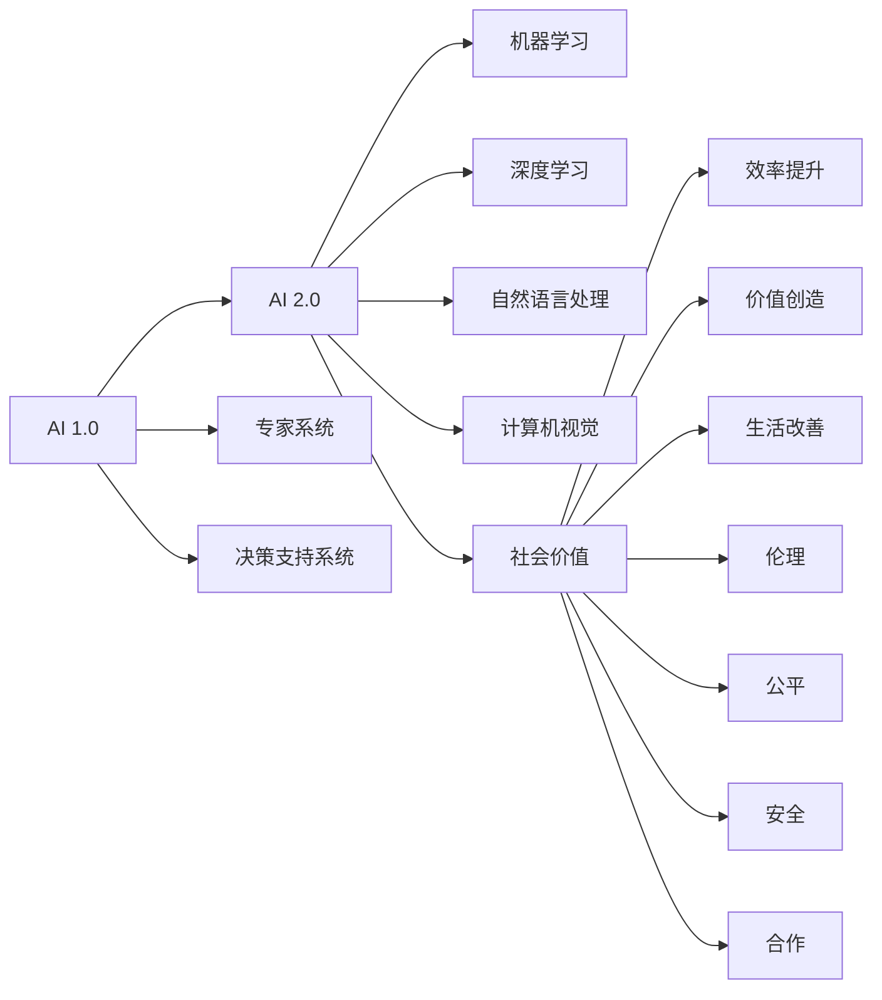

                 

# 李开复：AI 2.0 时代的社会价值

> 关键词：人工智能，AI 2.0，社会价值，伦理，公平，安全，合作

## 1. 背景介绍

在人工智能（AI）迅猛发展的今天，AI 2.0时代的到来已经成为了不争的事实。AI 2.0不仅意味着技术的飞跃，更代表着人工智能在社会各个方面的深度融合。李开复博士作为AI领域的翘楚，近年来持续关注和探索AI在社会层面的广泛价值。本文将从李开复的视角，深入探讨AI 2.0时代人工智能的社会价值，以及在这一过程中我们需要面对和解决的关键问题。

## 2. 核心概念与联系

### 2.1 核心概念概述

为了更好地理解AI 2.0时代的社会价值，我们首先需要明确以下几个核心概念：

- **人工智能（AI）**：指能够模拟人类智能行为的计算机系统，涵盖了机器学习、深度学习、自然语言处理、计算机视觉等多个子领域。

- **AI 1.0**：以专家系统和决策支持系统为代表的传统AI时代，主要依赖规则和知识库，解决特定领域的复杂问题。

- **AI 2.0**：以数据驱动的机器学习和深度学习为核心的新AI时代，能够通过大规模数据学习，进行自主学习与创新。

- **社会价值**：指AI技术在提升效率、创造价值、改善生活等方面的积极影响。

- **伦理**：涉及AI开发和使用过程中的道德规范和价值判断。

- **公平**：指AI系统在服务应用中实现对不同人群的平等对待，避免偏见和歧视。

- **安全**：指AI系统在使用过程中保障数据隐私、系统稳定和安全可靠。

- **合作**：指在AI技术的开发和应用过程中，多方主体（如政府、企业、用户）的协作与共建。

通过这些概念，我们可以更好地理解AI 2.0时代人工智能在社会层面的广泛应用及其所产生的深远影响。

### 2.2 核心概念原理和架构的 Mermaid 流程图



通过这个流程图，我们能够清晰地看到AI 2.0时代人工智能在技术演进和社会影响之间的联系。

## 3. 核心算法原理 & 具体操作步骤

### 3.1 算法原理概述

AI 2.0时代的人工智能，其核心在于利用大规模数据进行训练，通过深度学习等方法，使机器具备自学习、自适应和自主创新的能力。在大数据、高性能计算和深度学习技术的推动下，AI 2.0得以突破AI 1.0的限制，实现从规则驱动到数据驱动的转变。

### 3.2 算法步骤详解

AI 2.0时代的人工智能开发通常包括以下几个关键步骤：

1. **数据准备**：收集并处理大规模数据，为模型的训练提供数据支持。

2. **模型构建**：选择合适的深度学习模型，如卷积神经网络（CNN）、循环神经网络（RNN）、变分自编码器（VAE）等，并进行必要的架构设计。

3. **模型训练**：利用训练数据对模型进行训练，调整模型参数，提高模型性能。

4. **模型评估**：使用测试数据集对模型进行评估，检验模型在未见过的数据上的泛化能力。

5. **模型部署**：将训练好的模型部署到实际应用场景中，进行实时预测和推理。

6. **持续改进**：根据实际应用中的反馈数据，不断调整和优化模型，实现模型性能的持续提升。

### 3.3 算法优缺点

AI 2.0时代的人工智能具有以下优点：

- **高效自动化**：自动化程度高，可以处理大规模数据，提升工作效率。
- **自适应性强**：能够通过学习新的数据，自适应变化的环境。
- **创新潜力大**：能够从海量数据中发现新知识，推动创新发展。

同时，也存在以下缺点：

- **数据依赖**：需要大量高质量的数据进行训练，数据获取和处理成本高。
- **模型复杂性**：模型复杂度高，需要高性能计算资源。
- **安全风险**：模型可能存在偏见和错误，影响公正和安全。

### 3.4 算法应用领域

AI 2.0时代的人工智能在多个领域得到广泛应用，包括但不限于：

- **医疗健康**：辅助诊断、药物研发、个性化治疗等。
- **金融服务**：风险评估、交易预测、客户服务等。
- **智能制造**：生产优化、质量控制、供应链管理等。
- **教育培训**：个性化学习、智能辅导、课程推荐等。
- **自动驾驶**：路径规划、环境感知、决策控制等。
- **安全监控**：异常检测、视频分析、人脸识别等。

## 4. 数学模型和公式 & 详细讲解 & 举例说明

### 4.1 数学模型构建

在AI 2.0时代，深度学习是实现自学习功能的重要手段。以卷积神经网络（CNN）为例，其数学模型构建如下：

- **输入层**：将输入数据转化为矩阵形式。
- **卷积层**：通过卷积操作提取特征，减少数据维度。
- **池化层**：对卷积层输出的特征进行下采样，减小数据量。
- **全连接层**：将池化层输出的特征与目标变量进行关联，构建分类器。
- **输出层**：输出模型预测结果。

### 4.2 公式推导过程

以一个简单的二分类问题为例，我们推导CNN模型的损失函数。假设模型的输出为 $\hat{y}$，真实标签为 $y$，则交叉熵损失函数为：

$$
\mathcal{L} = -(y \log \hat{y} + (1-y) \log (1-\hat{y}))
$$

其中 $y \in \{0,1\}$，$\hat{y} \in (0,1)$。在反向传播过程中，我们计算梯度：

$$
\frac{\partial \mathcal{L}}{\partial \theta} = -(y - \hat{y})
$$

其中 $\theta$ 为模型参数。通过梯度下降等优化算法，我们不断调整 $\theta$，使 $\mathcal{L}$ 最小化。

### 4.3 案例分析与讲解

以智能推荐系统为例，我们可以通过深度学习模型对用户行为数据进行建模，学习用户的兴趣偏好。假设我们有一个用户-物品交互矩阵 $\mathbf{X} \in \mathbb{R}^{N\times M}$，其中 $N$ 为用户数，$M$ 为物品数，$x_{ij}$ 表示用户 $i$ 对物品 $j$ 的评分。通过多层感知器（MLP）模型，我们训练出用户兴趣模型：

$$
\hat{y} = f(\mathbf{X}\mathbf{W} + \mathbf{b})
$$

其中 $\mathbf{W}$ 为权重矩阵，$\mathbf{b}$ 为偏置向量，$f$ 为激活函数。利用交叉熵损失函数 $\mathcal{L} = -(y \log \hat{y} + (1-y) \log (1-\hat{y}))$，我们可以训练出用户兴趣模型，并用于推荐新物品。

## 5. 项目实践：代码实例和详细解释说明

### 5.1 开发环境搭建

开发AI 2.0时代的人工智能应用，需要一个高效、灵活的开发环境。常用的工具包括：

- **Python**：作为主要编程语言，拥有丰富的第三方库和框架。
- **PyTorch**：一个动态计算图框架，适用于深度学习和强化学习。
- **TensorFlow**：一个静态计算图框架，适用于大规模分布式训练。
- **Jupyter Notebook**：用于数据探索和模型训练。
- **Git**：版本控制工具，便于协作开发。

### 5.2 源代码详细实现

以一个简单的图像分类模型为例，我们使用PyTorch进行实现。首先，导入必要的库和数据集：

```python
import torch
import torch.nn as nn
import torch.optim as optim
from torchvision import datasets, transforms

# 定义模型
class Net(nn.Module):
    def __init__(self):
        super(Net, self).__init__()
        self.conv1 = nn.Conv2d(3, 6, 5)
        self.pool = nn.MaxPool2d(2, 2)
        self.conv2 = nn.Conv2d(6, 16, 5)
        self.fc1 = nn.Linear(16 * 5 * 5, 120)
        self.fc2 = nn.Linear(120, 84)
        self.fc3 = nn.Linear(84, 10)

    def forward(self, x):
        x = self.pool(nn.functional.relu(self.conv1(x)))
        x = self.pool(nn.functional.relu(self.conv2(x)))
        x = x.view(-1, 16 * 5 * 5)
        x = nn.functional.relu(self.fc1(x))
        x = nn.functional.relu(self.fc2(x))
        x = self.fc3(x)
        return nn.functional.log_softmax(x, dim=1)

# 加载数据集
trainset = datasets.CIFAR10(root='./data', train=True, download=True, transform=transforms.ToTensor())
testset = datasets.CIFAR10(root='./data', train=False, download=True, transform=transforms.ToTensor())
trainloader = torch.utils.data.DataLoader(trainset, batch_size=4, shuffle=True, num_workers=2)
testloader = torch.utils.data.DataLoader(testset, batch_size=4, shuffle=False, num_workers=2)

# 定义模型、损失函数和优化器
net = Net()
criterion = nn.NLLLoss()
optimizer = optim.SGD(net.parameters(), lr=0.001, momentum=0.9)
```

然后，进行模型的训练和评估：

```python
# 训练模型
for epoch in range(2):
    running_loss = 0.0
    for i, data in enumerate(trainloader, 0):
        inputs, labels = data
        optimizer.zero_grad()
        outputs = net(inputs)
        loss = criterion(outputs, labels)
        loss.backward()
        optimizer.step()
        running_loss += loss.item()
        if i % 2000 == 1999:    # 每2000步输出一次结果
            print('[%d, %5d] loss: %.3f' % (epoch + 1, i + 1, running_loss / 2000))
            running_loss = 0.0

# 测试模型
correct = 0
total = 0
with torch.no_grad():
    for data in testloader:
        images, labels = data
        outputs = net(images)
        _, predicted = torch.max(outputs.data, 1)
        total += labels.size(0)
        correct += (predicted == labels).sum().item()

print('Accuracy of the network on the 10000 test images: %d %%' % (100 * correct / total))
```

### 5.3 代码解读与分析

在上述代码中，我们首先定义了一个简单的卷积神经网络模型 `Net`，包括卷积层、池化层和全连接层。然后，我们加载了CIFAR-10数据集，并将其划分为训练集和测试集。接着，我们定义了损失函数和优化器，并开始训练模型。在每个epoch结束时，我们在测试集上评估模型性能，输出准确率。

## 6. 实际应用场景

### 6.1 智能推荐系统

AI 2.0时代的智能推荐系统，能够利用用户的历史行为数据，预测其未来的兴趣偏好。通过深度学习模型，可以构建用户兴趣模型，实现个性化推荐。智能推荐系统已经在电商、视频、音乐等多个领域广泛应用，极大地提升了用户体验和满意度。

### 6.2 医疗健康

AI 2.0在医疗健康领域的应用，包括疾病诊断、患者管理、药物研发等。深度学习模型可以分析医学影像、基因数据等复杂数据，辅助医生进行精确诊断和治疗决策。同时，AI 2.0技术也应用于个性化医疗，根据患者的基因信息，制定个性化的治疗方案。

### 6.3 金融服务

AI 2.0在金融服务领域的应用，包括风险评估、交易预测、客户服务等。通过深度学习模型，可以分析大量的金融数据，预测市场走势，识别欺诈行为，提升金融决策的准确性和效率。AI 2.0还应用于智能投顾、量化交易等，帮助金融机构更好地服务客户。

### 6.4 智能制造

AI 2.0在智能制造领域的应用，包括生产优化、质量控制、供应链管理等。通过深度学习模型，可以分析生产数据，优化生产流程，提升生产效率。同时，AI 2.0技术也应用于质量控制，通过图像识别和异常检测，实时监控产品质量，减少废品率。

## 7. 工具和资源推荐

### 7.1 学习资源推荐

为了帮助开发者掌握AI 2.0技术，以下是一些推荐的资源：

- **Deep Learning Specialization**：由Andrew Ng教授在Coursera上开设的深度学习课程，涵盖了深度学习的基础理论和实践技巧。
- **AI for Everyone**：由吴恩达教授在Coursera上开设的入门级AI课程，介绍了AI在社会各领域的应用。
- **Hands-On Machine Learning with Scikit-Learn and TensorFlow**：由Aurélien Géron撰写的深度学习书籍，详细介绍了TensorFlow和Scikit-Learn的使用方法。
- **PyTorch官方文档**：PyTorch的官方文档，包含了丰富的示例和API文档，是学习PyTorch的必备资料。
- **AI 2.0论文集**：各大会议和期刊发表的AI 2.0论文集，涵盖了最新的研究成果和应用案例。

### 7.2 开发工具推荐

开发AI 2.0时代的人工智能应用，需要使用一些高效的工具和框架。以下是一些常用的工具：

- **PyTorch**：一个动态计算图框架，适用于深度学习和强化学习。
- **TensorFlow**：一个静态计算图框架，适用于大规模分布式训练。
- **Jupyter Notebook**：用于数据探索和模型训练。
- **Git**：版本控制工具，便于协作开发。
- **AWS SageMaker**：亚马逊提供的云端AI平台，支持模型训练、部署和管理。
- **Google Cloud AI Platform**：谷歌提供的云端AI平台，支持AI模型训练和推理。

### 7.3 相关论文推荐

AI 2.0技术的快速发展离不开学界的持续研究。以下是一些奠基性的相关论文，推荐阅读：

- **ImageNet Classification with Deep Convolutional Neural Networks**：Alex Krizhevsky等人发表的深度卷积神经网络的经典论文，推动了图像识别技术的突破。
- **Deep Residual Learning for Image Recognition**：Kaiming He等人发表的残差网络的经典论文，显著提升了深度网络的训练效率。
- **Attention Is All You Need**：Ashish Vaswani等人发表的Transformer模型，开启了自注意力机制在深度学习中的应用。
- **AlphaGo Zero**：David Silver等人发表的AlphaGo Zero论文，展示了深度强化学习在复杂游戏中的出色表现。
- **BERT: Pre-training of Deep Bidirectional Transformers for Language Understanding**：雅戈·齐默尔曼等人发表的BERT模型，推动了自然语言处理技术的发展。

## 8. 总结：未来发展趋势与挑战

### 8.1 研究成果总结

AI 2.0时代的社会价值已经得到了广泛的认可，其应用范围涵盖了医疗、金融、制造等多个领域。通过深度学习等技术，AI 2.0正在不断地提升效率、创造价值、改善生活，为社会带来了前所未有的机遇。

### 8.2 未来发展趋势

未来，AI 2.0技术将继续快速发展，带来更多的社会价值。以下是一些可能的趋势：

- **AI与各领域的深度融合**：AI 2.0将在更多领域得到应用，推动各行各业的数字化转型。
- **自监督学习与迁移学习的普及**：通过大规模无标签数据的自监督学习，以及跨领域任务的迁移学习，提高AI模型的泛化能力。
- **伦理与公平性的重视**：在AI 2.0的发展过程中，伦理与公平性问题将成为重要的研究课题，需要多方协作共同解决。
- **模型的可解释性与透明性**：提高AI模型的可解释性和透明性，使其在各领域的应用更加可信和可靠。

### 8.3 面临的挑战

尽管AI 2.0技术带来了巨大的社会价值，但在其发展的过程中，也面临着诸多挑战：

- **数据隐私与安全**：大规模数据收集和处理过程中，数据隐私和安全问题不容忽视。
- **模型偏见与公平性**：AI模型可能存在数据偏见和公平性问题，需要通过技术手段加以解决。
- **计算资源与成本**：大规模深度学习模型的训练和部署需要高性能计算资源，成本较高。
- **模型可解释性与透明性**：AI模型的复杂性使得其可解释性和透明性成为难题，需要通过技术手段提高模型透明度。

### 8.4 研究展望

面向未来，AI 2.0技术需要在以下几个方面继续深入研究：

- **自监督学习与迁移学习**：通过无标签数据的自监督学习，以及跨领域任务的迁移学习，提高模型的泛化能力和迁移能力。
- **伦理与公平性**：在AI技术的发展过程中，伦理与公平性问题将成为重要的研究方向，需要通过技术手段加以解决。
- **模型的可解释性与透明性**：提高AI模型的可解释性和透明性，使其在各领域的应用更加可信和可靠。
- **跨领域协同创新**：推动不同领域之间的技术协同，实现跨领域创新应用，推动AI技术在社会各领域的深度融合。

## 9. 附录：常见问题与解答

**Q1: AI 2.0时代人工智能有哪些应用场景？**

A: AI 2.0时代人工智能的应用场景非常广泛，包括但不限于医疗健康、金融服务、智能制造、教育培训、自动驾驶、安全监控等。

**Q2: 如何保证AI模型的公平性和透明性？**

A: 保证AI模型的公平性和透明性，需要在数据获取、模型设计、评估指标等方面进行严格控制和规范。同时，需要引入第三方评估和监管机制，确保模型公正、透明。

**Q3: 大规模深度学习模型的训练和部署面临哪些挑战？**

A: 大规模深度学习模型的训练和部署面临高性能计算资源、数据隐私与安全、模型偏见与公平性、计算成本等挑战。

**Q4: AI 2.0技术未来的发展方向是什么？**

A: AI 2.0技术未来的发展方向包括自监督学习与迁移学习、伦理与公平性、模型的可解释性与透明性、跨领域协同创新等。

通过本文的探讨，我们能够更好地理解AI 2.0时代人工智能的社会价值，并掌握其关键技术和应用方向。在未来的AI 2.0发展中，我们需要在技术创新、伦理规范和广泛应用等方面不断探索，推动人工智能技术为社会带来更大的价值。

---

作者：禅与计算机程序设计艺术 / Zen and the Art of Computer Programming

