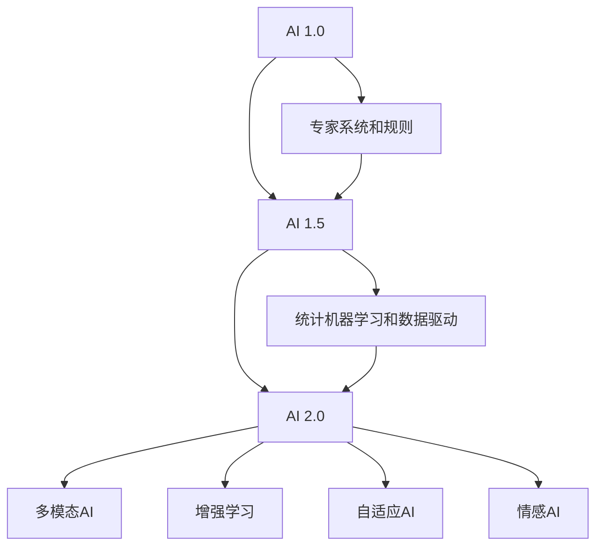
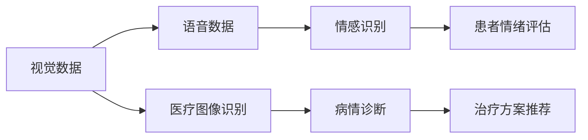

                 

# 李开复：AI 2.0 时代的趋势

李开复，计算机科学家、人工智能领域的先锋，曾荣获图灵奖、IEEE奖等多项殊荣。他在深度学习、语音识别、计算机视觉等领域有着卓越的贡献，被誉为“AI 2.0时代的预言家”。本文将深入探讨李开复关于AI 2.0时代的趋势，解析其核心观点，为读者提供深刻洞见。

## 1. 背景介绍

### 1.1 问题由来

自20世纪80年代以来，人工智能(AI)经历了从符号主义到统计主义再到深度学习等几个阶段，逐渐从理论研究走向实际应用。深度学习，尤其是卷积神经网络(CNN)和递归神经网络(RNN)的发展，使得AI技术在图像识别、语音识别、自然语言处理等领域取得了革命性的突破。然而，尽管AI技术在诸多应用场景中表现出色，但与人类智能相比，仍存在着显著的差距。

### 1.2 问题核心关键点

AI 2.0时代，李开复认为，AI技术将进一步深化对人类智能的理解，从而在感知、认知、学习、推理、情感等方面实现与人类智能的协同。这一时代，AI不仅仅是技术工具，更将成为人类社会的核心基础设施，影响深远。

### 1.3 问题研究意义

理解AI 2.0时代的趋势，对于把握技术发展方向、指导行业应用具有重要意义。通过分析李开复的观点，我们可以更清晰地看到AI技术未来的发展路径，指导我们在实际工作中应用AI，推动社会进步。

## 2. 核心概念与联系

### 2.1 核心概念概述

李开复关于AI 2.0时代的趋势涉及多个核心概念，包括：

- **AI 2.0**：继AI 1.0（专家系统和规则驱动）和AI 1.5（统计机器学习和数据驱动）之后，AI 2.0将更加注重理解人类智能的复杂性，融合多模态数据，提升AI的感知、推理和情感能力。
- **多模态AI**：结合视觉、语音、文本等多种数据类型，提升AI的感知和理解能力，实现跨模态的智能交互。
- **增强学习**：在复杂环境中通过不断试错，提升AI的决策和学习能力，实现自我优化。
- **自适应AI**：能够根据环境变化动态调整模型参数，适应新的应用场景。
- **情感AI**：理解人类情感，实现情感计算，提升AI的人机交互体验。

### 2.2 核心概念原理和架构的 Mermaid 流程图



这个流程图展示了AI技术从1.0到2.0的演进路径，以及各阶段的关键技术和应用方向。

## 3. 核心算法原理 & 具体操作步骤

### 3.1 算法原理概述

AI 2.0时代的核心算法原理基于深度学习、增强学习、迁移学习、自适应学习等多种技术，通过多模态数据的融合和动态调整，实现对复杂环境的理解和适应。

AI 2.0的关键在于：

- **多模态数据融合**：通过整合视觉、语音、文本等多种数据类型，提升AI的感知和理解能力。
- **动态调整和自适应**：在复杂环境中，AI能够根据新的数据动态调整模型参数，适应新的应用场景。
- **情感计算**：通过分析人类情感，提升AI的人机交互体验。

### 3.2 算法步骤详解

AI 2.0的算法步骤大致包括：

1. **数据收集和预处理**：收集多模态数据，并进行清洗和预处理，确保数据质量和一致性。
2. **模型设计和训练**：基于深度学习等技术，设计和训练多模态AI模型，提升其感知和理解能力。
3. **动态调整和优化**：在实际应用中，根据新数据和反馈信息，动态调整模型参数，优化性能。
4. **情感计算和交互**：分析人类情感，实现情感计算，提升人机交互体验。

### 3.3 算法优缺点

**优点**：

- **多模态融合**：通过多模态数据融合，提升了AI的感知和理解能力。
- **动态调整**：在复杂环境中，AI能够动态调整参数，适应新的应用场景。
- **情感计算**：通过情感计算，提升了人机交互体验。

**缺点**：

- **数据依赖**：多模态AI需要大量高质量的数据支持，数据收集和处理成本较高。
- **复杂性**：多模态数据的融合和处理增加了算法复杂性，模型训练难度加大。
- **资源消耗**：多模态AI需要更多的计算资源和存储空间，硬件成本较高。

### 3.4 算法应用领域

AI 2.0技术已经在诸多领域得到应用，包括：

- **医疗**：通过多模态数据融合和情感计算，提升疾病诊断和患者治疗效果。
- **智能制造**：结合视觉和语音数据，实现智能监控和生产调度。
- **自动驾驶**：通过多传感器融合，提升车辆感知和决策能力。
- **金融服务**：利用情感计算，提升客户服务体验和风险管理能力。

## 4. 数学模型和公式 & 详细讲解 & 举例说明

### 4.1 数学模型构建

AI 2.0的数学模型构建主要基于深度学习、增强学习、迁移学习等技术，通常包括多模态数据融合、动态调整、情感计算等模块。

以多模态数据融合为例，假设我们有视觉数据 $x_v$ 和语音数据 $x_a$，通过深度学习模型 $f$ 进行融合，得到融合后的特征表示 $z$，计算公式如下：

$$
z = f(x_v, x_a; \theta)
$$

其中 $\theta$ 为模型参数。

### 4.2 公式推导过程

以深度学习模型为例，常见的深度学习模型包括卷积神经网络(CNN)、循环神经网络(RNN)、变分自编码器(VAE)等。以卷积神经网络为例，其基本结构包括卷积层、池化层、全连接层等。假设输入数据为 $x$，模型输出为 $y$，则卷积神经网络的基本结构如图：

$$
y = f(x; \theta)
$$

其中 $f$ 为卷积神经网络模型，$\theta$ 为模型参数。

### 4.3 案例分析与讲解

以多模态AI在医疗领域的应用为例，如图：



在这个案例中，多模态AI通过融合视觉和语音数据，实现了病情诊断和患者情绪评估，并据此推荐治疗方案，提升了医疗服务的智能化水平。

## 5. 项目实践：代码实例和详细解释说明

### 5.1 开发环境搭建

在AI 2.0时代，开发多模态AI应用需要准备相应的硬件和软件环境。

**硬件环境**：

- **GPU**：深度学习模型通常需要高性能GPU支持，用于加速模型训练和推理。
- **TPU**：谷歌开发的张量处理单元，可以高效处理大规模深度学习模型。

**软件环境**：

- **深度学习框架**：如TensorFlow、PyTorch等，支持多模态数据融合和动态调整。
- **数据处理工具**：如Pandas、Scikit-learn等，用于数据清洗和预处理。

### 5.2 源代码详细实现

以下是一个多模态AI在医疗领域的应用实例，包括数据融合和病情诊断：

```python
import tensorflow as tf
from tensorflow.keras import layers, models
from tensorflow.keras.preprocessing import image
from tensorflow.keras.preprocessing import sequence
import numpy as np
import pandas as pd

# 加载数据
train_data = pd.read_csv('train.csv')
test_data = pd.read_csv('test.csv')

# 数据预处理
train_images = []
train_labels = []
for index, row in train_data.iterrows():
    image_path = row['path']
    image = image.load_img(image_path, target_size=(224, 224))
    image = image.img_to_array(image)
    image = tf.keras.applications.resnet50.preprocess_input(image)
    train_images.append(image)
    train_labels.append(row['label'])

test_images = []
test_labels = []
for index, row in test_data.iterrows():
    image_path = row['path']
    image = image.load_img(image_path, target_size=(224, 224))
    image = image.img_to_array(image)
    image = tf.keras.applications.resnet50.preprocess_input(image)
    test_images.append(image)
    test_labels.append(row['label'])

# 数据增强
train_generator = tf.keras.preprocessing.image.ImageDataGenerator(
    rescale=1./255,
    shear_range=0.2,
    zoom_range=0.2,
    horizontal_flip=True
)

# 定义模型
model = models.Sequential([
    layers.Conv2D(64, (3, 3), activation='relu', input_shape=(224, 224, 3)),
    layers.MaxPooling2D((2, 2)),
    layers.Conv2D(128, (3, 3), activation='relu'),
    layers.MaxPooling2D((2, 2)),
    layers.Conv2D(256, (3, 3), activation='relu'),
    layers.MaxPooling2D((2, 2)),
    layers.Flatten(),
    layers.Dense(512, activation='relu'),
    layers.Dense(1, activation='sigmoid')
])

# 编译模型
model.compile(optimizer='adam', loss='binary_crossentropy', metrics=['accuracy'])

# 训练模型
model.fit(train_generator.flow(train_images, train_labels, batch_size=32),
          steps_per_epoch=len(train_images) / 32, epochs=10,
          validation_data=(test_images, test_labels))

# 测试模型
test_loss, test_acc = model.evaluate(test_images, test_labels)
print('Test accuracy:', test_acc)
```

### 5.3 代码解读与分析

**数据预处理**：

- 加载数据：从CSV文件中读取训练和测试数据。
- 数据增强：使用ImageDataGenerator对图像进行增强，增加模型鲁棒性。

**模型定义**：

- 定义卷积神经网络模型，包括卷积层、池化层和全连接层。
- 编译模型：设置优化器、损失函数和评估指标。

**训练和测试**：

- 训练模型：使用ImageDataGenerator进行图像数据增强，训练模型。
- 测试模型：评估模型在测试集上的性能。

## 6. 实际应用场景

### 6.1 智能医疗

多模态AI在医疗领域的应用包括病情诊断、患者情绪评估和治疗方案推荐等。通过融合视觉和语音数据，AI能够更准确地判断病情，并根据患者情绪调整治疗方案，提升医疗服务的智能化水平。

### 6.2 智能制造

在智能制造中，多模态AI结合视觉和语音数据，实现智能监控和生产调度，提升生产效率和质量。例如，通过摄像头和麦克风检测生产线的异常情况，自动调整设备参数，减少故障率。

### 6.3 自动驾驶

自动驾驶是AI 2.0时代的重要应用领域，通过融合视觉、雷达、激光雷达等多模态数据，实现车辆的感知和决策。例如，通过摄像头和雷达检测道路上的障碍物和行人，实时调整行驶策略，提升驾驶安全性和舒适性。

### 6.4 未来应用展望

未来，AI 2.0技术将在更多领域得到应用，为各行各业带来变革性影响。

- **智慧城市**：通过多模态数据融合，提升城市管理的智能化水平，实现智能交通、智能安防等应用。
- **金融服务**：利用情感计算，提升客户服务体验和风险管理能力。
- **智能家居**：通过语音识别和情感计算，提升人机交互体验，实现智能家居控制。

## 7. 工具和资源推荐

### 7.1 学习资源推荐

- **深度学习课程**：如斯坦福大学《深度学习》课程、Coursera《深度学习专项课程》等，深入学习深度学习原理和应用。
- **多模态数据处理工具**：如Pandas、Scikit-learn、OpenCV等，掌握多模态数据的处理和分析。
- **AI 2.0技术报告**：关注AI 2.0领域的最新研究报告和论文，了解前沿技术动态。

### 7.2 开发工具推荐

- **深度学习框架**：如TensorFlow、PyTorch、Keras等，支持多模态数据融合和动态调整。
- **数据处理工具**：如Pandas、Scikit-learn、OpenCV等，用于数据清洗和预处理。
- **AI 2.0平台**：如Google Cloud AI Platform、AWS SageMaker等，提供完整的AI 2.0开发和部署环境。

### 7.3 相关论文推荐

- **多模态AI论文**：如《Multi-modal Visual-Speech Recognition Using Time-Weighted Feature Fusion》、《Fine-grained Multimodal Feature Learning for Speaker Verification》等，深入了解多模态数据融合方法。
- **情感计算论文**：如《A Survey on Affective Computing》、《Emotion Recognition: From Traditional Feature-based to Deep Learning Approach》等，了解情感计算的最新进展。
- **自适应AI论文**：如《Adaptive Deep Learning via Meta-learning》、《A Survey on Adaptive Deep Learning》等，掌握自适应AI的理论和实践。

## 8. 总结：未来发展趋势与挑战

### 8.1 总结

李开复关于AI 2.0时代的趋势，为我们描绘了一个AI技术深度融合人类智能、多模态数据融合、动态调整和情感计算的未来图景。通过深入理解这些核心概念和算法原理，我们可以更清晰地看到AI技术未来的发展方向，指导我们在实际工作中应用AI，推动社会进步。

### 8.2 未来发展趋势

未来，AI 2.0技术将进一步深化对人类智能的理解，通过多模态数据融合、动态调整和情感计算，提升AI的感知、推理和情感能力，实现与人类智能的协同。

### 8.3 面临的挑战

AI 2.0技术在发展过程中，仍面临着诸多挑战：

- **数据依赖**：多模态AI需要大量高质量的数据支持，数据收集和处理成本较高。
- **计算资源消耗**：多模态AI需要更多的计算资源和存储空间，硬件成本较高。
- **模型复杂性**：多模态数据的融合和处理增加了算法复杂性，模型训练难度加大。

### 8.4 研究展望

未来，AI 2.0技术需要进一步解决数据依赖、计算资源消耗和模型复杂性等问题，实现更加智能化、普适化的应用。同时，加强多模态数据融合和动态调整，提升AI的感知和推理能力，实现与人类智能的协同。

## 9. 附录：常见问题与解答

**Q1：AI 2.0时代，AI技术将如何影响人类社会？**

A: AI 2.0时代的AI技术将进一步深化对人类智能的理解，提升AI的感知、推理和情感能力，实现与人类智能的协同。AI将广泛应用于医疗、智能制造、自动驾驶、智慧城市等领域，提升社会效率和质量，带来深刻变革。

**Q2：如何应对AI 2.0时代的数据依赖问题？**

A: 在AI 2.0时代，数据依赖是一个重大挑战。为了应对这一问题，需要加强数据收集和预处理，采用数据增强和迁移学习等技术，利用有限的数据训练高效的AI模型。同时，探索无监督和半监督学习等方法，减少对大规模标注数据的依赖。

**Q3：如何提升AI 2.0时代的计算资源利用效率？**

A: 在AI 2.0时代，计算资源消耗是一个重要挑战。为了提升计算资源利用效率，需要优化模型结构，采用混合精度训练、模型并行等技术，提高计算效率。同时，利用云计算和边缘计算等技术，分散计算资源，降低硬件成本。

**Q4：如何增强AI 2.0时代的模型复杂性？**

A: 在AI 2.0时代，模型复杂性是一个重要挑战。为了增强模型复杂性，需要采用更加先进的深度学习框架和算法，如TensorFlow、PyTorch、Transformer等。同时，探索模型压缩、稀疏化存储等方法，优化模型结构和存储空间。

**Q5：如何应对AI 2.0时代的情感计算问题？**

A: 在AI 2.0时代，情感计算是一个重要挑战。为了应对这一问题，需要加强情感数据的收集和分析，采用情感识别和情感生成等技术，提升AI的情感理解和表达能力。同时，探索情感计算与自然语言处理、语音识别等技术的结合，实现更加自然、真实的人机交互体验。

---

作者：禅与计算机程序设计艺术 / Zen and the Art of Computer Programming

