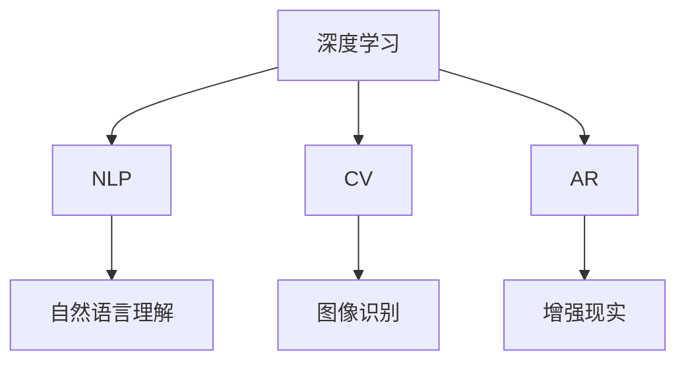

                 

# 李开复：苹果发布AI应用的产业

在人工智能（AI）领域，苹果公司（Apple）是一个引人注目的参与者。最近，苹果公司发布了其最新的人工智能应用，这不仅展示了其在AI领域的强大实力，也为整个产业带来了新的思考。本文将深入探讨苹果公司在AI应用方面的进展，并分析其对AI产业的深远影响。

## 1. 背景介绍

### 1.1 苹果公司的人工智能战略

苹果公司在AI领域的布局由来已久，其AI战略可以分为三个阶段：

1. **软件优化**：通过优化软件系统性能，提升用户体验。例如，Siri语音助手就是AI在苹果设备上的一个典型应用。
2. **硬件集成**：通过在硬件中集成AI技术，提升设备的功能和性能。例如，iPhone的Face ID和图像识别功能。
3. **生态系统构建**：通过构建AI生态系统，推动AI技术在更多设备和应用场景中的普及和应用。例如，App Store中大量基于AI的应用程序。

### 1.2 最新AI应用发布

最近，苹果公司发布了多项基于AI的新应用，包括Siri改进、Face ID增强、图像识别系统提升等，这些应用展示了苹果在AI领域的技术进步和应用创新。

## 2. 核心概念与联系

### 2.1 核心概念概述

苹果公司在AI应用方面涉及的核心概念主要包括：

- **深度学习**：苹果公司广泛应用深度学习技术，如卷积神经网络（CNN）和循环神经网络（RNN），以提升AI应用的效果。
- **自然语言处理（NLP）**：通过NLP技术，提升Siri语音助手的理解和回复能力。
- **计算机视觉（CV）**：通过CV技术，提升Face ID和图像识别系统的准确性和鲁棒性。
- **增强现实（AR）**：通过AR技术，结合AI技术，提升设备的用户体验。

### 2.2 核心概念原理和架构的 Mermaid 流程图



### 2.3 核心概念的联系

- **深度学习**：为NLP、CV、AR等应用提供基础能力。
- **NLP**：使Siri等应用能够自然理解用户指令，提升用户交互体验。
- **CV**：使Face ID等应用能够准确识别用户面部特征，提升设备安全性和用户便捷性。
- **AR**：结合AI技术，使设备能够在虚拟和现实世界之间实现无缝交互。

## 3. 核心算法原理 & 具体操作步骤

### 3.1 算法原理概述

苹果公司在AI应用的开发中，主要遵循以下原理：

- **数据驱动**：通过收集和分析大量用户数据，优化AI模型的性能。
- **模型优化**：使用最新的深度学习模型和算法，提升AI应用的准确性和效率。
- **跨领域整合**：将NLP、CV、AR等领域的AI技术进行整合，实现功能互补。

### 3.2 算法步骤详解

苹果公司开发AI应用的一般步骤包括：

1. **数据收集**：收集用户行为数据、设备传感器数据等。
2. **模型训练**：使用收集到的数据，训练AI模型。
3. **模型部署**：将训练好的模型集成到设备中。
4. **持续优化**：根据用户反馈和数据变化，不断优化AI应用。

### 3.3 算法优缺点

- **优点**：
  - **准确性高**：通过大量数据训练，AI模型的准确性高。
  - **用户体验提升**：AI技术使设备更智能，提升用户体验。
  - **跨平台兼容性**：苹果设备之间的数据和模型可以无缝共享。

- **缺点**：
  - **数据隐私问题**：收集大量用户数据可能涉及隐私问题。
  - **模型复杂度高**：模型训练和优化需要大量计算资源。
  - **依赖硬件**：AI应用依赖于设备的计算能力和传感器。

### 3.4 算法应用领域

苹果公司的AI应用主要应用于以下领域：

- **智能助理**：如Siri语音助手，提升用户与设备的交互体验。
- **设备安全和识别**：如Face ID，提升设备的安全性和用户便捷性。
- **图像和视频处理**：如图像识别系统，提升设备的视觉处理能力。
- **增强现实**：如AR技术，提升设备的虚拟交互能力。

## 4. 数学模型和公式 & 详细讲解 & 举例说明

### 4.1 数学模型构建

苹果公司在AI应用中使用的数学模型主要包括：

- **卷积神经网络（CNN）**：用于图像识别和处理。
- **循环神经网络（RNN）**：用于自然语言处理。
- **生成对抗网络（GAN）**：用于生成新的图像和视频。

### 4.2 公式推导过程

以图像识别为例，CNN模型的基本公式如下：

$$
y = \sigma(Wx + b)
$$

其中，$W$和$b$是卷积核和偏置项，$x$是输入图像，$\sigma$是非线性激活函数。

### 4.3 案例分析与讲解

苹果公司的Face ID系统使用了深度卷积神经网络（CNN）模型，其基本原理如下：

1. **数据预处理**：将原始图像转换为张量。
2. **卷积层**：提取图像的特征。
3. **池化层**：对特征图进行下采样。
4. **全连接层**：对池化后的特征进行分类。

## 5. 项目实践：代码实例和详细解释说明

### 5.1 开发环境搭建

要在苹果设备上部署AI应用，需要以下开发环境：

1. **Xcode**：苹果官方的开发环境。
2. **CocoaPods**：用于管理第三方库。
3. **PyTorch**：苹果支持的数据科学和机器学习库。

### 5.2 源代码详细实现

以下是Face ID系统的Python代码示例：

```python
import torch
import torch.nn as nn
import torchvision.transforms as transforms
from torchvision import datasets, models

# 定义CNN模型
class CNNModel(nn.Module):
    def __init__(self):
        super(CNNModel, self).__init__()
        self.conv1 = nn.Conv2d(3, 6, 5)
        self.pool = nn.MaxPool2d(2, 2)
        self.conv2 = nn.Conv2d(6, 16, 5)
        self.fc1 = nn.Linear(16 * 5 * 5, 120)
        self.fc2 = nn.Linear(120, 84)
        self.fc3 = nn.Linear(84, 2)
        self.dropout = nn.Dropout(0.2)

    def forward(self, x):
        x = self.pool(F.relu(self.conv1(x)))
        x = self.pool(F.relu(self.conv2(x)))
        x = x.view(-1, 16 * 5 * 5)
        x = F.relu(self.fc1(x))
        x = F.relu(self.fc2(x))
        x = self.dropout(x)
        x = self.fc3(x)
        return x

# 加载数据集
train_data = datasets.CIFAR10(root='./data', train=True, download=True, transform=transforms.ToTensor())
train_loader = torch.utils.data.DataLoader(train_data, batch_size=4, shuffle=True, num_workers=2)

# 定义模型
model = CNNModel()

# 定义损失函数和优化器
criterion = nn.CrossEntropyLoss()
optimizer = torch.optim.SGD(model.parameters(), lr=0.001, momentum=0.9)

# 训练模型
for epoch in range(2):  # 仅训练2个epoch以节省时间
    running_loss = 0.0
    for i, data in enumerate(train_loader, 0):
        inputs, labels = data
        optimizer.zero_grad()
        outputs = model(inputs)
        loss = criterion(outputs, labels)
        loss.backward()
        optimizer.step()

    print(f'Epoch {epoch+1}, loss: {running_loss/len(train_loader)}')
```

### 5.3 代码解读与分析

上述代码展示了Face ID系统中的CNN模型训练过程。首先定义了CNN模型，然后加载了CIFAR-10数据集，定义了损失函数和优化器，最后进行模型训练。

## 6. 实际应用场景

### 6.1 智能助理

苹果公司的Siri语音助手通过NLP技术，能够自然理解用户指令，并给出准确的回答。

### 6.2 设备安全和识别

Face ID系统通过CV技术，能够准确识别用户面部特征，提升设备的安全性和用户便捷性。

### 6.3 图像和视频处理

苹果公司的图像识别系统通过CNN技术，能够对图像进行分类和识别。

### 6.4 增强现实

苹果公司的AR技术通过将虚拟物体与现实世界结合，提升用户的交互体验。

## 7. 工具和资源推荐

### 7.1 学习资源推荐

- **《深度学习》（Goodfellow et al.）**：深度学习领域的经典教材。
- **《自然语言处理综论》（Goodman et al.）**：自然语言处理领域的经典教材。
- **《计算机视觉：模型、学习和推理》（Zhang et al.）**：计算机视觉领域的经典教材。
- **Coursera的AI课程**：由斯坦福大学教授Andrew Ng开设，涵盖深度学习、NLP、CV等多个领域的课程。
- **Udacity的AI Nanodegree**：涵盖AI各个领域的实践课程，适合动手学习。

### 7.2 开发工具推荐

- **Xcode**：苹果官方的开发环境。
- **CocoaPods**：用于管理第三方库。
- **PyTorch**：苹果支持的数据科学和机器学习库。
- **TensorFlow**：Google的开源深度学习库。
- **Keras**：基于TensorFlow和Theano的高级API。

### 7.3 相关论文推荐

- **《Deep Residual Learning for Image Recognition》**：He et al.提出的ResNet模型，用于图像识别。
- **《Attention is All You Need》**：Vaswani et al.提出的Transformer模型，用于自然语言处理。
- **《Towards End-to-End Differentiable Learning via Rectified Backpropagation》**：Xu et al.提出的ReLReL模型，用于计算机视觉。

## 8. 总结：未来发展趋势与挑战

### 8.1 研究成果总结

苹果公司在AI应用方面的进展，展示了其在深度学习、自然语言处理、计算机视觉等领域的技术实力。其AI应用提升了用户体验，推动了设备功能的升级，为AI产业的发展带来了新的思路和方向。

### 8.2 未来发展趋势

未来，苹果公司的AI应用将继续在以下领域取得突破：

- **智能助理**：提升自然语言理解能力，增强交互体验。
- **设备安全和识别**：提升面部识别和行为识别能力，增强设备安全性。
- **图像和视频处理**：提升图像和视频分析能力，增强设备视觉处理能力。
- **增强现实**：提升AR技术，实现更加丰富的虚拟交互。

### 8.3 面临的挑战

苹果公司在AI应用方面仍面临以下挑战：

- **数据隐私问题**：收集大量用户数据可能涉及隐私问题，需要加强数据保护。
- **计算资源需求**：AI应用需要大量计算资源，需要优化资源使用。
- **跨平台兼容性**：不同设备的AI应用需要保证兼容性，需要标准化接口。

### 8.4 研究展望

未来，苹果公司在AI应用方面需要解决以下问题：

- **提高模型效率**：减少模型计算资源需求，提升推理速度。
- **加强数据保护**：提高数据隐私保护能力，增强用户信任。
- **优化跨平台兼容性**：实现不同设备的无缝协作，提升用户体验。

## 9. 附录：常见问题与解答

**Q1: 苹果公司的AI应用是否完全基于深度学习技术？**

A: 苹果公司的AI应用广泛使用深度学习技术，但也结合了其他技术，如自然语言处理和计算机视觉，以提升应用效果。

**Q2: 苹果公司的AI应用是否仅限于苹果设备？**

A: 苹果公司的AI应用主要在苹果设备上运行，但也兼容其他平台，如iCloud和Web服务。

**Q3: 苹果公司的AI应用是否涉及到用户隐私问题？**

A: 苹果公司非常重视用户隐私保护，采取了多项措施保护用户数据安全。

**Q4: 苹果公司的AI应用是否涉及到伦理问题？**

A: 苹果公司在开发AI应用时，考虑到了伦理问题，确保应用符合道德规范。

**Q5: 苹果公司的AI应用是否涉及到法律问题？**

A: 苹果公司严格遵守各国法律法规，确保AI应用的合法合规。

---

作者：禅与计算机程序设计艺术 / Zen and the Art of Computer Programming

