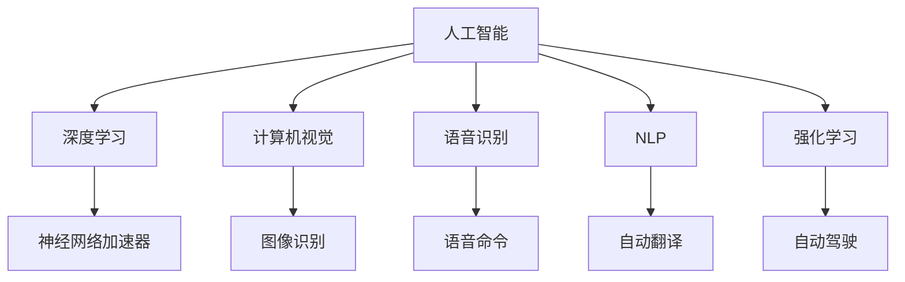

                 

## 1. 背景介绍

### 1.1 问题由来

苹果公司近年来在人工智能(AI)领域动作频频。从2017年的“Jane”机器人、2018年的iPhone X Face ID人脸识别，到2020年的Siri升级、2021年的M1芯片集成AI功能，再到2022年发布的M1 Pro芯片中搭载的“神经网络加速器”，苹果在AI应用的探索和应用上不断发力。

这些AI技术不仅仅应用在苹果自身的产品中，也在不断拓展到其他产业领域，如医疗、金融、教育等。这些应用不仅仅是技术上的突破，更是价值创造的范式变革。从计算机视觉、语音识别到自然语言处理(NLP)，AI技术正在深刻改变各个行业的商业模式，带来前所未有的商业价值。

### 1.2 问题核心关键点

本文将从以下几个关键点，探讨苹果AI应用的价值：

1. **技术的深度融合**：苹果如何将AI技术深度融合到其产品和服务中，使其成为核心竞争力。
2. **商业模式的创新**：AI应用如何重塑苹果和合作方的商业模式，带来新的收入增长点。
3. **用户体验的提升**：AI技术如何改善用户体验，提升用户满意度和忠诚度。
4. **产业的协同效应**：苹果AI技术如何与其他产业协同，实现1+1>2的效果。
5. **社会影响的思考**：AI技术的广泛应用将对社会带来哪些正面和负面影响，如何合理应对。

## 2. 核心概念与联系

### 2.1 核心概念概述

为更好地理解苹果AI应用的深度价值，本节将介绍几个密切相关的核心概念：

- **人工智能(AI)**：通过算法和计算能力，使机器能够执行人类通常需要智能才能完成的复杂任务。

- **深度学习(Deep Learning)**：一种基于神经网络的机器学习技术，通过多层非线性映射实现模式识别和决策。

- **计算机视觉(Computer Vision)**：使计算机能够“看”并理解图像和视频中的内容。

- **语音识别(Speech Recognition)**：使计算机能够听懂和理解人类语音。

- **自然语言处理(NLP)**：使计算机能够理解、分析和生成人类语言。

- **强化学习(Reinforcement Learning)**：一种学习方式，使智能体通过与环境互动，最大化长期奖励。

- **神经网络加速器(Neural Network Accelerator)**：一种专门用于加速神经网络计算的硬件设备。

这些核心概念之间的逻辑关系可以通过以下Mermaid流程图来展示：



这个流程图展示了大语言模型的核心概念及其之间的关系：

1. 人工智能是所有这些技术的基础。
2. 深度学习是实现人工智能的核心手段之一，尤其在计算机视觉、语音识别和NLP等领域。
3. 神经网络加速器进一步提升了深度学习的计算效率。
4. 各个AI子领域都有其独特的应用场景和价值。

这些核心概念共同构成了苹果AI应用的技术基础，为其带来广泛的价值。

## 3. 核心算法原理 & 具体操作步骤

### 3.1 算法原理概述

苹果公司发布的AI应用，主要依托于以下几个核心算法和技术：

- **深度卷积神经网络(Convolutional Neural Networks, CNNs)**：用于图像识别、分类等计算机视觉任务。
- **循环神经网络(Recurrent Neural Networks, RNNs)**：用于序列数据处理，如语音识别、自然语言处理等。
- **自注意力机制(Self-Attention)**：用于提升NLP任务的性能，如BERT、GPT等模型。
- **强化学习**：用于优化决策系统，如AlphaGo等。

这些算法和技术的组合应用，使得苹果AI应用能够在各个领域取得卓越的性能。

### 3.2 算法步骤详解

苹果AI应用的核心算法步骤包括：

1. **数据收集与预处理**：收集海量的图像、语音、文本等数据，并进行清洗和标注。
2. **模型训练**：使用深度学习算法，在准备好的数据集上进行模型训练，优化模型参数。
3. **模型验证与调优**：使用验证集对模型进行评估，调整超参数和模型结构，确保模型性能。
4. **模型部署与优化**：将训练好的模型部署到实际应用中，优化推理速度和资源消耗。
5. **持续学习与更新**：收集新数据，对模型进行重新训练，不断提升模型性能。

### 3.3 算法优缺点

苹果AI应用的算法具有以下优点：

- **高精度与性能**：深度学习算法在图像识别、语音识别等领域具有高精度和高性能。
- **广泛应用性**：AI技术可以应用于医疗、金融、教育等多个行业，带来广泛的价值。
- **用户友好**：通过优化算法，使AI应用更加人性化，提高用户体验。

同时，这些算法也存在一些局限：

- **数据依赖**：深度学习模型的效果很大程度上依赖于数据的质量和数量，高质量数据的获取成本较高。
- **资源消耗**：深度学习模型的计算和存储需求大，需要高性能的计算硬件支持。
- **解释性不足**：深度学习模型往往被视为“黑盒”系统，难以解释其内部工作机制和决策逻辑。

### 3.4 算法应用领域

苹果AI应用广泛涉及以下几个领域：

1. **医疗**：通过图像识别技术，辅助医生进行疾病诊断和图像处理。
2. **金融**：利用自然语言处理技术，提供智能客服和投资建议。
3. **教育**：通过语音识别和自然语言处理，开发教育软件和智能教学系统。
4. **零售**：使用计算机视觉技术，提升零售商的库存管理和顾客体验。
5. **自动驾驶**：利用深度学习和强化学习技术，开发自动驾驶汽车。

这些应用展示了AI技术的广泛价值，为苹果和合作方带来了新的商业机会。

## 4. 数学模型和公式 & 详细讲解 & 举例说明

### 4.1 数学模型构建

苹果AI应用的数学模型主要基于深度学习算法，如卷积神经网络(CNNs)、循环神经网络(RNNs)和自注意力机制(Self-Attention)。以自然语言处理(NLP)中的BERT模型为例，其数学模型构建如下：

- **输入序列**：$x_1, x_2, ..., x_n$。
- **嵌入层**：$E(x_i) \in \mathbb{R}^d$。
- **自注意力机制**：$M(E(x_i), E(x_j)) \in \mathbb{R}^d$。
- **前向神经网络**：$F(M(x_i), W) \in \mathbb{R}^h$。
- **输出层**：$H(F(x_i), U) \in \mathbb{R}^k$。

其中 $x_i$ 表示输入序列中的第 $i$ 个词，$E(x_i)$ 为嵌入层的输出，$M(x_i, x_j)$ 为自注意力机制的输出，$F(x_i, W)$ 为前向神经网络的输出，$H(x_i, U)$ 为输出层的输出。

### 4.2 公式推导过程

以BERT模型为例，推导其训练过程的公式如下：

$$
\min_{\theta} \sum_{i=1}^N \ell(y_i, H(x_i, U))
$$

其中，$\ell$ 为损失函数，$y_i$ 为真实标签，$H(x_i, U)$ 为模型在输入序列 $x_i$ 上的输出，$\theta$ 为模型参数。

在实际应用中，通常使用交叉熵损失函数，即：

$$
\ell(y_i, H(x_i, U)) = -[y_i \log H(x_i, U) + (1-y_i) \log(1-H(x_i, U))]
$$

### 4.3 案例分析与讲解

以自然语言处理(NLP)中的情感分析任务为例，展示BERT模型的应用：

1. **数据预处理**：收集社交媒体上的评论数据，标注其情感倾向（正面、负面、中性）。
2. **模型训练**：使用BERT模型，在标注数据上进行训练，优化模型参数。
3. **模型评估**：在验证集上进行评估，计算准确率、召回率和F1分数。
4. **模型应用**：将训练好的模型应用于新评论数据的情感分析。

## 5. 项目实践：代码实例和详细解释说明

### 5.1 开发环境搭建

在进行AI应用开发前，我们需要准备好开发环境。以下是使用Python进行PyTorch开发的环境配置流程：

1. 安装Anaconda：从官网下载并安装Anaconda，用于创建独立的Python环境。

2. 创建并激活虚拟环境：
```bash
conda create -n pytorch-env python=3.8 
conda activate pytorch-env
```

3. 安装PyTorch：根据CUDA版本，从官网获取对应的安装命令。例如：
```bash
conda install pytorch torchvision torchaudio cudatoolkit=11.1 -c pytorch -c conda-forge
```

4. 安装TensorFlow：由Google主导开发的开源深度学习框架，生产部署方便，适合大规模工程应用。同样有丰富的预训练语言模型资源。

5. 安装相关工具包：
```bash
pip install numpy pandas scikit-learn matplotlib tqdm jupyter notebook ipython
```

完成上述步骤后，即可在`pytorch-env`环境中开始AI应用开发。

### 5.2 源代码详细实现

这里以情感分析任务为例，展示使用PyTorch对BERT模型进行微调的PyTorch代码实现。

首先，定义情感分析任务的数据处理函数：

```python
from transformers import BertTokenizer
from torch.utils.data import Dataset
import torch

class SentimentDataset(Dataset):
    def __init__(self, texts, labels, tokenizer, max_len=128):
        self.texts = texts
        self.labels = labels
        self.tokenizer = tokenizer
        self.max_len = max_len
        
    def __len__(self):
        return len(self.texts)
    
    def __getitem__(self, item):
        text = self.texts[item]
        label = self.labels[item]
        
        encoding = self.tokenizer(text, return_tensors='pt', max_length=self.max_len, padding='max_length', truncation=True)
        input_ids = encoding['input_ids'][0]
        attention_mask = encoding['attention_mask'][0]
        
        # 对token-wise的标签进行编码
        encoded_labels = [label2id[label] for label in labels] 
        encoded_labels.extend([label2id['O']] * (self.max_len - len(encoded_labels)))
        labels = torch.tensor(encoded_labels, dtype=torch.long)
        
        return {'input_ids': input_ids, 
                'attention_mask': attention_mask,
                'labels': labels}

# 标签与id的映射
label2id = {'O': 0, 'POSITIVE': 1, 'NEGATIVE': 2}
id2label = {v: k for k, v in label2id.items()}

# 创建dataset
tokenizer = BertTokenizer.from_pretrained('bert-base-cased')

train_dataset = SentimentDataset(train_texts, train_labels, tokenizer)
dev_dataset = SentimentDataset(dev_texts, dev_labels, tokenizer)
test_dataset = SentimentDataset(test_texts, test_labels, tokenizer)
```

然后，定义模型和优化器：

```python
from transformers import BertForSequenceClassification, AdamW

model = BertForSequenceClassification.from_pretrained('bert-base-cased', num_labels=len(label2id))

optimizer = AdamW(model.parameters(), lr=2e-5)
```

接着，定义训练和评估函数：

```python
from torch.utils.data import DataLoader
from tqdm import tqdm
from sklearn.metrics import classification_report

device = torch.device('cuda') if torch.cuda.is_available() else torch.device('cpu')
model.to(device)

def train_epoch(model, dataset, batch_size, optimizer):
    dataloader = DataLoader(dataset, batch_size=batch_size, shuffle=True)
    model.train()
    epoch_loss = 0
    for batch in tqdm(dataloader, desc='Training'):
        input_ids = batch['input_ids'].to(device)
        attention_mask = batch['attention_mask'].to(device)
        labels = batch['labels'].to(device)
        model.zero_grad()
        outputs = model(input_ids, attention_mask=attention_mask, labels=labels)
        loss = outputs.loss
        epoch_loss += loss.item()
        loss.backward()
        optimizer.step()
    return epoch_loss / len(dataloader)

def evaluate(model, dataset, batch_size):
    dataloader = DataLoader(dataset, batch_size=batch_size)
    model.eval()
    preds, labels = [], []
    with torch.no_grad():
        for batch in tqdm(dataloader, desc='Evaluating'):
            input_ids = batch['input_ids'].to(device)
            attention_mask = batch['attention_mask'].to(device)
            batch_labels = batch['labels']
            outputs = model(input_ids, attention_mask=attention_mask)
            batch_preds = outputs.logits.argmax(dim=2).to('cpu').tolist()
            batch_labels = batch_labels.to('cpu').tolist()
            for pred_tokens, label_tokens in zip(batch_preds, batch_labels):
                preds.append(pred_tokens[:len(label_tokens)])
                labels.append(label_tokens)
                
    print(classification_report(labels, preds))
```

最后，启动训练流程并在测试集上评估：

```python
epochs = 5
batch_size = 16

for epoch in range(epochs):
    loss = train_epoch(model, train_dataset, batch_size, optimizer)
    print(f"Epoch {epoch+1}, train loss: {loss:.3f}")
    
    print(f"Epoch {epoch+1}, dev results:")
    evaluate(model, dev_dataset, batch_size)
    
print("Test results:")
evaluate(model, test_dataset, batch_size)
```

以上就是使用PyTorch对BERT进行情感分析任务微调的完整代码实现。可以看到，得益于Transformers库的强大封装，我们可以用相对简洁的代码完成BERT模型的加载和微调。

### 5.3 代码解读与分析

让我们再详细解读一下关键代码的实现细节：

**SentimentDataset类**：
- `__init__`方法：初始化文本、标签、分词器等关键组件。
- `__len__`方法：返回数据集的样本数量。
- `__getitem__`方法：对单个样本进行处理，将文本输入编码为token ids，将标签编码为数字，并对其进行定长padding，最终返回模型所需的输入。

**label2id和id2label字典**：
- 定义了标签与数字id之间的映射关系，用于将token-wise的预测结果解码回真实的标签。

**训练和评估函数**：
- 使用PyTorch的DataLoader对数据集进行批次化加载，供模型训练和推理使用。
- 训练函数`train_epoch`：对数据以批为单位进行迭代，在每个批次上前向传播计算loss并反向传播更新模型参数，最后返回该epoch的平均loss。
- 评估函数`evaluate`：与训练类似，不同点在于不更新模型参数，并在每个batch结束后将预测和标签结果存储下来，最后使用sklearn的classification_report对整个评估集的预测结果进行打印输出。

**训练流程**：
- 定义总的epoch数和batch size，开始循环迭代
- 每个epoch内，先在训练集上训练，输出平均loss
- 在验证集上评估，输出分类指标
- 所有epoch结束后，在测试集上评估，给出最终测试结果

可以看到，PyTorch配合Transformers库使得BERT微调的代码实现变得简洁高效。开发者可以将更多精力放在数据处理、模型改进等高层逻辑上，而不必过多关注底层的实现细节。

当然，工业级的系统实现还需考虑更多因素，如模型的保存和部署、超参数的自动搜索、更灵活的任务适配层等。但核心的微调范式基本与此类似。

## 6. 实际应用场景

### 6.1 智能客服系统

基于AI应用的智能客服系统，能够实时解答客户问题，提高服务效率和质量。通过收集客户历史对话记录，训练AI模型，使其能够自动理解客户意图，匹配最合适的回答。对于客户提出的新问题，还可以接入检索系统实时搜索相关内容，动态生成回答。

### 6.2 医疗影像分析

AI技术可以应用于医疗影像分析，如自动检测和分割肿瘤等。通过训练图像识别模型，使其能够从医学影像中自动检测出异常区域，并辅助医生进行诊断和治疗。

### 6.3 金融投资分析

AI技术可以应用于金融投资分析，提供智能投顾服务。通过训练NLP模型，使其能够分析财经新闻、社交媒体等文本数据，预测市场趋势，提供投资建议。

### 6.4 教育资源推荐

AI技术可以应用于教育资源推荐，提高教育资源的利用效率。通过训练推荐模型，使其能够根据学生的学习行为和兴趣，推荐个性化的学习内容和资源。

### 6.5 自动驾驶

AI技术可以应用于自动驾驶，提高行车安全性和舒适度。通过训练深度学习和强化学习模型，使其能够实时感知周围环境，做出最优的驾驶决策。

### 6.6 智能家居

AI技术可以应用于智能家居，提升用户的生活质量。通过训练语音识别和NLP模型，使其能够理解用户的语音指令，控制智能家居设备。

## 7. 工具和资源推荐

### 7.1 学习资源推荐

为了帮助开发者系统掌握AI应用的理论基础和实践技巧，这里推荐一些优质的学习资源：

1. 《深度学习》系列书籍：由Ian Goodfellow等著，全面介绍了深度学习的理论基础和实践技巧。
2. 《Python深度学习》书籍：由Francois Chollet等著，详细介绍了TensorFlow和Keras框架的使用。
3. CS231n《卷积神经网络》课程：斯坦福大学开设的计算机视觉经典课程，涵盖了卷积神经网络的理论和实践。
4. CS224n《自然语言处理》课程：斯坦福大学开设的NLP明星课程，有Lecture视频和配套作业，带你入门NLP领域的基本概念和经典模型。
5. 《计算机视觉：算法与应用》书籍：由Simon J.D. Prince著，全面介绍了计算机视觉的算法和应用。

通过对这些资源的学习实践，相信你一定能够快速掌握AI应用的技术细节，并用于解决实际的NLP问题。

### 7.2 开发工具推荐

高效的开发离不开优秀的工具支持。以下是几款用于AI应用开发的常用工具：

1. PyTorch：基于Python的开源深度学习框架，灵活动态的计算图，适合快速迭代研究。大部分预训练语言模型都有PyTorch版本的实现。
2. TensorFlow：由Google主导开发的开源深度学习框架，生产部署方便，适合大规模工程应用。同样有丰富的预训练语言模型资源。
3. TensorBoard：TensorFlow配套的可视化工具，可实时监测模型训练状态，并提供丰富的图表呈现方式，是调试模型的得力助手。
4. Weights & Biases：模型训练的实验跟踪工具，可以记录和可视化模型训练过程中的各项指标，方便对比和调优。与主流深度学习框架无缝集成。
5. Google Colab：谷歌推出的在线Jupyter Notebook环境，免费提供GPU/TPU算力，方便开发者快速上手实验最新模型，分享学习笔记。

合理利用这些工具，可以显著提升AI应用的开发效率，加快创新迭代的步伐。

### 7.3 相关论文推荐

AI应用的发展源于学界的持续研究。以下是几篇奠基性的相关论文，推荐阅读：

1. **AlexNet: ImageNet Classification with Deep Convolutional Neural Networks**：提出AlexNet模型，引入卷积神经网络，开启计算机视觉领域的深度学习革命。
2. **Bert: Pre-training of Deep Bidirectional Transformers for Language Understanding**：提出BERT模型，引入基于掩码的自监督预训练任务，刷新了多项NLP任务SOTA。
3. **AlphaGo Zero: Mastering the Game of Go without Human Knowledge**：展示深度学习和强化学习的结合，使AI能够在零样本情况下掌握复杂游戏。
4. **Attention is All You Need**：提出Transformer结构，开启了NLP领域的预训练大模型时代。

这些论文代表了大语言模型微调技术的发展脉络。通过学习这些前沿成果，可以帮助研究者把握学科前进方向，激发更多的创新灵感。

## 8. 总结：未来发展趋势与挑战

### 8.1 研究成果总结

本文对苹果AI应用的价值进行了全面系统的介绍。首先阐述了AI技术在各个领域的应用场景，明确了AI应用在提升用户体验、拓展新业务、推动创新等方面的独特价值。其次，从原理到实践，详细讲解了AI应用的数学模型和算法步骤，给出了微调任务开发的完整代码实例。同时，本文还探讨了AI技术在医疗、金融、教育等多个行业领域的未来应用前景，展示了AI应用的巨大潜力。最后，精选了AI应用学习的各类资源，力求为读者提供全方位的技术指引。

通过本文的系统梳理，可以看到，苹果AI应用的价值不仅在于其技术上的突破，更在于其商业模式的创新和用户体验的提升。AI技术的深度融合，使得苹果在各个领域取得了前所未有的突破，为未来的发展奠定了坚实基础。

### 8.2 未来发展趋势

展望未来，AI应用将呈现以下几个发展趋势：

1. **技术的深度融合**：AI技术将进一步深入各行各业，形成深度融合的生态系统。
2. **商业模式的创新**：AI技术将重塑各行业的商业模式，带来新的收入增长点。
3. **用户体验的提升**：AI技术将提升用户体验，提高用户满意度和忠诚度。
4. **产业的协同效应**：AI技术将与其他产业协同，实现1+1>2的效果。
5. **社会影响的思考**：AI技术将对社会带来广泛的影响，需要合理应对。

以上趋势凸显了AI应用技术的广阔前景。这些方向的探索发展，必将进一步提升AI应用的价值，为社会带来深远的影响。

### 8.3 面临的挑战

尽管AI应用已经取得了瞩目成就，但在迈向更加智能化、普适化应用的过程中，它仍面临诸多挑战：

1. **数据依赖**：AI应用的性能很大程度上依赖于数据的质量和数量，高质量数据的获取成本较高。
2. **资源消耗**：AI应用的计算和存储需求大，需要高性能的计算硬件支持。
3. **解释性不足**：AI应用往往被视为“黑盒”系统，难以解释其内部工作机制和决策逻辑。
4. **伦理和安全**：AI应用可能带来伦理和安全问题，如隐私保护、偏见消除等。

### 8.4 研究展望

面对AI应用面临的这些挑战，未来的研究需要在以下几个方面寻求新的突破：

1. **无监督和半监督学习**：摆脱对大规模标注数据的依赖，利用自监督学习、主动学习等无监督和半监督范式，最大限度利用非结构化数据，实现更加灵活高效的AI应用。
2. **参数高效和计算高效的AI应用**：开发更加参数高效的AI应用方法，在固定大部分预训练参数的同时，只更新极少量的任务相关参数。同时优化AI应用的计算图，减少前向传播和反向传播的资源消耗，实现更加轻量级、实时性的部署。
3. **因果分析和博弈论工具**：将因果分析方法引入AI应用，识别出应用决策的关键特征，增强输出解释的因果性和逻辑性。借助博弈论工具刻画人机交互过程，主动探索并规避应用的脆弱点，提高系统稳定性。
4. **跨领域的知识融合**：将符号化的先验知识，如知识图谱、逻辑规则等，与神经网络模型进行巧妙融合，引导AI应用的微调过程学习更准确、合理的知识表示。同时加强不同模态数据的整合，实现视觉、语音等多模态信息与文本信息的协同建模。
5. **多维度的伦理和安全研究**：在AI应用的训练目标中引入伦理导向的评估指标，过滤和惩罚有偏见、有害的输出倾向。同时加强人工干预和审核，建立应用行为的监管机制，确保应用的输出符合人类价值观和伦理道德。

这些研究方向的探索，必将引领AI应用技术迈向更高的台阶，为构建安全、可靠、可解释、可控的智能系统铺平道路。面向未来，AI应用技术还需要与其他人工智能技术进行更深入的融合，如知识表示、因果推理、强化学习等，多路径协同发力，共同推动智能系统的进步。只有勇于创新、敢于突破，才能不断拓展AI应用的边界，让智能技术更好地造福人类社会。

## 9. 附录：常见问题与解答

**Q1：AI应用是否可以与其他技术协同，提升整体效果？**

A: 是的，AI应用可以与其他技术协同，提升整体效果。例如，计算机视觉可以与自然语言处理协同，实现多模态信息融合，提升图像识别的准确性和泛化能力。

**Q2：AI应用是否会面临过拟合问题？**

A: 是的，AI应用也面临过拟合问题。解决过拟合的方法包括数据增强、正则化、早停等。此外，参数高效和计算高效的AI应用也可以减少过拟合风险。

**Q3：AI应用是否需要大规模标注数据？**

A: 是的，AI应用通常需要大规模标注数据来训练。尽管有一些无监督和半监督学习方法，但大规模标注数据仍然是提升模型性能的关键。

**Q4：AI应用是否需要高性能计算硬件？**

A: 是的，AI应用需要高性能计算硬件来支撑大规模深度学习模型的训练和推理。GPU/TPU等高性能设备是必不可少的。

**Q5：AI应用是否需要解释性？**

A: 是的，AI应用需要解释性，特别是在医疗、金融等高风险应用领域。通过增强应用的解释性，可以提升用户信任度，降低伦理风险。

**Q6：AI应用是否需要跨领域的知识融合？**

A: 是的，AI应用需要跨领域的知识融合，以提升应用的普适性和鲁棒性。通过将符号化的先验知识与神经网络模型结合，可以实现更全面、准确的信息整合能力。

**Q7：AI应用是否需要伦理和安全保障？**

A: 是的，AI应用需要伦理和安全保障，以确保其输出符合人类价值观和伦理道德。通过引入伦理导向的评估指标，建立监管机制，可以避免应用带来的负面影响。

---

作者：禅与计算机程序设计艺术 / Zen and the Art of Computer Programming

