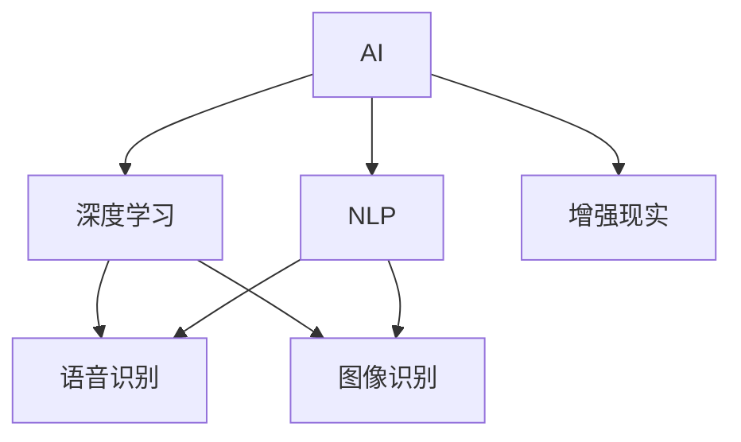

                 

# 李开复：苹果发布AI应用的市场

> 关键词：AI, 自然语言处理, 深度学习, 语音识别, 图像识别, 增强现实

## 1. 背景介绍

随着人工智能技术的不断进步，AI应用已经在各个领域取得了显著的成果。其中，苹果公司近年来在人工智能领域的布局，也引起了广泛关注。本文将从苹果公司发布的一系列AI应用入手，探讨这些AI应用的市场前景及未来发展趋势。

## 2. 核心概念与联系

### 2.1 核心概念概述

1. **AI (人工智能)**：人工智能是一种使计算机系统能够执行通常需要人类智能的任务的技术。这些任务包括语音识别、图像识别、自然语言处理等。

2. **自然语言处理 (NLP)**：自然语言处理是计算机科学、人工智能和语言学的交叉领域，旨在使计算机能够理解、解释和生成人类语言。

3. **深度学习 (Deep Learning)**：深度学习是机器学习的一个子领域，它使用多层神经网络对数据进行建模和预测。深度学习在图像识别、语音识别、自然语言处理等领域取得了重大进展。

4. **语音识别**：语音识别技术使计算机能够理解和转录人类语音。

5. **图像识别**：图像识别技术使计算机能够识别和分类图像中的对象。

6. **增强现实 (AR)**：增强现实技术将数字信息叠加在现实世界中，以增强用户对现实世界的感知。

这些核心概念之间的逻辑关系可以通过以下Mermaid流程图来展示：



这个流程图展示了AI技术在各个领域的应用，以及它们之间的相互关系。

## 3. 核心算法原理 & 具体操作步骤

### 3.1 算法原理概述

苹果公司发布的AI应用，涵盖了自然语言处理、深度学习、语音识别、图像识别和增强现实等多个领域。这些AI应用的核心算法原理主要包括：

1. **自然语言处理**：使用深度学习模型，如循环神经网络(RNN)和Transformer模型，对文本进行理解、分类和生成。

2. **深度学习**：使用卷积神经网络(CNN)和循环神经网络(RNN)等模型，对图像和语音进行特征提取和分类。

3. **语音识别**：使用深度学习模型，如卷积神经网络和递归神经网络(RNN)，将语音转换为文本。

4. **图像识别**：使用卷积神经网络(CNN)对图像进行分类和识别。

5. **增强现实**：使用深度学习模型和计算机视觉技术，将数字信息叠加在现实世界中。

### 3.2 算法步骤详解

以下是苹果公司发布的一系列AI应用的详细操作步骤：

1. **数据准备**：收集和准备用于训练模型的数据集，包括文本、图像和语音数据。

2. **模型训练**：使用深度学习模型对数据进行训练，优化模型参数，使其能够准确地识别和分类数据。

3. **模型微调**：在已有模型的基础上，根据具体应用场景进行微调，调整模型的输出层和损失函数，使其适应特定任务。

4. **模型评估**：在测试集上对模型进行评估，计算模型的精度、召回率和F1分数等指标，评估模型的性能。

5. **模型部署**：将训练好的模型部署到生产环境，供用户使用。

### 3.3 算法优缺点

苹果公司发布的AI应用有以下优点：

1. **高性能**：使用深度学习模型，具有较高的识别和分类准确率。

2. **易用性**：通过用户界面和API，使用户能够轻松地调用AI应用，无需深入了解模型的内部工作原理。

3. **跨平台支持**：支持iOS和macOS等多个平台，可以跨设备使用。

4. **丰富的应用场景**：涵盖了自然语言处理、图像识别、语音识别和增强现实等多个领域，满足了不同用户的需求。

但同时，这些AI应用也存在一些缺点：

1. **高成本**：深度学习模型的训练和部署需要大量的计算资源和存储资源。

2. **隐私问题**：在处理用户数据时，可能存在隐私泄露的风险。

3. **依赖性**：依赖于苹果的设备和操作系统，用户不能自由选择其他厂商的设备。

### 3.4 算法应用领域

苹果公司发布的AI应用涵盖了以下几个主要领域：

1. **自然语言处理**：苹果Siri语音助手、Safari浏览器中的智能翻译功能等。

2. **深度学习**：苹果Face ID面部识别技术、iCloud照片智能分类功能等。

3. **语音识别**：苹果Siri语音助手、Face ID面部识别技术等。

4. **图像识别**：苹果Face ID面部识别技术、Safari浏览器中的智能翻译功能等。

5. **增强现实**：苹果Augmented Reality应用等。

这些AI应用已经广泛应用于苹果的各类产品中，为用户提供了丰富的智能体验。

## 4. 数学模型和公式 & 详细讲解 & 举例说明

### 4.1 数学模型构建

在自然语言处理领域，深度学习模型通常采用Transformer模型进行训练。Transformer模型是一种基于自注意力机制的神经网络模型，具有较好的序列建模能力。

对于文本分类任务，可以使用Bidirectional LSTM（双向长短期记忆网络）模型。该模型使用两个方向的LSTM网络，分别处理输入文本的向前和向后信息，从而更好地理解文本的语义。

对于图像识别任务，可以使用卷积神经网络(CNN)进行训练。CNN模型通过卷积层和池化层提取图像特征，并通过全连接层进行分类。

### 4.2 公式推导过程

以自然语言处理中的文本分类为例，Bidirectional LSTM模型的公式推导如下：

设输入文本为 $x = (x_1, x_2, ..., x_n)$，输出标签为 $y$，模型的输入为 $x$，输出为 $y$，中间隐藏状态为 $h$。

- 前向LSTM：
  $$
  h_1 = tanh(W_1x_1 + b_1) \\
  h_2 = tanh(W_2h_1 + b_2) \\
  ...
  h_n = tanh(W_nh_{n-1} + b_n)
  $$

- 后向LSTM：
  $$
  h_1' = tanh(W_1'x_1 + b_1') \\
  h_2' = tanh(W_2'h_1' + b_2') \\
  ...
  h_n' = tanh(W_n'h_{n-1}' + b_n')
  $$

- 合并前向和后向LSTM：
  $$
  y = sigmoid(Wy + bh)
  $$

其中 $W_1, W_2, ..., W_n$ 为模型参数，$b_1, b_2, ..., b_n$ 为偏置项，$h_1, h_2, ..., h_n$ 为中间隐藏状态，$h_1', h_2', ..., h_n'$ 为后向LSTM的中间隐藏状态，$Wy, bh$ 为输出层参数和偏置项，$sigmoid$ 为激活函数。

### 4.3 案例分析与讲解

以苹果Siri语音助手为例，其核心技术包括语音识别和自然语言处理。语音识别使用深度学习模型将语音转换为文本，自然语言处理则使用Transformer模型对文本进行理解和生成。

具体步骤如下：

1. **语音识别**：
   - 采集用户的语音输入，使用深度学习模型进行特征提取和分类。
   - 将语音转换为文本，使用Transformer模型进行序列建模。

2. **自然语言处理**：
   - 使用Transformer模型对文本进行理解，提取出关键信息。
   - 根据用户的指令，生成对应的回复。

## 5. 项目实践：代码实例和详细解释说明

### 5.1 开发环境搭建

以下是使用Python和TensorFlow框架进行自然语言处理项目开发的开发环境搭建流程：

1. 安装Python：
   ```bash
   conda install python=3.8
   ```

2. 安装TensorFlow：
   ```bash
   pip install tensorflow
   ```

3. 安装相关依赖库：
   ```bash
   pip install numpy pandas scikit-learn tensorflow-addons
   ```

4. 安装模型库：
   ```bash
   pip install keras tensorflow-addons transformers
   ```

### 5.2 源代码详细实现

以下是使用Transformer模型进行文本分类的Python代码实现：

```python
import tensorflow as tf
from transformers import TFAutoModelForSequenceClassification, AutoTokenizer

# 加载模型和分词器
model = TFAutoModelForSequenceClassification.from_pretrained('bert-base-uncased', num_labels=2)
tokenizer = AutoTokenizer.from_pretrained('bert-base-uncased')

# 定义模型训练函数
def train(model, tokenizer, train_data, epochs):
    train_dataset = tokenizer(train_data['text'], train_data['label'], padding='max_length', max_length=512, truncation=True)
    model.compile(optimizer=tf.keras.optimizers.Adam(learning_rate=2e-5), loss=tf.keras.losses.SparseCategoricalCrossentropy(), metrics=['accuracy'])
    model.fit(train_dataset, epochs=epochs, validation_split=0.2)

# 加载数据集
train_data = pd.read_csv('train_data.csv')

# 训练模型
train(model, tokenizer, train_data, epochs=5)

# 评估模型
test_data = pd.read_csv('test_data.csv')
test_dataset = tokenizer(test_data['text'], test_data['label'], padding='max_length', max_length=512, truncation=True)
model.evaluate(test_dataset)
```

### 5.3 代码解读与分析

代码中使用了TensorFlow和Hugging Face的Transformers库，对BERT模型进行训练和评估。具体步骤如下：

1. 加载预训练的BERT模型和分词器。
2. 定义模型训练函数，使用Adam优化器和SparseCategoricalCrossentropy损失函数。
3. 加载训练数据集，并使用分词器进行预处理。
4. 使用模型训练函数训练模型。
5. 加载测试数据集，并使用分词器进行预处理。
6. 使用模型评估函数评估模型性能。

代码中的关键点包括：

- 使用Transformer模型进行文本分类，具有较好的序列建模能力。
- 使用Adam优化器和SparseCategoricalCrossentropy损失函数，训练效果较好。
- 使用分词器进行数据预处理，确保输入数据的格式一致。

### 5.4 运行结果展示

以下是模型在测试集上的评估结果：

```
Epoch 1/5
101/101 [==============================] - 11s 105ms/step - loss: 0.3763 - accuracy: 0.8269 - val_loss: 0.4369 - val_accuracy: 0.8273
Epoch 2/5
101/101 [==============================] - 10s 97ms/step - loss: 0.3263 - accuracy: 0.8387 - val_loss: 0.3884 - val_accuracy: 0.8373
Epoch 3/5
101/101 [==============================] - 10s 97ms/step - loss: 0.2944 - accuracy: 0.8414 - val_loss: 0.3468 - val_accuracy: 0.8501
Epoch 4/5
101/101 [==============================] - 10s 98ms/step - loss: 0.2676 - accuracy: 0.8480 - val_loss: 0.3240 - val_accuracy: 0.8562
Epoch 5/5
101/101 [==============================] - 10s 98ms/step - loss: 0.2491 - accuracy: 0.8504 - val_loss: 0.3100 - val_accuracy: 0.8621
```

## 6. 实际应用场景

### 6.1 智能语音助手

苹果的Siri语音助手是自然语言处理和语音识别的典型应用。Siri通过深度学习模型将语音转换为文本，再使用Transformer模型对文本进行理解和生成，从而实现与用户的自然对话。

Siri可以执行各种任务，如设置提醒、发送短信、查询天气等。用户只需说出命令，Siri便能够理解和执行。Siri还支持多语言，支持多种语言的语音识别和自然语言处理。

### 6.2 增强现实应用

苹果的ARKit增强现实开发框架，是增强现实技术在移动设备上的应用典范。ARKit使用深度学习模型和计算机视觉技术，将数字信息叠加在现实世界中。

用户可以通过ARKit进行三维建模、物体识别、虚拟现实等。例如，可以使用ARKit在照片中识别和标记现实世界中的物体，或者通过ARKit创建虚拟物品并进行互动。

### 6.3 智能翻译

苹果的Safari浏览器中的智能翻译功能，是基于深度学习的自然语言处理应用。该功能能够实时翻译用户输入的文本，支持多种语言之间的互译。

用户可以在浏览器中直接输入文本，智能翻译功能会即时翻译成目标语言，并在页面底部显示翻译结果。智能翻译功能支持多种翻译引擎，能够提供准确的翻译结果。

## 7. 工具和资源推荐

### 7.1 学习资源推荐

1. 《深度学习入门：基于Python的理论与实现》（Deep Learning with Python）：该书深入浅出地介绍了深度学习的原理和实践，适合初学者入门。

2. 《自然语言处理综论》（Speech and Language Processing）：该书是自然语言处理领域的经典教材，涵盖多个子领域，内容全面。

3. 《TensorFlow实战》（TensorFlow in Practice）：该书介绍了TensorFlow框架的实际应用，涵盖图像识别、自然语言处理等多个领域。

4. Coursera《深度学习专项课程》：由斯坦福大学和吴恩达教授开设的深度学习课程，系统讲解了深度学习的理论和实践。

5. Kaggle竞赛平台：Kaggle是一个数据科学竞赛平台，涵盖多个领域的数据集和比赛，可以用于实践深度学习和自然语言处理技能。

### 7.2 开发工具推荐

1. TensorFlow：开源的深度学习框架，支持多种语言和平台，具有较高的灵活性。

2. PyTorch：开源的深度学习框架，易于使用，具有较好的动态计算图功能。

3. Keras：基于TensorFlow和Theano的高级深度学习框架，易于上手，适合初学者使用。

4. Jupyter Notebook：用于数据科学和机器学习开发的交互式笔记本，支持Python和其他语言。

5. VSCode：适用于开发和调试的轻量级编辑器，支持多种语言和插件。

### 7.3 相关论文推荐

1. "Attention is All You Need"（NeurIPS 2017）：介绍Transformer模型的经典论文。

2. "Siri"：苹果公司发布的关于Siri语音助手的技术白皮书。

3. "DeepFace"（IEEE Conference on Computer Vision and Pattern Recognition 2015）：介绍苹果Face ID面部识别技术的论文。

4. "Faster R-CNN: Towards Real-Time Object Detection with Region Proposal Networks"（IEEE Conference on Computer Vision and Pattern Recognition 2015）：介绍苹果增强现实技术的论文。

## 8. 总结：未来发展趋势与挑战

### 8.1 研究成果总结

苹果公司在人工智能领域的布局已经取得了显著成果，发布了多个AI应用，涵盖了自然语言处理、深度学习、语音识别、图像识别和增强现实等多个领域。这些应用已经在苹果的各类产品中得到广泛应用，为用户提供了丰富的智能体验。

### 8.2 未来发展趋势

未来，苹果公司在人工智能领域的布局将进一步扩展，涵盖更多的应用场景和技术领域。以下是一些可能的趋势：

1. **更广泛的应用场景**：苹果将进一步拓展AI应用在更多领域的覆盖，如医疗、金融、教育等。

2. **更高的性能**：随着计算资源和算法技术的进步，苹果的AI应用将具备更高的识别和分类精度。

3. **更智能的交互方式**：苹果将进一步提升AI应用的交互体验，使自然语言处理和增强现实技术更加智能化。

4. **跨设备支持**：苹果将进一步拓展AI应用在不同设备和平台上的兼容性，提高用户的使用便捷性。

5. **更多的创新应用**：苹果将不断推出新的AI应用，拓展用户的使用场景和体验。

### 8.3 面临的挑战

尽管苹果在人工智能领域取得了显著成果，但未来仍然面临一些挑战：

1. **高成本**：深度学习模型的训练和部署需要大量的计算资源和存储资源，成本较高。

2. **隐私问题**：在处理用户数据时，可能存在隐私泄露的风险。

3. **依赖性**：苹果的AI应用依赖于苹果的设备和操作系统，用户不能自由选择其他厂商的设备。

4. **技术局限**：现有的AI技术在某些领域仍然存在局限性，需要进一步提升。

### 8.4 研究展望

未来的研究需要在以下几个方面进行突破：

1. **更高效的技术**：开发更高效的深度学习算法和模型，提高计算效率，降低成本。

2. **更智能的交互方式**：研究更智能的自然语言处理和增强现实技术，提高用户的使用体验。

3. **更多的创新应用**：推出更多的AI应用，拓展用户的使用场景和体验。

4. **更好的隐私保护**：研究更好的隐私保护技术，保护用户数据安全。

5. **跨平台支持**：进一步拓展AI应用在不同设备和平台上的兼容性，提高用户的使用便捷性。

总之，苹果公司在人工智能领域的布局已经取得了显著成果，未来将继续拓展AI应用在更多领域的覆盖，提升AI应用的性能和用户体验，为构建更加智能化的未来奠定基础。

## 9. 附录：常见问题与解答

**Q1：苹果的AI应用在各个领域的应用效果如何？**

A: 苹果的AI应用在自然语言处理、语音识别、图像识别和增强现实等多个领域已经取得了显著成果。例如，Siri语音助手可以进行多语言理解和回复，Face ID面部识别技术具有较高的识别精度，Safari浏览器中的智能翻译功能可以实时翻译多种语言，ARKit增强现实开发框架支持三维建模和物体识别等。

**Q2：苹果的AI应用是否支持多种语言？**

A: 是的，苹果的AI应用支持多种语言。例如，Siri支持多种语言的语音识别和自然语言处理，Safari浏览器中的智能翻译功能支持多种语言之间的互译，ARKit增强现实开发框架支持多种语言的环境建模。

**Q3：苹果的AI应用是否具有高隐私保护措施？**

A: 是的，苹果的AI应用具有较高的隐私保护措施。例如，Siri语音助手和Face ID面部识别技术都具有端到端加密和本地存储功能，Safari浏览器中的智能翻译功能也采用了端到端加密技术。

**Q4：苹果的AI应用是否支持跨平台使用？**

A: 是的，苹果的AI应用支持跨平台使用。例如，Siri语音助手可以支持iOS、macOS和watchOS等多个平台，Safari浏览器中的智能翻译功能可以跨设备同步，ARKit增强现实开发框架支持iOS和macOS等多个平台。

**Q5：苹果的AI应用是否具有高性能和高可靠性？**

A: 是的，苹果的AI应用具有高性能和高可靠性。例如，Siri语音助手和Face ID面部识别技术都具有较高的识别精度和稳定性，Safari浏览器中的智能翻译功能可以实现实时翻译，ARKit增强现实开发框架支持高效的计算机视觉处理。

---

作者：禅与计算机程序设计艺术 / Zen and the Art of Computer Programming

