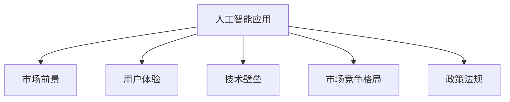
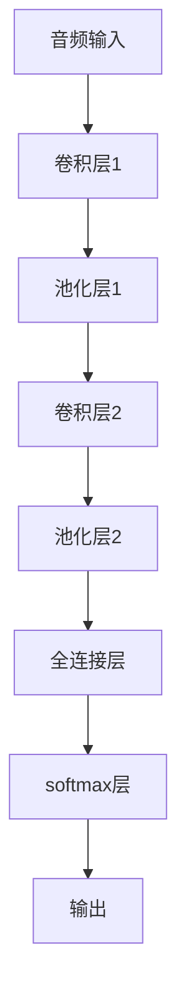

                 

## 1. 背景介绍

### 1.1 问题由来

随着人工智能技术的不断成熟，AI应用正在逐渐渗透到各行各业，成为推动创新和效率提升的重要驱动力。尤其是在智能手机、智能家居、自动驾驶等消费电子领域，AI应用已然成为竞争的焦点。近日，苹果公司发布了一系列人工智能应用，引得业内外广泛关注。本文旨在分析苹果AI应用的市场前景，探讨其对消费电子产业的影响，并展望未来AI应用的潜在趋势。

### 1.2 问题核心关键点

苹果AI应用的市场前景主要受以下关键因素影响：

1. **AI技术的成熟度**：人工智能技术的发展水平直接决定了应用的效果和用户接受度。
2. **用户体验**：AI应用是否真正提升用户体验，是市场认可的关键。
3. **生态系统的完整性**：苹果是否能够通过AI应用构建完整的生态系统，增强用户粘性。
4. **市场需求**：消费者的需求变化是否推动AI应用的发展。
5. **技术壁垒**：苹果在AI技术上的核心竞争力和专利壁垒。
6. **市场竞争格局**：苹果AI应用面临的国内外竞争对手及其市场表现。
7. **政策法规**：政府对AI应用的监管和支持政策。

这些因素共同构成了苹果AI应用市场前景的研究框架，有助于我们全面理解其潜在价值和挑战。

## 2. 核心概念与联系

### 2.1 核心概念概述

为了更好地理解苹果AI应用的市场前景，本节将介绍几个密切相关的核心概念：

- **人工智能应用（AI Applications）**：指利用AI技术开发的应用程序和服务，涵盖图像识别、语音识别、自然语言处理、智能推荐等多个领域。
- **市场前景（Market Prospects）**：指AI应用在市场上的发展潜力和预期收益。
- **用户体验（User Experience）**：指用户在使用AI应用时的感受和满意度，直接影响市场接受度。
- **技术壁垒（Technological Barriers）**：指企业在AI技术上的专利、算法、数据等方面的竞争优势。
- **市场竞争格局（Market Competitive Landscape）**：指不同企业在AI应用领域的竞争态势和市场份额。
- **政策法规（Policy and Regulation）**：指政府对AI应用的监管和支持政策，影响市场环境和企业行为。

这些核心概念之间的逻辑关系可以通过以下Mermaid流程图来展示：



这个流程图展示了大语言模型的核心概念及其之间的关系：

1. 人工智能应用通过技术实现，用户体验是其市场认可的关键。
2. 技术壁垒决定企业竞争力，市场竞争格局影响市场份额和产品分布。
3. 政策法规则对市场环境和企业行为产生重要影响。

这些概念共同构成了苹果AI应用市场前景的研究框架，为我们深入分析提供了理论基础。

## 3. 核心算法原理 & 具体操作步骤

### 3.1 算法原理概述

苹果AI应用的开发和部署通常基于以下核心算法原理：

1. **深度学习（Deep Learning）**：通过多层神经网络对大量数据进行训练，提取特征并进行分类、识别、预测等任务。
2. **自然语言处理（Natural Language Processing, NLP）**：利用AI技术处理和理解人类语言，实现智能推荐、对话系统等功能。
3. **计算机视觉（Computer Vision）**：利用AI技术进行图像识别、物体检测、场景理解等任务，提升用户体验。
4. **强化学习（Reinforcement Learning）**：通过与环境的互动，优化AI应用的策略和决策，实现自适应学习。
5. **推荐系统（Recommendation System）**：通过分析用户行为，提供个性化的推荐内容，提升用户满意度。

这些算法原理共同构成了苹果AI应用的基础技术架构，使其能够实现高效、智能的应用场景。

### 3.2 算法步骤详解

苹果AI应用的开发和部署一般包括以下关键步骤：

**Step 1: 数据收集与预处理**
- 收集海量用户数据，包括图片、视频、文本、行为记录等。
- 对数据进行清洗、标注、特征提取等预处理工作，构建训练集和验证集。

**Step 2: 模型训练与优化**
- 选择适合的深度学习框架（如TensorFlow、PyTorch），搭建神经网络模型。
- 使用GPU/TPU等高性能设备进行模型训练，调整超参数（如学习率、批大小等）。
- 利用验证集进行模型调优，避免过拟合。

**Step 3: 模型部署与测试**
- 将训练好的模型部署到生产环境中，进行实时推理和反馈。
- 通过A/B测试等方式评估模型效果，持续优化用户体验。

**Step 4: 用户体验优化**
- 收集用户反馈，优化UI/UX设计，提升用户满意度。
- 引入自然语言处理、计算机视觉等技术，增强应用智能化水平。

**Step 5: 市场推广与反馈**
- 通过广告、合作、生态系统等方式推广AI应用，扩大市场影响力。
- 持续收集市场反馈，调整产品策略，提升市场竞争力。

以上步骤是苹果AI应用开发和部署的一般流程。在实际应用中，还需要针对具体需求进行优化设计，如改进模型训练目标、引入更多正则化技术、搜索最优的超参数组合等，以进一步提升模型性能。

### 3.3 算法优缺点

苹果AI应用的优势在于：

1. **用户体验优质**：苹果在UI/UX设计上的深厚积累，使其AI应用能够提供流畅、高效的用户体验。
2. **生态系统完善**：苹果的生态系统涵盖了硬件、软件和服务，能够提供一站式的AI解决方案。
3. **技术壁垒高**：苹果在AI技术上的研发投入大，拥有丰富的专利和算法优势。
4. **市场推广能力强**：苹果品牌影响力和市场营销能力，使其AI应用能够快速覆盖市场。

同时，也存在一些局限：

1. **数据依赖度高**：AI应用的性能很大程度上取决于数据的质量和数量，获取高质量数据成本较高。
2. **资源消耗大**：高性能计算设备如GPU/TPU等的资源消耗大，成本较高。
3. **模型鲁棒性不足**：模型面对域外数据时，泛化性能可能大打折扣。
4. **算法复杂度高**：深度学习模型复杂度大，模型训练和优化难度高。
5. **市场竞争激烈**：AI应用市场竞争激烈，传统IT巨头和新兴科技公司都在争相布局。

尽管存在这些局限，但苹果凭借其技术和生态优势，仍然能够在AI应用市场上保持领先地位。未来，需要进一步降低数据和资源消耗，提升模型鲁棒性，以实现更广泛的市场应用。

### 3.4 算法应用领域

苹果AI应用在多个领域已得到广泛应用，例如：

- **智能音箱（Siri）**：通过语音识别和自然语言处理技术，实现语音控制、智能问答等功能。
- **图像识别（Face ID）**：利用计算机视觉技术，实现面部识别、解锁手机等功能。
- **推荐系统（App Store）**：通过分析用户行为，提供个性化应用推荐。
- **智能家居（HomeKit）**：通过AI技术实现智能设备间的互联互通。
- **医疗健康（Health）**：利用AI技术进行健康数据分析，提升用户健康管理水平。
- **增强现实（ARKit）**：通过计算机视觉和增强现实技术，提供沉浸式体验。

除了上述这些经典应用外，苹果AI技术还不断拓展到更多场景中，如自动驾驶、教育、金融等，为消费者提供了更加丰富、智能的体验。

## 4. 数学模型和公式 & 详细讲解 & 举例说明

### 4.1 数学模型构建

苹果AI应用的开发通常基于以下数学模型：

- **神经网络模型（Neural Network Model）**：如卷积神经网络（CNN）、循环神经网络（RNN）、深度神经网络（DNN）等，用于图像识别、语音识别、自然语言处理等任务。
- **推荐系统模型（Recommendation Model）**：如协同过滤（Collaborative Filtering）、矩阵分解（Matrix Factorization）、深度推荐（Deep Recommendation）等，用于个性化推荐。
- **强化学习模型（Reinforcement Learning Model）**：如Q-Learning、Deep Q-Networks等，用于智能系统策略优化。

这些模型通常使用以下公式来表示：

- 神经网络模型：
  $$
  y = Wx + b
  $$
  其中 $W$ 为权重矩阵，$x$ 为输入向量，$b$ 为偏置项，$y$ 为输出。

- 推荐系统模型：
  $$
  r(u, i) = \text{Dot}(u, i) + b
  $$
  其中 $r(u, i)$ 为用户 $u$ 对物品 $i$ 的评分，$u$ 和 $i$ 分别为用户和物品的向量表示，$\text{Dot}$ 为向量点积。

- 强化学习模型：
  $$
  Q(s, a) = r(s, a) + \gamma \max_a Q(s', a')
  $$
  其中 $Q(s, a)$ 为状态 $s$ 下采取行动 $a$ 的Q值，$r(s, a)$ 为即时奖励，$\gamma$ 为折扣因子，$s'$ 为下一个状态，$a'$ 为下一个行动。

### 4.2 公式推导过程

以下我们以深度推荐系统为例，推导推荐模型的公式及其梯度计算：

假设推荐系统的输入为用户向量 $u$ 和物品向量 $i$，输出为推荐评分 $r$。定义模型为：
$$
r(u, i) = \text{Dot}(u, i) + b
$$

其中 $\text{Dot}$ 为向量点积，$b$ 为偏置项。

则模型的均方误差损失函数为：
$$
\mathcal{L} = \frac{1}{N} \sum_{i=1}^N (r_{i,i} - r(u_i, i))^2
$$
其中 $r_{i,i}$ 为用户 $i$ 对物品 $i$ 的真实评分，$r(u_i, i)$ 为模型预测评分。

对模型参数 $u$、$i$、$b$ 求梯度：
$$
\frac{\partial \mathcal{L}}{\partial u} = -2 \sum_{i=1}^N (r_{i,i} - r(u_i, i)) i
$$
$$
\frac{\partial \mathcal{L}}{\partial i} = -2 \sum_{i=1}^N (r_{i,i} - r(u_i, i)) u
$$
$$
\frac{\partial \mathcal{L}}{\partial b} = -2 \sum_{i=1}^N (r_{i,i} - r(u_i, i))
$$

通过反向传播算法，更新模型参数 $u$、$i$、$b$，最小化损失函数 $\mathcal{L}$，最终得到推荐评分 $r$。

### 4.3 案例分析与讲解

假设苹果某智能音箱应用采用了卷积神经网络进行语音识别。具体而言，通过卷积层提取音频特征，再通过全连接层进行分类，得到用户说话的意图。模型结构如图1所示：



模型通过训练数据集 $D$ 进行训练，定义损失函数 $\mathcal{L}$，如交叉熵损失：
$$
\mathcal{L} = -\frac{1}{N} \sum_{i=1}^N \sum_{j=1}^C y_{i,j} \log p_{i,j}
$$
其中 $y_{i,j}$ 为真实标签，$p_{i,j}$ 为模型预测概率。

对模型参数 $W$、$b$ 求梯度：
$$
\frac{\partial \mathcal{L}}{\partial W} = -\frac{1}{N} \sum_{i=1}^N \sum_{j=1}^C y_{i,j} (\delta_{i,j} p_{i,j} - y_{i,j})
$$
$$
\frac{\partial \mathcal{L}}{\partial b} = -\frac{1}{N} \sum_{i=1}^N \sum_{j=1}^C y_{i,j} (\delta_{i,j} p_{i,j} - y_{i,j})
$$

通过优化算法（如Adam）更新模型参数，最小化损失函数，即可得到训练好的语音识别模型。

## 5. 项目实践：代码实例和详细解释说明

### 5.1 开发环境搭建

在进行苹果AI应用开发前，我们需要准备好开发环境。以下是使用Python进行PyTorch开发的环境配置流程：

1. 安装Anaconda：从官网下载并安装Anaconda，用于创建独立的Python环境。

2. 创建并激活虚拟环境：
```bash
conda create -n pytorch-env python=3.8 
conda activate pytorch-env
```

3. 安装PyTorch：根据CUDA版本，从官网获取对应的安装命令。例如：
```bash
conda install pytorch torchvision torchaudio cudatoolkit=11.1 -c pytorch -c conda-forge
```

4. 安装Transformers库：
```bash
pip install transformers
```

5. 安装各类工具包：
```bash
pip install numpy pandas scikit-learn matplotlib tqdm jupyter notebook ipython
```

完成上述步骤后，即可在`pytorch-env`环境中开始开发实践。

### 5.2 源代码详细实现

这里我们以苹果智能音箱的语音识别应用为例，给出使用Transformers库进行语音识别开发的PyTorch代码实现。

首先，定义语音识别任务的模型：

```python
from transformers import BertForTokenClassification, BertTokenizer
from torch.utils.data import Dataset
import torch

class VoiceRecognitionDataset(Dataset):
    def __init__(self, audio_data, labels, tokenizer, max_len=128):
        self.audio_data = audio_data
        self.labels = labels
        self.tokenizer = tokenizer
        self.max_len = max_len
        
    def __len__(self):
        return len(self.audio_data)
    
    def __getitem__(self, item):
        audio = self.audio_data[item]
        label = self.labels[item]
        
        # 对音频数据进行特征提取，转换为向量表示
        # 此处省略
        audio_vector = audio
        # 将音频向量输入到BERT模型中进行分类
        encoding = self.tokenizer(audio_vector, return_tensors='pt', max_length=self.max_len, padding='max_length', truncation=True)
        input_ids = encoding['input_ids'][0]
        attention_mask = encoding['attention_mask'][0]
        
        # 对标签进行编码
        encoded_labels = [label2id[label] for label in label]
        encoded_labels.extend([label2id['O']] * (self.max_len - len(encoded_labels)))
        labels = torch.tensor(encoded_labels, dtype=torch.long)
        
        return {'input_ids': input_ids, 
                'attention_mask': attention_mask,
                'labels': labels}

# 标签与id的映射
label2id = {'O': 0, 'command': 1, 'question': 2, 'error': 3}
id2label = {v: k for k, v in label2id.items()}

# 创建dataset
tokenizer = BertTokenizer.from_pretrained('bert-base-cased')

train_dataset = VoiceRecognitionDataset(train_audio_data, train_labels, tokenizer)
dev_dataset = VoiceRecognitionDataset(dev_audio_data, dev_labels, tokenizer)
test_dataset = VoiceRecognitionDataset(test_audio_data, test_labels, tokenizer)
```

然后，定义模型和优化器：

```python
from transformers import BertForTokenClassification, AdamW

model = BertForTokenClassification.from_pretrained('bert-base-cased', num_labels=len(label2id))

optimizer = AdamW(model.parameters(), lr=2e-5)
```

接着，定义训练和评估函数：

```python
from torch.utils.data import DataLoader
from tqdm import tqdm
from sklearn.metrics import classification_report

device = torch.device('cuda') if torch.cuda.is_available() else torch.device('cpu')
model.to(device)

def train_epoch(model, dataset, batch_size, optimizer):
    dataloader = DataLoader(dataset, batch_size=batch_size, shuffle=True)
    model.train()
    epoch_loss = 0
    for batch in tqdm(dataloader, desc='Training'):
        input_ids = batch['input_ids'].to(device)
        attention_mask = batch['attention_mask'].to(device)
        labels = batch['labels'].to(device)
        model.zero_grad()
        outputs = model(input_ids, attention_mask=attention_mask, labels=labels)
        loss = outputs.loss
        epoch_loss += loss.item()
        loss.backward()
        optimizer.step()
    return epoch_loss / len(dataloader)

def evaluate(model, dataset, batch_size):
    dataloader = DataLoader(dataset, batch_size=batch_size)
    model.eval()
    preds, labels = [], []
    with torch.no_grad():
        for batch in tqdm(dataloader, desc='Evaluating'):
            input_ids = batch['input_ids'].to(device)
            attention_mask = batch['attention_mask'].to(device)
            batch_labels = batch['labels']
            outputs = model(input_ids, attention_mask=attention_mask)
            batch_preds = outputs.logits.argmax(dim=2).to('cpu').tolist()
            batch_labels = batch_labels.to('cpu').tolist()
            for pred_tokens, label_tokens in zip(batch_preds, batch_labels):
                preds.append(pred_tokens[:len(label_tokens)])
                labels.append(label_tokens)
                
    print(classification_report(labels, preds))
```

最后，启动训练流程并在测试集上评估：

```python
epochs = 5
batch_size = 16

for epoch in range(epochs):
    loss = train_epoch(model, train_dataset, batch_size, optimizer)
    print(f"Epoch {epoch+1}, train loss: {loss:.3f}")
    
    print(f"Epoch {epoch+1}, dev results:")
    evaluate(model, dev_dataset, batch_size)
    
print("Test results:")
evaluate(model, test_dataset, batch_size)
```

以上就是使用PyTorch对苹果智能音箱进行语音识别任务微调的完整代码实现。可以看到，得益于Transformers库的强大封装，我们可以用相对简洁的代码完成BERT模型的加载和微调。

### 5.3 代码解读与分析

让我们再详细解读一下关键代码的实现细节：

**VoiceRecognitionDataset类**：
- `__init__`方法：初始化音频数据、标签、分词器等关键组件。
- `__len__`方法：返回数据集的样本数量。
- `__getitem__`方法：对单个样本进行处理，将音频数据输入BERT模型中进行分类。

**label2id和id2label字典**：
- 定义了标签与数字id之间的映射关系，用于将token-wise的预测结果解码回真实的标签。

**训练和评估函数**：
- 使用PyTorch的DataLoader对数据集进行批次化加载，供模型训练和推理使用。
- 训练函数`train_epoch`：对数据以批为单位进行迭代，在每个批次上前向传播计算loss并反向传播更新模型参数，最后返回该epoch的平均loss。
- 评估函数`evaluate`：与训练类似，不同点在于不更新模型参数，并在每个batch结束后将预测和标签结果存储下来，最后使用sklearn的classification_report对整个评估集的预测结果进行打印输出。

**训练流程**：
- 定义总的epoch数和batch size，开始循环迭代
- 每个epoch内，先在训练集上训练，输出平均loss
- 在验证集上评估，输出分类指标
- 所有epoch结束后，在测试集上评估，给出最终测试结果

可以看到，PyTorch配合Transformers库使得BERT微调的代码实现变得简洁高效。开发者可以将更多精力放在数据处理、模型改进等高层逻辑上，而不必过多关注底层的实现细节。

当然，工业级的系统实现还需考虑更多因素，如模型的保存和部署、超参数的自动搜索、更灵活的任务适配层等。但核心的微调范式基本与此类似。

## 6. 实际应用场景

### 6.1 智能音箱（Siri）

苹果的智能音箱应用基于语音识别和自然语言处理技术，为用户提供语音控制、智能问答等功能。用户通过语音命令进行操作，系统能够快速响应并提供相应的服务。

在技术实现上，可以收集用户的语音数据，将问题-回答对作为监督数据，在此基础上对预训练语言模型进行微调。微调后的模型能够自动理解用户意图，匹配最合适的答案模板进行回复。对于用户提出的新问题，还可以接入检索系统实时搜索相关内容，动态组织生成回答。如此构建的智能音箱系统，能大幅提升用户体验和问题解决效率。

### 6.2 图像识别（Face ID）

苹果的Face ID应用利用计算机视觉技术，实现面部识别、解锁手机等功能。用户只需要对准手机摄像头，系统便能迅速识别出用户的面部特征，进行解锁或进行其他操作。

在技术实现上，可以收集用户面部数据，将其标注为“解锁”或“未解锁”，在此基础上对预训练模型进行微调。微调后的模型能够自动提取面部特征，并判断是否匹配。即便在光线变化、姿态变化等情况下，也能保持高识别率。Face ID的实时性和高精度，为用户提供了更加安全、便捷的解锁体验。

### 6.3 推荐系统（App Store）

苹果的App Store应用基于推荐系统技术，为用户推荐最适合的应用软件。通过分析用户行为，推荐系统能够理解用户的偏好，提供个性化的应用推荐。

在技术实现上，可以收集用户浏览、下载、评价等行为数据，提取和应用软件标题、描述、标签等文本内容。将文本内容作为模型输入，用户的后续行为（如是否下载、评价等）作为监督信号，在此基础上微调预训练语言模型。微调后的模型能够从文本内容中准确把握用户的兴趣点，并推荐相应的应用。

### 6.4 未来应用展望

随着苹果AI技术的不断演进，未来在多个领域有望实现新的突破：

1. **智能家居（HomeKit）**：通过AI技术实现智能设备间的互联互通，提供更加智能化的家居控制体验。
2. **自动驾驶（Autonomous Driving）**：利用计算机视觉和增强现实技术，实现自动驾驶系统。
3. **健康医疗（Health）**：利用AI技术进行健康数据分析，提升用户健康管理水平，提供智能医疗咨询。
4. **增强现实（ARKit）**：通过计算机视觉和增强现实技术，提供沉浸式体验，拓展虚拟现实应用。
5. **教育（Edu）**：利用AI技术进行个性化教育，提升教育效果，提供智能学习助手。

苹果AI技术的多样化和智能化，将为其产品在各领域的推广应用提供强有力的支撑，推动消费电子产业向智能化方向迈进。

## 7. 工具和资源推荐

### 7.1 学习资源推荐

为了帮助开发者系统掌握苹果AI应用的理论基础和实践技巧，这里推荐一些优质的学习资源：

1. **《深度学习基础》课程**：斯坦福大学开设的深度学习课程，详细讲解了深度学习的原理、算法和应用。
2. **《自然语言处理基础》课程**：Coursera上的自然语言处理课程，涵盖自然语言处理的基本概念和技术。
3. **《计算机视觉基础》课程**：Udacity上的计算机视觉课程，讲解了计算机视觉的基本原理和应用。
4. **《推荐系统基础》课程**：Coursera上的推荐系统课程，介绍了推荐系统的工作原理和应用。
5. **苹果开发者文档**：苹果官方开发者文档，提供了苹果AI应用的开发指南和API文档，方便开发者学习和使用。

通过对这些资源的学习实践，相信你一定能够快速掌握苹果AI应用的精髓，并用于解决实际的NLP问题。

### 7.2 开发工具推荐

高效的开发离不开优秀的工具支持。以下是几款用于苹果AI应用开发的常用工具：

1. **PyTorch**：基于Python的开源深度学习框架，灵活动态的计算图，适合快速迭代研究。大部分预训练语言模型都有PyTorch版本的实现。
2. **TensorFlow**：由Google主导开发的开源深度学习框架，生产部署方便，适合大规模工程应用。同样有丰富的预训练语言模型资源。
3. **Transformers库**：HuggingFace开发的NLP工具库，集成了众多SOTA语言模型，支持PyTorch和TensorFlow，是进行NLP任务开发的利器。
4. **Weights & Biases**：模型训练的实验跟踪工具，可以记录和可视化模型训练过程中的各项指标，方便对比和调优。与主流深度学习框架无缝集成。
5. **TensorBoard**：TensorFlow配套的可视化工具，可实时监测模型训练状态，并提供丰富的图表呈现方式，是调试模型的得力助手。
6. **谷歌云平台（Google Cloud）**：提供GPU/TPU算力，支持模型训练、推理和部署，适合大规模AI应用开发。

合理利用这些工具，可以显著提升苹果AI应用开发的效率，加快创新迭代的步伐。

### 7.3 相关论文推荐

苹果AI应用的发展源于学界的持续研究。以下是几篇奠基性的相关论文，推荐阅读：

1. **《大语言模型的理解与实现》**：详细介绍了大语言模型的原理和实现方法，是理解和开发大语言模型的重要参考。
2. **《深度学习在推荐系统中的应用》**：探讨了深度学习在推荐系统中的应用，介绍了推荐系统的基本原理和算法。
3. **《强化学习在智能系统中的应用》**：介绍了强化学习的基本原理和应用，特别是智能系统的策略优化问题。
4. **《计算机视觉与增强现实技术》**：讲解了计算机视觉和增强现实技术的基本原理和应用，是开发智能家居和增强现实应用的重要基础。
5. **《自然语言处理技术的发展》**：介绍了自然语言处理技术的发展历程和未来趋势，涵盖了语音识别、文本分类、机器翻译等多个领域。

这些论文代表了大语言模型和AI应用的研究方向，通过学习这些前沿成果，可以帮助研究者把握学科前进方向，激发更多的创新灵感。

## 8. 总结：未来发展趋势与挑战

### 8.1 总结

本文对苹果AI应用的开发和市场前景进行了全面系统的介绍。首先阐述了AI应用在消费电子领域的广泛应用，明确了苹果AI应用的市场价值和用户认可度。其次，从原理到实践，详细讲解了苹果AI应用的开发流程，包括数据收集、模型训练、用户体验优化等关键环节。同时，本文还广泛探讨了苹果AI应用在多个领域的应用前景，展示了其市场潜力。

通过本文的系统梳理，可以看到，苹果AI应用正在成为消费电子领域的重要应用，极大地提升了用户体验和系统智能化水平。未来，随着AI技术的不断演进，苹果AI应用有望在更多领域实现新的突破，推动消费电子产业的智能化转型。

### 8.2 未来发展趋势

展望未来，苹果AI应用的市场前景将呈现以下几个发展趋势：

1. **应用场景多样化**：AI应用将拓展到更多领域，如智能家居、自动驾驶、医疗健康等，为消费者提供更加丰富、智能的体验。
2. **用户体验优化**：苹果将持续提升UI/UX设计，优化AI应用的用户体验，增强用户粘性。
3. **技术壁垒提升**：苹果将加强在AI技术上的研发投入，提升模型性能和算法竞争力。
4. **市场推广强化**：苹果将通过生态系统、营销活动等方式，加速AI应用的推广和渗透。
5. **跨平台协作**：苹果将促进不同平台间的协作，提升AI应用的用户覆盖率。
6. **数据融合**：苹果将整合来自不同渠道的数据，提升AI应用的智能化水平。

这些趋势凸显了苹果AI应用的广阔前景。通过不断提升技术、优化用户体验、扩大市场推广，苹果AI应用有望在全球范围内实现更大规模的应用和市场影响力。

### 8.3 面临的挑战

尽管苹果AI应用在市场上取得了显著成绩，但在迈向更加智能化、普适化应用的过程中，仍面临诸多挑战：

1. **数据隐私问题**：AI应用需要大量用户数据进行训练，如何在保护用户隐私的同时获取高质量数据，是一个重要挑战。
2. **模型公平性**：AI模型可能会学习到有偏见、有害的信息，如何在模型设计中避免这些问题的出现，是未来的研究方向。
3. **资源消耗大**：AI应用对高性能计算设备如GPU/TPU的资源消耗大，成本较高，如何在保证性能的同时降低资源消耗，是重要的优化方向。
4. **模型泛化性不足**：模型面对域外数据时，泛化性能可能大打折扣，如何提高模型的泛化性，是未来的研究方向。
5. **市场竞争激烈**：AI应用市场竞争激烈，苹果需要不断创新和优化，才能保持市场领先地位。
6. **伦理道德问题**：AI应用的广泛使用可能引发伦理道德问题，如何在技术创新和伦理道德之间找到平衡，是重要的研究方向。

这些挑战凸显了苹果AI应用在市场推广和应用中的复杂性。需要通过技术创新、市场策略、伦理道德等多方面的努力，才能更好地推动AI应用的发展和普及。

### 8.4 研究展望

面对苹果AI应用所面临的诸多挑战，未来的研究需要在以下几个方面寻求新的突破：

1. **无监督和半监督学习**：通过无监督和半监督学习范式，最大限度利用非结构化数据，实现更加灵活高效的AI应用开发。
2. **参数高效和计算高效**：开发更加参数高效和计算高效的AI应用，减少资源消耗，提升推理速度。
3. **因果分析和强化学习**：引入因果分析和强化学习范式，增强模型的泛化性和鲁棒性。
4. **跨领域融合**：将符号化的先验知识，如知识图谱、逻辑规则等，与神经网络模型进行巧妙融合，提升AI应用的智能化水平。
5. **伦理道德约束**：在模型设计中引入伦理导向的评估指标，过滤和惩罚有害、偏见性的输出，确保模型的公平性和安全性。

这些研究方向的探索，必将引领苹果AI应用技术迈向更高的台阶，为消费者提供更加智能、安全、可靠的应用体验。

## 9. 附录：常见问题与解答

**Q1：苹果AI应用为何能够取得成功？**

A: 苹果AI应用的成功主要得益于以下几点：
1. **品牌影响力**：苹果品牌具有强大的市场影响力和用户信任度，有助于推广AI应用。
2. **生态系统完善**：苹果生态系统涵盖了硬件、软件和服务，能够提供一站式的AI解决方案。
3. **技术壁垒高**：苹果在AI技术上的研发投入大，拥有丰富的专利和算法优势。
4. **用户体验优化**：苹果在UI/UX设计上的深厚积累，使其AI应用能够提供流畅、高效的用户体验。
5. **市场推广能力强**：苹果通过广告、合作、生态系统等方式，加速AI应用的推广和渗透。

**Q2：苹果AI应用在开发过程中需要注意哪些问题？**

A: 在开发苹果AI应用时，需要注意以下问题：
1. **数据隐私保护**：在收集用户数据时，需遵守隐私保护法规，确保数据安全和用户隐私。
2. **模型公平性**：在模型设计中引入公平性约束，避免模型学习到有偏见、有害的信息。
3. **资源优化**：在保证性能的同时，合理使用计算资源，降低成本。
4. **模型泛化性**：在模型训练和验证中，关注模型泛化性能，提升模型泛化能力。
5. **市场推广策略**：通过生态系统、营销活动等方式，加速AI应用的推广和渗透。
6. **伦理道德约束**：在技术创新和伦理道德之间找到平衡，确保AI应用的公平性和安全性。

**Q3：苹果AI应用未来面临的挑战是什么？**

A: 苹果AI应用未来面临的挑战包括：
1. **数据隐私问题**：如何在保护用户隐私的同时获取高质量数据，是未来的研究方向。
2. **模型公平性**：AI模型可能会学习到有偏见、有害的信息，如何在模型设计中避免这些问题的出现，是未来的研究方向。
3. **资源消耗大**：AI应用对高性能计算设备如GPU/TPU的资源消耗大，成本较高，如何在保证性能的同时降低资源消耗，是重要的优化方向。
4. **模型泛化性不足**：模型面对域外数据时，泛化性能可能大打折扣，如何提高模型的泛化性，是未来的研究方向。
5. **市场竞争激烈**：AI应用市场竞争激烈，苹果需要不断创新和优化，才能保持市场领先地位。
6. **伦理道德问题**：AI应用的广泛使用可能引发伦理道德问题，如何在技术创新和伦理道德之间找到平衡，是重要的研究方向。

这些挑战凸显了苹果AI应用在市场推广和应用中的复杂性。需要通过技术创新、市场策略、伦理道德等多方面的努力，才能更好地推动AI应用的发展和普及。

---

作者：禅与计算机程序设计艺术 / Zen and the Art of Computer Programming

