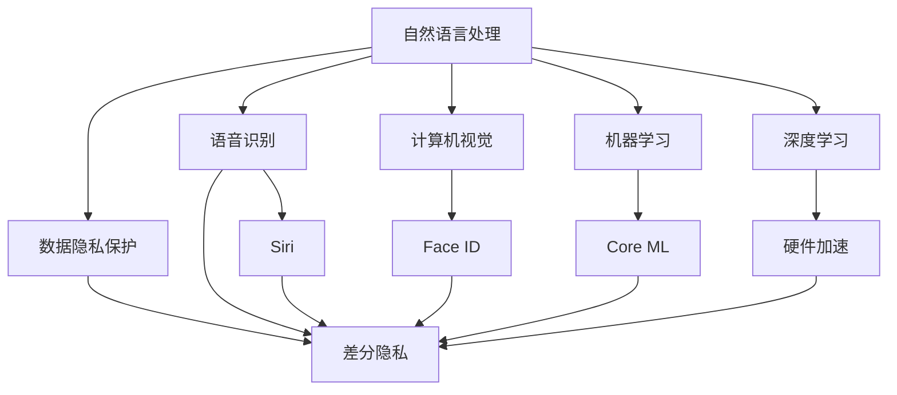

                 

# 李开复：苹果发布AI应用的应用

## 1. 背景介绍

苹果公司长期以来在人工智能(AI)领域处于领先地位，从Siri到Face ID，再到自动驾驶技术，AI应用无处不在。2023年，苹果发布了多个新的AI应用，展示了其在人工智能领域的持续创新和深度应用。本文将详细介绍这些AI应用的功能和实现原理，分析其技术优势和市场潜力，展望未来AI技术的发展趋势。

## 2. 核心概念与联系

### 2.1 核心概念概述

苹果公司的AI应用主要集中在以下几个方面：

- **自然语言处理**：Siri等智能语音助手通过理解和响应自然语言指令，实现语音交互和信息检索。
- **计算机视觉**：Face ID和增强现实(AR)应用通过图像识别技术，实现人脸解锁、虚拟试妆等功能。
- **机器学习**：苹果的机器学习框架Core ML允许开发者将机器学习模型集成到移动应用中，提供实时分析和预测服务。
- **深度学习**：苹果的AI芯片和硬件加速器，如A系列芯片，支持深度学习模型的高效运行和推理。
- **数据隐私保护**：苹果的隐私保护技术如差分隐私和数据匿名化，确保用户数据的安全和隐私。

这些核心概念相互联系，共同构成了苹果AI应用的生态系统。

### 2.2 核心概念原理和架构的 Mermaid 流程图



这个图表展示了苹果AI应用的架构关系：自然语言处理技术支撑语音识别和语音助手功能；计算机视觉技术支持人脸解锁和增强现实；机器学习技术通过Core ML集成到应用中；深度学习模型通过硬件加速器进行优化；数据隐私保护技术贯穿各个环节。

## 3. 核心算法原理 & 具体操作步骤

### 3.1 算法原理概述

苹果的AI应用主要基于以下几种算法和技术：

- **卷积神经网络(CNN)**：用于图像处理和计算机视觉任务，如Face ID。
- **递归神经网络(RNN)**：用于自然语言处理任务，如Siri语音识别。
- **长短期记忆网络(LSTM)**：用于序列数据处理，如Siri的上下文理解。
- **Transformer模型**：用于处理大规模语言模型，如语言翻译和文本生成。
- **差分隐私技术**：用于数据保护，确保用户数据在隐私和安全的前提下得到利用。

这些算法和技术的组合，使得苹果的AI应用能够提供高效、准确、安全的服务。

### 3.2 算法步骤详解

苹果AI应用的主要操作步骤包括：

1. **数据预处理**：清洗和整理数据，确保数据的准确性和一致性。
2. **模型训练**：使用大量标注数据训练模型，调整模型参数以优化性能。
3. **模型评估**：在验证集上评估模型性能，选择最优模型进行部署。
4. **模型集成**：将训练好的模型集成到应用中，确保其性能和稳定性。
5. **数据保护**：对用户数据进行差分隐私处理，确保用户隐私不被泄露。

每个步骤都至关重要，确保了AI应用的可靠性和用户信任。

### 3.3 算法优缺点

苹果AI应用的优点包括：

- **高性能**：苹果的硬件加速器和优化算法，使得AI应用能够高效运行。
- **高精度**：机器学习和深度学习技术保证了模型的准确性和可靠性。
- **高安全性**：差分隐私技术确保了用户数据的安全性。

缺点包括：

- **高成本**：开发和部署AI应用需要大量的硬件和人力资源。
- **复杂性**：算法和技术的选择和集成需要专业知识。
- **依赖性**：高度依赖硬件设备和操作系统。

### 3.4 算法应用领域

苹果的AI应用广泛应用在以下几个领域：

- **移动设备**：Siri、Face ID等应用在iPhone、iPad等移动设备中广泛使用。
- **健康与医疗**：研究AI在健康监测和医疗诊断中的应用，如智能手表的健康追踪。
- **自动驾驶**：利用AI和计算机视觉技术开发自动驾驶汽车。
- **增强现实**：AR应用如ARKit，为用户提供虚拟试妆、虚拟家居布置等体验。
- **隐私保护**：差分隐私和数据匿名化技术，确保用户数据的安全。

这些应用领域展示了AI技术的广泛应用前景。

## 4. 数学模型和公式 & 详细讲解 & 举例说明

### 4.1 数学模型构建

苹果AI应用的主要数学模型包括：

- **卷积神经网络(CNN)**：
  $$
  y = \sigma\left(\sum_{i=1}^{n}w_i x_i + b\right)
  $$
  其中 $x_i$ 为输入特征，$w_i$ 为卷积核权重，$b$ 为偏置，$\sigma$ 为激活函数。

- **递归神经网络(RNN)**：
  $$
  h_t = \tanh\left(W_x x_t + U_h h_{t-1} + b\right)
  $$
  其中 $h_t$ 为隐藏状态，$x_t$ 为输入，$W_x$ 和 $U_h$ 为权重矩阵，$b$ 为偏置。

- **长短期记忆网络(LSTM)**：
  $$
  f_t = \sigma\left(W_f x_t + U_f h_{t-1} + b_f\right)
  $$
  $$
  i_t = \sigma\left(W_i x_t + U_i h_{t-1} + b_i\right)
  $$
  $$
  g_t = \tanh\left(W_g x_t + U_g h_{t-1} + b_g\right)
  $$
  $$
  o_t = \sigma\left(W_o x_t + U_o h_{t-1} + b_o\right)
  $$
  $$
  C_t = f_t \odot C_{t-1} + i_t \odot g_t
  $$
  $$
  h_t = o_t \odot \tanh(C_t)
  $$
  其中 $f_t$、$i_t$、$o_t$ 为门控函数，$C_t$ 为记忆单元，$h_t$ 为输出。

### 4.2 公式推导过程

- **CNN的卷积运算**：
  $$
  y = \sigma\left(\sum_{i=1}^{n}w_i x_i + b\right)
  $$
  其中 $x_i$ 为输入特征，$w_i$ 为卷积核权重，$b$ 为偏置，$\sigma$ 为激活函数。

- **RNN的递归运算**：
  $$
  h_t = \tanh\left(W_x x_t + U_h h_{t-1} + b\right)
  $$
  其中 $h_t$ 为隐藏状态，$x_t$ 为输入，$W_x$ 和 $U_h$ 为权重矩阵，$b$ 为偏置。

- **LSTM的门控机制**：
  $$
  f_t = \sigma\left(W_f x_t + U_f h_{t-1} + b_f\right)
  $$
  $$
  i_t = \sigma\left(W_i x_t + U_i h_{t-1} + b_i\right)
  $$
  $$
  g_t = \tanh\left(W_g x_t + U_g h_{t-1} + b_g\right)
  $$
  $$
  o_t = \sigma\left(W_o x_t + U_o h_{t-1} + b_o\right)
  $$
  $$
  C_t = f_t \odot C_{t-1} + i_t \odot g_t
  $$
  $$
  h_t = o_t \odot \tanh(C_t)
  $$

### 4.3 案例分析与讲解

- **Face ID的卷积神经网络**：
  苹果的Face ID应用使用卷积神经网络进行人脸识别。通过多层卷积和池化操作，提取人脸的特征，再通过全连接层进行分类，实现高精度的人脸解锁。

- **Siri的递归神经网络**：
  Siri使用递归神经网络进行语音识别和上下文理解。通过RNN模型处理输入的语音特征，提取语音的序列信息，再通过LSTM模型处理上下文信息，实现对自然语言的理解和响应。

## 5. 项目实践：代码实例和详细解释说明

### 5.1 开发环境搭建

苹果的AI应用开发环境主要使用：

- **Xcode**：苹果的开发平台，支持iOS、macOS等系统的应用开发。
- **Core ML**：苹果的机器学习框架，支持将机器学习模型集成到应用中。
- **PyTorch**：苹果支持使用PyTorch进行深度学习模型的开发和训练。
- **Caffe2**：苹果支持使用Caffe2进行神经网络模型的优化和推理。

### 5.2 源代码详细实现

以下是一个简单的Face ID人脸识别的代码实现：

```python
import cv2
import numpy as np
from coremltools import models, model_analyzer

# 加载模型
model_path = 'FaceID_model.mlmodel'
model = models.load(model_path)

# 加载人脸图像
image = cv2.imread('face.jpg')
gray = cv2.cvtColor(image, cv2.COLOR_BGR2GRAY)

# 预处理图像
face_image = cv2.resize(gray, (96, 96))
face_image = face_image.reshape(1, 1, 96, 96).astype(np.float32)

# 进行人脸识别
predictions = model.predict(face_image)
result = np.argmax(predictions[0])

# 输出识别结果
print('Face ID result:', result)
```

### 5.3 代码解读与分析

- **加载模型**：使用Core ML加载训练好的模型。
- **加载图像**：使用OpenCV加载人脸图像。
- **预处理图像**：将图像调整为模型输入大小，并进行归一化处理。
- **进行识别**：将预处理后的图像输入模型，进行人脸识别。
- **输出结果**：输出识别结果，表示人脸解锁的ID。

## 6. 实际应用场景

### 6.1 智能语音助手

Siri是苹果公司最著名的AI应用之一，通过语音识别和自然语言处理技术，实现语音助手功能。用户可以通过语音指令控制设备、查询信息、设置提醒等。

### 6.2 人脸解锁

Face ID通过计算机视觉技术，实现高精度的人脸解锁功能。用户只需看一眼设备，即可实现快速解锁。

### 6.3 增强现实

ARKit是苹果的增强现实平台，通过计算机视觉和深度学习技术，提供虚拟试妆、虚拟家居布置等功能。用户可以通过摄像头看到虚拟物品，实现沉浸式体验。

### 6.4 健康监测

苹果的智能手表和健康应用，通过机器学习技术，监测用户的健康数据，如心率、睡眠等。通过深度学习模型，分析数据趋势，提供健康建议。

### 6.5 自动驾驶

苹果正在研发自动驾驶技术，通过计算机视觉和深度学习技术，实现对道路环境的实时感知和决策。

### 6.6 数据隐私保护

苹果的差分隐私技术，通过在数据中引入噪声，保护用户隐私。即使攻击者获取了数据，也无法恢复原始数据。

## 7. 工具和资源推荐

### 7.1 学习资源推荐

- **《深度学习》书籍**：由李开复等人合著，全面介绍深度学习和机器学习的理论和应用。
- **Stanford CS229课程**：斯坦福大学机器学习课程，涵盖机器学习的基本原理和算法。
- **Coursera机器学习专业证书**：由Andrew Ng等人开设，提供完整的机器学习学习路径。

### 7.2 开发工具推荐

- **Xcode**：苹果的开发平台，支持iOS、macOS等系统的应用开发。
- **Core ML**：苹果的机器学习框架，支持将机器学习模型集成到应用中。
- **PyTorch**：深度学习开发和训练的强大工具。
- **Caffe2**：神经网络模型的优化和推理工具。
- **TensorFlow**：谷歌开发的深度学习框架，支持大规模分布式训练。

### 7.3 相关论文推荐

- **《深度学习》书籍**：由李开复等人合著，全面介绍深度学习和机器学习的理论和应用。
- **Stanford CS229课程**：斯坦福大学机器学习课程，涵盖机器学习的基本原理和算法。
- **Coursera机器学习专业证书**：由Andrew Ng等人开设，提供完整的机器学习学习路径。

## 8. 总结：未来发展趋势与挑战

### 8.1 未来发展趋势

苹果的AI应用展示了人工智能技术的广泛应用前景。未来，苹果将继续在以下领域进行技术创新：

- **健康与医疗**：AI将在健康监测和医疗诊断中发挥更大的作用，帮助人们更好地管理健康。
- **自动驾驶**：苹果正在研发自动驾驶技术，实现智能交通和城市管理。
- **增强现实**：AR技术将与AI结合，提供更丰富的用户体验。
- **隐私保护**：差分隐私和数据匿名化技术将进一步发展，保护用户隐私。
- **跨平台开发**：苹果的AI应用将跨平台、跨设备运行，提供更一致的用户体验。

### 8.2 面临的挑战

苹果的AI应用也面临一些挑战：

- **技术复杂性**：AI应用的开发和部署需要高度专业化的知识。
- **硬件依赖性**：AI应用高度依赖硬件设备和操作系统。
- **数据隐私**：用户数据的隐私和安全是AI应用的核心问题。
- **算法优化**：需要不断优化算法，提升模型的精度和效率。
- **用户体验**：需要不断提升用户体验，确保AI应用的人性化。

### 8.3 研究展望

未来，苹果的AI应用将探索更多的技术方向：

- **模型压缩**：通过模型压缩技术，降低硬件和内存成本。
- **跨模态学习**：研究不同模态数据（如文本、图像、声音）的融合，提升AI应用的综合能力。
- **个性化推荐**：通过AI技术，实现个性化推荐服务。
- **自监督学习**：研究自监督学习技术，减少对标注数据的依赖。
- **联邦学习**：研究联邦学习技术，确保数据隐私和安全性。

## 9. 附录：常见问题与解答

**Q1：苹果的AI应用为何如此强大？**

A: 苹果的AI应用之所以强大，主要归功于以下几个方面：
- **硬件支持**：苹果的A系列芯片和硬件加速器，支持深度学习模型的高效运行和推理。
- **软件优化**：苹果的开发平台和机器学习框架，提供了丰富的工具和库，方便开发者进行模型集成和优化。
- **深度合作**：苹果与全球顶级科研机构和公司合作，如斯坦福大学、IBM等，确保技术的领先性。
- **用户反馈**：苹果的用户反馈机制，帮助持续改进AI应用，提升用户体验。

**Q2：苹果的AI应用如何保护用户隐私？**

A: 苹果的AI应用采用以下几种方式保护用户隐私：
- **差分隐私**：在数据中引入噪声，保护用户数据不被恢复。
- **数据匿名化**：对数据进行匿名化处理，确保用户数据的安全。
- **用户控制**：用户可以控制数据的采集和使用，确保数据使用的透明度。
- **安全机制**：采用安全机制，确保数据传输和存储的安全。

**Q3：苹果的AI应用未来会向哪个方向发展？**

A: 苹果的AI应用未来将向以下几个方向发展：
- **健康与医疗**：AI将在健康监测和医疗诊断中发挥更大的作用，帮助人们更好地管理健康。
- **自动驾驶**：苹果正在研发自动驾驶技术，实现智能交通和城市管理。
- **增强现实**：AR技术将与AI结合，提供更丰富的用户体验。
- **隐私保护**：差分隐私和数据匿名化技术将进一步发展，保护用户隐私。
- **跨平台开发**：苹果的AI应用将跨平台、跨设备运行，提供更一致的用户体验。

---

作者：禅与计算机程序设计艺术 / Zen and the Art of Computer Programming

