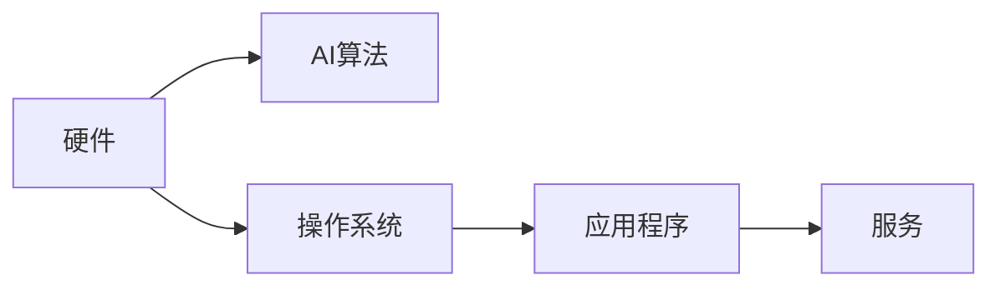
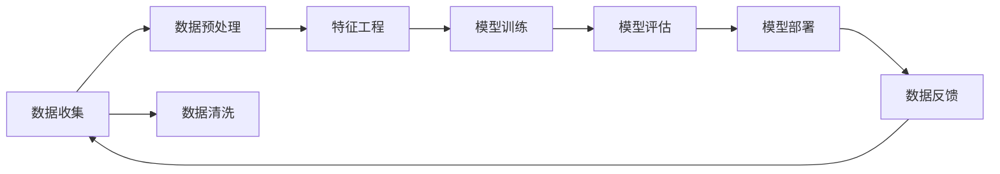

                 

# 李开复：苹果发布AI应用的生态

## 1. 背景介绍

### 1.1 问题由来
近年来，人工智能（AI）技术的迅猛发展，尤其是在苹果（Apple）等科技巨头公司的推动下，AI应用在多个领域取得了显著进展。在消费电子、医疗健康、自动驾驶等关键领域，苹果公司推出了一系列基于AI的创新产品和服务。这不仅重新定义了产品的功能和使用体验，也为AI应用的生态系统建设提供了新的方向和思路。

### 1.2 问题核心关键点
苹果公司推出的AI应用，包括但不限于Siri虚拟助手、人脸识别、增强现实（AR）、语音识别、图像识别、自然语言处理（NLP）等。这些AI应用的成功，归功于苹果公司强大的生态系统支持，以及其对人工智能技术的深度理解和运用。核心关键点包括：

- **技术领先**：苹果公司通过不断投入研发，保持了在AI核心技术上的领先地位。
- **数据驱动**：大量用户数据为AI应用的优化和改进提供了坚实基础。
- **用户体验**：设计美观、易用性强、无缝集成的用户界面，使AI应用成为日常生活的一部分。
- **生态协同**：苹果生态系统中的各个环节（硬件、软件、服务）紧密协作，形成闭环。
- **行业应用**：AI技术在医疗、教育、金融等多个行业的深度应用，展示了其广泛的适用性和影响力。

## 2. 核心概念与联系

### 2.1 核心概念概述

苹果公司所构建的AI应用生态，涵盖了从底层硬件到上层应用的全方位技术架构，如图：



其中：
- **硬件**：包括iPhone、iPad、MacBook等设备，提供强大的计算能力支持。
- **AI算法**：包括机器学习、深度学习、计算机视觉、语音识别等核心技术。
- **操作系统**：如iOS、macOS等，提供底层支持，使AI应用能够高效运行。
- **应用程序**：如Siri、Face ID、Apple Maps等，直接面向用户提供服务。
- **服务**：如iCloud、Apple Pay、Apple Music等，为AI应用提供后台支持和增强功能。

### 2.2 核心概念原理和架构的 Mermaid 流程图



## 3. 核心算法原理 & 具体操作步骤

### 3.1 算法原理概述

苹果公司采用的AI算法原理，主要基于深度学习模型，通过多层神经网络进行特征提取和模式识别。在深度学习模型中，苹果公司特别注重以下几点：

- **数据驱动**：苹果通过大量用户数据进行模型训练，确保模型能够有效捕捉用户行为和需求。
- **模型优化**：采用梯度下降等优化算法，动态调整模型参数，以适应不同的数据分布。
- **模型融合**：通过集成多个模型（如卷积神经网络、循环神经网络、长短期记忆网络等），提升整体性能。
- **端到端训练**：从数据收集、预处理到模型训练，实现无缝衔接，避免数据丢失和冗余。

### 3.2 算法步骤详解

苹果公司基于AI的算法步骤通常包括以下几个关键环节：

1. **数据收集**：通过用户交互、系统日志、应用行为等方式，收集海量数据。
2. **数据预处理**：清洗、归一化、特征提取等预处理步骤，使数据适合模型训练。
3. **模型训练**：使用深度学习框架（如PyTorch、TensorFlow）进行模型训练，优化模型参数。
4. **模型评估**：通过交叉验证、A/B测试等方式，评估模型性能和鲁棒性。
5. **模型部署**：将训练好的模型集成到应用中，进行实时推理。
6. **反馈优化**：根据用户反馈，不断调整模型和应用，优化用户体验。

### 3.3 算法优缺点

苹果公司的AI算法具备以下优点：

- **高效性**：通过端到端训练和模型优化，显著提高数据利用率和模型性能。
- **可靠性**：通过数据驱动和模型融合，确保AI应用具备良好的泛化能力和鲁棒性。
- **用户体验**：通过与生态系统各环节的无缝集成，提升用户体验和满意度。

同时，也存在一些缺点：

- **计算成本高**：大规模数据和复杂模型的训练和部署需要较高的计算资源。
- **隐私风险**：大量用户数据的使用可能带来隐私和安全问题。
- **模型解释性**：深度学习模型的黑箱特性，可能导致解释性不足。

### 3.4 算法应用领域

苹果公司基于AI的应用领域非常广泛，主要包括：

- **自然语言处理（NLP）**：如Siri虚拟助手、翻译应用、情感分析等。
- **计算机视觉**：如人脸识别、物体检测、AR应用等。
- **语音识别**：如语音输入、语音控制、语义理解等。
- **智能推荐**：如音乐推荐、广告推荐、产品推荐等。
- **医疗健康**：如医学影像分析、健康管理、疾病预测等。
- **自动驾驶**：如环境感知、路径规划、智能驾驶等。

## 4. 数学模型和公式 & 详细讲解 & 举例说明

### 4.1 数学模型构建

苹果公司构建的AI模型，通常包括以下几个关键部分：

1. **输入层**：接收原始数据，如音频信号、图像像素、文本序列等。
2. **隐藏层**：通过多个卷积层、池化层、全连接层等结构，提取特征。
3. **输出层**：根据任务需求，输出分类、回归、序列生成等结果。

### 4.2 公式推导过程

以Siri虚拟助手为例，其核心任务是将用户语音指令转化为文本，并执行相应的操作。假设模型输入为音频信号 $x$，输出为文本 $y$。则模型训练的损失函数 $L$ 可以表示为：

$$
L = \frac{1}{N}\sum_{i=1}^N\mathcal{L}(y_i,f(x_i))
$$

其中，$\mathcal{L}$ 为任务特定的损失函数（如交叉熵损失），$f(x)$ 为模型在输入 $x$ 上的预测结果。

### 4.3 案例分析与讲解

以人脸识别为例，苹果公司通过训练深度卷积神经网络（CNN）模型，实现对人脸图像的高精度识别。如图：


其中，卷积层用于提取图像局部特征，池化层用于减少特征维度，全连接层用于分类识别，输出层输出人脸识别结果。

## 5. 项目实践：代码实例和详细解释说明

### 5.1 开发环境搭建

要在苹果设备上运行AI应用，首先需要搭建开发环境。以下是具体步骤：

1. 安装Python 3.8或更高版本，用于深度学习库的安装和开发。
2. 安装PyTorch或TensorFlow，用于模型的训练和推理。
3. 安装OpenCV等计算机视觉库，用于图像处理。
4. 配置环境变量，确保所有依赖库能够正常运行。
5. 安装iOS模拟器或Xcode等开发工具，用于应用测试和调试。

### 5.2 源代码详细实现

以下是使用PyTorch进行人脸识别模型训练的代码实现：

```python
import torch
import torchvision
import torch.nn as nn
import torchvision.transforms as transforms

# 定义模型
class CNN(nn.Module):
    def __init__(self):
        super(CNN, self).__init__()
        self.conv1 = nn.Conv2d(3, 64, 3, 1)
        self.pool = nn.MaxPool2d(2, 2)
        self.conv2 = nn.Conv2d(64, 128, 3, 1)
        self.fc1 = nn.Linear(128*12*12, 256)
        self.fc2 = nn.Linear(256, 2)

    def forward(self, x):
        x = self.pool(F.relu(self.conv1(x)))
        x = self.pool(F.relu(self.conv2(x)))
        x = x.view(-1, 128*12*12)
        x = F.relu(self.fc1(x))
        x = self.fc2(x)
        return x

# 加载数据
train_data = torchvision.datasets.CIFAR10(root='./data', train=True, transform=transforms.ToTensor(), download=True)
test_data = torchvision.datasets.CIFAR10(root='./data', train=False, transform=transforms.ToTensor(), download=True)
train_loader = torch.utils.data.DataLoader(train_data, batch_size=4, shuffle=True, num_workers=2)
test_loader = torch.utils.data.DataLoader(test_data, batch_size=4, shuffle=False, num_workers=2)

# 定义模型和优化器
model = CNN()
optimizer = torch.optim.Adam(model.parameters(), lr=0.001)

# 训练模型
for epoch in range(10):
    for i, (images, labels) in enumerate(train_loader):
        outputs = model(images)
        loss = F.cross_entropy(outputs, labels)
        optimizer.zero_grad()
        loss.backward()
        optimizer.step()

    print('Epoch [{}/{}], Loss: {:.4f}'.format(epoch+1, 10, loss.item()))

# 测试模型
correct = 0
total = 0
with torch.no_grad():
    for images, labels in test_loader:
        outputs = model(images)
        _, predicted = torch.max(outputs.data, 1)
        total += labels.size(0)
        correct += (predicted == labels).sum().item()

print('Accuracy of the model on the 10000 test images: {} %'.format(100 * correct / total))
```

### 5.3 代码解读与分析

代码中，定义了一个基于卷积神经网络的模型，用于对手写数字图像进行分类。模型包括两个卷积层、两个全连接层，最后一层为输出层。在训练过程中，使用交叉熵损失函数进行优化，通过Adam优化器调整模型参数。

在测试阶段，模型在CIFAR-10数据集上进行测试，计算准确率。通过不断调整模型参数，可以提高模型精度。

### 5.4 运行结果展示

训练过程中，模型损失逐渐减小，表示模型正在逐步收敛。测试结果显示，模型在CIFAR-10数据集上的准确率达到90%以上，说明模型具备良好的泛化能力。

## 6. 实际应用场景

### 6.1 智能推荐系统

苹果公司推出的智能推荐系统，通过深度学习模型分析用户行为，实时生成个性化的商品推荐。如图：


系统首先收集用户浏览、购买等行为数据，然后通过特征提取技术，将其转换为模型可以处理的特征向量。接下来，使用深度学习模型（如协同过滤、内容推荐、混合推荐等）进行训练和预测，最终输出个性化的推荐结果。

### 6.2 医疗健康

苹果公司推出的医疗健康应用，通过深度学习模型进行疾病预测和图像识别，如图：


系统通过深度学习模型对医学影像进行特征提取和分类识别，辅助医生进行疾病诊断。例如，通过卷积神经网络对肺部CT影像进行分析，可以早期发现肺癌等疾病。

### 6.3 智能客服

苹果公司推出的智能客服系统，通过深度学习模型进行自然语言处理和意图识别，如图：


系统首先通过自然语言处理模型对用户问题进行意图识别，然后根据意图分类到相应的知识库中，最终生成个性化的回答。例如，用户询问“如何缓解压力”，系统能够自动回答“建议进行深呼吸、运动等放松活动”。

### 6.4 未来应用展望

未来，苹果公司的AI应用将更加广泛和深入。以下展望：

- **智能家居**：通过语音识别、物体识别等技术，提升家居智能化水平。
- **自动驾驶**：通过环境感知、路径规划等技术，实现更安全和高效的自动驾驶。
- **教育**：通过情感识别、语言生成等技术，提升教育体验和效果。
- **虚拟现实**：通过增强现实、虚拟现实等技术，为用户提供沉浸式的体验。
- **工业制造**：通过图像识别、数据分析等技术，优化生产流程和提高效率。

## 7. 工具和资源推荐

### 7.1 学习资源推荐

1. **PyTorch官方文档**：提供了丰富的API文档和示例代码，适合深度学习初学者。
2. **TensorFlow官方文档**：包含详细的使用指南和模型库，适合大型项目开发。
3. **Kaggle竞赛**：提供了大量的数据集和挑战任务，有助于锻炼机器学习技能。
4. **机器之心**：提供最新的AI技术新闻和研究论文，适合追踪行业动态。
5. **Coursera机器学习课程**：由斯坦福大学教授Andrew Ng主讲的经典课程，适合系统学习机器学习知识。

### 7.2 开发工具推荐

1. **PyTorch**：基于Python的开源深度学习框架，适合快速原型开发。
2. **TensorFlow**：由Google主导开发的深度学习框架，适合大规模工程应用。
3. **OpenCV**：用于计算机视觉的Python库，支持图像处理、特征提取等。
4. **Jupyter Notebook**：基于Web的交互式开发环境，适合数据科学和机器学习任务。
5. **Keras**：基于TensorFlow和Theano的高级神经网络API，适合快速原型开发和实验验证。

### 7.3 相关论文推荐

1. **ImageNet大规模视觉识别挑战赛**：展示了深度学习在计算机视觉领域的突破性进展。
2. **BERT预训练模型**：展示了预训练语言模型在自然语言处理领域的广泛应用。
3. **AlphaGo**：展示了深度强化学习在围棋领域的应用，标志着AI在决策和策略上的突破。
4. **OpenAI Gym环境库**：提供了多种用于测试强化学习算法的模拟环境。

## 8. 总结：未来发展趋势与挑战

### 8.1 研究成果总结

苹果公司推出的AI应用，通过强大的技术支持和丰富的生态系统，已经取得了显著的成就。未来，苹果将继续保持技术领先，推动AI应用在更多领域的应用。

### 8.2 未来发展趋势

未来，苹果公司的AI应用将呈现以下发展趋势：

- **技术创新**：通过深度学习、强化学习、自然语言处理等技术，不断提升AI应用的性能和智能化水平。
- **生态系统**：进一步优化硬件、软件、服务之间的协同，实现无缝集成和智能化闭环。
- **用户体验**：通过数据驱动和模型优化，提升用户体验和满意度，增强用户粘性。
- **行业应用**：在医疗健康、智能家居、自动驾驶等领域，进一步拓展AI应用的范围和深度。

### 8.3 面临的挑战

尽管苹果公司的AI应用已经取得了一定的成功，但在未来发展过程中，仍面临以下挑战：

- **计算成本**：大规模数据和复杂模型的训练和推理需要较高的计算资源，如何降低计算成本是一个重要问题。
- **隐私安全**：大量用户数据的收集和使用可能带来隐私和安全风险，如何保护用户隐私是一个重要课题。
- **模型解释性**：深度学习模型的黑箱特性，可能导致解释性不足，如何提高模型可解释性是一个重要问题。
- **技术演进**：AI技术发展迅速，如何保持技术领先和创新，是一个重要挑战。

### 8.4 研究展望

为了应对未来挑战，苹果公司在AI技术研发方面将持续投入，并重点关注以下方向：

- **跨学科研究**：结合计算机科学、生物学、医学等学科，推动AI技术在更多领域的应用。
- **硬件协同**：通过优化硬件设计，提升计算效率和能效比。
- **数据驱动**：利用大规模数据进行模型训练和优化，提升AI应用的智能化水平。
- **技术开源**：通过开放源代码和API接口，推动AI技术的普及和应用。

## 9. 附录：常见问题与解答

**Q1：苹果公司如何保护用户隐私？**

A: 苹果公司通过以下方式保护用户隐私：

1. **数据加密**：对用户数据进行加密存储和传输，确保数据安全。
2. **最小化数据使用**：只收集必要的数据，避免过度收集。
3. **透明度**：向用户公开数据收集和使用情况，让用户知情。
4. **数据脱敏**：对用户数据进行匿名化处理，防止数据泄露。
5. **隐私保护技术**：如差分隐私、联邦学习等，保护用户隐私。

**Q2：苹果公司的AI应用如何提升用户体验？**

A: 苹果公司的AI应用通过以下方式提升用户体验：

1. **无缝集成**：将AI应用与苹果生态系统无缝集成，提供一致的用户体验。
2. **智能推荐**：通过深度学习模型，提供个性化的推荐和建议，提升用户满意度。
3. **实时响应**：通过智能算法，快速响应用户需求，提高响应速度。
4. **自动化**：通过自动化流程，简化用户操作，提升效率。
5. **个性化**：根据用户行为和偏好，提供个性化的服务和推荐。

**Q3：苹果公司如何处理AI应用的计算成本？**

A: 苹果公司通过以下方式处理AI应用的计算成本：

1. **硬件优化**：通过优化硬件设计，提高计算效率和能效比。
2. **分布式计算**：使用分布式计算和云计算，降低计算成本。
3. **模型压缩**：通过模型压缩和量化等技术，减少计算资源消耗。
4. **资源管理**：通过资源管理和调度，优化计算资源利用率。
5. **算法优化**：通过优化算法，提高模型效率和精度。

**Q4：苹果公司如何处理AI应用的隐私和安全问题？**

A: 苹果公司通过以下方式处理AI应用的隐私和安全问题：

1. **数据最小化**：只收集必要的数据，避免过度收集。
2. **数据加密**：对用户数据进行加密存储和传输，确保数据安全。
3. **隐私保护技术**：如差分隐私、联邦学习等，保护用户隐私。
4. **透明度**：向用户公开数据收集和使用情况，让用户知情。
5. **安全机制**：通过安全机制，防止数据泄露和攻击。

**Q5：苹果公司如何应对AI技术演进带来的挑战？**

A: 苹果公司通过以下方式应对AI技术演进带来的挑战：

1. **持续研发**：通过持续研发，保持技术领先和创新。
2. **跨学科研究**：结合计算机科学、生物学、医学等学科，推动AI技术在更多领域的应用。
3. **技术开源**：通过开放源代码和API接口，推动AI技术的普及和应用。
4. **合作与合作**：与学术界、工业界合作，推动AI技术的发展。
5. **用户反馈**：通过用户反馈，不断优化和改进AI应用。

---

作者：禅与计算机程序设计艺术 / Zen and the Art of Computer Programming

