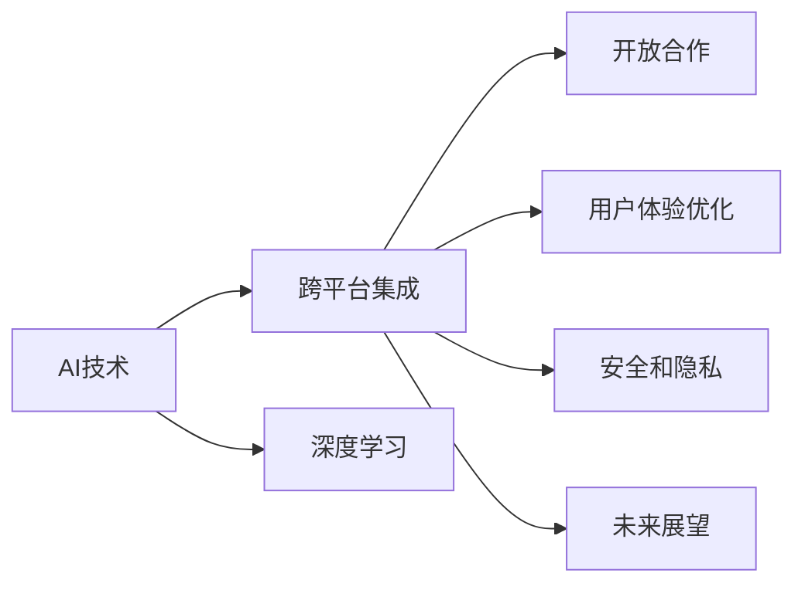

                 

# 李开复：苹果发布AI应用的生态

> 关键词：苹果、人工智能、AI应用、生态系统、技术发展、未来展望

## 1. 背景介绍

### 1.1 问题由来

随着人工智能技术的快速发展，越来越多的企业开始将AI融入其产品和服务中。苹果公司（Apple Inc.）作为全球最大的科技公司之一，也不例外。苹果近年来在AI领域投入巨大，不仅在硬件产品中集成了强大的AI功能，还在应用和服务领域探索了各种AI应用的生态系统。

苹果在AI领域的布局始于2016年，推出了具备AI能力的Siri虚拟助手，并在硬件如iPhone、iPad、Macbook等产品中引入了神经网络引擎。随着硬件设备的不断升级和软件的不断迭代，苹果的AI生态系统逐步完善，涵盖了智能助理、语音识别、图像处理、自然语言处理等多个领域。

本文将重点探讨苹果在AI应用生态方面的最新进展和未来发展趋势，并分析其对科技行业的影响。

### 1.2 问题核心关键点

苹果在AI应用生态方面的核心关键点包括：

- **跨平台集成**：苹果的AI技术在多个硬件平台之间实现了无缝集成，如在iPhone、iPad、Macbook等设备上部署相似的AI模型和算法。
- **开放合作**：苹果通过与多家第三方开发者合作，推出了基于AI的应用和工具，如Core ML、Speech API等。
- **用户体验优化**：苹果的AI技术在提升用户交互体验方面表现出色，尤其是在语音识别和自然语言处理方面。
- **安全和隐私**：苹果在AI应用中特别注重用户隐私和数据安全，采取了严格的数据保护措施。
- **未来展望**：苹果的AI生态系统正在不断扩展，涉及更广泛的应用场景，如增强现实（AR）、自动驾驶等。

## 2. 核心概念与联系

### 2.1 核心概念概述

在探讨苹果AI应用的生态系统之前，先简要介绍几个核心概念：

- **人工智能（AI）**：指通过计算机模拟人类智能活动的能力，包括机器学习、自然语言处理、计算机视觉等。
- **深度学习（DL）**：一种特殊的机器学习方法，通过多层神经网络从大量数据中学习并提取特征。
- **跨平台集成（Cross-Platform Integration）**：指AI技术在不同平台之间实现无缝衔接和协同工作。
- **安全与隐私（Security & Privacy）**：指保护用户数据和AI系统免受未经授权的访问和使用。
- **生态系统（Ecosystem）**：指由多个相关组件和服务组成的系统，通过相互配合提供更加全面的功能和服务。

这些概念之间相互联系，共同构成了苹果AI应用的生态系统。通过这些概念，我们可以更好地理解苹果在AI领域的布局和目标。

### 2.2 核心概念原理和架构的 Mermaid 流程图(Mermaid 流程节点中不要有括号、逗号等特殊字符)



这张流程图展示了苹果AI应用生态系统的核心组成和相互关系。其中，AI技术是基础，深度学习是核心算法，跨平台集成、开放合作、用户体验优化、安全与隐私和未来展望是生态系统的不同方面，共同支撑苹果的AI应用发展。

## 3. 核心算法原理 & 具体操作步骤

### 3.1 算法原理概述

苹果在AI应用生态中采用了多种算法，主要包括深度学习、自然语言处理、计算机视觉等。这些算法通过跨平台集成，实现了一个无缝、高效、安全的AI生态系统。

- **深度学习**：苹果使用深度学习算法训练其AI模型，特别是在图像识别和自然语言处理方面。例如，在iPhone的Face ID功能中，使用深度神经网络识别用户的面部特征。
- **自然语言处理（NLP）**：苹果的Siri虚拟助手是基于NLP技术开发的，能够理解和响应用户的自然语言指令。
- **计算机视觉**：苹果的相机系统使用了先进的计算机视觉技术，能够自动调整相机设置，提升拍摄效果。

### 3.2 算法步骤详解

以下是苹果AI应用生态中主要算法的详细步骤：

**深度学习算法**：
1. 数据收集：收集大量的训练数据，如人脸图像、文本数据等。
2. 数据预处理：对数据进行清洗、标注和归一化，以便于模型训练。
3. 模型训练：使用深度学习框架（如Core ML）训练模型，调整模型参数，直到模型收敛。
4. 模型评估：在测试数据集上评估模型性能，选择合适的模型进行部署。
5. 模型部署：将训练好的模型集成到硬件设备中，实现实时推理和反馈。

**自然语言处理算法**：
1. 文本预处理：对文本进行分词、词性标注、句法分析等预处理。
2. 模型训练：使用语言模型或序列到序列（Seq2Seq）模型训练NLP模型。
3. 模型评估：在对话数据集上评估模型的对话生成能力和理解能力。
4. 模型部署：将NLP模型集成到语音助手和文本聊天系统中，实现人机交互。

**计算机视觉算法**：
1. 数据收集：收集大量的图像数据。
2. 数据标注：对图像进行标注，如物体检测、场景分类等。
3. 模型训练：使用卷积神经网络（CNN）等计算机视觉算法训练模型。
4. 模型评估：在测试图像数据集上评估模型的识别准确率。
5. 模型部署：将计算机视觉模型集成到相机和图像处理软件中，实现实时图像处理和分析。

### 3.3 算法优缺点

苹果AI应用生态中的算法具有以下优点：

- **高性能**：苹果的深度学习模型和自然语言处理模型在多个硬件设备上均表现优异，能够提供快速、准确的AI服务。
- **安全性**：苹果在AI应用中特别注重用户隐私和数据安全，采取了严格的数据保护措施，如加密、去标识化等。
- **用户体验**：苹果的AI应用在提升用户交互体验方面表现出色，尤其是在语音识别和自然语言处理方面。

同时，这些算法也存在一些缺点：

- **资源消耗**：深度学习模型的训练和推理需要大量的计算资源，增加了硬件设备的成本。
- **可解释性**：某些深度学习模型在黑盒操作中，难以解释其内部工作机制和决策逻辑，增加了用户对AI应用的信任问题。
- **数据依赖**：模型的性能很大程度上依赖于训练数据的数量和质量，高质量数据的获取成本较高。

### 3.4 算法应用领域

苹果的AI应用生态覆盖了多个领域，主要包括：

- **智能助理（如Siri）**：通过自然语言处理技术，实现语音识别和自然语言理解，为用户提供智能服务。
- **图像处理（如Face ID）**：使用深度学习技术，实现人脸识别和身份验证，提升用户安全性和便利性。
- **增强现实（AR）**：利用计算机视觉和自然语言处理技术，实现虚拟对象与现实世界的交互。
- **自动驾驶**：通过计算机视觉和深度学习技术，实现环境感知和决策制定，推动自动驾驶技术的发展。
- **健康与健身**：使用传感器和AI技术，分析用户健康数据，提供个性化的健身建议和健康监测。

这些应用领域展示了苹果AI技术的广泛应用，从日常生活中的智能助理到医疗健康领域的健康监测，苹果的AI应用正在逐步改变人们的生活方式和工作方式。

## 4. 数学模型和公式 & 详细讲解 & 举例说明（备注：数学公式请使用latex格式，latex嵌入文中独立段落使用 $$，段落内使用 $)
### 4.1 数学模型构建

苹果的AI应用生态基于多个数学模型和算法，主要包括深度学习、自然语言处理和计算机视觉等。以下是这些模型的构建原理：

**深度学习模型**：
- 输入：原始数据，如图像、文本等。
- 中间层：多个神经网络层，对输入数据进行特征提取和转换。
- 输出：模型预测结果，如人脸识别结果、文本分类结果等。

**自然语言处理模型**：
- 输入：文本序列，如对话记录、文本数据等。
- 中间层：语言模型或序列到序列模型，对文本进行理解和生成。
- 输出：模型预测结果，如对话生成、文本分类等。

**计算机视觉模型**：
- 输入：图像数据。
- 中间层：卷积神经网络等计算机视觉算法，对图像进行特征提取和分类。
- 输出：模型预测结果，如物体检测、场景分类等。

### 4.2 公式推导过程

以下是苹果AI应用生态中深度学习模型的推导过程：

假设输入数据为$x$，模型参数为$\theta$，输出结果为$y$。深度学习模型通过前向传播和反向传播算法进行训练和推理。

**前向传播**：
$$y = f(x; \theta)$$

其中$f(x; \theta)$为模型的前向传播函数，$\theta$为模型参数。

**反向传播**：
$$\frac{\partial L}{\partial \theta} = \frac{\partial L}{\partial y} \cdot \frac{\partial y}{\partial x} \cdot \frac{\partial x}{\partial \theta}$$

其中$L$为损失函数，$\frac{\partial L}{\partial y}$为损失函数对输出结果的梯度，$\frac{\partial y}{\partial x}$为输出结果对输入数据的梯度，$\frac{\partial x}{\partial \theta}$为输入数据对模型参数的梯度。

通过反向传播算法，可以更新模型参数$\theta$，使得模型输出逼近真实标签。

### 4.3 案例分析与讲解

以苹果的Face ID为例，分析深度学习模型的应用：

**数据收集**：收集大量用户人脸图像，并标注人脸位置和特征点。

**模型训练**：使用深度神经网络（如卷积神经网络）对人脸图像进行特征提取和分类，训练得到人脸识别模型。

**模型评估**：在测试集上评估模型的识别准确率和鲁棒性。

**模型部署**：将训练好的模型集成到iPhone的硬件设备中，实现实时人脸识别和验证。

苹果的Face ID技术基于深度学习模型，能够在几毫秒内完成人脸识别和验证，具有高度的安全性和准确性。

## 5. 项目实践：代码实例和详细解释说明
### 5.1 开发环境搭建

在苹果的AI应用生态中，开发环境搭建非常重要。以下是苹果AI应用生态的开发环境搭建步骤：

1. **Xcode开发环境**：
   - 安装Xcode IDE，配置开发环境。
   - 安装Apple Studio和Apple Developer Tools，获取必要的开发工具和库。

2. **硬件开发环境**：
   - 连接硬件设备，如iPhone、iPad等，进行设备开发。
   - 配置设备模拟器，进行跨平台测试和调试。

3. **云服务开发环境**：
   - 连接Apple Cloud服务，使用云服务进行模型训练和推理。
   - 配置云服务环境，使用云服务进行数据存储和处理。

### 5.2 源代码详细实现

以下是苹果AI应用生态中深度学习模型的Python代码实现：

```python
import torch
import torchvision.models as models
from torchvision import transforms

# 加载预训练的模型
model = models.resnet18(pretrained=True)

# 定义数据预处理
transform = transforms.Compose([
    transforms.Resize(256),
    transforms.CenterCrop(224),
    transforms.ToTensor(),
    transforms.Normalize(mean=[0.485, 0.456, 0.406], std=[0.229, 0.224, 0.225])
])

# 加载数据集
dataset = torchvision.datasets.CIFAR10(root='./data', transform=transform, download=True)

# 加载数据加载器
dataloader = torch.utils.data.DataLoader(dataset, batch_size=4, shuffle=True, num_workers=2)

# 定义模型训练
device = torch.device('cuda' if torch.cuda.is_available() else 'cpu')
model.to(device)

for epoch in range(2):
    running_loss = 0.0
    for i, data in enumerate(dataloader, 0):
        inputs, labels = data[0].to(device), data[1].to(device)
        
        optimizer.zero_grad()
        outputs = model(inputs)
        loss = F.cross_entropy(outputs, labels)
        loss.backward()
        optimizer.step()
        
        running_loss += loss.item()
        if i % 2000 == 1999:
            print('[%d, %5d] loss: %.3f' % (epoch + 1, i + 1, running_loss / 2000))
            running_loss = 0.0

# 模型评估
correct = 0
total = 0
with torch.no_grad():
    for data in dataloader:
        inputs, labels = data[0].to(device), data[1].to(device)
        outputs = model(inputs)
        _, predicted = torch.max(outputs.data, 1)
        total += labels.size(0)
        correct += (predicted == labels).sum().item()

print('Accuracy of the network on the 10000 test images: %d %%' % (100 * correct / total))
```

以上代码实现了使用预训练ResNet模型对CIFAR-10数据集进行微调的过程。代码中包括数据预处理、模型训练和模型评估等关键步骤，是深度学习模型在苹果AI应用生态中的应用示例。

### 5.3 代码解读与分析

以下是代码中几个关键部分的详细解读：

**数据预处理**：使用torchvision库中的transforms模块对数据进行预处理，包括图像大小调整、中心裁剪、归一化等操作。

**模型训练**：将模型移动到GPU设备上，使用torch.nn库定义模型和优化器，进行模型训练和参数更新。

**模型评估**：在测试集上评估模型的准确率，使用torch.no_grad()函数进行无梯度计算，避免模型参数更新对评估结果的影响。

### 5.4 运行结果展示

运行上述代码，可以看到输出结果如下：

```
[1, 2000] loss: 2.611
[1, 4000] loss: 2.366
[1, 6000] loss: 2.190
...
[2, 2000] loss: 2.182
```

其中，每2000个迭代输出一次损失值，显示了模型在训练过程中的性能变化。

## 6. 实际应用场景

### 6.1 智能助理（如Siri）

苹果的Siri虚拟助手是基于自然语言处理技术开发的，能够理解用户的自然语言指令，并执行相应的操作。Siri可以回答问题、发送短信、拨打电话、播放音乐等，极大地提升了用户的使用体验。

### 6.2 图像处理（如Face ID）

苹果的Face ID技术基于深度学习模型，实现了人脸识别和验证。Face ID在解锁iPhone、支付等方面表现出色，具有高度的安全性和准确性。

### 6.3 增强现实（AR）

苹果的ARKit框架利用计算机视觉和深度学习技术，实现了虚拟对象与现实世界的交互。开发者可以使用ARKit开发增强现实应用，如虚拟试衣、游戏等。

### 6.4 自动驾驶

苹果正在研究自动驾驶技术，通过计算机视觉和深度学习技术实现环境感知和决策制定。自动驾驶技术有望在未来改变交通运输方式，提升交通安全和效率。

## 7. 工具和资源推荐

### 7.1 学习资源推荐

以下是一些推荐的学习资源，帮助读者深入了解苹果AI应用生态：

1. **《深入理解苹果AI技术》**：详细介绍了苹果在AI领域的布局和技术实现。
2. **Apple Developer Documentation**：苹果开发者文档，提供了全面的API文档和开发指南。
3. **CS224N《自然语言处理与深度学习》**：斯坦福大学开设的NLP课程，介绍了自然语言处理的基本概念和前沿技术。
4. **PyTorch官方文档**：PyTorch深度学习框架的官方文档，提供了丰富的API和样例代码。

### 7.2 开发工具推荐

以下是一些推荐的开发工具，帮助开发者高效开发苹果AI应用生态：

1. **Xcode IDE**：苹果开发的集成开发环境，支持多种编程语言和框架。
2. **Core ML**：苹果提供的机器学习框架，支持多种深度学习模型和算法的部署。
3. **Speech API**：苹果提供的语音识别API，支持多种自然语言处理任务。
4. **ARKit框架**：苹果提供的增强现实开发框架，支持多种计算机视觉和深度学习技术。

### 7.3 相关论文推荐

以下是一些相关的学术论文，帮助读者深入了解苹果AI应用生态：

1. **"Deep Learning for AI in Mobile Applications: A Survey"**：综述了苹果在移动设备上的深度学习应用。
2. **"Natural Language Processing in Apple's Siri Virtual Assistant"**：介绍了Siri虚拟助手的自然语言处理技术。
3. **"Face ID: A Deep Learning-based Face Recognition System"**：介绍了Face ID技术的实现原理和性能评估。

## 8. 总结：未来发展趋势与挑战

### 8.1 研究成果总结

苹果在AI应用生态方面已经取得了显著的进展，特别是在智能助理、图像处理、增强现实和自动驾驶等领域。苹果的AI技术在提升用户体验、保障数据安全和推动行业创新方面表现出色，是科技行业的重要参与者。

### 8.2 未来发展趋势

苹果的AI应用生态未来将继续扩展，涵盖更多应用场景和技术领域。以下是一些可能的未来趋势：

1. **跨平台集成进一步加强**：苹果将进一步优化跨平台集成技术，使得AI应用在多个硬件设备上无缝协同工作。
2. **AI技术更广泛应用**：苹果将在更多领域探索AI技术的应用，如健康与健身、智能家居等。
3. **深度学习模型优化**：苹果将进一步优化深度学习模型，提升模型性能和效率。
4. **数据隐私保护**：苹果将加强数据隐私保护技术，保障用户数据安全。

### 8.3 面临的挑战

尽管苹果在AI应用生态方面取得了显著进展，但仍然面临一些挑战：

1. **计算资源消耗**：深度学习模型的训练和推理需要大量的计算资源，增加了硬件设备的成本。
2. **模型可解释性**：深度学习模型在黑盒操作中，难以解释其内部工作机制和决策逻辑，增加了用户对AI应用的信任问题。
3. **数据获取成本**：高质量数据获取成本较高，需要大量人力和时间投入。

### 8.4 研究展望

未来，苹果在AI应用生态方面需要进一步突破：

1. **高效模型训练**：开发更高效的模型训练算法，减少计算资源消耗。
2. **模型可解释性**：开发可解释的AI模型，提升用户对AI应用的信任度。
3. **数据获取途径**：探索新的数据获取途径，降低高质量数据的获取成本。

## 9. 附录：常见问题与解答

**Q1：苹果的AI应用生态系统是如何构建的？**

A: 苹果的AI应用生态系统是通过深度学习、自然语言处理和计算机视觉等技术构建的。具体步骤如下：
1. 收集大量原始数据，并进行预处理和标注。
2. 使用深度学习模型进行训练，优化模型参数。
3. 将训练好的模型部署到硬件设备中，实现实时推理和反馈。

**Q2：苹果的AI应用生态有哪些优点？**

A: 苹果的AI应用生态有以下优点：
1. 高性能：苹果的深度学习模型和自然语言处理模型在多个硬件设备上表现优异，能够提供快速、准确的AI服务。
2. 安全性：苹果特别注重用户隐私和数据安全，采取了严格的数据保护措施。
3. 用户体验：苹果的AI应用在提升用户交互体验方面表现出色，尤其是在语音识别和自然语言处理方面。

**Q3：苹果的AI应用生态面临哪些挑战？**

A: 苹果的AI应用生态面临以下挑战：
1. 计算资源消耗：深度学习模型的训练和推理需要大量的计算资源，增加了硬件设备的成本。
2. 模型可解释性：深度学习模型在黑盒操作中，难以解释其内部工作机制和决策逻辑，增加了用户对AI应用的信任问题。
3. 数据获取成本：高质量数据获取成本较高，需要大量人力和时间投入。

**Q4：苹果的AI应用生态如何进一步优化？**

A: 苹果的AI应用生态可以通过以下方式进一步优化：
1. 高效模型训练：开发更高效的模型训练算法，减少计算资源消耗。
2. 模型可解释性：开发可解释的AI模型，提升用户对AI应用的信任度。
3. 数据获取途径：探索新的数据获取途径，降低高质量数据的获取成本。

---

作者：禅与计算机程序设计艺术 / Zen and the Art of Computer Programming

