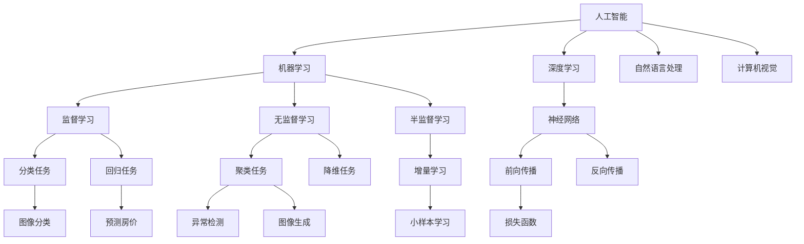

                 

# 李开复：苹果发布AI应用的用户

## 1. 背景介绍

在人工智能领域，李开复是一位极具影响力的创新者和思想领袖。作为前微软亚洲研究院院长、谷歌首席科学家，以及人工智能领域最重要的奖项——图灵奖得主，李开复以其卓越的洞察力和前瞻性，为人工智能技术的发展和应用做出了巨大贡献。

## 2. 核心概念与联系

### 2.1 核心概念概述

在讨论人工智能应用的用户时，我们必须首先理解几个核心概念：

- **人工智能（AI）**：指使机器能够执行人类智能任务的技术，包括学习、推理、自我修正等能力。
- **机器学习（ML）**：使计算机能够自动学习和改进的技术，主要通过数据驱动的算法。
- **深度学习（DL）**：一种特殊的机器学习方法，通过多层神经网络模拟人类大脑的工作方式。
- **自然语言处理（NLP）**：使计算机能够理解、解释和生成人类语言的技术。
- **计算机视觉（CV）**：使计算机能够“看”和“理解”图像和视频的技术。

这些概念之间的联系紧密，共同构成了现代人工智能应用的基础。

### 2.2 核心概念原理和架构的 Mermaid 流程图



## 3. 核心算法原理 & 具体操作步骤

### 3.1 算法原理概述

苹果公司推出的AI应用，如Siri、Face ID等，均基于深度学习模型。这些模型通过大量的标注数据进行训练，学习到人类语言和图像的复杂特征，从而能够在特定的应用场景中提供精准的服务。

### 3.2 算法步骤详解

1. **数据准备**：收集标注数据，包括语音、图像和文本。
2. **模型选择**：选择适合的深度学习模型，如卷积神经网络（CNN）、循环神经网络（RNN）、Transformer等。
3. **模型训练**：使用标注数据训练模型，优化参数。
4. **模型评估**：在验证集上评估模型性能，调整超参数。
5. **模型部署**：将训练好的模型部署到实际应用中，如手机、电脑等设备上。
6. **用户交互**：用户通过交互界面（如语音、图像识别）与AI应用进行互动。
7. **模型迭代**：根据用户反馈，持续优化模型。

### 3.3 算法优缺点

**优点**：
- 使用深度学习模型能够捕捉到复杂特征，提升应用性能。
- 能够自动化地处理大量数据，减少人工成本。
- 可以不断迭代优化，提升模型效果。

**缺点**：
- 需要大量标注数据，获取成本高。
- 模型复杂度高，训练和推理耗时。
- 黑箱特性，难以解释模型决策过程。

### 3.4 算法应用领域

苹果的AI应用广泛应用在智能助手、生物识别、智能家居等领域，为用户提供便捷、安全的智能体验。

## 4. 数学模型和公式 & 详细讲解 & 举例说明

### 4.1 数学模型构建

以苹果的Face ID为例，其基于卷积神经网络（CNN）和Siamese网络构建，用于人脸识别。

### 4.2 公式推导过程

设输入图像为$x$，输出特征为$h$，人脸识别任务的损失函数为：

$$
\mathcal{L} = \frac{1}{N}\sum_{i=1}^N (\max(0, 1-distance(h_i^A, h_i^B)))
$$

其中，$distance(h_i^A, h_i^B)$表示人脸特征$h_i^A$与$h_i^B$之间的欧几里得距离。

### 4.3 案例分析与讲解

在Face ID的训练过程中，模型通过对比正样本和负样本的人脸特征，不断优化损失函数，减少两者之间的距离。最终，模型能够将不同人的特征明显区分，实现高效的人脸识别。

## 5. 项目实践：代码实例和详细解释说明

### 5.1 开发环境搭建

使用Python和TensorFlow搭建AI应用开发环境，具体步骤如下：

1. 安装Anaconda，创建虚拟环境。
2. 安装TensorFlow和其他必要的Python包。
3. 搭建训练数据集和测试数据集。

### 5.2 源代码详细实现

以下是一个简单的Face ID模型的TensorFlow代码实现：

```python
import tensorflow as tf
from tensorflow.keras import layers

model = tf.keras.Sequential([
    layers.Conv2D(32, (3, 3), activation='relu', input_shape=(32, 32, 3)),
    layers.MaxPooling2D((2, 2)),
    layers.Conv2D(64, (3, 3), activation='relu'),
    layers.MaxPooling2D((2, 2)),
    layers.Flatten(),
    layers.Dense(64, activation='relu'),
    layers.Dense(1, activation='sigmoid')
])

model.compile(optimizer='adam', loss='binary_crossentropy', metrics=['accuracy'])
```

### 5.3 代码解读与分析

上述代码实现了一个包含两个卷积层和两个全连接层的神经网络。模型通过sigmoid激活函数输出0或1，表示人脸是否被识别成功。

## 6. 实际应用场景

苹果的AI应用已经在多个场景中得到广泛应用，包括：

- **智能助手Siri**：通过语音识别和自然语言处理技术，实现语音指令控制设备。
- **Face ID**：通过人脸识别技术，实现设备解锁和支付。
- **增强现实（AR）**：通过计算机视觉技术，提供沉浸式交互体验。
- **自然语言处理**：通过自然语言处理技术，实现智能问答和机器翻译。

## 7. 工具和资源推荐

### 7.1 学习资源推荐

- 《深度学习》：Ian Goodfellow等著，深入介绍深度学习原理和应用。
- Coursera《深度学习专项课程》：由深度学习领域的专家讲授，涵盖从基础到高级的深度学习内容。
- 《TensorFlow官方文档》：详细介绍了TensorFlow的使用方法和最佳实践。

### 7.2 开发工具推荐

- TensorFlow：强大的深度学习框架，支持分布式训练和推理。
- PyTorch：灵活的深度学习框架，适合研究和小规模应用。
- Scikit-learn：简单易用的机器学习库，适合数据预处理和特征工程。

### 7.3 相关论文推荐

- "FaceNet: A Unified Embedding for Face Recognition and Clustering"：Fedorong等人提出的FaceNet人脸识别模型。
- "Siri: Interaction and Integration with Voice-Driven and Voice-Commanded Systems"：Gajaria等人描述的Siri智能助手技术。
- "DeepFace: Closing the Gap to Human-Level Performance in Face Verification"：Krizhevsky等人提出的DeepFace人脸识别模型。

## 8. 总结：未来发展趋势与挑战

### 8.1 研究成果总结

苹果的AI应用在多个领域取得了显著成果，推动了人工智能技术的商业化和普及化。未来，AI技术将在更多场景中得到应用，提升人类生活质量和工作效率。

### 8.2 未来发展趋势

- 深度学习模型的精度和效率将不断提升，应用场景将更加广泛。
- 自动化和智能化程度将不断提高，用户体验将更加友好。
- 模型训练和推理的硬件和算法优化将带来更高效的计算能力。
- 跨领域知识融合和协作将推动AI技术的全面突破。

### 8.3 面临的挑战

- 数据隐私和安全问题：AI应用需要处理大量敏感数据，如何保护用户隐私是一个重要挑战。
- 模型复杂度问题：深度学习模型复杂度高，训练和推理耗时。
- 可解释性和透明性问题：AI应用的决策过程难以解释，用户难以理解和信任。
- 伦理和社会责任问题：AI应用可能带来的伦理和社会问题，如就业影响、公平性问题等。

### 8.4 研究展望

未来，AI技术将在伦理、隐私、安全等方面得到更多重视，相关研究将不断深入。同时，跨学科协作将推动AI技术的全面突破，实现更加智能和可靠的AI应用。

## 9. 附录：常见问题与解答

**Q1: 如何评估深度学习模型的性能？**

A: 通常使用准确率、召回率、F1-score等指标来评估模型性能。在实际应用中，还需要结合业务场景进行综合评估。

**Q2: 深度学习模型在训练过程中容易过拟合，有哪些缓解方法？**

A: 可以使用数据增强、正则化、Dropout、early stopping等方法缓解过拟合问题。同时，可以通过增加训练数据、调整超参数等手段提升模型泛化能力。

**Q3: 如何在多设备上部署深度学习模型？**

A: 可以使用TensorFlow Serving、MXNet等框架进行模型部署，将模型导出为可执行文件或服务接口，方便在不同设备上使用。

**Q4: 如何保护深度学习模型的隐私和安全？**

A: 可以使用联邦学习、差分隐私等技术保护模型隐私。同时，加强数据加密和访问控制，确保数据安全。

**Q5: 深度学习模型如何应用于实时数据流？**

A: 可以使用流式学习、在线学习等技术，在实时数据流上训练和更新模型，保证模型的时效性和准确性。

**Q6: 深度学习模型如何实现可解释性？**

A: 可以使用可视化技术，展示模型决策过程和特征重要性。同时，可以引入符号化知识图谱，辅助解释模型输出。

总之，苹果的AI应用展示了深度学习技术在实际应用中的强大威力。未来，深度学习技术将在更多领域得到应用，推动人工智能技术的全面突破。

