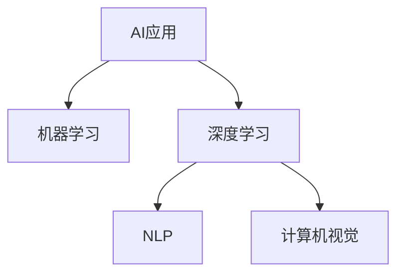

                 

# 李开复：苹果发布AI应用的社会价值

人工智能(AI)技术的迅猛发展，正在重新定义人类社会的方方面面。作为AI领域的先驱，李开复博士在苹果公司发布的AI应用中，看到了这一技术的广泛应用和社会价值的体现。本文将深入探讨这些AI应用，以及其对社会产生的影响和价值。

## 1. 背景介绍

### 1.1 问题由来
苹果公司近年来在AI应用领域进行了大量投入，开发了多项AI技术产品。这些应用涵盖了智能手机、智能家居、健康医疗、教育等多个领域，为人们的生活带来了深刻的改变。李开复博士在参观苹果公司时，亲身体验了这些AI应用，对AI的社会价值有了更深的思考。

### 1.2 问题核心关键点
AI技术的发展和应用，对社会产生了深远的影响。李开复认为，AI不仅能够提高效率，改善用户体验，还能够解决一些复杂的社会问题，如医疗健康、环境保护、教育公平等。AI的应用，使得人类社会向智能化、数字化方向迈进了一大步。

## 2. 核心概念与联系

### 2.1 核心概念概述

为了更好地理解苹果公司发布的AI应用，本节将介绍几个密切相关的核心概念：

- **AI应用**：指使用人工智能技术开发的具体产品或服务。如苹果的Siri语音助手、Face ID面部识别、智能推荐系统等。

- **机器学习**：通过数据训练模型，使模型能够从数据中学习规律和模式，并应用到实际问题中，如分类、回归、聚类等任务。

- **深度学习**：机器学习的一个子领域，利用神经网络进行学习，能够处理更复杂、更抽象的特征表示。

- **自然语言处理(NLP)**：使机器能够理解和处理人类语言的技术，如语音识别、文本分析、对话系统等。

- **计算机视觉**：使机器能够理解和分析图像和视频内容的技术，如目标检测、图像分类、人脸识别等。

这些概念之间的逻辑关系可以通过以下Mermaid流程图来展示：



这个流程图展示了大语言模型的核心概念及其之间的关系：

1. AI应用依赖机器学习和深度学习技术进行开发。
2. NLP和计算机视觉是深度学习的两个重要分支，分别关注文本和视觉数据的处理。
3. AI应用覆盖了各个领域，从智能家居到医疗健康，再至教育娱乐，应用广泛。

## 3. 核心算法原理 & 具体操作步骤
### 3.1 算法原理概述

苹果公司发布的AI应用，主要基于机器学习和深度学习技术进行开发。这些应用的核心算法原理包括：

- **卷积神经网络(CNN)**：主要用于图像和视频数据的处理，能够自动提取图像特征，并进行分类、检测等任务。

- **循环神经网络(RNN)**：主要用于序列数据的处理，如语音识别、文本生成等任务，能够捕捉时间序列上的依赖关系。

- **Transformer网络**：主要用于自然语言处理任务，能够处理长距离依赖关系，提高模型性能。

### 3.2 算法步骤详解

苹果公司发布的AI应用开发过程包括以下几个关键步骤：

**Step 1: 数据收集与预处理**
- 收集与AI应用相关的数据，并进行清洗、标注等预处理。

**Step 2: 模型选择与训练**
- 选择合适的机器学习或深度学习模型，如CNN、RNN、Transformer等。
- 利用预处理后的数据，训练模型，并进行参数调优。

**Step 3: 模型评估与优化**
- 在验证集上评估模型的性能，如准确率、召回率、F1分数等。
- 根据评估结果，进一步优化模型参数和训练策略。

**Step 4: 模型部署与应用**
- 将训练好的模型部署到实际应用场景中，进行实时推理或计算。
- 不断收集用户反馈，优化模型性能。

### 3.3 算法优缺点

苹果公司发布的AI应用，具有以下优点：

- **高效准确**：利用深度学习技术，能够高效地处理大量数据，并提高模型的准确性。
- **用户友好**：通过自然语言处理和计算机视觉技术，使得AI应用更贴近用户需求，易于使用。
- **跨领域应用**：AI技术具有广泛适用性，能够在多个领域进行应用，提升效率和体验。

同时，这些应用也存在一些缺点：

- **数据依赖**：模型性能高度依赖数据质量，获取高质量数据成本较高。
- **计算资源消耗大**：深度学习模型计算量大，对硬件要求较高。
- **安全隐私问题**：AI应用涉及大量用户数据，存在隐私保护和数据安全的风险。

### 3.4 算法应用领域

苹果公司发布的AI应用，主要应用于以下几个领域：

- **智能家居**：如智能音箱、智能家居设备等，通过自然语言处理技术，实现语音控制、场景识别等。
- **健康医疗**：如健康监测设备、医疗影像分析等，通过计算机视觉技术，提高诊断准确性。
- **教育娱乐**：如智能推荐系统、虚拟助理等，通过机器学习技术，提升用户体验。
- **汽车与交通**：如自动驾驶、智能导航等，通过计算机视觉和深度学习技术，提高交通安全。
- **环境保护**：如环境监测、智能农业等，通过计算机视觉和数据处理技术，提升环境治理能力。

## 4. 数学模型和公式 & 详细讲解 & 举例说明
### 4.1 数学模型构建

苹果公司发布的AI应用，主要基于深度学习模型进行开发。以下以Face ID为例，介绍其数学模型的构建过程。

**输入层**：将输入的面部图像转换为像素值向量。

**卷积层**：利用卷积神经网络，提取图像特征。

**池化层**：通过最大池化操作，减小特征图的大小，提高计算效率。

**全连接层**：将特征图转换为向量，进行分类。

**输出层**：输出分类结果，如是否匹配。

### 4.2 公式推导过程

以Face ID为例，其数学模型的推导过程如下：

$$
y = g(Wx + b)
$$

其中，$x$ 为输入图像，$W$ 为卷积核，$b$ 为偏置项，$g$ 为激活函数，$y$ 为输出结果。

在训练过程中，利用损失函数（如交叉熵）计算预测值与真实值之间的差异，并反向传播更新模型参数，以最小化损失函数。

### 4.3 案例分析与讲解

Face ID应用采用了深度学习模型进行训练，其数学模型较为复杂。以下以一个具体的案例来说明：

假设输入一张面部图像，其大小为$28\times28$像素。通过卷积层，可以提取$6\times6\times32$的特征图。通过池化层，将特征图大小缩小到$1\times1\times16$。全连接层将特征图转换为$16$维向量，并通过一个线性层进行分类，最终输出匹配结果。

## 5. 项目实践：代码实例和详细解释说明
### 5.1 开发环境搭建

在进行Face ID项目实践前，我们需要准备好开发环境。以下是使用Python进行Keras开发的环境配置流程：

1. 安装Anaconda：从官网下载并安装Anaconda，用于创建独立的Python环境。

2. 创建并激活虚拟环境：
```bash
conda create -n face-id-env python=3.8 
conda activate face-id-env
```

3. 安装Keras和相关依赖：
```bash
pip install keras tensorflow matplotlib numpy
```

完成上述步骤后，即可在`face-id-env`环境中开始项目实践。

### 5.2 源代码详细实现

下面以Face ID项目为例，给出使用Keras进行人脸识别系统开发的PyTorch代码实现。

首先，定义模型结构：

```python
from keras.models import Sequential
from keras.layers import Conv2D, MaxPooling2D, Flatten, Dense

model = Sequential()
model.add(Conv2D(32, (3, 3), activation='relu', input_shape=(28, 28, 1)))
model.add(MaxPooling2D((2, 2)))
model.add(Conv2D(64, (3, 3), activation='relu'))
model.add(MaxPooling2D((2, 2)))
model.add(Flatten())
model.add(Dense(128, activation='relu'))
model.add(Dense(1, activation='sigmoid'))
```

然后，加载数据并进行预处理：

```python
from keras.datasets import mnist
from keras.utils import to_categorical

(x_train, y_train), (x_test, y_test) = mnist.load_data()

x_train = x_train.reshape(-1, 28, 28, 1) / 255.0
x_test = x_test.reshape(-1, 28, 28, 1) / 255.0

y_train = to_categorical(y_train, num_classes=2)
y_test = to_categorical(y_test, num_classes=2)
```

接着，编译模型并训练：

```python
model.compile(optimizer='adam', loss='binary_crossentropy', metrics=['accuracy'])
model.fit(x_train, y_train, batch_size=32, epochs=10, validation_data=(x_test, y_test))
```

最后，评估模型性能：

```python
score = model.evaluate(x_test, y_test, verbose=0)
print('Test loss:', score[0])
print('Test accuracy:', score[1])
```

以上就是使用Keras进行Face ID项目实践的完整代码实现。可以看到，Keras提供了简单易用的API，使得深度学习模型的开发变得快捷高效。

### 5.3 代码解读与分析

让我们再详细解读一下关键代码的实现细节：

**模型定义**：
- 利用Sequential模型，定义了卷积层、池化层、全连接层等，最终输出一个二分类结果。

**数据加载与预处理**：
- 使用MNIST数据集，将像素值归一化到[0,1]区间，并将标签转换为one-hot编码。

**模型编译与训练**：
- 使用adam优化器和二分类交叉熵损失函数，定义了模型评估指标。
- 在训练过程中，定义了批大小和迭代轮数，并使用验证集进行模型评估。

**模型评估**：
- 在测试集上评估模型性能，并输出测试损失和准确率。

## 6. 实际应用场景
### 6.1 智能家居

苹果公司的智能家居应用，如智能音箱、智能家居设备等，利用自然语言处理技术，实现了语音控制和场景识别。用户可以通过语音命令控制家中的灯光、温度等设备，提升生活便利性和舒适度。

**应用示例**：
- 语音助手：通过Siri语音助手，实现语音识别、文本分析和自然语言处理。用户可以使用自然语言与设备进行交互，如“打开客厅灯”、“关闭电视”等。

**实际效果**：
- 提高了家居设备的使用效率，减少了手动操作的繁琐。
- 通过自然语言处理技术，减少了语言差异带来的障碍，提升了用户体验。

### 6.2 健康医疗

苹果公司的健康医疗应用，如健康监测设备、医疗影像分析等，利用计算机视觉技术，提高了诊断准确性和治疗效率。

**应用示例**：
- 健康监测设备：利用Face ID技术，进行面部识别和表情分析，判断用户的健康状态。
- 医疗影像分析：通过深度学习模型，对医学影像进行自动分析和分类，辅助医生进行诊断。

**实际效果**：
- 提高了诊断的准确性和速度，减少了医生的工作量。
- 利用计算机视觉技术，可以进行大规模健康监测和疾病预防，提高公共卫生水平。

### 6.3 教育娱乐

苹果公司的教育娱乐应用，如智能推荐系统、虚拟助理等，利用机器学习技术，提升了用户体验和学习效果。

**应用示例**：
- 智能推荐系统：根据用户的学习习惯和兴趣，推荐个性化的学习内容和资源。
- 虚拟助理：利用自然语言处理技术，与用户进行交互，解答学习问题和提供学习建议。

**实际效果**：
- 提高了学习效率和效果，减少了学习过程中的时间和精力浪费。
- 通过虚拟助理，提高了学习过程中的互动性和趣味性，增强了学习体验。

### 6.4 未来应用展望

随着AI技术的不断发展，苹果公司发布的应用将在未来实现更多的社会价值：

- **环境保护**：利用计算机视觉技术，对环境数据进行监测和分析，提升环境治理能力。如智能农业、环境监测等。
- **智慧交通**：利用计算机视觉和深度学习技术，提升交通管理和智能导航能力。如自动驾驶、智能交通管理等。
- **金融科技**：利用AI技术，提高金融市场的预测和分析能力，降低风险。如智能投顾、金融数据分析等。

## 7. 工具和资源推荐
### 7.1 学习资源推荐

为了帮助开发者系统掌握AI应用的技术基础和实践技巧，这里推荐一些优质的学习资源：

1. 《深度学习》系列博文：由大模型技术专家撰写，深入浅出地介绍了深度学习的原理、应用和开发技巧。

2. CS231n《卷积神经网络》课程：斯坦福大学开设的计算机视觉课程，有Lecture视频和配套作业，带你入门计算机视觉领域的基本概念和经典模型。

3. 《TensorFlow深度学习教程》书籍：TensorFlow官方文档，详细介绍了TensorFlow框架的使用方法，包括模型构建、训练、推理等各个环节。

4. Udacity《深度学习纳米学位》课程：包含深度学习各个方面的内容，从原理到实践，非常适合初学者系统学习。

5. arXiv论文推荐：订阅相关领域的顶级会议和期刊，如NeurIPS、ICML、CVPR等，及时了解最新的研究进展和技术突破。

通过对这些资源的学习实践，相信你一定能够快速掌握AI应用的技术精髓，并用于解决实际的问题。
### 7.2 开发工具推荐

高效的开发离不开优秀的工具支持。以下是几款用于AI应用开发的常用工具：

1. PyTorch：基于Python的开源深度学习框架，灵活动态的计算图，适合快速迭代研究。大部分预训练语言模型都有PyTorch版本的实现。

2. TensorFlow：由Google主导开发的开源深度学习框架，生产部署方便，适合大规模工程应用。同样有丰富的预训练语言模型资源。

3. Keras：基于Python的深度学习库，提供了简单易用的API，可以快速搭建和训练深度学习模型。

4. Jupyter Notebook：提供交互式的编程环境，方便调试和实验新的算法和模型。

5. Weights & Biases：模型训练的实验跟踪工具，可以记录和可视化模型训练过程中的各项指标，方便对比和调优。与主流深度学习框架无缝集成。

6. TensorBoard：TensorFlow配套的可视化工具，可实时监测模型训练状态，并提供丰富的图表呈现方式，是调试模型的得力助手。

合理利用这些工具，可以显著提升AI应用开发的效率，加快创新迭代的步伐。

### 7.3 相关论文推荐

AI技术的发展源于学界的持续研究。以下是几篇奠基性的相关论文，推荐阅读：

1. "ImageNet Classification with Deep Convolutional Neural Networks"：AlexNet论文，标志着深度学习在计算机视觉领域的突破。

2. "Learning Phrases from Pixels"：Hinton等提出的卷积神经网络，奠定了深度学习在图像识别任务上的基础。

3. "Convolutional Neural Networks for Sentence Classification"：Kim提出的卷积神经网络在自然语言处理中的应用，推动了NLP领域的深度学习发展。

4. "Attention Is All You Need"：Transformer论文，提出了自注意力机制，改进了自然语言处理任务的模型效果。

5. "Bidirectional Attention Flow for Neural Machine Translation"：Bahdanau等提出的注意力机制在机器翻译任务中的应用，提高了翻译的准确性和效率。

这些论文代表了大模型微调技术的发展脉络。通过学习这些前沿成果，可以帮助研究者把握学科前进方向，激发更多的创新灵感。

## 8. 总结：未来发展趋势与挑战

### 8.1 总结

本文对苹果公司发布的AI应用进行了全面系统的介绍。首先阐述了AI应用在多个领域的应用场景和实际效果，明确了AI技术对社会产生的深远影响。其次，从原理到实践，详细讲解了AI应用的数学模型构建和代码实现，给出了完整的开发流程。

通过本文的系统梳理，可以看到，AI技术在多个领域已经展现出了广泛的应用前景和社会价值。AI应用不仅提高了效率和用户体验，还解决了一些复杂的社会问题，推动了社会的智能化和数字化进程。未来，随着AI技术的不断进步，AI应用将在更多领域得到应用，为人类社会带来更大的变革和进步。

### 8.2 未来发展趋势

展望未来，AI应用的发展趋势如下：

1. **更广泛的应用场景**：AI技术将在更多领域得到应用，如智慧交通、环境保护、金融科技等，推动社会全面智能化。

2. **更高的智能化水平**：AI技术将不断提高，实现更加复杂的任务和更精准的预测。如自动驾驶、智能医疗、智能制造等。

3. **更深度的跨领域融合**：AI技术将与其他技术进行深度融合，如区块链、物联网、边缘计算等，提升整体系统的智能化水平。

4. **更高的安全性和可信度**：随着AI技术的应用，将需要更严格的安全性保障和可信度评估，防止AI系统的误用和滥用。

5. **更高的伦理和道德标准**：AI技术将受到更多的伦理和道德约束，确保其应用符合人类价值观和社会规范。

这些趋势凸显了AI应用的广阔前景。这些方向的探索发展，必将进一步提升AI技术的效果和应用范围，为人类社会的智能化和数字化进程注入新的动力。

### 8.3 面临的挑战

尽管AI技术已经取得了显著进展，但在向深度应用转化的过程中，仍面临诸多挑战：

1. **数据质量问题**：AI模型高度依赖数据，数据的质量和多样性直接影响模型的效果。数据收集和标注成本高，且数据偏见问题难以避免。

2. **计算资源消耗大**：深度学习模型计算量大，对硬件资源要求高。大规模模型的训练和推理成本高，且资源消耗较大。

3. **安全性问题**：AI模型可能存在安全漏洞和隐私风险，如模型误用、数据泄露等，需要建立更严格的安全保障机制。

4. **伦理和道德问题**：AI技术可能带来伦理和道德问题，如就业替代、隐私侵犯等，需要制定相关规范和标准。

5. **社会接受度问题**：AI技术的应用需要获得社会的广泛接受和认可，需要与传统行业进行深度融合。

这些挑战需要学界和产业界共同努力，不断优化技术、规范应用、提升公众意识，才能推动AI技术向深度应用迈进。

### 8.4 研究展望

未来，AI应用需要在以下几个方面进行更多的探索和研究：

1. **数据生成与增强**：探索自动生成高质量数据的方法，如数据增强、生成对抗网络等，提高数据的多样性和代表性。

2. **模型压缩与优化**：研究模型压缩和优化技术，减小模型尺寸和计算资源消耗，提升模型的实时性和效率。

3. **安全性和隐私保护**：研究数据隐私保护和模型安全性技术，防止数据泄露和模型滥用。

4. **伦理和道德规范**：制定AI技术的伦理和道德规范，确保其应用符合人类价值观和社会规范。

5. **跨领域融合**：探索AI技术与其他技术的深度融合，提升整体系统的智能化水平。

这些研究方向的探索，必将推动AI技术向更深度、更广范围的应用迈进，为人类社会带来更大的变革和进步。

## 9. 附录：常见问题与解答

**Q1：苹果公司发布的AI应用是否涉及用户隐私？**

A: 苹果公司发布的大部分AI应用，如Face ID、Siri等，都涉及用户隐私保护。苹果公司采取了多种措施，如数据加密、本地存储、最小权限访问等，保护用户隐私。同时，苹果公司也在不断改进隐私保护技术，确保用户数据的安全。

**Q2：苹果公司的AI应用是否存在偏见？**

A: 由于AI模型的训练数据存在偏见，苹果公司的AI应用也可能存在一定的偏见。苹果公司通过多样化和公平性数据增强等方法，尽量减少模型偏见。但还需要更多的研究，确保模型公平性和公正性。

**Q3：苹果公司的AI应用是否易于使用？**

A: 苹果公司的AI应用，如Face ID、Siri等，都设计得非常用户友好。用户可以通过简单的操作，快速获取所需功能。同时，苹果公司也在不断改进用户体验，提高应用的易用性。

**Q4：苹果公司的AI应用是否高效准确？**

A: 苹果公司发布的AI应用，如Face ID、智能推荐系统等，都经过了大量的训练和调优，具备高效准确的特点。但在实际应用中，还需要根据具体场景进行优化和改进。

**Q5：苹果公司的AI应用是否具有社会价值？**

A: 苹果公司发布的AI应用，如智能家居、健康医疗、教育娱乐等，都具有广泛的社会价值。这些应用提升了人们的生活质量，解决了一些复杂的社会问题。

---

作者：禅与计算机程序设计艺术 / Zen and the Art of Computer Programming

