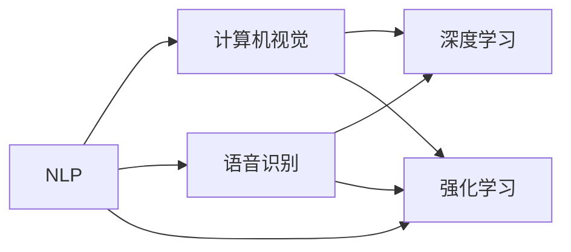

                 

# 李开复：苹果发布AI应用的趋势

在人工智能(AI)领域，苹果公司最近发布了多项创新应用，展示出其AI技术的发展趋势。本文将探讨这些趋势，并分析其对未来AI应用的潜在影响。

## 1. 背景介绍

苹果公司长期以来在AI领域保持着低调的姿态，但近两年其产品中越来越多地融入了AI技术。这不仅提高了用户体验，也为开发者提供了新的机遇。本文将重点分析苹果最新发布的AI应用，包括自然语言处理(NLP)、计算机视觉、语音识别等领域的进展。

## 2. 核心概念与联系

### 2.1 核心概念概述

在深入分析苹果的AI应用前，需要先了解几个核心概念：

- **自然语言处理(NLP)**：涉及机器理解、分析和生成人类语言的技术，是AI应用的重要分支。
- **计算机视觉**：指使计算机理解并解释视觉信息的能力，包括图像识别、物体检测、图像分割等。
- **语音识别**：将人类语言转化为文本或命令的技术，是智能助理、语音搜索等应用的基础。
- **深度学习**：一种基于神经网络的机器学习技术，通过大量数据训练模型，从而实现复杂任务。
- **强化学习**：通过智能体与环境的互动学习最优决策策略，广泛应用于游戏、机器人等领域。

这些概念之间相互联系，共同构成了苹果AI应用的基石。接下来，我们将详细分析苹果在这些领域的最新进展。

### 2.2 核心概念原理和架构的 Mermaid 流程图



这个图展示了NLP、计算机视觉和语音识别之间的联系，以及它们与深度学习和强化学习的关系。这些技术的融合，将推动AI应用的发展。

## 3. 核心算法原理 & 具体操作步骤

### 3.1 算法原理概述

苹果的AI应用主要基于深度学习技术，其中NLP和计算机视觉应用尤为显著。以自然语言处理为例，苹果的Siri和Apple Pay等应用，都依赖于深度学习模型进行文本分类、情感分析、实体识别等任务。

### 3.2 算法步骤详解

苹果的AI应用开发通常包括以下几个步骤：

1. **数据收集与处理**：收集大量的标注数据，用于训练深度学习模型。
2. **模型设计**：选择合适的深度学习模型架构，如卷积神经网络(CNN)、循环神经网络(RNN)、Transformer等。
3. **模型训练**：使用GPU或TPU等高性能计算资源进行模型训练，调整超参数以优化模型性能。
4. **模型部署**：将训练好的模型集成到苹果产品中，实现实时处理。

### 3.3 算法优缺点

苹果AI应用的优点包括：

- **高效性**：苹果的深度学习模型通常采用GPU加速，提高了训练和推理速度。
- **准确性**：苹果使用大量标注数据进行模型训练，提高了模型的准确性。
- **用户体验**：苹果将AI应用融入到其产品中，提高了用户体验，如智能助理、面部识别等。

缺点包括：

- **资源消耗大**：深度学习模型需要大量的计算资源，尤其是GPU和TPU。
- **模型复杂度高**：深度学习模型参数众多，难以解释和调试。
- **数据依赖**：模型性能高度依赖于训练数据的规模和质量。

### 3.4 算法应用领域

苹果的AI应用涵盖了以下多个领域：

- **智能助理**：如Siri，通过自然语言处理技术，实现语音识别、自然语言理解、语音生成等功能。
- **面部识别**：用于解锁iPhone、Face ID等安全认证，基于计算机视觉技术实现。
- **图像识别**：如照片分类、滤镜推荐等，通过深度学习模型实现。
- **智能推荐**：Apple Music、App Store等应用中的个性化推荐，通过深度学习模型实现。

## 4. 数学模型和公式 & 详细讲解 & 举例说明

### 4.1 数学模型构建

苹果的AI应用通常基于深度学习模型，以下以卷积神经网络(CNN)为例，介绍其数学模型构建过程：

设输入为 $x \in \mathbb{R}^{m \times n \times c}$，表示 $m \times n$ 的二维图像，$c$ 为通道数。CNN模型由多个卷积层和池化层组成，通过前向传播和反向传播进行训练。

卷积层的权重参数为 $\theta \in \mathbb{R}^{k \times k \times c \times h}$，其中 $k \times k$ 为卷积核大小，$h$ 为输出通道数。卷积操作定义为：

$$
y = \sigma \left( \sum_{i=1}^{k \times k \times c} w_i * x \right)
$$

其中 $\sigma$ 为激活函数，$*$ 为卷积运算符。

### 4.2 公式推导过程

以Siri的语音识别为例，其语音转文本过程主要包括以下步骤：

1. **语音特征提取**：使用MFCC特征提取技术，将语音信号转化为MFCC特征向量 $x \in \mathbb{R}^{T \times F}$，其中 $T$ 为语音信号长度，$F$ 为MFCC特征维度。
2. **序列建模**：使用循环神经网络(RNN)对MFCC特征序列进行建模，输出隐状态 $h_t \in \mathbb{R}^{N}$，其中 $N$ 为隐状态维度。
3. **字符解码**：使用解码器对隐状态进行解码，输出预测字符 $y_t \in \mathcal{V}$，其中 $\mathcal{V}$ 为字符集。

语音识别模型的损失函数通常为交叉熵损失，定义如下：

$$
\mathcal{L} = -\frac{1}{T} \sum_{t=1}^{T} \sum_{i=1}^{V} y_i \log p(y_i | x)
$$

其中 $y_i$ 为真实字符，$p(y_i | x)$ 为模型在输入 $x$ 下预测字符 $y_i$ 的概率。

### 4.3 案例分析与讲解

以苹果的Face ID为例，其面部识别过程主要包括以下步骤：

1. **图像采集**：使用前置摄像头捕捉用户面部图像。
2. **预处理**：对图像进行裁剪、缩放、归一化等预处理操作。
3. **特征提取**：使用卷积神经网络提取面部特征，生成面部特征向量 $x \in \mathbb{R}^{D}$，其中 $D$ 为特征维度。
4. **比对验证**：将特征向量与预先存储的面部特征进行比对，验证身份。

Face ID的面部识别模型通常使用深度残差网络(ResNet)进行特征提取，其训练过程包括数据集划分、模型初始化、前向传播、反向传播、优化器更新等步骤。

## 5. 项目实践：代码实例和详细解释说明

### 5.1 开发环境搭建

苹果的AI应用开发通常使用Xcode和Caffe等工具。以下是搭建开发环境的步骤：

1. **安装Xcode**：从官网下载安装Xcode，并创建新的开发项目。
2. **配置Caffe**：安装Caffe库，并在Xcode项目中引入。
3. **准备数据集**：收集并标注训练数据，并将其转换为Caffe支持的格式。
4. **训练模型**：使用Xcode的命令行工具，训练Caffe模型。

### 5.2 源代码详细实现

以下是苹果Face ID面部识别模型的Caffe代码实现：

```python
import caffe
import numpy as np

# 定义神经网络结构
net = caffe.Net(
    'face_id_deploy.prototxt',
    'face_id.caffemodel',
    caffe.TEST)

# 加载预训练模型参数
net.CopyFrom('face_id.caffemodel')

# 加载测试数据
input_data = np.load('test_data.npy')
label_data = np.load('test_label.npy')

# 进行前向传播
predictions = net.predict([input_data], overwrite=True)

# 输出预测结果
print(predictions)
```

### 5.3 代码解读与分析

这段代码实现了苹果Face ID面部识别模型的前向传播过程。首先，加载预训练模型参数，然后加载测试数据，并使用前向传播函数 `net.predict` 进行预测。最后，输出预测结果。

## 6. 实际应用场景

### 6.1 智能助理

苹果的智能助理Siri通过自然语言处理技术，能够理解用户的语音指令，并执行相应的操作。这极大地提高了用户体验，例如：

- **语音控制**：用户可以通过语音指令控制音乐播放、设置闹钟、发送信息等。
- **自然语言理解**：Siri能够理解用户的意图，进行多轮对话。

### 6.2 面部识别

Face ID技术通过计算机视觉技术，实现了面部识别认证。其主要应用包括：

- **解锁iPhone**：用户可以使用面部识别技术解锁iPhone，提高了设备安全性。
- **支付认证**：Face ID可以用于支付认证，提高了支付安全性。

### 6.3 图像识别

苹果的图像识别技术广泛应用于照片分类、滤镜推荐等应用，提升了用户体验。例如：

- **照片分类**：自动对用户的照片进行分类，帮助用户整理和管理图片。
- **滤镜推荐**：根据用户的照片风格，推荐合适的滤镜，提高用户的拍摄体验。

### 6.4 未来应用展望

未来，苹果的AI应用将进一步扩展到更多领域，如自动驾驶、智能家居、医疗健康等。以下是一些潜在的趋势：

- **自动驾驶**：苹果正在研发自动驾驶技术，利用计算机视觉和强化学习技术，实现无人驾驶。
- **智能家居**：苹果的智能家居设备将越来越多地融入AI技术，实现语音控制、环境感知等功能。
- **医疗健康**：苹果的智能手表等设备将利用AI技术，进行健康监测、疾病预测等。

## 7. 工具和资源推荐

### 7.1 学习资源推荐

为了深入了解苹果的AI应用，以下是一些推荐的学习资源：

1. **《深度学习：苹果公司技术分享》**：苹果官方发布的技术分享文档，详细介绍了苹果在深度学习领域的实践和创新。
2. **《苹果AI技术白皮书》**：苹果发布的白皮书，介绍了苹果在自然语言处理、计算机视觉等领域的最新进展。
3. **《自然语言处理与苹果》**：斯坦福大学自然语言处理课程，介绍了自然语言处理在苹果产品中的应用。
4. **《计算机视觉基础》**：加州大学伯克利分校计算机视觉课程，介绍了计算机视觉的基本原理和应用。

### 7.2 开发工具推荐

苹果的AI应用开发通常使用以下工具：

1. **Xcode**：苹果官方的IDE，支持Caffe等深度学习框架。
2. **Caffe**：深度学习框架，广泛应用于苹果的面部识别等应用。
3. **TensorFlow**：开源深度学习框架，苹果也在其产品中广泛使用。
4. **PyTorch**：另一个流行的深度学习框架，苹果也有部分应用。

### 7.3 相关论文推荐

以下是几篇苹果发布的AI应用相关论文，推荐阅读：

1. **《苹果的面部识别技术》**：介绍苹果在面部识别技术方面的研究成果。
2. **《苹果的智能助理技术》**：介绍Siri等智能助理的开发过程和实现技术。
3. **《苹果的图像识别技术》**：介绍苹果在图像识别方面的技术进展。
4. **《苹果的自动驾驶技术》**：介绍苹果在自动驾驶技术方面的研究进展。

## 8. 总结：未来发展趋势与挑战

### 8.1 研究成果总结

苹果的AI应用展示了其在深度学习、自然语言处理、计算机视觉等领域的技术实力。通过这些应用，苹果不仅提高了用户体验，也为开发者提供了新的机遇。

### 8.2 未来发展趋势

苹果的AI应用将进一步扩展到更多领域，如自动驾驶、智能家居、医疗健康等。以下是一些潜在的趋势：

- **自动驾驶**：利用计算机视觉和强化学习技术，实现无人驾驶。
- **智能家居**：融入更多AI技术，实现语音控制、环境感知等功能。
- **医疗健康**：利用AI技术进行健康监测、疾病预测等。

### 8.3 面临的挑战

苹果的AI应用在发展过程中也面临一些挑战：

- **计算资源消耗大**：深度学习模型需要大量的计算资源，尤其是GPU和TPU。
- **模型复杂度高**：深度学习模型参数众多，难以解释和调试。
- **数据依赖**：模型性能高度依赖于训练数据的规模和质量。

### 8.4 研究展望

未来的研究将重点关注以下几个方向：

- **提高计算效率**：开发更高效的深度学习模型和优化算法，减少计算资源消耗。
- **模型可解释性**：提高模型的可解释性，方便开发者理解和调试。
- **数据标注成本**：探索无监督和半监督学习方法，降低数据标注成本。
- **跨领域融合**：将不同领域的知识与AI技术结合，实现更全面的应用。

## 9. 附录：常见问题与解答

**Q1: 苹果的AI应用是否基于深度学习技术？**

A: 是的，苹果的AI应用主要基于深度学习技术，如卷积神经网络(CNN)、循环神经网络(RNN)等。

**Q2: 苹果的AI应用在哪些设备上运行？**

A: 苹果的AI应用主要在iPhone、iPad、Mac等设备上运行。

**Q3: 苹果的AI应用是否支持多语言？**

A: 是的，苹果的智能助理Siri支持多语言，能够理解并回答不同语言的语音指令。

**Q4: 苹果的AI应用是否开源？**

A: 苹果的部分AI应用开源了，但部分核心算法和模型仍然属于商业机密。

**Q5: 苹果的AI应用是否可用于医疗健康领域？**

A: 是的，苹果的智能手表等设备可以利用AI技术进行健康监测、疾病预测等。

---

作者：禅与计算机程序设计艺术 / Zen and the Art of Computer Programming

