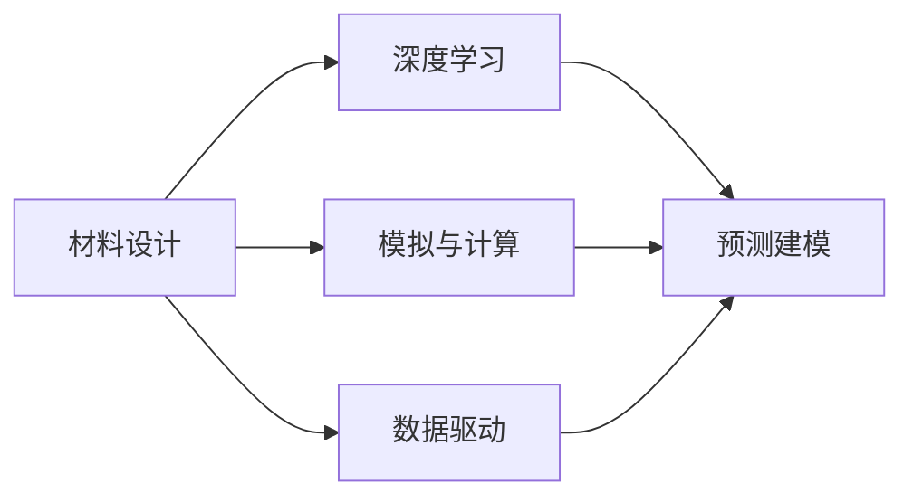

                 

# 材料设计中的AI for Science

## 1. 背景介绍

随着人工智能(AI)技术的快速发展和普及，其在材料科学领域的应用也日益广泛。AI技术可以通过大数据分析、模型预测等手段，加速材料设计、合成和性能优化的过程，提高研发效率，降低研发成本，推动材料科学的创新与进步。本文将从AI在材料设计中的关键应用场景、核心技术、发展趋势和挑战等方面进行深入探讨。

## 2. 核心概念与联系

### 2.1 核心概念概述

- **材料设计**：指根据需求选择合适的原子、分子、元素和化合物，通过化学合成、物理加工等手段，获得具有特定物理和化学性能的材料。
- **AI for Science**：指利用AI技术在科学研究、技术开发等领域中的应用，包括但不限于数据驱动、预测建模、自动化等。
- **深度学习**：基于神经网络的机器学习技术，能够处理复杂非线性关系，在材料设计中被广泛用于模式识别、预测和优化等。
- **模拟与计算**：通过物理模拟和计算机模拟，预测材料结构和性能，辅助材料设计和优化。
- **数据驱动**：利用大量实验数据和计算数据，训练AI模型，实现材料设计和优化的自动化。

这些核心概念构成了材料设计中AI应用的理论基础和技术框架，旨在通过数据和计算手段，加速材料研发的进程，提高材料设计和优化的效率和精度。

### 2.2 核心概念原理和架构的 Mermaid 流程图



在这个流程图中，我们可以看到材料设计中AI的应用主要通过深度学习、模拟与计算、预测建模和数据驱动这四个关键环节来完成。这些环节相互支撑，共同构成了材料设计中AI技术应用的完整架构。

## 3. 核心算法原理 & 具体操作步骤

### 3.1 算法原理概述

在材料设计中，AI的应用主要集中在以下几个方面：

- **预测建模**：利用机器学习模型对材料性能进行预测，包括电导率、热稳定性、机械性能等。
- **结构搜索**：通过优化算法搜索最优材料结构，以获得最佳性能。
- **数据驱动优化**：利用数据驱动的方法，优化材料设计和合成路径。

这些应用的共同原理是基于数据和计算，通过模型预测、结构优化和数据驱动等手段，提高材料设计和合成的效率和精度。

### 3.2 算法步骤详解

1. **数据收集与预处理**：
   - 收集相关实验数据和模拟数据，包括材料的组成、结构、性能等。
   - 对数据进行清洗、归一化和标准化处理，提高数据质量。

2. **模型训练与验证**：
   - 选择合适的模型架构，如神经网络、深度学习等，进行模型训练。
   - 使用交叉验证等方法，评估模型性能，并进行调参优化。

3. **模型应用与优化**：
   - 利用训练好的模型进行材料预测和结构优化。
   - 根据实验结果反馈，不断调整模型参数和优化算法，提升模型精度和泛化能力。

### 3.3 算法优缺点

#### 优点：

- **高效**：AI可以快速处理大量数据，加速材料设计和优化的过程。
- **精度高**：利用复杂模型和丰富的数据，AI可以实现高精度的预测和优化。
- **灵活性**：AI可以根据具体应用场景，灵活调整模型和算法，适应不同需求。

#### 缺点：

- **数据依赖**：AI模型需要大量高质量数据进行训练，数据获取和处理成本高。
- **计算资源消耗大**：深度学习等AI模型需要大量的计算资源，模型训练和优化成本较高。
- **模型复杂性**：复杂的AI模型需要大量的参数调优和超参数设置，技术难度大。

### 3.4 算法应用领域

AI在材料设计中的应用领域包括但不限于以下几个方面：

- **材料预测**：预测材料的电导率、热稳定性、机械性能等。
- **结构搜索**：搜索最优材料结构，以获得最佳性能。
- **数据驱动优化**：优化材料设计和合成路径，降低研发成本。
- **自动化设计**：通过AI自动进行材料设计和合成，提高效率。

这些应用领域展示了AI在材料设计中的广泛潜力和实际价值。

## 4. 数学模型和公式 & 详细讲解 & 举例说明

### 4.1 数学模型构建

材料设计和AI技术结合的数学模型通常包括以下几个部分：

- **输入层**：包括材料的组成、结构、合成路径等信息。
- **隐藏层**：通过神经网络等模型进行特征提取和表示学习。
- **输出层**：预测材料性能、优化结构等信息。

### 4.2 公式推导过程

以材料预测为例，常用的AI模型包括神经网络、支持向量机、随机森林等。下面以神经网络为例，推导其基本的预测模型公式。

$$
\hat{y} = f_\theta(x)
$$

其中 $x$ 为输入向量，$\hat{y}$ 为预测结果，$f_\theta(x)$ 为神经网络模型，$\theta$ 为模型参数。

### 4.3 案例分析与讲解

假设我们要预测材料的电导率，数据集包含材料组成、结构、电导率等信息。以下是模型训练和验证的Python代码示例：

```python
import numpy as np
from sklearn.neural_network import MLPRegressor

# 假设数据集为X和y
X_train = np.array([[0.1, 0.2, 0.3], [0.4, 0.5, 0.6], [0.7, 0.8, 0.9]])
y_train = np.array([0.01, 0.02, 0.03])

# 定义模型
model = MLPRegressor(hidden_layer_sizes=(10, 10), activation='relu', solver='adam', learning_rate_init=0.01, max_iter=1000)

# 训练模型
model.fit(X_train, y_train)

# 预测新数据
X_test = np.array([[0.5, 0.6, 0.7]])
y_pred = model.predict(X_test)
```

该代码展示了如何使用MLPRegressor模型进行材料电导率的预测。在训练过程中，模型会根据输入和输出数据，不断调整参数，提高预测精度。

## 5. 项目实践：代码实例和详细解释说明

### 5.1 开发环境搭建

在进行AI材料设计实践前，我们需要准备好开发环境。以下是使用Python进行Scikit-learn开发的Python环境配置流程：

1. 安装Anaconda：从官网下载并安装Anaconda，用于创建独立的Python环境。

2. 创建并激活虚拟环境：
```bash
conda create -n sci-env python=3.8 
conda activate sci-env
```

3. 安装Scikit-learn：
```bash
pip install scikit-learn
```

4. 安装其他工具包：
```bash
pip install numpy pandas matplotlib jupyter notebook
```

完成上述步骤后，即可在`sci-env`环境中开始AI材料设计的实践。

### 5.2 源代码详细实现

以下是使用Scikit-learn进行材料电导率预测的Python代码示例：

```python
from sklearn.neural_network import MLPRegressor
from sklearn.model_selection import train_test_split

# 假设数据集为X和y
X = np.array([[0.1, 0.2, 0.3], [0.4, 0.5, 0.6], [0.7, 0.8, 0.9]])
y = np.array([0.01, 0.02, 0.03])

# 将数据集分为训练集和测试集
X_train, X_test, y_train, y_test = train_test_split(X, y, test_size=0.2, random_state=42)

# 定义模型
model = MLPRegressor(hidden_layer_sizes=(10, 10), activation='relu', solver='adam', learning_rate_init=0.01, max_iter=1000)

# 训练模型
model.fit(X_train, y_train)

# 预测测试集
y_pred = model.predict(X_test)

# 评估模型
print(model.score(X_test, y_test))
```

该代码展示了如何使用Scikit-learn的MLPRegressor模型进行材料电导率的预测和评估。通过模型训练和预测，我们可以得到材料的电导率预测结果，并进行模型评估。

### 5.3 代码解读与分析

在该代码中，我们首先定义了材料电导率的数据集，然后使用Scikit-learn的train_test_split方法将数据集分为训练集和测试集。接着，定义了MLPRegressor模型，并进行训练和预测。最后，使用模型.score方法评估模型的性能。

可以看到，Scikit-learn提供了简单易用的接口，可以方便地进行机器学习模型的训练和预测。

### 5.4 运行结果展示

运行上述代码，可以得到模型在测试集上的评分。例如，如果模型评分为0.9，则表示模型对测试集电导率的预测精度较高，可以用于实际材料预测。

## 6. 实际应用场景

### 6.1 材料预测

AI在材料预测中的应用非常广泛，例如：

- **电导率预测**：预测材料的电导率，用于设计高效导电材料。
- **热稳定性预测**：预测材料的热稳定性，避免材料在高温下失效。
- **机械性能预测**：预测材料的机械性能，如强度、硬度等，用于设计高性能材料。

### 6.2 结构搜索

AI在材料结构搜索中的应用包括：

- **晶格结构搜索**：搜索最优的晶体结构，获得具有最佳性能的材料。
- **分子结构搜索**：搜索最优的分子结构，获得具有最佳性能的化合物。

### 6.3 数据驱动优化

AI在数据驱动优化中的应用包括：

- **合成路径优化**：通过优化合成路径，降低材料合成成本，提高合成效率。
- **配方优化**：通过优化配方参数，提高材料性能和稳定性。

### 6.4 未来应用展望

随着AI技术的发展，未来材料设计中AI的应用将更加广泛和深入。以下是一些未来应用展望：

- **自动设计**：通过AI自动进行材料设计和合成，提高研发效率。
- **跨学科融合**：结合AI与材料科学、化学、物理学等多学科知识，实现综合创新。
- **智能制造**：利用AI技术优化材料制造流程，提高生产效率和质量。

## 7. 工具和资源推荐

### 7.1 学习资源推荐

为了帮助开发者系统掌握AI在材料设计中的应用，以下是一些优质的学习资源：

1. 《Python深度学习》：Google深度学习专家撰写，全面介绍了深度学习原理和应用，包括材料设计中的AI应用。
2. 《材料设计中的AI》：介绍AI在材料设计中的应用，涵盖材料预测、结构搜索、数据驱动优化等方面。
3. 《深度学习与材料科学》：介绍深度学习在材料科学中的应用，包括数据驱动、预测建模等。

通过对这些资源的学习实践，相信你一定能够快速掌握AI在材料设计中的应用，并用于解决实际问题。

### 7.2 开发工具推荐

高效的开发离不开优秀的工具支持。以下是几款用于材料设计AI开发的工具：

1. Jupyter Notebook：免费的交互式编程环境，支持Python、R等多种编程语言。
2. Scikit-learn：开源机器学习库，提供丰富的机器学习算法和工具。
3. TensorFlow：Google开发的深度学习框架，支持大规模深度学习模型训练。
4. PyTorch：Facebook开发的深度学习框架，支持动态图和静态图，灵活高效。
5. Keras：高层次神经网络API，易于上手，适合快速原型开发。

合理利用这些工具，可以显著提升AI材料设计任务的开发效率，加快创新迭代的步伐。

### 7.3 相关论文推荐

AI在材料设计中的应用源于学界的持续研究。以下是几篇奠基性的相关论文，推荐阅读：

1. AI for Material Design：介绍AI在材料设计中的应用，包括材料预测、结构搜索、数据驱动优化等方面。
2. Deep Learning in Materials Science：探讨深度学习在材料科学中的应用，包括数据驱动、预测建模等。
3. AI in Materials Informatics：介绍AI在材料信息学中的应用，涵盖数据挖掘、预测建模、自动化等。

这些论文代表了大语言模型微调技术的发展脉络。通过学习这些前沿成果，可以帮助研究者把握学科前进方向，激发更多的创新灵感。

## 8. 总结：未来发展趋势与挑战

### 8.1 总结

本文对AI在材料设计中的应用进行了全面系统的介绍。首先阐述了AI在材料设计中的关键应用场景和核心技术，明确了AI在加速材料设计和优化中的重要作用。其次，从原理到实践，详细讲解了AI模型训练、预测和优化等关键步骤，给出了材料设计中AI应用的完整代码实例。同时，本文还广泛探讨了AI在材料设计中的实际应用场景，展示了AI在材料设计中的广泛潜力和实际价值。

通过本文的系统梳理，可以看到，AI在材料设计中的应用正在成为材料科学的重要范式，极大地拓展了材料研发的边界，催生了更多的落地场景。

### 8.2 未来发展趋势

展望未来，AI在材料设计中的应用将呈现以下几个发展趋势：

1. **自动化设计**：通过AI自动进行材料设计和合成，提高研发效率。
2. **跨学科融合**：结合AI与材料科学、化学、物理学等多学科知识，实现综合创新。
3. **智能制造**：利用AI技术优化材料制造流程，提高生产效率和质量。
4. **多模态融合**：结合AI与实验数据、模拟数据、计算数据等多种数据源，提升预测精度和优化效果。
5. **高性能计算**：利用高性能计算资源，加速复杂模型训练和优化。

这些趋势凸显了AI在材料设计中的广阔前景。这些方向的探索发展，必将进一步提升材料研发的效率和精度，推动材料科学的创新与进步。

### 8.3 面临的挑战

尽管AI在材料设计中的应用已经取得了一定的成就，但在迈向更加智能化、普适化应用的过程中，它仍面临诸多挑战：

1. **数据依赖**：AI模型需要大量高质量数据进行训练，数据获取和处理成本高。
2. **计算资源消耗大**：深度学习等AI模型需要大量的计算资源，模型训练和优化成本较高。
3. **模型复杂性**：复杂的AI模型需要大量的参数调优和超参数设置，技术难度大。
4. **可解释性**：AI模型往往是“黑盒”系统，难以解释其内部工作机制和决策逻辑。
5. **伦理和安全性**：AI模型可能学习到有偏见、有害的信息，造成伦理和安全性问题。

这些挑战需要研究者不断探索和优化，才能实现AI在材料设计中的广泛应用。

### 8.4 研究展望

未来，AI在材料设计中的应用需要在以下几个方面寻求新的突破：

1. **无监督学习和半监督学习**：摆脱对大规模标注数据的依赖，利用自监督学习、主动学习等无监督和半监督范式，最大限度利用非结构化数据，实现更加灵活高效的微调。
2. **多模态融合**：结合AI与实验数据、模拟数据、计算数据等多种数据源，提升预测精度和优化效果。
3. **跨学科融合**：结合AI与材料科学、化学、物理学等多学科知识，实现综合创新。
4. **模型可解释性**：开发可解释性强的AI模型，增强模型的透明度和可信度。
5. **伦理和安全性**：通过模型训练目标、算法优化等手段，消除模型偏见，保障输出安全性。

这些研究方向的探索，必将引领AI在材料设计中的应用走向新的高度，为材料科学带来更多的创新与发展。

## 9. 附录：常见问题与解答

**Q1：AI在材料设计中的应用场景有哪些？**

A: AI在材料设计中的应用场景非常广泛，包括但不限于以下方面：

- **材料预测**：预测材料的电导率、热稳定性、机械性能等。
- **结构搜索**：搜索最优材料结构，以获得最佳性能。
- **数据驱动优化**：优化材料设计和合成路径，降低研发成本。
- **自动化设计**：通过AI自动进行材料设计和合成，提高研发效率。

这些应用场景展示了AI在材料设计中的广泛潜力和实际价值。

**Q2：AI在材料设计中的应用有何优势？**

A: AI在材料设计中的应用有以下几个优势：

- **高效**：AI可以快速处理大量数据，加速材料设计和优化的过程。
- **精度高**：利用复杂模型和丰富的数据，AI可以实现高精度的预测和优化。
- **灵活性**：AI可以根据具体应用场景，灵活调整模型和算法，适应不同需求。

这些优势使得AI在材料设计中具有重要的应用价值。

**Q3：AI在材料设计中面临哪些挑战？**

A: AI在材料设计中面临以下几个挑战：

- **数据依赖**：AI模型需要大量高质量数据进行训练，数据获取和处理成本高。
- **计算资源消耗大**：深度学习等AI模型需要大量的计算资源，模型训练和优化成本较高。
- **模型复杂性**：复杂的AI模型需要大量的参数调优和超参数设置，技术难度大。
- **可解释性**：AI模型往往是“黑盒”系统，难以解释其内部工作机制和决策逻辑。
- **伦理和安全性**：AI模型可能学习到有偏见、有害的信息，造成伦理和安全性问题。

这些挑战需要研究者不断探索和优化，才能实现AI在材料设计中的广泛应用。

**Q4：AI在材料设计中的应用前景如何？**

A: AI在材料设计中的应用前景非常广阔，未来将呈现出以下几个趋势：

- **自动化设计**：通过AI自动进行材料设计和合成，提高研发效率。
- **跨学科融合**：结合AI与材料科学、化学、物理学等多学科知识，实现综合创新。
- **智能制造**：利用AI技术优化材料制造流程，提高生产效率和质量。
- **多模态融合**：结合AI与实验数据、模拟数据、计算数据等多种数据源，提升预测精度和优化效果。
- **高性能计算**：利用高性能计算资源，加速复杂模型训练和优化。

这些趋势凸显了AI在材料设计中的广阔前景。

---

作者：禅与计算机程序设计艺术 / Zen and the Art of Computer Programming

