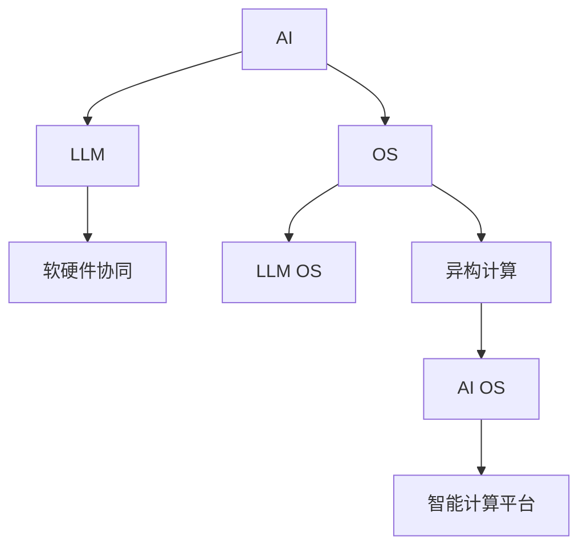

                 

# 构建AI时代操作系统：LLM OS的核心理念

> 关键词：人工智能(AI), 大规模语言模型(LLM), 操作系统(Operating System, OS), 软硬件协同, 异构计算, 人工智能操作系统, 智能计算平台, 自动化管理, 自动化部署, 自动优化, 模型推理加速, 模型优化策略, 模型适配策略

## 1. 背景介绍

### 1.1 问题由来
随着人工智能(AI)技术的飞速发展，深度学习尤其是大规模语言模型(LLM)在自然语言处理(NLP)、计算机视觉(CV)等领域取得了显著突破。但与此同时，大规模模型的训练和部署也面临着诸多挑战：数据获取成本高、计算资源需求大、模型更新迭代快、模型泛化性不足、系统管理和部署复杂等。为应对这些问题，AI时代的“操作系统”呼之欲出。

### 1.2 问题核心关键点
实现AI时代的操作系统（LLM OS），关键在于构建一个软硬件协同、异构计算的智能计算平台。该平台应具备以下特点：
- **自动化管理**：包括自动化部署、自动化优化、自动化推理等。
- **高效模型推理加速**：采用硬件加速、算法优化、模型压缩等手段，提升模型推理效率。
- **模型优化策略**：针对不同模型架构和应用场景，制定适配策略。
- **模型适配策略**：灵活适配各种任务需求，如NLP、CV等。

## 2. 核心概念与联系

### 2.1 核心概念概述

为更好地理解LLM OS的构建，本节将介绍几个密切相关的核心概念：

- **人工智能(AI)**：利用计算机技术模仿、延伸和扩展人的智能，涉及感知、学习、推理、规划、认知等。
- **大规模语言模型(LLM)**：具有超过10亿参数的预训练模型，如BERT、GPT等，能够理解和生成自然语言。
- **操作系统(Operating System, OS)**：用于管理计算机硬件和软件资源的系统软件，提供用户与计算机硬件之间的接口。
- **软硬件协同(Software-Hardware Cooperation)**：在软件和硬件之间实现高效的通信与协作，提高系统的性能与效率。
- **异构计算(Heterogeneous Computing)**：利用不同类型、不同架构的处理器，如CPU、GPU、TPU等，提升计算能力。
- **人工智能操作系统(AI OS)**：专门为AI应用设计的操作系统，能够高效管理AI计算资源，支持AI应用的生命周期管理。
- **智能计算平台(Intelligent Computing Platform)**：集成软硬件资源，提供高性能计算和智能推理能力，支持AI应用的全生命周期。

这些核心概念之间的逻辑关系可以通过以下Mermaid流程图来展示：



这个流程图展示了大语言模型与操作系统的核心概念及其之间的关系：

1. AI为LLM提供了理论基础和应用方向，是LLM的核心驱动力。
2. OS为LLM提供了底层资源管理和调度，支持LLM的高效运行。
3. LLM OS结合了LLM与OS的特点，专注于支持LLM应用的部署、优化与推理。
4. 软硬件协同和异构计算为大语言模型的运行提供了高性能支持，提升了计算效率。
5. AI OS是专门为AI应用设计的操作系统，集成软硬件资源管理，提供生命周期管理。
6. 智能计算平台则是集成软硬件资源，提供高性能计算和智能推理能力，支持AI应用的全生命周期。

## 3. 核心算法原理 & 具体操作步骤

### 3.1 算法原理概述

构建LLM OS的核心理念是实现软硬件协同，通过异构计算提升模型推理加速，同时采用自动化管理与优化策略，灵活适配各类任务需求。其核心算法原理主要包括：

1. **软硬件协同与异构计算**：利用不同类型、不同架构的处理器，如CPU、GPU、TPU等，实现多层次、多维度的模型推理加速。
2. **自动化管理与优化**：通过模型适配策略，灵活适配不同任务需求，并采用自动化优化策略，提升模型性能与推理效率。
3. **模型推理加速**：通过硬件加速、算法优化、模型压缩等手段，提升模型推理效率。
4. **模型优化策略**：针对不同模型架构和应用场景，制定适配策略，实现高效推理。

### 3.2 算法步骤详解

构建LLM OS的详细步骤包括：

**Step 1: 软硬件资源配置**
- 选择适合的计算平台，配置CPU、GPU、TPU等处理器资源。
- 选择合适的内存、存储设备，满足模型训练和推理的需求。
- 确定网络连接带宽，确保数据传输和通信效率。

**Step 2: 模型适配与部署**
- 根据任务需求选择合适的预训练模型，并进行微调。
- 将模型部署到目标平台上，并设置合适的参数配置。
- 利用自动化管理工具进行模型适配与优化，确保模型的高效运行。

**Step 3: 自动化管理与优化**
- 采用自动化部署工具，实现模型的快速安装与部署。
- 利用自动化优化工具，监控模型性能，根据需求自动调整参数。
- 使用自动化推理工具，提升模型推理效率，优化推理速度。

**Step 4: 软硬件协同与推理加速**
- 采用异构计算技术，利用多类型处理器进行推理加速。
- 利用硬件加速技术，提升模型的计算效率。
- 采用模型压缩和量化技术，减少模型大小，提升推理速度。

**Step 5: 模型适配与优化策略**
- 针对不同任务需求，选择合适的模型适配策略。
- 根据模型架构和推理需求，制定合理的优化策略。
- 利用超参数调优和自动化调参工具，不断优化模型性能。

通过以上步骤，可以构建一个高效、灵活、智能的LLM OS，支持大规模语言模型的训练、推理与优化，实现AI应用的全生命周期管理。

### 3.3 算法优缺点

构建LLM OS的优势在于：
1. **高效推理加速**：利用异构计算和硬件加速技术，显著提升模型推理效率。
2. **自动化管理**：通过自动化部署、优化与推理，降低人工干预成本，提高系统管理效率。
3. **灵活适配**：根据不同任务需求，灵活适配不同模型架构与优化策略。
4. **高可靠性**：通过系统监控与自动优化，提升系统的稳定性和可靠性。
5. **可扩展性**：支持多节点、多设备的扩展与扩展，满足大规模应用的需求。

同时，构建LLM OS也存在一定的局限性：
1. **技术复杂度高**：需要综合考虑软硬件协同、异构计算、自动化管理等多方面技术，开发与维护难度较大。
2. **资源需求高**：需要高配置的计算平台和强大的内存、存储设备支持。
3. **成本投入大**：初期建设与运维成本较高，需要投入大量的资金与人力。
4. **技术更新快**：预训练模型和软硬件技术快速迭代，需要持续跟踪与更新。

尽管存在这些局限性，但LLM OS在提升大规模语言模型的计算效率和应用灵活性方面，具有显著的优势，有望成为AI时代的重要基础设施。

### 3.4 算法应用领域

构建LLM OS的算法与技术，已经在诸多领域得到了广泛的应用，例如：

- **自然语言处理(NLP)**：包括文本分类、命名实体识别、情感分析等任务，支持大规模语言模型的推理与优化。
- **计算机视觉(CV)**：如图像识别、物体检测、视频分析等任务，利用异构计算加速模型推理。
- **自动驾驶**：利用大规模语言模型进行路标识别、语音交互等任务，提升驾驶安全性与智能化水平。
- **智能制造**：通过异构计算和多节点协同，提升工业生产效率，实现智能化转型。
- **智慧城市**：利用AI OS支持城市管理的自动化部署与优化，提升公共服务的效率与质量。
- **医疗健康**：利用LLM OS支持医疗影像分析、患者问答等任务，提升医疗服务的智能化水平。

除了上述这些经典应用外，LLM OS还被创新性地应用到更多场景中，如金融风控、教育培训、娱乐游戏等，为各行业带来创新突破。

## 4. 数学模型和公式 & 详细讲解 & 举例说明

### 4.1 数学模型构建

为更好地理解LLM OS的核心算法原理，本节将通过数学语言对构建过程进行严格刻画。

假设有一大规模语言模型 $M_{\theta}$，其中 $\theta$ 为模型参数。在大规模无标签文本语料上进行预训练后，模型具备了通用语言表示能力。在特定任务 $T$ 上，通过微调，得到适配该任务的模型参数 $\hat{\theta}$，最终目标是最小化模型在任务 $T$ 上的损失函数 $\mathcal{L}$，即：

$$
\hat{\theta}=\mathop{\arg\min}_{\theta} \mathcal{L}(M_{\theta},D)
$$

其中 $D$ 为任务 $T$ 的标注数据集。

### 4.2 公式推导过程

以自然语言处理中的文本分类任务为例，假设模型输出为 $y \in \{0,1\}$，表示样本属于两类之一。模型的输出为 $M_{\theta}(x)$，其中 $x$ 为输入文本。交叉熵损失函数为：

$$
\ell(M_{\theta}(x),y) = -y\log M_{\theta}(x) - (1-y)\log (1-M_{\theta}(x))
$$

在计算损失函数 $\mathcal{L}$ 时，需要将其在数据集 $D$ 上进行经验风险最小化：

$$
\mathcal{L}(\theta) = \frac{1}{N}\sum_{i=1}^N \ell(M_{\theta}(x_i),y_i)
$$

其中 $N$ 为样本数量。通过梯度下降等优化算法，求解最优参数 $\theta^*$：

$$
\theta \leftarrow \theta - \eta \nabla_{\theta}\mathcal{L}(\theta)
$$

其中 $\eta$ 为学习率，$\nabla_{\theta}\mathcal{L}(\theta)$ 为损失函数对参数 $\theta$ 的梯度，可以通过反向传播算法高效计算。

### 4.3 案例分析与讲解

以自动驾驶中的路标识别任务为例，模型需要在实时采集的图像数据中识别并定位路标。具体步骤如下：

1. **数据准备**：收集包含路标信息的图像数据，进行数据清洗与预处理。
2. **模型选择**：选择适合该任务的预训练模型，如ResNet、VGG等。
3. **模型微调**：利用标注数据对模型进行微调，提升其在路标识别上的性能。
4. **推理加速**：利用GPU或TPU等硬件设备，对模型进行推理加速，提升计算效率。
5. **系统集成**：将微调后的模型集成到自动驾驶系统中，实现实时路标识别。

通过以上步骤，可以高效构建自动驾驶系统中的路标识别模块，提升系统的智能性与可靠性。

## 5. 项目实践：代码实例和详细解释说明

### 5.1 开发环境搭建

在进行LLM OS的实践前，我们需要准备好开发环境。以下是使用Python进行PyTorch开发的环境配置流程：

1. 安装Anaconda：从官网下载并安装Anaconda，用于创建独立的Python环境。

2. 创建并激活虚拟环境：
```bash
conda create -n pytorch-env python=3.8 
conda activate pytorch-env
```

3. 安装PyTorch：根据CUDA版本，从官网获取对应的安装命令。例如：
```bash
conda install pytorch torchvision torchaudio cudatoolkit=11.1 -c pytorch -c conda-forge
```

4. 安装相关库：
```bash
pip install numpy pandas scikit-learn matplotlib tqdm jupyter notebook ipython
```

完成上述步骤后，即可在`pytorch-env`环境中开始构建LLM OS的实践。

### 5.2 源代码详细实现

下面以自然语言处理中的文本分类任务为例，给出使用Transformers库对BERT模型进行微调的PyTorch代码实现。

首先，定义文本分类任务的数据处理函数：

```python
from transformers import BertTokenizer
from torch.utils.data import Dataset
import torch

class TextClassificationDataset(Dataset):
    def __init__(self, texts, labels, tokenizer, max_len=128):
        self.texts = texts
        self.labels = labels
        self.tokenizer = tokenizer
        self.max_len = max_len
        
    def __len__(self):
        return len(self.texts)
    
    def __getitem__(self, item):
        text = self.texts[item]
        label = self.labels[item]
        
        encoding = self.tokenizer(text, return_tensors='pt', max_length=self.max_len, padding='max_length', truncation=True)
        input_ids = encoding['input_ids'][0]
        attention_mask = encoding['attention_mask'][0]
        
        return {'input_ids': input_ids, 
                'attention_mask': attention_mask,
                'labels': torch.tensor(label, dtype=torch.long)}
```

然后，定义模型和优化器：

```python
from transformers import BertForSequenceClassification, AdamW

model = BertForSequenceClassification.from_pretrained('bert-base-cased', num_labels=2)

optimizer = AdamW(model.parameters(), lr=2e-5)
```

接着，定义训练和评估函数：

```python
from torch.utils.data import DataLoader
from tqdm import tqdm
from sklearn.metrics import classification_report

device = torch.device('cuda') if torch.cuda.is_available() else torch.device('cpu')
model.to(device)

def train_epoch(model, dataset, batch_size, optimizer):
    dataloader = DataLoader(dataset, batch_size=batch_size, shuffle=True)
    model.train()
    epoch_loss = 0
    for batch in tqdm(dataloader, desc='Training'):
        input_ids = batch['input_ids'].to(device)
        attention_mask = batch['attention_mask'].to(device)
        labels = batch['labels'].to(device)
        model.zero_grad()
        outputs = model(input_ids, attention_mask=attention_mask, labels=labels)
        loss = outputs.loss
        epoch_loss += loss.item()
        loss.backward()
        optimizer.step()
    return epoch_loss / len(dataloader)

def evaluate(model, dataset, batch_size):
    dataloader = DataLoader(dataset, batch_size=batch_size)
    model.eval()
    preds, labels = [], []
    with torch.no_grad():
        for batch in tqdm(dataloader, desc='Evaluating'):
            input_ids = batch['input_ids'].to(device)
            attention_mask = batch['attention_mask'].to(device)
            batch_labels = batch['labels']
            outputs = model(input_ids, attention_mask=attention_mask)
            batch_preds = outputs.logits.argmax(dim=2).to('cpu').tolist()
            batch_labels = batch_labels.to('cpu').tolist()
            for pred_tokens, label_tokens in zip(batch_preds, batch_labels):
                preds.append(pred_tokens[:len(label_tokens)])
                labels.append(label_tokens)
                
    print(classification_report(labels, preds))
```

最后，启动训练流程并在测试集上评估：

```python
epochs = 5
batch_size = 16

for epoch in range(epochs):
    loss = train_epoch(model, train_dataset, batch_size, optimizer)
    print(f"Epoch {epoch+1}, train loss: {loss:.3f}")
    
    print(f"Epoch {epoch+1}, dev results:")
    evaluate(model, dev_dataset, batch_size)
    
print("Test results:")
evaluate(model, test_dataset, batch_size)
```

以上就是使用PyTorch对BERT进行文本分类任务微调的完整代码实现。可以看到，得益于Transformers库的强大封装，我们可以用相对简洁的代码完成BERT模型的加载和微调。

### 5.3 代码解读与分析

让我们再详细解读一下关键代码的实现细节：

**TextClassificationDataset类**：
- `__init__`方法：初始化文本、标签、分词器等关键组件。
- `__len__`方法：返回数据集的样本数量。
- `__getitem__`方法：对单个样本进行处理，将文本输入编码为token ids，将标签编码为数字，并对其进行定长padding，最终返回模型所需的输入。

**模型和优化器定义**：
- 使用BertForSequenceClassification对BERT模型进行微调，设置学习率为2e-5。

**训练和评估函数**：
- 使用PyTorch的DataLoader对数据集进行批次化加载，供模型训练和推理使用。
- 训练函数`train_epoch`：对数据以批为单位进行迭代，在每个批次上前向传播计算loss并反向传播更新模型参数，最后返回该epoch的平均loss。
- 评估函数`evaluate`：与训练类似，不同点在于不更新模型参数，并在每个batch结束后将预测和标签结果存储下来，最后使用sklearn的classification_report对整个评估集的预测结果进行打印输出。

**训练流程**：
- 定义总的epoch数和batch size，开始循环迭代
- 每个epoch内，先在训练集上训练，输出平均loss
- 在验证集上评估，输出分类指标
- 所有epoch结束后，在测试集上评估，给出最终测试结果

可以看到，PyTorch配合Transformers库使得BERT微调的代码实现变得简洁高效。开发者可以将更多精力放在数据处理、模型改进等高层逻辑上，而不必过多关注底层的实现细节。

当然，工业级的系统实现还需考虑更多因素，如模型的保存和部署、超参数的自动搜索、更灵活的任务适配层等。但核心的微调范式基本与此类似。

## 6. 实际应用场景

### 6.1 智能驾驶系统

构建LLM OS可以为智能驾驶系统提供高效的支持。智能驾驶系统需要实时处理大量感知数据，利用大语言模型进行路标识别、车辆交互、驾驶决策等任务。利用LLM OS，可以实现模型的高效推理加速，提升系统的智能性和安全性。

在技术实现上，可以收集大量路标图像和驾驶场景数据，对其进行标注和预处理，构建训练集。利用Bert或GPT等预训练模型，对模型进行微调，提升其在路标识别和驾驶决策上的性能。微调后的模型可以集成到智能驾驶系统中，实时处理感知数据，提供驾驶建议和安全预警。

### 6.2 智慧城市管理

构建LLM OS可以显著提升智慧城市管理系统的效率和智能化水平。智慧城市管理系统需要处理大量公共数据，进行交通管理、公共安全、能源调度等任务。利用LLM OS，可以实现模型的高效部署和管理，提升城市管理的智能化水平。

在技术实现上，可以收集智慧城市中的各类数据，如交通流量、天气预报、能源消耗等，对其进行标注和预处理，构建训练集。利用BERT或GPT等预训练模型，对模型进行微调，提升其在数据分析和决策优化上的性能。微调后的模型可以集成到智慧城市管理系统中，实现实时数据分析和决策优化，提升城市管理的效率和智能化水平。

### 6.3 医疗健康系统

构建LLM OS可以为医疗健康系统提供高效的支持。医疗健康系统需要处理大量患者数据，进行疾病诊断、医疗影像分析、健康管理等任务。利用LLM OS，可以实现模型的高效推理加速，提升医疗服务的智能化水平。

在技术实现上，可以收集医疗影像和患者数据，对其进行标注和预处理，构建训练集。利用BERT或GPT等预训练模型，对模型进行微调，提升其在疾病诊断和健康管理上的性能。微调后的模型可以集成到医疗健康系统中，实时处理患者数据，提供疾病诊断和健康管理建议，提升医疗服务的智能化水平。

### 6.4 未来应用展望

随着LLM OS的不断演进，其应用场景将会更加广泛，对各行各业带来深远影响。

在智慧制造领域，利用LLM OS支持工业生产线的智能化转型，实现生产效率的提升和资源优化。

在智慧教育领域，利用LLM OS支持个性化教学和智能辅助，提升教学质量和教育公平。

在智慧农业领域，利用LLM OS支持农作物的智能识别和农业知识的自动提取，提升农业生产的智能化水平。

此外，在金融风控、安全监控、娱乐游戏等领域，LLM OS也将带来创新突破，为各行业带来变革性影响。相信随着LLM OS的不断成熟，其应用将更加广泛，对各行各业带来深远影响。

## 7. 工具和资源推荐

### 7.1 学习资源推荐

为帮助开发者系统掌握LLM OS的理论基础和实践技巧，这里推荐一些优质的学习资源：

1. 《Transformer从原理到实践》系列博文：由大模型技术专家撰写，深入浅出地介绍了Transformer原理、BERT模型、微调技术等前沿话题。

2. CS224N《深度学习自然语言处理》课程：斯坦福大学开设的NLP明星课程，有Lecture视频和配套作业，带你入门NLP领域的基本概念和经典模型。

3. 《Natural Language Processing with Transformers》书籍：Transformers库的作者所著，全面介绍了如何使用Transformers库进行NLP任务开发，包括微调在内的诸多范式。

4. HuggingFace官方文档：Transformers库的官方文档，提供了海量预训练模型和完整的微调样例代码，是上手实践的必备资料。

5. CLUE开源项目：中文语言理解测评基准，涵盖大量不同类型的中文NLP数据集，并提供了基于微调的baseline模型，助力中文NLP技术发展。

通过对这些资源的学习实践，相信你一定能够快速掌握LLM OS的精髓，并用于解决实际的NLP问题。

### 7.2 开发工具推荐

高效的开发离不开优秀的工具支持。以下是几款用于LLM OS开发的常用工具：

1. PyTorch：基于Python的开源深度学习框架，灵活动态的计算图，适合快速迭代研究。大部分预训练语言模型都有PyTorch版本的实现。

2. TensorFlow：由Google主导开发的开源深度学习框架，生产部署方便，适合大规模工程应用。同样有丰富的预训练语言模型资源。

3. Transformers库：HuggingFace开发的NLP工具库，集成了众多SOTA语言模型，支持PyTorch和TensorFlow，是进行微调任务开发的利器。

4. Weights & Biases：模型训练的实验跟踪工具，可以记录和可视化模型训练过程中的各项指标，方便对比和调优。与主流深度学习框架无缝集成。

5. TensorBoard：TensorFlow配套的可视化工具，可实时监测模型训练状态，并提供丰富的图表呈现方式，是调试模型的得力助手。

6. Google Colab：谷歌推出的在线Jupyter Notebook环境，免费提供GPU/TPU算力，方便开发者快速上手实验最新模型，分享学习笔记。

合理利用这些工具，可以显著提升LLM OS的开发效率，加快创新迭代的步伐。

### 7.3 相关论文推荐

大语言模型和LLM OS的发展源于学界的持续研究。以下是几篇奠基性的相关论文，推荐阅读：

1. Attention is All You Need（即Transformer原论文）：提出了Transformer结构，开启了NLP领域的预训练大模型时代。

2. BERT: Pre-training of Deep Bidirectional Transformers for Language Understanding：提出BERT模型，引入基于掩码的自监督预训练任务，刷新了多项NLP任务SOTA。

3. Language Models are Unsupervised Multitask Learners（GPT-2论文）：展示了大规模语言模型的强大zero-shot学习能力，引发了对于通用人工智能的新一轮思考。

4. Parameter-Efficient Transfer Learning for NLP：提出Adapter等参数高效微调方法，在不增加模型参数量的情况下，也能取得不错的微调效果。

5. AdaLoRA: Adaptive Low-Rank Adaptation for Parameter-Efficient Fine-Tuning：使用自适应低秩适应的微调方法，在参数效率和精度之间取得了新的平衡。

6. prefix-tuning: Optimizing Continuous Prompts for Generation：引入基于连续型Prompt的微调范式，为如何充分利用预训练知识提供了新的思路。

这些论文代表了大语言模型和LLM OS的发展脉络。通过学习这些前沿成果，可以帮助研究者把握学科前进方向，激发更多的创新灵感。

## 8. 总结：未来发展趋势与挑战

### 8.1 研究成果总结

本文对构建LLM OS的核心理念进行了全面系统的介绍。首先阐述了LLM OS的背景和意义，明确了软硬件协同、异构计算的重要性。其次，从原理到实践，详细讲解了模型适配、优化与推理的算法原理和关键步骤，给出了微调任务开发的完整代码实例。同时，本文还广泛探讨了LLM OS在智能驾驶、智慧城市、医疗健康等诸多领域的应用前景，展示了其广阔的发展空间。此外，本文精选了LLM OS的学习资源，力求为读者提供全方位的技术指引。

通过本文的系统梳理，可以看到，构建LLM OS的核心在于实现软硬件协同与异构计算，提升模型推理效率。LLM OS的构建将极大提升大规模语言模型的计算效率和应用灵活性，为AI时代的操作系统奠定基础。相信随着相关技术的不断进步，LLM OS必将成为AI时代的重要基础设施，推动AI技术的规模化落地。

### 8.2 未来发展趋势

展望未来，LLM OS的发展趋势包括：

1. **模型规模持续增大**：随着算力成本的下降和数据规模的扩张，预训练语言模型的参数量还将持续增长。超大规模语言模型蕴含的丰富语言知识，有望支撑更加复杂多变的下游任务微调。
2. **模型推理加速**：采用硬件加速、算法优化、模型压缩等手段，提升模型推理效率。异构计算和多节点协同将进一步提升推理速度和计算能力。
3. **自动化管理与优化**：通过自动化部署、优化与推理，降低人工干预成本，提高系统管理效率。自动化调参和超参数优化将进一步提升模型性能。
4. **跨领域模型适配**：利用模型适配策略，灵活适配不同任务需求，提升模型的通用性和适应性。
5. **跨平台兼容性**：支持多平台、多设备的操作系统，实现模型的高效部署和优化。
6. **模型安全与隐私保护**：在模型训练和使用过程中，引入隐私保护和安全性机制，确保数据和模型的安全。

以上趋势凸显了LLM OS的发展方向。这些方向的探索发展，必将进一步提升LLM OS的计算效率和应用灵活性，为AI应用的全生命周期管理提供更高效、更可靠的支持。

### 8.3 面临的挑战

尽管LLM OS在提升大规模语言模型的计算效率和应用灵活性方面具有显著优势，但在实现过程中也面临诸多挑战：

1. **技术复杂度高**：需要综合考虑软硬件协同、异构计算、自动化管理等多方面技术，开发与维护难度较大。
2. **资源需求高**：需要高配置的计算平台和强大的内存、存储设备支持。
3. **成本投入大**：初期建设与运维成本较高，需要投入大量的资金与人力。
4. **技术更新快**：预训练模型和软硬件技术快速迭代，需要持续跟踪与更新。
5. **模型鲁棒性不足**：当前模型面对域外数据时，泛化性能往往大打折扣。
6. **模型可解释性不足**：大语言模型的内部工作机制和决策逻辑难以解释，对高风险应用带来挑战。

尽管存在这些挑战，但通过技术创新和协同攻关，这些难题将逐步得到解决，LLM OS必将成为AI时代的重要基础设施，为各行业带来深远影响。

### 8.4 研究展望

面对LLM OS面临的挑战，未来的研究需要在以下几个方面寻求新的突破：

1. **跨平台兼容性**：实现跨平台、跨设备的操作系统，提升模型的兼容性。
2. **模型高效压缩**：通过模型剪枝、量化等手段，减少模型大小，提升推理效率。
3. **自动化管理优化**：利用自动化部署和优化工具，提升系统的管理效率。
4. **模型鲁棒性增强**：通过数据增强、对抗训练等手段，提升模型的鲁棒性和泛化性。
5. **模型可解释性**：引入可解释性工具，提升模型的可解释性和透明性。
6. **跨领域知识整合**：利用知识图谱、逻辑规则等专家知识，提升模型的知识整合能力。

这些研究方向的探索，必将引领LLM OS的持续演进，为各行业带来更加智能化、可靠性和安全性更高的人工智能应用。

## 9. 附录：常见问题与解答

**Q1：大语言模型微调是否适用于所有NLP任务？**

A: 大语言模型微调在大多数NLP任务上都能取得不错的效果，特别是对于数据量较小的任务。但对于一些特定领域的任务，如医学、法律等，仅仅依靠通用语料预训练的模型可能难以很好地适应。此时需要在特定领域语料上进一步预训练，再进行微调，才能获得理想效果。此外，对于一些需要时效性、个性化很强的任务，如对话、推荐等，微调方法也需要针对性的改进优化。

**Q2：微调过程中如何选择合适的学习率？**

A: 微调的学习率一般要比预训练时小1-2个数量级，如果使用过大的学习率，容易破坏预训练权重，导致过拟合。一般建议从1e-5开始调参，逐步减小学习率，直至收敛。也可以使用warmup策略，在开始阶段使用较小的学习率，再逐渐过渡到预设值。需要注意的是，不同的优化器(如AdamW、Adafactor等)以及不同的学习率调度策略，可能需要设置不同的学习率阈值。

**Q3：采用大语言模型微调时会面临哪些资源瓶颈？**

A: 目前主流的预训练大模型动辄以亿计的参数规模，对算力、内存、存储都提出了很高的要求。GPU/TPU等高性能设备是必不可少的，但即便如此，超大批次的训练和推理也可能遇到显存不足的问题。因此需要采用一些资源优化技术，如梯度积累、混合精度训练、模型并行等，来突破硬件瓶颈。同时，模型的存储和读取也可能占用大量时间和空间，需要采用模型压缩、稀疏化存储等方法进行优化。

**Q4：如何缓解微调过程中的过拟合问题？**

A: 过拟合是微调面临的主要挑战，尤其是在标注数据不足的情况下。常见的缓解策略包括：
1. 数据增强：通过回译、近义替换等方式扩充训练集
2. 正则化：使用L2正则、Dropout、Early Stopping等避免过拟合
3. 对抗训练：引入对抗样本，提高模型鲁棒性
4. 参数高效微调：只调整少量参数(如Adapter、Prefix等)，减小过拟合风险
5. 多模型集成：训练多个微调模型，取平均输出，抑制过拟合

这些策略往往需要根据具体任务和数据特点进行灵活组合。只有在数据、模型、训练、推理等各环节进行全面优化，才能最大限度地发挥大模型微调的威力。

**Q5：微调模型在落地部署时需要注意哪些问题？**

A: 将微调模型转化为实际应用，还需要考虑以下因素：
1. 模型裁剪：去除不必要的层和参数，减小模型尺寸，加快推理速度
2. 量化加速：将浮点模型转为定点模型，压缩存储空间，提高计算效率
3. 服务化封装：将模型封装为标准化服务接口，便于集成调用
4. 弹性伸缩：根据请求流量动态调整资源配置，平衡服务质量和成本
5. 监控告警：实时采集系统指标，设置异常告警阈值，确保服务稳定性
6. 安全防护：采用访问鉴权、数据脱敏等措施，保障数据和模型安全

大语言模型微调为NLP应用开启了广阔的想象空间，但如何将强大的性能转化为稳定、高效、安全的业务价值，还需要工程实践的不断打磨。唯有从数据、算法、工程、业务等多个维度协同发力，才能真正实现人工智能技术在垂直行业的规模化落地。总之，微调需要开发者根据具体任务，不断迭代和优化模型、数据和算法，方能得到理想的效果。

---

作者：禅与计算机程序设计艺术 / Zen and the Art of Computer Programming

