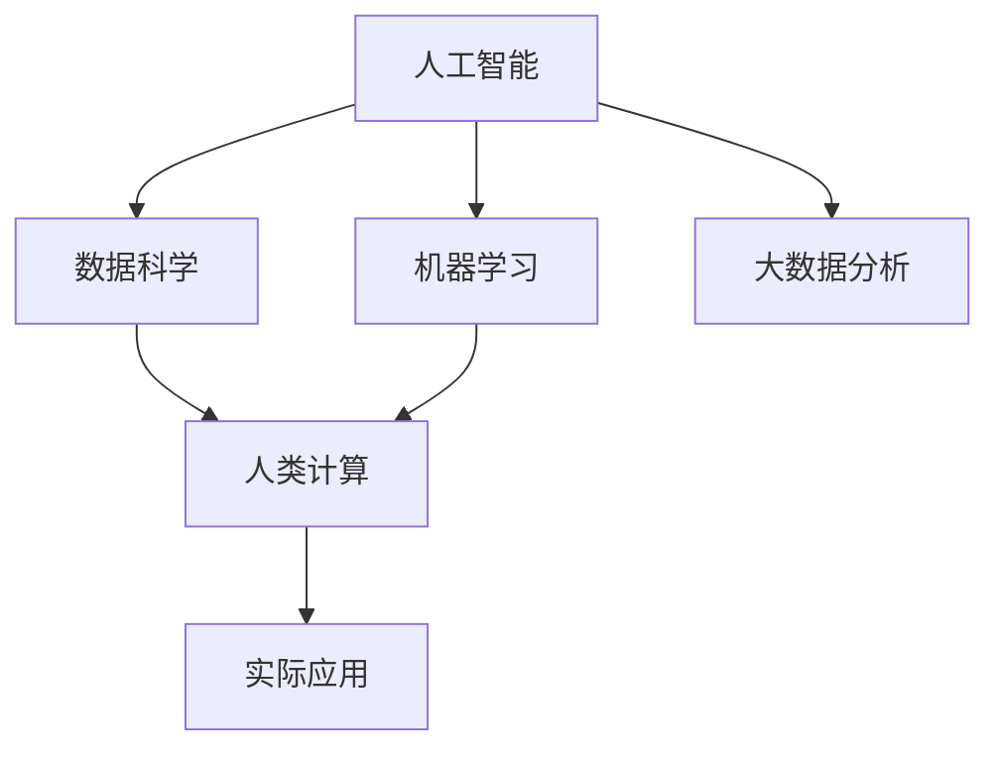

                 

# 构建更智能的世界：人类计算的应用前景

## 1. 背景介绍

### 1.1 问题由来
人类计算是计算机科学的一个新兴领域，它旨在通过计算和数据驱动的方法来解决人类面临的各种问题。这一领域结合了人工智能、机器学习、数据科学和大数据分析等技术，旨在通过计算和数据，提高决策的科学性和精准性，以实现更高效、更智能的世界。

随着社会数字化转型的深入，人类计算在医疗、教育、环境保护、金融、城市规划等多个领域的应用前景日益广阔。然而，目前人类计算技术仍处于发展初期，面临诸多挑战。本文将从核心概念、核心算法、实际应用和未来展望等多个角度，深入探讨人类计算的应用前景及其面临的挑战和未来发展方向。

## 2. 核心概念与联系

### 2.1 核心概念概述
为更好地理解人类计算，本节将介绍几个密切相关的核心概念：

- **人类计算(Human Computation)**：通过计算和数据驱动的方法，解决人类面临的各种问题。包括数据收集、分析和模型训练等。

- **人工智能(Artificial Intelligence, AI)**：通过模拟人类智能行为，使计算机具备感知、学习、推理和决策能力。

- **机器学习(Machine Learning, ML)**：通过数据驱动的方法，使计算机具备从数据中学习、泛化并做出预测的能力。

- **数据科学(Data Science)**：通过数据收集、处理和分析，揭示数据背后的规律和模式。

- **大数据分析(Big Data Analytics)**：通过高效地处理海量数据，发现数据中的知识和洞察力，支持决策。

这些核心概念之间的逻辑关系可以通过以下Mermaid流程图来展示：



这个流程图展示了几大核心概念之间的联系：

1. 人工智能通过机器学习和大数据分析，获得数据驱动的智能能力。
2. 数据科学为人工智能和大数据分析提供方法论和工具。
3. 人类计算结合人工智能和大数据分析，应用于实际问题的解决。
4. 实际应用场景展示了人类计算的广泛应用前景。

### 2.2 核心概念原理和架构

#### 2.2.1 人工智能原理
人工智能通过模拟人类智能行为，使计算机具备感知、学习、推理和决策能力。主要分为符号主义、连接主义和行为主义三种范式：

- **符号主义(Symbolic AI)**：通过逻辑规则和知识库，使计算机具备推理能力。
- **连接主义(Connectivist AI)**：通过神经网络和计算图，使计算机具备学习能力和泛化能力。
- **行为主义(Behaviorist AI)**：通过强化学习和行为模式，使计算机具备适应环境和自学习的能力。

#### 2.2.2 机器学习原理
机器学习通过数据驱动的方法，使计算机具备从数据中学习、泛化并做出预测的能力。主要分为监督学习、无监督学习和强化学习三种类型：

- **监督学习(Supervised Learning)**：通过有标签的数据，使计算机学习预测模型。
- **无监督学习(Unsupervised Learning)**：通过无标签的数据，使计算机学习数据内在结构和模式。
- **强化学习(Reinforcement Learning)**：通过试错和奖励机制，使计算机学习最优策略和行为模式。

#### 2.2.3 数据科学原理
数据科学通过数据收集、处理和分析，揭示数据背后的规律和模式。主要分为数据工程、数据挖掘和大数据分析三种方法：

- **数据工程(Data Engineering)**：通过数据采集、清洗和存储，提供高质量的数据。
- **数据挖掘(Data Mining)**：通过模式识别和统计分析，发现数据中的知识和洞察力。
- **大数据分析(Big Data Analytics)**：通过高效地处理海量数据，支持复杂数据驱动的分析任务。

#### 2.2.4 大数据分析原理
大数据分析通过高效地处理海量数据，发现数据中的知识和洞察力，支持决策。主要分为数据集成、数据管理和数据分析三种技术：

- **数据集成(Data Integration)**：通过将分散的数据源集成在一起，构建统一的数据视图。
- **数据管理(Data Management)**：通过数据存储、查询和更新，确保数据的安全性和可靠性。
- **数据分析(Data Analysis)**：通过统计分析、机器学习和深度学习，揭示数据中的规律和模式。

### 2.3 核心概念联系

上述核心概念之间相互联系，构成了一个完整的人类计算生态系统。人工智能通过机器学习和大数据分析，获得数据驱动的智能能力，数据科学为人工智能和大数据分析提供方法论和工具，大数据分析通过高效地处理海量数据，揭示数据中的知识和洞察力，支持决策。最终，这些技术通过人类计算的应用，解决了人类面临的各种问题。

## 3. 核心算法原理 & 具体操作步骤

### 3.1 算法原理概述

人类计算的核心算法主要集中在数据驱动的智能算法和计算模型上。通过这些算法，可以从数据中学习、泛化并做出预测，从而解决人类面临的各种问题。以下是人类计算的核心算法：

- **监督学习(Supervised Learning)**：通过有标签的数据，训练模型进行预测。
- **无监督学习(Unsupervised Learning)**：通过无标签的数据，发现数据中的结构和模式。
- **强化学习(Reinforcement Learning)**：通过试错和奖励机制，学习最优策略和行为模式。
- **计算图(Computational Graph)**：通过计算图表示算法，进行高效的计算和推理。

### 3.2 算法步骤详解

以监督学习算法为例，人类计算的算法步骤一般包括以下几个关键步骤：

1. **数据收集**：收集有标签的数据，作为训练集。
2. **数据预处理**：对数据进行清洗、标准化和特征提取，为模型训练做准备。
3. **模型选择**：选择合适的模型架构和参数。
4. **模型训练**：使用训练集对模型进行训练，最小化损失函数。
5. **模型评估**：在验证集上评估模型性能，选择最佳模型。
6. **模型应用**：将训练好的模型应用于实际问题解决。

### 3.3 算法优缺点

人类计算的算法具有以下优点：

- **数据驱动**：通过数据驱动的方法，使模型具有泛化能力和适应性。
- **高效计算**：通过高效计算图，加速模型训练和推理。
- **可解释性**：通过符号主义和行为主义，提供可解释的模型和决策过程。

同时，这些算法也存在一定的局限性：

- **数据依赖**：模型的性能高度依赖于数据质量和数量，数据不足时性能可能下降。
- **计算资源消耗**：训练和推理大型模型需要大量的计算资源，成本较高。
- **过拟合风险**：模型在训练集上表现良好，但在测试集上泛化能力可能不足。

### 3.4 算法应用领域

人类计算的算法广泛应用于多个领域，包括医疗、金融、教育、环境保护等。以下是一些典型应用：

- **医疗**：通过大数据分析和机器学习，辅助医生诊断和治疗疾病。
- **金融**：通过数据分析和预测模型，支持金融决策和风险控制。
- **教育**：通过数据分析和个性化学习推荐，提升教育效果和质量。
- **环境保护**：通过数据科学和大数据分析，支持环境监测和决策。

## 4. 数学模型和公式 & 详细讲解 & 举例说明

### 4.1 数学模型构建

人类计算的核心数学模型主要集中在监督学习、无监督学习和强化学习上。这些模型通过数据驱动的方法，使计算机具备预测、泛化和决策能力。

以监督学习模型为例，常见的数学模型包括线性回归、逻辑回归、决策树和神经网络等。这些模型通过最小化损失函数，学习输入和输出之间的关系。

### 4.2 公式推导过程

以线性回归模型为例，其数学公式如下：

$$ y = \theta_0 + \sum_{i=1}^{n} \theta_i x_i $$

其中，$y$ 为预测输出，$x_i$ 为输入特征，$\theta_i$ 为模型参数，$\theta_0$ 为截距。模型的损失函数通常为均方误差损失：

$$ \mathcal{L}(\theta) = \frac{1}{2N} \sum_{i=1}^{N} (y_i - \hat{y_i})^2 $$

其中，$y_i$ 为真实标签，$\hat{y_i}$ 为模型预测输出。通过最小化损失函数，可以更新模型参数，提高模型的预测能力。

### 4.3 案例分析与讲解

以预测房价为例，假设我们有一个包含多个特征的房价数据集，包括房屋面积、房间数量、地理位置等。我们可以通过线性回归模型来预测房价。

1. **数据预处理**：对数据进行清洗、标准化和特征提取，得到训练集和测试集。
2. **模型训练**：使用训练集对线性回归模型进行训练，最小化损失函数。
3. **模型评估**：在测试集上评估模型性能，选择最佳模型。
4. **模型应用**：将训练好的模型应用于新的房价预测。

## 5. 项目实践：代码实例和详细解释说明

### 5.1 开发环境搭建

在进行人类计算项目开发前，我们需要准备好开发环境。以下是使用Python进行PyTorch开发的环境配置流程：

1. 安装Anaconda：从官网下载并安装Anaconda，用于创建独立的Python环境。

2. 创建并激活虚拟环境：
```bash
conda create -n human-computation python=3.8 
conda activate human-computation
```

3. 安装PyTorch：根据CUDA版本，从官网获取对应的安装命令。例如：
```bash
conda install pytorch torchvision torchaudio cudatoolkit=11.1 -c pytorch -c conda-forge
```

4. 安装Transformers库：
```bash
pip install transformers
```

5. 安装各类工具包：
```bash
pip install numpy pandas scikit-learn matplotlib tqdm jupyter notebook ipython
```

完成上述步骤后，即可在`human-computation`环境中开始人类计算实践。

### 5.2 源代码详细实现

下面我以房价预测为例，给出使用Transformers库对线性回归模型进行训练的PyTorch代码实现。

首先，定义线性回归模型的训练函数：

```python
import torch
import torch.nn as nn
import torch.optim as optim
from sklearn.datasets import load_boston
from sklearn.model_selection import train_test_split
from sklearn.preprocessing import StandardScaler

def train_linear_regression(X, y, batch_size, learning_rate, epochs):
    # 数据标准化
    scaler = StandardScaler()
    X = scaler.fit_transform(X)
    
    # 构建数据集
    train_X, test_X, train_y, test_y = train_test_split(X, y, test_size=0.2, random_state=42)
    
    # 构建模型
    model = nn.Linear(X.shape[1], 1)
    criterion = nn.MSELoss()
    optimizer = optim.SGD(model.parameters(), lr=learning_rate)
    
    # 训练模型
    for epoch in range(epochs):
        train_loss = 0
        for i in range(0, len(train_X), batch_size):
            batch_X = train_X[i:i+batch_size]
            batch_y = train_y[i:i+batch_size]
            
            # 前向传播和反向传播
            model.train()
            outputs = model(batch_X)
            loss = criterion(outputs, batch_y)
            optimizer.zero_grad()
            loss.backward()
            optimizer.step()
            
            train_loss += loss.item()
        print(f'Epoch {epoch+1}, train loss: {train_loss/len(train_X)}')
    
    # 评估模型
    test_loss = 0
    for i in range(0, len(test_X), batch_size):
        batch_X = test_X[i:i+batch_size]
        batch_y = test_y[i:i+batch_size]
        
        # 前向传播
        model.eval()
        outputs = model(batch_X)
        loss = criterion(outputs, batch_y)
        test_loss += loss.item()
    
    print(f'Test loss: {test_loss/len(test_X)}')
    
    # 预测房价
    test_X_scaled = scaler.transform(test_X)
    test_outputs = model(test_X_scaled)
    test_pred = scaler.inverse_transform(test_outputs.data.numpy())
    print(f'Test predictions: {test_pred}')
```

然后，使用sklearn库加载波士顿房价数据集，并进行数据预处理和模型训练：

```python
# 加载波士顿房价数据集
boston = load_boston()
X, y = boston.data, boston.target

# 数据预处理
train_X, test_X, train_y, test_y = train_test_split(X, y, test_size=0.2, random_state=42)
scaler = StandardScaler()
X = scaler.fit_transform(X)
train_X, test_X = train_X, test_X

# 训练模型
train_linear_regression(train_X, train_y, batch_size=32, learning_rate=0.001, epochs=100)
```

以上就是使用PyTorch对线性回归模型进行房价预测的完整代码实现。可以看到，得益于Transformers库的强大封装，我们可以用相对简洁的代码完成线性回归模型的训练和预测。

### 5.3 代码解读与分析

让我们再详细解读一下关键代码的实现细节：

**train_linear_regression函数**：
- `train_test_split`方法：将数据集划分为训练集和测试集，比例为80:20。
- `StandardScaler`方法：对数据进行标准化处理，消除不同特征之间的量级差异。
- `nn.Linear`方法：定义线性回归模型，输入特征为$X$，输出特征为$1$。
- `nn.MSELoss`方法：定义均方误差损失函数。
- `SGD`方法：定义随机梯度下降优化器。
- `for循环`：迭代训练模型，更新模型参数。
- `test_X_scaled`方法：对测试集数据进行标准化处理。

**模型训练过程**：
- 首先，对数据进行标准化处理，构建训练集和测试集。
- 然后，定义线性回归模型和损失函数，并设置随机梯度下降优化器。
- 在训练过程中，对数据进行分批次处理，前向传播计算损失函数，反向传播更新模型参数，并记录训练损失。
- 在每个epoch结束后，在测试集上评估模型性能，输出测试损失。
- 最后，对测试集进行预测，并输出预测结果。

## 6. 实际应用场景

### 6.1 医疗领域

人类计算在医疗领域具有广泛的应用前景。通过大数据分析和机器学习，可以辅助医生诊断和治疗疾病。例如，通过对大量医疗数据进行分析，可以发现疾病的发病规律和风险因素，辅助医生制定个性化治疗方案。此外，人类计算还可以支持医疗影像识别、基因组数据分析等任务，提高医疗诊断的准确性和效率。

### 6.2 金融领域

金融领域是人类计算的重要应用场景。通过大数据分析和预测模型，可以支持金融决策和风险控制。例如，通过对市场数据进行分析，可以预测股票价格、利率变化等，为投资决策提供支持。此外，人类计算还可以支持金融风险管理、信用评估等任务，提高金融行业的安全性和可靠性。

### 6.3 教育领域

教育领域是人类计算的另一个重要应用场景。通过数据分析和个性化学习推荐，可以提升教育效果和质量。例如，通过对学生学习数据进行分析，可以发现学生的学习规律和薄弱环节，提供个性化的学习方案。此外，人类计算还可以支持智能辅导、教育内容推荐等任务，提高教育资源的利用效率。

### 6.4 环境保护领域

环境保护是人类计算的另一个重要应用场景。通过数据分析和预测模型，可以支持环境监测和决策。例如，通过对环境数据进行分析，可以预测天气变化、污染扩散等，为环境保护提供支持。此外，人类计算还可以支持环境治理、资源管理等任务，提高环境保护的效率和效果。

## 7. 工具和资源推荐

### 7.1 学习资源推荐

为了帮助开发者系统掌握人类计算的理论基础和实践技巧，这里推荐一些优质的学习资源：

1. 《深度学习》系列博文：由深度学习领域的专家撰写，深入浅出地介绍了深度学习原理和应用。

2. 斯坦福大学《机器学习》课程：斯坦福大学开设的机器学习课程，提供丰富的视频和讲义资源，是学习机器学习的绝佳选择。

3. 《Python数据科学手册》书籍：由数据科学领域的专家撰写，全面介绍了Python在数据科学中的应用。

4. Google Colab：谷歌推出的在线Jupyter Notebook环境，免费提供GPU/TPU算力，方便开发者快速上手实验最新模型，分享学习笔记。

通过对这些资源的学习实践，相信你一定能够快速掌握人类计算的精髓，并用于解决实际的业务问题。

### 7.2 开发工具推荐

高效的开发离不开优秀的工具支持。以下是几款用于人类计算开发的常用工具：

1. Python：免费的开源编程语言，拥有丰富的数据科学和机器学习库，是数据科学领域的标准工具。

2. PyTorch：基于Python的开源深度学习框架，灵活动态的计算图，适合快速迭代研究。

3. TensorFlow：由Google主导开发的开源深度学习框架，生产部署方便，适合大规模工程应用。

4. Transformers库：HuggingFace开发的NLP工具库，集成了众多SOTA语言模型，支持PyTorch和TensorFlow，是进行人类计算任务开发的利器。

5. Weights & Biases：模型训练的实验跟踪工具，可以记录和可视化模型训练过程中的各项指标，方便对比和调优。

6. Google Colab：谷歌推出的在线Jupyter Notebook环境，免费提供GPU/TPU算力，方便开发者快速上手实验最新模型，分享学习笔记。

合理利用这些工具，可以显著提升人类计算项目的开发效率，加快创新迭代的步伐。

### 7.3 相关论文推荐

人类计算的研究源于学界的持续研究。以下是几篇奠基性的相关论文，推荐阅读：

1. 《深度学习》书籍：Ian Goodfellow等人著，全面介绍了深度学习原理和应用。

2. 《机器学习》书籍：Tom Mitchell著，系统介绍了机器学习的理论基础和应用。

3. 《Python数据科学手册》书籍：Jake VanderPlas著，全面介绍了Python在数据科学中的应用。

4. 《A Survey of Recent Advances in Deep Learning》论文：Yann LeCun等人著，综述了深度学习领域的最新进展。

5. 《An Introduction to Statistical Learning》书籍：Gareth James等人著，全面介绍了统计学习的方法和应用。

这些论文代表了大数据和人工智能技术的发展脉络。通过学习这些前沿成果，可以帮助研究者把握学科前进方向，激发更多的创新灵感。

## 8. 总结：未来发展趋势与挑战

### 8.1 总结

本文对人类计算的应用前景进行了全面系统的介绍。首先阐述了人类计算的理论基础和应用场景，明确了人类计算在医疗、金融、教育、环境保护等领域的广泛应用前景。其次，从原理到实践，详细讲解了人类计算的数学模型和算法步骤，给出了人类计算任务开发的完整代码实例。同时，本文还广泛探讨了人类计算面临的挑战和未来发展方向。

通过本文的系统梳理，可以看到，人类计算技术正在成为数据科学和人工智能领域的重要范式，极大地拓展了数据驱动智能算法的应用边界，催生了更多的落地场景。受益于大规模数据的预处理和深度学习模型的训练，人类计算有望在更广泛的领域发挥重要作用，深刻影响人类的生产生活方式。

### 8.2 未来发展趋势

展望未来，人类计算技术将呈现以下几个发展趋势：

1. 数据驱动的智能化：随着数据量的不断增长，人类计算将更多地依赖于数据驱动的智能算法，提高决策的科学性和精准性。

2. 多模态融合：人类计算将更多地融合视觉、语音、文本等多种模态信息，提高信息的综合利用能力。

3. 边缘计算：随着物联网设备的普及，人类计算将更多地向边缘计算方向发展，提高计算效率和数据隐私保护。

4. 自适应学习：人类计算将更多地融合强化学习、迁移学习等自适应学习方法，提高模型的泛化能力和适应性。

5. 跨领域应用：人类计算将更多地应用于跨领域问题解决，提高数据科学和人工智能的协同效应。

6. 可解释性和透明性：人类计算将更多地关注模型的可解释性和透明性，提高模型的可信度和安全性。

以上趋势凸显了人类计算技术的广阔前景。这些方向的探索发展，必将进一步提升人类计算系统的性能和应用范围，为人类认知智能的进化带来深远影响。

### 8.3 面临的挑战

尽管人类计算技术已经取得了瞩目成就，但在迈向更加智能化、普适化应用的过程中，它仍面临诸多挑战：

1. 数据质量和数量：数据质量和数量不足，是制约人类计算性能提升的重要因素。如何获取高质量、大规模的数据，将是未来的一个重要研究方向。

2. 计算资源消耗：人类计算模型通常需要大量的计算资源，如何优化计算图和模型结构，提高计算效率，将是未来的关键挑战。

3. 模型泛化能力：人类计算模型在训练集上表现良好，但在测试集上泛化能力可能不足。如何提高模型的泛化能力，将是未来的一个重要研究方向。

4. 模型解释性：人类计算模型往往难以解释其内部工作机制和决策逻辑，如何提高模型的可解释性，将是未来的重要研究方向。

5. 数据隐私和安全：人类计算模型通常需要处理敏感数据，如何保护数据隐私和安全，将是未来的一个重要研究方向。

6. 伦理和社会影响：人类计算技术的应用可能带来伦理和社会影响，如何确保技术应用的安全性和公正性，将是未来的重要研究方向。

### 8.4 研究展望

面对人类计算技术面临的诸多挑战，未来的研究需要在以下几个方面寻求新的突破：

1. 优化数据预处理技术：探索更好的数据预处理方法，提高数据的质量和数量，为模型训练提供更好的基础。

2. 优化计算图和模型结构：探索更好的计算图优化方法，提高计算效率，为大规模模型训练和推理提供支持。

3. 提高模型泛化能力：探索更好的模型泛化方法，提高模型在测试集上的泛化能力，为模型应用提供更好的保障。

4. 提高模型可解释性：探索更好的模型解释方法，提高模型的可解释性，为模型应用提供更好的可信性。

5. 保护数据隐私和安全：探索更好的数据隐私保护方法，提高数据安全性，为模型应用提供更好的保障。

6. 确保技术应用的伦理和社会影响：探索更好的技术应用伦理和社会影响评估方法，确保技术应用的安全性和公正性。

这些研究方向将进一步推动人类计算技术的成熟和发展，为人类认知智能的进化带来深远影响。相信随着学界和产业界的共同努力，人类计算技术必将迎来新的突破，深刻影响人类的生产生活方式。

## 9. 附录：常见问题与解答

**Q1：人类计算是否适用于所有领域？**

A: 人类计算在医疗、金融、教育、环境保护等众多领域都有广泛的应用前景。然而，对于一些需要高度物理或化学实验验证的领域，人类计算可能难以完全替代人工实验。

**Q2：人类计算在医疗领域的应用有哪些？**

A: 人类计算在医疗领域的应用包括但不限于以下几方面：
1. 疾病预测和诊断：通过对病历数据进行分析，预测疾病风险，辅助医生诊断。
2. 个性化治疗方案：通过对基因组数据进行分析，制定个性化治疗方案。
3. 医疗影像识别：通过对医疗影像数据进行分析，自动识别病变区域。

**Q3：人类计算在金融领域的应用有哪些？**

A: 人类计算在金融领域的应用包括但不限于以下几方面：
1. 金融市场预测：通过对市场数据进行分析，预测股票价格、利率变化等。
2. 信用评估：通过对用户数据进行分析，评估用户信用风险。
3. 风险管理：通过对风险数据进行分析，制定风险管理策略。

**Q4：人类计算在教育领域的应用有哪些？**

A: 人类计算在教育领域的应用包括但不限于以下几方面：
1. 个性化学习推荐：通过对学生数据进行分析，推荐个性化的学习资源。
2. 学习行为分析：通过对学习数据进行分析，识别学生的学习规律和薄弱环节。
3. 智能辅导：通过自然语言处理技术，提供智能化的学习辅导。

**Q5：人类计算在环境保护领域的应用有哪些？**

A: 人类计算在环境保护领域的应用包括但不限于以下几方面：
1. 环境监测：通过对环境数据进行分析，预测天气变化、污染扩散等。
2. 资源管理：通过对资源数据进行分析，制定资源管理策略。
3. 环境保护决策：通过对环境数据进行分析，制定环境保护政策。

总之，人类计算技术在各个领域都有广泛的应用前景，通过数据驱动的方法，可以解决人类面临的各种问题，提升决策的科学性和精准性。

---

作者：禅与计算机程序设计艺术 / Zen and the Art of Computer Programming

