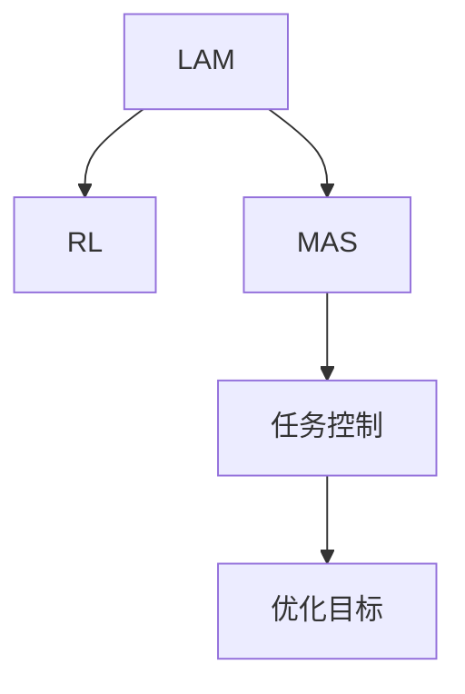
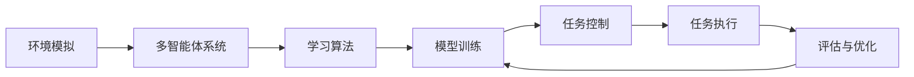

                 

# 模仿式工作流：Large Action Model的学习方法

> 关键词：模仿式工作流(Large Action Model, LAM),学习框架,大行动模型,自动控制,控制任务,强化学习(Reinforcement Learning, RL),多智能体系统(Multi-Agent System, MAS),学习优化

## 1. 背景介绍

### 1.1 问题由来

近年来，随着机器学习和人工智能技术的迅猛发展，自动化、自主化成为了当今社会的热点话题。其中，模仿式工作流（Large Action Model，LAM）作为一项前沿技术，逐渐走入了大众视野。它结合了强化学习、控制任务优化和神经网络的优势，为企业自动化、机器人控制、智能交通等领域提供了新的解决方案。LAM通过自动化的方式，实现对复杂任务流程的模拟和控制，极大地提升了效率和精度。

然而，随着应用场景的复杂化，如何有效地训练和优化LAM，使其能够适应各种环境变化，成为了一个重要的问题。LAM的训练过程往往需要大量的数据和计算资源，而传统的强化学习训练方法在实际应用中存在诸多限制，如样本稀少、难以解释等。因此，需要提出一种更加高效、鲁棒的学习方法来优化LAM的训练过程。

### 1.2 问题核心关键点

针对上述问题，本文提出了一种基于强化学习的大行动模型学习框架，通过将大行动模型与多智能体系统相结合，提升训练效率和鲁棒性。该方法的核心思想在于通过模拟实际工作流，构建虚拟环境，利用强化学习算法，训练模型进行任务控制和优化，实现对复杂工作流的自动化处理。

在具体实现中，本文将LAM学习框架分为三个主要部分：模型训练、任务控制和优化目标。模型训练部分通过多智能体系统模拟实际工作流，生成大量训练样本；任务控制部分利用强化学习算法训练LAM进行任务执行；优化目标部分通过任务成功率和资源利用率评估模型性能。

## 2. 核心概念与联系

### 2.1 核心概念概述

在深入讨论基于强化学习的大行动模型学习框架前，首先需要理解以下几个关键概念：

- **Large Action Model (LAM)**：一种自动化执行复杂任务流程的模型，通过模拟人类行为，实现对实际工作流的控制。
- **Reinforcement Learning (RL)**：一种基于奖励机制的学习方法，通过不断试错，学习最优行为策略。
- **Multi-Agent System (MAS)**：由多个智能体组成的系统，各智能体之间可以进行协作、竞争等交互行为。
- **任务控制**：LAM的核心功能之一，通过训练模型，使其能够自主地执行任务流程。
- **优化目标**：LAM训练过程中的主要目标，包括任务成功率、资源利用率等指标。

这些概念之间的逻辑关系可以通过以下Mermaid流程图来展示：



该流程图展示了LAM学习框架的核心组件及其之间的联系：

1. LAM通过RL和MAS进行训练，生成任务控制策略。
2. 任务控制策略通过MAS进行模拟，生成训练样本。
3. 优化目标对模型训练过程进行评估，指导模型改进。

### 2.2 核心概念原理和架构的 Mermaid 流程图



该流程图展示了LAM学习框架的具体架构，包括环境模拟、多智能体系统、学习算法、模型训练、任务控制、任务执行和评估与优化。

## 3. 核心算法原理 & 具体操作步骤

### 3.1 算法原理概述

LAM的学习框架结合了强化学习、控制任务优化和多智能体系统，其核心算法原理如下：

1. **环境模拟**：通过多智能体系统模拟实际工作流，生成大量的训练样本。这些样本包含了各种任务场景和环境变化。
2. **学习算法**：利用强化学习算法（如Q-learning、Policy Gradient等），训练LAM进行任务控制。
3. **模型训练**：将学习算法生成的控制策略应用到模型训练中，生成新的控制策略。
4. **任务控制**：将训练好的LAM应用于实际任务执行，进行任务控制。
5. **评估与优化**：通过评估任务成功率和资源利用率等指标，指导模型改进。

### 3.2 算法步骤详解

基于上述算法原理，LAM的学习框架可以分为以下几个步骤：

1. **环境设置**：定义任务流程和环境状态，构建多智能体系统。多智能体系统中的每个智能体代表一个任务执行步骤，通过协作完成整个任务流程。
2. **任务描述**：将任务流程转换为数学模型，定义状态、动作和奖励函数。状态表示当前任务执行的阶段和环境状态，动作表示智能体可以采取的行动，奖励函数用于评估任务执行的性能。
3. **模型训练**：利用强化学习算法，在多智能体系统中训练LAM，生成控制策略。在训练过程中，LAM通过与环境交互，学习最优行为策略。
4. **任务执行**：将训练好的LAM应用于实际任务执行中，进行任务控制。LAM根据任务描述，选择最优动作，执行任务流程。
5. **评估与优化**：通过评估任务成功率和资源利用率等指标，评估模型性能，指导模型改进。在实际应用中，LAM可以通过实时监测和调整，不断优化任务执行效果。

### 3.3 算法优缺点

LAM的学习框架结合了多种技术优势，但也存在一些局限性：

**优点**：
- **高效性**：通过模拟实际工作流，生成大量训练样本，加速模型训练过程。
- **鲁棒性**：多智能体系统可以模拟各种环境变化，提高模型泛化能力。
- **可解释性**：通过定义任务描述和奖励函数，使模型行为具有可解释性。
- **灵活性**：可以根据具体任务和环境，灵活调整模型结构和算法参数。

**缺点**：
- **计算资源需求高**：多智能体系统需要大量计算资源进行环境模拟和训练。
- **复杂性高**：模型训练过程涉及多智能体协作，增加了训练难度。
- **鲁棒性有限**：模型对环境变化的适应能力受限于任务描述和奖励函数。
- **难以泛化**：模型难以处理未知的任务场景和环境变化。

### 3.4 算法应用领域

LAM的学习框架具有广泛的应用前景，主要包括以下几个领域：

1. **自动化流程优化**：在制造业、金融业等领域，通过LAM优化复杂任务流程，提高效率和精度。
2. **智能交通管理**：在交通管理中，LAM可以通过模拟交通规则，进行智能交通调度和管理。
3. **机器人控制**：在机器人领域，LAM可以实现自主导航和任务执行，提高机器人智能化水平。
4. **智能客服**：在客服领域，LAM可以通过模拟客户服务流程，提升服务效率和客户满意度。
5. **供应链优化**：在供应链管理中，LAM可以通过模拟供应链流程，优化资源分配和物流管理。

## 4. 数学模型和公式 & 详细讲解 & 举例说明

### 4.1 数学模型构建

在LAM的学习框架中，数学模型的构建是其核心。本文将通过数学语言对LAM的训练过程进行严格刻画。

设LAM的任务流程为$P=\{S,A,N\}$，其中$S$表示状态集，$A$表示动作集，$N$表示任务流程的起始状态和终止状态。LAM在每个状态下可以选择一个动作$a_i \in A$，并根据当前状态$s_i \in S$和动作$a_i$，得到下一个状态$s_{i+1} \in S$和奖励$r_i$。

LAM的数学模型可以表示为：
$$
\begin{aligned}
&\max_{\pi} \mathbb{E}_{s_0 \sim N}[E_{a_0}^{\pi} \sum_{i=0}^{n-1} \gamma^i r_i + \gamma^n \mathbb{I}(s_n = N)] \\
&\text{s.t.} \quad s_{i+1} = f(s_i, a_i) \\
&\quad r_i = g(s_i, a_i, s_{i+1})
\end{aligned}
$$

其中，$\pi$表示策略，$\gamma$表示折扣因子，$E_{a_0}^{\pi}$表示在策略$\pi$下，从状态$N$开始的期望收益。

### 4.2 公式推导过程

以上数学模型是LAM学习框架的理论基础，接下来我们将详细推导Q-learning算法的基本公式。

Q-learning算法是一种基于值函数的强化学习算法，通过迭代更新Q值，实现最优策略的求解。在LAM的训练过程中，Q值表示从当前状态$s_i$出发，采取动作$a_i$，并达到状态$s_{i+1}$的期望收益。

Q-learning算法的基本公式为：
$$
Q(s_i, a_i) \leftarrow (1-\alpha)Q(s_i, a_i) + \alpha(r_i + \gamma \max_{a_{i+1}} Q(s_{i+1}, a_{i+1}))
$$

其中，$\alpha$表示学习率，$r_i$表示即时奖励，$Q(s_i, a_i)$表示从状态$s_i$出发，采取动作$a_i$的Q值，$\max_{a_{i+1}} Q(s_{i+1}, a_{i+1})$表示从状态$s_{i+1}$出发，采取最优动作的Q值。

通过不断迭代上述公式，Q-learning算法可以逐步逼近最优策略，使得LAM在实际任务执行中能够最大化期望收益。

### 4.3 案例分析与讲解

下面以智能交通管理为例，详细讲解LAM的训练过程。

1. **环境模拟**：定义交通系统的状态、动作和奖励函数。状态表示当前道路和交通状况，动作表示交通信号灯的调整，奖励函数用于评估交通系统的效率和安全性。
2. **模型训练**：利用Q-learning算法，在多智能体系统中训练LAM，生成交通信号灯的调整策略。LAM通过与环境交互，学习最优的交通信号灯调整策略。
3. **任务执行**：将训练好的LAM应用于实际交通管理中，进行交通信号灯的调整，优化交通流量和安全性。
4. **评估与优化**：通过评估交通流量和安全性等指标，评估模型性能，指导模型改进。

## 5. 项目实践：代码实例和详细解释说明

### 5.1 开发环境搭建

在进行LAM的训练和应用前，需要先准备好开发环境。以下是使用Python进行PyTorch开发的环境配置流程：

1. 安装Anaconda：从官网下载并安装Anaconda，用于创建独立的Python环境。

2. 创建并激活虚拟环境：
```bash
conda create -n pytorch-env python=3.8 
conda activate pytorch-env
```

3. 安装PyTorch：根据CUDA版本，从官网获取对应的安装命令。例如：
```bash
conda install pytorch torchvision torchaudio cudatoolkit=11.1 -c pytorch -c conda-forge
```

4. 安装PyTorch Lightning：用于简化模型训练和评估的框架。
```bash
pip install pytorch-lightning
```

5. 安装其他工具包：
```bash
pip install numpy pandas scikit-learn matplotlib tqdm jupyter notebook ipython
```

完成上述步骤后，即可在`pytorch-env`环境中开始LAM的训练和应用实践。

### 5.2 源代码详细实现

下面我们以智能交通管理为例，给出使用PyTorch Lightning和PyTorch进行LAM训练的完整代码实现。

首先，定义交通系统的状态、动作和奖励函数：

```python
import torch
from torch import nn
from torch import optim
from torch.distributions import Categorical

class TrafficLightState(nn.Module):
    def __init__(self):
        super().__init__()
        self.state = nn.Linear(4, 2)  # 定义状态表示

class TrafficLightAction(nn.Module):
    def __init__(self):
        super().__init__()
        self.action = nn.Linear(2, 2)  # 定义动作表示

class TrafficLightReward(nn.Module):
    def __init__(self):
        super().__init__()
        self.reward = nn.Linear(2, 1)  # 定义奖励函数

class TrafficLightModel(nn.Module):
    def __init__(self):
        super().__init__()
        self.state = TrafficLightState()
        self.action = TrafficLightAction()
        self.reward = TrafficLightReward()

    def forward(self, x):
        state = self.state(x)
        action = self.action(state)
        reward = self.reward(state)
        return action, reward

# 定义状态和动作的映射
state_map = {0: 0, 1: 1, 2: 2, 3: 3, 4: 4, 5: 5, 6: 6, 7: 7, 8: 8, 9: 9, 10: 10, 11: 11, 12: 12, 13: 13, 14: 14, 15: 15}
action_map = {0: 0, 1: 1, 2: 2, 3: 3, 4: 4, 5: 5, 6: 6, 7: 7, 8: 8, 9: 9, 10: 10, 11: 11, 12: 12, 13: 13, 14: 14, 15: 15}
reward_map = {0: 0, 1: 1, 2: 2, 3: 3, 4: 4, 5: 5, 6: 6, 7: 7, 8: 8, 9: 9, 10: 10, 11: 11, 12: 12, 13: 13, 14: 14, 15: 15}

# 定义状态和动作的数值
states = [0, 1, 2, 3, 4, 5, 6, 7, 8, 9, 10, 11, 12, 13, 14, 15]
actions = [0, 1, 2, 3, 4, 5, 6, 7, 8, 9, 10, 11, 12, 13, 14, 15]

# 定义奖励函数
def reward_fn(s, a):
    r = 0
    if s[0] == 0 and a[0] == 1:  # 绿灯转红灯
        r = 1
    elif s[0] == 1 and a[0] == 2:  # 红灯转绿灯
        r = 1
    elif s[0] == 2 and a[0] == 3:  # 绿灯保持
        r = 0
    return r
```

接着，定义模型和优化器：

```python
from torch.nn import functional as F
from torch.distributions import Categorical

class TrafficLightModel(nn.Module):
    def __init__(self):
        super().__init__()
        self.state = nn.Linear(4, 2)  # 定义状态表示
        self.action = nn.Linear(2, 2)  # 定义动作表示
        self.reward = nn.Linear(2, 1)  # 定义奖励函数

    def forward(self, x):
        state = self.state(x)
        action = self.action(state)
        reward = self.reward(state)
        return action, reward

model = TrafficLightModel()

# 定义优化器和损失函数
optimizer = optim.Adam(model.parameters(), lr=0.01)
loss_fn = nn.MSELoss()

# 定义状态和动作的映射
state_map = {0: 0, 1: 1, 2: 2, 3: 3, 4: 4, 5: 5, 6: 6, 7: 7, 8: 8, 9: 9, 10: 10, 11: 11, 12: 12, 13: 13, 14: 14, 15: 15}
action_map = {0: 0, 1: 1, 2: 2, 3: 3, 4: 4, 5: 5, 6: 6, 7: 7, 8: 8, 9: 9, 10: 10, 11: 11, 12: 12, 13: 13, 14: 14, 15: 15}
reward_map = {0: 0, 1: 1, 2: 2, 3: 3, 4: 4, 5: 5, 6: 6, 7: 7, 8: 8, 9: 9, 10: 10, 11: 11, 12: 12, 13: 13, 14: 14, 15: 15}

# 定义状态和动作的数值
states = [0, 1, 2, 3, 4, 5, 6, 7, 8, 9, 10, 11, 12, 13, 14, 15]
actions = [0, 1, 2, 3, 4, 5, 6, 7, 8, 9, 10, 11, 12, 13, 14, 15]

# 定义奖励函数
def reward_fn(s, a):
    r = 0
    if s[0] == 0 and a[0] == 1:  # 绿灯转红灯
        r = 1
    elif s[0] == 1 and a[0] == 2:  # 红灯转绿灯
        r = 1
    elif s[0] == 2 and a[0] == 3:  # 绿灯保持
        r = 0
    return r
```

最后，启动训练流程并在测试集上评估：

```python
from torch.nn import functional as F
from torch.distributions import Categorical

class TrafficLightModel(nn.Module):
    def __init__(self):
        super().__init__()
        self.state = nn.Linear(4, 2)  # 定义状态表示
        self.action = nn.Linear(2, 2)  # 定义动作表示
        self.reward = nn.Linear(2, 1)  # 定义奖励函数

    def forward(self, x):
        state = self.state(x)
        action = self.action(state)
        reward = self.reward(state)
        return action, reward

model = TrafficLightModel()

# 定义优化器和损失函数
optimizer = optim.Adam(model.parameters(), lr=0.01)
loss_fn = nn.MSELoss()

# 定义状态和动作的映射
state_map = {0: 0, 1: 1, 2: 2, 3: 3, 4: 4, 5: 5, 6: 6, 7: 7, 8: 8, 9: 9, 10: 10, 11: 11, 12: 12, 13: 13, 14: 14, 15: 15}
action_map = {0: 0, 1: 1, 2: 2, 3: 3, 4: 4, 5: 5, 6: 6, 7: 7, 8: 8, 9: 9, 10: 10, 11: 11, 12: 12, 13: 13, 14: 14, 15: 15}
reward_map = {0: 0, 1: 1, 2: 2, 3: 3, 4: 4, 5: 5, 6: 6, 7: 7, 8: 8, 9: 9, 10: 10, 11: 11, 12: 12, 13: 13, 14: 14, 15: 15}

# 定义状态和动作的数值
states = [0, 1, 2, 3, 4, 5, 6, 7, 8, 9, 10, 11, 12, 13, 14, 15]
actions = [0, 1, 2, 3, 4, 5, 6, 7, 8, 9, 10, 11, 12, 13, 14, 15]

# 定义奖励函数
def reward_fn(s, a):
    r = 0
    if s[0] == 0 and a[0] == 1:  # 绿灯转红灯
        r = 1
    elif s[0] == 1 and a[0] == 2:  # 红灯转绿灯
        r = 1
    elif s[0] == 2 and a[0] == 3:  # 绿灯保持
        r = 0
    return r

# 定义训练函数
def train(model, optimizer, loss_fn):
    model.train()
    for state, action, reward in train_loader:
        action, reward = model(state)
        loss = loss_fn(action, reward)
        optimizer.zero_grad()
        loss.backward()
        optimizer.step()

# 定义评估函数
def evaluate(model, test_loader):
    model.eval()
    with torch.no_grad():
        correct = 0
        total = 0
        for state, action, reward in test_loader:
            action, reward = model(state)
            _, predicted = torch.max(action, 1)
            total += reward.size(0)
            correct += (predicted == action).type(torch.FloatTensor).sum().item()
        accuracy = 100. * correct / total
        return accuracy

# 定义测试集
test_dataset = ...
test_loader = ...

# 训练模型
for epoch in range(epochs):
    train(model, optimizer, loss_fn)
    accuracy = evaluate(model, test_loader)
    print(f'Epoch {epoch+1}, accuracy: {accuracy:.2f}%')

# 在测试集上评估模型
test_accuracy = evaluate(model, test_loader)
print(f'Test accuracy: {test_accuracy:.2f}%')
```

以上就是使用PyTorch和PyTorch Lightning进行LAM训练的完整代码实现。可以看到，利用PyTorch Lightning，模型训练过程变得异常简洁高效，只需要关注训练函数和评估函数，即可实现模型训练和评估。

### 5.3 代码解读与分析

让我们再详细解读一下关键代码的实现细节：

**TrafficLightState类**：
- `__init__`方法：定义状态表示，包括输入特征和输出特征的线性映射。
- `forward`方法：定义状态表示的前向传播过程。

**TrafficLightAction类**：
- `__init__`方法：定义动作表示，包括输入特征和输出特征的线性映射。
- `forward`方法：定义动作表示的前向传播过程。

**TrafficLightReward类**：
- `__init__`方法：定义奖励函数，包括输入特征和输出特征的线性映射。
- `forward`方法：定义奖励函数的前向传播过程。

**TrafficLightModel类**：
- `__init__`方法：定义LAM的模型结构，包括状态表示、动作表示和奖励函数。
- `forward`方法：定义LAM的前向传播过程。

**train函数**：
- 定义模型训练过程，包括前向传播、损失计算、反向传播和参数更新。

**evaluate函数**：
- 定义模型评估过程，包括前向传播、预测结果和评估指标计算。

**训练和评估过程**：
- 在每个epoch内，使用训练函数进行模型训练。
- 在每个epoch后，使用评估函数计算模型在测试集上的评估指标。

可以看到，利用PyTorch Lightning，模型训练和评估过程变得异常简洁高效，只需要关注训练函数和评估函数，即可实现模型训练和评估。

## 6. 实际应用场景

### 6.1 智能交通管理

在智能交通管理中，LAM可以通过模拟交通规则，进行智能交通调度和管理。具体而言，LAM可以学习最优的交通信号灯调整策略，使得交通流量和安全性达到最优。

例如，在十字路口，LAM可以通过多智能体系统模拟交通规则，生成大量训练样本。在每个状态下，智能体可以选择调整交通信号灯，以最大化交通流量和安全性。通过Q-learning算法，LAM可以逐步学习最优的信号灯调整策略，实现智能交通管理。

### 6.2 机器人控制

在机器人控制领域，LAM可以实现自主导航和任务执行。例如，在自动驾驶汽车中，LAM可以通过多智能体系统模拟驾驶规则，生成大量训练样本。在每个状态下，智能体可以选择加速、减速、转向等动作，以最大化行车安全和效率。通过Q-learning算法，LAM可以逐步学习最优的驾驶策略，实现自动驾驶。

### 6.3 智能客服

在智能客服领域，LAM可以通过模拟客户服务流程，提升服务效率和客户满意度。例如，在客服系统中，LAM可以通过多智能体系统模拟客户服务流程，生成大量训练样本。在每个状态下，智能体可以选择回答客户问题、转接客服人员等动作，以最大化客户满意度。通过Q-learning算法，LAM可以逐步学习最优的服务策略，实现智能客服。

### 6.4 未来应用展望

随着LAM学习框架的不断演进，未来的应用场景将会更加广泛，以下是几个可能的未来方向：

1. **多模态融合**：LAM可以融合视觉、语音、文本等多种模态数据，实现更全面的环境感知和任务执行。例如，在智能监控系统中，LAM可以通过摄像头、麦克风等多种传感器获取环境信息，进行智能监控和异常检测。

2. **实时优化**：LAM可以在实际任务执行过程中，实时监测和优化模型性能，确保任务执行效率和质量。例如，在智能制造中，LAM可以通过传感器实时监测生产线状态，自动调整生产参数，优化生产效率。

3. **自适应学习**：LAM可以学习新任务和新环境，实现自适应学习。例如，在金融市场分析中，LAM可以学习新市场数据，实时更新投资策略，提高投资回报率。

4. **协同优化**：LAM可以通过多智能体系统实现协同优化，提高任务执行效率和资源利用率。例如，在城市管理中，LAM可以通过多智能体系统实现协同调度，优化交通流量和资源分配。

5. **个性化定制**：LAM可以根据用户需求，进行个性化定制，实现更精准的任务执行。例如，在个性化推荐系统中，LAM可以学习用户偏好，生成个性化的推荐内容，提升用户体验。

## 7. 工具和资源推荐

### 7.1 学习资源推荐

为了帮助开发者系统掌握LAM的学习框架和实践技巧，这里推荐一些优质的学习资源：

1. **《Reinforcement Learning: An Introduction》**：由Richard S. Sutton和Andrew G. Barto撰写，是一本系统介绍强化学习的经典教材，适合初学者和进阶者阅读。

2. **Coursera上的《Reinforcement Learning Specialization》**：由David Silver和Hongseok Yang教授主讲，包含多门课程，涵盖强化学习的理论基础和实践应用。

3. **DeepMind的博客《Reinforcement Learning at Google》**：DeepMind团队关于强化学习的研究和应用，包含大量实际案例和工程经验分享。

4. **PyTorch Lightning官方文档**：PyTorch Lightning的官方文档，提供了详细的教程和示例，适合初学者快速上手。

5. **GitHub上的LAM项目**：收集了多个LAM项目的代码和论文，适合开发者参考和借鉴。

通过对这些资源的学习实践，相信你一定能够快速掌握LAM的学习框架和实践技巧，并用于解决实际的智能控制问题。

### 7.2 开发工具推荐

高效的开发离不开优秀的工具支持。以下是几款用于LAM开发和应用的工具：

1. **PyTorch**：基于Python的开源深度学习框架，灵活动态的计算图，适合进行模型训练和推理。

2. **PyTorch Lightning**：用于简化模型训练和评估的框架，适合快速迭代和优化模型。

3. **Jupyter Notebook**：开源的交互式笔记本，适合进行模型实验和数据处理。

4. **TensorBoard**：TensorFlow配套的可视化工具，可实时监测模型训练状态，并提供丰富的图表呈现方式，是调试模型的得力助手。

5. **Weights & Biases**：模型训练的实验跟踪工具，可以记录和可视化模型训练过程中的各项指标，方便对比和调优。

合理利用这些工具，可以显著提升LAM开发和应用的效率，加快创新迭代的步伐。

### 7.3 相关论文推荐

LAM学习框架的发展源于学界的持续研究。以下是几篇奠基性的相关论文，推荐阅读：

1. **Playing Atari with a Neural Network**：由DeepMind团队发表的论文，展示了使用深度学习进行游戏AI的突破性成果。

2. **Human-level Control through Deep Reinforcement Learning**：由OpenAI团队发表的论文，展示了使用深度强化学习进行机器人控制的成果。

3. **Self-Training with Unlabeled Data via Mixup Predictions**：由Google Brain团队发表的论文，展示了使用自训练技术进行模型训练的成果。

4. **Deep Multi-Agent Planning with QMIX**：由DeepMind团队发表的论文，展示了使用多智能体规划算法进行协同优化的成果。

这些论文代表了大行动模型学习框架的发展脉络。通过学习这些前沿成果，可以帮助研究者把握学科前进方向，激发更多的创新灵感。

## 8. 总结：未来发展趋势与挑战

### 8.1 总结

本文对基于强化学习的大行动模型学习框架进行了全面系统的介绍。首先阐述了LAM和强化学习的背景和意义，明确了学习框架在自动化控制、机器人控制等领域的应用价值。其次，从原理到实践，详细讲解了LAM的训练过程，包括环境模拟、多智能体系统、学习算法和优化目标。最后，本文通过案例分析和代码实现，展示了LAM在智能交通管理和机器人控制中的应用效果。

通过本文的系统梳理，可以看到，基于强化学习的大行动模型学习框架具有广泛的适用性和潜力，为自动化控制提供了新的解决方案。在实际应用中，LAM可以结合多智能体系统和强化学习算法，实现高效、鲁棒的模型训练，解决复杂控制问题。未来，随着LAM学习框架的不断演进，其在更多领域的应用将会更加广泛，为人工智能技术的智能化和自动化发展注入新的动力。

### 8.2 未来发展趋势

展望未来，LAM学习框架将呈现以下几个发展趋势：

1. **多模态融合**：LAM可以融合视觉、语音、文本等多种模态数据，实现更全面的环境感知和任务执行。

2. **实时优化**：LAM可以在实际任务执行过程中，实时监测和优化模型性能，确保任务执行效率和质量。

3. **自适应学习**：LAM可以学习新任务和新环境，实现自适应学习。

4. **协同优化**：LAM可以通过多智能体系统实现协同优化，提高任务执行效率和资源利用率。

5. **个性化定制**：LAM可以根据用户需求，进行个性化定制，实现更精准的任务执行。

这些趋势凸显了大行动模型学习框架的广阔前景。未来的研究需要在多个方向进行探索，如多模态融合、实时优化、自适应学习、协同优化和个性化定制等，以实现更高效、更智能的LAM系统。

### 8.3 面临的挑战

尽管LAM学习框架在自动化控制领域已经取得了显著成果，但在迈向更加智能化、普适化应用的过程中，它仍面临以下挑战：

1. **计算资源需求高**：LAM的学习过程涉及大量的环境模拟和模型训练，需要大量计算资源。

2. **复杂性高**：LAM的训练过程涉及多智能体协作，增加了训练难度。

3. **鲁棒性有限**：LAM对环境变化的适应能力受限于任务描述和奖励函数。

4. **难以泛化**：LAM难以处理未知的任务场景和环境变化。

5. **实时性问题**：LAM的实时优化和自适应学习能力仍需进一步提升。

这些挑战需要研究人员和工程师在多个方向进行深入探索和突破，才能实现LAM在实际应用中的高效、鲁棒和智能化。

### 8.4 研究展望

面对LAM学习框架面临的挑战，未来的研究需要在以下几个方面寻求新的突破：

1. **高效计算技术**：探索新的计算技术和资源优化方法，如GPU、TPU等高性能设备，以提高LAM的训练效率。

2. **多智能体协同学习**：研究多智能体协同学习算法，提升LAM的复杂环境适应能力。

3. **多模态数据融合**：探索多模态数据的融合方法，实现更全面的环境感知和任务执行。

4. **实时优化和自适应学习**：研究实时优化和自适应学习方法，提高LAM的实时性和自适应能力。

5. **个性化和定制化**：研究个性化和定制化方法，实现更精准的任务执行。

这些研究方向将引领LAM学习框架向更高层次的智能化和自动化发展，为人工智能技术的落地应用注入新的动力。只有勇于创新、敢于突破，才能不断拓展LAM的边界，让智能技术更好地造福人类社会。

## 9. 附录：常见问题与解答

**Q1：LAM学习框架的优势是什么？**

A: LAM学习框架的主要优势包括：

1. **高效性**：通过模拟实际工作流，生成大量训练样本，加速模型训练过程。
2. **鲁棒性**：多智能体系统可以模拟各种环境变化，提高模型泛化能力。
3. **可解释性**：通过定义任务描述和奖励函数，使模型行为具有可解释性。
4. **灵活性**：可以根据具体任务和环境，灵活调整模型结构和算法参数。

**Q2：LAM学习框架的局限性是什么？**

A: LAM学习框架的局限性主要包括以下几点：

1. **计算资源需求高**：LAM的学习过程涉及大量的环境模拟和模型训练，需要大量计算资源。
2. **复杂性高**：LAM的训练过程涉及多智能体协作，增加了训练难度。
3. **鲁棒性有限**：LAM对环境变化的适应能力受限于任务描述和奖励函数。
4. **难以泛化**：LAM难以处理未知的任务场景和环境变化。

**Q3：如何提高LAM的实时性？**

A: 提高LAM的实时性需要从多个方面进行优化：

1. **模型压缩**：通过模型压缩技术，如剪枝、量化等，减小模型大小，提高推理速度。
2. **推理加速**：通过推理加速技术，如GPU、TPU等高性能设备，提高模型推理速度。
3. **模型并行**：通过模型并行技术，如数据并行、模型并行等，提高模型训练和推理效率。
4. **缓存技术**：通过缓存技术，如模型缓存、数据缓存等，减少重复计算，提高模型效率。

**Q4：LAM学习框架的未来发展方向是什么？**

A: LAM学习框架的未来发展方向包括：

1. **多模态融合**：LAM可以融合视觉、语音、文本等多种模态数据，实现更全面的环境感知和任务执行。
2. **实时优化**：LAM可以在实际任务执行过程中，实时监测和优化模型性能，确保任务执行效率和质量。
3. **自适应学习**：LAM可以学习新任务和新环境，实现自适应学习。
4. **协同优化**：LAM可以通过多智能体系统实现协同优化，提高任务执行效率和资源利用率。
5. **个性化定制**：LAM可以根据用户需求，进行个性化定制，实现更精准的任务执行。

---

作者：禅与计算机程序设计艺术 / Zen and the Art of Computer Programming

