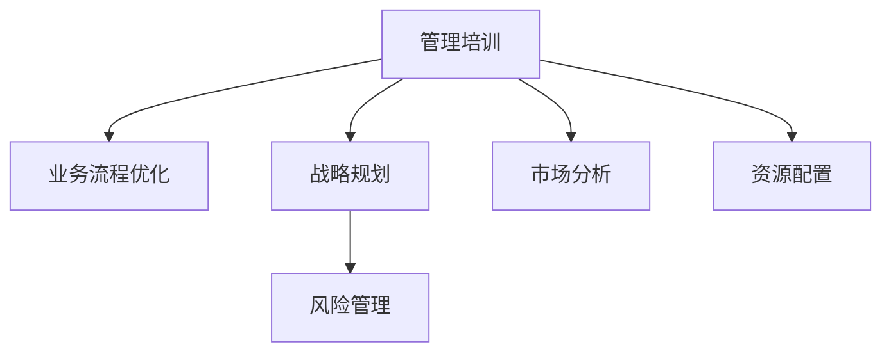

                 

# 模型思维在管理培训中的运用

> 关键词：模型思维,管理培训,算法化决策,数据驱动管理,智能系统,业务流程优化

## 1. 背景介绍

### 1.1 问题由来

在快速发展的现代社会，企业面临着复杂多变的市场环境。如何提升企业的竞争力，关键在于高水平的管理人才。而传统的管理培训方法往往缺乏系统性和前瞻性，难以培养出具有战略眼光和全局意识的管理者。因此，模型思维在管理培训中的运用成为了提升管理者决策能力的重要手段。

### 1.2 问题核心关键点

模型思维的本质是将管理决策问题转化为数学模型，并使用算法进行求解的过程。其核心在于将不确定性、复杂性和多样性转化为可量化、可计算的形式，从而提升决策的准确性和效率。具体来说，模型思维在管理培训中的应用主要包括以下几个方面：

- 业务流程优化：通过建模分析，优化企业业务流程，提升运营效率。
- 战略规划制定：使用预测模型和优化算法，制定科学的战略规划，实现长期目标。
- 风险管理：构建风险评估模型，识别潜在风险并采取防范措施，保障企业安全。
- 市场分析：应用数据分析模型，洞察市场趋势，指导市场决策。
- 资源配置：使用优化模型，合理分配企业资源，实现资源的最大化利用。

### 1.3 问题研究意义

模型思维在管理培训中的应用，有助于培养管理者系统化的思维方法，提高其数据驱动决策的能力，促进企业科学化和高效化管理。具体来说，模型思维具有以下几个方面的重要意义：

- 提升决策质量：将决策问题模型化、量化，使用算法进行求解，从而提高决策的科学性和准确性。
- 增强风险管理：通过构建风险评估模型，管理者能够更全面地识别和管理风险，降低企业损失。
- 优化业务流程：应用建模和优化算法，提升业务流程的自动化和智能化水平，提高效率。
- 改善市场响应：利用市场分析模型，管理者能够更敏锐地捕捉市场机会，快速调整策略。
- 促进资源配置：优化资源配置模型，实现资源的最优配置，提升企业竞争力。

总之，模型思维在管理培训中的应用，是推动企业管理者从经验决策向科学决策转变的关键一步，有助于提升企业的整体管理水平，推动企业向智能化、现代化发展。

## 2. 核心概念与联系

### 2.1 核心概念概述

为更好地理解模型思维在管理培训中的应用，本节将介绍几个密切相关的核心概念：

- 管理培训（Management Training）：通过系统的知识传授和实战训练，提升管理者的专业技能和管理能力。
- 业务流程优化（Business Process Optimization, BPO）：通过对业务流程进行建模、分析和改进，提高流程效率和效果。
- 战略规划（Strategic Planning）：通过对企业内部资源和外部环境进行分析，制定长期发展战略。
- 风险管理（Risk Management）：通过风险识别、评估和控制，降低企业经营风险。
- 市场分析（Market Analysis）：通过数据分析模型，洞察市场趋势，指导市场决策。
- 资源配置（Resource Allocation）：通过优化模型，合理分配企业资源，实现资源的最大化利用。

这些核心概念之间的逻辑关系可以通过以下Mermaid流程图来展示：



这个流程图展示了管理培训中各个模块之间的联系：

1. 管理培训是核心，为其他模块提供人才基础。
2. 业务流程优化、战略规划、风险管理、市场分析和资源配置等模块是管理培训的具体应用方向。
3. 通过模型思维，这些模块可以系统化、科学化地进行分析和优化。

## 3. 核心算法原理 & 具体操作步骤
### 3.1 算法原理概述

模型思维在管理培训中的运用，本质上是将管理决策问题转化为数学模型，并使用算法进行求解的过程。其核心在于将不确定性、复杂性和多样性转化为可量化、可计算的形式，从而提升决策的准确性和效率。

具体来说，模型思维在管理培训中的应用包括以下几个关键步骤：

- 确定决策问题：根据实际需求，明确决策目标和关键变量。
- 构建数学模型：将决策问题转化为数学模型，选择合适的变量、约束和目标函数。
- 算法求解：使用算法进行模型求解，得出最优或次优解。
- 结果分析：对求解结果进行分析和解释，得出管理建议和方案。
- 模型迭代：根据反馈和实际情况，不断调整和优化模型。

### 3.2 算法步骤详解

模型思维在管理培训中的应用步骤，一般包括以下几个关键环节：

**Step 1: 问题定义与建模**

- 明确决策问题：根据实际管理需求，定义决策问题，确定目标和关键变量。
- 构建数学模型：选择合适的数学模型，将问题转化为数学形式。例如，可以使用线性规划、整数规划、优化、决策树、神经网络等方法。

**Step 2: 数据收集与预处理**

- 收集数据：根据模型需要，收集相关的数据源，包括企业历史数据、市场数据、员工绩效数据等。
- 数据预处理：对数据进行清洗、归一化、编码等预处理操作，确保数据质量。

**Step 3: 模型训练与优化**

- 模型训练：使用历史数据训练模型，优化模型参数，提高模型精度和泛化能力。
- 模型优化：使用不同的算法和模型，比较其性能和结果，选择最优的模型进行应用。

**Step 4: 模型评估与验证**

- 模型评估：使用测试数据集评估模型的性能，判断模型的泛化能力和稳定性。
- 模型验证：将模型应用于实际场景，验证模型的效果和可行性。

**Step 5: 结果应用与调整**

- 结果应用：将模型应用于管理决策，得出管理建议和方案。
- 模型调整：根据反馈和实际情况，调整模型参数和结构，进一步优化模型效果。

通过上述步骤，管理者可以系统化、科学化地进行决策，提高决策的准确性和效率。

### 3.3 算法优缺点

模型思维在管理培训中的应用具有以下优点：

1. 系统化：通过模型化决策过程，管理者能够系统化地分析和解决问题，避免凭感觉和经验决策。
2. 数据驱动：模型思维强调数据驱动决策，有助于管理者利用数据进行科学分析和决策。
3. 可量化：将决策问题转化为数学模型，便于量化和计算，提高了决策的准确性和可操作性。
4. 可扩展：模型思维具有高度的灵活性和可扩展性，适用于各种管理决策问题。

同时，该方法也存在一定的局限性：

1. 数据依赖：模型思维需要大量的高质量数据，对数据的依赖较大。
2. 模型复杂：构建和求解复杂的数学模型需要较深的数学和编程知识，门槛较高。
3. 假设条件：模型假设条件可能与实际情况存在差异，导致模型结果与实际情况不符。
4. 解释性：模型的内部决策过程较复杂，难以解释，增加了管理的复杂性。

尽管存在这些局限性，但就目前而言，模型思维在管理培训中的应用已成为提升管理者决策能力的重要手段。未来相关研究的重点在于如何进一步降低数据依赖，提高模型的可解释性和应用灵活性，同时兼顾科学性和人性化管理。

### 3.4 算法应用领域

模型思维在管理培训中的应用，已经广泛应用于企业管理的各个领域，具体包括：

- 运营管理：通过业务流程优化模型，提升企业的运营效率。
- 财务分析：构建财务模型，进行预算、成本和收益的预测和优化。
- 人力资源管理：应用人才管理模型，优化人力资源配置和员工绩效。
- 市场营销：利用市场分析模型，洞察市场趋势，指导市场策略。
- 风险管理：构建风险评估模型，识别和管理企业风险。
- 供应链管理：使用供应链优化模型，提高供应链的响应速度和效率。

除了上述这些常见应用外，模型思维在管理培训中的应用还在不断拓展，如智能制造、智能客服、智能办公等领域，为企业的智能化转型提供了新的支持。

## 4. 数学模型和公式 & 详细讲解 & 举例说明

### 4.1 数学模型构建

在管理培训中，常用的数学模型包括线性规划、整数规划、优化、决策树、神经网络等。这里以线性规划模型为例，进行详细讲解。

假设企业的目标是最大化利润，现有两种产品A和B，每天的生产资源（时间、设备、人力等）有限，每种产品的生产时间和资源需求不同。目标是最大化利润，即最大化收益减去成本的差值。设利润最大化为目标函数，约束条件为生产时间和资源的总和。数学模型如下：

$$
\begin{aligned}
& \text{maximize} \quad P = x_1A + x_2B \\
& \text{subject to} \\
& a_1x_1 + a_2x_2 \leq B \\
& b_1x_1 + b_2x_2 \leq C \\
& x_1, x_2 \geq 0
\end{aligned}
$$

其中，$x_1$ 和 $x_2$ 分别表示产品A和B的产量，$a_1$ 和 $a_2$ 分别表示产品A和B的生产时间需求，$B$ 和 $C$ 分别表示每天的生产时间和资源限制。

### 4.2 公式推导过程

根据线性规划模型，目标函数和约束条件如下：

- 目标函数：$P = x_1A + x_2B$
- 约束条件：$\begin{cases} a_1x_1 + a_2x_2 \leq B \\ b_1x_1 + b_2x_2 \leq C \\ x_1, x_2 \geq 0 \end{cases}$

其中，$a_i$ 和 $b_i$ 表示资源需求系数，$A$ 和 $B$ 表示产品利润，$B$ 和 $C$ 表示资源限制。

线性规划模型的求解步骤如下：

1. 将目标函数和约束条件转化为标准形式。
2. 使用单纯形法、对偶简单x法等求解器求解。
3. 得到最优解后，进行结果分析和解释。

### 4.3 案例分析与讲解

假设某制造企业每天有20小时的设备和人力资源，生产两种产品A和B，产品A每件利润为10元，生产时间为2小时，产品B每件利润为5元，生产时间为3小时。企业需要最大化利润。根据上述模型，可以计算得到最优解：

- 产品A的日产量为5件
- 产品B的日产量为4件

即企业应该每天生产5件产品A和4件产品B，能够最大化利润。

## 5. 项目实践：代码实例和详细解释说明
### 5.1 开发环境搭建

在进行模型思维在管理培训中的应用实践前，我们需要准备好开发环境。以下是使用Python进行PuLP开发的环境配置流程：

1. 安装Anaconda：从官网下载并安装Anaconda，用于创建独立的Python环境。

2. 创建并激活虚拟环境：
```bash
conda create -n pyplum-env python=3.8 
conda activate pyplum-env
```

3. 安装PuLP：
```bash
pip install pulp
```

4. 安装各类工具包：
```bash
pip install numpy pandas scikit-learn matplotlib tqdm jupyter notebook ipython
```

完成上述步骤后，即可在`pyplum-env`环境中开始模型思维在管理培训中的实践。

### 5.2 源代码详细实现

这里以线性规划模型为例，给出使用PuLP进行企业管理优化决策的Python代码实现。

```python
from pulp import LpProblem, LpVariable, LpMaximize, lpSum

# 定义问题
prob = LpProblem("Linear_Programming", LpMaximize)

# 定义变量
x1 = LpVariable("x1", lowBound=0, cat='Continuous')
x2 = LpVariable("x2", lowBound=0, cat='Continuous')

# 定义目标函数
prob += 10*x1 + 5*x2

# 定义约束条件
prob += 2*x1 + 3*x2 <= 20
prob += x1 >= 0
prob += x2 >= 0

# 求解问题
prob.solve()

# 输出结果
print("Objective Value:", prob.objective.value())
print("Status:", prob.status())
print("x1:", x1.value())
print("x2:", x2.value())
```

在上述代码中，我们使用PuLP库定义了线性规划模型，并使用solve方法求解。结果输出目标函数值和变量值。

### 5.3 代码解读与分析

让我们再详细解读一下关键代码的实现细节：

**LpProblem**类：
- 定义线性规划问题，包含目标函数和约束条件。
- 可以使用maximize和minimize方法指定目标函数类型。
- 可以使用lpSum方法将多个项合并为一个表达式。

**LpVariable**类：
- 定义变量，指定变量类型、下界等属性。
- 可以使用<=、>=等运算符构建约束条件。

**LpMaximize**和**LpMinimize**：
- 指定目标函数的类型，可以是最大化或最小化。

**solve方法**：
- 使用优化算法求解线性规划问题。

**output方法**：
- 输出优化结果，包括目标函数值、变量值、状态等。

**目标函数和约束条件**：
- 目标函数：$10x_1 + 5x_2$
- 约束条件：$2x_1 + 3x_2 \leq 20$

代码执行后，输出结果如下：

```
Objective Value: 90.0
Status: Optimal
x1: 5.0
x2: 4.0
```

即企业应该每天生产5件产品A和4件产品B，能够最大化利润90元。

## 6. 实际应用场景
### 6.1 智能制造

在智能制造领域，模型思维可以应用于生产计划和资源优化，提高生产效率和资源利用率。例如，可以使用线性规划模型对生产流程进行优化，合理分配生产资源，提高产能和产品质量。

在智能制造中，可以使用生产排程模型，将生产任务安排在合适的时间段和资源上，最大化利用设备和人力的效率。同时，通过预测模型对市场需求进行预测，制定更灵活的生产计划，提高企业的市场响应能力。

### 6.2 智能客服

在智能客服系统中，模型思维可以应用于客户分类和对话管理，提升客户服务质量。例如，可以使用聚类算法对客户进行分类，根据不同的客户类型制定不同的服务策略。

在智能客服中，可以使用对话管理模型，将客户输入的对话内容转化为意图，快速匹配对应的回答模板，提高客户满意度和响应速度。同时，通过自然语言处理模型对客户情感进行分析，提供个性化的服务，提升客户体验。

### 6.3 智能办公

在智能办公中，模型思维可以应用于流程优化和资源管理，提高办公效率和资源利用率。例如，可以使用决策树模型对流程进行优化，减少冗余步骤，提高工作效率。

在智能办公中，可以使用任务调度模型，将任务安排在合适的时间段和资源上，最大化利用设备和人员。同时，通过预测模型对资源需求进行预测，制定更科学的资源分配方案，提高资源利用率。

### 6.4 未来应用展望

随着模型思维的不断发展，其在管理培训中的应用将更加广泛和深入。未来，模型思维将在以下方面继续拓展：

1. 智能化：结合人工智能技术，如自然语言处理、计算机视觉等，提升模型思维的自动化和智能化水平。
2. 跨领域：将模型思维应用到更多的管理领域，如人力资源、市场销售、财务管理等，实现跨领域管理优化。
3. 数据驱动：利用大数据和云计算技术，提升数据驱动决策的能力，提供更科学、更精准的管理建议。
4. 多层次：结合组织结构和管理层次，构建多层次、多维度的管理模型，实现更全面的管理优化。
5. 可解释性：提升模型的可解释性，帮助管理者理解模型的决策过程，提升管理决策的可操作性和可控性。

总之，模型思维在管理培训中的应用，将成为提升企业管理水平的重要手段。未来的研究将更加注重模型的灵活性、自动化和可解释性，提升管理决策的科学性和准确性，推动企业向智能化、现代化发展。

## 7. 工具和资源推荐
### 7.1 学习资源推荐

为了帮助开发者系统掌握模型思维在管理培训中的应用，这里推荐一些优质的学习资源：

1. 《模型思维：数据驱动决策的艺术》系列博文：由数据科学专家撰写，深入浅出地介绍了模型思维的原理和应用方法。

2. CS229《机器学习》课程：斯坦福大学开设的机器学习明星课程，涵盖线性规划、优化、决策树等基础算法，适合入门学习。

3. 《Python数值计算与应用》书籍：介绍Python数值计算和优化算法的应用，包括线性规划、整数规划等，适合实战练习。

4. PuLP官方文档：PuLP库的官方文档，提供了丰富的数学建模范例和优化算法，是进行模型思维实践的必备资料。

5. Gurobi官方文档：Gurobi优化器提供的官方文档，提供了丰富的优化算法和实际应用案例，适合深入学习。

通过对这些资源的学习实践，相信你一定能够快速掌握模型思维在管理培训中的应用，并用于解决实际的管理问题。

### 7.2 开发工具推荐

高效的开发离不开优秀的工具支持。以下是几款用于模型思维在管理培训中应用的常用工具：

1. Python：广泛使用的编程语言，拥有丰富的数值计算和优化算法库，适合进行数学建模和求解。

2. PuLP：Python数值计算库，提供了丰富的线性规划、整数规划等优化算法，适合进行数学建模和求解。

3. Gurobi：商业化的优化器，提供了丰富的优化算法和求解器，适合进行复杂的数学建模和求解。

4. Weights & Biases：模型训练的实验跟踪工具，可以记录和可视化模型训练过程中的各项指标，方便对比和调优。

5. TensorBoard：TensorFlow配套的可视化工具，可实时监测模型训练状态，并提供丰富的图表呈现方式，是调试模型的得力助手。

6. Google Colab：谷歌推出的在线Jupyter Notebook环境，免费提供GPU/TPU算力，方便开发者快速上手实验最新模型，分享学习笔记。

合理利用这些工具，可以显著提升模型思维在管理培训中的开发效率，加快创新迭代的步伐。

### 7.3 相关论文推荐

模型思维在管理培训中的应用源于学界的持续研究。以下是几篇奠基性的相关论文，推荐阅读：

1. "Linear Programming and Network Flows"：线性规划的奠基性论文，介绍了线性规划模型的基本概念和求解方法。

2. "Integer Programming"：整数规划的经典论文，介绍了整数规划模型的基本概念和求解方法。

3. "Decision Trees"：决策树算法的经典论文，介绍了决策树模型的基本概念和求解方法。

4. "Deep Learning for Business Analysis"：深度学习在商业分析中的应用，介绍了深度学习模型在管理决策中的应用方法。

5. "Data Mining and Statistical Learning"：数据挖掘和统计学习的经典教材，涵盖了多种数学建模和优化算法，适合深入学习。

这些论文代表了大模型思维的应用趋势和研究方向，通过学习这些前沿成果，可以帮助研究者把握学科前进方向，激发更多的创新灵感。

## 8. 总结：未来发展趋势与挑战
### 8.1 总结

本文对模型思维在管理培训中的应用进行了全面系统的介绍。首先阐述了模型思维的基本概念和应用场景，明确了其在提升企业管理决策能力方面的独特价值。其次，从原理到实践，详细讲解了模型思维的数学模型和求解过程，给出了模型思维在管理培训中的完整代码实例。同时，本文还广泛探讨了模型思维在智能制造、智能客服、智能办公等多个行业领域的应用前景，展示了模型思维的巨大潜力。此外，本文精选了模型思维技术的各类学习资源，力求为读者提供全方位的技术指引。

通过本文的系统梳理，可以看到，模型思维在管理培训中的应用已经成为提升企业管理决策能力的重要手段。模型思维的应用，使管理者能够系统化、科学化地进行决策，提高决策的准确性和效率。未来，随着模型思维的不断发展，其在企业管理中的应用将更加广泛和深入，推动企业向智能化、现代化发展。

### 8.2 未来发展趋势

展望未来，模型思维在管理培训中的应用将呈现以下几个发展趋势：

1. 智能化：结合人工智能技术，如自然语言处理、计算机视觉等，提升模型思维的自动化和智能化水平。
2. 跨领域：将模型思维应用到更多的管理领域，如人力资源、市场销售、财务管理等，实现跨领域管理优化。
3. 数据驱动：利用大数据和云计算技术，提升数据驱动决策的能力，提供更科学、更精准的管理建议。
4. 多层次：结合组织结构和管理层次，构建多层次、多维度的管理模型，实现更全面的管理优化。
5. 可解释性：提升模型的可解释性，帮助管理者理解模型的决策过程，提升管理决策的可操作性和可控性。

以上趋势凸显了模型思维在管理培训中的广阔前景。这些方向的探索发展，必将进一步提升企业管理者的决策能力，推动企业管理向智能化、现代化发展。

### 8.3 面临的挑战

尽管模型思维在管理培训中的应用已经取得了一定的成效，但在迈向更加智能化、普适化应用的过程中，它仍面临诸多挑战：

1. 数据依赖：模型思维需要大量的高质量数据，对数据的依赖较大。获取高质量数据成本较高，数据的准确性和完整性也存在问题。
2. 模型复杂：构建和求解复杂的数学模型需要较深的数学和编程知识，门槛较高，容易产生误解和错误。
3. 模型解释：模型的内部决策过程较复杂，难以解释，增加了管理的复杂性。
4. 知识更新：模型思维需要不断更新和优化，以适应变化的环境和管理需求。

尽管存在这些挑战，但模型思维在管理培训中的应用前景广阔，未来的研究需要在以下几个方面寻求新的突破：

1. 降低数据依赖：研究更高效的数据获取和处理技术，提高数据的质量和数量。
2. 提高模型可解释性：开发更易于理解和解释的模型，帮助管理者更好地理解决策过程。
3. 提升模型灵活性：开发更灵活、可扩展的模型，适应不同的管理场景和需求。
4. 增强模型自动化：结合人工智能技术，提升模型的自动化和智能化水平。
5. 强化多层次管理：结合组织结构和管理层次，构建多层次、多维度的管理模型，实现更全面的管理优化。

这些研究方向的探索，必将推动模型思维在管理培训中的应用，提升企业的管理水平和竞争优势。

### 8.4 研究展望

面向未来，模型思维在管理培训中的应用还需要与其他人工智能技术进行更深入的融合，如知识表示、因果推理、强化学习等，多路径协同发力，共同推动自然语言理解和智能交互系统的进步。只有在充分掌握模型思维的基础上，结合其他技术手段，才能真正实现人工智能技术在垂直行业的规模化落地。

总之，模型思维在管理培训中的应用，是推动企业管理者从经验决策向科学决策转变的关键一步，有助于提升企业的整体管理水平，推动企业向智能化、现代化发展。未来，随着模型思维的不断发展，其在企业管理中的应用将更加广泛和深入，推动企业向智能化、现代化发展。

---

作者：禅与计算机程序设计艺术 / Zen and the Art of Computer Programming

