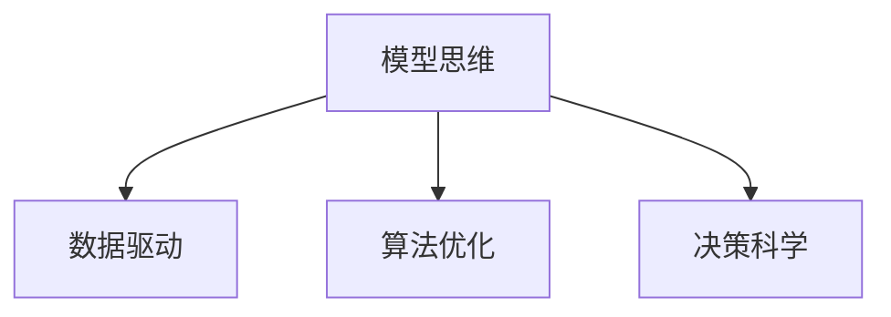

                 

## 1. 背景介绍

在快速发展的信息时代，企业运营面临着复杂多变的市场环境、激烈的竞争压力和不断变化的客户需求。企业管理者需要做出迅速、有效的决策，才能在激烈的市场竞争中保持领先地位。传统的经验式管理方式难以满足这些要求，因此，越来越多的企业开始引入模型思维，以数据和算法为基础，提升管理决策的效率和准确性。

模型思维是一种基于数据驱动和算法优化的方法，通过构建和管理模型来辅助决策，提升企业运营效率。本文将深入探讨模型思维的原理、操作步骤、应用领域，并结合具体案例，分析模型思维对管理效率的提升。

## 2. 核心概念与联系

### 2.1 核心概念概述

#### a. 模型思维

模型思维是一种通过构建和管理数学或统计模型，利用数据和算法辅助决策的方法。其核心思想是将复杂的管理问题转化为数学模型，通过优化模型参数，找到最优解决方案，从而提高决策效率和准确性。

#### b. 数据驱动

数据驱动是指在决策过程中，充分依赖数据，利用数据分析工具和技术，辅助形成科学、合理的决策方案。数据驱动强调基于实证的研究方法，避免主观臆断。

#### c. 算法优化

算法优化是指通过设计、开发和应用优化算法，提升模型的性能和效果。算法优化涉及模型构建、参数调优、特征选择等多个环节，是模型思维的核心组成部分。

#### d. 决策科学

决策科学是运用数据、模型和算法，进行科学决策的学科。其核心在于将复杂问题简化，利用数学模型进行分析和预测，从而辅助管理者做出更加科学、合理的决策。

这些核心概念之间的逻辑关系可以通过以下Mermaid流程图来展示：



## 3. 核心算法原理 & 具体操作步骤

### 3.1 算法原理概述

模型思维的核心在于构建和管理模型。模型思维的过程包括数据收集、模型构建、参数调优和结果解释等多个步骤。模型构建一般基于以下步骤：

1. **问题建模**：将管理问题转化为数学模型，确定模型的输入变量、输出变量和目标函数。
2. **数据预处理**：对数据进行清洗、归一化、特征选择等预处理，以便于后续建模。
3. **模型训练**：利用训练数据对模型进行训练，调整模型参数，优化模型性能。
4. **模型评估**：利用测试数据对模型进行评估，检验模型的泛化能力和预测准确性。
5. **模型应用**：将优化后的模型应用于实际问题中，辅助决策。

### 3.2 算法步骤详解

#### 3.2.1 问题建模

问题建模是将管理问题转化为数学模型的过程。具体步骤如下：

1. **确定目标**：明确管理问题的目标，如成本最小化、利润最大化、风险控制等。
2. **确定变量**：确定模型中的输入变量和输出变量，输入变量通常包括时间、资源、成本等，输出变量通常为决策结果。
3. **建立方程**：根据问题特点，建立数学方程，如线性规划、非线性规划、优化模型等。

#### 3.2.2 数据预处理

数据预处理是指对原始数据进行清洗、归一化、特征选择等操作，以提高模型的性能和预测准确性。具体步骤如下：

1. **数据清洗**：去除噪声数据、处理缺失值、处理异常值等，确保数据质量。
2. **数据归一化**：对数据进行归一化处理，如标准化、归一化等，以便于后续建模。
3. **特征选择**：根据问题特点，选择对模型预测有用的特征，减少维度灾难。

#### 3.2.3 模型训练

模型训练是指利用训练数据对模型进行训练，调整模型参数，优化模型性能。具体步骤如下：

1. **选择模型**：根据问题特点，选择合适的模型，如线性回归、决策树、支持向量机等。
2. **数据分割**：将数据集分为训练集和测试集，用于模型训练和评估。
3. **模型训练**：利用训练数据对模型进行训练，调整模型参数，优化模型性能。

#### 3.2.4 模型评估

模型评估是指利用测试数据对模型进行评估，检验模型的泛化能力和预测准确性。具体步骤如下：

1. **划分测试集**：将数据集分为测试集和验证集，用于模型评估和调优。
2. **模型评估**：利用测试集对模型进行评估，计算误差、精度、召回率等指标。
3. **模型调优**：根据评估结果，调整模型参数，优化模型性能。

#### 3.2.5 模型应用

模型应用是指将优化后的模型应用于实际问题中，辅助决策。具体步骤如下：

1. **模型集成**：将模型集成到实际应用中，如企业管理系统、智能决策系统等。
2. **数据输入**：输入实际数据到模型中，得到预测结果。
3. **结果解释**：对模型的预测结果进行解释，形成决策方案。

### 3.3 算法优缺点

模型思维具有以下优点：

1. **数据驱动**：模型思维以数据为基础，能够提供科学的决策支持，避免主观臆断。
2. **量化评估**：模型思维能够提供量化的评估指标，如误差、精度、召回率等，便于对比和选择。
3. **自动化优化**：模型思维能够通过算法优化，自动调整模型参数，提高预测准确性。
4. **泛化能力强**：模型思维能够在未知数据上进行泛化，适应新环境和新问题。

同时，模型思维也存在以下缺点：

1. **数据依赖**：模型思维依赖于数据质量，数据偏差可能导致模型预测错误。
2. **算法复杂**：模型思维涉及复杂的算法和模型构建，需要较高的技术门槛。
3. **解释性不足**：模型思维的结果通常为黑盒，难以解释决策逻辑。
4. **成本高昂**：模型思维的开发和应用成本较高，需要大量数据和计算资源。

### 3.4 算法应用领域

模型思维在企业管理中的应用非常广泛，包括但不限于以下几个方面：

#### a. 供应链管理

供应链管理是企业运营中的重要环节，涉及原材料采购、库存管理、物流配送等多个方面。模型思维可以通过优化模型，辅助企业进行供应链优化，降低成本、提高效率。

具体而言，可以通过线性规划、优化模型等方法，对供应链中的各个环节进行优化，实现成本最小化和效率最大化。

#### b. 财务管理

财务管理是企业运营的核心部分，涉及预算管理、成本控制、风险评估等多个方面。模型思维可以通过优化模型，辅助企业进行财务决策，降低风险、提高收益。

具体而言，可以通过线性规划、决策树等方法，对财务数据进行分析，辅助企业进行预算管理、成本控制和风险评估。

#### c. 人力资源管理

人力资源管理是企业运营的关键环节，涉及员工招聘、绩效评估、员工培训等多个方面。模型思维可以通过优化模型，辅助企业进行人力资源管理，提高员工满意度和企业绩效。

具体而言，可以通过回归模型、分类模型等方法，对员工数据进行分析，辅助企业进行招聘、绩效评估和员工培训。

#### d. 市场营销

市场营销是企业获取市场份额和客户的关键环节，涉及市场调研、客户细分、产品定价等多个方面。模型思维可以通过优化模型，辅助企业进行市场营销，提高客户满意度和市场份额。

具体而言，可以通过回归模型、聚类模型等方法，对市场数据进行分析，辅助企业进行市场调研、客户细分和产品定价。

## 4. 数学模型和公式 & 详细讲解

### 4.1 数学模型构建

模型思维的数学模型构建过程通常包括以下步骤：

1. **确定目标**：明确管理问题的目标，如成本最小化、利润最大化、风险控制等。
2. **确定变量**：确定模型中的输入变量和输出变量，输入变量通常包括时间、资源、成本等，输出变量通常为决策结果。
3. **建立方程**：根据问题特点，建立数学方程，如线性规划、非线性规划、优化模型等。

#### 4.1.1 线性规划

线性规划是模型思维中最常见的数学模型之一，通常用于优化问题，如成本最小化、利润最大化等。其数学模型如下：

$$
\begin{aligned}
& \text{minimize} \quad c^T x \\
& \text{subject to} \\
& A x \geq b \\
& x \geq 0
\end{aligned}
$$

其中，$c^T x$ 为成本函数，$A x \geq b$ 为约束条件，$x \geq 0$ 为非负条件。

#### 4.1.2 决策树

决策树是一种基于树形结构的分类模型，通常用于解决分类问题，如市场细分、客户分类等。其数学模型如下：

$$
y = f(x) = \begin{cases}
    T_1(x) & \text{if } x_1 < \theta_1 \\
    T_2(x) & \text{if } x_1 \geq \theta_1
\end{cases}
$$

其中，$f(x)$ 为决策函数，$T_1(x)$ 和 $T_2(x)$ 为子树，$x_1$ 为输入变量，$\theta_1$ 为阈值。

#### 4.1.3 支持向量机

支持向量机是一种基于最大间隔的分类模型，通常用于解决二分类问题，如市场分类、客户分类等。其数学模型如下：

$$
\begin{aligned}
& \text{minimize} \quad \frac{1}{2} ||w||^2 + C \sum_{i=1}^n \xi_i \\
& \text{subject to} \\
& y_i (w^T x_i + b) \geq 1 - \xi_i, \quad \xi_i \geq 0 \\
& i=1,\ldots,n
\end{aligned}
$$

其中，$||w||^2$ 为正则化项，$C$ 为惩罚系数，$\xi_i$ 为松弛变量。

### 4.2 公式推导过程

#### 4.2.1 线性规划

线性规划的求解过程通常采用单纯形法或内点法等，其核心思想是通过不断迭代，将原问题转化为对偶问题，逐步求解最优解。

假设线性规划问题如下：

$$
\begin{aligned}
& \text{minimize} \quad c^T x \\
& \text{subject to} \\
& A x \geq b \\
& x \geq 0
\end{aligned}
$$

其中，$A$ 为约束矩阵，$b$ 为常向量。

将原问题转化为对偶问题：

$$
\begin{aligned}
& \text{maximize} \quad b^T y \\
& \text{subject to} \\
& A^T y + s = c \\
& y \geq 0, \quad s \geq 0
\end{aligned}
$$

其中，$y$ 为对偶变量，$s$ 为松弛变量。

通过不断迭代，求解对偶问题，最终得到原问题的最优解。

#### 4.2.2 决策树

决策树的构建过程通常采用ID3、C4.5、CART等算法，其核心思想是利用信息增益、信息增益比、基尼系数等指标，选择最优特征进行分裂。

假设决策树问题如下：

$$
y = f(x) = \begin{cases}
    T_1(x) & \text{if } x_1 < \theta_1 \\
    T_2(x) & \text{if } x_1 \geq \theta_1
\end{cases}
$$

其中，$f(x)$ 为决策函数，$T_1(x)$ 和 $T_2(x)$ 为子树，$x_1$ 为输入变量，$\theta_1$ 为阈值。

通过不断选择最优特征进行分裂，构建决策树，最终得到分类模型。

#### 4.2.3 支持向量机

支持向量机的求解过程通常采用序列最小优化方法（SMO）等，其核心思想是通过不断迭代，求解最优决策边界。

假设支持向量机问题如下：

$$
\begin{aligned}
& \text{minimize} \quad \frac{1}{2} ||w||^2 + C \sum_{i=1}^n \xi_i \\
& \text{subject to} \\
& y_i (w^T x_i + b) \geq 1 - \xi_i, \quad \xi_i \geq 0 \\
& i=1,\ldots,n
\end{aligned}
$$

其中，$||w||^2$ 为正则化项，$C$ 为惩罚系数，$\xi_i$ 为松弛变量。

通过不断迭代，求解最优决策边界，最终得到分类模型。

### 4.3 案例分析与讲解

#### 4.3.1 供应链管理案例

某大型制造企业面临原材料采购、库存管理和物流配送等问题。为了优化供应链管理，企业引入了线性规划模型，建立数学模型如下：

$$
\begin{aligned}
& \text{minimize} \quad \sum_{i=1}^n c_i x_i \\
& \text{subject to} \\
& \sum_{i=1}^n x_i = 1 \\
& A_i x \leq b_i, \quad i=1,\ldots,m \\
& x_i \geq 0
\end{aligned}
$$

其中，$c_i$ 为单位成本，$x_i$ 为采购量，$A_i$ 为约束矩阵，$b_i$ 为常向量。

通过求解线性规划模型，企业得到了最优采购方案，实现了成本最小化。

#### 4.3.2 财务管理案例

某金融企业面临预算管理、成本控制和风险评估等问题。为了优化财务管理，企业引入了决策树模型，建立数学模型如下：

$$
y = f(x) = \begin{cases}
    T_1(x) & \text{if } x_1 < \theta_1 \\
    T_2(x) & \text{if } x_1 \geq \theta_1
\end{cases}
$$

其中，$f(x)$ 为决策函数，$T_1(x)$ 和 $T_2(x)$ 为子树，$x_1$ 为输入变量，$\theta_1$ 为阈值。

通过求解决策树模型，企业得到了最优预算管理方案，实现了成本控制和风险评估。

## 5. 项目实践：代码实例和详细解释说明

### 5.1 开发环境搭建

在进行模型思维实践前，我们需要准备好开发环境。以下是使用Python进行PyTorch开发的环境配置流程：

1. 安装Anaconda：从官网下载并安装Anaconda，用于创建独立的Python环境。

2. 创建并激活虚拟环境：
```bash
conda create -n pytorch-env python=3.8 
conda activate pytorch-env
```

3. 安装PyTorch：根据CUDA版本，从官网获取对应的安装命令。例如：
```bash
conda install pytorch torchvision torchaudio cudatoolkit=11.1 -c pytorch -c conda-forge
```

4. 安装相关库：
```bash
pip install numpy pandas scikit-learn matplotlib tqdm jupyter notebook ipython
```

完成上述步骤后，即可在`pytorch-env`环境中开始模型思维的实践。

### 5.2 源代码详细实现

这里我们以线性规划模型为例，给出使用PyTorch进行模型思维的Python代码实现。

```python
import numpy as np
import torch
import scipy.optimize as optimize

def linear_planning(c, A, b, bounds=None):
    def objective(x):
        return c.dot(x)

    def constraint(x):
        return A.dot(x) - b

    result = optimize.minimize(objective, bounds=bounds, constraints={'type': 'ineq', 'fun': constraint})
    return result.x

c = np.array([1, 2, 3])  # 成本向量
A = np.array([[1, 1, 0], [2, 2, 1], [3, 3, 2]])  # 约束矩阵
b = np.array([6, 8, 10])  # 约束向量

x = linear_planning(c, A, b)
print(x)
```

### 5.3 代码解读与分析

让我们再详细解读一下关键代码的实现细节：

**linear_planning函数**：
- 定义了一个线性规划问题，包括成本函数和约束条件。
- 使用Scipy库的optimize模块，通过minimize函数求解线性规划问题，得到最优解。

**cost和constraint函数**：
- cost函数定义了成本函数，即目标函数。
- constraint函数定义了约束条件，即限制条件。

**求解过程**：
- 将线性规划问题转化为Scipy可以处理的形式。
- 通过调用minimize函数，求解线性规划问题，得到最优解。

**输出结果**：
- 返回最优解向量x。

可以看到，Scipy库的optimize模块为求解线性规划问题提供了便捷的接口，可以方便地将问题转化为求解器可以处理的形式。

### 5.4 运行结果展示

运行上述代码，得到最优解向量x，表示每个变量的最优值。

## 6. 实际应用场景

### 6.1 智能制造

在智能制造领域，模型思维可以用于优化生产流程、提高生产效率。通过构建和管理模型，企业可以优化生产计划、提高资源利用率、减少生产成本。

具体而言，可以建立生产计划模型，利用线性规划等方法，对生产计划进行优化，实现生产效率最大化。

### 6.2 智能物流

在智能物流领域，模型思维可以用于优化物流配送、提高配送效率。通过构建和管理模型，企业可以优化配送路线、提高配送速度、减少配送成本。

具体而言，可以建立配送路线模型，利用优化模型等方法，对配送路线进行优化，实现配送效率最大化。

### 6.3 智能客服

在智能客服领域，模型思维可以用于优化客服流程、提高客户满意度。通过构建和管理模型，企业可以优化客服流程、提高客服效率、提升客户满意度。

具体而言，可以建立客服流程模型，利用决策树等方法，对客服流程进行优化，实现客户满意度最大化。

## 7. 工具和资源推荐

### 7.1 学习资源推荐

为了帮助开发者系统掌握模型思维的理论基础和实践技巧，这里推荐一些优质的学习资源：

1. 《统计学习方法》：李航著，系统介绍了统计学习方法的理论和应用，涵盖模型思维的基本概念和方法。
2. 《数据科学导论》：吴恩达著，介绍了数据科学的基本概念和应用，包括模型思维的实践方法。
3. 《机器学习实战》：Peter Harrington著，通过实战案例，介绍了模型思维的实践应用，涵盖数据预处理、模型构建、参数调优等多个环节。

通过对这些资源的学习实践，相信你一定能够快速掌握模型思维的精髓，并用于解决实际的管理问题。

### 7.2 开发工具推荐

高效的开发离不开优秀的工具支持。以下是几款用于模型思维开发的常用工具：

1. PyTorch：基于Python的开源深度学习框架，灵活动态的计算图，适合快速迭代研究。大部分模型思维的模型都有PyTorch版本的实现。
2. TensorFlow：由Google主导开发的开源深度学习框架，生产部署方便，适合大规模工程应用。同样有丰富的模型思维模型资源。
3. Scipy：Python科学计算库，提供了求解线性规划、优化模型等数学模型的接口，方便模型思维的实现。
4. Weights & Biases：模型训练的实验跟踪工具，可以记录和可视化模型训练过程中的各项指标，方便对比和调优。与主流深度学习框架无缝集成。
5. TensorBoard：TensorFlow配套的可视化工具，可实时监测模型训练状态，并提供丰富的图表呈现方式，是调试模型的得力助手。

合理利用这些工具，可以显著提升模型思维任务的开发效率，加快创新迭代的步伐。

### 7.3 相关论文推荐

模型思维的研究源于学界的持续研究。以下是几篇奠基性的相关论文，推荐阅读：

1. 《决策树模型及其在决策中的应用》：Ross Quinlan著，介绍了决策树模型的原理和应用，是模型思维的经典著作。
2. 《支持向量机》：Vapnik著，介绍了支持向量机的原理和应用，是模型思维的重要理论基础。
3. 《线性规划与整数规划》：Luenberger、Ye著，介绍了线性规划和整数规划的原理和应用，是模型思维的重要理论基础。

这些论文代表了大模型思维的发展脉络。通过学习这些前沿成果，可以帮助研究者把握学科前进方向，激发更多的创新灵感。

## 8. 总结：未来发展趋势与挑战

### 8.1 研究成果总结

模型思维作为数据驱动和算法优化的方法，已经在企业管理中得到了广泛应用，并取得了显著的成效。通过构建和管理模型，企业能够优化决策过程，提高管理效率，实现科学决策。

### 8.2 未来发展趋势

展望未来，模型思维将呈现以下几个发展趋势：

1. 自动化程度提高。随着自动化优化算法的不断进步，模型思维的自动化程度将进一步提高，更加适合大规模数据和高复杂度问题。
2. 应用场景拓展。模型思维将进一步拓展到更多领域，如智能制造、智能物流、智能客服等，为更多企业提供科学决策支持。
3. 可解释性增强。模型思维的可解释性将进一步增强，通过引入因果分析、博弈论等工具，更好地解释模型的决策过程，提升决策的透明性和可解释性。
4. 集成化提升。模型思维将进一步与大数据、云计算、人工智能等技术集成，形成更加强大的决策支持系统。
5. 实时化优化。模型思维将进一步实现实时优化，通过在线学习、增量学习等方法，动态调整模型参数，适应新环境和问题。

以上趋势凸显了模型思维的广阔前景。这些方向的探索发展，必将进一步提升企业决策的科学性和效率，为企业在激烈的市场竞争中赢得优势。

### 8.3 面临的挑战

尽管模型思维已经取得了瞩目成就，但在迈向更加智能化、普适化应用的过程中，它仍面临着诸多挑战：

1. 数据质量瓶颈。模型思维依赖于高质量的数据，数据偏差可能导致模型预测错误。如何获取高质量的数据，提高数据质量，将是重要挑战。
2. 算法复杂度问题。模型思维涉及复杂的算法和模型构建，需要较高的技术门槛。如何降低算法复杂度，提高算法效率，将是重要挑战。
3. 可解释性不足。模型思维的结果通常为黑盒，难以解释决策逻辑。如何增强可解释性，提高决策的透明性和可解释性，将是重要挑战。
4. 成本高昂问题。模型思维的开发和应用成本较高，需要大量数据和计算资源。如何降低成本，提高模型思维的可落地性，将是重要挑战。

### 8.4 研究展望

面对模型思维面临的挑战，未来的研究需要在以下几个方面寻求新的突破：

1. 探索自动化模型思维方法。通过引入自动化优化算法，降低技术门槛，提高模型思维的普适性和可落地性。
2. 开发可解释性模型思维方法。通过引入因果分析、博弈论等工具，增强模型思维的可解释性，提高决策的透明性和可解释性。
3. 优化模型思维的效率。通过引入增量学习、在线学习等方法，实现实时优化，提高模型思维的实时性和可扩展性。
4. 加强数据质量管理。通过数据清洗、数据标注等方法，提高数据质量，降低数据偏差的影响。
5. 开发低成本模型思维方法。通过引入轻量级模型、高效计算方法等，降低模型思维的开发和应用成本，提高模型的可落地性。

这些研究方向的探索，必将引领模型思维技术迈向更高的台阶，为构建智能决策系统铺平道路。面向未来，模型思维需要与其他技术进行更深入的融合，如大数据、云计算、人工智能等，多路径协同发力，共同推动企业管理决策的科学化和智能化。只有勇于创新、敢于突破，才能不断拓展模型思维的边界，让智能决策系统更好地造福人类社会。

## 9. 附录：常见问题与解答

**Q1：模型思维与经验式管理有什么区别？**

A: 模型思维与经验式管理的主要区别在于决策依据的不同。经验式管理依赖于管理者的经验直觉，决策过程较为主观；而模型思维则依赖于数据和算法，决策过程较为科学和客观。

**Q2：模型思维的局限性有哪些？**

A: 模型思维的局限性主要在于数据依赖、算法复杂度和可解释性不足。数据偏差可能导致模型预测错误，算法复杂度高，模型构建和调参需要较高的技术门槛，模型结果难以解释，缺乏透明性。

**Q3：如何提高模型思维的可解释性？**

A: 提高模型思维的可解释性可以通过引入因果分析、博弈论等工具，增强模型的解释性，提高决策的透明性和可解释性。

**Q4：模型思维在企业管理中的应用前景如何？**

A: 模型思维在企业管理中的应用前景非常广阔，可以优化供应链管理、财务管理、人力资源管理、市场营销等多个方面，提高企业的运营效率和决策水平。

作者：禅与计算机程序设计艺术 / Zen and the Art of Computer Programming

