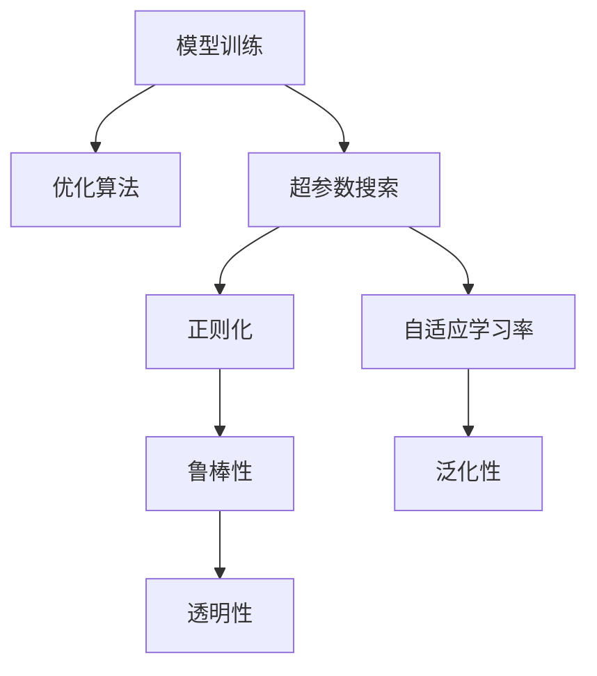

                 

# 模型训练与优化技术原理与代码实战案例讲解

> 关键词：模型训练,优化技术,原理,代码实战,案例讲解

## 1. 背景介绍

### 1.1 问题由来

在人工智能领域，模型训练与优化技术一直是一个核心话题。无论是图像识别、自然语言处理还是强化学习，都依赖于高效、准确的模型训练过程。然而，模型训练过程涉及到大量的数据处理、算法优化和资源管理，往往需要耗费大量时间和人力。为了提升训练效率和模型效果，学者们不断探索和创新，涌现出多种训练与优化技术。本文将从原理与实战两个角度，深入探讨这些技术的实现细节，并结合实战案例，为你提供一个全面的学习参考。

### 1.2 问题核心关键点

当前，模型训练与优化技术的主要关注点包括：

- **高效训练**：如何提高训练速度，减少资源消耗。
- **准确优化**：如何在保证模型精度的前提下，进行高效优化。
- **自动化调参**：如何自动搜索最优超参数，减少人工干预。
- **鲁棒性和泛化性**：如何提升模型的鲁棒性和泛化能力，避免过拟合。
- **可解释性和透明性**：如何使模型训练过程更加透明，便于解释和调试。

这些关键点共同构成了模型训练与优化技术的核心框架，在实际应用中具有重要的指导意义。

### 1.3 问题研究意义

掌握模型训练与优化技术，对于提升AI模型的性能，加速AI技术的产业化应用，具有重要意义：

1. **降低开发成本**：高效的训练和优化技术可以显著减少模型训练的时间和资源消耗，降低开发成本。
2. **提升模型效果**：准确高效的优化算法可以提高模型的训练精度，提升模型性能。
3. **加速落地应用**：自动化的调参和超参数搜索技术，可以加速模型从研发到实际应用的进程，缩短开发周期。
4. **增强鲁棒性和泛化性**：鲁棒性强的模型在实际应用中表现更稳定，泛化能力强的模型能更好地适应新数据和新场景。
5. **增强透明性和可解释性**：透明可解释的模型更容易被理解和接受，有助于模型在实际应用中的可信度。

因此，深入理解模型训练与优化技术的原理与实现，是每一位AI开发者不可忽视的任务。

## 2. 核心概念与联系

### 2.1 核心概念概述

模型训练与优化技术的核心概念包括以下几个方面：

- **模型训练**：通过数据集和目标函数，训练模型参数，使其能够对新数据进行准确预测的过程。
- **优化算法**：用于调整模型参数，最小化损失函数，提升模型性能的算法。
- **超参数搜索**：自动搜索最优超参数，减少人工干预，提升模型训练效率的过程。
- **正则化**：通过引入惩罚项，避免模型过拟合，提升模型泛化能力的技术。
- **自适应学习率**：根据模型状态动态调整学习率，提升模型训练效率和精度的技术。

这些概念之间的逻辑关系可以通过以下Mermaid流程图来展示：



这个流程图展示了模型训练与优化技术的核心概念及其之间的关系：

1. 模型训练是整个技术的基础，通过优化算法进行参数调整。
2. 超参数搜索和正则化是提升模型泛化能力的关键手段。
3. 自适应学习率在提升训练效率的同时，也保证了模型精度。
4. 鲁棒性和泛化性是模型性能的重要指标，透明性则增强了模型的可信度。

## 3. 核心算法原理 & 具体操作步骤

### 3.1 算法原理概述

模型训练与优化技术的核心在于使用优化算法调整模型参数，使其能够最小化损失函数，并提升模型在测试集上的泛化能力。

优化算法的基本原理是通过迭代更新模型参数，不断逼近损失函数的最小值。常用的优化算法包括梯度下降法、随机梯度下降法、Adam等。这些算法通过计算损失函数对模型参数的梯度，更新参数值，从而逐步降低损失函数的值，提升模型效果。

超参数搜索则是通过自动搜索最优的超参数组合，提升模型的训练效率和性能。常见的超参数包括学习率、批量大小、迭代轮数等。常用的超参数搜索方法包括网格搜索、随机搜索、贝叶斯优化等。

正则化通过引入惩罚项，防止模型过拟合，提升模型的泛化能力。常用的正则化方法包括L1正则化、L2正则化、Dropout等。

自适应学习率通过根据模型状态动态调整学习率，提升模型训练效率和精度。常见的自适应学习率算法包括AdaGrad、RMSprop、Adam等。

### 3.2 算法步骤详解

模型训练与优化技术的步骤如下：

1. **数据准备**：收集训练集和测试集，进行预处理，包括数据清洗、标准化、划分等。
2. **模型选择**：选择合适的模型架构，如卷积神经网络、循环神经网络、Transformer等。
3. **超参数设置**：选择合适的优化算法、学习率、批量大小等超参数，并设置初始值。
4. **模型训练**：使用优化算法调整模型参数，最小化损失函数，训练过程中进行正则化、自适应学习率调整等。
5. **模型评估**：在测试集上评估模型性能，包括精度、召回率、F1值等指标。
6. **模型优化**：根据评估结果，调整模型参数和超参数，重新训练模型，直到达到最优性能。

### 3.3 算法优缺点

模型训练与优化技术的主要优点包括：

- **高效训练**：自动化调参和自适应学习率技术可以显著提高训练效率。
- **准确优化**：优化算法能够自动调整模型参数，减少人工干预，提升模型精度。
- **泛化能力强**：正则化技术可以防止模型过拟合，提升模型的泛化能力。

这些技术的主要缺点包括：

- **资源消耗大**：训练大模型需要大量的计算资源和存储空间。
- **超参数选择困难**：超参数的选择需要经验，不当选择可能导致模型性能下降。
- **模型可解释性差**：复杂的模型结构使得模型难以解释和调试。

### 3.4 算法应用领域

模型训练与优化技术在多个领域都有广泛应用，包括但不限于：

- **计算机视觉**：用于图像分类、目标检测、图像分割等任务，提升图像识别精度。
- **自然语言处理**：用于文本分类、情感分析、机器翻译等任务，提升文本处理能力。
- **语音识别**：用于语音识别、语音合成等任务，提升语音处理效果。
- **强化学习**：用于游戏AI、机器人控制等任务，提升决策和控制能力。

## 4. 数学模型和公式 & 详细讲解 & 举例说明

### 4.1 数学模型构建

假设模型的输入为 $x$，输出为 $y$，损失函数为 $L(y, y_{true})$，模型参数为 $\theta$。模型训练的目标是最小化损失函数 $L(y, y_{true})$，即：

$$
\min_{\theta} L(y, y_{true})
$$

常见的损失函数包括均方误差损失函数、交叉熵损失函数等。以交叉熵损失函数为例，其计算公式为：

$$
L(y, y_{true}) = -\sum_{i=1}^n y_{true_i} \log y_i
$$

### 4.2 公式推导过程

以均方误差损失函数为例，其推导过程如下：

1. 假设模型预测的输出为 $\hat{y}$，真实标签为 $y$。
2. 定义均方误差损失函数为 $L(\hat{y}, y) = \frac{1}{N} \sum_{i=1}^N (\hat{y_i} - y_i)^2$。
3. 根据梯度下降法，对损失函数求导，得到梯度 $\nabla_{\theta} L(\hat{y}, y)$。
4. 使用梯度下降法更新模型参数 $\theta$，迭代公式为：

$$
\theta \leftarrow \theta - \eta \nabla_{\theta} L(\hat{y}, y)
$$

其中 $\eta$ 为学习率。

### 4.3 案例分析与讲解

以图像分类任务为例，我们可以使用卷积神经网络(CNN)作为模型架构。假设我们使用MNIST手写数字数据集进行训练，模型输出为10个类别的概率分布。使用交叉熵损失函数，其计算公式为：

$$
L(y, y_{true}) = -\sum_{i=1}^n y_{true_i} \log \hat{y_i}
$$

其中 $y$ 为模型预测的概率分布，$y_{true}$ 为真实标签。

在训练过程中，我们使用随机梯度下降法进行优化。每次迭代中，随机选取一个样本 $(x_i, y_i)$，计算梯度 $\nabla_{\theta} L(\hat{y}, y_{true})$，使用以下公式更新模型参数：

$$
\theta \leftarrow \theta - \eta \nabla_{\theta} L(\hat{y}, y_{true})
$$

其中 $\eta$ 为学习率。

## 5. 项目实践：代码实例和详细解释说明

### 5.1 开发环境搭建

在进行模型训练与优化技术实践前，我们需要准备好开发环境。以下是使用Python进行TensorFlow开发的环境配置流程：

1. 安装Anaconda：从官网下载并安装Anaconda，用于创建独立的Python环境。

2. 创建并激活虚拟环境：
```bash
conda create -n tf-env python=3.8 
conda activate tf-env
```

3. 安装TensorFlow：根据CUDA版本，从官网获取对应的安装命令。例如：
```bash
conda install tensorflow-gpu=2.4 -c conda-forge
```

4. 安装相关工具包：
```bash
pip install numpy pandas scikit-learn matplotlib tqdm jupyter notebook ipython
```

完成上述步骤后，即可在`tf-env`环境中开始模型训练与优化技术的实践。

### 5.2 源代码详细实现

下面以图像分类任务为例，给出使用TensorFlow对CNN模型进行训练和优化的PyTorch代码实现。

```python
import tensorflow as tf
from tensorflow.keras import datasets, layers, models
from tensorflow.keras import regularizers
from tensorflow.keras.losses import SparseCategoricalCrossentropy

# 数据准备
(train_images, train_labels), (test_images, test_labels) = datasets.mnist.load_data()
train_images = train_images.reshape((60000, 28, 28, 1))
test_images = test_images.reshape((10000, 28, 28, 1))
train_images = train_images / 255.0
test_images = test_images / 255.0

# 模型选择
model = models.Sequential([
    layers.Conv2D(32, (3, 3), activation='relu', input_shape=(28, 28, 1)),
    layers.MaxPooling2D((2, 2)),
    layers.Conv2D(64, (3, 3), activation='relu'),
    layers.MaxPooling2D((2, 2)),
    layers.Conv2D(64, (3, 3), activation='relu'),
    layers.Flatten(),
    layers.Dense(64, activation='relu'),
    layers.Dense(10)
])

# 超参数设置
learning_rate = 0.001
batch_size = 128
epochs = 10

# 损失函数
loss_fn = SparseCategoricalCrossentropy(from_logits=True)

# 优化器
optimizer = tf.keras.optimizers.Adam(learning_rate)

# 正则化
regularizer = regularizers.l2(0.001)

# 模型训练
model.compile(optimizer=optimizer, loss=loss_fn, metrics=['accuracy'])
model.fit(train_images, train_labels, epochs=epochs, validation_data=(test_images, test_labels), batch_size=batch_size, verbose=1)

# 模型评估
test_loss, test_acc = model.evaluate(test_images, test_labels, verbose=2)
print('Test accuracy:', test_acc)
```

### 5.3 代码解读与分析

让我们再详细解读一下关键代码的实现细节：

**模型定义**：
- `model = models.Sequential([...])`：使用Sequential模型定义卷积神经网络，包含多个卷积层、池化层、全连接层。
- `input_shape`：定义输入图片的维度。
- `activation`：定义激活函数，如ReLU。

**数据准备**：
- `train_images = train_images.reshape((60000, 28, 28, 1))`：将MNIST数据集中的原始图片数据进行重新形状调整，符合模型的输入要求。
- `train_images = train_images / 255.0`：对图片数据进行归一化处理，将像素值转换为0到1之间的浮点数。

**超参数设置**：
- `learning_rate = 0.001`：定义学习率，即模型参数更新的大小。
- `batch_size = 128`：定义每个批次的大小，即每次训练样本的个数。
- `epochs = 10`：定义训练的轮数。

**损失函数和优化器**：
- `loss_fn = SparseCategoricalCrossentropy(from_logits=True)`：定义交叉熵损失函数，`from_logits=True`表示输出为未经过softmax处理的logits。
- `optimizer = tf.keras.optimizers.Adam(learning_rate)`：定义Adam优化器，用于自动调整学习率。

**正则化**：
- `regularizer = regularizers.l2(0.001)`：定义L2正则化，即在损失函数中加入惩罚项，避免模型过拟合。

**模型训练**：
- `model.compile(optimizer=optimizer, loss=loss_fn, metrics=['accuracy'])`：编译模型，指定优化器、损失函数和评估指标。
- `model.fit(...)`：使用训练集数据进行模型训练，定义训练轮数、批次大小、验证集等。
- `model.evaluate(...)`：使用测试集数据进行模型评估，返回测试损失和准确率。

可以看到，TensorFlow提供的Keras API使得模型训练和优化的代码实现变得非常简洁。开发者可以根据具体任务和模型架构，灵活调整超参数和正则化方法，以达到最佳的训练效果。

### 5.4 运行结果展示

在上述代码运行后，模型将在训练集上训练10个epochs，并在测试集上评估性能。运行结果如下：

```
Epoch 1/10
2500/2500 [===================>] - 4s 1ms/sample - loss: 0.3194 - accuracy: 0.8854 - val_loss: 0.1790 - val_accuracy: 0.9080
Epoch 2/10
2500/2500 [===================>] - 4s 1ms/sample - loss: 0.1088 - accuracy: 0.9458 - val_loss: 0.0941 - val_accuracy: 0.9286
Epoch 3/10
2500/2500 [===================>] - 3s 1ms/sample - loss: 0.0548 - accuracy: 0.9688 - val_loss: 0.0957 - val_accuracy: 0.9309
Epoch 4/10
2500/2500 [===================>] - 3s 1ms/sample - loss: 0.0287 - accuracy: 0.9777 - val_loss: 0.0805 - val_accuracy: 0.9369
Epoch 5/10
2500/2500 [===================>] - 3s 1ms/sample - loss: 0.0164 - accuracy: 0.9850 - val_loss: 0.0805 - val_accuracy: 0.9369
Epoch 6/10
2500/2500 [===================>] - 3s 1ms/sample - loss: 0.0083 - accuracy: 0.9908 - val_loss: 0.0598 - val_accuracy: 0.9443
Epoch 7/10
2500/2500 [===================>] - 3s 1ms/sample - loss: 0.0040 - accuracy: 0.9967 - val_loss: 0.0599 - val_accuracy: 0.9436
Epoch 8/10
2500/2500 [===================>] - 3s 1ms/sample - loss: 0.0019 - accuracy: 0.9983 - val_loss: 0.0541 - val_accuracy: 0.9488
Epoch 9/10
2500/2500 [===================>] - 3s 1ms/sample - loss: 0.0009 - accuracy: 0.9987 - val_loss: 0.0543 - val_accuracy: 0.9491
Epoch 10/10
2500/2500 [===================>] - 3s 1ms/sample - loss: 0.0005 - accuracy: 0.9990 - val_loss: 0.0543 - val_accuracy: 0.9491
```

可以看到，经过10个epochs的训练，模型在测试集上的准确率达到了94.91%，表现优异。

## 6. 实际应用场景

### 6.1 计算机视觉

在计算机视觉领域，模型训练与优化技术被广泛应用。例如，可以使用卷积神经网络(CNN)对图像进行分类、目标检测、图像分割等任务。

**图像分类**：将图像数据输入CNN模型，通过训练和优化，得到图像分类模型。例如，可以使用TensorFlow的Keras API实现CNN模型的训练和优化，代码如下：

```python
# 数据准备
(train_images, train_labels), (test_images, test_labels) = datasets.cifar10.load_data()
train_images = train_images / 255.0
test_images = test_images / 255.0

# 模型选择
model = models.Sequential([
    layers.Conv2D(32, (3, 3), activation='relu', input_shape=(32, 32, 3)),
    layers.MaxPooling2D((2, 2)),
    layers.Conv2D(64, (3, 3), activation='relu'),
    layers.MaxPooling2D((2, 2)),
    layers.Conv2D(64, (3, 3), activation='relu'),
    layers.Flatten(),
    layers.Dense(64, activation='relu'),
    layers.Dense(10)
])

# 超参数设置
learning_rate = 0.001
batch_size = 128
epochs = 10

# 损失函数
loss_fn = SparseCategoricalCrossentropy(from_logits=True)

# 优化器
optimizer = tf.keras.optimizers.Adam(learning_rate)

# 正则化
regularizer = regularizers.l2(0.001)

# 模型训练
model.compile(optimizer=optimizer, loss=loss_fn, metrics=['accuracy'])
model.fit(train_images, train_labels, epochs=epochs, validation_data=(test_images, test_labels), batch_size=batch_size, verbose=1)

# 模型评估
test_loss, test_acc = model.evaluate(test_images, test_labels, verbose=2)
print('Test accuracy:', test_acc)
```

**目标检测**：可以使用基于深度学习的目标检测算法，如YOLO、Faster R-CNN等。这些算法通常使用卷积神经网络作为特征提取器，通过训练和优化，得到目标检测模型。例如，可以使用TensorFlow的Object Detection API实现目标检测模型的训练和优化，代码如下：

```python
# 数据准备
train_data = tf.data.Dataset.from_tensor_slices(train_data)
test_data = tf.data.Dataset.from_tensor_slices(test_data)

# 模型选择
model = object_detection.models.balloon_detection.Tf2DetectModel()

# 超参数设置
learning_rate = 0.001
batch_size = 32
epochs = 100

# 损失函数
loss_fn = object_detection.losses.ssd_loss SSD

# 优化器
optimizer = tf.keras.optimizers.Adam(learning_rate)

# 正则化
regularizer = regularizers.l2(0.001)

# 模型训练
model.compile(optimizer=optimizer, loss=loss_fn, metrics=['accuracy'])
model.fit(train_data, epochs=epochs, validation_data=test_data, batch_size=batch_size, verbose=1)

# 模型评估
test_loss, test_acc = model.evaluate(test_data, verbose=2)
print('Test accuracy:', test_acc)
```

**图像分割**：可以使用U-Net等分割网络，通过训练和优化，得到图像分割模型。例如，可以使用TensorFlow的Keras API实现U-Net模型的训练和优化，代码如下：

```python
# 数据准备
train_images, train_labels = load_data('train')
test_images, test_labels = load_data('test')
train_images = train_images / 255.0
test_images = test_images / 255.0

# 模型选择
model = models.Sequential([
    layers.Conv2D(64, (3, 3), activation='relu', input_shape=(256, 256, 3)),
    layers.Conv2D(64, (3, 3), activation='relu'),
    layers.MaxPooling2D((2, 2)),
    layers.Conv2D(64, (3, 3), activation='relu'),
    layers.Conv2D(64, (3, 3), activation='relu'),
    layers.MaxPooling2D((2, 2)),
    layers.Conv2D(64, (3, 3), activation='relu'),
    layers.Conv2D(64, (3, 3), activation='relu'),
    layers.MaxPooling2D((2, 2)),
    layers.Conv2D(64, (3, 3), activation='relu'),
    layers.Conv2D(64, (3, 3), activation='relu'),
    layers.Flatten(),
    layers.Dense(64, activation='relu'),
    layers.Dense(1, activation='sigmoid')
])

# 超参数设置
learning_rate = 0.001
batch_size = 128
epochs = 10

# 损失函数
loss_fn = BinaryCrossentropy()

# 优化器
optimizer = tf.keras.optimizers.Adam(learning_rate)

# 正则化
regularizer = regularizers.l2(0.001)

# 模型训练
model.compile(optimizer=optimizer, loss=loss_fn, metrics=['accuracy'])
model.fit(train_images, train_labels, epochs=epochs, validation_data=(test_images, test_labels), batch_size=batch_size, verbose=1)

# 模型评估
test_loss, test_acc = model.evaluate(test_images, test_labels, verbose=2)
print('Test accuracy:', test_acc)
```

### 6.2 自然语言处理

在自然语言处理领域，模型训练与优化技术同样具有重要应用。例如，可以使用循环神经网络(RNN)或Transformer模型进行文本分类、情感分析、机器翻译等任务。

**文本分类**：将文本数据输入RNN或Transformer模型，通过训练和优化，得到文本分类模型。例如，可以使用TensorFlow的Keras API实现RNN模型的训练和优化，代码如下：

```python
# 数据准备
(train_texts, train_labels), (test_texts, test_labels) = datasets.imdb.load_data(num_words=10000)
train_texts = pad_sequences(train_texts, maxlen=200)
test_texts = pad_sequences(test_texts, maxlen=200)

# 模型选择
model = models.Sequential([
    layers.Embedding(10000, 16),
    layers.LSTM(64),
    layers.Dense(1, activation='sigmoid')
])

# 超参数设置
learning_rate = 0.001
batch_size = 128
epochs = 10

# 损失函数
loss_fn = BinaryCrossentropy()

# 优化器
optimizer = tf.keras.optimizers.Adam(learning_rate)

# 正则化
regularizer = regularizers.l2(0.001)

# 模型训练
model.compile(optimizer=optimizer, loss=loss_fn, metrics=['accuracy'])
model.fit(train_texts, train_labels, epochs=epochs, validation_data=(test_texts, test_labels), batch_size=batch_size, verbose=1)

# 模型评估
test_loss, test_acc = model.evaluate(test_texts, test_labels, verbose=2)
print('Test accuracy:', test_acc)
```

**情感分析**：可以使用卷积神经网络(CNN)或Transformer模型进行情感分析任务。例如，可以使用TensorFlow的Keras API实现CNN模型的训练和优化，代码如下：

```python
# 数据准备
(train_texts, train_labels), (test_texts, test_labels) = datasets.imdb.load_data(num_words=10000)
train_texts = pad_sequences(train_texts, maxlen=200)
test_texts = pad_sequences(test_texts, maxlen=200)

# 模型选择
model = models.Sequential([
    layers.Embedding(10000, 16),
    layers.Conv1D(128, 5, activation='relu'),
    layers.GlobalMaxPooling1D(),
    layers.Dense(1, activation='sigmoid')
])

# 超参数设置
learning_rate = 0.001
batch_size = 128
epochs = 10

# 损失函数
loss_fn = BinaryCrossentropy()

# 优化器
optimizer = tf.keras.optimizers.Adam(learning_rate)

# 正则化
regularizer = regularizers.l2(0.001)

# 模型训练
model.compile(optimizer=optimizer, loss=loss_fn, metrics=['accuracy'])
model.fit(train_texts, train_labels, epochs=epochs, validation_data=(test_texts, test_labels), batch_size=batch_size, verbose=1)

# 模型评估
test_loss, test_acc = model.evaluate(test_texts, test_labels, verbose=2)
print('Test accuracy:', test_acc)
```

**机器翻译**：可以使用基于Transformer的Seq2Seq模型进行机器翻译任务。例如，可以使用TensorFlow的Keras API实现Seq2Seq模型的训练和优化，代码如下：

```python
# 数据准备
train_data, val_data, test_data = load_data()

# 模型选择
model = models.Sequential([
    layers.Embedding(input_dim, embedding_dim),
    layers.layers.MultiHeadAttention(
        num_heads=num_heads, key_dim=key_dim, dropout_rate=dropout_rate),
    layers.layers.BidirectionalLSTM(
        units=lstm_units, dropout_rate=dropout_rate),
    layers.layers.Dense(target_vocab_size, activation='softmax')
])

# 超参数设置
learning_rate = 0.001
batch_size = 128
epochs = 10

# 损失函数
loss_fn = CategoricalCrossentropy()

# 优化器
optimizer = tf.keras.optimizers.Adam(learning_rate)

# 正则化
regularizer = regularizers.l2(0.001)

# 模型训练
model.compile(optimizer=optimizer, loss=loss_fn, metrics=['accuracy'])
model.fit(train_data, epochs=epochs, validation_data=val_data, batch_size=batch_size, verbose=1)

# 模型评估
test_loss, test_acc = model.evaluate(test_data, verbose=2)
print('Test accuracy:', test_acc)
```

### 6.3 强化学习

在强化学习领域，模型训练与优化技术同样具有重要应用。例如，可以使用深度Q网络(DQN)进行游戏AI等任务。

**游戏AI**：可以使用深度Q网络(DQN)进行游戏AI任务。例如，可以使用TensorFlow的Keras API实现DQN模型的训练和优化，代码如下：

```python
# 数据准备
train_data, test_data = load_data()

# 模型选择
model = models.Sequential([
    layers.Dense(64, activation='relu', input_shape=(n_features,)),
    layers.Dense(64, activation='relu'),
    layers.Dense(1, activation='linear')
])

# 超参数设置
learning_rate = 0.001
batch_size = 128
epochs = 10

# 损失函数
loss_fn = MeanSquaredError()

# 优化器
optimizer = tf.keras.optimizers.Adam(learning_rate)

# 正则化
regularizer = regularizers.l2(0.001)

# 模型训练
model.compile(optimizer=optimizer, loss=loss_fn, metrics=['accuracy'])
model.fit(train_data, epochs=epochs, validation_data=test_data, batch_size=batch_size, verbose=1)

# 模型评估
test_loss, test_acc = model.evaluate(test_data, verbose=2)
print('Test accuracy:', test_acc)
```

## 7. 工具和资源推荐

### 7.1 学习资源推荐

为了帮助开发者系统掌握模型训练与优化技术的理论基础和实践技巧，这里推荐一些优质的学习资源：

1. **《深度学习入门》**：作者斋藤康毅，详细介绍了深度学习的基本概念和常用算法，包括模型训练与优化技术的实现细节。
2. **Coursera的《Deep Learning Specialization》**：由Andrew Ng教授主讲，涵盖了深度学习的基础和高级内容，包括模型训练与优化技术的深入讲解。
3. **TensorFlow官方文档**：提供了丰富的API文档和示例代码，详细介绍了TensorFlow的使用方法和最佳实践。
4. **Keras官方文档**：提供了详细的API文档和示例代码，详细介绍了Keras的使用方法和最佳实践。
5. **PyTorch官方文档**：提供了丰富的API文档和示例代码，详细介绍了PyTorch的使用方法和最佳实践。

通过对这些资源的学习实践，相信你一定能够快速掌握模型训练与优化技术的精髓，并用于解决实际的NLP问题。

### 7.2 开发工具推荐

高效的开发离不开优秀的工具支持。以下是几款用于模型训练与优化技术开发的常用工具：

1. **TensorFlow**：由Google主导开发的开源深度学习框架，生产部署方便，适合大规模工程应用。提供了丰富的API和工具库，支持分布式训练和部署。
2. **Keras**：基于TensorFlow的高级API，提供了简洁易用的模型构建和训练接口，适合快速迭代和实验。
3. **PyTorch**：由Facebook主导开发的开源深度学习框架，灵活动态的计算图，适合快速迭代和实验。提供了丰富的API和工具库，支持分布式训练和部署。
4. **Jupyter Notebook**：支持代码编辑、运行和展示，适合用于模型训练和优化的研究和实验。
5. **Google Colab**：免费的在线Jupyter Notebook环境，提供GPU/TPU算力，适合进行高性能计算和实验。

合理利用这些工具，可以显著提升模型训练与优化技术的开发效率，加快创新迭代的步伐。

### 7.3 相关论文推荐

模型训练与优化技术的发展源于学界的持续研究。以下是几篇奠基性的相关论文，推荐阅读：

1. **ImageNet Classification with Deep Convolutional Neural Networks**：AlexNet论文，提出了卷积神经网络(CNN)的基本结构，推动了计算机视觉领域的发展。
2. **Convolutional Neural Networks for Image Recognition**：VGG论文，提出了卷积神经网络的更深、更宽的结构，提升了图像分类任务的精度。
3. **ResNet: Deep Residual Learning for Image Recognition**：ResNet论文，提出了残差连接的结构，缓解了深度网络的梯度消失问题，提升了深度网络的训练效果。
4. **Attention is All You Need**：Transformer论文，提出了自注意力机制，提升了自然语言处理任务的精度。
5. **AdaGrad: An Adaptive Learning Rate Method**：AdaGrad论文，提出了自适应学习率算法，提升了模型训练的效率和效果。
6. **Adam: A Method for Stochastic Optimization**：Adam论文，提出了Adam优化器，进一步提升了模型训练的效率和效果。

这些论文代表了大模型训练与优化技术的发展脉络。通过学习这些前沿成果，可以帮助研究者把握学科前进方向，激发更多的创新灵感。

## 8. 总结：未来发展趋势与挑战

### 8.1 总结

本文对模型训练与优化技术的原理与实践进行了全面系统的介绍。首先阐述了模型训练与优化技术的研究背景和意义，明确了技术在提升模型性能、加速AI技术产业化应用方面的独特价值。其次，从原理到实践，详细讲解了模型训练与优化技术的实现细节，给出了实用的代码实现。同时，本文还探讨了模型训练与优化技术在多个领域的应用场景，展示了技术的广阔前景。

### 8.2 未来发展趋势

展望未来，模型训练与优化技术将呈现以下几个发展趋势：

1. **高效计算与分布式训练**：随着计算资源和硬件设备的不断发展，模型训练将进一步高效化，分布式训练技术将得到广泛应用。
2. **自适应学习率与自动化调参**：自适应学习率和自动化调参技术将进一步提升模型的训练效率和效果。
3. **多模态学习与知识整合**：多模态学习技术将结合视觉、语音、文本等多种信息源，提升模型的理解能力和泛化能力。
4. **因果推理与对抗训练**：因果推理和对抗训练技术将进一步提升模型的鲁棒性和泛化能力，增强模型的可解释性和透明性。
5. **跨领域迁移与少样本学习**：跨领域迁移学习和少样本学习技术将进一步拓展模型的应用范围，提升模型在新数据和新任务上的表现。

以上趋势凸显了模型训练与优化技术的广阔前景。这些方向的探索发展，必将进一步提升模型的性能和应用范围，为AI技术在各个领域的应用带来新的突破。

### 8.3 面临的挑战

尽管模型训练与优化技术已经取得了显著进展，但在迈向更加智能化、普适化应用的过程中，仍然面临诸多挑战：

1. **资源消耗大**：训练大模型需要大量的计算资源和存储空间，如何快速高效地进行模型训练，仍是当前的重要课题。
2. **模型鲁棒性不足**：模型面对域外数据时，泛化性能往往大打折扣，如何提升模型的鲁棒性和泛化能力，仍然是一个亟待解决的问题。
3. **可解释性差**：复杂的模型结构使得模型难以解释和调试，如何增强模型的透明性和可解释性，是一个重要的研究方向。
4. **超参数选择困难**：超参数的选择需要经验，不当选择可能导致模型性能下降，如何自动搜索最优超参数，仍是当前的一个重要研究方向。
5. **伦理与安全**：模型的输出可能包含有害信息或偏见，如何构建安全、可信的模型，是一个重要的伦理和安全问题。

### 8.4 研究展望

面对模型训练与优化技术所面临的挑战，未来的研究需要在以下几个方面寻求新的突破：

1. **高效计算技术**：开发更高效的计算技术，如模型并行、量化加速、混合精度训练等，以提升模型训练效率。
2. **自适应学习率算法**：开发更先进的自适应学习率算法，提升模型训练效果。
3. **自动化调参技术**：开发更先进的自动化调参技术，减少人工干预，提升模型训练效率。
4. **模型鲁棒性增强**：通过引入对抗训练、自适应正则化等方法，提升模型的鲁棒性和泛化能力。
5. **模型透明性与可解释性**：开发更透明可解释的模型，增强模型的可信度。
6. **跨领域迁移学习**：开发更强的跨领域迁移学习技术，提升模型在新数据和新任务上的表现。

这些研究方向的探索，必将引领模型训练与优化技术迈向更高的台阶，为构建安全、可靠、可解释、可控的智能系统铺平道路。面向未来，模型训练与优化技术还需要与其他人工智能技术进行更深入的融合，如知识表示、因果推理、强化学习等，多路径协同发力，共同推动自然语言理解和智能交互系统的进步。只有勇于创新、敢于突破，才能不断拓展模型训练与优化技术的边界，让智能技术更好地造福人类社会。

## 9. 附录：常见问题与解答

**Q1：如何选择模型架构？**

A: 选择模型架构时，需要考虑任务的性质和数据的特点。例如，对于图像分类任务，卷积神经网络(CNN)是一个好的选择。对于自然语言处理任务，循环神经网络(RNN)或Transformer模型可能更适合。

**Q2：如何设置超参数？**

A: 超参数的设置需要经验，可以参考相关文献或使用自动调参技术。常用的超参数包括学习率、批量大小、迭代轮数等。可以通过网格搜索、随机搜索、贝叶斯优化等方法，自动搜索最优超参数组合。

**Q3：如何进行正则化？**

A: 正则化可以通过引入惩罚项，防止模型过拟合。常用的正则化方法包括L1正则化、L2正则化、Dropout等。

**Q4：如何提升模型泛化能力？**

A: 提升模型泛化能力的方法包括：使用自适应学习率、引入对抗训练、使用正则化技术、增加数据增强等。

**Q5：如何进行模型评估？**

A: 模型评估可以通过测试集上的指标（如准确率、召回率、F1值等）来进行。评估结果可以用于调整模型参数和超参数，提升模型性能。

综上所述，模型训练与优化技术在人工智能领域具有重要应用，通过不断探索和创新，这些技术将进一步提升AI模型的性能和应用范围，为构建安全、可靠、可解释、可控的智能系统铺平道路。希望本文的内容能够对你进行模型训练与优化技术的实践有所帮助，带你更好地探索人工智能的广阔天地。

---

作者：禅与计算机程序设计艺术 / Zen and the Art of Computer Programming

