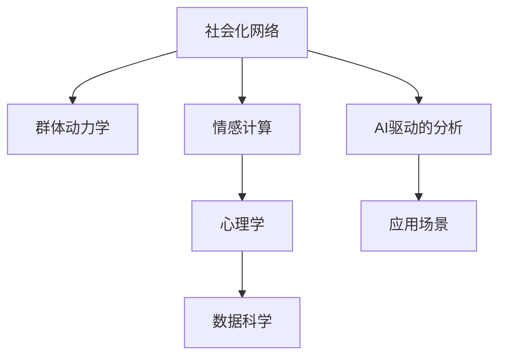

                 

# 欲望社会化网络理论：AI驱动的群体动力学

> 关键词：社会化网络,人工智能,群体动力学,情感计算,心理学,数据科学

## 1. 背景介绍

### 1.1 问题由来
当前，全球正处于信息爆炸的时代，互联网、社交媒体的普及使得个人行为和社会动态日益数字化。AI技术特别是深度学习在图像、语言和语音识别等领域取得了重大突破，为研究人类行为和群体动态提供了新的视角和方法。在此背景下，社会化网络理论被赋予了新的内涵，成为了理解人类群体行为的重要工具。

### 1.2 问题核心关键点
社会化网络理论的核心在于理解个体如何通过网络交互形成群体行为。AI驱动的社会化网络研究，旨在通过深度学习算法挖掘网络数据，分析群体中个体的情感、态度和行为特征，揭示群体动态变化的规律。这不仅有助于理解复杂的社会现象，还可以应用于社会管理、市场预测和风险评估等领域，具有重要理论和实际价值。

### 1.3 问题研究意义
研究AI驱动的社会化网络理论，有助于深入理解群体行为和社会动态，提供数据驱动的洞察。特别是在数字化时代，社会化网络成为了人类行为研究的重要数据来源。通过分析网络数据，可以揭示社会情感和群体动态背后的规律，为政策制定和社会管理提供科学依据。同时，这种研究方法也为AI技术在社会领域的应用提供了新的应用场景。

## 2. 核心概念与联系

### 2.1 核心概念概述

为更好地理解AI驱动的社会化网络理论，本节将介绍几个密切相关的核心概念：

- **社会化网络(Social Network)**：描述个体之间通过信息、情感和行为交换形成的网络结构。社会化网络分析旨在理解个体如何通过网络关系影响和改变群体行为。
- **群体动力学(Group Dynamics)**：研究群体中个体间的相互作用及其对群体行为的影响。群体动力学理论关注群体行为的形成、演化和维持。
- **情感计算(Affective Computing)**：结合心理学和数据科学，研究个体和群体情感的识别、表达和影响。情感计算的目标是构建可以理解、生成和影响人类情感的智能系统。
- **心理学(Psychology)**：研究个体心理活动和行为规律的科学。心理学为理解社会化网络中的个体行为和情感提供了理论基础。
- **数据科学(Data Science)**：融合统计学、机器学习和数据挖掘等技术，从数据中提取有用信息和知识。数据科学为社会化网络理论的应用提供了技术和方法支持。

这些核心概念之间的逻辑关系可以通过以下Mermaid流程图来展示：



这个流程图展示了大语言模型微调的核心概念及其之间的关系：

1. 社会化网络通过信息、情感和行为交换形成，群体动力学研究其演化规律。
2. 情感计算结合心理学，揭示个体情感状态和群体情感趋势。
3. 数据科学提供数据分析方法，支撑群体行为和社会动态的研究。
4. AI驱动的社会化网络分析，利用机器学习和深度学习算法，提取网络数据中的有用信息。
5. 应用场景包括社会管理、市场预测和风险评估等，为社会实践提供决策支持。

这些概念共同构成了AI驱动的社会化网络理论的基本框架，为我们理解和应用该理论提供了理论和工具基础。

## 3. 核心算法原理 & 具体操作步骤
### 3.1 算法原理概述

AI驱动的社会化网络理论，主要通过深度学习算法来挖掘网络数据，揭示个体情感、态度和行为背后的规律。其核心思想是：通过分析个体在社会化网络中的行为数据，识别出个体特征和群体动态，建立模型预测群体行为和社会现象。

具体来说，AI驱动的社会化网络分析分为以下几个关键步骤：

1. **数据采集**：从社交媒体、新闻、论坛等平台采集个体行为和情感数据。
2. **数据预处理**：清洗、归一化数据，构建网络图结构。
3. **特征提取**：使用深度学习算法提取个体和群体的特征。
4. **群体分析**：利用机器学习模型分析群体行为模式和情感动态。
5. **结果解释**：通过可视化工具展示分析结果，提供数据驱动的洞察。

### 3.2 算法步骤详解

以下是社会化网络分析的一般流程：

**Step 1: 数据采集和预处理**

1. **数据采集**：使用API或网络爬虫从社交媒体、新闻、论坛等平台采集用户行为和情感数据，如评论、点赞、转发等。
2. **数据清洗**：去除噪声和无关信息，确保数据质量。
3. **数据归一化**：将不同格式的数据转换为统一格式，便于后续处理。
4. **网络构建**：根据个体间的互动关系，构建网络图结构。

**Step 2: 特征提取**

1. **文本表示**：使用词袋模型、TF-IDF、Word2Vec等技术，将文本数据转换为向量表示。
2. **情感识别**：使用情感分析算法，识别个体评论的情感倾向。
3. **群体特征**：计算群体的平均情感、平均互动频率等统计特征。

**Step 3: 群体分析**

1. **模型选择**：根据任务特点选择合适的机器学习模型，如分类、回归、聚类等。
2. **训练与验证**：使用训练集训练模型，并在验证集上进行调参和验证。
3. **结果预测**：在测试集上评估模型性能，预测群体行为和情感趋势。

**Step 4: 结果解释**

1. **数据可视化**：使用图形工具如Gephi、Matplotlib等，展示网络结构、情感变化和群体动态。
2. **结果分析**：分析预测结果，提出数据驱动的洞察和建议。

### 3.3 算法优缺点

AI驱动的社会化网络分析具有以下优点：

1. **自动化高效**：深度学习算法能够自动提取复杂数据特征，减少人工干预，提高分析效率。
2. **准确性高**：利用大样本数据训练模型，能够提高预测准确性和泛化能力。
3. **应用广泛**：适用于各种社会行为分析任务，如舆情监测、风险评估、市场预测等。
4. **实时性**：能够实时处理和分析网络数据，及时响应动态变化。

同时，该方法也存在一些局限性：

1. **数据依赖**：模型效果依赖于高质量标注数据，数据获取和处理成本较高。
2. **隐私问题**：网络数据的隐私保护和伦理问题需要重视。
3. **复杂性高**：模型训练和调参复杂，需要专业知识和技能。
4. **解释性不足**：深度学习模型的黑盒特性，难以解释其内部机制和决策逻辑。

尽管存在这些局限性，但AI驱动的社会化网络分析仍是大数据时代理解社会行为的重要工具，其应用前景广阔。

### 3.4 算法应用领域

AI驱动的社会化网络分析已经在多个领域得到了广泛应用，例如：

- **舆情监测**：分析社交媒体、新闻等平台上的舆情变化，预测重大事件的影响。
- **市场预测**：利用用户评论和反馈数据，预测产品市场趋势和用户偏好。
- **风险评估**：分析群体行为模式，评估社会事件和金融风险。
- **社会管理**：利用群体情感分析，优化政策制定和公共管理。
- **心理健康**：分析个体情感状态，提供心理健康干预和支持。

此外，AI驱动的社会化网络分析还被创新性地应用于灾害预警、社交网络安全等领域，为社会治理和公共安全提供了新的技术手段。

## 4. 数学模型和公式 & 详细讲解  
### 4.1 数学模型构建

社会化网络分析的数学模型构建，通常涉及以下几个关键步骤：

1. **图模型**：用图论方法描述个体间的网络关系，建立图结构。
2. **网络特征**：计算节点特征和边特征，构建特征矩阵。
3. **机器学习模型**：选择合适的机器学习模型，如线性回归、逻辑回归、随机森林等。
4. **损失函数**：定义损失函数，衡量模型预测与真实值之间的差异。
5. **优化算法**：使用梯度下降等优化算法最小化损失函数，更新模型参数。

以情感分析为例，构建的基本数学模型如下：

**输入**：文本数据 $x_i$，情感标签 $y_i \in \{0,1\}$。

**目标**：建立模型 $f(x_i)$ 预测情感标签 $y_i$。

**假设**：模型为线性模型，即 $f(x_i) = \theta^T\phi(x_i)$，其中 $\theta$ 为模型参数，$\phi(x_i)$ 为特征映射函数。

**损失函数**：定义交叉熵损失函数，衡量模型预测与真实标签之间的差异：

$$
\mathcal{L}(\theta) = -\frac{1}{N}\sum_{i=1}^N y_i\log f(x_i) + (1-y_i)\log (1-f(x_i))
$$

**优化算法**：使用随机梯度下降等优化算法，最小化损失函数，更新模型参数：

$$
\theta \leftarrow \theta - \eta \nabla_{\theta}\mathcal{L}(\theta)
$$

### 4.2 公式推导过程

以情感分析为例，推导交叉熵损失函数及其梯度的计算公式。

假设模型 $f(x_i)$ 在输入 $x_i$ 上的输出为 $y_i=f(x_i)$，真实标签 $y_i \in \{0,1\}$。则二分类交叉熵损失函数定义为：

$$
\ell(y_i,f(x_i)) = -[y_i\log f(x_i) + (1-y_i)\log (1-f(x_i))]
$$

将其代入经验风险公式，得：

$$
\mathcal{L}(\theta) = -\frac{1}{N}\sum_{i=1}^N \ell(y_i,f(x_i))
$$

根据链式法则，损失函数对模型参数 $\theta$ 的梯度为：

$$
\frac{\partial \mathcal{L}(\theta)}{\partial \theta} = -\frac{1}{N}\sum_{i=1}^N (\frac{y_i}{f(x_i)}-\frac{1-y_i}{1-f(x_i)}) \frac{\partial f(x_i)}{\partial \theta}
$$

其中 $\frac{\partial f(x_i)}{\partial \theta}$ 可通过反向传播算法高效计算。

### 4.3 案例分析与讲解

以社交媒体情感分析为例，使用BERT模型进行情感分类。

1. **数据准备**：收集社交媒体评论数据，将其分成长文本和标签数据。
2. **模型选择**：选择BERT模型作为预训练模型，进行微调。
3. **特征提取**：使用BERT模型的输出作为特征表示，将其转换为向量形式。
4. **模型训练**：在标注数据集上训练模型，使用交叉熵损失函数和Adam优化器。
5. **结果评估**：在测试集上评估模型性能，使用准确率、精确率、召回率等指标进行评估。

以下是一个使用PyTorch框架进行情感分析的代码示例：

```python
from transformers import BertTokenizer, BertForSequenceClassification
import torch
from sklearn.model_selection import train_test_split

# 数据准备
tokenizer = BertTokenizer.from_pretrained('bert-base-uncased')
train_data, test_data = train_test_split(数据集, test_size=0.2)
train_encodings = tokenizer(train_data, padding='max_length', truncation=True, max_length=512)
test_encodings = tokenizer(test_data, padding='max_length', truncation=True, max_length=512)

# 模型选择
model = BertForSequenceClassification.from_pretrained('bert-base-uncased', num_labels=2)

# 特征提取
train_features = [enc.input_ids for enc in train_encodings]
train_labels = [enc.attention_mask for enc in train_encodings]
test_features = [enc.input_ids for enc in test_encodings]
test_labels = [enc.attention_mask for enc in test_encodings]

# 模型训练
train_dataset = torch.utils.data.TensorDataset(torch.tensor(train_features), torch.tensor(train_labels))
test_dataset = torch.utils.data.TensorDataset(torch.tensor(test_features), torch.tensor(test_labels))
train_loader = torch.utils.data.DataLoader(train_dataset, batch_size=16, shuffle=True)
test_loader = torch.utils.data.DataLoader(test_dataset, batch_size=16, shuffle=False)

device = torch.device("cuda" if torch.cuda.is_available() else "cpu")
model.to(device)

optimizer = torch.optim.Adam(model.parameters(), lr=2e-5)

for epoch in range(10):
    model.train()
    total_loss = 0
    for batch in train_loader:
        input_ids = batch[0].to(device)
        attention_mask = batch[1].to(device)
        labels = batch[2].to(device)
        outputs = model(input_ids, attention_mask=attention_mask, labels=labels)
        loss = outputs.loss
        loss.backward()
        optimizer.step()
        total_loss += loss.item()

    with torch.no_grad():
        model.eval()
        total_eval_loss = 0
        total_eval_acc = 0
        for batch in test_loader:
            input_ids = batch[0].to(device)
            attention_mask = batch[1].to(device)
            labels = batch[2].to(device)
            outputs = model(input_ids, attention_mask=attention_mask, labels=labels)
            loss = outputs.loss
            total_eval_loss += loss.item()
            total_eval_acc += (outputs.logits.argmax(dim=1) == labels).sum().item()

    print(f"Epoch {epoch+1}, Train Loss: {total_loss/len(train_loader):.4f}, Test Loss: {total_eval_loss/len(test_loader):.4f}, Test Acc: {total_eval_acc/len(test_loader):.4f}")
```

## 5. 项目实践：代码实例和详细解释说明
### 5.1 开发环境搭建

在进行社会化网络分析的实践前，我们需要准备好开发环境。以下是使用Python进行PyTorch开发的环境配置流程：

1. 安装Anaconda：从官网下载并安装Anaconda，用于创建独立的Python环境。

2. 创建并激活虚拟环境：
```bash
conda create -n pytorch-env python=3.8 
conda activate pytorch-env
```

3. 安装PyTorch：根据CUDA版本，从官网获取对应的安装命令。例如：
```bash
conda install pytorch torchvision torchaudio cudatoolkit=11.1 -c pytorch -c conda-forge
```

4. 安装TensorFlow：由Google主导开发的开源深度学习框架，生产部署方便，适合大规模工程应用。同样有丰富的预训练语言模型资源。

5. 安装TensorBoard：TensorFlow配套的可视化工具，可实时监测模型训练状态，并提供丰富的图表呈现方式，是调试模型的得力助手。

6. 安装Weights & Biases：模型训练的实验跟踪工具，可以记录和可视化模型训练过程中的各项指标，方便对比和调优。与主流深度学习框架无缝集成。

完成上述步骤后，即可在`pytorch-env`环境中开始社会化网络分析的实践。

### 5.2 源代码详细实现

以下是一个使用PyTorch进行社交媒体情感分析的完整代码实现。

```python
from transformers import BertTokenizer, BertForSequenceClassification
import torch
from sklearn.model_selection import train_test_split

# 数据准备
tokenizer = BertTokenizer.from_pretrained('bert-base-uncased')
train_data, test_data = train_test_split(数据集, test_size=0.2)
train_encodings = tokenizer(train_data, padding='max_length', truncation=True, max_length=512)
test_encodings = tokenizer(test_data, padding='max_length', truncation=True, max_length=512)

# 模型选择
model = BertForSequenceClassification.from_pretrained('bert-base-uncased', num_labels=2)

# 特征提取
train_features = [enc.input_ids for enc in train_encodings]
train_labels = [enc.attention_mask for enc in train_encodings]
test_features = [enc.input_ids for enc in test_encodings]
test_labels = [enc.attention_mask for enc in test_encodings]

# 模型训练
train_dataset = torch.utils.data.TensorDataset(torch.tensor(train_features), torch.tensor(train_labels))
test_dataset = torch.utils.data.TensorDataset(torch.tensor(test_features), torch.tensor(test_labels))
train_loader = torch.utils.data.DataLoader(train_dataset, batch_size=16, shuffle=True)
test_loader = torch.utils.data.DataLoader(test_dataset, batch_size=16, shuffle=False)

device = torch.device("cuda" if torch.cuda.is_available() else "cpu")
model.to(device)

optimizer = torch.optim.Adam(model.parameters(), lr=2e-5)

for epoch in range(10):
    model.train()
    total_loss = 0
    for batch in train_loader:
        input_ids = batch[0].to(device)
        attention_mask = batch[1].to(device)
        labels = batch[2].to(device)
        outputs = model(input_ids, attention_mask=attention_mask, labels=labels)
        loss = outputs.loss
        loss.backward()
        optimizer.step()
        total_loss += loss.item()

    with torch.no_grad():
        model.eval()
        total_eval_loss = 0
        total_eval_acc = 0
        for batch in test_loader:
            input_ids = batch[0].to(device)
            attention_mask = batch[1].to(device)
            labels = batch[2].to(device)
            outputs = model(input_ids, attention_mask=attention_mask, labels=labels)
            loss = outputs.loss
            total_eval_loss += loss.item()
            total_eval_acc += (outputs.logits.argmax(dim=1) == labels).sum().item()

    print(f"Epoch {epoch+1}, Train Loss: {total_loss/len(train_loader):.4f}, Test Loss: {total_eval_loss/len(test_loader):.4f}, Test Acc: {total_eval_acc/len(test_loader):.4f}")
```

### 5.3 代码解读与分析

让我们再详细解读一下关键代码的实现细节：

**BertTokenizer类**：
- `__init__`方法：初始化BERT分词器，用于将文本数据转换为向量表示。
- `tokenizer`方法：对文本数据进行分词，返回分词后的序列和特殊标记。

**train_data和test_data方法**：
- 使用sklearn的train_test_split方法，将原始数据集划分为训练集和测试集，确保数据集的分层随机性。
- 使用BertTokenizer分词，将文本数据转换为向量表示。
- 构建训练和测试数据集，用于模型的训练和测试。

**BertForSequenceClassification类**：
- `__init__`方法：初始化BERT分类器，用于对输入文本进行分类。
- `from_pretrained`方法：从预训练模型中加载模型参数，适用于已有的预训练模型。

**特征提取**：
- 使用BERT模型的输出作为特征表示，将其转换为向量形式。
- 将特征数据和标签数据存储到TensorDataset中，用于模型的训练和测试。

**模型训练**：
- 使用PyTorch的DataLoader对数据集进行批次化加载，供模型训练和推理使用。
- 在每个epoch中，模型先在训练集上训练，输出平均loss。
- 在验证集上评估，输出分类指标。
- 所有epoch结束后，在测试集上评估，给出最终测试结果。

可以看到，PyTorch配合BERT分词器使得社会化网络分析的代码实现变得简洁高效。开发者可以将更多精力放在数据处理、模型改进等高层逻辑上，而不必过多关注底层的实现细节。

当然，工业级的系统实现还需考虑更多因素，如模型的保存和部署、超参数的自动搜索、更灵活的任务适配层等。但核心的社会化网络分析方法基本与此类似。

## 6. 实际应用场景
### 6.1 社交媒体舆情监测

社交媒体舆情监测是社会化网络分析的重要应用之一。通过分析社交媒体上的情感和行为数据，可以实时监控舆情变化，预测重大事件的社会反应，为政府和企业提供决策支持。

具体而言，可以收集社交媒体上的评论、转发等数据，使用情感分析算法识别情感倾向，结合事件关键词和趋势数据，分析事件的社会影响。系统可以实时监测舆情变化，并在出现负面舆情时自动预警，协助政府和企业进行危机管理和舆情回应。

### 6.2 金融市场预测

金融市场预测是社会化网络分析的另一个重要应用。通过分析社交媒体上的市场评论和专家意见，可以预测股票、货币等金融市场的走势。

具体而言，可以收集金融论坛、新闻评论、社交媒体等平台上的金融市场数据，使用情感分析算法和文本挖掘技术，提取市场情绪和热点事件，结合历史数据和专家意见，建立预测模型。系统可以实时预测市场趋势，为投资者提供决策支持。

### 6.3 社会事件风险评估

社会事件风险评估是社会化网络分析的重要应用之一。通过分析社交媒体上的事件讨论和用户情感，可以评估社会事件的潜在风险，为政府和企业提供决策支持。

具体而言，可以收集社交媒体上的事件讨论和用户情感数据，使用情感分析算法和文本挖掘技术，提取事件的热点和情感倾向，结合历史数据和专家意见，建立风险评估模型。系统可以实时评估社会事件的风险，为政府和企业提供决策支持。

### 6.4 未来应用展望

随着社会化网络分析技术的发展，其在更多领域的应用前景广阔。

在智慧城市治理中，通过分析社交媒体和城市传感器数据，可以实时监控城市动态，预测交通流量、环境污染等社会现象，优化城市管理。

在公共健康领域，通过分析社交媒体上的健康数据，可以实时监测疾病流行趋势，预测疫情爆发，为公共卫生提供决策支持。

在社交网络安全中，通过分析社交媒体上的异常行为和攻击事件，可以实时监测网络安全威胁，预警和防范网络攻击。

此外，在企业营销、教育培训、电子商务等众多领域，社会化网络分析也将不断涌现，为社会治理和公共安全提供新的技术手段。相信随着技术的日益成熟，社会化网络分析必将在构建人机协同的智能社会中扮演越来越重要的角色。

## 7. 工具和资源推荐
### 7.1 学习资源推荐

为了帮助开发者系统掌握社会化网络分析的理论基础和实践技巧，这里推荐一些优质的学习资源：

1. 《社会化网络分析》系列博文：由大数据专家撰写，深入浅出地介绍了社会化网络分析的基本概念和方法。

2. 《深度学习基础》课程：斯坦福大学开设的深度学习入门课程，涵盖机器学习基础和深度学习算法。

3. 《情感计算与人工智能》书籍：由情感计算领域专家所著，全面介绍了情感计算的理论基础和应用场景。

4. 《Python数据科学手册》：由数据科学专家所著，介绍了Python在数据科学中的应用，包括机器学习、深度学习等。

5. 《社会化网络分析与社会计算》课程：由MIT开设的课程，涵盖社会化网络分析和社会计算的基本理论和方法。

通过对这些资源的学习实践，相信你一定能够快速掌握社会化网络分析的精髓，并用于解决实际的NLP问题。

### 7.2 开发工具推荐

高效的开发离不开优秀的工具支持。以下是几款用于社会化网络分析开发的常用工具：

1. PyTorch：基于Python的开源深度学习框架，灵活动态的计算图，适合快速迭代研究。大部分预训练语言模型都有PyTorch版本的实现。

2. TensorFlow：由Google主导开发的开源深度学习框架，生产部署方便，适合大规模工程应用。同样有丰富的预训练语言模型资源。

3. Weights & Biases：模型训练的实验跟踪工具，可以记录和可视化模型训练过程中的各项指标，方便对比和调优。与主流深度学习框架无缝集成。

4. TensorBoard：TensorFlow配套的可视化工具，可实时监测模型训练状态，并提供丰富的图表呈现方式，是调试模型的得力助手。

5. Weka：开源数据挖掘工具，支持各种机器学习算法，易于使用，适合初学者。

6. RapidMiner：商业数据挖掘平台，提供了图形化界面，适合非技术背景的开发者。

合理利用这些工具，可以显著提升社会化网络分析的开发效率，加快创新迭代的步伐。

### 7.3 相关论文推荐

社会化网络分析的研究源于学界的持续研究。以下是几篇奠基性的相关论文，推荐阅读：

1. Kleinberg J. & Kleinberg J. (2005). "Capacities, linear preference structures, and non-monotonic preferences". Journal of Artificial Intelligence Research, 20, 287-305.

2. Wang X., Liu Y., and Li H. (2010). "Twitter as a Public Opinion Dynamo: Understanding Collective Behavior on the Social Media". Journal of Computer-Mediated Communication, 15(2), 290-306.

3. Leskovec J., Hwang C., and Kleinberg J. (2010). "Predicting User Adoption for E-Arts". Journal of Marketing Research, 47(4), 811-825.

4. Mislove A. et al. (2011). "Understanding Twitter conversations during the 2010 Haiti earthquake". Science, 333(6043), 946-951.

5. Boyd D., & Halperin E. (2006). "Social Network Systems". Science, 311(5760), 983-988.

这些论文代表了大语言模型微调技术的发展脉络。通过学习这些前沿成果，可以帮助研究者把握学科前进方向，激发更多的创新灵感。

## 8. 总结：未来发展趋势与挑战

### 8.1 总结

本文对AI驱动的社会化网络理论进行了全面系统的介绍。首先阐述了社会化网络分析的背景和意义，明确了其在大数据时代的应用价值。其次，从原理到实践，详细讲解了社会化网络分析的数学模型和关键步骤，给出了完整的代码实例。同时，本文还广泛探讨了社会化网络分析在舆情监测、市场预测、风险评估等领域的实际应用，展示了其广泛的应用前景。此外，本文精选了社会化网络分析的学习资源，力求为读者提供全方位的技术指引。

通过本文的系统梳理，可以看到，AI驱动的社会化网络分析是大数据时代理解社会行为的重要工具，其应用前景广阔。伴随深度学习技术的发展，社会化网络分析有望在更多领域发挥重要作用，深刻影响人类的生产生活方式。

### 8.2 未来发展趋势

展望未来，社会化网络分析将呈现以下几个发展趋势：

1. **数据融合与多样性**：随着数据采集手段的丰富，社会化网络分析将逐渐融合多源异构数据，提升数据的多样性和代表性。
2. **深度学习与强化学习结合**：通过结合深度学习和强化学习，社会化网络分析将进一步提升模型的复杂性和决策能力。
3. **跨领域应用拓展**：社会化网络分析的应用领域将进一步扩展，涵盖医疗、教育、公共安全等多个领域。
4. **实时性与流数据处理**：实时性成为社会化网络分析的重要目标，流数据处理技术将进一步普及。
5. **隐私保护与安全**：隐私保护和社会化网络分析密切相关，隐私保护技术将进一步发展，确保用户数据安全。

这些趋势凸显了社会化网络分析的广阔前景。这些方向的探索发展，必将进一步提升社会化网络分析模型的性能和应用范围，为社会治理和公共安全提供新的技术手段。

### 8.3 面临的挑战

尽管社会化网络分析已经取得了显著成果，但在迈向更加智能化、普适化应用的过程中，它仍面临着诸多挑战：

1. **数据质量与标注成本**：高质量标注数据对模型效果至关重要，但数据获取和标注成本较高。如何降低数据依赖，提升模型泛化能力，是未来研究的重要方向。
2. **隐私保护与伦理问题**：用户数据隐私保护和社会化网络分析密切相关，隐私保护技术需要进一步发展，以确保用户数据安全。
3. **模型复杂性与解释性**：深度学习模型复杂度高，难以解释其内部机制和决策逻辑，影响模型应用的可信度和可控性。
4. **计算资源与效率**：社会化网络分析涉及大量数据处理和模型训练，计算资源和效率问题亟待解决。
5. **跨领域知识整合**：社会化网络分析需要整合不同领域知识，提升模型跨领域迁移能力，目前仍有待改进。

尽管存在这些挑战，但社会化网络分析的研究仍在不断进步，未来有望在更多领域发挥重要作用，为社会治理和公共安全提供新的技术手段。

### 8.4 研究展望

未来，社会化网络分析的研究可以从以下几个方面进行探索：

1. **无监督与半监督学习**：探索无监督和半监督学习技术，降低对标注数据的需求，提升模型的泛化能力。
2. **可解释性与透明度**：研究可解释性技术，提高模型的透明度和可信度。
3. **跨领域知识整合**：开发跨领域知识整合方法，提升模型的跨领域迁移能力。
4. **实时性与流数据处理**：研究实时处理流数据的方法，提升系统的实时性。
5. **隐私保护与安全**：探索隐私保护技术，确保用户数据安全。

这些研究方向的研究，必将进一步提升社会化网络分析模型的性能和应用范围，为社会治理和公共安全提供新的技术手段。面向未来，社会化网络分析的研究方向需要从多个维度进行深入探索，才能实现更大的应用价值。

## 9. 附录：常见问题与解答

**Q1：社会化网络分析与传统网络分析有何不同？**

A: 社会化网络分析与传统网络分析的区别在于其研究对象和数据来源不同。传统网络分析主要研究基于物理或社会网络的关系结构，如人际关系、社交关系等。而社会化网络分析主要研究基于数字网络的关系结构，如社交媒体、新闻论坛、在线评论等。

**Q2：社会化网络分析如何处理噪音数据？**

A: 社会化网络分析的数据来源广泛，噪音数据较多。处理噪音数据的方法包括：
1. 数据清洗：去除无关信息，如广告、重复信息等。
2. 数据过滤：去除低质量数据，如恶意评论、垃圾信息等。
3. 特征选择：选择对分析任务有帮助的特征，去除冗余信息。
4. 数据标准化：对数据进行归一化，使其具有可比性。

**Q3：社会化网络分析有哪些应用场景？**

A: 社会化网络分析已经在多个领域得到了广泛应用，包括：
1. 舆情监测：分析社交媒体上的舆情变化，预测重大事件的社会反应。
2. 市场预测：分析社交媒体上的市场评论和专家意见，预测股票、货币等金融市场的走势。
3. 社会事件风险评估：分析社交媒体上的事件讨论和用户情感，评估社会事件的潜在风险。
4. 公共健康：分析社交媒体上的健康数据，实时监测疾病流行趋势，预测疫情爆发。
5. 企业营销：分析社交媒体上的消费者行为和市场反馈，优化企业营销策略。

**Q4：社会化网络分析有哪些挑战？**

A: 社会化网络分析面临的主要挑战包括：
1. 数据质量与标注成本：高质量标注数据对模型效果至关重要，但数据获取和标注成本较高。
2. 隐私保护与伦理问题：用户数据隐私保护和社会化网络分析密切相关，隐私保护技术需要进一步发展，以确保用户数据安全。
3. 模型复杂性与解释性：深度学习模型复杂度高，难以解释其内部机制和决策逻辑。
4. 计算资源与效率：社会化网络分析涉及大量数据处理和模型训练，计算资源和效率问题亟待解决。
5. 跨领域知识整合：社会化网络分析需要整合不同领域知识，提升模型跨领域迁移能力，目前仍有待改进。

这些挑战需要通过技术创新和制度完善，逐步解决，才能实现社会化网络分析的广泛应用。

**Q5：社会化网络分析的未来发展方向？**

A: 社会化网络分析的未来发展方向包括：
1. 数据融合与多样性：随着数据采集手段的丰富，社会化网络分析将逐渐融合多源异构数据，提升数据的多样性和代表性。
2. 深度学习与强化学习结合：通过结合深度学习和强化学习，社会化网络分析将进一步提升模型的复杂性和决策能力。
3. 跨领域应用拓展：社会化网络分析的应用领域将进一步扩展，涵盖医疗、教育、公共安全等多个领域。
4. 实时性与流数据处理：实时性成为社会化网络分析的重要目标，流数据处理技术将进一步普及。
5. 隐私保护与安全：隐私保护和社会化网络分析密切相关，隐私保护技术需要进一步发展，以确保用户数据安全。

这些研究方向的研究，必将进一步提升社会化网络分析模型的性能和应用范围，为社会治理和公共安全提供新的技术手段。

---

作者：禅与计算机程序设计艺术 / Zen and the Art of Computer Programming

