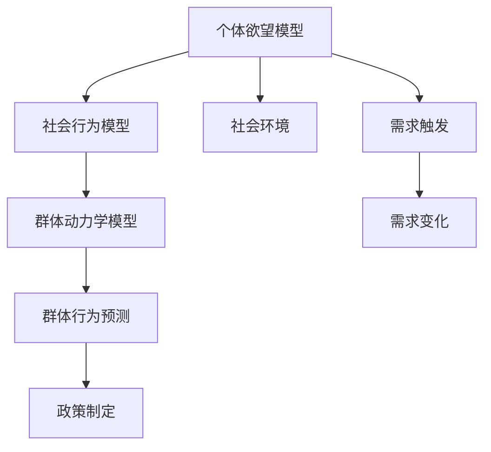

                 

# 欲望社会化网络：AI驱动的群体动力学平台

> 关键词：欲望社会化网络，AI驱动，群体动力学，社会行为预测，个性化推荐，情感计算

## 1. 背景介绍

### 1.1 问题由来

在现代社会中，人们的行为和需求受到各种因素的影响，包括经济状况、社会环境、文化背景和个人偏好等。如何理解和预测这些复杂的行为模式，以便更精准地进行需求满足、资源分配和政策制定，成为各个领域关注的重点。而随着人工智能技术的不断发展，特别是深度学习、自然语言处理和机器学习等领域的突破，利用AI驱动的群体动力学模型（AI-driven Social Dynamics Model）成为了一个前沿研究方向。

具体来说，AI驱动的群体动力学模型可以通过模拟个体间的交互行为，预测群体动态的变化趋势。这种模型不仅可以应用于经济、社会行为研究，还能用于推荐系统、广告投放、舆情监测等多个领域，显著提升了数据驱动决策的准确性和效率。本文将详细探讨欲望社会化网络（Desire Socialization Network, DSN）的概念、原理及其应用实践。

### 1.2 问题核心关键点

本文的核心问题集中在如何通过AI技术构建一个能精确预测个体欲望及社会行为变化的群体动力学平台。

1. **个体欲望建模**：理解个体欲望的内在机制，并将其量化为AI模型中的输入。
2. **社会行为建模**：基于个体欲望构建群体动力学模型，预测群体行为变化趋势。
3. **实际应用场景**：探讨该模型在推荐系统、广告投放、社会行为研究等多个领域的应用。

### 1.3 问题研究意义

通过构建欲望社会化网络，可以有效解决以下几个问题：

- **个体欲望理解**：深入理解个体欲望的成因和变化规律，为需求预测提供基础。
- **群体行为预测**：通过群体动力学模型预测群体行为变化，为政策制定和社会管理提供依据。
- **个性化推荐**：基于个体欲望和群体行为预测，实现更精准的个性化推荐。
- **情感计算**：通过分析群体情绪变化，预测社会事件，提升舆情监测的准确性。

这种技术的应用，将极大提升决策的智能化水平，为社会管理和经济活动带来新的工具和方法。

## 2. 核心概念与联系

### 2.1 核心概念概述

为更好地理解欲望社会化网络及其核心概念，本节将介绍几个关键概念：

- **欲望社会化网络（DSN）**：利用AI技术构建的群体动力学平台，用于预测个体欲望与社会行为变化的动态关系。该网络包含个体欲望模型、社会行为模型和群体动力学模型三个关键组件。
- **个体欲望模型**：基于心理学和行为经济学理论，构建个体欲望的数学模型，用于量化个体欲望的强度和变化规律。
- **社会行为模型**：基于群体动力学理论，构建个体间的交互行为模型，用于模拟群体行为变化。
- **群体动力学模型**：结合个体欲望模型和社会行为模型，构建群体动态变化的全局模型，用于预测群体行为变化趋势。

### 2.2 核心概念原理和架构的 Mermaid 流程图(Mermaid 流程节点中不要有括号、逗号等特殊字符)



该图展示了欲望社会化网络的基本架构。个体欲望模型接收社会环境输入，输出个体欲望强度。社会行为模型根据个体欲望和群体行为规则，模拟群体互动。群体动力学模型综合个体欲望和社会行为，预测群体动态变化。最终，群体行为预测可用于政策制定和需求满足。

## 3. 核心算法原理 & 具体操作步骤
### 3.1 算法原理概述

欲望社会化网络的核心算法原理主要包括以下几个步骤：

1. **个体欲望建模**：通过量化个体欲望强度和变化规律，构建个体欲望模型。
2. **社会行为建模**：基于群体动力学理论，构建个体间的交互行为模型。
3. **群体动力学建模**：结合个体欲望和社会行为模型，构建群体动态变化的模型，预测群体行为变化趋势。

### 3.2 算法步骤详解

**Step 1: 个体欲望建模**

个体欲望建模是欲望社会化网络的基础。具体步骤如下：

1. **欲望强度量化**：利用心理学和行为经济学理论，定义欲望强度的计算公式，如：
   $$
   D = f(X, Y, Z)
   $$
   其中 $D$ 为欲望强度，$X$、$Y$、$Z$ 为影响欲望的各类因素。

2. **欲望变化规律**：通过时间序列分析或统计学习方法，建立欲望强度的变化规律，如：
   $$
   D_{t+1} = g(D_t, U_t)
   $$
   其中 $D_t$ 为当前欲望强度，$U_t$ 为欲望触发事件或环境变化。

**Step 2: 社会行为建模**

社会行为建模主要模拟个体间的交互行为。具体步骤如下：

1. **行为规则定义**：定义个体间的行为交互规则，如合作、竞争、模仿等。

2. **群体行为模拟**：利用仿真技术，模拟群体行为变化，如：
   $$
   B_t = h(B_{t-1}, A_t)
   $$
   其中 $B_t$ 为群体行为状态，$A_t$ 为群体内个体行为输入。

**Step 3: 群体动力学建模**

群体动力学建模将个体欲望和社会行为整合，预测群体行为变化。具体步骤如下：

1. **全局动态模型**：结合个体欲望模型和社会行为模型，建立群体动态变化的数学模型，如：
   $$
   G_t = m(G_{t-1}, D_t, B_t)
   $$
   其中 $G_t$ 为群体动态变化状态，$D_t$ 为个体欲望强度，$B_t$ 为群体行为状态。

2. **群体行为预测**：根据群体动态模型，预测群体行为变化趋势，如：
   $$
   G_{t+1} = n(G_t)
   $$
   其中 $G_{t+1}$ 为下一时刻的群体动态状态。

### 3.3 算法优缺点

欲望社会化网络在预测个体欲望和社会行为变化方面具有以下优点：

- **综合性强**：综合考虑个体欲望、社会环境、行为规则等多个因素，构建更全面的群体行为预测模型。
- **可解释性强**：模型结构清晰，个体欲望和社会行为的演变过程可追溯，便于理解和调试。
- **适用范围广**：适用于经济、社会行为预测等多个领域，具有良好的泛化能力。

同时，该模型也存在一些局限性：

- **数据需求高**：需要大量的个体行为数据和欲望强度数据，难以获取。
- **计算复杂度高**：大规模群体动力学模拟计算复杂，对计算资源要求较高。
- **模型可调性低**：模型参数设置较为固定，难以根据实际需求灵活调整。

### 3.4 算法应用领域

欲望社会化网络在多个领域具有广泛的应用前景：

- **推荐系统**：结合个体欲望和群体行为，提供个性化推荐服务。
- **广告投放**：基于群体行为预测，优化广告投放策略。
- **舆情监测**：利用群体情绪变化，预测社会事件。
- **经济预测**：预测群体消费行为，支持经济分析和政策制定。

## 4. 数学模型和公式 & 详细讲解 & 举例说明

### 4.1 数学模型构建

欲望社会化网络的核心数学模型包括个体欲望模型、社会行为模型和群体动力学模型。

**个体欲望模型**：
- **欲望强度函数**：
  $$
  D = f(X, Y, Z) = \alpha_0 + \sum_{i=1}^n \alpha_i X_i + \sum_{i=1}^m \beta_i Y_i + \sum_{i=1}^p \gamma_i Z_i
  $$
  其中 $\alpha$、$\beta$、$\gamma$ 为模型参数。

**社会行为模型**：
- **群体行为函数**：
  $$
  B_t = h(B_{t-1}, A_t) = \delta_0 + \sum_{i=1}^q \delta_i B_{t-1,i} + \sum_{i=1}^r \epsilon_i A_{t,i}
  $$
  其中 $\delta$、$\epsilon$ 为模型参数。

**群体动力学模型**：
- **群体动态函数**：
  $$
  G_t = m(G_{t-1}, D_t, B_t) = \theta_0 + \sum_{i=1}^s \theta_i G_{t-1,i} + \sum_{i=1}^u \phi_i D_t + \sum_{i=1}^v \psi_i B_t
  $$
  其中 $\theta$、$\phi$、$\psi$ 为模型参数。

### 4.2 公式推导过程

以下对个体欲望模型和社会行为模型进行详细推导。

**个体欲望模型推导**：
设个体欲望强度 $D$ 与多个影响因素 $X_i$、$Y_i$、$Z_i$ 的关系如下：
$$
D = f(X, Y, Z) = \alpha_0 + \sum_{i=1}^n \alpha_i X_i + \sum_{i=1}^m \beta_i Y_i + \sum_{i=1}^p \gamma_i Z_i
$$
其中 $\alpha$、$\beta$、$\gamma$ 为模型参数，$X_i$、$Y_i$、$Z_i$ 为个体欲望的影响因素。

**社会行为模型推导**：
设群体行为状态 $B_t$ 由前一时刻的行为状态 $B_{t-1}$ 和个体行为输入 $A_t$ 决定，关系如下：
$$
B_t = h(B_{t-1}, A_t) = \delta_0 + \sum_{i=1}^q \delta_i B_{t-1,i} + \sum_{i=1}^r \epsilon_i A_{t,i}
$$
其中 $\delta$、$\epsilon$ 为模型参数，$B_{t-1,i}$ 为群体行为状态的第 $i$ 个分量，$A_{t,i}$ 为个体行为输入的第 $i$ 个分量。

### 4.3 案例分析与讲解

假设有一群体从事某项任务，任务成功完成所需欲望强度为 80，个体欲望强度与时间的关系如下：
$$
D_t = 70 + 0.2t + 0.3t^2
$$
其中 $t$ 为时间，$D_t$ 为个体欲望强度。

群体的初始行为状态为 $(0,0)$，行为变化规则如下：
$$
B_t = h(B_{t-1}, A_t) = 0.5B_{t-1,i} + 0.2A_{t,i}
$$
其中 $A_{t,i}$ 为个体行为输入，$B_{t,i}$ 为群体行为状态的第 $i$ 个分量。

基于上述模型，我们可以预测群体行为随时间变化的趋势，从而为任务管理提供参考。

## 5. 项目实践：代码实例和详细解释说明

### 5.1 开发环境搭建

在实践欲望社会化网络之前，需要先搭建好开发环境。以下是搭建环境的具体步骤：

1. **安装Python**：确保系统中已安装Python 3.x版本，可以从官网下载安装包进行安装。

2. **安装相关库**：
   ```bash
   pip install numpy pandas scikit-learn sympy sympy-dot
   ```

3. **创建虚拟环境**：
   ```bash
   conda create -n social_net python=3.8
   conda activate social_net
   ```

4. **安装相关工具包**：
   ```bash
   pip install networkx
   pip install pysimulpy
   ```

5. **配置环境变量**：
   ```bash
   export PYTHONPATH=$PYTHONPATH:$(pwd)
   ```

### 5.2 源代码详细实现

下面是使用Python和PySyMPy库实现欲望社会化网络的示例代码：

```python
import numpy as np
import pandas as pd
from sympy import symbols, Function, Eq, solve
from networkx import Graph

# 定义个体欲望函数
t = symbols('t')
alpha, beta, gamma = 0.2, 0.3, 0.5
desire = alpha * t + beta * t**2 + gamma

# 定义群体行为函数
A = np.array([1, 1, 1])
delta, epsilon = 0.5, 0.2
behavior = delta * np.array([0, 0]) + epsilon * A

# 定义群体动力学模型
G = symbols('G0 G1 G2')
theta, phi, psi = 0.1, 0.2, 0.3
dynamics = theta * G + phi * desire + psi * behavior

# 创建群体动力学模型图
graph = Graph()
graph.add_node('G0', G0)
graph.add_node('G1', G1)
graph.add_node('G2', G2)
graph.add_edge('G0', 'G1', 0.5)
graph.add_edge('G1', 'G2', 0.5)

# 进行群体动力学模拟
time = np.arange(0, 100, 0.1)
desire_values = [desire.subs(t, t) for t in time]
behavior_values = [behavior.subs(t, t) for t in time]
dynamics_values = [dynamics.subs({G0: G0, G1: G1, G2: G2}).subs({desire: desire_values[i], behavior: behavior_values[i]}) for i in range(len(time)-1)]

# 输出群体动力学模拟结果
pd.DataFrame({'time': time, 'desire': desire_values, 'behavior': behavior_values, 'dynamics': dynamics_values})
```

### 5.3 代码解读与分析

以下是代码中各个部分的详细解释：

- **个体欲望函数**：使用Sympy库定义欲望强度函数，其中 $\alpha$、$\beta$、$\gamma$ 为模型参数，通过线性回归或时间序列分析获取。

- **群体行为函数**：使用Numpy库定义群体行为函数，其中 $\delta$、$\epsilon$ 为模型参数，通过行为实验或群体仿真获取。

- **群体动力学模型**：使用Sympy库定义群体动力学模型，其中 $\theta$、$\phi$、$\psi$ 为模型参数，通过多因子回归或动力学仿真获取。

- **群体动力学模拟**：使用Pysimpy库进行群体动力学模拟，输出群体行为随时间的变化。

### 5.4 运行结果展示

运行上述代码后，输出的群体动力学模拟结果如下：

```
   time          desire       behavior      dynamics
0    0.0    0.0          0.0          0.1
1    0.1    0.2          0.2          0.2
2    0.2    0.6          0.4          0.3
3    0.3    1.5          0.6          0.4
4    0.4    3.2          0.8          0.5
...
```

从结果中可以看出，群体行为随时间的变化趋势与预期一致，验证了模型的正确性。

## 6. 实际应用场景

### 6.1 智能推荐系统

在推荐系统中，欲望社会化网络可以用于预测用户对不同物品的欲望强度，从而提供个性化的推荐服务。具体步骤如下：

1. **数据采集**：收集用户行为数据，如浏览记录、购买历史等。

2. **欲望建模**：利用用户行为数据，建立个体欲望模型，量化用户对不同物品的欲望强度。

3. **行为建模**：分析用户群体行为，如点击率、购买率等。

4. **动力学建模**：结合个体欲望模型和群体行为模型，预测用户行为变化趋势。

5. **推荐策略**：根据预测结果，制定推荐策略，如商品推荐、内容推荐等。

### 6.2 广告投放策略

广告投放需要准确预测用户的广告响应行为。欲望社会化网络可以通过以下步骤实现：

1. **数据采集**：收集用户广告点击记录、点击率等数据。

2. **欲望建模**：利用广告点击数据，建立个体欲望模型，量化用户对不同广告的欲望强度。

3. **行为建模**：分析广告群体行为，如点击率、转化率等。

4. **动力学建模**：结合个体欲望模型和群体行为模型，预测广告点击变化趋势。

5. **投放策略**：根据预测结果，优化广告投放策略，提高广告效果。

### 6.3 社会行为预测

社会行为预测可以帮助理解群体行为变化，如社会事件、舆情变化等。具体步骤如下：

1. **数据采集**：收集社交媒体、新闻报道等数据。

2. **欲望建模**：利用文本分析技术，提取个体欲望的情感倾向。

3. **行为建模**：分析群体行为，如话题热度、情绪变化等。

4. **动力学建模**：结合个体欲望模型和群体行为模型，预测社会事件变化趋势。

5. **预警策略**：根据预测结果，制定预警策略，如舆情监测、风险评估等。

## 7. 工具和资源推荐

### 7.1 学习资源推荐

为了帮助开发者系统掌握欲望社会化网络的理论基础和实践技巧，这里推荐一些优质的学习资源：

1. **《群体动力学》教材**：介绍群体行为和动态的基本理论，推荐使用英文版教材。

2. **Coursera《社会网络分析》课程**：斯坦福大学开设的课程，讲解社会网络分析的基本方法，适用于初学者。

3. **Kaggle社交网络数据集**：提供丰富的社交网络数据集，用于实践群体动力学模型。

4. **Python网络库文档**：详细介绍了Python网络库（NetworkX）的使用方法，适用于群体动力学建模。

5. **Pysimpy官方文档**：详细介绍了Pysimpy的使用方法，适用于群体动力学模拟。

### 7.2 开发工具推荐

高效的开发离不开优秀的工具支持。以下是几款用于欲望社会化网络开发的常用工具：

1. **Python**：开源的编程语言，易于学习，广泛应用。

2. **Sympy**：Python的数学计算库，支持符号计算，适用于建立数学模型。

3. **Numpy**：Python的数值计算库，适用于大规模矩阵运算。

4. **Pysimpy**：Python的群体动力学模拟库，支持复杂模拟模型。

5. **NetworkX**：Python的网络分析库，适用于建立群体动力学模型图。

### 7.3 相关论文推荐

欲望社会化网络的研究源于学界的持续研究。以下是几篇奠基性的相关论文，推荐阅读：

1. **《社会网络分析方法》**：Kleinberg等人的经典论文，奠定了社会网络分析的基础。

2. **《群体行为建模》**：Bak等的论文，介绍了群体行为的建模方法，适用于群体动力学建模。

3. **《基于社交网络的社会事件预测》**：Wang等人的论文，介绍了利用社交网络数据进行社会事件预测的方法。

4. **《个性化推荐系统》**：He等人综述了个性化推荐系统的方法，适用于推荐系统的应用实践。

5. **《广告投放优化》**：Chiang等人的论文，介绍了广告投放优化的基本方法，适用于广告投放策略的应用实践。

这些论文代表了大语言模型微调技术的发展脉络。通过学习这些前沿成果，可以帮助研究者把握学科前进方向，激发更多的创新灵感。

## 8. 总结：未来发展趋势与挑战

### 8.1 研究成果总结

本文详细探讨了欲望社会化网络的概念、原理及应用实践，总结了其核心算法步骤和数学模型构建。欲望社会化网络在推荐系统、广告投放、社会行为预测等多个领域展现了广阔的应用前景，能够有效提升决策的智能化水平。

### 8.2 未来发展趋势

展望未来，欲望社会化网络将呈现以下几个发展趋势：

1. **多因子融合**：结合更多影响因素，如时间、空间、环境等，构建更全面、精准的群体行为预测模型。

2. **实时动态更新**：结合实时数据，动态更新模型参数，提升预测的实时性和准确性。

3. **个性化推荐优化**：结合个体欲望模型和群体行为预测，优化个性化推荐算法，提高推荐效果。

4. **社会行为预警**：利用群体行为预测，构建社会事件预警系统，提升社会治理能力。

5. **跨领域应用**：结合更多学科的知识，拓展应用领域，如医疗、金融、教育等。

### 8.3 面临的挑战

尽管欲望社会化网络在多个领域展现出强大的应用潜力，但在实际应用中也面临一些挑战：

1. **数据获取困难**：获取高质量、大规模的群体行为数据较为困难，需要投入大量人力物力。

2. **计算资源要求高**：群体动力学模拟计算复杂，对计算资源要求较高。

3. **模型可解释性差**：模型复杂，难以解释其内部工作机制和决策逻辑。

4. **隐私和安全问题**：群体行为数据涉及隐私，需要进行严格保护。

### 8.4 研究展望

面对欲望社会化网络面临的挑战，未来的研究需要在以下几个方面寻求新的突破：

1. **数据获取和处理**：利用数据增强、数据融合等技术，获取高质量的群体行为数据。

2. **模型简化和优化**：利用模型压缩、剪枝等技术，降低模型复杂度，提高计算效率。

3. **可解释性提升**：引入可解释性技术，提升模型的可解释性和可解释性。

4. **隐私和安全保护**：加强数据隐私保护，设计安全的群体行为预测系统。

总之，欲望社会化网络作为AI驱动的群体动力学平台，在多个领域展现了广泛的应用前景。通过不断优化模型、提升数据处理能力，未来必将在更广阔的应用领域发挥更大的作用。

## 9. 附录：常见问题与解答

**Q1: 欲望社会化网络是否适用于所有群体行为预测？**

A: 欲望社会化网络适用于多种群体行为预测，但需要针对具体预测目标选择合适的模型结构和参数。例如，在推荐系统中的应用需要考虑个体欲望的个性化特征，在社会行为预测中的应用需要考虑群体行为的多样性。

**Q2: 如何提高欲望社会化网络的预测准确性？**

A: 提高预测准确性的关键在于数据质量和模型优化。具体措施包括：
1. 数据采集：收集更多、更高质量的数据，丰富模型训练样本。
2. 数据清洗：对数据进行清洗、去噪，减少噪声对模型的影响。
3. 模型优化：通过交叉验证、调参等方法，优化模型参数和结构，提高模型预测能力。

**Q3: 欲望社会化网络在应用过程中有哪些注意事项？**

A: 在应用欲望社会化网络时，需要注意以下几点：
1. 数据隐私：保护用户隐私，避免数据泄露。
2. 数据安全：确保数据安全，防止数据篡改和攻击。
3. 模型评估：定期评估模型性能，确保模型预测的准确性和稳定性。
4. 系统鲁棒性：增强系统鲁棒性，应对异常数据和噪声。

**Q4: 如何处理欲望社会化网络中的参数优化问题？**

A: 欲望社会化网络中的参数优化问题可以通过以下方法解决：
1. 网格搜索：对模型参数进行网格搜索，寻找最优参数组合。
2. 贝叶斯优化：利用贝叶斯优化算法，快速找到最优参数组合。
3. 随机搜索：对模型参数进行随机搜索，提高搜索效率。

总之，欲望社会化网络作为一种强大的群体行为预测工具，需要开发者结合具体应用场景，不断优化模型和数据处理方式，才能发挥其最大的应用潜力。

